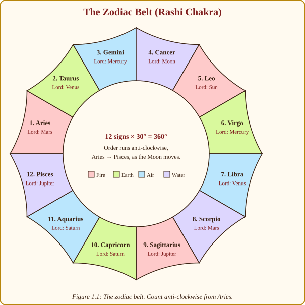
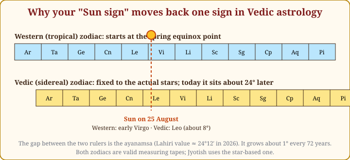
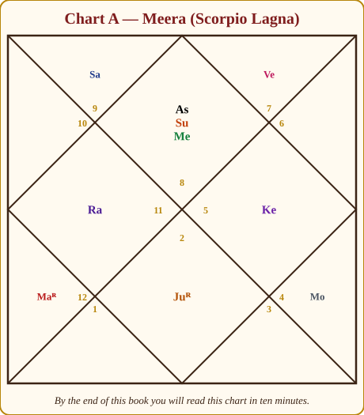
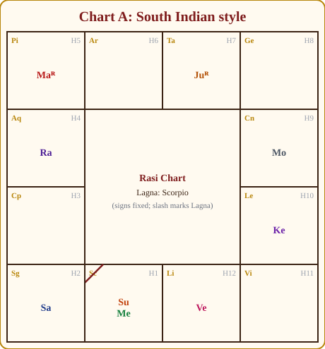

# Chapter 1: Welcome. Why the Books Confused You, and How This One Won't

Sit down. Make some chai. Let me tell you what happened to you, because it happened to me first.

You bought the classics. Maybe *Brihat Parashara Hora Shastra* in two fat volumes, maybe a famous modern author, maybe a stack of PDFs from an online course. You opened page one and were hit by forty Sanskrit words, a table of degrees, and a sentence like "the lord of the Lagna in the eighth in a dusthana aspected by a maraka gives…". You closed it. You felt stupid. You are not stupid.

Here is the secret nobody tells beginners: **those books were never written for beginners.** Parashara was dictating to his student Maitreya, who already knew the sky. The modern books mostly copy the old ones and add lists. Lists of "Saturn in the 7th house gives…", "Sun in the 3rd house gives…". You memorise 108 lists, forget 100 of them, and still cannot read a chart, because nobody taught you *why* Saturn in the 7th gives what it gives.

I know because I did exactly this. I had the notebook of lists. I had the highlighters. What I did not have was a single reason, and without reasons nothing stayed. The day things changed for me was the day I stopped asking "what does this placement give?" and started asking "why would it give that?" Every time I found the why, the rule stuck forever, and usually three other rules fell into place with it.

Astrology is not a memory game. It is a **language with a small grammar**. Nine planets, twelve signs, twelve houses, twenty-seven stars. That is the whole alphabet. Once you understand how the pieces *combine*, you never need a list again, because you can derive any list yourself, in your head, while the chart is still loading on your phone.

This book teaches the grammar. Every rule comes with the reason behind it, a picture, a story, and a worked example. By the last chapter you will read a full chart, time events with dashas, answer the five questions everyone asks (career, money, marriage, health, children), give remedies with humility, and know what to say and what never to say to a person who trusts you with their birth details. And if you never read for anyone but yourself and your family, you will still understand your own life a great deal better. That was my real reason for writing this, and I said so in the letter at the front.

> **🧭 Anushka's rule of thumb:** If you cannot explain a rule to a twelve-year-old with a drawing and a reason, you do not yet understand it. I hold myself to this in every chapter, and I will show you the reason every time.

## What astrology actually claims (and what it does not)

Let us be honest with each other from the first page, because honesty is what will make people trust you.

Jyotish, the Sanskrit word means "the science of light", is an ancient system that reads the positions of the Sun, Moon and planets at the moment of your birth as a **map of tendencies**. Not a script. A map. It says: this road is downhill, that one is uphill, there is a bridge at age thirty-two. It does not say you must walk. The tradition itself is clear about this: the chart shows *prarabdha* karma, the portion of your past actions that has ripened for this life, and it always leaves room for *kriyamana* karma, what you do now.

> **🔍 Why?** This is the tradition's own reasoning, not my softening of it. The classical view divides karma into three: *sanchita* (the whole store), *prarabdha* (the part allotted to this life) and *kriyamana* (what you are creating now). A birth chart can only show the allotted part, so by the system's own logic it cannot be a complete script. Everyday parallel: your school timetable tells you which classes you have this year. It does not tell you whether you will pay attention in them.

So when someone asks "Will I get the job?", the honest astrologer does not say yes or no like a coin toss. She says: "Your career house is being activated this year, and the timing is strong from March. Apply. Push. The wind is behind you." That is prediction in the Jyotish sense, and, you will find, it is also what actually helps people.

> **💡 Did you know?** *Jyotisha* is one of the six *Vedangas*, the "limbs of the Veda". Its original job was timekeeping: fixing when to perform rituals by the Moon and stars. Predictive astrology (*Hora Shastra*) grew from that calendar science. The great texts, *Brihat Parashara Hora Shastra* (Parashara), *Brihat Jataka* (Varahamihira, 6th century CE, Ujjain), *Saravali* (Kalyana Varma), *Phaladeepika* (Mantreswara), *Jataka Parijata* (Vaidyanatha), are our textbooks even today.

## The sky as a clock

Forget mysticism for a moment and picture the sky as the world's oldest clock.

The Earth goes around the Sun once a year. From where we stand, it *looks* like the Sun slowly travels through a ring of background stars over the year. That ring is the **zodiac belt** (*Rashi Chakra*). Ancient astronomers divided the ring into twelve equal slices of 30° each and named them after the star-patterns roughly behind them: Aries the ram, Taurus the bull, and so on. Those twelve slices are the **signs** (*Rashis*).

*Figure 1.1: The zodiac belt. Twelve signs of 30° each make the full 360° circle. The order runs anti-clockwise, the same direction the Moon and planets move against the stars.*

Now, the Moon and the planets also travel along (or very near) this same ring. So at any moment, each planet is "in" some sign. The Moon takes about 2¼ days to cross a sign, the Sun a month, Jupiter a year, Saturn two and a half years. That gives us hands of different speeds on one clock face: a second hand, a minute hand, an hour hand, and a very slow hand that takes thirty years to go round.

> **🔍 Why do the planets all travel along the same ring?** Astronomy. The planets orbit the Sun in nearly the same flat plane, like coins lying on one table. Seen from Earth, which is also on that table, they all appear to move along one narrow band of sky. The Moon's orbit is tilted only about 5° from it. Everyday parallel: cars on a ring road. They move at different speeds, but they are all on the same road, so you always know which stretch each one is on.

A **birth chart** (*kundali* or *janma patrika*) is simply a photograph of this clock at the minute you were born, taken from the place you were born.

Why the place? Because of the last ingredient, the one that makes your chart yours and not everyone-born-that-day's: the horizon. As the Earth spins, a new sign rises in the east roughly every two hours. The sign rising on the eastern horizon at your birth is the **rising sign** (*Lagna*, also called the ascendant). It sets the frame of your whole chart. Two babies born on the same day in different hours, or in Chennai and in London at the same clock time, have different Lagnas and different charts.

> **🔍 Why every two hours?** Astronomy again. The Earth turns 360° in 24 hours, so the whole zodiac rises over the eastern horizon once a day: 12 signs in 24 hours, about one sign every 2 hours (a little more or less depending on the sign and your latitude). Everyday parallel: a Ferris wheel with twelve cabins turning once a day. Which cabin is at the loading platform depends on the exact minute you look. The Sun tells you the month you were born, the Moon narrows it to the day, but only the Lagna knows the hour.

> **🧭 Anushka's rule of thumb:** The Sun tells you the *month*, the Moon tells you the *day*, the Lagna tells you the *hour*. A chart without an accurate birth time is a photo without focus.

## Why your "Sun sign" moved

The first shock for anyone coming from newspaper horoscopes: "But I'm a Virgo! This app says my Sun is in Leo!"

Both are right; they are using different rulers. Western astrology anchors the start of Aries to the **spring equinox point**, which slowly drifts backwards against the stars because of a wobble in the Earth's axis (called precession). Vedic astrology anchors Aries to the **actual stars**. The two rulers were aligned around 285 CE; today they differ by roughly 24 degrees, almost a whole sign. The gap is called the **ayanamsa**.

*Figure 1.2: The same Sun on the same day lands in a different sign depending on which ruler you hold against the sky. Jyotish uses the star-fixed (sidereal) ruler.*

> **🔍 Why does the equinox drift?** The Earth's axis wobbles like the axis of a spinning top that is slowing down, taking about 25,800 years for one full wobble. That shifts the equinox point backwards through the stars by about 1° every 72 years. Western astrology chose the seasons as its anchor; Jyotish chose the stars. Neither is wrong; they measure different things. Everyday parallel: two friends give directions to the same shop, one saying "third door from the temple" and the other "third door from the bus stop". Both are correct, but only if you know which landmark they started from.

Which ayanamsa value? Indian astrologers overwhelmingly use **Lahiri** (also called Chitrapaksha), adopted by the Government of India's Calendar Reform Committee in 1955. Set your software to Lahiri and never think about it again. Do not mix systems: a chart made with one ayanamsa and read with another will put planets in the wrong signs.

> **💡 Did you know?** In roughly 2,000 years the two zodiacs will be a full sign apart, and Western astrology's "Aries" will sit entirely on the stars of Pisces. Vedic astrologers say: this is exactly why we tied our zodiac to the stars.

## Meet the cast: a royal court

The nine "planets" (*Grahas*, the word means "that which grasps") are not all planets in the astronomer's sense. Two are luminaries (Sun and Moon), five are true planets (Mars, Mercury, Jupiter, Venus, Saturn), and two are mathematical points (Rahu and Ketu), the places where the Moon's path crosses the Sun's, which is why eclipses happen only near them. Astrology treats all nine as *actors*.

The old texts describe them as a royal court, and I have never found a better way to hold them in mind:

| Graha | Role in the court | In one word |
|---|---|---|
| Sun (Surya) | The King | Authority |
| Moon (Chandra) | The Queen Mother | Mind |
| Mars (Mangala) | The Commander of the army | Energy |
| Mercury (Budha) | The clever young Prince, the secretary | Intellect |
| Jupiter (Guru) | The Royal Priest and minister | Wisdom |
| Venus (Shukra) | The Minister of Pleasure and the arts | Love |
| Saturn (Shani) | The old Judge of Labour | Discipline |
| Rahu | The smoke-headed Stranger at the gate | Obsession |
| Ketu | The headless Sadhu | Detachment |

> **📖 Story: The court assembles.** Picture a kingdom. The **King** (Sun) sits on the throne, proud, warm, impossible to ignore; when he is strong the whole court has confidence, and when he is weak nobody knows who is in charge. Beside him the **Queen Mother** (Moon) runs the household and knows every servant's troubles; she is the mood of the palace, changing a little every day. The **Commander** (Mars) guards the gates and starts the fights. The clever young **Prince** (Mercury) writes the letters and counts the money. The **Royal Priest** (Jupiter) advises, blesses and teaches the children. The **Minister of Pleasure** (Venus) arranges music, weddings and comfort. The old **Judge of Labour** (Saturn), once the King's neglected son, keeps the accounts of every debt and lets nobody leave until the work is done. At the gate stand two strangers: **Rahu**, a smoke-headed traveller who wants everything he sees, and **Ketu**, a headless sadhu who wants nothing at all. Every chart you will ever read is a story about which of these nine sits in which room of the palace, and who is on speaking terms with whom. **Rule:** learn the nine characters first; the rest of astrology is watching them interact.

> **🔍 Why a court and not just a list?** Because the tradition itself built the meanings this way. Parashara and Varahamihira call the Sun and Moon the royals, Mars the commander, Mercury the prince, Jupiter and Venus the ministers, Saturn the servant. The friendships and enmities you will learn in Chapter 3 follow from these roles, so when you know the court you can *derive* the table instead of memorising it. Everyday parallel: you do not memorise who gets along in your office; you know it from what each person's job makes them want.

Every planet "owns" one or two signs; those are its home ground. Every planet also has a sign where it feels strongest (its **exaltation**) and one where it feels weakest (its **debilitation**). We will go through each planet's personality slowly in Chapter 3. For now, just meet them.

## The stage: twelve rooms of a house

If the planets are the actors and the signs are their costumes, the **houses** (*Bhavas*) are the rooms where the drama plays out. There are twelve houses, counted from the Lagna. The Lagna sign is the 1st house; the next sign is the 2nd house; and so on around.

Each house governs an area of life. The 1st is you and your body. The 2nd is wealth, speech and family. The 4th is mother, home and inner peace. The 7th is marriage and partnerships. The 10th is career. The 12th is loss, sleep and foreign lands. Chapter 4 walks through all twelve with the logic behind each meaning, and there *is* logic; the houses are not random.

> **🔍 Why is the 1st house "you" and the 7th "the partner"?** Because the houses are laid out on the sky at your birth. The 1st house is the eastern horizon, where the sky is rising: the beginning, the self coming into the world. The 7th is the western horizon directly opposite: what faces you, the other person. The 10th is the top of the sky at noon, where everything is visible: your public work. The 4th is the bottom, hidden underfoot: home, mother, the private foundation. Four of the twelve meanings come straight from the four directions of the sky; the rest are derived from these (Chapter 4). Everyday parallel: in a house the front door is where you meet the world, the room facing it is where guests sit, the roof is what the neighbours see, and the foundation is what nobody sees but everything rests on.

Here is how the three layers stack:

- **Planet** = *who* is acting (Mars: energy, aggression, courage).
- **Sign** = *how* they behave, their mood and costume (Mars in Cancer: energy that turns emotional and defensive).
- **House** = *where in life* the action lands (Mars in Cancer in the 4th house: that emotional energy plays out at home, with mother, in matters of property).

Once this three-layer idea clicks, half the "lists" in the old books become obvious. Saturn in the 7th "delays marriage" not because a book says so but because Saturn is delay and the 7th is marriage. You could have written that line yourself.

## Reading your first chart (just looking, no pressure)

Below is Chart A. I call her Meera; she is a composite, born in Jaipur in December 1988 at 6:40 in the morning. We will meet her again and again through the book.

*Figure 1.3: Chart A in the North Indian format. The top diamond is always the 1st house. Houses run anti-clockwise. The small gold numbers are the sign numbers (8 = Scorpio) sitting in each house.*

Look at the picture and simply notice things. The top diamond is her 1st house, the Lagna; the number 8 tells you the sign there is Scorpio. She has two planets in that house, Sun and Mercury. Her Moon sits in the 9th house (bottom right corner of the diamond, sign 4 = Cancer). Jupiter sits opposite the Lagna in the 7th house. That is already three sentences about her: a strong, articulate personality (Sun and Mercury in the 1st); an emotional mind that finds comfort in wisdom and faith (Moon in Cancer in the 9th); a marriage partner who is learned or a teacher (Jupiter in the 7th). You will be able to defend every one of those sentences, with reasons, by Chapter 5.

Indian astrologers draw the same chart in two main styles. Above is the **North Indian** diamond: houses are fixed in position and the signs move. Below is the **South Indian** grid: signs are fixed in position and you find the Lagna by the diagonal mark.

*Figure 1.4: The same chart in the South Indian format. Pisces is always top-left; the signs run clockwise; the slash marks the Lagna in Scorpio.*

> **🔍 Why two styles?** Because they answer two different first questions. The North Indian chart asks "what is in my 1st house, my 2nd house…?", so it keeps the houses still and lets the signs rotate into them. The South Indian chart asks "where is Aries, where is Taurus…?", so it keeps the signs still and marks where the Lagna fell. Same sky, two filing systems. Everyday parallel: one railway timetable is sorted by platform, another by train; both list the same trains.

Neither is "correct". North India, Nepal, and most Hindi-speaking practitioners use the diamond; Tamil Nadu, Kerala, Karnataka and Andhra use the grid; Bengal and Odisha have their own variant. Learn to read both, because people bring you whatever their family astrologer made. I use the North Indian style throughout this book and show the South Indian version wherever it teaches something.

> **⚠️ Common beginner mistake:** In the North Indian chart, the numbers inside the houses are **sign numbers**, not house numbers. The house numbers never change (top diamond = 1, then anti-clockwise). The sign numbers change with every Lagna. Half of all beginner errors come from mixing these two up. I made this mistake for weeks.

## Your toolkit: software, not arithmetic

Not long ago an astrologer spent the first hour of any reading doing arithmetic with an almanac (*panchanga*) and logarithm tables. You do not have to. Any of these will cast an accurate chart in a second:

- **Jagannatha Hora** (free, Windows): the professional's workhorse; every divisional chart, every dasha.
- **Parashara's Light** (paid): the standard in many Indian institutes.
- **AstroSage / Drik Panchang / Kundli apps** (free, mobile): fine for beginners; check the ayanamsa is Lahiri.
- **Maitreya** (free, open source): clean and reliable.

Set: Lahiri ayanamsa, sidereal zodiac, whole-sign houses (the default in Jyotish: one sign = one house), and Vimshottari dasha. That is the configuration every chapter in this book assumes.

What you *must* still do by hand is **think**. Software gives you positions; it cannot judge, weigh, or speak kindly to a frightened person. That is the whole job, and this book is about that job.

## How to use this book

The book is in five parts, built to be read in order, because each chapter leans on the one before it.

1. **Part I, Foundations (Chapters 1 to 5):** signs, planets, houses, and how to read a chart's basic layout. Do not skip these even if you "know" them; the reasoning is the point.
2. **Part II, Core tools (Chapters 6 to 12):** aspects, the 27 nakshatras, which planets are good or bad *for your particular Lagna*, house lords, yogas, divisional charts, and planetary strength. This is where you become an astrologer.
3. **Part III, Timing (Chapters 13 to 17):** Vimshottari dasha, transits (including the famous Sade Sati), other dashas, the calendar (panchanga and muhurta), and horary questions.
4. **Part IV, Life questions (Chapters 18 to 21):** career and money, marriage and matching, health and longevity, children, education, property, travel, spirituality, organised the way people actually ask.
5. **Part V, Lal Kitab, remedies, and the consulting room (Chapters 22 to 25):** the distinct Lal Kitab system, clearly attributed; remedies with ethics; how to run a consultation (and how to use all this for yourself if you never consult); and three complete case studies from birth data to final advice.

At the back: Appendix A holds every table you will ever need at the desk (keep it open); a glossary; a reading list and cheat sheets; and the Story Bank, every memory story in the book gathered in one place for revision.

Watch for these recurring boxes:

> **🧭 Anushka's rule of thumb:** a heuristic worth memorising.

> **🔍 Why?** the reason behind a rule, with its kind named (astronomy, the system's own logic, a classical author, or tradition) and an everyday parallel. This is the box the first draft of this book lacked, and the one I most wish my own teachers had used.

> **📖 Story** boxes are memory stories. Lists do not stay; stories do. So every rule that is normally memorised, who is whose enemy, which conjunctions help, which planets serve which Lagna, comes with a short tale from the royal court and then the rule in one line. The cast never changes, so by Chapter 6 you will know these characters like family.

> **💡 Did you know?** an interesting fact: history, astronomy, culture.

> **⚠️ Common beginner mistake:** where students trip; read these twice.

> **🪔 Consultation tip:** how to phrase it to a real person, and the ethics of doing so.

> **📕 From Lal Kitab:** material drawn from *Lal Kitab* (Pt. Roop Chand Joshi, Urdu editions 1939 to 1952). Everything from that tradition lives **only** in these boxes, with the source stated, so you always know which system you are using. Mixing the two without labels is one of the biggest sources of confusion in today's online courses. *(Source: Lal Kitab, Pt. Roop Chand Joshi, 1939–1952 Urdu editions; Hindi translations vary.)*

> **✍️ Practice:** exercises at the end of every chapter, with answers. Do them. Reading about swimming has never kept anyone afloat.

Colour dots mark every judgement in every table: a green filled circle for good or friendly, an amber half circle for mixed or neutral, a red empty circle for difficult or hostile. The three shapes differ, so the meaning survives on a black-and-white screen too.

## A word about the voice in this book

I write as a practising astrologer who learned this the slow way, and the examples are drawn from ordinary life: friends' charts, family charts, my own, and composites of people I have read for. Every named person here is a composite, and the three case-study charts (Meera, Arjun, Devika) are constructed for teaching so that we can dissect them freely without exposing anyone's private life.

## Three promises, and one request

**Promise one:** no rule without a reason. If I cannot tell you *why* Saturn delays, I will not ask you to remember that it does.

**Promise two:** no fear. Astrology has been damaged by people who frighten others into buying stones. You will learn the remedies, and you will learn to offer them the way a good doctor offers a diet: gently, with reasons, without threats.

**Promise three:** no gatekeeping. There is nothing here you cannot learn. Sanskrit is a bonus, not an entry ticket.

**My request:** keep a notebook. Every time you meet a chart, a friend's, a relative's, your own, write three observations and one prediction with a date. Come back in a year. That notebook will teach you more than any book, including this one.

Let us begin with the twelve signs.

## In one breath

- The classics were written for students who already knew the sky; that is why they confused you, not because you lack ability.
- Jyotish reads the sky at your birth as a map of tendencies and timings, never as a fixed script; the tradition's own theory of karma says so.
- The zodiac is a 360° belt cut into twelve 30° signs; planets move through it at different speeds like clock hands, all on one ring because the solar system is flat.
- The Lagna (rising sign) is fixed by birth time and place because the Earth turns one sign past the horizon roughly every two hours; it makes the chart yours.
- Vedic astrology uses the star-fixed (sidereal) zodiac with the Lahiri ayanamsa; that is why your Sun sign shifts about one sign back from Western astrology.
- Planet = who, Sign = how, House = where. Every "list" in the old books is a combination of these three, and you can derive them yourself.
- The nine planets are a royal court: King, Queen Mother, Commander, Prince, Priest, Minister of Pleasure, Judge, and two strangers at the gate. Stories about them carry the rules; 🟢🟡🔴 dots mark good, mixed and difficult in every table.
- North Indian charts fix the houses; South Indian charts fix the signs. Learn to read both.
- Lal Kitab material appears only in marked boxes with its source stated.

## Practice

> **✍️ Practice:**
>
> 1. In Figure 1.3, which sign is in Meera's 4th house? Which planet sits there?
> 2. Meera's Jupiter is in the 7th house. Using the North Indian layout, which sign number is that, and what is the sign's name?
> 3. Your friend says, "I'm a Sagittarius Sun, born 5 December." In which sign would Vedic astrology most likely place their Sun? Why?
> 4. Write down, in one line each, what the Sun, Moon and Lagna each tell you about the timing of a birth, and the astronomical reason for each.
> 5. Set up a chart program with Lahiri ayanamsa and cast your own chart. Note your Lagna, your Moon sign, and how many planets sit in your 1st house. Keep it; we will use it all through the book.

Answers

1. The 4th house holds sign 11, Aquarius. Rahu sits there.
2. The 7th house shows sign 2, Taurus. (Scorpio is 8; count 8, 9, 10, 11, 12, 1, 2 for houses 1 to 7.)
3. Most likely Scorpio. The Vedic zodiac sits about 24° "later" than the Western one, so a Sun in the first two-thirds of Western Sagittarius falls in sidereal Scorpio. (A Sun born after about 16 December would be in sidereal Sagittarius.)
4. Sun: the month, because it moves one sign a month as the Earth orbits it. Moon: the day, because it moves one sign every 2¼ days in its 27-day orbit. Lagna: the hour, because the Earth's daily rotation brings a new sign over the eastern horizon roughly every two hours.
5. Your own answers. Keep the notebook.

