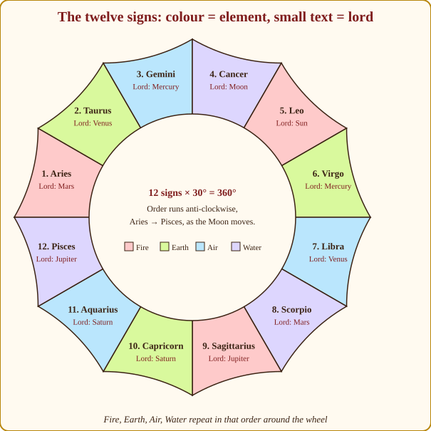
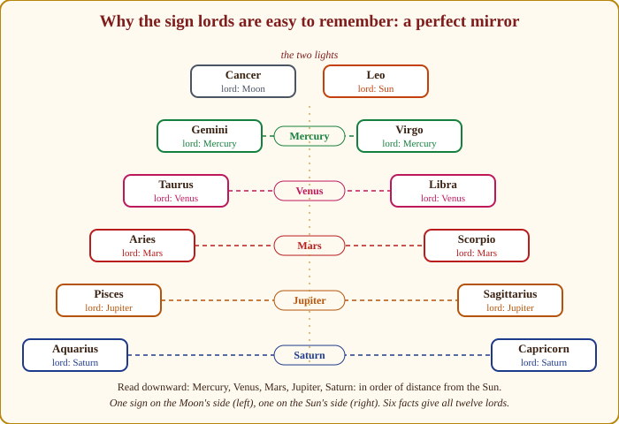
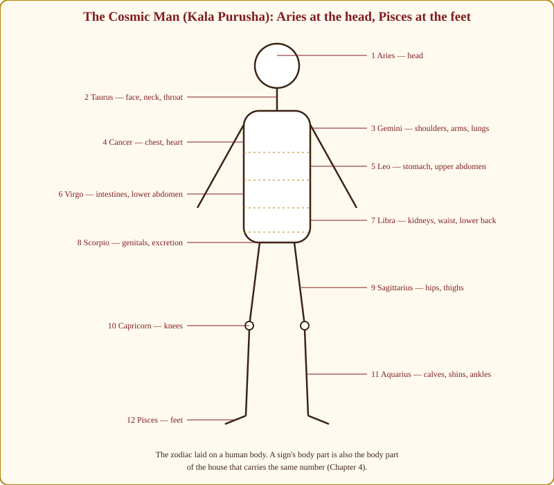
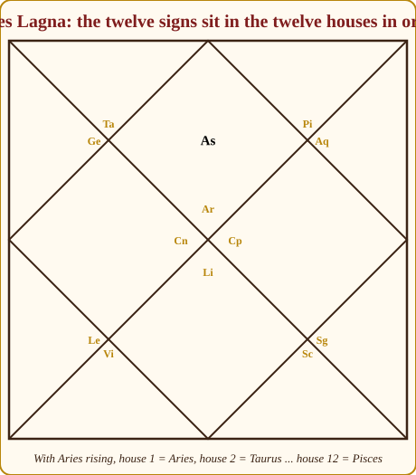

# Chapter 2: The Twelve Signs (Rashis) — The Costumes

When I was a boy, my grandfather would take me to the village Ramlila. The same actor played Ravana one night and Hanuman the next. Same man, same voice. But put him in the ten-headed costume and he strutted; put him in the monkey's tail and he leapt about. The costume changed how he behaved. It did not change who he was.

That is exactly what a sign does to a planet. Mars is always Mars — energy, courage, heat. But Mars dressed in Cancer is a soldier defending his mother's kitchen; Mars dressed in Capricorn is a general with a five-year plan. In Chapter 1 we said: planet = *who*, sign = *how*, house = *where*. This chapter is entirely about the *how*. If you learn the twelve costumes well, you will never again need to memorise "Mars in Cancer gives…" lists, because you will be able to feel the answer.

## What a sign actually is

Let me start with the plain astronomy, because everything else grows from it.

The Sun, Moon and planets all travel along roughly the same road through the sky — the ecliptic, the ring of background stars I called the zodiac belt in Chapter 1. The ancients cut that 360° ring into twelve equal slices of 30° each. Each slice is a **sign** (*Rashi*, which simply means "heap" or "group"). The slices are named after the star-pictures that sat roughly behind them when the system was fixed: the ram, the bull, the twins, and so on.

So when we say "the Moon is in Taurus", we mean only this: right now the Moon sits somewhere in the second 30° slice of the ring, between 30° and 60° measured from the start of Aries. Nothing mystical. A postal code.

Why does the postal code matter? Because each sign has a *lord* — a planet that owns it — and a temperament built from its element and its quality. A planet visiting a sign is a guest in that lord's house, wearing that house's dress code. A guest in a friend's home relaxes and does his best work; a guest in an enemy's home is on edge. That is the whole idea of sign strength, and we will make it precise in Chapter 3.

*Figure 2.1: The twelve signs. The colours show the four elements — fire, earth, air, water — which repeat in that order three times around the wheel. The small text under each name is the sign's lord.*

> **🧭 Guruji's rule of thumb:** A sign never *does* anything by itself. An empty sign is an empty costume on a hook. It matters only when a planet puts it on, or when it sits in a house and colours that house's affairs through its lord.

## The four elements: what kind of energy

Every sign belongs to one of four elements (*Tattvas*), and they repeat in a strict order around the wheel: fire, earth, air, water, fire, earth, air, water, fire, earth, air, water. Aries is fire, Taurus earth, Gemini air, Cancer water — and then Leo starts the cycle again with fire.

I teach the elements as four kinds of people you meet at any Indian wedding.

**Fire signs (Aries, Leo, Sagittarius)** are the uncle organising everything, loudly. Fire is initiative, heat, faith, ego, action before thought. Fire people want to *do*, to lead, to be seen. Their gift is courage and warmth; their trap is impatience and pride. Fire signs face east in the classical scheme — the direction of sunrise, of beginnings.

**Earth signs (Taurus, Virgo, Capricorn)** are the aunt who has counted the plates and knows the caterer's rate. Earth is practicality, patience, the body, money, things you can touch. Earth people build slowly and keep what they build. Their gift is reliability; their trap is stubbornness and worry about material things. Earth faces south.

**Air signs (Gemini, Libra, Aquarius)** are the cousins who have talked to everyone in the hall and know all the gossip. Air is thought, speech, relationships, ideas, movement between people. Air people connect and communicate. Their gift is intelligence and fairness; their trap is restlessness and living in the head. Air faces west.

**Water signs (Cancer, Scorpio, Pisces)** are the grandmother in the corner who has noticed who is unhappy and why. Water is feeling, memory, intuition, depth. Water people absorb the mood of a room. Their gift is empathy and imagination; their trap is moodiness and holding on to old hurts. Water faces north.

> **📖 Story: Four kinds of village.** Walk the ring road of the kingdom and you pass four kinds of village, over and over. First a *festival village* (fire), where somebody is always drumming, a new temple is always being started, and nobody has finished the last one. Then a *granary village* (earth), where every sack is counted, the walls are thick, and a stranger is fed before he is questioned. Then a *market town* (air), where everyone is talking, bargaining, carrying news from the last village to the next. Then a *river village* (water), where the old women remember every flood and every kindness, and the mood of the whole place changes with the tide. Then the drum starts again. Whatever planet moves into a village takes on its habits: the Commander in the market town argues instead of fighting; the Prince in the river village writes poetry instead of accounts. **Rule:** Fire acts, earth keeps, air connects, water feels — and they repeat in that order, Aries to Pisces.

Now watch what the element does to a planet. Mercury (speech, intellect) in a fire sign speaks fast and boldly, sometimes before thinking. Mercury in earth speaks carefully about practical matters. Mercury in air is the natural debater and salesman. Mercury in water speaks from feeling, in poetry and hints. One planet, four costumes, four kinds of speech. You did not memorise that; you *derived* it.

## The three qualities: how the energy moves

Cut the wheel a second way. Every sign is also one of three qualities (some teachers say "modes"), and these repeat in the order movable, fixed, dual.

**Movable signs (*Chara*: Aries, Cancer, Libra, Capricorn)** start things. They are the first sign of each season in the old calendar — the pushers, the movers, the ones who pack their bags. A planet in a movable sign acts quickly, changes direction easily, likes travel and new projects. A client with many planets in movable signs will tell you she has lived in six cities.

**Fixed signs (*Sthira*: Taurus, Leo, Scorpio, Aquarius)** hold things. They are the middle of each season, when the weather has settled. A planet here is steady, loyal, slow to begin and very slow to stop. Fixed-sign people keep the same job, the same spouse, the same barber for thirty years — and the same grudge.

**Dual signs (*Dwiswabhava*, "two-natured": Gemini, Virgo, Sagittarius, Pisces)** adapt. They sit at the turn of the season, one foot in each. A planet here is flexible, thoughtful, capable of seeing both sides — and capable of never quite deciding. Dual signs give teachers, writers, advisers: people who carry information from one world to another.

> **📖 Story: Three kinds of shopkeeper.** In every one of those villages you meet three kinds of shopkeeper. The *hawker* (movable) arrives with the season, sets up a bright new stall, sells fast, and is gone to the next town before you have learned his name. The *old shop* (fixed) has stood on the same corner for forty years; the owner will not change the sign, the prices or his opinion, and his customers' grandchildren still come. The *trader* (dual) keeps one foot in each town, buying here and selling there, always able to see both sides of a bargain and sometimes unable to close it. A planet that moves in becomes that shopkeeper: Saturn in a movable sign hurries, which is not like him; Mars in a fixed sign digs in for a siege; Jupiter in a dual sign teaches by comparing. **Rule:** Movable starts, fixed holds, dual adapts — repeating in that order round the wheel.

Put element and quality together and each sign has a two-word character before you have learned anything else about it. Aries is *movable fire*: a spark that jumps. Taurus is *fixed earth*: a rock. Gemini is *dual air*: a breeze that changes direction. Cancer is *movable water*: a river. Leo is *fixed fire*: a steady hearth. Virgo is *dual earth*: garden soil, worked and reworked. Libra is *movable air*: wind. Scorpio is *fixed water*: a deep well. Sagittarius is *dual fire*: a torch carried from place to place. Capricorn is *movable earth*: a mountain road. Aquarius is *fixed air*: the atmosphere itself, the still sky. Pisces is *dual water*: the ocean, always two tides.

> **💡 Did you know?** The movable–fixed–dual pattern is a calendar. In the old tropical scheme, the movable signs began the seasons (Aries at spring, Cancer at summer, Libra at autumn, Capricorn at winter), the fixed signs were mid-season, and the dual signs were the change-over months. Our sidereal signs have drifted about 24° from those seasonal points, but the *characters* stayed with the signs.

## Odd and even: active and receptive

One more cut, and it is the simplest. Count the signs from Aries. The odd-numbered ones (Aries 1, Gemini 3, Leo 5, Libra 7, Sagittarius 9, Aquarius 11) are called male, or active. The even-numbered ones (Taurus 2, Cancer 4, Virgo 6, Scorpio 8, Capricorn 10, Pisces 12) are female, or receptive.

Do not read "male" and "female" as gender predictions; that is a beginner's mistake and a client's embarrassment. Read them as *outgoing* and *inward-drawing*. All fire and air signs are odd; all earth and water signs are even. So the odd signs push energy out, and the even signs pull energy in and hold it. A planet in an odd sign expresses; a planet in an even sign absorbs. We will use odd/even again in Chapter 11 when dividing signs into smaller charts, and in Chapter 19 when we judge, for instance, whether a planet's promise shows outwardly or privately.

## Who owns what: the lordship symmetry

Every sign has an owner, the **sign lord** (*Rashi Adhipati*). Here they are:

| Sign | Lord | Sign | Lord |
|---|---|---|---|
| Aries | Mars | Libra | Venus |
| Taurus | Venus | Scorpio | Mars |
| Gemini | Mercury | Sagittarius | Jupiter |
| Cancer | Moon | Capricorn | Saturn |
| Leo | Sun | Aquarius | Saturn |
| Virgo | Mercury | Pisces | Jupiter |

Students groan at this table. Twelve facts to memorise! But look at it the way my teacher showed me, and it collapses into six facts you cannot forget.

Put the two lights at the top: the Moon owns Cancer, the Sun owns Leo. They sit side by side, at the height of summer in the old calendar — the brightest, warmest part of the year, owned by the two brightest bodies. Now walk away from them in both directions at once. One step from Cancer backwards is Gemini; one step from Leo forwards is Virgo. Both belong to **Mercury** — the planet closest to the Sun. Another step each way: Taurus and Libra, both **Venus**, the next planet out. Another step: Aries and Scorpio, both **Mars**. Another: Pisces and Sagittarius, both **Jupiter**. The last step: Aquarius and Capricorn, both **Saturn**, the farthest planet the ancients could see, sitting at the coldest, darkest bottom of the wheel, opposite the lights.

*Figure 2.2: The lordship mirror. Cancer and Leo, owned by the Moon and Sun, sit at the top. Each planet further from the Sun owns the next pair outward — Mercury, Venus, Mars, Jupiter, Saturn — one sign on the Moon's side and one on the Sun's side.*

> **📖 Story: The twelve districts of the kingdom.** Picture the kingdom as a ring of twelve districts. At the summer end of the ring stand two palaces side by side: the Queen Mother's (Cancer, the Moon) and the King's (Leo, the Sun). The King does not govern the outer districts himself. He posts his ministers outward in pairs — one on the Queen Mother's side, one on his own — nearest first. The young Prince-Secretary (Mercury), who must run back and forth with messages, gets the two districts touching the palaces: Gemini and Virgo. The Minister of Arts (Venus), next in the procession, receives Taurus and Libra. The Commander (Mars), who guards the borders, takes Aries and Scorpio. The Royal Priest (Jupiter) is sent further out to teach the towns, Pisces and Sagittarius. And the old Judge of Labour (Saturn) governs the two cold districts farthest from the palaces, at the winter end of the ring: Aquarius and Capricorn. Each minister's two districts have different soil, so each has a day-side manner and a night-side manner. **Rule:** Sign lords mirror outward from Cancer and Leo in order of distance from the Sun — Mercury, Venus, Mars, Jupiter, Saturn.

This is not a coincidence; it is the design. The ancients arranged the lordships by *distance from the Sun*, and made the pattern a mirror so it could be remembered by anyone who knew the order of the planets. Once you see it, you will never look up a sign lord again. Ask yourself: which side of the mirror, and how many steps from the lights?

Notice one more thing the mirror gives you for free. Each planet's two signs are always of *different* elements and *different* qualities — Mercury owns airy, dual Gemini and earthy, dual Virgo; Mars owns fiery, movable Aries and watery, fixed Scorpio. A planet with two homes has two moods. Mars in Aries is an open-field warrior; Mars in Scorpio is the same warrior working at night. Which home suits a planet better will occupy us in a moment when we come to Moolatrikona.

> **⚠️ Common beginner mistake:** Western books give Uranus, Neptune and Pluto as rulers of Aquarius, Pisces and Scorpio. Jyotish does not. In every Parashari text, Saturn owns Aquarius, Jupiter owns Pisces, Mars owns Scorpio. If your software shows the outer planets, switch them off; the whole system of lords, aspects and dashas assumes nine grahas and no more.

## The Cosmic Man: signs as the body

The old texts imagine the whole zodiac as one enormous being — the **Cosmic Man** (*Kala Purusha*, "the person made of time"). Aries is his head, Taurus his face and throat, and so on down to Pisces, his feet. This is not poetry for its own sake. It is the basis of medical astrology, and, as you will see in Chapter 4, of why the houses mean what they mean.

*Figure 2.3: The Kala Purusha. Read from head to feet. A sign's body part is also the body part of the house with the same number in the natural chart.*

Keep this picture in mind as we now walk through the twelve signs one by one. For each I give the symbol, lord, element, quality, body part, temperament, what the sign does to a visiting planet, a one-line sketch of the sign as a rising sign (the full treatment of each Lagna is in Chapter 5), and one example. Do not try to memorise the paragraphs. Try to *see* the person.

## 1. Aries (Mesha) — the Ram

Lord Mars; movable fire; odd; the head. Symbol: the ram that charges head-first. Aries is the first breath of the zodiac — the infant's cry, the starting gun. Its temperament is direct, quick, impatient, physically brave, occasionally tactless. Aries does not plan; Aries goes.

A planet placed in Aries becomes faster, hotter and more assertive. Gentle planets can lose their softness here (Venus in Aries loves impulsively; Saturn in Aries, its sign of debilitation, is a patient old man forced to run). Bold planets thrive: the Sun is exalted in Aries, a king leading from the front.

As a Lagna: a lean, energetic body, a scar on the head or face is common, a person who speaks first and thinks later, and who recovers from every fall by standing up again. Example: Mercury in Aries — a quick, blunt speaker who is good at starting arguments and better at ending them by walking away.

## 2. Taurus (Vrishabha) — the Bull

Lord Venus; fixed earth; even; the face, neck and throat. The bull grazes, stores fat for winter, and does not move unless it wishes to. Taurus is comfort, possessions, food, beauty, the pleasure of the senses, and a stubbornness that outlasts every argument.

A planet in Taurus slows down and becomes practical and sensual. The Moon is exalted here — the mind at rest, well fed, secure. Rahu, by mainstream teaching, is also exalted here: the hunger for more finds a bottomless plate. Fiery planets lose some fire (Mars in Taurus works hard but resents being told to hurry).

As a Lagna: a solid build, a pleasant voice (the throat is Taurus), a love of good food and a fine house, and a temper that takes a long time to rise and a longer time to fall. Example: Jupiter in Taurus, as in Chart A (Meera's 7th house), makes the teacher's wisdom practical and financial — the guru who also manages the temple accounts.

## 3. Gemini (Mithuna) — the Couple

Lord Mercury; dual air; odd; the shoulders, arms and lungs. The symbol is a man and a woman — two natures in conversation. Gemini is curiosity, speech, writing, trade, humour, the mind that wants to know a little about everything.

A planet in Gemini becomes talkative, adaptable and mentally busy. It gains cleverness and loses some staying power. The Moon in Gemini is a mind that never stops chattering; Saturn in Gemini becomes the disciplined researcher, and is comfortable, since Mercury and Saturn are friends.

As a Lagna: a tall or wiry frame, expressive hands, a quick wit, and a tendency to have two jobs, two hobbies, or two opinions at once. Example: Mars and Venus in Gemini in Chart C (Devika's 3rd house) — energy and charm poured into communication, siblings and short journeys; she talks her way into and out of everything.

## 4. Cancer (Karka) — the Crab

Lord Moon; movable water; even; the chest, heart and breasts. The crab carries its home on its back and moves sideways towards what it wants. Cancer is nourishment, mother, memory, home, tides of feeling, and a fierce protectiveness once you are inside its circle.

A planet in Cancer softens, becomes emotional, caring and cautious. Jupiter is exalted here — wisdom becomes compassion, the guru becomes the mother. Mars is debilitated here — the soldier does not know whom to fight when the enemy is a feeling.

As a Lagna: a round face, a soft body that gains weight easily, a person who remembers every kindness and every insult, and who is most themselves at home. Example: the Moon in Cancer in Chart A — Meera's Moon sits in its own sign in the 9th house, an emotional mind that finds rest in faith, teachers and philosophy.

## 5. Leo (Simha) — the Lion

Lord Sun; fixed fire; odd; the upper abdomen and stomach. The lion does not hunt often, but when it walks everyone notices. Leo is dignity, authority, generosity, performance, and the need to be respected.

A planet in Leo becomes proud, visible and steady. It wants an audience and a title. Mercury in Leo speaks with authority (and sometimes lectures); Saturn in Leo, in the house of its enemy the Sun, is the servant who resents the king — hard-working but sullen.

As a Lagna: a broad forehead, a strong upper body, a commanding presence even when short, and a hunger for recognition that, well handled, becomes leadership. Example: Ketu in Leo in Chart A (Meera's 10th house) — a career in which the ego is gradually dissolved; she teaches and consults but shrinks from titles.

## 6. Virgo (Kanya) — the Maiden

Lord Mercury; dual earth; even; the intestines and lower abdomen. The maiden carries a sheaf of grain — harvest, sorting, separating the good seed from the chaff. Virgo is analysis, detail, service, health, craft, and the critic's eye that sees the one crooked tile in a floor of a thousand.

A planet in Virgo becomes precise, careful and useful — and sometimes anxious. Mercury is both lord and exalted here; the analytical mind at its sharpest. Venus is debilitated here — love put under a microscope loses its warmth.

As a Lagna: a neat, youthful appearance, a sensitive digestion, a habit of correcting other people's grammar, and a genuine desire to be of use. Example: Saturn in Virgo — the auditor, the quality inspector, the person who reads the fine print and is right about it.

## 7. Libra (Tula) — the Scales

Lord Venus; movable air; odd; the kidneys, lower back and waist. The scales weigh. Libra is balance, partnership, justice, diplomacy, beauty in proportion, and the trader's instinct for a fair price.

A planet in Libra becomes social, refined and concerned with the other person's view. Saturn is exalted here — discipline becomes justice; the judge. The Sun is debilitated here — the king cannot rule by consensus, and Libra insists on consensus.

As a Lagna: a graceful build, attractive features, a pleasing manner, a deep dislike of ugliness and rudeness, and a tendency to see so many sides that deciding becomes hard. Example: Venus in Libra in Chart A (Meera's 12th house) — Venus in its own sign, charm and taste turned inward, expressed through private life and foreign connections.

## 8. Scorpio (Vrishchika) — the Scorpion

Lord Mars; fixed water; even; the genitals and excretory organs. The scorpion lives under a stone and strikes when stepped on. Scorpio is intensity, secrecy, transformation, research, healing and surgery, loyalty unto death, and a memory for betrayal.

A planet in Scorpio becomes deep, guarded and forceful, working beneath the surface. The Moon is debilitated here — the sensitive mind in a sign that never forgets a wound. Ketu, by mainstream teaching, is exalted here: detachment learned through crisis.

As a Lagna: a magnetic gaze, a compact strong body, a private nature that reveals nothing until it trusts, and a gift for professions dealing with what is hidden — medicine, investigation, the occult, insurance. Example: the Sun and Mercury in Scorpio in Chart A — Meera's first house, a penetrating mind that speaks little and sees much.

## 9. Sagittarius (Dhanu) — the Archer

Lord Jupiter; dual fire; odd; the hips and thighs. The archer aims at a distant target — half man, half horse, the philosopher on the move. Sagittarius is faith, teaching, law, ethics, long journeys, optimism, and an urge to find the meaning behind things.

A planet in Sagittarius becomes expansive, principled and a little preachy. It thinks in big pictures and speaks in sermons. Saturn in Sagittarius, as in Chart A, becomes the disciplined student of philosophy: slow, thorough, respectful of tradition.

As a Lagna: a tall or long-legged body, a wide smile, a love of horses, travel and argument about God, and the risk of promising more than the day allows. Example: the Moon in Sagittarius in Chart C (Devika's 9th house) — a mind that is happiest with a book of philosophy and a train ticket.

## 10. Capricorn (Makara) — the Crocodile

Lord Saturn; movable earth; even; the knees. The Indian symbol is not a goat but the *makara*, a crocodile-like river creature — patient, armoured, waiting. Capricorn is ambition, structure, duty, hierarchy, and the long climb that reaches the top by not stopping.

A planet in Capricorn becomes serious, methodical and status-conscious. Mars is exalted here — energy given a plan and a chain of command; the engineer, the general. Jupiter is debilitated here — generosity is asked to pass an audit.

As a Lagna: a lean, bony frame, a face that looks old when young and young when old, a dry humour, and a life that improves steadily after thirty. Example: Venus in Capricorn in Chart B (Arjun's 7th house) — love that is loyal, practical and slow to declare itself; a spouse met through work or an elder.

## 11. Aquarius (Kumbha) — the Water-pot

Lord Saturn; fixed air; odd; the calves, shins and ankles. The pot holds water for the whole village. Aquarius is the community, the network, science, reform, the outsider who works for the group, and a stubborn attachment to principles.

A planet in Aquarius becomes detached, idealistic and unconventional. It thinks of systems and crowds rather than individuals. Saturn is at home here (and its Moolatrikona, which we come to shortly); this is Saturn's public face, the builder of institutions. Rahu in Aquarius, as in Chart A's 4th house, is the mind pulled towards foreign lands, technology and unconventional homes.

As a Lagna: a tall frame with strong calves, a philosophical detachment, many acquaintances and a few deep friends, and a habit of arriving at conclusions nobody else has reached yet. Example: Sun, Mercury and Saturn in Aquarius in Chart B — Arjun's 8th house holds three planets in Saturn's sign: research, insurance, hidden systems, the patient uncovering of secrets.

## 12. Pisces (Meena) — the Fishes

Lord Jupiter; dual water; even; the feet. Two fish swimming in opposite directions, tied together. Pisces is compassion, imagination, dreams, sacrifice, faith without argument, and the dissolving of boundaries between self and other.

A planet in Pisces becomes gentle, intuitive and unworldly. Venus is exalted here — love without conditions. Mercury is debilitated here — the analytical mind loses its edges in the sea of feeling. Mars in Pisces, as in Chart A's 5th house, is the warrior turned poet: energy that comes in waves and prefers a cause to a fight.

As a Lagna: a soft, often plump body, large expressive eyes, a tendency to be swept along by others' needs, and a natural leaning towards healing, art, or the spiritual life. Example: Jupiter in Pisces — the compassionate teacher who cannot say no to a student, and whose wisdom arrives as feeling before it arrives as words.

## Where each planet is strongest and weakest

You have met, in passing, the idea that a planet has a sign where it is **exalted** (*Uchcha*, "high") and a sign where it is **debilitated** (*Neecha*, "low"). Here is the complete picture, with the exact degree of deepest exaltation and deepest fall. These numbers agree with Appendix A.2, and every chapter in this book uses them.

| Planet | Exaltation (deepest at) | Debilitation (deepest at) | Own signs | Moolatrikona |
|---|---|---|---|---|
| Sun | Aries 10° | Libra 10° | Leo | Leo 0°–20° |
| Moon | Taurus 3° | Scorpio 3° | Cancer | Taurus 3°–30° (some texts 4°–20°) |
| Mars | Capricorn 28° | Cancer 28° | Aries, Scorpio | Aries 0°–12° |
| Mercury | Virgo 15° | Pisces 15° | Gemini, Virgo | Virgo 16°–20° |
| Jupiter | Cancer 5° | Capricorn 5° | Sagittarius, Pisces | Sagittarius 0°–10° |
| Venus | Pisces 27° | Virgo 27° | Taurus, Libra | Libra 0°–15° |
| Saturn | Libra 20° | Aries 20° | Capricorn, Aquarius | Aquarius 0°–20° |
| Rahu | Taurus (some say Gemini) | Scorpio (some say Sagittarius) | — | — |
| Ketu | Scorpio (some say Sagittarius) | Taurus (some say Gemini) | — | — |

Three things to notice, and one memory trick.

First: **debilitation is always exactly opposite exaltation.** Sun exalted in Aries, debilitated in Libra, the 7th sign from Aries. Moon: Taurus and Scorpio. Mars: Capricorn and Cancer. Learn the exaltations and you get the debilitations free.

Second: **the degrees are the same on both sides.** Sun 10° and 10°; Mars 28° and 28°. So there are only seven numbers to learn: 10, 3, 28, 15, 5, 27, 20.

Third: a planet is not weak the moment it enters its debilitation sign, nor a hero the moment it enters its exaltation. Strength rises towards the deepest degree and fades away from it. Mars at 2° Capricorn is comfortable; Mars at 28° Capricorn is at the summit.

The memory trick my teacher gave me: **the exaltation is where the planet's nature is most needed.** The Sun (authority) is exalted in Aries, the sign of starting — every new venture needs a leader. The Moon (nourishment) in Taurus, the sign of food and comfort. Mars (drive) in Capricorn, the sign of structured ambition. Mercury (analysis) in Virgo, the sign of detail. Jupiter (wisdom) in Cancer, the sign of the heart — wisdom that cares. Venus (love) in Pisces, the sign of boundless compassion. Saturn (justice, endurance) in Libra, the sign of the scales. Now look at the debilitations: each planet's nature is most *out of place* there. A king in the sign of consensus; the tender mind in the sign of poison; the soldier in the nursery; the analyst in the ocean; the generous priest in the accountant's office; love under a microscope; the slow judge told to charge.

> **🪔 Consultation tip:** When a client's chart has a debilitated planet, say what it *asks for* before you say what it lacks: "Your Moon is in Scorpio — it asks you to make peace with intensity; people with this Moon make fine counsellors and researchers once they stop fearing their own depth." Then, and only then, mention any caution. The order of the sentences is the difference between a client who leaves frightened and one who leaves understood.

## Moolatrikona: the planet's office

A planet with two own signs prefers one of them for *work*. That preferred stretch is its **Moolatrikona** ("root triangle"). The Sun, with only Leo, uses the first 20° of Leo as Moolatrikona and the last 10° as merely "own". The Moon's Moolatrikona is in Taurus, not Cancer — the Moon works best where it is fed. Mars prefers Aries (0°–12°); Mercury prefers Virgo (16°–20°); Jupiter prefers Sagittarius (0°–10°); Venus prefers Libra (0°–15°); Saturn prefers Aquarius (0°–20°).

The order of strength, from top to bottom, is a ladder of seven rungs. Colour it in your mind — green for comfortable, amber for indifferent, red for uncomfortable:

| Rung | Dignity | Picture | Comfort |
|---|---|---|---|
| 1 | Exaltation | the summit | 🟢 |
| 2 | Moolatrikona | the office | 🟢 |
| 3 | Own sign | the home | 🟢 |
| 4 | Friend's sign | a friend's house | 🟢 |
| 5 | Neutral's sign | a hotel | 🟡 |
| 6 | Enemy's sign | an enemy's house | 🔴 |
| 7 | Debilitation | the ditch | 🔴 |

We will weigh these formally in Chapter 12 (planetary strength). For now, just get the ladder into your bones.

> **⚠️ Common beginner mistake:** Beginners see "debilitated" and predict disaster. A debilitated planet is not a broken planet; it is a planet in unfamiliar clothes. Some of the finest surgeons I know have a debilitated Moon in Scorpio — the mind that can look steadily at what others turn away from. Debility is a *style* before it is a *weakness*, and it is frequently cancelled (Neecha Bhanga, Chapter 10). Never frighten a client over one word in a table.

## Putting a costume on a planet: a small drill

Let me show you how I want you to think, using the one chart you already know.

Meera's Saturn is in Sagittarius. Do not reach for a list. Ask: who is Saturn? Discipline, delay, labour, the servant who does the long work. What is Sagittarius? Dual fire, Jupiter's sign — faith, teaching, law, the search for meaning. Now dress the planet. Saturn in Sagittarius: discipline applied to learning; the slow, thorough student of tradition; someone who takes faith seriously and works at it rather than merely inheriting it. Saturn and Jupiter are neutral to each other, so Saturn is neither delighted nor uncomfortable here — a tenant in a respectable hotel. That is the reading, and it took three questions.

Try Arjun's Mars in Leo. Who? Mars: energy, courage, command. Costume? Leo: fixed fire, the Sun's sign — dignity, authority, visibility. Mars and the Sun are friends, so Mars is at ease here: proud, steady energy that likes a title and a stage. Add that Mars is retrograde (we explain that in Chapter 3), and you get energy that is intensified and turned inward — the commander who plans in private and moves decisively in public.

Three questions, every time: *Who is the planet? What does the sign ask of it? Are the two friends?* The lists in the old books are the answers other people got to those three questions. You can get your own.

*Figure 2.4: The twelve signs in the twelve houses when Aries rises. Each house holds the sign of the same number. This is the "natural" arrangement we will use in Chapter 4 to explain why the houses mean what they mean.*

## In one breath

- A sign is a 30° slice of the zodiac belt; it is *how* a planet behaves — its costume, not its identity.
- Four elements repeat in order (fire, earth, air, water): action, substance, thought, feeling.
- Three qualities repeat in order (movable, fixed, dual): start, hold, adapt.
- Odd signs push outward; even signs draw inward. All fire/air signs are odd; all earth/water signs are even.
- Sign lords form a mirror: Moon–Cancer and Sun–Leo at the top, then Mercury, Venus, Mars, Jupiter, Saturn fanning out on both sides in order of distance from the Sun.
- The Kala Purusha maps Aries (head) to Pisces (feet); this body map returns as the houses' body parts.
- Exaltation and debilitation are exactly opposite, at the same degree; Moolatrikona is a planet's working office within its own signs.
- Read any planet in any sign with three questions: who is the planet, what does the sign ask, are they friends.

## Practice

> **✍️ Practice:**
> 1. Without looking at the table, write the lords of Pisces, Virgo and Aquarius. Then check them against the mirror in Figure 2.2 and explain, in one sentence, how the mirror gave you each answer.
> 2. Name the element and quality of Scorpio, Gemini and Capricorn, and give each a two-word nature (like "movable fire").
> 3. Meera's Venus is in Libra. Answer the three questions (who, what does the sign ask, are they friends) and write a two-sentence reading.
> 4. A client's Jupiter is at 4° Capricorn. Is it exalted, debilitated, or neither? Is it near the deepest point? What would you say to the client that is honest and not frightening?
> 5. Look at Figure 2.3. If someone with Aries rising complains of recurring knee trouble, which sign — and therefore which house in their chart — would you examine first? (Chapter 4 will confirm the logic.)

Answers

1. Pisces → Jupiter; Virgo → Mercury; Aquarius → Saturn. Pisces is four steps back from Cancer on the Moon's side, and the fourth planet out from the Sun is Jupiter. Virgo is one step forward from Leo on the Sun's side, and the first planet out is Mercury. Aquarius is five steps back from Cancer; the fifth planet out is Saturn.
2. Scorpio: fixed water — a deep well. Gemini: dual air — a shifting breeze. Capricorn: movable earth — a mountain road.
3. Venus is love, beauty, harmony and pleasure. Libra is Venus's own sign — balance, partnership, refinement — so Venus is at home and comfortable. Reading: Meera has refined taste and a strong sense of fairness in relationships; because this Venus sits in the 12th house, her love of beauty and comfort shows in private life, foreign connections and quiet luxuries rather than public display.
4. Jupiter is debilitated in Capricorn, and 4° is close to the deepest point (5°). Honest phrasing: "Your Jupiter is in a sign that asks it to be practical and cautious rather than expansive. Generosity and optimism may feel like they need justification, and faith may be something you earn slowly through work. Many people with this placement become excellent at building real, lasting institutions." Then check for cancellation (Neecha Bhanga) before saying more.
5. Knees belong to Capricorn, the 10th sign. With Aries rising, Capricorn is the 10th house, so examine the 10th house and its lord Saturn first.

