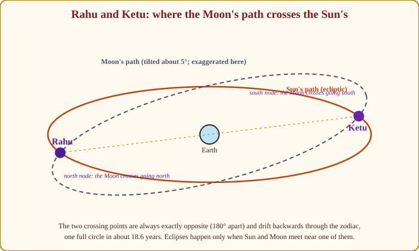
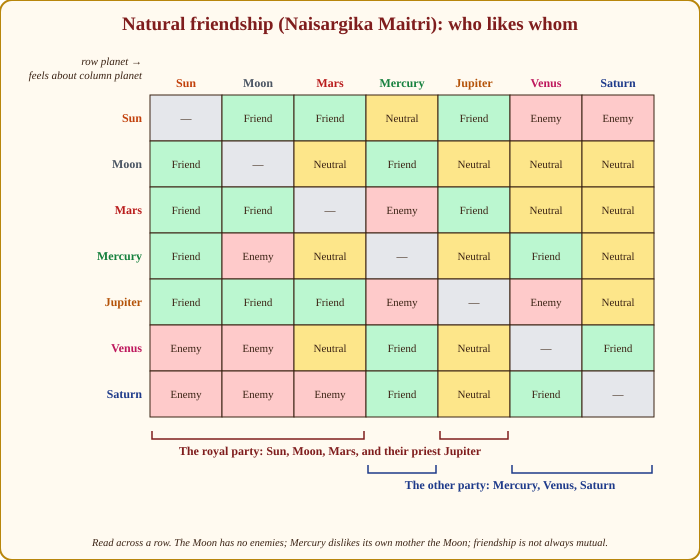
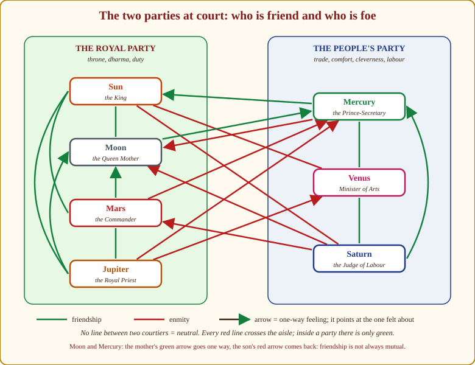
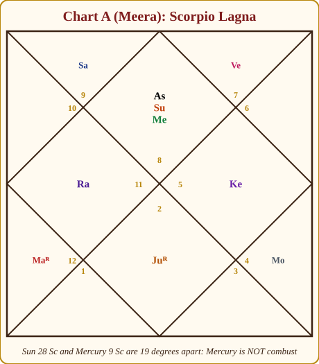
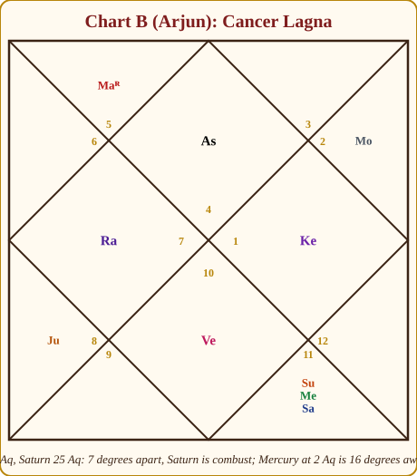
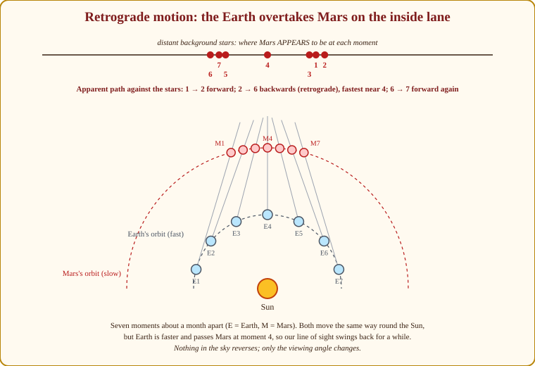
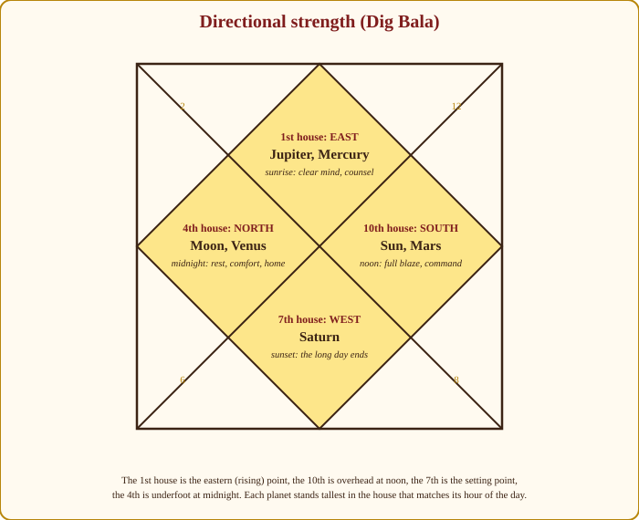

# Chapter 3: The Nine Planets (Grahas): The Actors

Every drama needs actors, and ours has exactly nine. Nine characters whose natures you can learn as well as you know your own relatives, and, like relatives, once you understand what each one wants, you can predict what they will do at any wedding.

The Sanskrit word *graha* means "that which seizes". Two of the nine are the lights (Sun and Moon), five are the naked-eye planets (Mars, Mercury, Jupiter, Venus, Saturn), and two are shadows (Rahu and Ketu), the points where eclipses happen. Astrology treats all nine as persons with temperaments, friendships and grudges. This chapter introduces each properly: their stories, what they stand for, where they are strong and weak, how fast they move, and how you can *see* a strong or weak planet in the person across the table.

## The royal court

The oldest and best way to hold all nine in mind is the court of a king, which the texts themselves use and which this whole book will keep returning to. The **Sun** is the King; the **Moon** the Queen Mother; **Mars** the Commander; **Mercury** the clever young Prince-Secretary; **Jupiter** the Royal Priest and chief minister, Guru-ji; **Venus** the Minister of Arts and Pleasure, Shukracharya; **Saturn** the old Judge of Labour, Shani-ji, who rose from the servants' quarters. **Rahu** is the smoke-headed Stranger at the gate; **Ketu** the Headless Sadhu outside the wall. Put the Commander in the Queen Mother's rooms and you already expect friction; seat the Priest in the throne room and you expect dignity.

## Benefics and malefics, and why

The texts sort the planets into gentle ones (**natural benefics**, *Shubha*) and harsh ones (**natural malefics**, *Krura* or *Papa*). Jupiter and Venus are benefics. Saturn, Mars, Rahu and Ketu are malefics; the Sun is a mild malefic, a king is cruel by office, not by temperament. Two planets change sides, and the reason is worth knowing because it is the first piece of logic in the whole system.

The **Moon** is benefic when bright and malefic when dark: from about the eighth day after the new moon to about the eighth day after the full moon it is strong in light and counts as a benefic; in the dark fortnight around the new moon it counts as a malefic. A well-fed mind is kind; a starved mind frets. The *tithi* (lunar day) of birth tells you which Moon you have.

**Mercury** takes the nature of its company: alone or with benefics it is a benefic; with malefics it turns malefic. Mercury with Jupiter is a scholar; with Saturn a shrewd auditor; with Mars a sharp tongue.

| Planet | Natural nature |
|---|---|
| Jupiter | 🟢 great benefic |
| Venus | 🟢 benefic |
| Moon | 🟢 when bright (waxing) · 🔴 when dark (waning) |
| Mercury | 🟡 takes the nature of its company |
| Sun | 🔴 mild malefic (cruel by office) |
| Mars | 🔴 malefic |
| Saturn | 🔴 great malefic |
| Rahu, Ketu | 🔴 shadow malefics |

> **🔍 Why?** Why should the Moon's goodness depend on its phase, and Mercury's on its company? *Astronomy first:* the Moon has no light of its own; what we see is reflected sunlight, and the tradition reads that light as the mind's clarity. A full, bright Moon is a mind flooded with light, steady, generous, kind; a dark Moon is a mind with the lamp turned low, anxious and easily frightened. Parashara states the rule; the light explains it. Mercury's rule is *the system's own logic*: Mercury is speech and message, and a messenger carries whatever message he is handed. Sit him beside Jupiter and he carries scripture; beside Mars, abuse. Everyday parallel: the cousin who forwards everything on the family WhatsApp group is neither good nor bad, the wedding invitation and the rumour arrive in the same font. The message decides, not the messenger.

"Malefic" does not mean "evil". A malefic gives results through pressure, effort, separation and delay; a benefic through ease, growth and support. The surgeon's knife is malefic, the nurse's hand benefic; you need both to get well. And in Chapter 8 you will see a natural malefic become a *functional* benefic for a particular Lagna, and vice versa.

> **🧭 Anushka's rule of thumb:** Benefics *give*; malefics *make you earn*. A house with a benefic receives; a house with a malefic works, and what is earned by work usually lasts longer.

## Sun (Surya), the King

*Story.* Surya, son of the sage Kashyapa and Aditi, rides a chariot of seven horses driven by the dawn. His wife Sanjna could not bear his blaze and left her shadow, Chhaya, in her place; from Chhaya was born Saturn, whom the Sun never fully accepted, which is why father and son are enemies in the friendship table.

*What it signifies.* The soul, the father, authority, government and administration, the right eye, bones, the heart as the seat of vitality, ego, fame, health in general, kings and heads of organisations.

*Positions.* Own sign Leo; Moolatrikona Leo 0°–20°; exalted at Aries 10°; debilitated at Libra 10°. Speed: about one sign a month, the whole zodiac in a year.

*Strong Sun in a person.* Steady confidence without noise; natural authority that others accept; good digestion and stamina; a healthy relationship with the father; the ability to say "no" once and mean it. *Weak Sun.* Shrinking from the spotlight or over-claiming it; low vitality; difficulty with fathers and bosses; a need for approval. Neither is a sentence: the weak Sun learns dignity, the strong Sun humility.

*Example.* Meera's Sun sits in Scorpio in her 1st house at 28°. It is neither exalted nor debilitated; Scorpio is Mars's sign and Mars is the Sun's friend, so the king is comfortable, and in the 1st house he is visible. The reading: a quietly authoritative presence, a strong constitution, an identity tied to depth and investigation rather than display.

## Moon (Chandra), the Queen

*Story.* Chandra married the twenty-seven daughters of Daksha, the twenty-seven nakshatras, but loved only Rohini. The neglected sisters complained, and Daksha cursed him to waste away. Shiva, moved by Chandra's penance, could not undo a father-in-law's curse, but he softened it: Chandra would wane for fifteen days and wax for fifteen. That is why the Moon has phases, and why the Moon spends a day in each nakshatra, it is visiting each wife in turn.

*What it signifies.* The mind and emotions, the mother, the public and its moods, fluids, nourishment, milk, the left eye, sleep, home comfort, the queen, and everything that ebbs and flows.

*Positions.* Own sign Cancer; Moolatrikona Taurus 3°–30° (some texts 4°–20°); exalted at Taurus 3°; debilitated at Scorpio 3°. Speed: about 2¼ days a sign, round the zodiac in 27.3 days, by far the fastest hand on the clock.

*Strong Moon.* A steady, receptive mind; emotional resilience; good sleep; warmth towards others; a nourishing relationship with the mother; popularity without effort. *Weak Moon.* Mood swings, anxiety, poor sleep, a sense of never being quite at home; sensitivity that becomes fragility.

*Example.* Meera's Moon is in Cancer, its own sign, in the 9th house at 21°. The queen is in her own palace, in the house of faith and teachers. Her emotional life is anchored in belief and learning; her mother is likely a devout or educated woman; she teaches from the heart.

## Mars (Mangala), the Commander

*Story.* Mars is Bhauma, the son of the Earth. In the Puranic tellings a drop of Shiva's sweat fell to the ground during his war with a demon, and from the earth sprang a red, fierce child whom Bhumi Devi raised. Mars belongs to the soil, to land, property, and the blood that is spilled defending them.

*What it signifies.* Energy, courage, anger, younger siblings, land and property, blood and muscles, surgery and weapons, the army and police, engineers, athletes, competition, the commander of the forces.

*Positions.* Own signs Aries and Scorpio; Moolatrikona Aries 0°–12°; exalted at Capricorn 28°; debilitated at Cancer 28°. Speed: about 45 days a sign, round in roughly two years.

*Strong Mars.* Decisiveness; physical courage; the ability to start and to finish; a healthy competitive streak; protective of family. *Weak Mars.* Aggression that misfires, quarrels, accidents, burns, or its opposite, difficulty asserting oneself; often chronic tiredness and letting others decide.

*Example.* Arjun's Mars is in Leo in the 2nd house at 21°, retrograde. Leo is the Sun's sign and the Sun is Mars's friend, so the commander is comfortable. In the 2nd house (speech, wealth, family) he speaks forcefully and earns through drive. Retrograde, a word we will unpack shortly, turns that force inward: he thinks before he strikes, and strikes harder for it.

## Mercury (Budha), the Prince

*Story.* Budha is the son of the Moon and Tara, the wife of Jupiter, whom the Moon carried away. When Tara returned, the child's brilliance made both Jupiter and the Moon claim him; Tara named the Moon as father. Mercury therefore carries the Moon's quickness and Jupiter's learning, and, in the friendship table, is uneasy with his own father the Moon.

*What it signifies.* Intellect, speech, writing, communication, trade and commerce, mathematics and accounts, nerves and skin, the maternal uncle, students, messengers, the prince and secretary.

*Positions.* Own signs Gemini and Virgo; Moolatrikona Virgo 16°–20°; exalted at Virgo 15°; debilitated at Pisces 15°. Speed: about a month a sign, never more than about 28° from the Sun, it darts ahead of the king and falls back, turning retrograde three times a year.

*Strong Mercury.* Clear speech, quick learning, wit, good handwriting and arithmetic, ease with languages and technology, a steady nervous system. *Weak Mercury.* Muddled speech, difficulty concentrating, nervousness, poor decisions in money and paperwork, or a cleverness that outruns honesty.

*Example.* Meera's Mercury is in Scorpio in the 1st house at 9°, with the Sun. Sun and Mercury together form Budha-Aditya yoga, intelligence and articulation, *provided* Mercury is not burnt by the Sun's closeness. It is 19° away, safely outside the 14° orb we will meet below. A penetrating, investigative intellect, expressed with care.

## Jupiter (Guru / Brihaspati), the Priest

*Story.* Brihaspati, son of the sage Angiras, is the teacher of the gods, the priest who knows the mantras that make sacrifices work. He is called *Guru*, "the heavy one", heavy with wisdom, and, in the sky, the largest planet.

*What it signifies.* Wisdom, the teacher, children, wealth and expansion, dharma and religion, law, the husband in a woman's chart, the liver and fat, optimism, ministers and advisers.

*Positions.* Own signs Sagittarius and Pisces; Moolatrikona Sagittarius 0°–10°; exalted at Cancer 5°; debilitated at Capricorn 5°. Speed: about a year a sign, round in roughly twelve years.

*Strong Jupiter.* Generosity, faith that needs no proving, good judgement, children and students who flourish, money that arrives when needed. *Weak Jupiter.* Poor judgement in whom to trust, difficulties with teachers or children, over-optimism or cynicism, liver trouble, a hollow feeling about meaning.

*Example.* Meera's Jupiter is in Taurus in the 7th house at 8°, retrograde. Taurus is Venus's sign, and Venus is Jupiter's enemy, the priest in the house of pleasure, slightly stiff. Yet the 7th house is marriage and partnership, and a Jupiter there, even a slightly uncomfortable one, gives a partner who is learned, principled, and a little older in spirit.

## Venus (Shukra), the Minister of the Arts

*Story.* Shukracharya, son of the sage Bhrigu, is the teacher of the asuras. Through fierce penance he won from Shiva the *Mrita Sanjeevani* knowledge, the art of reviving the dead, which made his side unbeatable until the gods sent Brihaspati's son Kacha to learn it as his student.

*What it signifies.* Love, marriage, the wife in a man's chart, beauty and the arts, luxury, vehicles, music, perfume, diplomacy, the reproductive system, and ministers of pleasure and culture.

*Positions.* Own signs Taurus and Libra; Moolatrikona Libra 0°–15°; exalted at Pisces 27°; debilitated at Virgo 27°. Speed: about a month a sign, but, like Mercury, tied to the Sun, never more than about 48° from it.

*Strong Venus.* Charm without effort, taste, a happy marriage, comfort with money and pleasure, a good singing voice or an eye for design, ease in the body. *Weak Venus.* Difficulties in love, either from over-indulgence or from a fear of it; poor taste, or taste that money cannot satisfy; reproductive or kidney complaints.

*Example.* Meera's Venus is in Libra in the 12th house at 22°. Own sign, so comfortable; but the 12th is the house of expenses, bed pleasures, foreign lands and quiet withdrawal. Her love of beauty is real but private; she spends on comfort; a partner from far away, or a life abroad, is a thread to check.

## Saturn (Shani), the Servant and the Judge

*Story.* Shani is the son of the Sun and Chhaya, the shadow. Dark, slow and lame, he was not welcomed by his brilliant father. Saturn is the god of the labourer, the widow and the outcaste, everyone the court overlooks, and he does not forget a debt.

*What it signifies.* Longevity, discipline, sorrow and patience, labour and servants, delay, chronic disease, old age, bones, teeth and nerves, iron and oil, justice over the long run.

*Positions.* Own signs Capricorn and Aquarius; Moolatrikona Aquarius 0°–20°; exalted at Libra 20°; debilitated at Aries 20°. Speed: about 2½ years a sign, round in roughly 29½ years, the slow hand of the clock.

*Strong Saturn.* Endurance, method, honesty, respect for time and rules, achievement that comes late and stays. *Weak Saturn.* Fear, pessimism and chronic delay, or a rigid harshness towards oneself and others; joint and dental trouble; a sense of carrying the world alone.

*Example.* Arjun's Saturn is in Aquarius, its own sign and Moolatrikona, in the 8th house at 25°. Saturn is the natural karaka of the 8th and here it is at home: research, insurance, the long patient study of hidden systems. But it sits only 7° from the Sun, and that brings us to combustion.

> **💡 Did you know?** Saturn takes about 29½ years to circle the zodiac. So around age 29–30, and again around 58–60, Saturn returns to where it was at your birth. Almost every tradition, East and West, marks these as turning points, the end of youth, the beginning of elderhood. Many a client who "suddenly got serious" at 29 was simply meeting Saturn again.

## Rahu and Ketu, the Shadows

*Story.* When the gods and demons churned the ocean for the nectar of immortality (*Samudra Manthan*), a demon named Svarbhanu disguised himself and sat among the gods to drink it. The Sun and Moon recognised him and told Vishnu, who cut off his head with his discus, but the nectar had already passed his throat. The head lived on as **Rahu**, the body as **Ketu**. Rahu still chases the Sun and Moon to swallow them, which is why we see eclipses; Ketu, the body without a head, wants nothing and sees everything.

*What they are.* Not bodies at all. The Moon's orbit is tilted about 5° to the Sun's path, and the two crossing points are the **lunar nodes**: Rahu the north node, Ketu the south. Always exactly opposite, they slide backwards through the zodiac, about 18 months a sign, a full circle in about 18.6 years.

*Figure 3.1: The eclipse axis. The Sun's path and the Moon's path cross at two points, Rahu and Ketu, always 180° apart. Eclipses happen only when the Sun and Moon meet near one of them, which is exactly what the story says.*

> **📖 Story: The Stranger and the Sadhu.** At the gate stands a Stranger with smoke for a head (Rahu): foreign clothes, restless eyes, hungry for everything inside. The King and Queen Mother exposed him at the churning of the ocean and the Commander threw him out, so he hates all three; his friends are in the People's Party, the Minister of Arts sells him pleasures, the Judge respects his patience, the Prince enjoys his cleverness. Outside the wall sits the Headless Sadhu (Ketu), his severed other half, who wants nothing. He too hates the two lights that unmasked him, but counts the fierce Commander, the detached Judge and the flower-bringing Minister of Arts as friends. **Rule:** Rahu is friendly to Venus, Saturn and Mercury, hostile to Sun, Moon and Mars; Ketu is friendly to Mars, Venus and Saturn, hostile to Moon and Sun (a working convention; sources vary).

> **🔍 Why?** Why "shadows", and why do they move backward? *Astronomy:* Rahu and Ketu are not bodies but the two points where the Moon's tilted orbit crosses the Sun's path. An eclipse can happen only when the Sun and Moon meet at one of those crossings, the Moon's shadow falls on the Earth, or the Earth's on the Moon, so the tradition named the crossings after the thing they produce: shadow. They move backward because the Sun's pull slowly swings the whole plane of the Moon's orbit round the other way, one full turn in 18.6 years, the "regression of the nodes" of any astronomy textbook. Everyday parallel: two roads crossing at a junction. Traffic flows along both roads all day, but the accident (the eclipse) can only happen at the crossing, and if the road crew keeps re-laying the junction a little further back each year, the crossing itself creeps backward along the road.

*What they signify.* **Rahu:** obsession, ambition without limit, foreigners and foreign lands, technology, illusion and glamour, smoke and poison, sudden rise, the paternal grandfather. **Ketu:** detachment, liberation (*moksha*), past-life skills that come without effort, the occult and the mystical, sudden loss, wounds, the maternal grandfather.

*Positions.* They own no signs. The mainstream shorthand is *"Rahu acts like Saturn, Ketu acts like Mars"*. Exaltation and debilitation are disputed: the common view is Rahu exalted in Taurus and debilitated in Scorpio, Ketu the reverse; some authors say Gemini and Sagittarius instead. I use the Taurus/Scorpio view and say so whenever it matters.

*Strong Rahu* is the immigrant who builds an empire; *afflicted Rahu* the person forever chasing the next thing. *Strong Ketu* is the healer or mathematician; *afflicted Ketu* cannot stay attached to anything, including their own well-being.

*Example.* Meera's Rahu is in Aquarius in the 4th (home, mother, property): an unconventional home, perhaps far from where she was born, a pull towards technology and foreign ways of living. Her Ketu is in Leo in the 10th: a career in which recognition matters less and less, and mastery that arrives without visible effort, very typical of teachers and consultants.

## Who likes whom: the friendship table

Planets in each other's signs behave like guests, and how a guest behaves depends on the host. Here is Parashara's table of **natural friendship** (*Naisargika Maitri*), exactly as it stands in Appendix A.3.

| Planet | 🟢 Friends | 🟡 Neutral | 🔴 Enemies |
|---|---|---|---|
| Sun | 🟢 Moon, Mars, Jupiter | 🟡 Mercury | 🔴 Venus, Saturn |
| Moon | 🟢 Sun, Mercury | 🟡 Mars, Jupiter, Venus, Saturn | (none) |
| Mars | 🟢 Sun, Moon, Jupiter | 🟡 Venus, Saturn | 🔴 Mercury |
| Mercury | 🟢 Sun, Venus | 🟡 Mars, Jupiter, Saturn | 🔴 Moon |
| Jupiter | 🟢 Sun, Moon, Mars | 🟡 Saturn | 🔴 Mercury, Venus |
| Venus | 🟢 Mercury, Saturn | 🟡 Mars, Jupiter | 🔴 Sun, Moon |
| Saturn | 🟢 Mercury, Venus | 🟡 Jupiter | 🔴 Sun, Moon, Mars |

*Figure 3.2: The friendship grid, colour coded, green friend, amber neutral, red enemy. Read across a row: how the row planet feels about the column planet. The two "parties" are bracketed underneath.*

> **🔍 Why?** Where does this table come from? It is not arbitrary. *Classical derivation (Parashara, BPHS chapter on planetary relations; Varahamihira gives the same):* take a planet's Moolatrikona sign and count from it. The lords of the 2nd, 4th, 5th, 8th, 9th and 12th signs from it, plus the lord of its exaltation sign, are its friends; the lords of the remaining signs are enemies; a planet that lands on both lists is neutral. Walk the Sun: Moolatrikona Leo. The 2nd is Virgo (Mercury), 4th Scorpio (Mars), 5th Sagittarius (Jupiter), 8th Pisces (Jupiter), 9th Aries (Mars, also the Sun's exaltation), 12th Cancer (Moon), so Mars, Jupiter and the Moon are friends. Mercury also owns Gemini, the 11th, which puts him on the enemy list too: on both lists, so neutral. Venus (Libra 3rd, Taurus 10th) and Saturn (Capricorn 6th, Aquarius 7th) appear only on the enemy list. That is the Sun's row exactly. Try Mercury from Virgo yourself; it works. The court stories below are the *symbolic* layer the tradition adds so that the result is remembered. Everyday parallel: in a joint family, your natural allies are the relatives whose rooms open onto your courtyard; the ones down the far corridor you rarely see, and rarely warm to.

Do not memorise this grid cell by cell. Listen to the court instead, every cell is a grudge or a loyalty with a reason.

> **📖 Story: The two parties.** Every court has two parties. At the King's right hand sits the **Royal Party**: the King himself (Sun), the Queen Mother (Moon), the Commander (Mars) and the Royal Priest, Guru-ji (Jupiter). They believe in throne, dharma and duty. Across the hall sits the **People's Party**: the clever young Prince-Secretary (Mercury), the Minister of Arts and Pleasure, Shukracharya (Venus), and the old Judge of Labour, Shani-ji (Saturn), who rose from the servants' quarters. They believe in trade, comfort, cleverness and the working man. Inside a party everyone is a friend or at least civil; across the aisle there is coolness, and a few open feuds that the next stories explain. **Rule:** Sun, Moon, Mars and Jupiter are friends or neutral to one another; so are Mercury, Venus and Saturn; every enmity in the table runs across the aisle.

*Figure 3.3: The two parties. Green lines are friendships, red lines enmities; an arrowhead means the feeling runs one way only; pairs with no line are neutral to each other.*

> **📖 Story: The King and the Minister of Pleasure.** The King (Sun) rises before dawn, bathes in cold water and expects the court to do the same. Shukracharya (Venus) keeps the court up till midnight with music, perfume and wine, and, worse, is the guru of the asuras, the King's sworn enemies, whom he has taught to revive their dead. The King calls him decadent; the Minister calls the King a bore. Neither has ever forgiven the other. **Rule:** Sun and Venus are mutual enemies.

> **📖 Story: The rejected son.** Shani-ji (Saturn) was born dark and slow to the King and his wife's shadow, Chhaya. His brilliant father never accepted him. The Queen Mother's household (Moon) looked past the awkward boy; the hot young Commander (Mars) mocked his lame foot. Shani left, worked among the labourers, and slowly became the Judge of Labour, who keeps the ledger of everyone's work and forgets nothing. He counts all three as enemies. The King and the Commander return the feeling. The Queen Mother, who quarrels with no one, merely looks away. **Rule:** Saturn's enemies are Sun, Moon and Mars; Sun and Mars return the enmity; the Moon stays neutral.

> **📖 Story: Tara's son.** The Moon carried away Tara, the wife of Guru-ji, and from that scandal the Prince, Budha (Mercury), was born. When Tara returned, both Guru-ji and the Moon claimed the brilliant child, and Tara named the Moon. The boy grew up quick, clever and ashamed of the story; he resents the parent who caused it and keeps his distance. But a parent's love does not depend on the child's gratitude: the Moon still counts Budha a friend. **Rule:** Mercury calls the Moon an enemy; the Moon calls Mercury a friend. Friendship in this table is not always mutual.

> **📖 Story: The Priest's two headaches.** Guru-ji (Jupiter) preaches restraint, tradition and the sacred texts. Two people at court give him indigestion. Shukracharya (Venus), the rival guru who teaches the *other* side and laughs at restraint; and the Prince (Mercury), who is too clever by half and questions every sermon with a footnote. Guru-ji calls both enemies. Neither is much bothered, one is busy with a concert, the other with his accounts, so they hold nothing against the old priest and count him neutral. **Rule:** Jupiter regards Mercury and Venus as enemies; Mercury and Venus regard Jupiter as neutral.

> **📖 Story: The Commander and the Secretary.** The Commander (Mars) wants his orders obeyed *now*. The Prince-Secretary (Mercury) wants them in writing, in triplicate, with three questions attached. Mars calls him an enemy and a coward. Mercury shrugs and files the complaint, he has no strong feelings about the loud man in armour. **Rule:** Mars counts Mercury an enemy; Mercury counts Mars neutral.

> **📖 Story: The Queen Mother has no enemies.** Rani Ma (Moon) has fed everyone at this court. She is the King's closest friend, she loves the difficult Prince, and to the Commander, the Priest, the Minister of Arts and the Judge she is simply the one who asks whether they have eaten. Nobody is her enemy, and she is nobody's. Notice, too, that the King tolerates the Prince, the clever boy is always at his elbow, and so is neutral to him, though the Prince counts the King a friend and patron. **Rule:** The Moon's friends are Sun and Mercury, all others neutral, none enemies; the Sun is neutral to Mercury.

Rahu and Ketu are not in Parashara's table; their working conventions are in the Stranger-and-Sadhu story above, and I always add that sources vary.

## Guest houses and humiliations: exaltation retold

Chapter 2 gave you the exaltation table. Here it is as a court story, because a story is remembered when a table is not.

> **📖 Story: Every courtier's favourite guest house.** Each courtier has one district where the host's ways suit him perfectly, and one where he is quietly humiliated. The King (Sun) is honoured in Aries, the Commander's frontier fort, where a king is needed to lead the charge; he is humiliated in Libra, the Minister of Arts' salon, where every decision is put to a vote. The Queen Mother (Moon) rests in Taurus, the Minister's well-stocked kitchen; she is miserable in Scorpio, the Commander's night barracks. The Commander (Mars) is honoured in Capricorn, the Judge's fortress of five-year plans, and humiliated in Cancer, the Queen Mother's nursery. The Prince (Mercury) shines in Virgo, his own accounts office, and drowns in Pisces, the Priest's ashram by the sea. Guru-ji (Jupiter) is honoured in Cancer, the Queen Mother's house of compassion, and humiliated in Capricorn, the Judge's audit office. Shukracharya (Venus) is honoured in Pisces, the Priest's house of boundless kindness, and humiliated in Virgo, the Prince's office where love is itemised. And the Judge (Saturn) is honoured in Libra, the Minister's hall of scales where justice is weighed, and humiliated in Aries, the Commander's barracks, where the slow old man is told to run. **Rule:** Exaltation and debilitation are always opposite signs at the same degree, 10, 3, 28, 15, 5, 27, 20 for Sun, Moon, Mars, Mercury, Jupiter, Venus, Saturn.

## Combustion: too close to the king

A planet that comes too near the Sun disappears in the glare: **combustion** (*Asta*, "set"). It does not stop giving results, but it gives them through the Sun's agenda, ego, father, authority, and its own matters suffer.

The approximate orbs are: Moon 12°, Mars 17°, Mercury 14° (12° when retrograde), Jupiter 11°, Venus 10° (8° when retrograde), Saturn 15°. Rahu and Ketu are never combust. Authors differ by a degree or two; these are the mainstream figures.

> **📖 Story: Blinded by the King.** A courtier who stands too close to the throne is blinded by the King's glare. He can still speak, but he can only echo the King's words; his own business is forgotten. Each courtier can stand a different distance before he is dazzled: the Commander is blinded from 17° away, the Judge from 15°, the Prince from 14° (12° when he is walking backward), the Queen Mother from 12°, Guru-ji from 11°, and the Minister of Arts, who is used to bright lights, only from 10° (8° when retrograde). The Stranger and the Sadhu are smoke and shadow; no glare touches them. **Rule:** Within its orb of the Sun a planet is combust, it serves the Sun's agenda (ego, father, authority) rather than its own.

> **🔍 Why?** Why does each planet have a different orb? *Astronomy:* combustion began as a visibility rule, a planet is "set" (*asta*) when it is too near the Sun to be seen in the twilight. How near depends on brightness. Venus, the brightest object after the Moon, stays visible closest to the Sun, so its orb is the smallest (10°); dim, distant Mars and Saturn vanish from much further away (17°, 15°). Mercury and Venus are *inner* planets: when retrograde they pass between Earth and Sun, closer and larger, so their orbs shrink further (12°, 8°). The exact numbers are *tradition*, authors differ by a degree or two, but the ranking is physics. Everyday parallel: stand near the floodlight at a wedding. A candle beside it disappears from ten paces; a bright torch is still seen right next to it.

*Figure 3.4: Chart A. Sun at 28° Scorpio, Mercury at 9° Scorpio, same sign, 19° apart. Mercury is well outside its 14° orb, so it is not combust, and the Budha-Aditya yoga holds.*

*Figure 3.5: Chart B. Sun 18° Aquarius, Saturn 25°, only 7° apart, inside Saturn's 15° orb: Saturn is combust. Mercury at 2° is 16° away and safe.*

In Chart A, Sun and Mercury share the 1st house but are 19° apart, no combustion. In Chart B, Saturn sits 7° from the Sun: combust. What does that *look like*? Not disaster. Arjun's discipline is real but must serve his sense of self and his father's expectations; he is methodical when a boss or a cause demands it. Combustion is a planet that has lost its independence, not its existence.

> **⚠️ Common beginner mistake:** Declaring a planet "combust and useless" because it shares a sign with the Sun. Combustion is measured in *degrees*, not signs. Always read the longitudes. Sharing a sign with the Sun at 25° apart is a conjunction with dignity; at 3° apart it is combustion.

## Retrogression: the planet that seems to go backwards

Three or four times a year Mercury appears to stop against the stars, move backwards for some weeks, stop again and resume. Venus does it every year and a half, Mars every two years, Jupiter and Saturn for four to five months every year. This is **retrogression** (*Vakra*, "crooked"). Nothing actually reverses: the Earth, on an inner and faster lane, overtakes the outer planets and our line of sight swings backwards. Mercury and Venus, on inner lanes, do the same to us.

*Figure 3.6: Seven monthly snapshots. Earth (inner lane) passes Mars (outer lane) at moment 4. Against the background stars Mars appears to go forward, then back, then forward again.*

> **📖 Story: The minister who walks backward.** Once in a while a minister is seen walking *backward* through the great hall, slowly, lost in thought. The junior courtiers giggle: he has gone the wrong way. The old ones know better. At that moment he is nearer to you than he ever is otherwise, and brighter, you can see every line on his face. He is not reversing his duties; he is turning them over inside himself. When he finally speaks, it is after long reflection, and it lands harder. **Rule:** A retrograde planet is intensified and internalised, results come later, from within, often on a second attempt. Never read it as "reversed".

> **🔍 Why?** The layer here is pure *astronomy*, and the diagram above is the proof. Everyday parallel: you are on the fast train and a slower train is running on the parallel track in the same direction. As you overtake it, for a few moments the slower train seems to slide *backwards* past your window. It never reversed; you were simply faster. Mars is that slower train, and the retrograde weeks are the overtaking.

How to read it: a retrograde planet is at its closest to the Earth, brightest in the sky, and its energy is **intensified and internalised**. Retrograde Mercury rewrites every message before sending; retrograde Mars trains in private and surprises everyone on the day; retrograde Jupiter holds a faith that is personal and hard-won. Do **not** call retrograde "reversed" or "bad"; Parashara actually counts retrograde planets as *stronger*. The Sun and Moon are never retrograde; Rahu and Ketu are always retrograde, which is simply their normal motion.

Meera has two retrograde planets: Mars in Pisces (5th house) and Jupiter in Taurus (7th house). Her creativity comes in inward-turning waves; her marriage is with someone whose wisdom is private and grows over time.

## Planetary war: two planets in one degree

When two of the five true planets (Mars, Mercury, Jupiter, Venus, Saturn) come within one degree of each other, the texts call it a **planetary war** (*Graha Yuddha*): one wins, one loses, and the loser's significations are weakened. Which one wins is disputed, the older rule favours the planet further north in latitude, many moderns the planet with the lower longitude, and brightness is the practical tie-breaker (Venus rarely loses). For a beginner: note a war, read the loser's houses with extra care, and never build a prediction on the war alone. The Sun, Moon and nodes do not fight.

## Directional strength: where each planet stands tallest

Every planet has a house in which it is said to have full **directional strength** (*Dig Bala*): Jupiter and Mercury in the 1st; the Moon and Venus in the 4th; Saturn in the 7th; the Sun and Mars in the 10th. The logic is a day.

> **📖 Story: Who stands at which gate.** The palace has four gates, and the day decides who stands at each. At dawn the *East gate* (the 1st house) opens, and there stand Guru-ji and the Prince, the Priest and the Secretary, because counsel is given while the mind is fresh. At noon the King and the Commander are on the rooftop above the *South gate* (the 10th house), in full blaze, giving orders the whole city can see. At sunset the tired old Judge closes the *West gate* (the 7th house): the labourer's day is done and the accounts are settled. At midnight the Queen Mother and the Minister of Arts keep the *North gate* (the 4th house), the inner rooms of rest, food and comfort. Stand a courtier at the wrong gate, the Judge at dawn, the King at midnight, and he has no strength of direction at all. **Rule:** Dig bala: Jupiter and Mercury in the 1st; Sun and Mars in the 10th; Saturn in the 7th; Moon and Venus in the 4th. The opposite house gives zero.

> **🔍 Why?** Dig bala is a *classical statement* (Parashara lists it in the strength chapter), and its logic is *astronomy read symbolically*: the four kendras are the four turning points of the Sun's day, rising in the east (1st), overhead at noon (10th), setting in the west (7th), underfoot at midnight (4th). Each planet is given the hour whose quality matches its own: the fierce hour of noon to the Sun and Mars, the dark restful hour to the Moon and Venus, the clear first light to Jupiter and Mercury, and the tired end of the working day to Saturn. Everyday parallel: any office. The planners want the 9 a.m. meeting; the boss makes announcements at noon when everyone is in; the accounts clerk closes the books at six; and the house, the food and the music belong to the night.

*Figure 3.7: Directional strength. Each planet stands tallest in the house that matches its hour of the day. A planet in the opposite house has no directional strength at all.*

Meera's Mercury in the 1st has full directional strength, the clever secretary at the sunrise table, which fits her articulate first impression. Her Jupiter in the 7th, opposite its strong 1st, has none: its wisdom must work through the partner rather than through her own presence. Dig bala is one of the six strengths of *Shadbala* (Chapter 12); for now, note it as a modifier.

> **💡 Did you know?** The days of the week are named for the planets in the order of the *horas*, the planetary hours. The hours run in the order Saturn, Jupiter, Mars, Sun, Venus, Mercury, Moon (slowest to fastest) and repeat. Start a Sunday with the Sun ruling the first hour; count twenty-four hours and the twenty-fifth, the first hour of the next day, falls to the Moon. Hence Sunday, Monday (Moon), Tuesday (Mars, *Mangal-var*), Wednesday (Mercury, *Budh-var*), Thursday (Jupiter, *Guru-var*), Friday (Venus, *Shukra-var*), Saturday (Saturn: *Shani-var*). Hindi, Latin and English all keep this order.

## The planets in a nutshell

Keep this table by your desk until you no longer need it. Every value agrees with Appendix A.

| Planet | Court role | Nature | Own signs | Exalted | Debilitated | Moolatrikona | Speed per sign | Dig bala house | Key words |
|---|---|---|---|---|---|---|---|---|---|
| Sun (Su) | King | 🔴 Mild malefic | Leo | Aries 10° | Libra 10° | Leo 0°–20° | 1 month | 10th | Soul, father, authority |
| Moon (Mo) | Queen | 🟢 bright / 🔴 dark | Cancer | Taurus 3° | Scorpio 3° | Taurus 3°–30° | 2¼ days | 4th | Mind, mother, public |
| Mars (Ma) | Commander | 🔴 Malefic | Aries, Scorpio | Capricorn 28° | Cancer 28° | Aries 0°–12° | 45 days | 10th | Energy, courage, land |
| Mercury (Me) | Prince | 🟡 Takes company's nature | Gemini, Virgo | Virgo 15° | Pisces 15° | Virgo 16°–20° | ~1 month | 1st | Intellect, speech, trade |
| Jupiter (Ju) | Priest, minister | 🟢 Great benefic | Sagittarius, Pisces | Cancer 5° | Capricorn 5° | Sagittarius 0°–10° | 1 year | 1st | Wisdom, children, wealth |
| Venus (Ve) | Minister of arts | 🟢 Benefic | Taurus, Libra | Pisces 27° | Virgo 27° | Libra 0°–15° | ~1 month | 4th | Love, beauty, luxury |
| Saturn (Sa) | Servant, judge | 🔴 Great malefic | Capricorn, Aquarius | Libra 20° | Aries 20° | Aquarius 0°–20° | 2½ years | 7th | Discipline, delay, longevity |
| Rahu (Ra) | Foreigner, smoke | 🔴 Malefic (shadow) | none (like Saturn) | Taurus (some: Gemini) | Scorpio (some: Sagittarius) | none | 18 months, backwards | none | Obsession, foreign, technology |
| Ketu (Ke) | Headless ascetic | 🔴 Malefic (shadow) | none (like Mars) | Scorpio (some: Sagittarius) | Taurus (some: Gemini) | none | 18 months, backwards | none | Detachment, moksha, occult |

> **🪔 Consultation tip:** Never describe a planet to a client as "bad". Say what it *asks*. "Your Saturn sits in the house of marriage; it asks for patience and rewards loyalty" is true, useful, and leaves the person with something to do. "Saturn in the 7th is bad for marriage" is lazy, frightening, and, as you will see in Chapter 8, often simply wrong for their Lagna.

## In one breath

- Nine actors: two lights, five planets, two shadows. The royal-court picture gives you their characters and their quarrels.
- Jupiter and Venus are natural benefics; Saturn, Mars, Rahu, Ketu and (mildly) the Sun are malefics; the Moon depends on its brightness and Mercury on its company.
- Each planet has own signs, an exaltation and an exactly opposite debilitation at the same degree, and a Moolatrikona "office", all as in Appendix A.2.
- Friendship follows two parties: Sun-Moon-Mars-Jupiter against Mercury-Venus-Saturn, with three memorable exceptions.
- Combustion is measured in degrees from the Sun; retrogression is intensified, internalised energy, never "reversed"; planetary war weakens the loser.
- Directional strength follows the hours of a day: thinkers at sunrise (1st), king and commander at noon (10th), servant at sunset (7th), queen and pleasure at midnight (4th).
- Rahu and Ketu are the two points where the Moon's tilted orbit crosses the Sun's path, the eclipse axis, always opposite and always moving backwards.

## Practice

> **✍️ Practice:**
>
> 1. A client's Moon is at 5° Scorpio, born two days before a new moon. Comment on the Moon's sign dignity and its natural nature, and write one gentle sentence you could say about it.
> 2. In Chart C (Devika), Mercury is at 1° Leo and the Sun at 5° Cancer. Are they in the same sign? How many degrees apart are they? Is Mercury combust?
> 3. Which planets are friends of Venus? A chart has Venus in Sagittarius. How does Venus feel there, and why?
> 4. Arjun's Mars is retrograde in Leo in the 2nd house. Write a two-sentence reading that uses "intensified and internalised" rather than "reversed".
> 5. Name the dig bala house of each of the seven planets without looking, using the "hours of the day" logic.

Answers

1. Scorpio is the Moon's debilitation sign, and 5° is near the deepest point (3°). Two days before the new moon the Moon is dark, so it counts as a natural malefic: a sensitive, intense mind that may brood. Gentle sentence: "Your mind goes deep and does not forget easily, which is a gift in any work that needs insight, and a burden only if you carry old hurts without setting them down."
2. No: Mercury is in Leo and the Sun in Cancer, different signs. The distance is from 5° Cancer to 1° Leo: 25° to the end of Cancer plus 1° = 26°. Mercury's orb is 14°, so it is not combust.
3. Venus's friends are Mercury and Saturn. Sagittarius belongs to Jupiter, who is neutral to Venus (from Venus's side), though Jupiter regards Venus as an enemy. Venus is in a neutral's sign, a hotel guest, comfortable enough, but its indulgence is tempered by Sagittarius's principles.
4. Arjun's Mars in the 2nd house gives forceful, direct speech and the drive to earn; Leo, a friend's sign, makes that drive proud and steady. Being retrograde, the energy is intensified and internalised: he rehearses what he will say, holds back until sure, and then speaks with unusual weight.
5. Sunrise (1st): Mercury and Jupiter. Noon (10th): Sun and Mars. Sunset (7th): Saturn. Midnight (4th): Moon and Venus.

