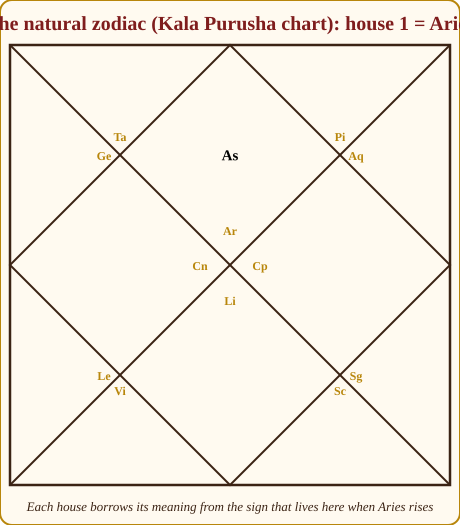
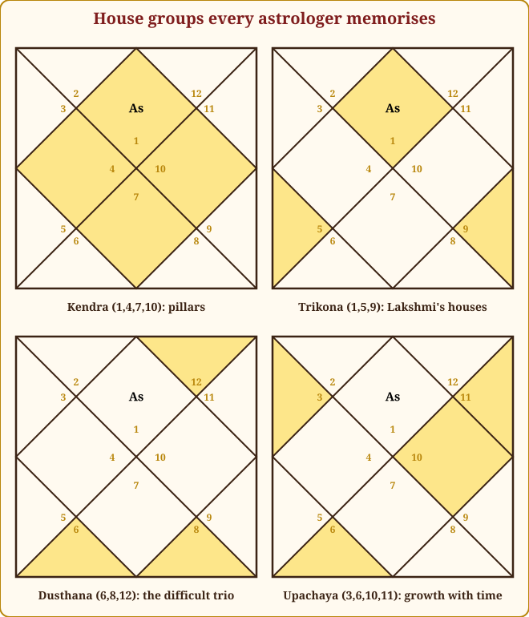
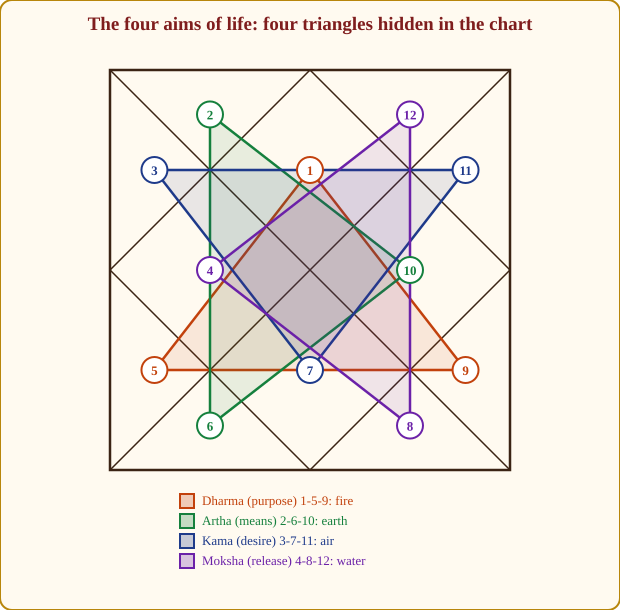
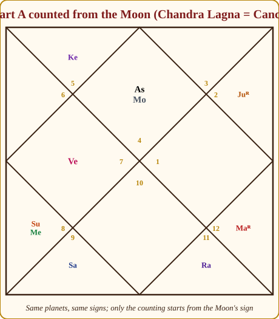
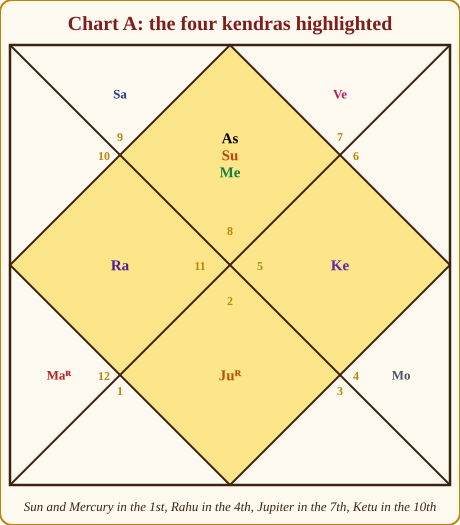
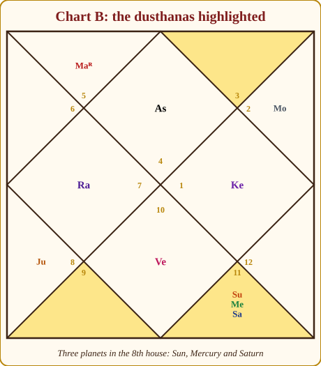

# Chapter 4: The Twelve Houses (Bhavas): The Rooms

Planet is *who*. Sign is *how*. Now the third and last layer of the grammar: the house is *where*. Where in a life does this energy land, in the body, in the bank, in the marriage, in the career, in the quiet hours of sleep?

Think of a house in the old sense: a big joint-family home with twelve rooms. The same uncle (planet) behaves differently in the kitchen, the prayer room and the room where the accounts are kept. Put Saturn in the room of marriage and he asks for patience there; put him in the room of career and he builds a slow, solid reputation. The room does not change Saturn. It decides *which part of the person's life* gets Saturn's lessons.

The Sanskrit word is **Bhava**, which means "state of being" or "becoming". Twelve bhavas, twelve areas in which a life unfolds. This chapter teaches you what each room is for, and, more importantly, *why*, so that you can derive any house meaning you have forgotten from first principles.

> **📖 Story: The haveli of twelve rooms.** Walk through the old family haveli once and you will never forget the houses. You enter at the **front door and veranda** (1st), the face the family shows the street. Just inside is the **kitchen with the family purse** (2nd), where grain and money are kept and everyone eats and talks. Beyond it the **courtyard** (3rd), where brothers wrestle and letters are written. Off the courtyard, the **mother's inner room** (4th), the heart of the house. Next the **children's study** (5th). Down a passage, the **store-room** (6th), where the servants work, the debts are recorded and the sick are nursed. Straight ahead, the **bridal room** (7th), whose second door opens on the world. Behind it the dark **back stairs** (8th). Up those stairs the **prayer room** (9th) where the grandfather sits, and above it the **office on the roof** (10th) that the whole street can see. Down again to the **guest hall** (11th) where friends gather, and finally across the lane to the **guest-house** (12th), where one goes to sleep, to hide, or to leave. **Rule:** House *n* is the *n*th room of the haveli, picture the room and its meanings follow.

## Where the rooms come from

In Jyotish the rooms are counted from the rising sign (Lagna). The Lagna sign is the 1st house, whole. The next sign is the 2nd house, whole. And so on round the zodiac. This is the **whole-sign house** system (*Rashi-bhava*), the default of the Parashari tradition and the one this book uses throughout. In Chart A, Scorpio rises, so Scorpio *is* the 1st house, Sagittarius the 2nd, Capricorn the 3rd, right round to Libra as the 12th.

You will meet a second method in software: **Bhava Chalit** (often the Sripati system), which divides the space around the exact Lagna degree into twelve unequal houses. Most of the time the two agree. They disagree only for a planet near the edge of a house, in Chart A, the Sun at 28° Scorpio sits in the 1st house by sign but slips into the 2nd bhava in a Chalit chart. My working rule: read the whole-sign house first; when a planet is within a few degrees of a house boundary, let it speak for *both* houses. Meera's Sun gives authority both to her presence (1st) and to her speech and family (2nd). Argue about systems later; for now, whole signs.

> **⚠️ Common beginner mistake:** Reading house meanings from the *sign number* instead of counting from the Lagna. In Chart A, Cancer is sign 4, but it is Meera's *9th house*. The house is always the count from the Lagna; the sign number is only the costume the room happens to be wearing.

## The natural zodiac: why the houses mean what they mean

Here is the key that unlocks the twelve rooms. Imagine a chart in which Aries rises. Then the 1st house *is* Aries, the 2nd *is* Taurus, and so on to the 12th, which is Pisces. This is the **natural zodiac**, the Kala Purusha's own chart, the chart of the Cosmic Man we met in Chapter 2. The classical meanings of the houses are simply the meanings of the signs that live there in this natural chart.

*Figure 4.1: The natural zodiac. When Aries rises, house 1 is Aries, house 2 Taurus, and so on. Each house borrows its core meaning, and its body part, from the sign that sits here.*

Walk it once and you will never need to memorise a house table again. The 1st is Aries, Mars's fire, the head, the charging self: **the body and the self**. The 2nd is Taurus, Venus's earth, the face and throat, food and possessions: **wealth, food, speech, family**. The 3rd is Gemini, Mercury's air, arms and shoulders, the couple: **communication, siblings, courage, short journeys**. The 4th is Cancer, the Moon's water, the chest and heart, the crab's shell: **mother, home, inner peace**. The 5th is Leo, the Sun's fire, the stomach, the lion's pride in his cubs: **children, creativity, intelligence**. The 6th is Virgo, Mercury's earth, the intestines, the maiden sorting grain: **work, health, service, enemies, debts**. The 7th is Libra, Venus's air, the scales: **partnership and marriage**. The 8th is Scorpio, Mars's water, the hidden organs, the scorpion under the stone: **death, transformation, secrets, inheritance**. The 9th is Sagittarius, Jupiter's fire, the thighs that carry us far, the archer aiming high: **fortune, faith, father, guru, long journeys**. The 10th is Capricorn, Saturn's earth, the knees that bend to duty, the climb: **career, status, authority**. The 11th is Aquarius, Saturn's air, the calves, the pot for the whole village: **gains, friends, networks, elder siblings**. The 12th is Pisces, Jupiter's water, the feet, the two fish in the ocean: **loss, sleep, foreign lands, hospitals, liberation**.

Every house meaning in the classical texts is an elaboration of this. When someone asks about something you have never seen in a table, "which house is my YouTube channel?", you do not panic: communication (3rd) that reaches a network (11th) as public work (10th). You *derive* it.

> **🔍 Why?** The natural zodiac is the first derivation. There is a second, purely from *the system's own logic*, and when both point the same way the ground is firm. Two counting rules do most of the work: the **12th from any house is its loss or ending**, and the ***n*th from the *n*th** repeats the theme (Bhavat Bhavam, below). Now derive: the **3rd** is the 12th from the 4th, leaving home, hence courage, siblings who leave with you, short journeys, effort. The **6th** is the 12th from the 7th, what partnership costs you, hence debts, disease (the body paying), service and competition. The **8th** is the 12th from the 9th, the loss of fortune, hence sudden events and transformation; it is also the 2nd from the 7th, the partner's wealth, hence inheritance and in-laws. The **11th** is the 6th from the 6th, the enemy of your enemies, hence gains and allies; it is also the 2nd from the 10th, the income of the career. The **12th** is the 12th from the 1st, the loss of the self, hence sleep, foreign lands, hospital beds and, at the far end, liberation. Everyday parallel: a joint-family ledger where every room's bill is paid by the room before it, the bridal room's expenses show up in the store-room's accounts.

> **🧭 Anushka's rule of thumb:** House meaning = natural sign + its lord + its body part. If you forget what the 8th means, remember Scorpio, Mars, and the organs we keep hidden. The rest follows.

## Benefics and malefics in the rooms

Before the tour, one rule you will apply in every room. Natural benefics (Jupiter, Venus, bright Moon, unafflicted Mercury) do their best work in the **kendras** (1, 4, 7, 10) and **trikonas** (1, 5, 9), the pillars and the blessing houses, where their gentleness builds. Natural malefics (Saturn, Mars, Sun, Rahu, Ketu) do their best work in the **upachaya** houses (3, 6, 10, 11), the "growing" houses where struggle is the point and toughness pays.

The reasoning is *the system's own logic*: a benefic *gives*, so put it where you want giving, self, home, marriage, career, children, fortune. A malefic *fights*, so put it where there is something to fight, rivals (3), enemies and disease (6), the competitive world of work (10), the effort to gain (11). A malefic in a gentle house (say Mars in the 4th, the mother's room) fights where there is nothing to fight and breaks the furniture; a benefic in a fighting house (Jupiter in the 6th) is too polite to argue with the enemy and gives away the case. We will refine this by Lagna in Chapter 8. For now, it is a sound first instinct.

## The tour: twelve rooms

I give each room its meanings, body part and natural significator (*karaka*, the planet that stands for that house in every chart: Appendix A.5), the *why*, what a benefic and a malefic do there, and an example from our case charts.

### 1st house: Tanu, the body

Self, body, appearance, health, temperament, the start of life, general fame. Body: the head. Karaka: the Sun.

Why: it is Aries, the head, the first breath. The 1st house is the front door through which every other house is entered; a strong 1st carries a weak chart, a weak 1st spoils a strong one. The Sun is its karaka because the Sun is the self.

A benefic here gives an attractive, healthy body and a pleasant disposition. A malefic gives a strong, marked body and a forceful temperament, often scars or a distinctive feature, and intensifies whatever the planet stands for. Sun and Mercury in Meera's 1st: intelligence and authority on the face; a person you notice and remember.

### 2nd house: Dhana, wealth

Wealth and savings, speech, food and what we take in through the mouth, the family we are born into, the face, early education, the right eye. Body: the face and mouth. Karaka: Jupiter.

Why: Taurus, Venus's earth, the throat, accumulation. Everything we *gather and hold*, money, food, words, kin. Jupiter is karaka because Jupiter is expansion and provision.

A benefic here gives a sweet voice, a well-fed family and money that stays. A malefic makes speech blunt, spending abrupt or earning laborious, but a Saturn here often gives wealth through long patience. Meera's Saturn in the 2nd (Sagittarius): measured, careful speech; savings that grow slowly; a family that values duty and learning.

### 3rd house: Sahaja, siblings and courage

Younger siblings, courage, effort, communication and writing, short journeys, hobbies, the arms and hands, hearing. Body: arms, ears. Karaka: Mars.

Why: Gemini, two people side by side (siblings), Mercury's talk, the arms that do and the courage to use them. Mars is karaka because courage is Mars.

Malefics here are welcome: they give the fighting spirit and the willingness to do hard work. A benefic makes one gentle with siblings and gifted in writing, but sometimes short of push. Devika (Chart C) has Mars and Venus in the 3rd: enormous energy and charm poured into communication and siblings; she can argue and console in the same breath.

### 4th house: Sukha, happiness and home

Mother, home and land, vehicles, comforts, formal schooling, the heart, inner peace. Body: the chest. Karakas: the Moon and Mercury.

Why: Cancer, the Moon's water, the chest and heart, the crab's shell that is its home. The 4th is the bottom of the chart, underfoot, the roots. The Moon stands for the mother; Mercury, in the old lists, for education.

A benefic here gives a happy childhood home, property, vehicles and a peaceful heart: Venus in the 4th is a house full of music. A malefic disturbs the peace: moves, a strict or absent mother, restlessness at home. Meera's Rahu in the 4th (Aquarius): an unconventional home, possibly far from her birthplace; a mother who is unusual; a pull towards foreign or technological ways of living. Arjun's Rahu in the 4th (Libra) shows the same restless roots, expressed through relationships and aesthetics.

### 5th house: Putra, children and intelligence

Children, intelligence and judgement, creativity, past-life merit (*Poorva Punya*), romance, mantra and devotion, speculation and gambling. Body: the stomach, upper belly. Karaka: Jupiter.

Why: Leo, the Sun's pride in what it creates. The 5th is the fruit of the 1st: what comes out of you, a child, a poem, a decision. Jupiter is karaka because Jupiter gives children and wisdom.

A benefic here is wonderful: bright children, a fine mind, luck in the stock market and in love. A malefic strains one of these, delayed children, a sharp but harsh intelligence, gambling that hurts. Arjun's Jupiter in the 5th (Scorpio): deep, investigative intelligence; children who matter greatly; the past-life merit that shows as a knack for understanding hidden things. Meera's retrograde Mars in the 5th (Pisces): creative bursts, and a need to watch impulsive speculation.

### 6th house: Ari, enemies, disease and service

Enemies and competitors, disease, debts, service and employment, litigation, the maternal uncle, pets. Body: the intestines. Karakas: Mars and Saturn.

Why: Virgo: Mercury's earth, the intestines that digest and discard, the maiden who sorts good from bad. The 6th is where we deal with what is *wrong*: sickness, debt, opposition, and the daily labour that fixes them. Mars fights the enemy; Saturn does the labour.

Malefics here are at their best: they defeat enemies, resist disease and pay off debts. A benefic here is too kind to fight; Jupiter in the 6th is generous to rivals and lends money it does not get back, though it protects health. None of our three case charts has a planet in the 6th, which happens often, and teaches a rule: **an empty house is read through its lord.** Meera's 6th is Aries, lord Mars, sitting retrograde in her 5th: her competition and health matters are handled through creativity and children's affairs, with internal rather than open struggle.

### 7th house: Kalatra, spouse and partnership

Spouse and marriage, business partners, sexual life, travel, the public and how we deal with the other. Body: the lower belly and pelvis. Karaka: Venus.

Why: Libra, the scales, Venus's air, the balancing of two. The 7th is directly opposite the 1st: the *other* who completes the self. Venus is love and marriage.

A benefic here gives a gracious partner and good partnerships; a malefic gives a partner who is demanding, or delay and friction in marriage, though Saturn in the 7th often gives a loyal, long-lasting bond once it forms. Meera's retrograde Jupiter in the 7th (Taurus): a learned, principled partner whose wisdom is private; marriage that matures with time. Arjun's Venus in the 7th (Capricorn), in its own house by karaka, a spouse who is loyal, practical and slow to declare.

### 8th house: Randhra, longevity and transformation

Longevity and death, transformation, inheritance and insurance, hidden things and the occult, chronic disease, sudden events, in-laws. Body: the genitals and excretory organs. Karaka: Saturn.

Why: Scorpio, Mars's water, the organs kept hidden, the scorpion under the stone. The 8th is the *end* of the 7th's partnership (the 2nd from the 7th, the partner's money, hence inheritance and in-laws) and the deep well of what is not spoken about. Saturn is karaka because Saturn is time and endings.

A benefic here softens crises and can give inherited wealth; but the benefic itself is muffled. Malefics here are mixed, they toughen a person and give research ability, but bring sudden events. Arjun has Sun, Mercury and Saturn in the 8th (Aquarius): a life turned towards hidden systems, research, insurance, the occult, forensic work, with a father (Sun) whose life had upheavals, and a mind (Mercury) that enjoys mysteries.

### 9th house: Dharma, fortune and faith

Fortune and grace, the father, the guru, religion and philosophy, higher learning, long journeys, law. Body: thighs and hips. Karakas: Jupiter and the Sun.

Why: Sagittarius: Jupiter's fire, the archer aiming far, the thighs that carry a pilgrim. The 9th is the highest of the trikonas: what we are *given* by grace rather than earned by work. Jupiter is wisdom; the Sun is the father.

Any benefic here is a blessing; the Moon in the 9th gives a mind at peace with the divine and a supportive father figure. A malefic here can make one argue with tradition: Saturn in the 9th is the sceptic who becomes devout late. Meera's Moon in the 9th (Cancer, own sign): faith held emotionally, teachers who feel like family, fortune that flows through learning and travel. Devika's Moon in the 9th (Sagittarius) is similar in a more philosophical costume.

### 10th house: Karma, career

Career and profession, status and reputation, authority, government, fame earned by work; the father in some schools. Body: the knees. Karakas: the Sun, Mercury, Jupiter and Saturn.

Why: Capricorn: Saturn's earth, the mountain climbed step by step, the knees that bend to duty. The 10th is the top of the chart, the Sun at noon: the most visible point, what the world sees you *do*. Four karakas because career has four faces: authority (Sun), skill (Mercury), wisdom (Jupiter) and labour (Saturn).

Both benefics and malefics can shine here: a benefic gives a respected, comfortable career; a malefic gives a hard-working, powerful one. Rahu in the 10th is the outsider who reaches the top; Ketu in the 10th, as in both Meera's and Arjun's charts (Leo and Aries respectively), is the person who does excellent work and steadily cares less about the title, consultants, researchers, healers.

### 11th house: Labha, gains

Gains and income, elder siblings, friends and networks, the fulfilment of wishes. Body: calves and shins. Karaka: Jupiter.

Why: Aquarius, Saturn's air, the water-pot for the whole community. The 11th is the 2nd from the 10th, the *income* of the career, and the house of all that comes to us from the group. Jupiter is karaka because Jupiter gives.

Everybody's favourite house: even malefics give gains here, because the 11th is upachaya. Saturn in the 11th gives income late but large; Mars gives gains through effort. Arjun's Moon in the 11th (Taurus, the Moon's exaltation sign): a mind that is popular and well networked, gains through friends and elder siblings, and an emotional life that is comfortable and steady.

### 12th house: Vyaya, loss and liberation

Expenses and losses, sleep and the pleasures of the bed, foreign lands, hospitals and confinement, isolation, and *moksha*, liberation. Body: the feet. Karaka: Saturn.

Why: Pisces: Jupiter's water, the feet that carry us away, the ocean where the self dissolves. The 12th is the 12th from the 1st: the *loss* of the self, in every sense from expenses to enlightenment. Saturn is karaka because Saturn is isolation and letting go.

A benefic here gives comfortable spending, good sleep, pleasant foreign stays and a spiritual bent; the benefic's own affairs, however, go somewhat "abroad" or behind closed doors. A malefic here can mean hospital stays, losses, or a hard road to inner peace, though Ketu in the 12th is classically excellent for moksha. Meera's Venus in the 12th (Libra, own sign): private pleasures, money spent on comfort and beauty, a partner or partnership linked to foreign lands; a natural taste for solitude.

## The house groups

Astrologers rarely think of houses one at a time; they think in groups, and the groups are where most of the reasoning happens.

*Figure 4.2: The four groups every astrologer memorises. Kendras are the pillars; trikonas the blessings; dusthanas the struggles; upachayas the houses that improve with effort.*

| Group | Houses | Colour | Sense |
|---|---|---|---|
| Kendra | 1, 4, 7, 10 | 🟢 | pillars; planets act strongly |
| Trikona | 1, 5, 9 | 🟢 | blessings; lords always benefic |
| Upachaya | 3, 6, 10, 11 | 🟡 | grow with effort; malefics do well |
| Panapara | 2, 5, 8, 11 | 🟡 | medium strength |
| Apoklima | 3, 6, 9, 12 | 🟡 | weaker (except the 9th) |
| Dusthana / Trik | 6, 8, 12 | 🔴 | struggle, hidden, loss |
| Maraka | 2, 7 | 🔴 in their periods | health and life-span are "spent" here |
| Trishadaya | 3, 6, 11 | 🔴 lords | lords give results with a sting |

**Kendras (1, 4, 7, 10), the pillars.** The four corners of the diamond: self, home, partner, career. Called Vishnu's houses; planets here act *strongly*, whatever their nature. A chart with several planets in kendras belongs to a person who is visible and effective in the world.

> **🔍 Why?** Why are the kendras strong? *Astronomy:* the 1st, 10th, 7th and 4th are the four turning points of the Sun's daily path, rising, overhead, setting, underfoot. A planet in a kendra stands at one of the sky's corners, where its light is most emphatic and its effects most visible. *Classical:* Parashara names them Vishnu's houses, the sustainer's. Everyday parallel: the four poles of a wedding shamiana, take one away and the whole tent sags; whatever hangs from a pole is what every guest sees.

**Trikonas (1, 5, 9), the blessings.** Lakshmi's houses: the self, its merit, its fortune. Lords of these houses are always functional benefics (Chapter 8). Planets here give grace.

**Dusthanas or Trik (6, 8, 12), the struggles.** Disease and enemies, death and secrets, loss and exile. Planets here have their matters troubled; lords of these houses become functional troublemakers. But remember: the 6th is also service, the 8th also research, the 12th also liberation. Nothing in a chart is only bad.

> **📖 Story: Store-room, back stairs and guest-house.** Why are 6, 8 and 12 the difficult rooms? Because they are the three rooms of the haveli where the family does not receive guests. The **store-room** (6th) is where the servants labour, the account of debts is kept, and a sick child is nursed away from the others, work, debt, illness, service. The **back stairs** (8th) are dark, steep and used at night: this is where the locked chest of inheritance sits, where the secrets are whispered, where someone once fell. The **guest-house across the lane** (12th) is where you go when you leave the family, to sleep, to travel, to a hospital bed, or, if you are a sadhu, to freedom. Nothing is *wrong* with these rooms; they simply are not where the family's daily happiness lives. A gentle planet placed there is out of sight; a tough planet placed there gets useful work done. **Rule:** 6, 8 and 12 are dusthanas, struggle, hidden things, loss; their lords are functional troublemakers, and malefics there do useful work.

> **🔍 Why?** Why exactly 6, 8 and 12? *Logic of the system:* they are the three "loss" houses, the 12th from the 7th (partnership), from the 9th (fortune) and from the 1st (the self), and none of them is a kendra or a trikona, so nothing structural holds them up. Everything else in the chart has a pillar or a blessing beneath it; these three have only what the person brings. Everyday parallel: in any house there are three rooms guests are never shown, the store-room, the back stairs, the outhouse, not because they are shameful, but because the family's daily happiness does not live there.

**Upachayas (3, 6, 10, 11), the growing houses.** These improve with time and effort; malefics here toughen and deliver. Notice that the 6th is both dusthana and upachaya, struggle *and* growth through struggle, which is exactly what illness, debt and hard work are.

> **🔍 Why?** Why should these four "grow"? The name is *classical*, Parashara and Varahamihira both call 3, 6, 10 and 11 *upachaya*, "increase", and the reasoning is the *tradition's*: they are the houses of effort. The 3rd is your own arms, the 6th is daily labour and competition, the 10th is work, the 11th is what the work brings in. Effort compounds; what you push at improves. That is also why malefics do well here, a soldier is useful on the frontier, not in the bedroom. Put Mars in the 6th and he fights your illness and your rivals; put him in the 4th and he fights your mother. Everyday parallel: exam preparation. The first month is misery; by the third the marks climb, the struggle *is* the growth, and the strict tutor you resented is the one you thank.

**Panapara (2, 5, 8, 11) and Apoklima (3, 6, 9, 12).** Each kendra is followed by a panapara ("succeeding") house of medium strength, the wealth that follows the self, the child that follows the home, and then an apoklima ("falling away") house, weaker, except the 9th, which is saved by being a trikona. The classical texts use these to grade a planet's strength by position; you will meet them in Shadbala.

**Trishadaya (3, 6, 11).** Parashara says the lords of these three become malefic. Why? They are the houses where we push *against* others, rivals and siblings, enemies, the competition for gains. Their lords serve the self at others' expense, and so give results with a sting.

**Marakas (2 and 7), the "killers".** This one frightens beginners, so let me give you the logic and take the fear out. The 8th house is longevity (*Ayu*). The 8th from the 8th is the 3rd, so the 3rd is *also* a longevity house (Bhavat Bhavam, below). Now, the 12th house from any house is its loss or ending. The 12th from the 3rd is the 2nd; the 12th from the 8th is the 7th. So the 2nd and 7th are the houses where *longevity is spent*. Their lords, and planets in them, are the ones whose periods can bring the end of life, or, far more often, illness, or the end of a phase. That is all "maraka" means. You will use it in Chapter 20 with great care, and never as a threat. This is a *logical derivation* from the system's own grammar, not a decree.

> **📖 Story: The two doors out of the life-rooms.** The 8th room, the back stairs, is where the family's *life-span* is kept, the old texts call the 8th *Ayu*, longevity. Count eight rooms on from the back stairs and you reach the 3rd, the courtyard: the 8th from the 8th, its twin, and so also a life-room. Now, in this haveli, every room's *exit door* is the room just before it, the 12th from it. The exit from the courtyard (3rd) is the kitchen (2nd); the exit from the back stairs (8th) is the bridal room (7th). Those two exits are where life-span leaks out, and so the 2nd and 7th are called *maraka*, the killers. In practice their lords' periods far more often bring illness or the end of a phase than the end of a life. **Rule:** Marakas are 2 and 7 because they are the 12th houses from the two longevity houses, 3 and 8.

**The four aims.** The twelve houses also split into four triangles matching the four aims of a Hindu life. The fire houses (1, 5, 9) are the **dharma trikona**, purpose, merit, faith. The earth houses (2, 6, 10) are the **artha trikona**, wealth, work, career: the means. The air houses (3, 7, 11) are the **kama trikona**, desire, relationship, gain. The water houses (4, 8, 12) are the **moksha trikona**, home, transformation, release: the inner life and its letting-go.

*Figure 4.3: The four aims hidden in the chart. Count which triangle holds most of a client's planets and you have their life's centre of gravity in one glance.*

> **📖 Story: The four wings of the haveli.** Seen from the roof, the haveli has four wings, and each wing serves one of the four aims of a Hindu life. The **prayer wing** (dharma: 1, 5, 9) runs from the front veranda through the children's study to the grandfather's prayer room, who you are, what you create, what you believe. The **working wing** (artha: 2, 6, 10) holds the kitchen-purse, the store-room and the roof office, money, labour, career. The **meeting wing** (kama: 3, 7, 11) holds the courtyard, the bridal room and the guest hall, siblings, spouse, friends: every room where you meet another person. The **inner wing** (moksha: 4, 8, 12) holds the mother's room, the back stairs and the guest-house across the lane, roots, transformation, and leaving. Count where a client's planets sleep, and you know which wing the life is lived in. **Rule:** Dharma 1-5-9 (fire), artha 2-6-10 (earth), kama 3-7-11 (air), moksha 4-8-12 (water).

Try it on Chart B. Arjun's planets: Mars 2nd, Rahu 4th, Jupiter 5th, Venus 7th, Sun-Mercury-Saturn 8th, Ketu 10th, Moon 11th. Moksha triangle: four planets (Rahu in the 4th; Sun, Mercury, Saturn in the 8th). Artha: two (Mars in the 2nd, Ketu in the 10th). Kama: two (Venus in the 7th, Moon in the 11th). Dharma: one (Jupiter in the 5th). A life weighted towards the inner, the hidden and the transformative, which is exactly what the three planets in the 8th told us.

## Bhavat Bhavam: the house from the house

A second signal for any matter is found by counting the *same number* again. The *n*th house from the *n*th house, **Bhavat Bhavam**, "the house of the house", shows the same matter from a second angle.

Three examples you will use constantly. *Career:* the 10th from the 10th is the 7th. So the 7th house, partnerships, the public, is a second career house; a strong 7th lord often shows business success or a career dealing with the public. *Mother:* the 4th from the 4th is the 7th again. A 7th-house affliction can therefore also point to the mother's wellbeing, especially when the 4th itself is ambiguous. *Children:* the 5th from the 5th is the 9th. Grandchildren, and the fortune that comes through children, live in the 9th; a fine 9th can rescue a troubled 5th in matters of progeny. And one more for free: the 8th from the 8th is the 3rd, which is why the 3rd is a longevity house and why 2 and 7 are marakas.

## The mirror pairs: six axes

Opposite houses are not enemies; they are two ends of one axis, and every axis is a conversation.

**1 and 7, self and other.** Who I am, and who I meet. Planets on this axis shape identity through relationship. **2 and 8, my resources and others' resources.** My money, speech and family; the partner's money, inheritance, what is hidden. **3 and 9, effort and grace.** What I achieve by my own arms, and what is given by the guru, the father, the gods; short journeys and long ones; younger siblings and elders. **4 and 10, home and world.** Mother and father, private and public, roots and summit. **5 and 11, creation and reward.** What I make (children, ideas) and what returns to me (gains, friends). **6 and 12, the daily struggle and the final release.** Illness and hospital, service and retreat, the enemy in front and the enemy unseen.

When a planet aspects across the chart (Chapter 6), it always joins the two ends of an axis. Meera's Jupiter in the 7th looks straight at her 1st: her partner's wisdom shapes her own identity. Arjun's Venus in the 7th looks at his 1st: he is drawn to be defined by relationship.

## A second frame: reading from the Moon

The Lagna is the primary frame. But the Moon is the mind, and the mind is where a person *lives*. So Jyotish reads the whole chart a second time with the Moon's sign as the 1st house, the **Chandra Lagna**. Every dasha result, every transit (Sade Sati is counted from the Moon, not the Lagna), and every yoga involving the Moon uses this frame.

*Figure 4.4: Chart A counted from the Moon. Nothing has moved in the sky; only the counting starts from Cancer. Sun and Mercury are now in the 5th, Saturn in the 6th, Jupiter in the 11th.*

Look what changes for Meera. From the Lagna, her Saturn is in the 2nd, speech and money. From the Moon, Saturn is in the 6th, an upachaya, where a malefic does well: she wins against competitors and works through illness with discipline. Her Sun and Mercury, 1st from the Lagna, are 5th from the Moon: her intelligence and authority also express as creativity, teaching and a gifted child. Her Jupiter, 7th from the Lagna, is 11th from the Moon: the partner brings gains and friends. When the two frames agree, speak with confidence. When they disagree, the client shows both, the Lagna frame in how they act, the Moon frame in how they feel.

There is a third frame, less used but useful for matters of the father, health and career: counting from the Sun (**Surya Lagna**). In Chart A the Sun sits in the Lagna sign, so the first and third frames coincide, one reason Meera's chart reads so consistently. In Chart B the Sun is in the 8th, so from the Sun, Arjun's Lagna sign Cancer becomes the 6th house: his very self, seen from the father's or the body's viewpoint, is a matter of service and struggle, a young man who had to prove himself.

> **🪔 Consultation tip:** A client will often say, "But my friend's astrologer said my Saturn is in the 6th, and you say 2nd!" Both may be right, one counted from the Moon. Explain the two frames in one sentence and you turn a moment of doubt into a moment of trust.

## Reading Chart A and Chart B by houses

Let us put the whole chapter on the table. The picture below shows Meera's chart with the kendras shaded.

*Figure 4.5: Chart A's pillars. Sun and Mercury in the 1st, Rahu in the 4th, Jupiter in the 7th, Ketu in the 10th, every kendra is occupied.*

Meera has a planet in *every* kendra: the self is strong (Sun, Mercury), the home unconventional (Rahu), the partner wise (Jupiter), the career detached (Ketu). Her trikonas are well held: the 5th with Mars, the 9th with the Moon in own sign. Her only dusthana planet is Venus in the 12th, comfortable in its own sign. Read whole: a visible, articulate person anchored in faith, with a marriage that matures and a career leaning towards teaching rather than titles. Benefic Jupiter in a kendra, benefic Moon in a trikona, malefic Saturn in a money house, the pattern is mostly followed, which is why the chart reads as steady.

*Figure 4.6: Chart B's difficult houses. Three planets crowd the 8th; the 6th and 12th are empty.*

Arjun's chart concentrates in the 8th: Sun, Mercury, Saturn. Three planets in one dusthana is not a tragedy; it is a *specialisation*. The 8th is research, insurance, inheritance, the occult, hidden systems, and Saturn, the karaka of the 8th, is in its own sign there. His kendras hold Rahu (4th), Venus (7th) and Ketu (10th): a restless home, a loyal spouse, a career that dissolves ego. His trikonas: Jupiter in the 5th, the great benefic exactly where it gives most. His 11th holds the exalted Moon: gains, friends, a popular temperament. Read whole: a young man who works with what is hidden, finds his footing through partnership, and gains through people.

## In one breath

- A house is *where* a planet's energy lands in life. Whole-sign houses: the Lagna sign is the 1st house; check Bhava Chalit only for planets near a boundary.
- House meanings derive from the natural zodiac: house n = sign n of the Kala Purusha, with its lord and body part. Derive; do not memorise.
- Benefics do best in kendras and trikonas; malefics do best in upachayas (3, 6, 10, 11).
- Kendras are pillars, trikonas blessings, dusthanas struggles, upachayas growth; 3, 6, 11 lords sting; 2 and 7 are marakas because they are the 12th from the two longevity houses (3 and 8).
- The four aims, dharma 1-5-9, artha 2-6-10, kama 3-7-11, moksha 4-8-12, show where a life's weight lies.
- Bhavat Bhavam: the nth from the nth gives a second signal (10th from 10th = 7th for career; 4th from 4th = 7th for mother; 5th from 5th = 9th for children).
- Opposite houses are axes: self/other, mine/theirs, effort/grace, home/world, creation/reward, struggle/release.
- Read every chart from the Lagna, then from the Moon (Chandra Lagna), and for father and health also from the Sun.

## Practice

> **✍️ Practice:**
>
> 1. Without a table, derive the meanings of the 11th house from its natural sign, lord and body part. Then name its karaka.
> 2. Devika (Chart C) has Sun and Jupiter in the 4th (Cancer) and Saturn, Rahu and Mercury in the 5th (Leo). Which planets sit in kendras? Which in trikonas? Which house group is the 5th, and does a malefic there follow the "benefics in kendra/trikona, malefics in upachaya" preference?
> 3. Explain in two sentences why the 7th house is called a maraka, using the 12th-from logic.
> 4. Count Chart B from the Moon (Taurus). In which house from the Moon does Jupiter fall? Is it a kendra from the Moon (which would form Gaja Kesari yoga, Appendix A.11)?
> 5. Use Bhavat Bhavam to name a second house for (a) the father (9th), (b) elder siblings (11th), (c) enemies (6th).

Answers

1. The 11th is Aquarius: Saturn's air, the calves, the water-pot for the community. So: gains that come from the group, income, friends, networks, elder siblings, the fulfilment of wishes; Saturn's touch means gains grow with time. Karaka: Jupiter.
2. Kendras: Sun and Jupiter (4th). Trikonas: Saturn, Rahu and Mercury (5th), and, though the question did not ask, her Moon in the 9th is also in a trikona. The 5th is a trikona and a panapara house, not an upachaya. So the malefics Saturn and Rahu there go against the preference: children and education are areas of struggle first and success later (the chart's stated theme), while Mercury, with malefics, takes on their nature.
3. The 8th house rules longevity, and the 3rd is the 8th from the 8th, so both are longevity houses. The 12th from any house is its loss; the 12th from the 8th is the 7th, so the 7th is where longevity is "spent", a maraka.
4. Taurus as 1st: Gemini 2, Cancer 3, Leo 4, Virgo 5, Libra 6, Scorpio 7. Jupiter in Scorpio is 7th from the Moon, a kendra, so Gaja Kesari yoga is formed.
5. (a) 9th from 9th = 5th. (b) 11th from 11th = 9th. (c) 6th from 6th = 11th.

