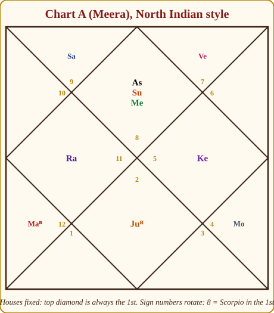
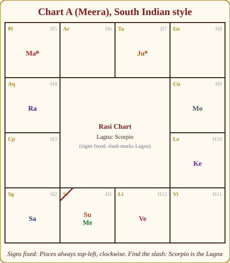
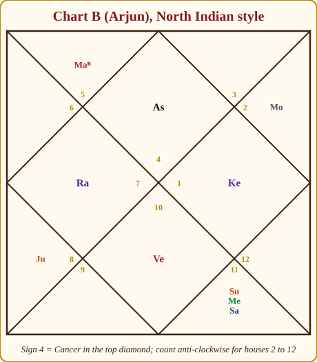
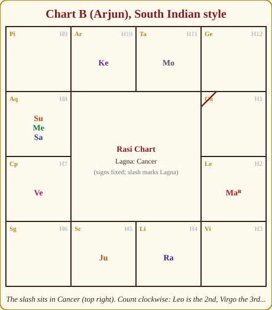
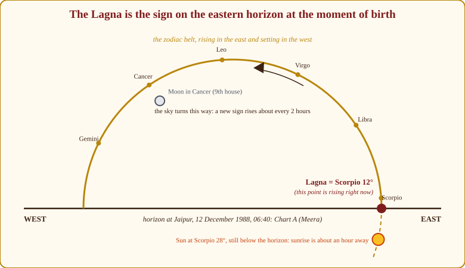
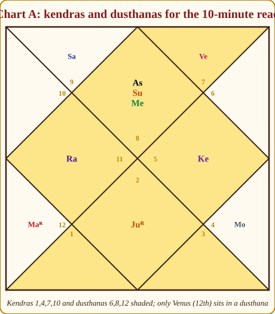

# Chapter 5: Reading Your First Chart: Layout, Lagna, and the Twelve Ascendants

You now know the actors, the costumes and the rooms. This chapter puts you in front of an actual chart and teaches you what to do with your eyes and hands in the first ten minutes. Then it introduces the twelve rising signs one by one, because the Lagna is the single most important fact in any chart, and anyone who knows the twelve Lagnas well can say something true and useful to a person within a minute of sitting down.

## Reading a North Indian chart, step by step

The North Indian chart is a square with a diamond inside it. **The houses never move.** The top diamond is always the 1st house. From there the houses run anti-clockwise: the top-left triangle is the 2nd, the left-hand triangle is the 3rd, the left diamond is the 4th, and so on round, ending with the top-right triangle as the 12th. **The signs rotate.** Each house has a small number in it; that is the *sign* sitting in that house for this particular chart.

*Figure 5.1: Chart A, North Indian style. The houses are fixed; the small gold numbers are sign numbers. 8 in the top diamond means Scorpio is the 1st house.*

Here is how I read it, every time, in this order.

1. **Find the Lagna sign.** Look at the number in the top diamond. Chart A: 8, Scorpio. Say it aloud: "Scorpio rising."
2. **Check the sequence.** Going anti-clockwise, the numbers should run 8, 9, 10, 11, 12, 1, 2, 3, 4, 5, 6, 7. If they do not, the chart is drawn wrongly or you are reading clockwise. This one check saves you from half of all beginner errors.
3. **Name the four kendras.** Top (1st): Scorpio with Sun and Mercury. Left (4th): Aquarius with Rahu. Bottom (7th): Taurus with Jupiter. Right (10th): Leo with Ketu. You have just seen the pillars of the life.
4. **Name the two remaining trikonas.** Bottom-left triangle (5th): Pisces with Mars. Bottom-right triangle (9th): Cancer with the Moon.
5. **Name the dusthanas.** 6th (bottom-left, below the 5th): Aries, empty. 8th (bottom-right, below the 7th): Gemini, empty. 12th (top-right): Libra with Venus.
6. **Note what is left.** 2nd: Sagittarius with Saturn. 3rd and 11th: empty.

Six steps, sixty seconds, and you have the whole chart in your head.

## Reading a South Indian chart, step by step

The South Indian chart is a grid of twelve boxes around an empty centre. **The signs never move.** Pisces is always the top-left box, Aries next to it, Taurus, Gemini across the top; then Cancer, Leo, Virgo down the right; Libra, Scorpio, Sagittarius across the bottom from right to left; Capricorn and Aquarius up the left side. Signs run clockwise. **The Lagna is marked**, usually a diagonal slash in one corner of a box, sometimes the letters "As" or "La".

*Figure 5.2: The same chart, South Indian style. Signs fixed and running clockwise from Pisces at top-left. The slash in the Scorpio box marks the Lagna. Count clockwise from there for houses 2 to 12.*

1. **Find the slash.** Chart A: it is in Scorpio, bottom row, second from the left. That box is the 1st house.
2. **Count clockwise for the houses.** Sagittarius (bottom-left) is the 2nd, Capricorn (left, lower) is the 3rd, Aquarius the 4th, Pisces the 5th, and so on round to Libra as the 12th.
3. **Locate the kendras**, they are always the box with the slash and the boxes three, six and nine steps clockwise. Here: Scorpio, Aquarius, Taurus, Leo. Same four signs you found in the diamond, naturally.
4. Proceed exactly as before: trikonas, dusthanas, the rest.

Now do both formats for Chart B, and notice how the same information looks in each.

*Figure 5.3: Chart B, North Indian. Sign 4 (Cancer) in the top diamond. Three planets crowd the 8th house at the bottom right.*

*Figure 5.4: Chart B, South Indian. The slash sits in Cancer, top right. Aquarius (left column) holds Sun, Mercury and Saturn, count clockwise from Cancer and it is the 8th.*

> **⚠️ Common beginner mistake:** Counting the South Indian chart anti-clockwise because "the zodiac runs anti-clockwise". In the South Indian grid the signs and houses both run *clockwise*. In the North Indian diamond they run *anti-clockwise*. Keep a chart of each style in your notebook until the difference is automatic.

> **🔍 Why?** Why do the two styles fix different things? Because they answer two different questions. The North Indian diamond answers *"what is in my 1st house, my 7th, my 10th?"*, so the houses stay put and the signs are written in as numbers. The South Indian grid answers *"where is Aries, where is Scorpio?"*, so the signs stay put and you find your own 1st house by the slash. This is *design logic*, not doctrine: two maps of the same city, one centred on your journey and one showing the fixed network. Everyday parallel: the railway map on your phone that puts *you* at the centre, versus the printed network map on the station wall where the stations never move and you have to find yourself.

## Finding the Lagna

**In software.** Enter date, time and place; set Lahiri ayanamsa and whole-sign houses; the program gives you the Lagna to the minute of arc. Check two things before trusting it: that the time zone is right (older Indian births are sometimes recorded in local mean time or in "railway time" that differs from IST), and that daylight-saving time, if the birth was abroad, has been handled.

**Roughly, by hand.** You can estimate a Lagna in your head, useful when a client says "I was born around dawn" or when checking whether a chart looks right. The principle is simple: at sunrise, the Sun is on the eastern horizon, so **at sunrise the Lagna is the Sun's sign, at roughly the Sun's degree**. From then on the eastern horizon sweeps through the zodiac, and a new sign rises roughly every two hours. Two hours after sunrise the Lagna is one sign ahead of the Sun; at midday it is about three signs ahead (the Sun is overhead, the 10th house, as directional strength told us); at sunset the Lagna is six signs ahead (the Sun is setting in the 7th); at midnight, nine signs ahead.

*Figure 5.5: The Lagna is simply the point of the zodiac on the eastern horizon. Meera was born a little before sunrise, so her Lagna is in the Sun's sign, a few degrees behind the Sun.*

> **🔍 Why?** Why a new sign roughly every two hours? *Astronomy:* the Earth turns 360° in 24 hours, 15° an hour, so the eastern horizon sweeps through a 30° sign in about two hours. The "roughly" is also astronomy: the zodiac is tilted to the Earth's equator, so some signs cross the horizon steeply and quickly and others lie flat and take longer, and the difference grows with latitude. Everyday parallel: a platform where a new train pulls in every two hours by the rotation of a fixed timetable, except that some trains are short and clear the platform fast, and some are long.

Meera is the perfect example. Born at 06:40 in Jaipur in mid-December, a little before sunrise, with the Sun at 28° Scorpio. Before sunrise the Sun is still below the horizon and the rising point is *behind* it, so the Lagna is Scorpio, an earlier degree. Her Lagna is Scorpio 12°. The rule holds.

Now the warning. "Two hours per sign" is an average. Because the zodiac is tilted to the Earth's equator, some signs rise quickly and some slowly, and the effect grows the further you are from the equator. For Indian latitudes (roughly 10°–30° N) the pattern is:

| Sign rising | Approximate time to rise (India) | Sign rising | Approximate time to rise (India) |
|---|---|---|---|
| Aries | 1 h 40 min | Libra | 2 h 10 min |
| Taurus | 2 h 00 min | Scorpio | 2 h 15 min |
| Gemini | 2 h 10 min | Sagittarius | 2 h 05 min |
| Cancer | 2 h 15 min | Capricorn | 1 h 50 min |
| Leo | 2 h 10 min | Aquarius | 1 h 35 min |
| Virgo | 2 h 05 min | Pisces | 1 h 35 min |

Aquarius, Pisces and Aries hurry over the horizon in about an hour and a half; Cancer, Leo, Libra and Scorpio take well over two hours. In Delhi the spread is wider than in Chennai. So the hand method tells you the *likely* Lagna and its neighbours; it cannot tell you the degree, and near a sign boundary it cannot even be sure of the sign. **Use software for anything you will say to a client.** The hand method is for your own sanity checks and for those "around sunset" conversations.

> **💡 Did you know?** The unequal rising times are why old Indian almanacs printed *Lagna tables* for each major city, Ujjain, Varanasi, Madras, giving the rising duration of each sign in *ghatis* (units of 24 minutes). Before software, an astrologer's accuracy depended on owning the right table for the right latitude.

## Why the birth time matters so much

The Sun moves one degree a day; the Moon moves one degree in about two hours. But the Lagna moves one degree every *four minutes*. Get the time wrong by two hours and the entire chart re-shuffles: every planet moves to a different house, the lord of the chart changes, and the person you describe is someone else.

> **🔍 Why?** Why does the *time* matter more than the *date*? *Astronomy and logic together:* the date fixes the planets' signs, the Sun changes sign once a month, the Moon every 2¼ days, the rest more slowly, so two people born on the same day share almost all their planet-in-sign placements. The time fixes the Lagna, and the Lagna fixes which house every one of those planets falls in. Same actors in the same costumes; a different room for each. Everyday parallel: two weddings on the same date invite the same relatives, but seat them in different rooms, and the evening goes quite differently.

Even a smaller error matters. A planet near the end of a sign can move from the 9th house to the 10th with a twenty-minute change; a Moon at the edge of a nakshatra can shift the whole dasha sequence. This is why a careful astrologer asks not only "what time?" but "how do you know?", a hospital record is gold; "my mother says around evening" is a starting point for detective work.

That detective work is **birth-time rectification**, and the basics are within your reach by Chapter 13. The method: take the possible range of times; for each candidate Lagna, check whether the dasha periods line up with three or four dated events the client is sure of, a marriage, the birth of a child, a father's death, a major job change or move. Marriage tends to fall in periods of Venus, the 7th lord, or planets in the 7th; a child's birth in periods of Jupiter or the 5th lord; a parent's passing in periods connected with the 9th/4th lords or maraka planets. When one candidate explains all the events and the others do not, you have your time. Add the physical evidence, build, face, temperament, from the Lagna descriptions later in this chapter, and you are usually right.

> **🪔 Consultation tip:** Never guess a Lagna silently and read as if it were certain. Say: "Your time is approximate, so there are two possible rising signs. Let me ask you three questions to decide." The client feels respected, and you avoid the humiliation of describing the wrong person.

## The Lagna lord: the captain of the ship

The planet that owns the rising sign is the **Lagna lord** (*Lagnesha*). If the Lagna is the front door, the Lagna lord is the person who holds the key. Its strength is the person's strength; its placement shows *where the self goes to find itself*.

> **📖 Story: The captain at the door.** Every haveli has a captain, the person who actually runs the household, keys at the waist. When you visit, the first thing to learn is *where in the house the captain spends the day*. If she is always at the front door (1st), the household is about itself. If she lives in the kitchen (2nd), it is about food, money and talk. If she is forever in the mother's room (4th), home comes first; in the roof office (10th), work comes first; in the guest-house across the lane (12th), she is half gone already, abroad, in retreat, or in the hospital wing. The Lagna lord is that captain, and its house is where the self goes to find itself. **Rule:** Read the Lagna lord's house as the room where the person's identity is invested.

Here is what its house says, derived logically, the Lagna lord carries the 1st house (the self) into whichever room it sits in.

| Lagna lord in | Ease | The self is invested in... |
|---|---|---|
| 1st | 🟢 | Itself: a self-made, physically strong person; identity is the project. |
| 2nd | 🟡 | Family, wealth and speech: earns by own effort; a voice that defines them. |
| 3rd | 🟡 | Courage and communication: the self-made fighter, writer, sibling-bound. |
| 4th | 🟢 | Home, mother, land, learning: happiest at home; property and peace matter. |
| 5th | 🟢 | Intelligence and children: a creative identity; fortunate (a trikona). |
| 6th | 🔴 | Struggle and service: a competitor; health needs care; thrives in service professions. |
| 7th | 🟢 | The partner and the public: identity found through relationship; travel. |
| 8th | 🔴 | The hidden and the transforming: obstacles early, depth later; research, occult. |
| 9th | 🟢 | Fortune, father, guru: graced; travels far; a life carried by faith. |
| 10th | 🟢 | Career: defined by work; visible; status-seeking and usually status-achieving. |
| 11th | 🟢 | Gains and friends: well networked; wishes tend to be fulfilled. |
| 12th | 🔴 | Foreign lands and the inner life: spends, travels, withdraws; a spiritual pull. |

Chart A: Scorpio rises, so Mars is the captain, and Mars sits retrograde in the 5th house in Pisces. The self is invested in intelligence, creativity and children; a trikona placement, so fortunate; retrograde, so the drive turns inward before it turns outward. Chart B: Cancer rises, the Moon is captain, sitting exalted in the 11th in Taurus. The self is invested in gains and friendships, and the captain is in excellent shape, whatever else the chart says, this person has a steady mind and people who help him.

## The twelve Lagnas

What follows is a page for each rising sign: body and temperament, the Lagna lord, which planets are friends and which are troublemakers for that Lagna (a one-line preview from Appendix A.6, the full logic is Chapter 8), typical strengths and struggles, career leanings, the stereotype, and how to speak to such a client. Read these as sketches of a *tendency*. The rest of the chart adds, softens or contradicts every line.

> **📖 Story: Twelve hosts at the front door.** Knock on twelve havelis and twelve hosts answer. **Aries** flings the door open before you have finished knocking. **Taurus** will not discuss anything until you have eaten. **Gemini** asks you three questions on the doorstep and answers two of them himself. **Cancer** asks after your mother, and means it. **Leo** receives you from his chair and you feel oddly honoured. **Virgo** notices your shoes and quietly moves the doormat. **Libra** asks whether you would prefer tea or coffee, and then asks again. **Scorpio** watches you through the half-open door for a moment before it swings wide. **Sagittarius** tells you about his last pilgrimage before you have sat down. **Capricorn** checks the clock, then gives you exactly the time he promised. **Aquarius** is already telling you about the neighbourhood committee. **Pisces** has made up a bed for you before you said you were staying. **Rule:** The Lagna is the host's manner at the door, the body, the temperament, the first impression; the Lagna lord tells you where in the house that host actually lives.

### Aries Lagna (Mesha)

**Body and temperament.** Lean, energetic, quick-moving; a prominent forehead or a mark on the head; walks fast, talks first. Impatient, direct, brave, generous in a hurry, quick to anger and quick to forget it.

**Lagna lord:** Mars. 🟢 **Friends for this Lagna:** Sun, Mars, Jupiter. 🔴 **Troublemakers:** Mercury, Venus, Saturn. 🟡 **Neutral:** Moon.

**Strengths and struggles.** Initiative, courage, honesty that borders on bluntness. Struggles with patience, with finishing what was started, with listening. Health: head, fevers, accidents from haste.

**Career leanings.** Anything that rewards a fast start: the armed forces, sport, surgery, engineering, entrepreneurship, sales that need nerve.

**The stereotype.** The young officer who leads the charge and asks questions afterwards.

**Talking to this client.** Be direct; they respect it. Give them a plan with a first step they can take today. Do not lecture about patience, show them where waiting *wins*.

### Taurus Lagna (Vrishabha)

**Body and temperament.** Solid, well-built, a strong neck, pleasant face and voice; moves unhurriedly. Loyal, sensual, practical, attached to comfort and to people; stubborn once decided.

**Lagna lord:** Venus. 🟢 **Friends:** Saturn (the yogakaraka), Sun, Mercury. 🔴 **Troublemakers:** Moon, Jupiter, Mars. 🟡 **Neutral:** Venus itself, since it also owns the 6th.

**Strengths and struggles.** Reliability, taste, financial sense, endurance. Struggles with change, possessiveness, and a temper that arrives late and stays. Health: throat, thyroid, weight.

**Career leanings.** Finance and banking, real estate, food and hospitality, music and the arts, agriculture, anything built slowly and held.

**The stereotype.** The family jeweller whose shop has stood on the same corner for three generations.

**Talking to this client.** Never rush them. Give concrete numbers and dates. Frame every change as a way of *protecting* what they have.

### Gemini Lagna (Mithuna)

**Body and temperament.** Tall or slender, expressive hands, quick eyes, a youthful look kept late. Curious, witty, restless, sociable, easily bored; two of everything, jobs, opinions, phones.

**Lagna lord:** Mercury. 🟢 **Friends:** Venus, Saturn, Mercury. 🔴 **Troublemakers:** Mars, Jupiter, Sun. 🟡 **Neutral:** Moon.

**Strengths and struggles.** Communication, adaptability, learning anything fast. Struggles with depth, follow-through and nervous exhaustion. Health: lungs, shoulders, nerves.

**Career leanings.** Writing, journalism, teaching, trade and marketing, technology, translation, media, anything with words and movement.

**The stereotype.** The journalist who knows everyone and files three stories a day.

**Talking to this client.** Keep it interesting; give them the *why* behind every suggestion. They will argue, enjoy it. Offer options, not orders.

### Cancer Lagna (Karka)

**Body and temperament.** Round face, soft body, gains weight easily, gentle eyes. Emotional, protective, nostalgic, deeply attached to family and home; moody, easily hurt, slow to trust and utterly loyal once trust is given.

**Lagna lord:** Moon. 🟢 **Friends:** Mars (the yogakaraka), Jupiter, Moon. 🔴 **Troublemakers:** Venus, Mercury. 🟡 **Neutral:** Sun, Saturn.

**Strengths and struggles.** Empathy, memory, nurturing, intuition about people. Struggles with mood swings, holding grudges, letting others go. Health: chest, digestion, fluid balance.

**Career leanings.** Care professions, nursing, teaching small children, hospitality, food, real estate, the sea and shipping, psychology, anything involving the public's mood.

**The stereotype.** The mother who runs a hostel and knows every student's problem before they mention it.

**Talking to this client.** Warmth first, facts second. Acknowledge the feeling before you give the plan. Arjun (Chart B) has this Lagna: begin with his mother and his home, and he will listen to anything.

### Leo Lagna (Simha)

**Body and temperament.** Broad shoulders, an upright bearing, a large head or mane of hair, a commanding voice even when quiet. Proud, generous, loyal, theatrical, needs respect and gives it; can be autocratic and thin-skinned about criticism.

**Lagna lord:** Sun. 🟢 **Friends:** Mars (the yogakaraka), Jupiter, Sun. 🔴 **Troublemakers:** Mercury, Venus, Saturn. 🟡 **Neutral:** Moon.

**Strengths and struggles.** Leadership, warmth, courage, dignity under pressure. Struggles with ego, delegation and admitting error. Health: heart, spine, stomach.

**Career leanings.** Administration, government, politics, management, entertainment, medicine, anything with a chair at the head of the table.

**The stereotype.** The district collector everyone stands up for when he enters the room.

**Talking to this client.** Respect the crown; never embarrass them. Frame difficulties as tests of a leader. Praise honestly, then advise.

### Virgo Lagna (Kanya)

**Body and temperament.** Neat, slim, youthful, fine features, a careful way of dressing. Analytical, precise, helpful, modest, anxious; sees the one crooked tile; serves quietly and expects nothing, then resents it.

**Lagna lord:** Mercury. 🟢 **Friends:** Venus (the yogakaraka), Mercury. 🔴 **Troublemakers:** Mars, Jupiter, Moon. 🟡 **Neutral:** Sun, Saturn.

**Strengths and struggles.** Skill, discernment, reliability, health-consciousness. Struggles with worry, perfectionism and self-criticism. Health: intestines, digestion, skin.

**Career leanings.** Medicine and pharmacy, accountancy and audit, editing, research, nutrition, quality control, computing, craft.

**The stereotype.** The family doctor who remembers every patient's blood-pressure reading.

**Talking to this client.** Be exact; vague reassurance irritates them. Give details, degrees, dates. Remind them, gently, that "good enough" is a legitimate category.

### Libra Lagna (Tula)

**Body and temperament.** Graceful, well-proportioned, attractive features, a pleasant manner; dislikes ugliness in things and in people. Fair, diplomatic, charming, indecisive; wants everyone to be happy and pays a price for it.

**Lagna lord:** Venus. 🟢 **Friends:** Saturn (the yogakaraka), Mercury, Venus. 🔴 **Troublemakers:** Jupiter, Sun, Mars. 🟡 **Neutral:** Moon.

**Strengths and struggles.** Balance, negotiation, aesthetics, partnership. Struggles with decision, confrontation and dependence on others' approval. Health: kidneys, lower back, sugar.

**Career leanings.** Law, diplomacy, design and fashion, the arts, counselling, trade, human resources, anything requiring an even hand.

**The stereotype.** The judge who hears both sides so patiently that the court runs late.

**Talking to this client.** Present two paths with the trade-offs made clear, then help them choose. They will thank you for the *permission* to decide.

### Scorpio Lagna (Vrishchika)

**Body and temperament.** Compact, strong, magnetic eyes, a guarded posture; often a low, controlled voice. Intense, private, loyal, investigative; forgives slowly, forgets never; capable of extraordinary transformation.

**Lagna lord:** Mars. 🟢 **Friends:** Jupiter, Moon, Sun, Mars (the Sun and Moon together act as yogakarakas). 🔴 **Troublemakers:** Mercury, Venus, Saturn. 🟡 **Neutral:** none.

**Strengths and struggles.** Depth, focus, resilience, penetrating insight into people. Struggles with suspicion, secrecy, jealousy and letting go. Health: reproductive system, excretion, infections.

**Career leanings.** Medicine and surgery, research, investigation and intelligence, psychology, the occult and astrology itself, insurance, chemistry, crisis management.

**The stereotype.** The surgeon who says little, sees everything, and whom patients trust completely.

**Talking to this client.** Earn trust first; do not perform. Be truthful about difficult things, they can tell when you soften, but always show the transformation on the other side. Meera (Chart A) has this Lagna, and every reading of her chart should begin with respect for its depth.

### Sagittarius Lagna (Dhanu)

**Body and temperament.** Tall or long-limbed, strong thighs, an open face and a ready laugh. Optimistic, principled, philosophical, frank to a fault, restless for horizons; can be preachy and careless with details.

**Lagna lord:** Jupiter. 🟢 **Friends:** Sun, Mars, Jupiter (the Sun and Mercury together act as yogakarakas). 🔴 **Troublemakers:** Venus, Saturn. 🟡 **Neutral:** Mercury, Moon.

**Strengths and struggles.** Faith, vision, teaching, honesty, luck that arrives just in time. Struggles with over-promising, impatience with small print, and a tendency to lecture. Health: hips, thighs, liver, weight.

**Career leanings.** Teaching and academia, law, religion and philosophy, publishing, foreign trade and travel, sport, advisory roles.

**The stereotype.** The professor who is always about to leave on a pilgrimage.

**Talking to this client.** Talk about meaning and purpose; they engage with the big picture. Then quietly hand them the details they will otherwise skip.

### Capricorn Lagna (Makara)

**Body and temperament.** Lean, bony, a long face; looks old when young and young when old; a dry, slow humour. Ambitious, disciplined, dutiful, cautious, reserved; carries responsibility early and complains rarely.

**Lagna lord:** Saturn. 🟢 **Friends:** Venus (the yogakaraka), Mercury, Saturn. 🔴 **Troublemakers:** Mars, Jupiter, Moon. 🟡 **Neutral:** Sun.

**Strengths and struggles.** Persistence, realism, organisation, integrity. Struggles with pessimism, rigidity, loneliness and the belief that nothing comes without suffering. Health: knees, joints, bones, teeth, skin.

**Career leanings.** Administration, engineering, construction, government service, mining and heavy industry, management, anything that rewards the long climb.

**The stereotype.** The chief engineer who built the dam and never made a speech about it.

**Talking to this client.** Respect their seriousness; do not jolly them along. Show them a timeline. Remind them that Saturn's rewards *do* come, and that rest is also a duty.

### Aquarius Lagna (Kumbha)

**Body and temperament.** Tall, strong calves, a thoughtful face that seems to be listening to something far away. Idealistic, independent, humanitarian, unconventional, detached; many acquaintances, few intimates; fixed in principle.

**Lagna lord:** Saturn. 🟢 **Friends:** Venus (the yogakaraka), Saturn. 🔴 **Troublemakers:** Jupiter, Moon, Mars. 🟡 **Neutral:** Mercury, Sun.

**Strengths and struggles.** Vision, originality, fairness, systems thinking. Struggles with emotional distance, stubbornness about ideas and a feeling of not belonging. Health: calves and ankles, circulation, nerves.

**Career leanings.** Science and technology, social work and reform, engineering, aviation, astrology, large organisations and NGOs, anything that serves the group.

**The stereotype.** The scientist who is happier with a problem than with a party.

**Talking to this client.** Treat them as an equal thinker. Explain the principle behind the remedy or they will not do it. Do not appeal to sentiment; appeal to fairness and to the greater good.

### Pisces Lagna (Meena)

**Body and temperament.** Soft, often plump body, large liquid eyes, small feet; a gentle voice. Compassionate, imaginative, adaptable, devotional; easily influenced, prone to escape into dreams, food or others' troubles; sacrifices too readily.

**Lagna lord:** Jupiter. 🟢 **Friends:** Mars, Moon, Jupiter (Mars and Jupiter together act as yogakarakas). 🔴 **Troublemakers:** Saturn, Venus, Sun, Mercury. 🟡 **Neutral:** none.

**Strengths and struggles.** Empathy, faith, creativity, healing presence. Struggles with boundaries, decision, self-pity and practical money matters. Health: feet, lymph, sleep, sensitivity to medicines.

**Career leanings.** Healing and medicine, the arts and music, spiritual vocations, charity work, hospitality, the sea, film and photography.

**The stereotype.** The temple musician whom everyone brings their sorrows to, and who forgets to eat.

**Talking to this client.** Gentleness, but with structure. Give them one concrete boundary to keep and one practical step to take. They will feel your kindness; make sure they also leave with a plan.

## The ten-minute first read

Whatever the chart, whoever the client, I do the same ten minutes before I say a single word. It is a checklist, and I recommend you write it on the first page of your notebook.

> **📖 Story: Walking the haveli once.** Before I say a word to a client I walk through their haveli once, always by the same route. I stop at the **front door** and ask who owns it and where the captain is (Lagna and its lord). I pay my respects to the **Queen Mother** in her room (the Moon, its sign and star), because she decides how everything I say will be received. I check the **four pillars** that hold the roof (planets in the kendras). I look into the **store-room, the back stairs and the guest-house** (the dusthanas) to see who has been sent there. I note which courtier is being **honoured** and which **humiliated** (exalted and debilitated planets). I read the **railway timetable** pinned to the wall (the current dasha and the next). Then, and only then, I turn to the host and ask **one question** to make sure I am in the right house. **Rule:** Lagna and lord; Moon and nakshatra; kendras; dusthanas; dignities; dasha; one confirming question, in that order, every time.

1. **Lagna and its lord.** Which sign rises; where is its lord; how strong is it (sign dignity, house, retrograde, combustion)?
2. **Moon sign and nakshatra.** How will this person *feel* what I say? Which dasha sequence does the nakshatra set up?
3. **Planets in kendras.** What are the pillars, what is strong and visible in this life?
4. **Planets in dusthanas.** Where is the struggle, the specialisation, the hidden work?
5. **Exalted and debilitated planets.** Which actor is at the summit; which is in unfamiliar clothes?
6. **Current dasha.** What period is running now, and what is next? (Chapter 13 teaches the calculation; software gives it in a second.)
7. **One confirming question.** Ask the client something the chart should make true, and *listen*. If the answer is no, re-check the birth time before you go on.

> **🔍 Why?** Why this order and not another? *Logic of the system:* from the frame to the detail. Nothing can be judged until the Lagna is known, because the Lagna decides which house every planet is in, so it comes first. The Moon comes second because it is the second frame and it sets the dasha sequence. Kendras before dusthanas because you weigh strength before struggle; dignities next because they modify everything already seen; the dasha last because it only tells you *when* the things you have already found will speak. The confirming question comes at the end because it tests all of it at once. Everyday parallel: reading an exam paper, instructions first, then the marks distribution, then the questions, and only then the pen.

*Figure 5.6: Chart A prepared for the ten-minute read. Kendras and dusthanas are shaded; the eye goes to them first.*

Let us do it on Chart A, aloud.

**1. Lagna and lord.** Scorpio rises. Lord Mars, retrograde at 4° Pisces in the 5th house, a trikona, in Jupiter's sign, and Jupiter is Mars's friend. A comfortable, fortunate captain whose energy turns inward first. Sun and Mercury sit *in* the Lagna, strengthening it considerably: a strong front door.

**2. Moon.** Cancer, own sign, 21°, in the 9th: Ashlesha nakshatra, Mercury's star. A receptive, emotional, faith-anchored mind; shrewd (Ashlesha) beneath the softness. Because the birth Moon is in Mercury's star, the dasha sequence begins with Mercury.

**3. Kendras.** Sun and Mercury (1st), Rahu (4th), Jupiter retrograde (7th), Ketu (10th). Every pillar occupied, a visible, effective life. Strong self, unconventional home, a learned partner, a career that lets go of ego.

**4. Dusthanas.** Only Venus in the 12th, in its own sign Libra: comfortable expenses, private pleasures, foreign or distant connections in love; not a struggle so much as a quiet room.

**5. Exalted and debilitated.** Strictly, none of the planets is at its exaltation or debilitation sign. The Moon is in its own sign and Venus in its own sign, both dignified. Mercury in Scorpio and Saturn in Sagittarius are in neutral-to-friendly territory. Nothing is in the ditch.

**6. Dasha.** Mercury Mahadasha at birth, with a balance of about 11½ years (the Moon at 21° Cancer has traversed most of Ashlesha; (30 − 21) ÷ 13°20′ × 17 ≈ 11.5). Then Ketu for 7 years (age 11.5–18.5), Venus for 20 (18.5–38.5), Sun for 6 (38.5–44.5). Born December 1988, she entered the Venus period around mid-2007 and the Sun period around mid-2027. Marriage in 2016, inside Venus, the natural karaka of marriage, fits.

**7. One confirming question.** With Rahu in the 4th and Ketu in the 10th, I would ask: "Did you settle far from where you were born, or in a home very different from your parents'?" With Jupiter in the 7th: "Is your husband a teacher, or older in temperament than his years?" A yes to either, and I proceed with confidence. Two noes, and I would re-examine the birth time before saying anything more.

Ten minutes. You have not predicted anything yet, and already you could describe this woman to her satisfaction.

> **🧭 Anushka's rule of thumb:** Never open your mouth before you have finished the seven steps. The client's first impression of you is formed by your first sentence; make sure it is one the chart can defend.

## In one breath

- North Indian chart: houses fixed (top diamond = 1st, anti-clockwise), sign numbers rotate. South Indian chart: signs fixed (Pisces top-left, clockwise), find the Lagna slash.
- Always check the sign sequence and locate the four kendras first.
- The Lagna is the zodiac point on the eastern horizon: at sunrise it is the Sun's sign; roughly one sign every two hours after that, but signs rise unequally, so use software for anything you will say aloud.
- Birth time errors re-shuffle the chart; rectify by matching dasha periods to dated life events, and confirm with the physical Lagna description.
- The Lagna lord is the captain; its house shows where the self goes to find itself.
- Each of the twelve Lagnas has a body, a temperament, a set of friendly and unfriendly planets (Appendix A.6), typical careers, and a way it likes to be spoken to.
- The ten-minute read: Lagna and lord, Moon and nakshatra, kendras, dusthanas, exaltations and debilitations, current dasha, one confirming question.

## Practice

> **✍️ Practice:**
>
> 1. In Figure 5.3 (Chart B, North Indian), which sign number sits in the 8th house, and which planets are there? Confirm by finding the same box in Figure 5.4.
> 2. A client was born about two hours after sunrise in late April, when the Sun is in sidereal Aries. Roughly which sign rises? Which neighbouring signs would you also keep in mind, and why?
> 3. For a Libra Lagna, name the yogakaraka and the two planets Appendix A.6 lists as marakas. In one sentence, why is Saturn friendly to Libra even though it is a natural malefic? (Hint: which houses does it own from Libra?)
> 4. Arjun's Lagna lord is the Moon, in the 11th house, exalted. Write a two-sentence reading of the captain using the table in this chapter.
> 5. Run the seven-step checklist on Chart B and write one confirming question you would ask Arjun.

Answers

1. Sign 11, Aquarius, with Sun, Mercury and Saturn. In the South Indian chart Aquarius is the second box down the left-hand column; count clockwise from the Cancer slash and it is the 8th.
2. At sunrise the Lagna is Aries with the Sun; two hours later it is about one sign ahead, so Taurus. Keep Aries and Gemini in mind: Aries rises quickly (about 1 h 40 min at Indian latitudes), so the boundary may already be past, and "about two hours" is only an estimate. Software would settle it.
3. Yogakaraka: Saturn. Marakas: Mars and Jupiter. From Libra, Saturn owns Capricorn (the 4th, a kendra) and Aquarius (the 5th, a trikona), a kendra and a trikona lord in one planet, which is exactly the definition of a yogakaraka; its natural harshness is overruled by its functional role.
4. Arjun's self is invested in gains, friends and networks; wishes tend to come true through people. The captain is exalted in Taurus, so his mind is steady, comfortable and popular, a strong foundation beneath the intense 8th-house cluster.
5. Lagna Cancer, lord Moon exalted in the 11th; Moon in Krittika (Sun's star), so the dasha begins with the Sun (balance about 1.8 years), then Moon, Mars, Rahu (18.8–36.8). Kendras: Rahu 4th, Venus 7th, Ketu 10th. Dusthanas: Sun, Mercury, Saturn in the 8th (Saturn combust). Exalted: Moon. Debilitated: none. Confirming question: "Does your work involve research, insurance, or things most people never see, and did your father's life have a major upheaval?"

