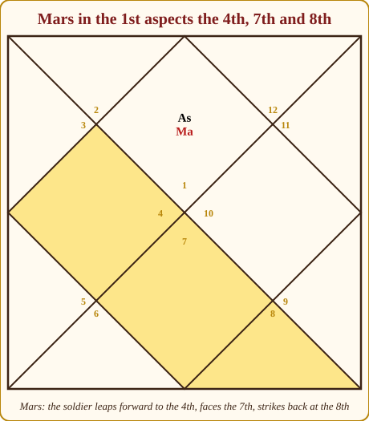
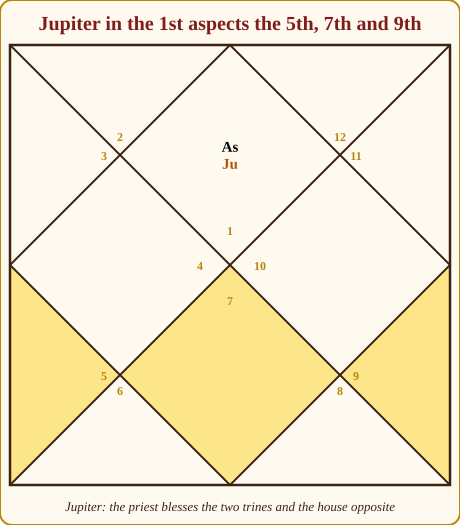
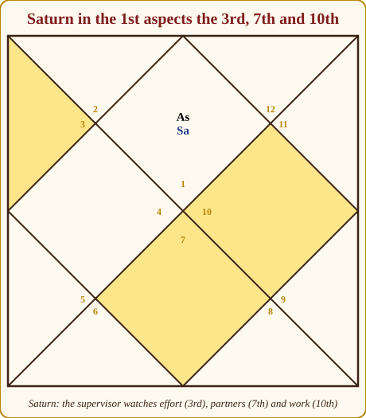
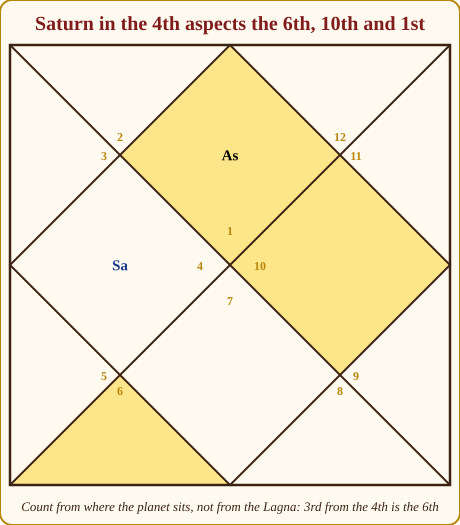
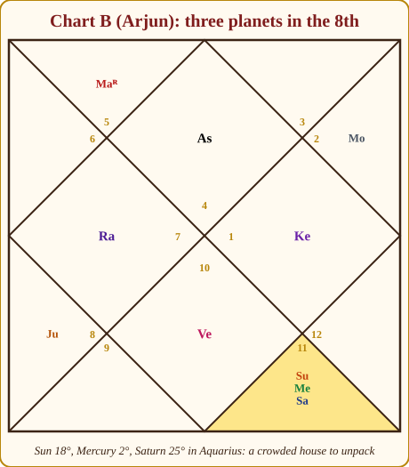
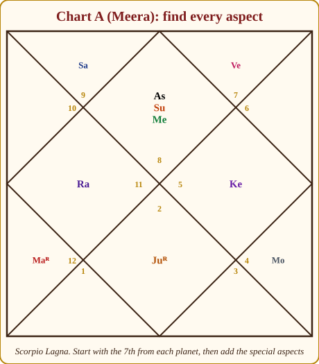

# Chapter 6: Aspects (Drishti) and Conjunctions (Yuti) — How Planets Talk

Until now we have placed the actors on the stage. Nine planets, twelve signs, twelve rooms — and you can already say, from Chapter 5, what a planet sitting in a room *does* there. But a planet does not only act where it sits. It also *looks*. And in a joint family, you know very well that the uncle sitting in the drawing room can run the whole kitchen with one glance.

That glance is what this chapter is about. An **aspect** (*Drishti*, literally "sight") is a planet's gaze falling on a house or on another planet from a distance. A **conjunction** (*Yuti*, "union") is two planets sitting in the same room and being forced to share it. These two — sight and company — are how planets talk to each other. Once you can read the conversation, a chart stops being a list of nine separate facts and becomes one connected story.

Let me give you the grammar first, then the reasons, then a full worked chart.

## What an aspect actually is

Picture a planet as a lamp. It lights up the room it sits in, of course. But it also throws a beam across the house to another room. Whatever is in that far room is bathed in the lamp's colour: Jupiter's beam is warm and gold and makes things grow; Saturn's beam is cold and blue and makes things slow down and get serious; Mars's beam is hot and red and makes things urgent.

So when I say "Saturn aspects the 7th house", I mean: Saturn is pouring its nature — delay, seriousness, duty, sometimes coldness — into the affairs of marriage and partnership, *even though Saturn is not sitting there*. The planet stays where it is. Its influence travels.

Two things to hold on to:

1. **Aspects are counted from the planet, not from the Lagna.** If Saturn is in the 4th house, its "7th aspect" falls on the 7th house *from the 4th*, which is the 10th house of the chart. Beginners forget this in the first month and then never again.
2. **An aspect is one-directional.** Saturn looking at the 7th does not mean the 7th looks back. (Two planets *can* look at each other — we come to that — but a house never looks at anything.)

> **🧭 Guruji's rule of thumb:** A planet acts where it sits and speaks where it looks. Sitting is louder than looking, but looking travels further.

## The Parashari rule: the 7th for everyone, plus three specials

Here is the entire rule from *Brihat Parashara Hora Shastra*, and Appendix A.4 has the same table:

| Planet | Full aspect on houses counted from itself |
|---|---|
| Sun, Moon, Mercury, Venus (and, by common practice, Rahu, Ketu) | 7th only |
| Mars | 4th, 7th, 8th |
| Jupiter | 5th, 7th, 9th |
| Saturn | 3rd, 7th, 10th |

That is it. Every planet looks straight across the chart at the house opposite it — the 7th from itself. Three planets have extra eyes. The classroom mnemonic in Hindi-speaking India is simply **"Mangal chaar-aath, Guru paanch-nau, Shani teen-das"** — Mars four-eight, Jupiter five-nine, Saturn three-ten. Say it ten times and it is yours for life.

### Why the 7th for everyone?

Because opposition is the most natural relationship in the sky. When the Moon is opposite the Sun we get a full Moon; two planets opposite each other stare across the wheel with nothing in between. Every planet has this straight stare. It is the "face to face" aspect, and it is why the 7th house — the house opposite the Lagna — is the house of the *other person*: spouse, partner, the public you face.

### Why does Mars look at the 4th and 8th?

Think of Mars as a soldier. A soldier does not only face the enemy in front (the 7th). He leaps forward to strike (the 4th, a short jump ahead) and turns to strike behind (the 8th, one step past the opponent). The 4th and 8th are both "square" houses (*Chaturasra*), the tense corners of the chart, and Mars, the planet of tension and action, owns those corners. There is a pleasing symmetry too: the 4th and 8th are equally far from the 6th — Mars's house of fighting.

*Figure 6.1: Mars in the 1st. The shaded houses receive its full gaze: the 4th (leap forward), the 7th (face to face), and the 8th (strike behind).*

### Why does Jupiter look at the 5th and 9th?

Jupiter is the royal priest. A priest blesses. The 5th and 9th are the **trines** (*Trikona*) — the houses of merit, children, fortune and dharma, "Lakshmi's houses" as the old teachers say. It is entirely in character that the great benefic, when it looks beyond its opposite, chooses to shower the two most auspicious houses in the chart. This is why a well-placed Jupiter is said to protect three houses at once, and why "Jupiter's aspect" is the single most common phrase you will hear a senior astrologer use to explain why something bad did not happen.

*Figure 6.2: Jupiter in the 1st blesses the two trines from itself, the 5th and 9th, along with the 7th.*

### Why does Saturn look at the 3rd and 10th?

Saturn is the supervisor, the strict foreman on a construction site. What does a foreman watch? Effort (the 3rd house — courage, hard work, initiative) and output (the 10th — work, career, duty). Saturn's gaze on the 3rd says "work harder"; on the 10th it says "do your duty, and it will be slow." Notice that 3 and 10 are both **growing houses** (*Upachaya*), where results come with time. Saturn is the planet of time. The fit is exact.

*Figure 6.3: Saturn in the 1st supervises the 3rd (effort), the 7th (partnerships) and the 10th (career).*

### Now count from a different house

Put Saturn in the 4th instead. The 3rd from the 4th is the 6th; the 7th from the 4th is the 10th; the 10th from the 4th is the 1st. So a 4th-house Saturn aspects the 6th, 10th and 1st houses — including the Lagna itself. Trace it on the diagram with your finger until it feels obvious.

*Figure 6.4: The same three aspects, now counted from the 4th. Saturn's 10th aspect lands on the Lagna.*

> **⚠️ Common beginner mistake:** Counting aspects from the Lagna. "Saturn aspects the 3rd, 7th and 10th" is only true when Saturn is *in the 1st*. Always start the count at the house the planet occupies, and count that house as 1.

## Reading an aspect on a house versus on a planet

An aspect on an **empty house** colours the *affairs* of that house. Jupiter aspecting an empty 4th house says: the home, the mother, the property matters of this life have a protector; education is favoured. Saturn aspecting an empty 2nd says: money comes slowly, speech is measured, the family carries responsibilities.

An aspect on a **planet** colours the *planet's behaviour*, and through it every house that planet owns. This is the more powerful case. Saturn aspecting the Moon does not just chill the house the Moon sits in; it chills the Moon itself — the mind becomes cautious, prone to worry, mature early — and it touches whichever house the Moon rules. Jupiter aspecting Venus makes love generous and marriage respectable, wherever those two sit.

So when you scan a chart, ask two questions of every aspect: *which room does the beam light?* and *is anyone standing in the beam?*

## Benefic and malefic aspects

Here is the simplest usable rule. The gaze of Jupiter, Venus, a bright Moon, and an unafflicted Mercury **protects and grows** what it touches. The gaze of Saturn, Mars, the Sun (mildly), Rahu and Ketu **tests and pressures** what it touches. Neither is "good" or "bad" in the moral sense; a house that is only ever protected produces a soft, untested life, and a house that is only ever pressured produces a hard one. Most houses receive a mixture, and most lives are a mixture.

Two refinements worth knowing from the start:

- **A malefic's gaze on a malefic house is often welcome.** Saturn aspecting the 6th (enemies, disease, debts) restrains those things. The cruel planets do well in and on the cruel houses — "a thief to catch a thief", as my teacher put it.
- **A benefic's gaze on a benefic house is the classical protection.** Jupiter aspecting the 5th or 9th, Venus aspecting the 7th: these are the aspects that soften even a difficult period.

The *functional* nature of a planet — whether it is a friend or an enemy for *your particular Lagna* — modifies all of this, and Chapter 8 is entirely about that. For now, think in natural terms.

## When two planets look at each other: mutual aspect

If Mars is in the 1st and Saturn in the 7th, Mars aspects the 7th (Saturn) and Saturn aspects the 7th (Mars). They are staring at each other. This is a **mutual aspect** (*paraspara drishti*), and it is far stronger than a one-way glance, because the two planets are now in a *relationship*. Their natures blend almost as if they were in the same house.

Mutual aspects happen most easily through the 7th, because every planet has it. But watch for the special aspects too: Jupiter in the 1st and Saturn in the 9th — Jupiter's 9th aspect falls on Saturn, and Saturn's 3rd aspect... falls on the 11th, not the 1st. So that one is *one-way*. Check both directions every time; do not assume.

### The four kinds of relationship (Sambandha)

This word — **Sambandha**, "connection" — is going to matter enormously in Chapter 10, where nearly every great yoga is defined as "the lord of X connected with the lord of Y". Parashara and the tradition recognise four ways two planets can be connected:

| # | Relationship | What it means | Strength |
|---|---|---|---|
| 1 | Conjunction (*Yuti*) | Both in the same sign/house | Strongest |
| 2 | Mutual aspect (*paraspara drishti*) | Each aspects the other | Strong |
| 3 | Exchange of signs (*Parivartana*) | A sits in B's sign, B sits in A's sign (Chart C: Moon in Jupiter's Sagittarius, Jupiter in the Moon's Cancer) | Strong, and very special (Chapter 9) |
| 4 | Sitting in each other's sign one way | A sits in B's sign, but B does not return the favour | Weakest; some teachers do not count it alone |

When you see two planets connected in any of these four ways, their houses are fused. A 9th lord connected with a 10th lord fuses fortune with career — the celebrated *Dharma-Karma Adhipati* yoga of the classics. A 6th lord connected with the 7th lord fuses disputes with marriage. The connection itself is neutral machinery; what it produces depends on *which* houses and *which* planets.

> **🧭 Guruji's rule of thumb:** Before you name any yoga, prove the Sambandha. If the two lords are not together, not looking at each other, and not in each other's signs, they are not connected, and the yoga is not there — however much the client wants it to be.

## Conjunctions: two planets in one room

A conjunction is the most intimate relationship. Two planets in one house are like two relatives sharing one bedroom: their habits mix whether they like it or not. The house receives *both* natures at once, and each planet takes on some of the other's colour.

The art of reading a conjunction is **blending**. You do not read Sun-in-the-1st and then Mercury-in-the-1st separately and add the lists. You ask: what happens when *authority* (Sun) and *intellect* (Mercury) live together? You get someone whose intelligence is confident and whose confidence is articulate — a natural speaker, teacher, administrator. That is the famous **Budha-Aditya yoga**, and you have just derived it from first principles.

The table below gives you the classical flavour of every pair. Thirty-six pairs are possible on paper; one of them, Rahu with Ketu, never happens, because the nodes are always exactly opposite each other. These are *starting points*: the sign, the house, dignity and other aspects always modify them.

| Pair | Traditional name (if any) | Core flavour |
|---|---|---|
| Sun + Moon | Amavasya (new-Moon) birth | Mind merged with ego and father; a dim Moon that needs support from Jupiter; strong will, low outward emotion |
| Sun + Mars | — | Commander's fire: courage, engineering, army/police, surgery; temper with father or authority |
| Sun + Mercury | **Budha-Aditya** | Articulate intelligence, administration, teaching, mathematics — provided Mercury is not combust |
| Sun + Jupiter | — | Dharmic authority: teacher-fathers, advisors, judges, men of principle; sometimes pride in one's wisdom |
| Sun + Venus | — | Glamour with position: arts in government or corporations; Venus is often combust here, so marriage may need patience |
| Sun + Saturn | — | Friction with father or bosses; late recognition; the discipline of working for a stern authority; a serious childhood |
| Sun + Rahu | Grahan (eclipse) yoga | Unconventional or foreign fathers/authority; ambition that overshoots; ego confusion, then a distinctive identity |
| Sun + Ketu | Grahan (eclipse) yoga | Detachment from ego and from the father figure; spiritual or technical depth; low need for applause |
| Moon + Mars | **Chandra-Mangala** | Earning drive, competitiveness, quick temper; mother's health or a forceful mother; property through effort |
| Moon + Mercury | — | Quick, verbal, restless mind; writers and traders; Mercury dislikes the Moon, so the mind can second-guess itself |
| Moon + Jupiter | (Gaja-Kesari, since the same house is a kendra from itself) | Optimism, wisdom, protection, a generous mother; sometimes over-trusting |
| Moon + Venus | — | Artistic, comfort-loving, soft-hearted; beauty and hospitality; can drift into indulgence |
| Moon + Saturn | **Vish (poison) yoga** / Punarphoo | Melancholy, early responsibility, delayed comforts, a struggling or distant mother; also great emotional endurance |
| Moon + Rahu | Grahan yoga | Vivid imagination, anxiety, phobias, fascination with the foreign or the hidden; a mind that needs anchoring |
| Moon + Ketu | Grahan yoga | Intuitive, detached, "old soul" mind; separation from mother or motherland; meditation comes easily |
| Mars + Mercury | — | Sharp tongue, technical skill, debate, surgery, coding; argumentativeness |
| Mars + Jupiter | Guru-Mangala | Righteous force: law, property, teaching with authority, defence of the weak; sometimes preachy |
| Mars + Venus | — | Passion: love with heat, arts with drive, sport, design; relationships that begin fast |
| Mars + Saturn | — | Hard labour, frustration, accident-prone when careless; also machines, mining, engineering, and stubborn endurance |
| Mars + Rahu | Angarak (popular name) | Explosive energy, risk-taking, technology, sudden anger; needs an outlet such as sport or surgery |
| Mars + Ketu | — | Sudden actions, wounds and cuts, martial arts, surgeons; energy that appears and vanishes |
| Mercury + Jupiter | — | Scholarship, teaching, publishing, counsel; the two are natural enemies, so faith and reason may quarrel inside one head |
| Mercury + Venus | — | Poetry, music, commerce, charm; the salesman-artist; pleasant speech |
| Mercury + Saturn | — | Methodical mind, slow careful speech, accountancy, law, research; may stammer or hesitate in youth |
| Mercury + Rahu | — | Clever and unconventional; technology, languages, cunning; watch for exaggeration in speech |
| Mercury + Ketu | — | Intuitive mathematics, cryptic or terse speech, coding, astrology itself |
| Jupiter + Venus | — | Two teachers of wealth together: luxury, learning, wealth; they are enemies, so indulgence can fight principle |
| Jupiter + Saturn | — | Dharma meets karma: slow, steady, institutional careers; priest-administrators; late but durable success |
| Jupiter + Rahu | **Guru-Chandal** | An unconventional guru; breaks tradition; can give enormous rise through foreign or modern paths (see below) |
| Jupiter + Ketu | — | Philosophy, spirituality, detachment from wealth or from children; moksha-oriented wisdom |
| Venus + Saturn | — | Mature or late love, practical partnerships, arts with discipline (they are friends); loyalty over romance |
| Venus + Rahu | — | Intense desires, glamour, foreign or unusual partners, illusions in love; entertainment industry |
| Venus + Ketu | — | Detachment in love, refined tastes, past-life relationship karma; the artist-ascetic |
| Saturn + Rahu | Shrapit (popular name) | Heavy karmic weight, delays, fear; also patience, foreign labour, engineering of large systems |
| Saturn + Ketu | — | Renunciation, isolation, deep discipline; monks, researchers, mountaineers |
| Rahu + Ketu | — | Never occurs: the nodes are always seven houses apart |

### A word on Guru-Chandal

Students arrive frightened of this one because of the internet. **Guru-Chandal** — Jupiter with Rahu — is read in mainstream teaching as *the wise man in the company of the outsider*. Rahu inflates and unsettles whatever it touches; Jupiter is wisdom, faith and tradition. So the combination can produce someone who questions his own tradition, learns from unconventional teachers, or gains through modern and foreign channels the classics never imagined. In a strong Jupiter (own sign, exalted, in a trine) this is a chart of scholars who *reform* their field. In a weak Jupiter, it can mean misplaced faith or a guru who disappoints. It is **not automatically bad**; in three decades I have seen it in charts of professors, software architects and reformist priests far more often than in charts of scoundrels.

> **💡 Did you know?** The word *Chandala* in the old texts meant a person outside the caste order — the ultimate outsider. When the classics call Rahu a Chandala they mean exactly this: the one who does not belong to the system. Reading Guru-Chandal as "the wise outsider" is closer to the original sense than the "cursed" reading you find online.

## Who wins the room? Judging a conjunction

When two planets share a house, one usually dominates. Ask, in this order:

1. **Dignity.** A planet in its own or exalted sign is the host; a planet in its enemy's or debilitated sign is the guest. The host sets the mood. Saturn in Aquarius with the Sun beside it: Saturn's house, Saturn's rules.
2. **Degree.** The closer two planets are in degrees, the more completely they blend. Two planets 2° apart are one flavour; two planets 25° apart, in the same sign, are neighbours who nod in the corridor. Under about 8°–10° I treat a conjunction as tight.
3. **Natural weight.** Saturn and Jupiter are slow and heavy and colour what they touch; the Moon and Mercury are quick and light and *take* colour. In a Moon–Saturn conjunction it is the Moon that becomes Saturnine, not Saturn that becomes moonlike.
4. **Who owns what for this Lagna.** Chapter 8 will teach you that a planet which owns the trines is *your* planet. In a conjunction between your friend and your enemy, ask which is stronger on points 1–3, and you will know whether the friend lifts the enemy or the enemy drags down the friend.

### Combustion: too close to the Sun

The Sun is a special roommate. A planet that comes within a few degrees of it is said to be **combust** (*Asta*, "set") — dazzled, burnt, unable to show its own light. The classical orbs, from Appendix A.2, are approximately: Moon 12°, Mars 17°, Mercury 14° (12° when retrograde), Jupiter 11°, Venus 10° (8° when retrograde), Saturn 15°. Rahu and Ketu are never combust — you cannot burn a shadow. Authors differ on the exact orbs by a few degrees; use these as your working figures and say "close to combustion" when a planet is on the edge.

What combustion does: the planet's *own* agenda is weakened and absorbed into the Sun's. Combust Venus: the person's love life and comforts are subordinate to the father's or the boss's wishes, or to the person's own career ego. Combust Mercury: a quick mind that speaks the Sun's opinions, or a mind that becomes clear only when ego is set aside. Combust Jupiter: wisdom overshadowed by authority, sometimes a proud teacher.

Check Chart A: Sun at 28° Scorpio, Mercury at 9° Scorpio — 19° apart. Mercury is well outside its 14° orb, so Meera's Budha-Aditya is clean. That is why she is a teacher who can explain, not merely a speaker who asserts. Chart B: Sun 18° Aquarius, Saturn 25° — only 7° apart, inside Saturn's 15° orb. Arjun's Saturn is combust, in its own sign. We will see what that means in a moment.

### Planetary war (Graha Yuddha)

When two of the five true planets — Mars, Mercury, Jupiter, Venus, Saturn — come within **one degree** of each other, the classics say they are at war, and the one that loses is weakened for the whole life. The Sun and Moon do not fight (the Sun combusts, the Moon is merely "with"), and the nodes do not fight. Rule of thumb for the winner, as most teachers apply it: the planet with the **higher latitude** (further north) wins; when you cannot check latitude, most practitioners take the brighter planet — Venus over anyone, Jupiter over the rest — or the one further advanced in degree. Texts disagree, and I tell students: note the war, be cautious about the loser's houses, and do not build a prediction on it alone. Wars are rare; in our three charts there is none.

## The crowded house: three or four planets together

A house with three or more planets — a **stellium**, borrowers of the Western word say — is where beginners either panic or over-predict. Neither is needed. Here is the method, on a real example.

*Figure 6.5: Chart B. The 8th house (Aquarius) holds the Sun at 18°, Mercury at 2° and Saturn at 25°.*

**Step 1 — Name the house.** The 8th: longevity, transformation, hidden things, research, insurance, inheritance, in-laws, the occult, sudden events. Three planets here means this department of life is *busy*, not doomed. Arjun's life will have more to do with hidden and transformative matters than most — research, insurance, investigation, depth psychology, astrology itself.

**Step 2 — Find the host.** Aquarius is Saturn's own sign. Saturn is the host; the Sun and Mercury are guests. Saturn also *owns* the 8th, so this is the 8th lord in the 8th — a strong signal for longevity and for the person's capacity to handle crisis (Chapter 9 will call this *swakshetra*).

**Step 3 — Check dignities and combustion.** Saturn in own sign: dignified, but combust (7° from the Sun). Sun in Saturn's sign: in an enemy's house, and it is the 2nd lord for Cancer Lagna sitting in the 8th — family wealth and speech routed through transformation, inheritance, in-laws. Mercury at 2° is 16° from the Sun — *not* combust — and is in a friend's sign (Mercury and Saturn are friendly). Mercury is the 3rd and 12th lord here.

**Step 4 — Pair them up.** Sun + Saturn: friction with father or authority, late recognition, the discipline of a stern environment. Sun + Mercury: Budha-Aditya, articulate intelligence — clean, since Mercury is not combust. Mercury + Saturn: a methodical, research-grade mind, careful speech, accountancy or law or systems.

**Step 5 — Blend and weigh.** The host Saturn sets a serious, patient, secretive tone. The Sun brings ego and father into the mix and is uncomfortable there: expect a tense relationship with the father in youth and a career that comes into the open late. Mercury, the one planet standing comfortably, is the escape hatch: intellect, analysis, writing. Read together: *a deep, patient researcher of hidden or technical matters, whose relationship with authority is difficult early and whose recognition comes late; longevity protected; family wealth linked to inheritance or the spouse's side.* Every clause of that came from a rule you now know.

**Step 6 — Ask who aspects the pile.** Mars in the 2nd aspects the 5th, 8th and 9th from the Lagna — its 7th aspect from the 2nd lands exactly on the 8th. So Mars, the yogakaraka for Cancer (Chapter 8), stares straight at the whole stellium. That is the energy that pulls this quiet research mind into action. Jupiter in the 5th aspects the 9th, 11th and 1st — it does not reach the 8th.

> **🪔 Consultation tip:** Never say "three planets in the 8th house" to a client without immediately translating it. The number frightens people; the meaning reassures them. "You have a strong pull towards research and hidden systems — insurance, investigation, the occult, deep technical work — and a long life to do it in" is the same fact, spoken as a human being.

## The shadow planets and the partial aspects

Two honest footnotes. First, **Rahu and Ketu's aspects are not given in BPHS.** Many practitioners give them the 7th only (as in the table above); some give them Jupiter's 5–7–9 pattern, some Saturn's 3–7–10. Whichever you use, say so, and do not build a delicate prediction on a nodal aspect alone. Second, the classics also define **partial aspects** — every planet throws a three-quarter glance at the 5th and 9th, a half glance at the 4th and 8th, a quarter glance at the 3rd and 10th. These are used in the strength calculations (*Shadbala*) that software does for you. As a beginner, and frankly as a working astrologer, you will use **full aspects only**, and you will be right about the chart nineteen times in twenty.

## Worked example: every aspect in Chart A

Now let us do the whole thing on Meera's chart. Take the method slowly: for each planet, first the 7th from where it sits, then the special aspects if it is Mars, Jupiter or Saturn.

*Figure 6.6: Chart A. Sun and Mercury in the 1st, Saturn in the 2nd, Rahu in the 4th, Mars in the 5th, Jupiter in the 7th, Moon in the 9th, Ketu in the 10th, Venus in the 12th.*

| Planet (house) | Aspects house(s) | What stands there | Reading in one line |
|---|---|---|---|
| Sun (1st) | 7th | Jupiter | Authority meets wisdom: the partner is respected, learned; Sun and Jupiter in mutual aspect |
| Mercury (1st) | 7th | Jupiter | Intellect meets wisdom: a partner who is a teacher or advisor; mutual aspect |
| Saturn (2nd) | 4th, 8th, 11th | Rahu in 4th; 8th and 11th empty | Serious about home and property (4th); patience in hidden matters (8th); gains slow but steady (11th) |
| Rahu (4th) | 10th | Ketu | The nodes always face each other; an unconventional pull between home and career |
| Mars (5th) | 8th, 11th, 12th | Venus in 12th; 8th and 11th empty | Energy into research (8th), competitive gains (11th); Mars heats Venus: passion, spending on comforts, travel |
| Jupiter (7th) | 11th, 1st, 3rd | Sun and Mercury in 1st; 11th and 3rd empty | The great protector blesses the Lagna and its two planets; gains (11th) and courage (3rd) are guarded |
| Moon (9th) | 3rd | Empty | The emotional mind reaches towards siblings, writing, short journeys |
| Ketu (10th) | 4th | Rahu | Detachment in career facing obsession about home; the nodal axis |
| Venus (12th) | 6th | Empty | Grace on the house of service and disputes: enemies soften, work is pleasant |

Now the relationships. Sun and Jupiter aspect each other — a **mutual aspect** between the 10th lord (Sun, Leo) and the 2nd-and-5th lord (Jupiter). Mercury and Jupiter also aspect each other. In Chapter 10 you will recognise the first pair as a kendra lord joined with a trikona lord — a Raja yoga formed purely through sight. Mars aspects Venus but Venus does not aspect Mars — a one-way conversation: Mars pushes Venus, Venus does not push back. Saturn aspects Rahu one way. Nothing else connects.

Notice what the table *does not* show: no malefic aspects the Lagna. Saturn's 8th and 11th aspects fall on empty rooms. Jupiter's protective gaze falls on the Lagna with the Sun and Mercury in it. This is why, when Meera's difficult Sade Sati came around 2000–2007, it tested her without breaking her — her front door was guarded.

> **🧭 Guruji's rule of thumb:** After you have listed the aspects, look for the *unaspected* planet and the *most-aspected* house. The lonely planet acts on its own nature without interference. The crowded house is where life will keep happening.

## In one breath

- An aspect is a planet's gaze: it pours its nature into a distant house or planet without moving there.
- Every planet fully aspects the 7th from itself; Mars adds the 4th and 8th, Jupiter the 5th and 9th, Saturn the 3rd and 10th. Count from the planet, never from the Lagna.
- Aspects on empty houses colour that house's affairs; aspects on planets change the planet's behaviour and everything it rules.
- Two planets are *connected* (Sambandha) by conjunction, mutual aspect, exchange of signs, or sitting in each other's signs. No connection, no yoga.
- Conjunctions are read by blending the two natures; dignity, closeness in degrees, and natural weight decide who dominates the room.
- Combustion weakens a planet too close to the Sun; planetary war (within 1°) weakens the loser; both are noted, not over-read.
- A crowded house means a busy department of life. Name the house, find the host, pair the planets, blend, then check who aspects the pile.
- Rahu/Ketu aspects and partial aspects are advanced and contested; the beginner uses full Parashari aspects only.

## Practice

> **✍️ Practice:**
> 1. Jupiter sits in the 3rd house. Which three houses does it aspect?
> 2. In Chart B (Figure 6.5), does Venus in the 7th aspect the Moon in the 11th? Does the Moon aspect Venus? Is there a Sambandha between them?
> 3. Chart C (Devika, Aries Lagna) has Mars in the 3rd and the Moon in the 9th. Are they in mutual aspect? What is the name of the yoga this forms?
> 4. Chart B's Mercury is at 2° Aquarius and the Sun at 18° Aquarius. Is Mercury combust? What if Mercury were at 10°?
> 5. Blend, in two sentences, a Moon–Saturn conjunction in the 4th house. Then say how you would phrase it to the client.

Answers

1. Counting the 3rd as 1: the 5th from it is the 7th house, the 7th from it is the 9th house, the 9th from it is the 11th house. Jupiter in the 3rd aspects the 7th, 9th and 11th.
2. Venus in the 7th aspects the 7th from itself, which is the 1st — not the 11th. The Moon in the 11th aspects the 5th. Neither looks at the other, they are not in the same house, and neither is in the other's sign (Venus is in Saturn's Capricorn, the Moon in Venus's Taurus — that is one-way: the Moon sits in Venus's sign, Venus does not sit in the Moon's). So only the weakest, fourth kind of link exists; most teachers would say there is no real Sambandha.
3. Yes. The 3rd and the 9th are 7 houses apart, so Mars aspects the Moon and the Moon aspects Mars. This mutual aspect forms the Chandra-Mangala yoga (Appendix A.11 allows "together or in mutual 7th"): earning drive and competitive energy.
4. 18° − 2° = 16°, which is more than Mercury's 14° orb, so Mercury is not combust. At 10° the gap would be 8°, inside the orb: Mercury would be combust and the Budha-Aditya yoga would be weakened.
5. Blend: the mind (Moon) sits with duty and delay (Saturn) in the house of home and mother; the person matures early, carries family responsibility young, and finds emotional comfort slowly and through discipline; the mother may have struggled or been distant. To the client: "You grew up responsible before your time, and home has been a place of duty more than ease. That same steadiness is your strength — comfort in your life is built, not given, and it lasts once built."

