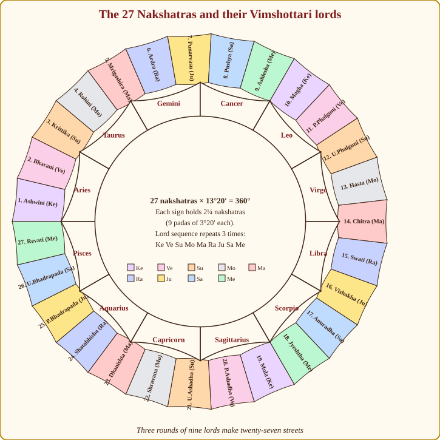
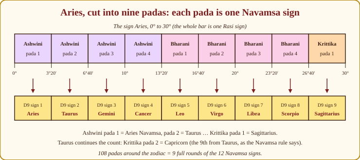
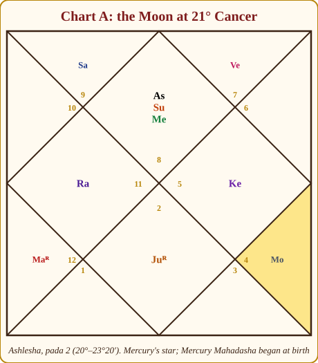
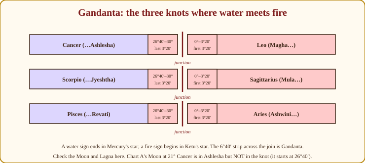
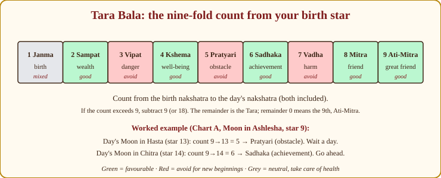

# Chapter 7: The 27 Nakshatras: The Street Addresses of the Sky

When I open a chart and want to know *who* this person is (not what will happen, but what kind of person is asking) I do not look at the Sun sign. I do not even look first at the Lagna. I look at the Moon's **nakshatra**. The day this clicked for me, on my own chart, half the "why am I like this" questions of my twenties answered themselves; it is still the fastest personality key I know.

Here is why. A sign (Rashi) is 30° wide. The Moon spends two and a quarter days in it. Everyone born in that window shares a Moon sign, and they are recognisably alike, but only in the way people from the same city are alike. A nakshatra is 13°20′ wide; the Moon spends about a day in it. That is the *street*. Two people from Cancer may be as different as two neighbourhoods of Mumbai; two people from Ashlesha are neighbours.

So: **sign = city, nakshatra = street, pada = house number.** This chapter gives you the whole street map.

## The arithmetic in one paragraph

The zodiac is 360°. Divide by 27 and you get 13°20′: that is one nakshatra (the Sanskrit is often translated "lunar mansion", because the Moon lodges in one each night). Each nakshatra is further cut into four **quarters** (*padas*) of 3°20′ each. Twenty-seven times four is 108 padas around the sky, the same 108 as the beads on a japa mala, and not by accident. Each sign of 30° holds exactly nine padas: that is two and a quarter nakshatras. This means some nakshatras straddle two signs: Krittika begins in Aries and ends in Taurus; Punarvasu begins in Gemini and ends in Cancer. Keep Appendix A.7 open the first few times; the spans are all there.

*Figure 7.1: The 27 nakshatras around the 12 signs. Colours show the Vimshottari lord. Notice the same nine colours repeating three times around the wheel.*

> **🔍 Why 27?** *Astronomy.* The Moon returns to the same background star every 27.3 days (the sidereal month), moving about 13° a night. Divide its path into one camp per night and you get twenty-seven: the nakshatras are literally the Moon's nightly halts, the oldest layer of Indian astronomy, older than the twelve signs. *Everyday:* a night bus that stops at the same twenty-seven villages every trip; the villagers named the stops long before anyone drew the district map.

> **🔍 Why 13°20′ and four padas?** *Arithmetic within the system.* 360° ÷ 27 = 13°20′. Cut each into four and you get 108 padas of 3°20′, and 3°20′ is also 30° ÷ 9, one Navamsa slice, so 108 padas = 12 signs × 9 slices exactly. The two systems, lunar and solar, were made to interlock, which is why the pada tells you the Navamsa sign. *Everyday:* a train of 27 coaches with 4 compartments each is 108 berths; the same berths can be counted coach-by-coach or as 12 blocks of 9.

## The three rounds of nine: finding any lord by counting

Each nakshatra has a **lord**, one of the nine planets, and this lord is what runs the whole Vimshottari dasha system in Chapter 13. The sequence is fixed and it repeats three times around the wheel:

**Ketu, Venus, Sun, Moon, Mars, Rahu, Jupiter, Saturn, Mercury.**

Ashwini (1) is Ketu's, Bharani (2) Venus's, Krittika (3) Sun's, and so on to Ashlesha (9), Mercury's. Then Magha (10) starts again with Ketu, and Mula (19) starts the third round with Ketu. So the three "Ketu starters" are Ashwini, Magha and Mula: the first nakshatras of Aries, Leo and Sagittarius, the three fire signs. That is your anchor.

To find any lord: take the nakshatra number, subtract 9 or 18 until you are between 1 and 9, then read off the sequence. Shravana is number 22; 22 − 18 = 4; the fourth lord is the Moon. Vishakha is 16; 16 − 9 = 7; the seventh lord is Jupiter. After a week you will not need the arithmetic, the nine-name chant will simply run in your head.

> **📖 Story: Nine relay runners, three laps.** Picture the zodiac as a running track of twenty-seven lanes-lengths, and nine runners from the court passing a baton. The Headless Sadhu, Ketu, always starts, he has nothing to carry, so he runs light. He hands to the Minister of Pleasure, Venus, who runs the longest leg (twenty years of dasha; she likes to linger). She hands to the King, who runs a short, proud six. The King hands to the Queen Mother, she to the Commander, he to the Smoke-headed Stranger (who runs a long, strange eighteen) then the Royal Priest, the old Judge (nineteen; he is slow), and last the young Prince, who sprints seventeen and hands back to the Sadhu. Nine runners, one lap. Then the same nine run the lap again, and again: three laps make twenty-seven. The Sadhu's three starting lines are Ashwini, Magha and Mula, the first streets of the three fire districts. **Rule:** Nakshatra lords run Ketu, Venus, Sun, Moon, Mars, Rahu, Jupiter, Saturn, Mercury, three times round; the lord of nakshatra *n* is the ((n − 1) mod 9) + 1-th runner.

> **🧭 Anushka's rule of thumb:** Learn the nine lords as a chant, in order, before you learn anything else about nakshatras. *Ke-Ve-Su-Mo-Ma-Ra-Ju-Sa-Me.* It unlocks dasha, Tara Bala and marriage matching, all at once.

> **🔍 Why this order?** *Tradition, honestly.* There is no astronomical reason the runners line up Ketu, Venus, Sun, Moon, Mars, Rahu, Jupiter, Saturn, Mercury; Parashara states the sequence and the years (7, 20, 6, 10, 7, 18, 16, 19, 17) without deriving them. The only inner logic anyone can point to is that the years total 120, the classical full human lifespan, and that Ketu leads from the first fire sign. Learn it as you learn a batting order (set by the captain, not by physics) and do not let anyone sell you a deeper reason. *Everyday:* the order of dishes at a wedding feast is fixed by custom; nobody can prove why the sweet comes last, but everyone knows it does.

## Padas and the Navamsa: why the quarters matter

Each pada is 3°20′, and 3°20′ is also exactly one-ninth of a sign, which is the unit of the **Navamsa** (D9) chart, the most important divisional chart of all (Chapter 11). This is no coincidence: **each pada *is* one Navamsa sign.** The first pada of Ashwini is the Aries Navamsa, the second is Taurus, the third Gemini, the fourth Cancer; Bharani's four padas are Leo, Virgo, Libra, Scorpio; Krittika's first pada, still in Aries, is Sagittarius. Then Krittika's second pada, which is the first pada of Taurus, is Capricorn, which is exactly what the Navamsa rule in Appendix A.10 says (a fixed sign starts counting from the 9th sign from itself). Go all the way round and the 108 padas cover the 12 Navamsa signs nine times.

*Figure 7.2: Aries cut into nine padas. Ashwini's four quarters and Bharani's four quarters, then Krittika's first, each is one Navamsa sign, Aries through Sagittarius.*

| Pada | Degrees of Aries | Nakshatra | Navamsa sign |
|---|---|---|---|
| 1 | 0°00′–3°20′ | Ashwini 1 | Aries |
| 2 | 3°20′–6°40′ | Ashwini 2 | Taurus |
| 3 | 6°40′–10°00′ | Ashwini 3 | Gemini |
| 4 | 10°00′–13°20′ | Ashwini 4 | Cancer |
| 5 | 13°20′–16°40′ | Bharani 1 | Leo |
| 6 | 16°40′–20°00′ | Bharani 2 | Virgo |
| 7 | 20°00′–23°20′ | Bharani 3 | Libra |
| 8 | 23°20′–26°40′ | Bharani 4 | Scorpio |
| 9 | 26°40′–30°00′ | Krittika 1 | Sagittarius |

So the pada tells you *which flavour* of the nakshatra a planet expresses. A Moon in Ashwini pada 1 (Aries Navamsa) is the pioneer; in pada 4 (Cancer Navamsa) the healer who nurses. When you know the pada, you already know half the Navamsa chart.

> **📖 Story: Four rooms on one street.** Every street in the kingdom, every nakshatra, has exactly four houses on it, and the houses are numbered round the whole kingdom without a break. Walk down Ashwini Street: house 1 is painted in Aries red, house 2 in Taurus earth, house 3 in Gemini's airy blue, house 4 in Cancer's water-purple. Turn into Bharani Street and the numbering simply continues (Leo, Virgo, Libra, Scorpio) and Krittika Street begins with Sagittarius. After twelve houses the painters run out of colours and start again from Aries red. Walk all 108 houses and you will have passed each of the twelve colours nine times. The colour of the house is the Navamsa sign. **Rule:** Each pada is one Navamsa sign; count padas from Ashwini pada 1 = Aries and cycle through the twelve signs.

## The twenty-seven streets

Below is one compact profile for each nakshatra. Read them slowly, and then read the profile of *your own* Moon and see whether your family would recognise you. Spans, lords, deities, symbols and ganas are exactly as in Appendix A.7. The **Gana** (temperament) is Deva (godly, refined), Manushya (human, practical) or Rakshasa (fierce, intense). The colours below are the marriage-matching convention (Deva with Deva is easiest, Rakshasa with Deva the hardest to blend), a code for compatibility, not a verdict on anyone's character.

| Gana | Nakshatras |
|---|---|
| 🟢 Deva (refined, gentle) | Ashwini, Mrigashira, Punarvasu, Pushya, Hasta, Swati, Anuradha, Shravana, Revati |
| 🟡 Manushya (human, practical) | Bharani, Rohini, Ardra, Purva Phalguni, Uttara Phalguni, Purva Ashadha, Uttara Ashadha, Purva Bhadrapada, Uttara Bhadrapada |
| 🔴 Rakshasa (fierce, intense) | Krittika, Ashlesha, Magha, Chitra, Vishakha, Jyeshtha, Mula, Dhanishta, Shatabhisha |

**1. Ashwini.** 0°00′–13°20′ Aries · Lord Ketu (7 yrs) · Deity the Ashwini Kumaras, the divine physicians · Symbol a horse's head · Gana Deva.
*Theme:* speed, healing, first arrivals. *Moon here:* quick, impatient, kind in a brisk way, always first to help and first to leave. *Often seen:* doctors, paramedics, athletes, couriers, anyone whose value is in being fast.

**2. Bharani.** 13°20′–26°40′ Aries · Lord Venus (20) · Deity Yama · Symbol the yoni (womb) · Gana Manushya.
*Theme:* bearing burdens; birth and death; carrying what others cannot. *Moon here:* strong-willed, sensual, fiercely responsible, sometimes judgmental. *Often seen:* midwives, gynaecologists, undertakers, publishers, those who bring things into the world or see them out.

**3. Krittika.** 26°40′ Aries–10°00′ Taurus · Lord Sun (6) · Deity Agni · Symbol a razor, a flame · Gana Rakshasa.
*Theme:* sharpness, purification by fire. *Moon here:* a cutting intellect, protective of dependants, a warm heart under a sharp tongue. *Often seen:* chefs, critics, surgeons, quality inspectors, disciplinarian teachers. Chart B's Moon is here.

**4. Rohini.** 10°00′–23°20′ Taurus · Lord Moon (10) · Deity Brahma / Prajapati · Symbol an ox-cart, a chariot · Gana Manushya.
*Theme:* growth, beauty, fertility, the Moon's own favourite. *Moon here:* magnetic, artistic, fond of good things, loyal, occasionally possessive. *Often seen:* musicians, farmers, fashion and food, anyone who makes things grow or glow.

**5. Mrigashira.** 23°20′ Taurus–6°40′ Gemini · Lord Mars (7) · Deity Soma · Symbol a deer's head · Gana Deva.
*Theme:* searching, curiosity, the eternal seeker. *Moon here:* restless, inquisitive, gentle, easily bored; the eyes are always scanning. *Often seen:* researchers, travellers, salespeople, poets; the friend who knows a new place every month.

**6. Ardra.** 6°40′–20°00′ Gemini · Lord Rahu (18) · Deity Rudra · Symbol a teardrop, a gem · Gana Manushya.
*Theme:* storms that clear the air; effort; breakthrough after breakdown. *Moon here:* intense feeling under a clever surface; grows through loss; brilliant analyst. *Often seen:* engineers, investigators, therapists, storm-chasers of every kind.

**7. Punarvasu.** 20°00′ Gemini–3°20′ Cancer · Lord Jupiter (16) · Deity Aditi · Symbol a bow and quiver · Gana Deva.
*Theme:* return of the light; renewal; the arrow that comes home. *Moon here:* optimistic, philosophical, forgiving, content with little, bounces back. *Often seen:* teachers, priests, counsellors, the family member everyone returns to.

**8. Pushya.** 3°20′–16°40′ Cancer · Lord Saturn (19) · Deity Brihaspati · Symbol a cow's udder, a lotus · Gana Deva.
*Theme:* nourishment; the most auspicious of all. *Moon here:* caring, conservative, dutiful, a provider; protects family and tradition. *Often seen:* nurses, caterers, bankers, administrators, the mother of the whole street.

**9. Ashlesha.** 16°40′–30°00′ Cancer · Lord Mercury (17) · Deity the Nagas (serpents) · Symbol a coiled serpent · Gana Rakshasa.
*Theme:* clinging, hypnotic, shrewd, the coil that holds. *Moon here:* perceptive, persuasive, emotionally deep, slow to trust and slower to release. *Often seen:* psychologists, negotiators, politicians, hypnotists, astrologers. Chart A's Moon is here.

**10. Magha.** 0°00′–13°20′ Leo · Lord Ketu (7) · Deity the Pitris (ancestors) · Symbol a throne, a palanquin · Gana Rakshasa.
*Theme:* lineage, authority inherited from the past. *Moon here:* proud, generous, traditional, loyal to family name; dislikes being ordered about. *Often seen:* heads of families, historians, civil servants, those who carry a title.

**11. Purva Phalguni.** 13°20′–26°40′ Leo · Lord Venus (20) · Deity Bhaga · Symbol the front legs of a bed · Gana Manushya.
*Theme:* pleasure, creativity, rest, the joy of being alive. *Moon here:* charming, romantic, fond of comfort and company, creative when relaxed. *Often seen:* performers, event planners, hoteliers, artists, the life of every wedding.

**12. Uttara Phalguni.** 26°40′ Leo–10°00′ Virgo · Lord Sun (6) · Deity Aryaman · Symbol the back legs of a bed · Gana Manushya.
*Theme:* contracts, friendship, patronage; pleasure made responsible. *Moon here:* helpful, principled, a reliable friend, sometimes stubborn about "the right way". *Often seen:* lawyers, HR heads, social workers, philanthropists.

**13. Hasta.** 10°00′–23°20′ Virgo · Lord Moon (10) · Deity Savitar · Symbol a hand · Gana Deva.
*Theme:* skill, craft, humour, what the hand can do. *Moon here:* witty, dexterous, practical, a fixer; hides worry under jokes. *Often seen:* craftsmen, surgeons, artisans, comedians, palmists, anyone whose hands are their living.

**14. Chitra.** 23°20′ Virgo–6°40′ Libra · Lord Mars (7) · Deity Tvashtar / Vishwakarma, the divine architect · Symbol a pearl, a bright jewel · Gana Rakshasa.
*Theme:* design, architecture, glamour. *Moon here:* stylish, visual, ambitious, a builder of beautiful things; can be vain. *Often seen:* architects, designers, jewellers, film-makers, surgeons of the cosmetic kind.

**15. Swati.** 6°40′–20°00′ Libra · Lord Rahu (18) · Deity Vayu · Symbol a young sprout swaying in the wind · Gana Deva.
*Theme:* independence, trade, bending without breaking. *Moon here:* diplomatic, adaptable, freedom-loving, a natural trader; avoids commitment until sure. *Often seen:* merchants, diplomats, brokers, musicians, travellers.

**16. Vishakha.** 20°00′ Libra–3°20′ Scorpio · Lord Jupiter (16) · Deity Indra-Agni · Symbol a triumphal arch, a potter's wheel · Gana Rakshasa.
*Theme:* goal focus, ambition; the arch you march through. *Moon here:* determined, competitive, patient towards one big aim; jealous of rivals. *Often seen:* politicians, entrepreneurs, sportspeople, anyone who plays the long game to win.

**17. Anuradha.** 3°20′–16°40′ Scorpio · Lord Saturn (19) · Deity Mitra · Symbol a lotus, an archway · Gana Deva.
*Theme:* devotion, friendship in hardship, the lotus in mud. *Moon here:* loyal, organised, warm to friends, hurt by betrayal, thrives abroad. *Often seen:* team leaders, organisers, devotees, expatriates, group therapists.

**18. Jyeshtha.** 16°40′–30°00′ Scorpio · Lord Mercury (17) · Deity Indra · Symbol an earring, an umbrella, a talisman · Gana Rakshasa.
*Theme:* seniority, protection, the eldest's burden. *Moon here:* responsible, proud, protective, secretive; carries others and resents it quietly. *Often seen:* eldest siblings who run the family, police and army officers, senior managers, occultists.

**19. Mula.** 0°00′–13°20′ Sagittarius · Lord Ketu (7) · Deity Nirriti · Symbol a bundle of roots, a lion's tail · Gana Rakshasa.
*Theme:* uprooting, going to the root, research. *Moon here:* fearless, blunt, philosophical, destroys to rebuild; restless in the first half of life. *Often seen:* researchers, surgeons, investigators, reformers, root-cause analysts.

**20. Purva Ashadha.** 13°20′–26°40′ Sagittarius · Lord Venus (20) · Deity Apas (the waters) · Symbol a fan, a winnowing basket, a tusk · Gana Manushya.
*Theme:* invincibility, purification, the early victory. *Moon here:* confident, persuasive, proud of convictions, inspiring, a little unwilling to hear "no". *Often seen:* orators, lawyers, motivational teachers, water and shipping trades. Chart C's Moon is here.

**21. Uttara Ashadha.** 26°40′ Sagittarius–10°00′ Capricorn · Lord Sun (6) · Deity the Vishwadevas · Symbol an elephant tusk, the planks of a bed · Gana Manushya.
*Theme:* final victory, leadership that lasts. *Moon here:* principled, patient, respected, slow to start and impossible to stop. *Often seen:* administrators, judges, statesmen, chief engineers, elders people go to for the last word.

**22. Shravana.** 10°00′–23°20′ Capricorn · Lord Moon (10) · Deity Vishnu · Symbol an ear, three footprints · Gana Deva.
*Theme:* listening, learning, fame through knowledge. *Moon here:* a great listener, well-read, a connector of people, quietly ambitious. *Often seen:* teachers, translators, counsellors, broadcasters, librarians of every kind.

**23. Dhanishta.** 23°20′ Capricorn–6°40′ Aquarius · Lord Mars (7) · Deity the eight Vasus · Symbol a drum, a flute · Gana Rakshasa.
*Theme:* wealth, rhythm, music. *Moon here:* ambitious, rhythmic, generous with money, fond of group activity; may feel lonely in marriage. *Often seen:* musicians, property developers, financiers, team sportspeople.

**24. Shatabhisha.** 6°40′–20°00′ Aquarius · Lord Rahu (18) · Deity Varuna · Symbol an empty circle, a hundred flowers or healers · Gana Rakshasa.
*Theme:* healing, secrecy, science. *Moon here:* private, analytical, unconventional, a reluctant healer of others; needs solitude. *Often seen:* physicians, researchers, astrologers, engineers, the quiet genius in the corner.

**25. Purva Bhadrapada.** 20°00′ Aquarius–3°20′ Pisces · Lord Jupiter (16) · Deity Aja Ekapada · Symbol a sword, the front legs of a funeral cot · Gana Manushya.
*Theme:* intensity, penance, transformation through fire. *Moon here:* passionate, idealistic, philosophical, given to extremes; a reformer's heart. *Often seen:* priests, activists, occultists, thriller writers, those who burn for a cause.

**26. Uttara Bhadrapada.** 3°20′–16°40′ Pisces · Lord Saturn (19) · Deity Ahir Budhnya · Symbol the back legs of a funeral cot, the serpent of the deep · Gana Manushya.
*Theme:* depth, wisdom, patience; still water. *Moon here:* calm, kind, wise beyond years, slow to anger, a natural counsellor. *Often seen:* teachers, monks, charity workers, deep-sea and deep-mind professions.

**27. Revati.** 16°40′–30°00′ Pisces · Lord Mercury (17) · Deity Pushan · Symbol a fish, a drum · Gana Deva.
*Theme:* nourishing journeys, completion, safe passage. *Moon here:* sweet-natured, protective, artistic, a guide for the lost; over-gives. *Often seen:* travel and hospitality, childcare, veterinarians, astrologers, those who see people safely home.

## The Moon's nakshatra: your personality key

The Moon's nakshatra at birth is the **birth star** (*Janma nakshatra*), and it is the one thing to find in every chart before anything else, because three things hang on it: the starting dasha (Chapter 13), the Tara Bala (below), and, most useful in conversation, the *feel* of the person.

Here is how it works in conversation. Reading for a friend with an Ashlesha Moon, I did not say "your Moon is in Ashlesha". I said, "You read people very quickly and hold on to what you love, sometimes a little too tightly. Am I right?" She laughed, relaxed, and trusted the rest of the reading. The nakshatra profile gives you that opening sentence. Then the *pada* tells you the flavour: Ashlesha pada 2 is the Capricorn Navamsa, so Meera's perceptiveness is disciplined and career-directed, not merely emotional.

> **🔍 Why the Moon's star?** *System grammar.* The Moon is the mind (Chapter 3), and a nakshatra is the Moon's own unit, its street, one per night. The Sun sign is shared by everyone born in a month, the Moon sign by everyone born in two and a quarter days, but the Moon's nakshatra narrows to a single day and the pada to six hours. The finest-grained lunar address is the finest key to the lunar thing, the mind. *Everyday:* a pincode tells you the city; the lane number tells you which house serves which kind of chai.

Two more nakshatras deserve a glance in every chart. The **Lagna's nakshatra** describes the body and the outward manner, the coat the person wears into the room. And the **nakshatra of the current dasha lord** tells you the mood of the current period: a Venus dasha with Venus in Rohini feels very different from one with Venus in Ardra.

> **🪔 Consultation tip:** Use the nakshatra profile as a *question*, never a *verdict*. "You seem to be the one in the family who carries everyone, does that feel true?" invites the client in. "Your Moon is in Jyeshtha so you are burdened" pushes them away and, worse, may be wrong for this particular chart.

## Worked example: our three Moons

**Chart A (Meera).** Moon at 21° Cancer. Ashlesha runs from 16°40′ to 30°00′ Cancer; its padas are 16°40′–20°00′ (pada 1), 20°00′–23°20′ (pada 2), 23°20′–26°40′ (pada 3), 26°40′–30°00′ (pada 4). The Moon at 21° is in **pada 2**. Lord: Mercury (Ashlesha is the 9th nakshatra, the last of the first round). So her first dasha was Mercury's, and the balance at birth was the unfinished part of the star: 30° − 21° = 9° of 13°20′: that is 9 ÷ 13.33 × 17 years ≈ 11.5 years. Pada 2 is the Capricorn Navamsa. A shrewd, persuasive, deep-feeling mind, disciplined in expression, a natural teacher-counsellor. Her Moon is *not* in the Gandanta strip, which begins at 26°40′.

*Figure 7.3: Chart A. The Moon at 21° Cancer sits in Ashlesha pada 2, Mercury's star, safely short of the Gandanta zone.*

**Chart B (Arjun).** Moon at 6° Taurus. Krittika runs from 26°40′ Aries to 10°00′ Taurus; its padas are 26°40′–30°00′ Aries (pada 1), 0°00′–3°20′ Taurus (pada 2), 3°20′–6°40′ Taurus (pada 3), 6°40′–10°00′ Taurus (pada 4). At 6° the Moon is in **pada 3**, the Aquarius Navamsa. Lord: the Sun, so the Sun's dasha ran first, with a balance of (10° − 6°) ÷ 13.33 × 6 ≈ 1.8 years. A sharp, protective mind with a scientific, unconventional flavour, which fits the research-minded 8th house we unpacked in Chapter 6.

**Chart C (Devika).** Moon at 14° Sagittarius. Purva Ashadha runs from 13°20′ to 26°40′; the Moon at 14° is in **pada 1** (13°20′–16°40′), the Leo Navamsa. Lord: Venus (the 20th nakshatra; 20 − 18 = 2, the second lord). Venus dasha at birth, with a long balance of about 19 years. Confident, persuasive, proud of her convictions, with a royal Leo flavour: the orator's Moon.

## The three knots: Gandanta

Three times around the zodiac a water sign ends and a fire sign begins: Cancer into Leo, Scorpio into Sagittarius, Pisces into Aries. At each join, the last 3°20′ of the water nakshatra (Ashlesha, Jyeshtha, Revati (all Mercury's) and the first 3°20′ of the fire nakshatra (Magha, Mula, Ashwini) all Ketu's) form a sensitive zone called **Gandanta** (the "knot's end"). The classics ask us to check the Moon and the Lagna here; a Moon in the knot is said to give an emotionally turbulent start to life and a certain rawness of feeling, and the tradition prescribes a simple pacifying ritual. Some texts also flag the tithi and nakshatra junctions, but the degree-based zone above is the one everyone uses.

> **🔍 Why is the knot sensitive?** *Symbolic logic of the system.* Three times the zodiac passes from a water sign (emotion, dissolving) straight into a fire sign (action, igniting) with no earth or air between, and at each join the last street belongs to Mercury and the first to Ketu, the two planets of the least emotional stability. One element ends and its opposite begins in the same breath; the tradition reads a birth exactly there as a life that starts mid-transition. There is no astronomy in this: it is the grammar of the elements. *Everyday:* changing trains at a junction with all your luggage in the two minutes before the connecting train leaves.

*Figure 7.4: The three knots. Each is a 6°40′ strip straddling the end of a water sign and the start of a fire sign.*

> **📖 Story: The ford between two rivers.** Three times in the kingdom a water district ends and a fire district begins, and there is no bridge, only a ford. On the water bank the last street belongs to the young Prince, Mercury (Ashlesha, Jyeshtha, Revati); on the fire bank the first street belongs to the Headless Sadhu, Ketu (Magha, Mula, Ashwini). A traveller born while crossing the ford, the Queen Mother's carriage in the last 3°20′ of the water street or the first 3°20′ of the fire street, gets her feet wet: a turbulent start, feelings that run raw. But every pilgrim who reaches the far bank has crossed something the people on either shore never had to. **Rule:** Gandanta is the last 3°20′ of Ashlesha, Jyeshtha, Revati and the first 3°20′ of Magha, Mula, Ashwini; check the Moon and Lagna there and speak of intensity, not doom.

What to say to a client born with the Moon in a knot: "Your emotional life began with intensity, and you may feel things more rawly than others: that same intensity is also your depth." What *not* to say: anything about danger to parents, early death, or "dosha" as a curse. The Gandanta Moons I have come across belong to people of unusual depth who had a bumpy first few years; the knot marks a transition, not a sentence. A brief note: Chart C's Mercury at 1° Leo sits in the Magha knot; for a planet other than the Moon or Lagna most teachers simply note this and move on.

> **⚠️ Common beginner mistake:** Calling every planet in Ashlesha, Jyeshtha, Revati, Magha, Mula or Ashwini "Gandanta". The knot is only the 3°20′ on either side of the join. Meera's Moon at 21° Cancer is in Ashlesha and nowhere near it.

### An advanced pointer: Pushkara

While you are learning padas, know that certain padas and certain degrees are called **Pushkara**, "nourishing", and are held to bless whatever planet sits in them: the Pushkara *navamsa* padas (two in each sign) and the Pushkara *bhaga* degrees (one in each sign). This is a refinement you will enjoy in a year or two; I mention it now only so that when you meet the word you will know it is a good one.

## Tara Bala: is today my day?

The **Tara Bala** ("strength of the star") is the oldest everyday use of the nakshatras, and it is beautifully simple. Count from your birth star to the star the Moon is in today, both included. Divide by nine and keep the remainder. The remainder names the day's quality:

| Count | Tara | Meaning | Use |
|---|---|---|---|
| 1 | Janma | birth | 🟡 mixed; care for health, avoid big risks |
| 2 | Sampat | wealth | 🟢 good |
| 3 | Vipat | danger | 🔴 avoid starting things |
| 4 | Kshema | well-being | 🟢 good |
| 5 | Pratyari | obstacle | 🔴 avoid |
| 6 | Sadhaka | achievement | 🟢 good |
| 7 | Vadha | harm | 🔴 avoid |
| 8 | Mitra | friend | 🟢 good |
| 9 (or 0) | Ati-Mitra | great friend | 🟢 good |

> **🔍 Why count in nines?** *System grammar.* Twenty-seven is three nines, and the nakshatra lords already repeat every nine; so the ninth star from yours has the same lord as yours and the same "place in the lap". Counting in nines simply asks: at which of the nine stages of the cycle is today's Moon relative to my birth? The names (birth, wealth, danger, well-being, obstacle, achievement, harm, friend, great friend) are the tradition's reading of those nine stages. *Everyday:* a nine-day duty roster: the same shift comes back every ninth day, whatever the date.

*Figure 7.5: The nine-fold count. Green days favour new beginnings; red days are for routine work; the birth star itself is a day to rest.*

> **📖 Story: The nine gates.** From your birth street to any other street in the kingdom you must pass through gates, and the gates repeat in a cycle of nine. The first gate is your own front door (Janma, stay home, rest). The second opens onto the treasury (Sampat). The third is guarded by a suspicious sentry (Vipat, turn back). The fourth is the garden gate (Kshema). The fifth is where the rival's men wait (Pratyari, turn back). The sixth is the gate of the workshop where things get finished (Sadhaka). The seventh is the executioner's gate (Vadha, turn back). The eighth is your friend's door (Mitra) and the ninth your best friend's (Ati-Mitra). Then the cycle begins again at your own door. **Rule:** Count from birth star to today's star, both included, subtract nines; 2, 4, 6, 8, 9 are open gates, 3, 5, 7 are closed, 1 is home.

**Worked example.** Meera's birth star is Ashlesha, number 9. Suppose she wants to sign a lease on a day when the Moon is in Hasta, number 13. Count 9, 10, 11, 12, 13: that is 5. Remainder 5 is Pratyari, obstacle: sign tomorrow instead. Tomorrow the Moon is in Chitra, 14. The count is 6, Sadhaka, achievement: a fine day. When the count runs over 9 (say her birth star is 9 and the Moon is in Revati, 27) count 19, subtract 18, get 1: Janma, a day to rest. The same nine-fold count between two people's birth stars is the *Tara koota* in marriage matching (Appendix A.12).

## Naming a child by the star

You have seen this in every Indian family: the priest opens the almanac and says "the name should begin with *Du*". He is reading the **birth-star syllables**, each of the 108 padas has a traditional opening sound, so that the child's name vibrates with the Moon's position. The full table is in every panchanga; here is a working version for the 27 stars, pada by pada.

| Nakshatra | Pada 1 | Pada 2 | Pada 3 | Pada 4 |
|---|---|---|---|---|
| Ashwini | Chu | Che | Cho | La |
| Bharani | Li | Lu | Le | Lo |
| Krittika | A | I | U | E |
| Rohini | O | Va | Vi | Vu |
| Mrigashira | Ve | Vo | Ka | Ki |
| Ardra | Ku | Gha | Ng | Chha |
| Punarvasu | Ke | Ko | Ha | Hi |
| Pushya | Hu | He | Ho | Da |
| Ashlesha | Di | Du | De | Do |
| Magha | Ma | Mi | Mu | Me |
| Purva Phalguni | Mo | Ta | Ti | Tu |
| Uttara Phalguni | Te | To | Pa | Pi |
| Hasta | Pu | Sha | Na | Tha |
| Chitra | Pe | Po | Ra | Ri |
| Swati | Ru | Re | Ro | Ta |
| Vishakha | Ti | Tu | Te | To |
| Anuradha | Na | Ni | Nu | Ne |
| Jyeshtha | No | Ya | Yi | Yu |
| Mula | Ye | Yo | Bha | Bhi |
| Purva Ashadha | Bhu | Dha | Pha | Dha |
| Uttara Ashadha | Bhe | Bho | Ja | Ji |
| Shravana | Ju (Khi) | Je (Khu) | Jo (Khe) | Gha (Kho) |
| Dhanishta | Ga | Gi | Gu | Ge |
| Shatabhisha | Go | Sa | Si | Su |
| Purva Bhadrapada | Se | So | Da | Di |
| Uttara Bhadrapada | Du | Tha | Jha | Na (Da) |
| Revati | De | Do | Cha | Chi |

Meera, Ashlesha pada 2, would have been given a name beginning with *Du*, many families keep this as a private "star name" (*rashi naam*) and use another in public. Arjun, Krittika pada 3, gets *U*; Devika, Purva Ashadha pada 1, gets *Bhu*. Regional almanacs vary a syllable here and there; follow the one the family uses.

## Abhijit, the twenty-eighth

The old texts speak of a 28th nakshatra, **Abhijit** ("victorious"), squeezed between Uttara Ashadha and Shravana (the last quarter of Uttara Ashadha and the opening degrees of Shravana, in early Capricorn (about 4 ghatis, or 0°53′, of Shravana) almanacs differ slightly). It is used in **muhurta**, choosing auspicious times, where it is prized, and never in dasha, which uses only the 27. It is also the name of the daily *Abhijit muhurta*, the auspicious 48 minutes around local noon, the one slot in almost every day when something can be begun.

## Three stories worth knowing

> **💡 Did you know?** The Moon, in the Puranas, married all twenty-seven daughters of Daksha, the nakshatras, but loved only Rohini and neglected the rest. The furious father-in-law cursed him to waste away; Shiva softened the curse so that he wanes for a fortnight and waxes again. That is why Rohini is the Moon's exaltation neighbourhood (his deepest point is 3° Taurus, Krittika, but his happiness is Rohini), and why the Moon is at his most comfortable and creative there.

> **💡 Did you know?** Pushya is called the most auspicious nakshatra for nearly every undertaking, the ancients said "in Pushya, even a task begun by a fool succeeds." The single exception in every almanac is marriage: no weddings in Pushya, because the deity Brihaspati is said to have been cursed in a domestic matter. Every other beginning (a shop, a study, a journey, a purchase of gold) is welcomed.

> **💡 Did you know?** Folk tradition in north India fears six "gandmool" stars (Ashwini, Ashlesha, Magha, Jyeshtha, Mula and Revati, the six ruled by Ketu and Mercury) and a child born under them is taken for a *Mula-shanti* ritual on the 27th day. The classical position is narrower and kinder: only the actual junction degrees (the Gandanta zones above) are sensitive, and even there the concern is the Moon and the Lagna, not every planet. Millions of perfectly happy people have Moons in Magha or Mula. If a family is anxious, let them do the ritual (it does no harm and settles the heart) but never let the fear into your reading.

## In one breath

- A nakshatra is 13°20′ of the zodiac, one day's walk for the Moon; sign = city, nakshatra = street, pada = house number.
- Twenty-seven nakshatras, four padas each, 108 padas in all; each pada is one Navamsa sign.
- The nine lords repeat three times in the fixed order Ketu, Venus, Sun, Moon, Mars, Rahu, Jupiter, Saturn, Mercury; Ashwini, Magha and Mula begin the three rounds.
- The Moon's nakshatra (Janma nakshatra) is the best single personality key and sets the starting dasha; also read the Lagna's and the dasha lord's stars.
- Gandanta is the 3°20′ on each side of the three water-fire joins; check the Moon and Lagna there and speak of intensity, never doom.
- Tara Bala: count from birth star to today's star, divide by nine; 2, 4, 6, 8, 9 are favourable, 3, 5, 7 are not, 1 is a rest day.
- Each pada has a name-syllable; Abhijit is a 28th star used only in muhurta; Pushya is the most auspicious, except for weddings.

## Practice

> **✍️ Practice:**
>
> 1. Without looking at the table, name the lord of Dhanishta (number 23) by counting.
> 2. A Moon at 25° Leo: which nakshatra, which pada, and which Navamsa sign?
> 3. Is a Moon at 28° Scorpio in Gandanta? What about a Moon at 18° Scorpio?
> 4. Arjun's birth star is Krittika (3). Today the Moon is in Anuradha (17). Is today a good day for him to start a new job?
> 5. Devika (Chart C) is expecting a child and asks which syllable the baby's name should begin with if the baby's Moon falls in Hasta pada 2. Answer her, and explain in one line how you found it.

Answers

1. 23 − 18 = 5. The fifth lord in the chant Ke-Ve-Su-Mo-Ma is Mars. Dhanishta is ruled by Mars.
2. Leo runs 0°–30°. Magha is 0°–13°20′, Purva Phalguni 13°20′–26°40′, so 25° is in Purva Phalguni. Its padas: 13°20′–16°40′, 16°40′–20°, 20°–23°20′, 23°20′–26°40′; 25° is pada 4. Navamsa: Purva Phalguni is nakshatra 11, pada 4, so the overall pada number is 10 × 4 + 4 = 44; 44 − 36 = 8, the 8th sign, Scorpio. (Check with the A.10 rule: Leo is fixed, so counting starts from the 9th sign from Leo, Aries; 25° is the 8th navamsa, and the 8th from Aries is Scorpio.)
3. 28° Scorpio is in the last 3°20′ of Jyeshtha (26°40′–30°), so yes, Gandanta. 18° Scorpio is in Jyeshtha but well short of the knot: not Gandanta.
4. Count from Krittika (3) to Anuradha (17), both included: 15. Subtract 9: 6. Sadhaka, achievement. A favourable day.
5. Hasta pada 2 gives the syllable *Sha*. Found by locating Hasta in the syllable table and reading the second column.

