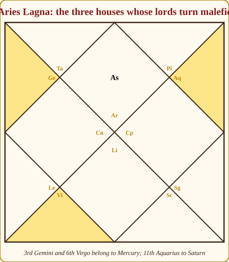
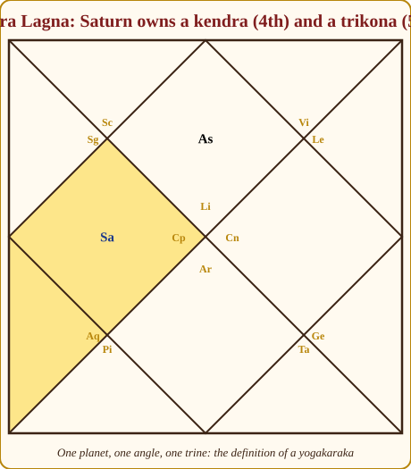
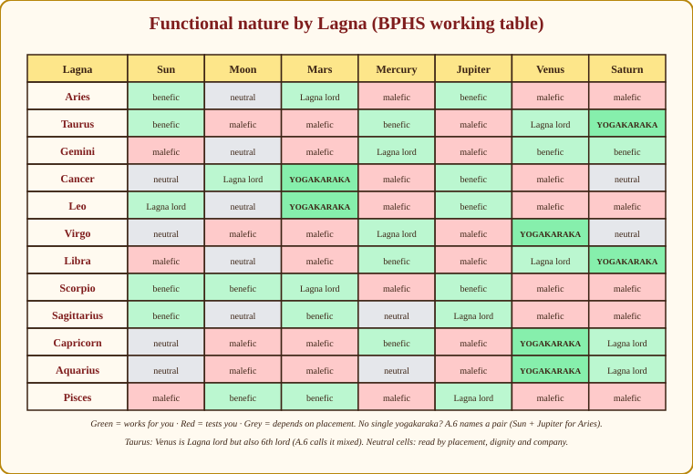
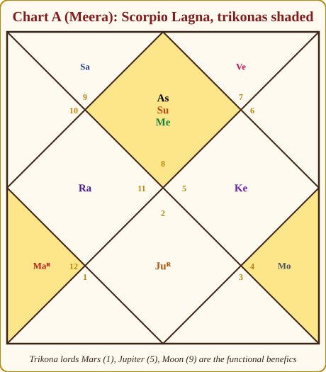
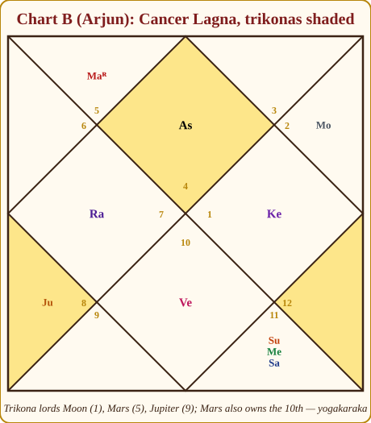

# Chapter 8: Which Planets Are Good FOR YOU — Functional Benefics and Malefics

If I had to name the one chapter that separates people who *know about* astrology from people who can *read a chart*, it is this one. I have met students who could recite all twenty-seven nakshatras with their deities and still could not tell me whether Saturn was a friend or an enemy in the chart in front of them. They knew Saturn was "a malefic". They did not know that for the woman across the table, Saturn was the best planet she had.

The idea is simple once said. Every planet has a **natural** nature — Jupiter is kind, Saturn is harsh — the way every person has a temperament. But in *your* chart, every planet also has a **job**: it owns two houses (the Sun and Moon own one each), and it works for those houses. A planet's **functional** nature is whether the houses it owns are good houses or difficult ones *for your Lagna*. A naturally harsh planet that owns your best houses is a strict uncle who is on your side. A naturally sweet planet that owns your worst houses is a charming cousin who keeps borrowing money.

## Saturn for a Libra: the strict uncle who is on your side

Take a Libra Lagna. Libra is the 1st house; count round: Scorpio 2nd, Sagittarius 3rd, **Capricorn 4th, Aquarius 5th**, Pisces 6th, Aries 7th, Taurus 8th, Gemini 9th, Cancer 10th, Leo 11th, Virgo 12th. Saturn owns Capricorn and Aquarius — the 4th and the 5th. The 4th is a pillar house (*kendra*): home, mother, comfort, education. The 5th is a trine (*trikona*): children, intelligence, merit. Saturn, the planet of discipline and time, has been given charge of this person's home and their intelligence. It will deliver both — slowly, seriously, permanently. For a Libra, Saturn's periods are the years when the house is bought and the qualification earned.

Meanwhile Jupiter, the great natural benefic, owns Sagittarius and Pisces for this Libra: the 3rd and the 6th. Effort, siblings, rivals, disputes, debts, illness. Jupiter is still generous by nature — but its generosity is now spent on *those* departments. A Libra in a Jupiter period may find themselves generous to a fault with enemies and expansive in expenses. Jupiter has not become evil. It has become an employee of the wrong houses.

> **🧭 Guruji's rule of thumb:** Nature is what a planet *is*; function is who it *works for*. In a consultation, function wins. Ask "whose employee is this planet?" before you ask "is it a good planet?"

## Parashara's rules

Here are the rules from *Brihat Parashara Hora Shastra*, exactly as summarised in Appendix A.6, with the reason behind each:

1. **Lords of the trines (1, 5, 9) are benefic.** These are Lakshmi's houses — self, merit, fortune. Whoever owns them works for your good.
2. **Lords of 3, 6 and 11 are malefic.** These are the houses of effort, enemies and greed — the "growing houses" where you fight for things. Their lords make you struggle, compete, want. (Yes, the 11th, house of gains, has a malefic lord: gains come at the cost of wanting them.)
3. **Lords of the angles (4, 7, 10) are neutral** — with a twist. A natural benefic owning an angle *loses* its goodness (*kendradhipatya dosha*, "the fault of angle-lordship"); a natural malefic owning an angle *loses* its badness. The angles are neutral ground: they flatten whoever owns them.
4. **Lords of 2, 8 and 12 take the colour of their other sign.** These houses are neither trines nor angles nor the fighting three; their lords are judged by their second job. Mars owning the 2nd and 7th for a Libra is read mainly as a 7th lord.
5. **The 8th lord is bad unless it also owns the Lagna.** The 8th is the house of endings and hidden trouble; its lord is a functional malefic — except that Mars for Aries and Venus for Libra own both the 1st and the 8th, and Lagna lordship wins.
6. **The Lagna lord is treated as benefic in practice**, even when its other house is difficult. It is the captain; you do not call your captain an enemy.

Two words you need. A **functional benefic** is a planet whose houses are good for you. A **functional malefic** is one whose houses are difficult for you. Every Lagna has some of each, and the planets that fall into neither are **neutral** — read them by their placement and their company.

## Deriving the table for Aries, step by step

Let us do it slowly once, so that you never again have to memorise it. Aries Lagna: Aries is the 1st house, Taurus the 2nd, Gemini 3rd, Cancer 4th, Leo 5th, Virgo 6th, Libra 7th, Scorpio 8th, Sagittarius 9th, Capricorn 10th, Aquarius 11th, Pisces 12th.

*Figure 8.1: Aries Lagna. The shaded houses (3rd Gemini, 6th Virgo, 11th Aquarius) are the ones whose lords turn malefic. Read off the owner of each shaded sign: Mercury, Mercury, Saturn.*

- **Mars** owns Aries (1st) and Scorpio (8th). Lagna lord — rule 6 — **benefic**. The 8th lordship is forgiven by rule 5.
- **Venus** owns Taurus (2nd) and Libra (7th). Rule 4 sends the 2nd to its other sign; the 7th is an angle, and Venus is a natural benefic, so it loses goodness there. Both 2 and 7 are also **maraka** houses (below). Venus is **malefic**, specifically the maraka planet.
- **Mercury** owns Gemini (3rd) and Virgo (6th). Two of the fighting three. **Malefic.**
- **Moon** owns Cancer (4th). An angle lord, and the Moon's natural nature depends on its brightness. **Neutral.**
- **Sun** owns Leo (5th). A trine lord. **Benefic.**
- **Jupiter** owns Sagittarius (9th) and Pisces (12th). The 9th is the best trine; the 12th takes its colour from the 9th. **Benefic.**
- **Saturn** owns Capricorn (10th) and Aquarius (11th). The 10th is an angle (neutralising), but the 11th is one of the fighting three. **Malefic** — the 11th lordship decides it.

Result: benefics Sun, Mars, Jupiter; malefics Mercury, Venus, Saturn; Moon neutral. Compare with Appendix A.6 — it is the same row. You have just derived it. Do this for your own Lagna now, before reading on, and then check yourself against the table.

> **⚠️ Common beginner mistake:** Treating Rahu and Ketu as owning houses. They own nothing in Parashara's scheme. Read their functional nature from the *sign lord* of the house they sit in and from the planets they sit with. A Rahu in Saturn's sign for a Libra borrows Saturn's good function; a Rahu in Mercury's sign for an Aries borrows Mercury's bad one.

## The Yogakaraka: one planet, an angle and a trine

Now the most valuable word in this chapter. When a *single* planet owns both an angle (4, 7 or 10) and a trine (5 or 9), it holds in one hand the power of the pillar and the grace of the trine. Parashara calls such a planet a **Yogakaraka** — "the maker of yoga", the planet that by itself can raise a life. Its periods are the best years of that chart, and strengthening it is the one remedy that never misfires.

*Figure 8.2: Libra Lagna. Saturn owns Capricorn (4th, an angle) and Aquarius (5th, a trine). One planet, one angle, one trine: Saturn is the yogakaraka.*

Only some Lagnas have one. Run the ownership yourself and you will find:

- **Taurus and Libra:** Saturn (9th and 10th for Taurus; 4th and 5th for Libra).
- **Cancer and Leo:** Mars (5th and 10th for Cancer; 4th and 9th for Leo).
- **Capricorn and Aquarius:** Venus (5th and 10th for Capricorn; 4th and 9th for Aquarius).
- **Virgo:** Venus, owning the 2nd and 9th, is named yogakaraka by BPHS and the tradition even though the strict angle-plus-trine test is not met — treat it as the honourable exception.

The other Lagnas have no single yogakaraka; there the good is done by a *pair* — an angle lord and a trine lord who must be connected (Chapter 6's Sambandha) to form a Raja yoga. A.6 names the pair for each.

## The full table, and what is interesting about each Lagna

Here is the working table every Indian teacher uses, reproduced exactly from Appendix A.6. Below it, a short paragraph for each Lagna on what makes that row interesting.

| Lagna | Benefics | Malefics | Neutral / mixed | Yogakaraka (single planet giving rajayoga) | Marakas to watch |
|---|---|---|---|---|---|
| Aries | Sun, Mars, Jupiter | Mercury, Venus, Saturn | Moon | (Sun + Jupiter together act as yogakarakas) | Venus, Mercury |
| Taurus | Saturn, Sun, Mercury | Moon, Jupiter, Mars | Venus (own lagna but 6th lord) | **Saturn** | Jupiter, Venus, Mars |
| Gemini | Venus, Saturn, Mercury | Mars, Jupiter, Sun | Moon | (Venus + Saturn combination) | Moon, Jupiter |
| Cancer | Mars, Jupiter, Moon | Venus, Mercury | Sun, Saturn | **Mars** | Saturn, Venus |
| Leo | Mars, Jupiter, Sun | Mercury, Venus, Saturn | Moon | **Mars** | Saturn, Mercury |
| Virgo | Venus, Mercury | Mars, Jupiter, Moon | Sun, Saturn | **Venus** | Venus, Jupiter |
| Libra | Saturn, Mercury, Venus | Jupiter, Sun, Mars | Moon | **Saturn** (Moon + Mercury together too) | Mars, Jupiter |
| Scorpio | Jupiter, Moon, Sun, Mars | Mercury, Venus, Saturn | (none) | (Sun + Moon together) | Venus, Mercury |
| Sagittarius | Sun, Mars, Jupiter | Venus, Saturn | Mercury, Moon | (Sun + Mercury together) | Saturn, Venus |
| Capricorn | Venus, Mercury, Saturn | Mars, Jupiter, Moon | Sun | **Venus** | Mars, Moon |
| Aquarius | Venus, Saturn | Jupiter, Moon, Mars | Mercury, Sun | **Venus** | Jupiter, Sun, Mars |
| Pisces | Mars, Moon, Jupiter | Saturn, Venus, Sun, Mercury | (none) | (Mars + Jupiter together) | Mercury, Saturn |

*Figure 8.3: The same table as colours. Green works for you, red tests you, grey depends on placement. Photograph this page; you will use it at every consultation for the rest of your life.*

**Aries.** A fiery, straightforward row: the fire-sign lords (Sun of Leo, Jupiter of Sagittarius) plus Mars are the friends; the two natural benefics Mercury and Venus turn malefic because they own the fighting houses and the maraka houses. Sun and Jupiter, 5th and 9th lords, working together are as good as a yogakaraka. Note that Jupiter's 12th lordship does not spoil it — the 9th decides.

**Taurus.** The famous Saturn Lagna. Saturn owns the 9th and 10th — fortune and career in one hand — and is the finest yogakaraka in the zodiac. Venus, the Lagna lord, also owns the 6th, so A.6 marks it mixed: it protects the self but can bring disputes or health issues in its periods. Jupiter, owning 8 and 11, is a functional malefic here — the classic surprise.

**Gemini.** Mercury's own row, where Jupiter again disappoints: it owns the 7th and 10th, two angles, and a natural benefic loses its goodness in angles. Venus (5th and 12th) and Saturn (8th and 9th, the 9th deciding) are the friends. The Moon as 2nd lord is a maraka and is watched.

**Cancer.** Mars owns the 5th and 10th — yogakaraka. The naturally cruel commander becomes the Cancer person's engine of intelligence and career. Jupiter, 6th and 9th lord, is benefic by its 9th lordship but carries a 6th-house tinge (disputes with gurus, debts through generosity). Saturn owns the 7th and 8th: neutral, and the chief maraka. Chart B is a Cancer Lagna; we derive it below.

**Leo.** The mirror of Cancer: Mars owns the 4th and 9th — yogakaraka. The Sun is the captain; Jupiter (5th and 8th) is benefic through the 5th. Saturn owns the 6th and 7th, a malefic and maraka; Mercury owns 2 and 11, another maraka.

**Virgo.** Venus owns the 2nd and 9th and is named yogakaraka by the tradition. Jupiter, owning two angles again (4th and 7th), is malefic by function — a hard truth for a Virgo who expects the great benefic to help. Saturn (5th and 6th) is neutral; Mars (3rd and 8th) and the Moon (11th) are malefic.

**Libra.** Saturn, yogakaraka (4th and 5th), as we saw. Mercury (9th and 12th) is a friend. Mars owns 2 and 7 — the double maraka — and Jupiter owns 3 and 6. The Sun, 11th lord, is malefic. The Moon (10th) and Mercury (9th) together also make a Raja yoga.

**Scorpio.** A generous row: four benefics. Mars is Lagna lord (with the 6th forgiven); Jupiter owns 2 and 5; the Moon owns the 9th; the Sun owns the 10th. Sun and Moon — the king and queen — are the angle-trine pair whose connection gives Raja yoga. Mercury (8th and 11th), Venus (7th and 12th) and Saturn (3rd and 4th) are the malefics; the two marakas are Venus and Mercury. Chart A is a Scorpio Lagna.

**Sagittarius.** Jupiter is captain (1st and 4th). The Sun (9th) and Mars (5th and 12th) are the friends. Saturn (2nd and 3rd) and Venus (6th and 11th) are malefic. Mercury, owning the 7th and 10th — two angles — is neutral and forms the Raja-yoga pair with the Sun. The Moon as 8th lord is neutral.

**Capricorn.** Venus owns the 5th and 10th: yogakaraka. Mercury (6th and 9th) is a friend through the 9th. Saturn is captain (1st and 2nd). Mars (4th and 11th), Jupiter (3rd and 12th) and the Moon (7th, a maraka house) are malefic. The Sun (8th) is neutral.

**Aquarius.** Venus again, owning the 4th and 9th: yogakaraka. Saturn is captain (1st and 12th). Jupiter owns 2 and 11 — malefic and a maraka; Mars owns 3 and 10; the Moon owns the 6th. Mercury (5th and 8th) and the Sun (7th) are neutral.

**Pisces.** Jupiter is captain (1st and 10th). Mars owns the 2nd and 9th — benefic through the 9th — and the Moon owns the 5th; Mars and Jupiter together are the powerful pair. Mercury, owning the 4th and 7th, two angles, is malefic by function, as are Saturn (11th and 12th), Venus (3rd and 8th) and the Sun (6th).

> **💡 Did you know?** The fact that Jupiter is a functional malefic for four Lagnas — Taurus, Gemini, Virgo and Libra — shocks every new student, and it is why a yellow sapphire, prescribed on the basis of "Jupiter is always good", backfires so often. Appendix A.13's rule follows directly from this chapter: a gemstone strengthens a planet, so you strengthen only a functional *benefic*.

## Marakas: the planets that take, and how to talk about them

The 2nd and the 7th houses are called **maraka** ("killer") houses in the classics. The reasoning is old and logical: the 8th house is longevity; the 12th from any house is its loss; the 12th from the 8th is the 7th, and the 12th from the 3rd (the secondary house of longevity, being the 8th from the 8th) is the 2nd. So the 2nd and 7th are the houses that *spend* life. Their lords, and planets sitting in them, are the ones whose periods bring illness, exhaustion, and — at the end of a long life — death.

The standard hierarchy of marakas, strongest first:

1. The **2nd lord**.
2. The **7th lord**.
3. **Malefics sitting in the 2nd or 7th**.
4. The **12th lord**, and malefics with it.
5. **Saturn**, which is a general maraka in any chart when it is a functional malefic and the dasha coincides with a low ebb.

What marakas *actually do*, in ninety-nine consultations out of a hundred, is bring **health crises, financial drains and relationship endings** during their periods. That is how you should read and speak of them.

> **🪔 Consultation tip:** You will never predict a death. Not to the client, not to their family, not as a hint, not "between us". Longevity reading is the hardest branch of the science, every classical author warns against pronouncing on it, and even a correct prediction does harm — it steals the years before it. When a maraka dasha approaches, you say: "This is a period to take health seriously — get the check-ups, do not postpone treatment, keep insurance in order, and be careful with money and with people you depend on." That sentence is true, useful, and kind. Anything more is neither.

## Badhaka: the obstructing house

A rule from the horary (*Prashna*) and southern traditions that many northern astrologers also use: each Lagna has one **Badhaka** ("obstructing") house whose lord causes unexplained delays and interference.

| Lagna type | Signs | Badhaka house |
|---|---|---|
| Movable (*Chara*) | Aries, Cancer, Libra, Capricorn | 11th |
| Fixed (*Sthira*) | Taurus, Leo, Scorpio, Aquarius | 9th |
| Dual (*Dwiswabhava*) | Gemini, Virgo, Sagittarius, Pisces | 7th |

For a Cancer Lagna (movable) the Badhaka is the 11th, Taurus, and its lord Venus — which agrees with Venus being a functional malefic for Cancer. For Scorpio (fixed) it is the 9th, Cancer, and its lord the Moon — a benefic by the Parashari table, which shows you that the two systems are answering different questions: Parashara asks *who works for you*, the Badhaka rule asks *where obstacles hide*. I use the Badhaka mainly when a client reports a chronic, unexplained block, and I say clearly that it is from the Prashna tradition, not BPHS.

## A preview: functional malefics in the difficult houses

Something that will seem paradoxical until Chapter 10: the lord of a difficult house (6, 8, 12) sitting in *another* difficult house often produces good results. The 6th lord in the 8th, the 8th lord in the 12th, the 12th lord in the 6th — these are the **Viparita Raja yogas** (Harsha, Sarala, Vimala in Appendix A.11): a functional malefic locked in a dusthana turns its harm on the house's enemies instead of on you. Loss of loss is gain. Keep the thought; it becomes a tool later.

## What functional nature does to time

Here is the practical payoff. A dasha (Chapter 13) or a major transit (Chapter 14) of a planet is like handing that planet the keys for a few years. If the planet is a **functional benefic**, its years *lift*: doors open in the houses it owns and the house it sits in. If it is a **functional malefic**, its years *test*: the same houses are pressured, the person works harder for less, and the lessons are the planet's lessons. If it is *neutral*, the years take the colour of the planet's placement, dignity and company.

This is why two people in a Saturn Mahadasha at the same time can have opposite decades. The Libra buys the house and finishes the doctorate; the Cancer changes jobs three times and nurses a parent. Both are "Saturn". The difference is function.

## Worked example: Chart A (Scorpio Lagna)

*Figure 8.4: Chart A. The trines are the 1st (Scorpio), 5th (Pisces) and 9th (Cancer). Their lords — Mars, Jupiter, Moon — are Meera's functional benefics.*

Scorpio 1st, Sagittarius 2nd, Capricorn 3rd, Aquarius 4th, Pisces 5th, Aries 6th, Taurus 7th, Gemini 8th, Cancer 9th, Leo 10th, Virgo 11th, Libra 12th.

| Planet | Owns | Function | Why |
|---|---|---|---|
| Mars | 1st, 6th | Benefic (Lagna lord) | Captain; the 6th lordship is forgiven, but Mars periods can bring competition and health tests |
| Jupiter | 2nd, 5th | Benefic | Trine lord; wealth and speech (2nd) ride with intelligence and children (5th) |
| Saturn | 3rd, 4th | Malefic (mild) | 3rd lordship makes it malefic; 4th (an angle) softens; A.6 lists it malefic |
| Sun | 10th | Benefic | Angle lord, natural malefic losing badness, friend of the Lagna lord; A.6 counts it a benefic and pairs it with the Moon |
| Moon | 9th | Benefic | The best trine; fortune, father, grace |
| Mercury | 8th, 11th | Malefic | 8th and one of the fighting three; also a maraka |
| Venus | 7th, 12th | Malefic (maraka) | 7th is a maraka house; the 12th adds expense and distance |

Now look at where they sit. Sun (benefic) and Mercury (malefic) share the Lagna — mixed, but the Sun is the 10th lord in the 1st, a career-defining placement, and Mercury, though functionally malefic, gives her the articulate mind that makes her a teacher. Jupiter (benefic) sits in the 7th, protecting marriage. The Moon (benefic) sits in its own sign in the 9th, the house it owns — fortune guarded. Venus, the maraka, sits in its own sign in the 12th: her expenses and her marriage will be tied to distance, comfort and foreign or far places, and her Venus dasha (age 18½ to 38½) was a mixed period — the marriage in 2016 came in it, but so did the spending and the distance.

## Worked example: Chart B (Cancer Lagna)

*Figure 8.5: Chart B. Trines: 1st Cancer, 5th Scorpio, 9th Pisces. Their lords are the Moon, Mars and Jupiter — and Mars also owns the 10th, making it the yogakaraka.*

Cancer 1st, Leo 2nd, Virgo 3rd, Libra 4th, Scorpio 5th, Sagittarius 6th, Capricorn 7th, Aquarius 8th, Pisces 9th, Aries 10th, Taurus 11th, Gemini 12th.

| Planet | Owns | Function | Why |
|---|---|---|---|
| Moon | 1st | Benefic (Lagna lord) | Captain |
| Sun | 2nd | Neutral | Only the 2nd; a maraka house, read by placement |
| Mars | 5th, 10th | **Yogakaraka** | A trine and an angle in one hand |
| Mercury | 3rd, 12th | Malefic | Effort and loss |
| Jupiter | 6th, 9th | Benefic | The 9th decides; a 6th-house tinge |
| Venus | 4th, 11th | Malefic | The 11th decides; also the Badhaka lord |
| Saturn | 7th, 8th | Neutral / maraka | Angle neutralises; 8th is difficult; chief maraka |

Where they sit: Mars, the yogakaraka, in the 2nd house Leo, retrograde, in the Sun's sign — a friend's house. Career and intelligence feed wealth and speech; Arjun earns by his mind and his voice, and his Mars dasha (age 11.8 to 18.8) was when he found his subject. Jupiter, a benefic, sits in the 5th, its own trine. The Moon, captain, sits in the 11th in Venus's Taurus — well placed for gains through the public. Saturn, the maraka, sits in the 8th in its own sign, combust: a long life, and health matters that surface in Saturn's periods and must not be ignored. Venus, malefic, sits in the 7th in Saturn's sign — a partner who is disciplined and older-seeming; the 11th-lord flavour brings the partner's family and friends into the marriage. The three in the 8th we already read in Chapter 6; now you know that of those three, the Sun is neutral, Mercury malefic, Saturn neutral-maraka — which is why I read that house as research and depth, not as disaster.

> **🧭 Guruji's rule of thumb:** For any chart, write the seven planets in two columns — *works for me* and *tests me* — before you read anything else. Then look at the dasha. In under a minute you know whether the client walked in during a lift or a test.

## In one breath

- Natural nature is a planet's temperament; functional nature is whose houses it works for in *your* chart. Function decides results.
- Parashara: trine lords benefic; lords of 3, 6, 11 malefic; angle lords neutral (benefics lose goodness, malefics lose badness); 2, 8, 12 lords go by their other sign; 8th lord bad unless Lagna lord; Lagna lord always treated as benefic.
- Derive, do not memorise: list the twelve houses from the Lagna, read the owner of each, apply the rules.
- A yogakaraka owns an angle and a trine by itself: Saturn for Taurus and Libra, Mars for Cancer and Leo, Venus for Capricorn and Aquarius (and Virgo by tradition).
- Marakas (2nd lord, 7th lord, malefics in 2 or 7, 12th lord, Saturn) bring health and money tests in their periods. Never predict death.
- Badhaka (11th for movable, 9th for fixed, 7th for dual Lagnas) is a Prashna-tradition tool for hidden obstacles.
- A benefic's dasha lifts, a malefic's dasha tests, a neutral's dasha follows its placement.

## Practice

> **✍️ Practice:**
> 1. Derive the functional nature of Jupiter for a Gemini Lagna. Which houses does it own, and what does Parashara's rule say?
> 2. Which two Lagnas have Venus as yogakaraka by the strict angle-plus-trine test? Show the houses.
> 3. Chart C (Devika) is an Aries Lagna. Her Saturn is in the 5th. Is Saturn a functional benefic or malefic for her, and which house group does its placement fall in?
> 4. A Leo Lagna client is entering a Mercury Mahadasha. Using only functional nature, will these years lift or test? Which life areas?
> 5. Name the Badhaka house and its lord for a Pisces Lagna.

Answers

1. For Gemini, Sagittarius is the 7th and Pisces the 10th. Jupiter owns two angles; a natural benefic owning angles loses its goodness (kendradhipatya dosha). Functional malefic, and the 7th lordship also makes it a maraka — exactly as A.6 lists it.
2. Capricorn (Venus owns Taurus, the 5th, and Libra, the 10th) and Aquarius (Venus owns Taurus, the 4th, and Libra, the 9th). Virgo is the traditional exception where Venus owns the 2nd and 9th.
3. For Aries, Saturn owns Capricorn (10th) and Aquarius (11th); the 11th lordship makes it a functional malefic. It sits in the 5th, a trine, in Leo, the sign of its enemy the Sun. A malefic in a trine pressures the trine's matters — children, education — which fits the "struggle then success" theme of her 5th house.
4. For Leo, Mercury owns Virgo (2nd) and Gemini (11th): a functional malefic and a maraka. Its years test rather than lift, in the areas of money and speech (2nd) and gains, friends and elder siblings (11th), with health to be watched because of the maraka role. If Mercury is well placed and dignified, the test is milder and the gains still come, but with effort.
5. Pisces is a dual sign, so the Badhaka is the 7th house, Virgo, and its lord is Mercury.

