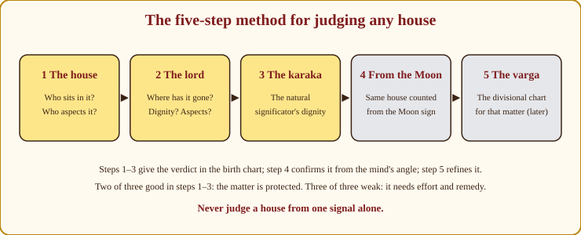
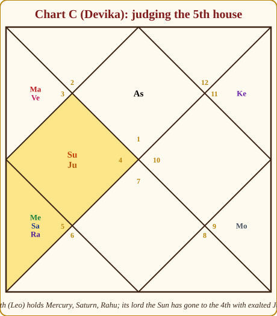
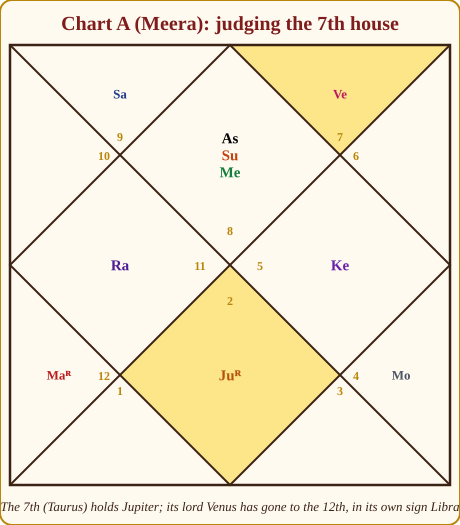
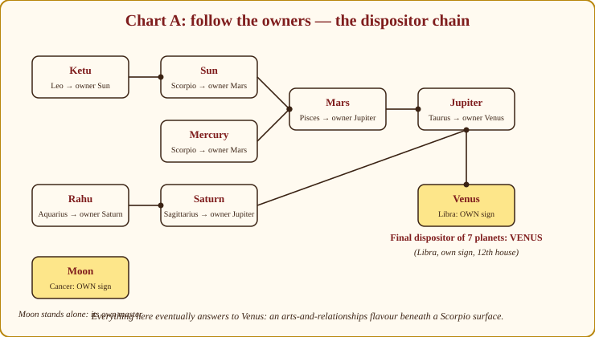
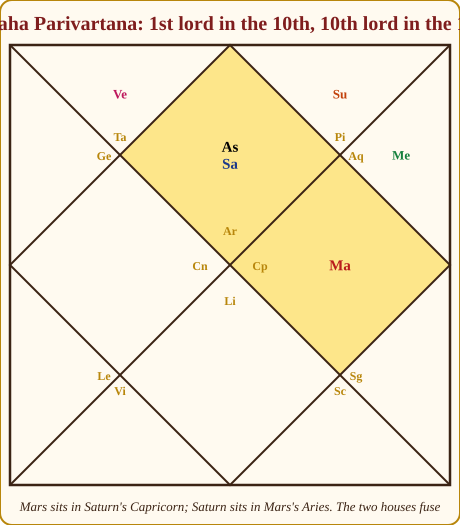

# Chapter 9: House Lords — Where Did the Owner Go?

Every house in the chart has an owner. You have known this since Chapter 2: each sign has a lord, and each house contains a sign, so the lord of that sign is the **lord of that house** (*Bhavesha*). For a Scorpio Lagna, the 7th house is Taurus, and Venus is the lord of the 7th. So far, a fact.

Now the idea that turns the fact into a tool. The owner of a house is like the owner of a shop. If he sits in his own shop, it runs beautifully. If he is always at the temple, the shop's affairs get mixed up with religion. If he is in the hospital, the shop suffers. **The lord carries the matters of its house to wherever it sits.** That sentence, applied twelve times, is most of what the classics mean by "read the lords".

This chapter gives you the method, the 144 basic combinations, and three refinements — dispositors, exchanges, and lords in their own houses.

## The master principle

Three questions about any house lord, in this order:

1. **Which house has it gone to?** A lord in a good house — an angle (1, 4, 7, 10), a trine (5, 9), the 2nd or the 11th — makes its house's matters flourish. A lord in a difficult house (6, 8, 12) struggles or is *transformed*: the matters arrive through service, crisis or distance. A lord in the 3rd works hard for its results.
2. **How is it doing there?** Own sign or exaltation: strong owner, matters prosper. Enemy's sign or debilitation: weak owner, matters need help. Combust, in a planetary war, hemmed by malefics: weakened. Aspected by Jupiter: protected.
3. **What does the destination house *mean*?** This is where the reading comes alive. The 4th lord in the 10th: mother, home, education and comfort (4th) have gone to career and public life (10th). Perhaps a family business, a career in real estate or teaching, work from home, a mother who shaped the career. You do not memorise which; you offer the possibilities and let the rest of the chart choose.

> **📖 Story: The owner who went to another room.** Each of the twelve rooms in the haveli has an owner whose name is on the door, but owners wander. The owner of the kitchen (the 4th, home and mother) is found every day in the office (the 10th) — so the family's meals are eaten at the desk, the mother keeps the accounts, and the business is run from home. The owner of the marriage room (the 7th) is found in the guest-house at the edge of the estate (the 12th) — so the spouse comes from far away and the couple's happiest hours are private ones. The owner of the treasury (the 2nd) is found lying in the sick-room (the 6th) — so money goes on medicines and disputes until he recovers. Wherever the owner sits, that is where his room's business is done, and the state of the room he sits in decides how well it goes. **Rule:** A house lord carries its house's matters to the house it occupies; good destination, good results; difficult destination, struggle or transformation.

> **🧭 Guruji's rule of thumb:** Say it as a sentence: "The matters of house N have gone to house M." Then ask what happens when those two departments of life share an office. That sentence is worth more than any list.

## The five-step method for judging any house

When a client asks about children, marriage, career, or health, they are asking about a house. Here is how I answer, every time, in the same order, so that I never skip a signal.

*Figure 9.1: The five steps. The first three give the verdict in the birth chart; the fourth confirms from the Moon; the fifth refines with a divisional chart.*

1. **The house itself.** Who sits in it? Who aspects it (Chapter 6)? Benefics and functional benefics (Chapter 8) protect; malefics pressure.
2. **The lord.** Where has it gone? What is its dignity, and who is with it or aspecting it?
3. **The natural significator (karaka).** Appendix A.5 lists one for each house — Jupiter for children, Venus for spouse, Sun for father, and so on. A strong karaka rescues a weak house; a weak karaka makes even a good house work harder.
4. **The same house counted from the Moon.** The Moon is the mind, and the chart from the Moon (*Chandra Lagna*) shows how the person *experiences* the matter. If the Lagna chart and the Moon chart agree, speak with confidence. If they disagree, the truth is mixed.
5. **The divisional chart** for that matter — D7 for children, D9 for marriage, D10 for career (Appendix A.10). Chapter 11 teaches these; for now, know that the step exists.

Two of the first three strong, and the matter is protected. All three weak, and it needs effort and remedy.

> **📖 Story: Visiting a house.** When the steward is asked "how are the children of this family?", he does not guess. First he visits the children's room itself (the 5th) and sees who is living there and who keeps peering in through the windows — occupants and aspects. Then he goes looking for the landlord of that room, wherever he has wandered, and checks whether he is well-dressed or in rags — the lord and its dignity. Then he visits the shrine of the room's patron deity — the karaka, Jupiter for children — and sees whether the lamp is lit. Then he looks at the room's reflection in the Queen Mother's mirror — the same house counted from the Moon — to learn how the family *feels* about it. Last, he unrolls the district map for that matter — the divisional chart. Only then does he speak. **Rule:** House, lord, karaka, from the Moon, varga — five steps, every time.

### Worked example: Chart C, the 5th house (children)

*Figure 9.2: Chart C. The 5th house Leo holds Mercury, Saturn and Rahu. Its lord, the Sun, has gone to the 4th house Cancer, where exalted Jupiter also sits.*

Devika (Aries Lagna) asks about children.

**Step 1 — the house.** The 5th is Leo, and it is crowded: Mercury at 1°, Rahu at 3°, Saturn at 18°. Saturn is a functional malefic for Aries (it owns the 11th), in its enemy the Sun's sign. Rahu is tightly conjunct Mercury, and Ketu aspects the house from the 11th. A pressured house: delay, anxiety about children, unconventional routes (Rahu), much thinking about education (Mercury). Mercury and Rahu at 1°–3° Leo also sit in the Magha Gandanta strip (Chapter 7) — an intensifier, not a verdict.

**Step 2 — the lord.** The Sun, lord of Leo, has gone to the 4th house Cancer. The 4th is an angle — a good house. Cancer is the Moon's sign, a friend of the Sun. And the Sun sits with **Jupiter, exalted at 26° Cancer**. The 5th lord in a good house, in a friendly sign, in the company of an exalted great benefic: the children *come*, and they come through the home and the mother's line (4th), and they are a source of learning and comfort.

**Step 3 — the karaka.** Jupiter, the significator of children, is exalted in an angle. This is the strongest possible karaka. It rescues the crowded 5th.

**Step 4 — from the Moon.** The Moon is in Sagittarius. The 5th from Sagittarius is Aries — which is the 1st house of the chart, and it is empty; its lord Mars sits in the 3rd. From the Moon's angle, children are simply a matter of the self and of effort, with no malefic pressure. Mild, clean confirmation.

**Step 5 — D7 later.** We will check the Saptamsa in Chapter 11.

**Verdict.** Pressure in the house (delay, worry, an unconventional path — perhaps medical help, perhaps late motherhood) but a strong lord and the strongest karaka: children, and a deep bond of learning with them. "Struggle, then success" is exactly what these steps say. The crowded 5th alone would have frightened a beginner into a wrong answer.

### Worked example: Chart A, the 7th house (marriage)

*Figure 9.3: Chart A. The 7th house Taurus holds Jupiter, retrograde. Its lord Venus has gone to the 12th house, in its own sign Libra.*

**Step 1 — the house.** Taurus, with Jupiter at 8°, retrograde. Jupiter is a functional benefic for Scorpio (lord of the 2nd and 5th). A benefic in the 7th is classical protection for marriage — though Jupiter is in the sign of its enemy Venus, and retrograde, so the partner is learned but has a mind of their own, and the match may be reconsidered once before it is settled. Aspects: the Sun and Mercury from the 1st both aspect the 7th (Chapter 6). An articulate, confident partner; a marriage in which two strong personalities face each other.

**Step 2 — the lord.** Venus has gone to the 12th — a difficult house — but it is in **its own sign, Libra**. A lord in a dusthana in its own sign is a shop-owner who has opened a branch in a distant town: the matters are far away but well run. The 12th is distance, foreign places, expenses and the pleasures of the bed. Marriage linked to another city or country, spending on the partner and the home, and a private, comfortable intimacy. Not denial — distance.

**Step 3 — the karaka.** In a woman's chart the classics take Jupiter as the significator of the husband (Appendix A.2), and Jupiter is *in the 7th house itself*. The karaka sitting in the house it signifies is a strong yes.

**Step 4 — from the Moon.** The Moon is in Cancer; the 7th from it is Capricorn, the 3rd house of the chart — empty, its lord Saturn in the 2nd in Jupiter's Sagittarius. Neutral confirmation: no pressure, no extra push.

**Verdict.** Marriage assured and protected; a learned, articulate, independent partner; a link with distance and a comfortable private life. Timed in Venus's period — and her marriage came in 2016, within her Venus Mahadasha (age 18½ to 38½).

## The 144 combinations

Here are the twelve lords in the twelve houses, one line each, **derived** from the master principle: combine the meaning of the lord's house with the meaning of the destination, coloured by the destination's quality. These are starting sentences, not verdicts; dignity, company, aspects and Chapter 8's functional nature always adjust them.

### The 1st lord — the captain

The Lagna lord gets a paragraph per placement, because it is the person walking around their own chart.

**In the 1st.** The owner is home. Strong constitution, self-reliance, an independent mind, a life shaped by one's own effort. Such people recover from setbacks quickly.

**In the 2nd.** The self is invested in family, wealth and speech. Earns by personal effort, is known for what they say, and identifies strongly with the family name. Money matters feel personal.

**In the 3rd.** A self built on courage and effort. Close to siblings for good or ill, restless, communicative, fond of short journeys and hobbies. Achievement comes from initiative rather than luck.

**In the 4th.** The self is rooted at home. A strong bond with the mother, love of land, house and vehicles, a good education, a need for inner peace.

**In the 5th.** The self expressed through intelligence, creativity and children. Bright, often lucky in speculation, blessed by past merit. Romance and learning colour the personality.

**In the 6th.** A self tested early — health, competition, debts or hard service. Such people become fighters, excellent in medicine, law or any competitive field, but must guard health and avoid needless quarrels.

**In the 7th.** The self is completed by others. Partner-centred, drawn to business and travel, happiest in a pair; the spouse shapes the personality.

**In the 8th.** A private, deep self drawn to hidden things — research, the occult, insurance, surgery, psychology. Life has clear chapters, sometimes abrupt ones; health needs attention.

**In the 9th.** A fortunate, dharmic self. Father and guru matter; long journeys, higher learning and philosophy shape the life. Often teachers, often travellers.

**In the 10th.** Career *is* identity. Ambitious, visible, hard-working, respected; known by their work, and able to lose themselves in it.

**In the 11th.** A self that gains. Wide networks, generous friends, elder siblings who help, wishes that come true with effort. Comfortable later in life.

**In the 12th.** The self is spent far away or in solitude — foreign lands, hospitals, ashrams, research libraries. Expenses run high; spirituality runs deep. Such people need a retreat and often live abroad.

### The other eleven lords

Each row carries a dot for the quality of the destination house: 🟢 angle, trine, 2nd or 11th; 🟡 the 3rd (effort); 🔴 the 6th, 8th or 12th. Where a 🔴 destination is the lord's own house or forms a Viparita yoga, the row is marked 🟡, because the difficult house then works in your favour.

**Lord of the 2nd (wealth, speech, family) in the…**

| House | Derived meaning |
|---|---|
| 1 🟢 | Wealth by own effort; speaks freely; family-centred identity |
| 2 🟢 | Steady accumulation, good speech, strong lineage (own house) |
| 3 🟡 | Money through communication, writing, siblings; effort for earnings |
| 4 🟢 | Wealth from property, mother's side, education; comfortable home |
| 5 🟢 | Earns through intelligence, children, speculation; learned speech |
| 6 🔴 | Money through service or medicine; debts and disputes over family funds |
| 7 🟢 | Wealth through spouse or partnership; pleasing speech in business |
| 8 🔴 | Inheritance, insurance, sudden ups and downs in savings; guarded speech |
| 9 🟢 | Wealth through fortune, father, higher learning; truthful, generous speech |
| 10 🟢 | Wealth through career; speech is a professional tool |
| 11 🟢 | Wealth grows through gains and networks; a strong earner |
| 12 🔴 | Spending outruns saving; money abroad or in charity; quiet speech |

**Lord of the 3rd (courage, siblings, communication) in the…**

| House | Derived meaning |
|---|---|
| 1 🟢 | Brave, self-willed, a natural communicator; siblings shape the self |
| 2 🟢 | Siblings and family close; income from communication |
| 3 🟡 | Courage, hard work, artistic hobbies, good sibling bonds (own house) |
| 4 🟢 | Courage applied at home; siblings nearby; short journeys for study |
| 5 🟢 | Creative communication; effort in learning; siblings' children dear |
| 6 🔴 | Rivalry with siblings or competitors; courage in service; short work trips |
| 7 🟢 | Partnership built on communication; spouse like a friend; business travel |
| 8 🔴 | Siblings distant or in difficulty; courage tested; research writing |
| 9 🟢 | Siblings fortunate or abroad; effort for dharma; long journeys |
| 10 🟢 | Career in communication, sales, media, writing; a hard worker |
| 11 🟢 | Gains through initiative, siblings and networks |
| 12 🔴 | Sibling far away; effort spent quietly; foreign correspondence |

**Lord of the 4th (mother, home, education, comforts) in the…**

| House | Derived meaning |
|---|---|
| 1 🟢 | Home-loving, mother's strong influence, well educated, comfortable |
| 2 🟢 | Property adds to wealth; mother's family helps; education pays |
| 3 🟡 | Changes of residence; effort for comforts; mother close to siblings |
| 4 🟢 | Settled home, strong mother, sound education, vehicles (own house) |
| 5 🟢 | Education leads to creativity; a wise mother; property luck |
| 6 🔴 | Domestic disturbance; mother's health to watch; work away from home |
| 7 🟢 | Home shared with partner; mother influences marriage; property via spouse |
| 8 🔴 | Inherited property; mother's health caution; renovations and moves |
| 9 🟢 | Fortunate home; higher education; a religious mother; study abroad |
| 10 🟢 | Home, mother or education linked to career: family business, work from home, real estate, teaching |
| 11 🟢 | Gains through property; comforts increase; mother's friends help |
| 12 🔴 | Home far away; expenses on property; mother distant; spiritual learning |

**Lord of the 5th (children, intellect, merit) in the…**

| House | Derived meaning |
|---|---|
| 1 🟢 | Intelligent, creative, close to children; merit shows in the personality |
| 2 🟢 | Earns from intellect; children add to wealth; learned speech |
| 3 🟡 | Creative communication; studious effort; active children |
| 4 🟢 | Education strong; mother's blessing; children at home |
| 5 🟢 | Bright mind, blessed children, good past merit (own house) |
| 6 🔴 | Children's health or studies need care; intellect in service; competitive study |
| 7 🟢 | Children through partner; a creative spouse; romance becomes marriage |
| 8 🔴 | Children delayed or the relationship transformed; occult intellect; research |
| 9 🟢 | Dharmic intelligence; fortunate children; guru's grace |
| 10 🟢 | Creative career; children successful; recognition for intellect |
| 11 🟢 | Gains from intellect and speculation; prosperous children |
| 12 🔴 | Children far away or late; spiritual intellect; expenses on children |

**Lord of the 6th (enemies, disease, service, debts) in the…**

| House | Derived meaning |
|---|---|
| 1 🟢 | Health needs attention; competitive nature; service-minded |
| 2 🟢 | Debts touch family wealth; disputes over money; family health |
| 3 🟡 | Struggles with siblings; hard work; courage against rivals |
| 4 🟢 | Domestic disputes; mother's health; property litigation |
| 5 🟢 | Children's health; competition in studies; a sharp, combative intellect |
| 6 🟡 | Defeats enemies, excels in service, resists disease (own house) |
| 7 🟢 | Friction with partner; service through partnership; spouse's health |
| 8 🟡 | Harsha Viparita: enemies undo themselves; strong longevity |
| 9 🟢 | Disagreements with father or guru; service abroad; fortune by effort |
| 10 🟢 | Career in service, medicine, law, the army; competition at work |
| 11 🟢 | Gains through service and competition; friction with elder siblings |
| 12 🟡 | Harsha Viparita: enemies vanish; hospitals or service abroad |

**Lord of the 7th (spouse, partnership, business) in the…**

| House | Derived meaning |
|---|---|
| 1 🟢 | Partner-centred life; the spouse influences the self strongly |
| 2 🟢 | Spouse brings wealth; family grows through marriage |
| 3 🟡 | Partner met through communication; travel after marriage |
| 4 🟢 | Spouse from a familiar circle; domestic harmony; property via marriage |
| 5 🟢 | Love marriage tendency; a creative partner; children through the partner |
| 6 🔴 | Friction or health issues in marriage; partner in service; patience needed |
| 7 🟢 | Strong marriage and partnerships; business acumen (own house) |
| 8 🔴 | Marriage brings deep change; partner's health; in-laws' wealth |
| 9 🟢 | Fortunate spouse; marriage abroad or across communities; dharmic partner |
| 10 🟢 | Partner tied to career; business partnerships; status through marriage |
| 11 🟢 | Gains through partner; spouse from friends' circle |
| 12 🔴 | Spouse from far away; expenses on marriage; private comforts |

**Lord of the 8th (longevity, hidden matters, transformation) in the…**

| House | Derived meaning |
|---|---|
| 1 🟢 | Transformative personality; health caution; occult interest |
| 2 🟢 | Inheritance shapes wealth; secretive speech; fluctuating savings |
| 3 🟡 | Courage tested; siblings' hidden matters; research writing |
| 4 🟢 | Property through inheritance; mother's health; deep education |
| 5 🟢 | Children's matters transformed; occult intellect; speculation caution |
| 6 🟡 | Sarala Viparita: hidden troubles defeated; strong longevity |
| 7 🟢 | Partner's health; hidden sides of marriage; in-laws prominent |
| 8 🟡 | Long life, deep researcher, handles crises well (own house) |
| 9 🟢 | Father's hidden matters; unorthodox dharma; fortune through change |
| 10 🟢 | Career in insurance, research, surgery, the occult; career breaks |
| 11 🟢 | Gains through inheritance, insurance, sudden windfalls |
| 12 🟡 | Sarala Viparita: hidden enemies vanish; moksha inclination |

**Lord of the 9th (fortune, father, guru) in the…**

| House | Derived meaning |
|---|---|
| 1 🟢 | Fortunate, dharmic personality; father's blessing |
| 2 🟢 | Wealth through luck; a religious family; truthful speech |
| 3 🟡 | Fortune by effort; fortunate siblings; short pilgrimages |
| 4 🟢 | Fortunate home; strong education; a devout mother |
| 5 🟢 | Strong past merit; wise children; guru's grace |
| 6 🔴 | Father's health; disputes with teachers; fortune through service |
| 7 🟢 | Fortunate spouse; marriage abroad; dharma through partnership |
| 8 🔴 | Father's health caution; fortune fluctuates; deep philosophy |
| 9 🟢 | Strong fortune, guru, father (own house) |
| 10 🟢 | Dharma-Karma link: a righteous, fortunate career; father helps |
| 11 🟢 | Gains through fortune; fortunate elder siblings; wishes granted |
| 12 🔴 | Fortune abroad; charitable; father distant; spiritual life |

**Lord of the 10th (career, status) in the…**

| House | Derived meaning |
|---|---|
| 1 🟢 | Career-driven; self-employment; recognition |
| 2 🟢 | Career builds wealth; family business; speech in the profession |
| 3 🟡 | Career in communication, sales, media; success by effort |
| 4 🟢 | Career from home, property or education; mother's help |
| 5 🟢 | Creative or advisory career; speculation; work with children |
| 6 🔴 | Career in service, medicine, law; competition; job changes |
| 7 🟢 | Career through partnerships; business; spouse in the work |
| 8 🔴 | Career transformations; insurance, research, occult; breaks and comebacks |
| 9 🟢 | Dharma-Karma link: fortunate career; teaching, law, travel |
| 10 🟢 | Strong career and status (own house) |
| 11 🟢 | Gains from career; ambitious; strong networks |
| 12 🔴 | Career abroad or behind the scenes; hospitals; isolation |

**Lord of the 11th (gains, elder siblings, friends) in the…**

| House | Derived meaning |
|---|---|
| 1 🟢 | A gainful personality; friends help; wishes fulfilled |
| 2 🟢 | Gains build wealth; family friendships |
| 3 🟡 | Gains through effort and siblings |
| 4 🟢 | Gains through property and mother |
| 5 🟢 | Gains through children, intellect, speculation |
| 6 🔴 | Gains through service; disputes with friends; debts |
| 7 🟢 | Gains through spouse and business |
| 8 🔴 | Gains through inheritance or insurance; friends' losses |
| 9 🟢 | Gains through fortune and father |
| 10 🟢 | Gains through career; ambitious |
| 11 🟢 | Strong gains, helpful elder siblings (own house) |
| 12 🔴 | Gains spent; income from abroad; friends far away |

**Lord of the 12th (expenses, distance, release) in the…**

| House | Derived meaning |
|---|---|
| 1 🟢 | Expenses on self; foreign residence; a spiritual bent |
| 2 🟢 | Expenses on family; spending exceeds saving |
| 3 🟡 | Expenses on siblings and journeys; effort abroad |
| 4 🟢 | Expenses on home; mother far away; love of sleep and comfort |
| 5 🟢 | Expenses on children and education; meditative intellect |
| 6 🟡 | Vimala Viparita: losses cancel; hospital or service work abroad |
| 7 🟢 | Expenses on spouse; a foreign partner |
| 8 🟡 | Vimala Viparita: losses cancel; occult depth |
| 9 🟢 | Expenses on pilgrimage and father; fortune abroad |
| 10 🟢 | Career abroad; behind-the-scenes work; expenses on career |
| 11 🟢 | Gains balance expenses; friends abroad |
| 12 🟡 | Controlled expenses; a life abroad; moksha (own house) |

> **⚠️ Common beginner mistake:** Reading one line from these tables as a prediction. "7th lord in the 6th means divorce" is not in the table, and it is not true. The table says *friction, and patience needed*. Whether that friction is a stormy first year or a lifelong struggle is decided by dignity, aspects, the karaka, the Navamsa and the dasha — never by one line.

## Lords in their own house (Swakshetra)

When a lord sits in the house it owns, the shop-owner is behind his own counter and the house is stable. The twelve, in one line each:

1st lord in the 1st — a strong body and will. 2nd in the 2nd — wealth holds. 3rd in the 3rd — courage and siblings steady. 4th in the 4th — home and mother secure. 5th in the 5th — intelligence and children blessed. 6th in the 6th — enemies and disease held at bay. 7th in the 7th — marriage and business firm (Chart B's Venus). 8th in the 8th — long life, deep mind (Chart B's Saturn). 9th in the 9th — fortune protected (Chart A's Moon in Cancer). 10th in the 10th — career solid. 11th in the 11th — gains steady. 12th in the 12th — expenses controlled, a spiritual life (Chart A's Venus in Libra).

Notice that the 6th, 8th and 12th lords in their *own* houses are good — a malefic guarding its own gate keeps trouble inside it.

> **🪔 Consultation tip:** When a lord has gone to the 6th, 8th or 12th, never say "your marriage house is destroyed" or "your children house is spoilt". Say where the matter has *gone*: "Your partner is likely to come from far away, or the marriage will involve distance." Distance, service and transformation are things a person can plan for. Destruction is not, and it is almost never what the chart says.

## Two lords together: fusing two houses

When two lords sit in one house, the two houses they own are fused and poured into the house they occupy. The 9th and 10th lords together fuse fortune with career: the **Dharma-Karma Adhipati yoga**, the most reliable career signal in the classics. The 1st and 10th lords: the self-made professional. The 2nd and 11th lords: a **Dhana yoga** of wealth and gains. The 6th and 7th lords: disputes fused with marriage. The 5th and 9th lords: Lakshmi's two houses in one room.

This is where Chapter 8 meets Chapter 10. A **Raja yoga** is simply an angle lord and a trine lord connected — by conjunction, mutual aspect, or exchange (Chapter 6's Sambandha). In Chart A, the Sun (10th lord) and Jupiter (5th lord) are in mutual aspect from the 1st and 7th: the machinery beneath Meera's teaching career. Chapter 10 names and ranks these.

## Dispositors: following the owners

Every planet sits in a sign, and that sign has a lord. The lord of the sign a planet sits in is that planet's **dispositor** — its landlord. The planet lives in the landlord's house and takes on the landlord's mood. Follow the chain: Sun in Scorpio, landlord Mars; Mars in Pisces, landlord Jupiter; Jupiter in Taurus, landlord Venus; Venus in Libra — its own sign. The chain stops there. Venus is the **final dispositor**: the landlord of landlords.

*Figure 9.4: Chart A's dispositor chain. Seven planets eventually answer to Venus in Libra; the Moon, in its own sign Cancer, stands alone.*

In Chart A: the Sun and Mercury (Scorpio) answer to Mars; Mars (Pisces) and Saturn (Sagittarius) answer to Jupiter; Jupiter (Taurus) answers to Venus; Rahu (Aquarius) answers to Saturn and so to Jupiter and Venus; Ketu (Leo) answers to the Sun and so to Mars, Jupiter, Venus. Seven of nine end at Venus. The Moon sits in Cancer, its own sign, and answers to nobody.

> **📖 Story: Who does your landlord pay rent to?** The young Prince rents a room in the Commander's house. Ask the Commander, and he admits he rents *his* house from the Royal Priest. The Priest, it turns out, rents from the Minister of Pleasure. And the Minister of Pleasure? She owns her house outright. So when the Prince's rent goes up, it is because the Minister raised it three landlords away. Follow the rent up the chain and you find who really runs the neighbourhood. In Chart A that is Venus: the Sun and Mercury pay Mars, Mars and Saturn pay Jupiter, Jupiter pays Venus, and Venus pays nobody. The Queen Mother, in her own Cancer house, is the one tenant on the street who is also her own landlord. **Rule:** A planet's dispositor is the lord of the sign it occupies; follow the chain to the planet in its own sign — the final dispositor — to find the chart's hidden centre.

What this tells you: beneath Meera's Scorpio surface — intense, private, Sun-and-Mercury sharp — the chart is ultimately run by Venus: relationships, aesthetics, harmony, comfort. Whatever happens to Venus by dasha or transit ripples through everything; the Moon's independence means her emotional life runs on its own track. A final dispositor in its own or exalted sign, as here, marks a chart with a strong central motive. When there is no single final dispositor — two planets in their own signs, or a loop — the person has two centres of gravity, and you read both.

## Exchange of lords: Parivartana

The most striking of the four Sambandhas from Chapter 6 is the **exchange** (*Parivartana*): the lord of house A sits in house B, and the lord of house B sits in house A. The two owners have swapped shops, and the houses fuse so tightly that the classics read each lord *as if it were in its own house*, with the flavour of the other. Three kinds are distinguished:

| Kind | Houses involved | Result |
|---|---|---|
| **Maha** ("great") | Both among 1, 2, 4, 5, 7, 9, 10, 11 | Both houses flourish; a strong yoga |
| **Khala** ("mischievous") | One is the 3rd (some teachers include the 11th on the trishadaya principle) | Mixed; gains after struggle, or effort that pays late |
| **Dainya** ("wretched") | One is the 6th, 8th or 12th | The good house is dragged into difficulty; both suffer, then adjust |

*Figure 9.5: A constructed Maha Parivartana. The 1st lord Mars sits in the 10th (Saturn's Capricorn); the 10th lord Saturn sits in the 1st (Mars's Aries). Self and career are fused.*

In the constructed chart above, an Aries Lagna has Mars (1st lord) in the 10th and Saturn (10th lord) in the 1st: a Maha Parivartana between the 1st and 10th. Identity and career are one — the self-made professional who rises to authority, with Saturn's discipline in the personality and Mars's drive in the work. It even softens Saturn's debilitation in Aries, because Saturn is exchanging with its own dispositor — a Neecha Bhanga, as Appendix A.11 notes.

> **📖 Story: Two landlords swap keys.** The Queen Mother owns the Cancer house in the 4th district; the Royal Priest owns the Sagittarius house in the 9th. One day they exchange keys: she moves into his house, he moves into hers. Now every repair she orders in his house is a repair to her own interest, and every blessing he gives in her house comes home to him. The two households become one estate — neither can be judged without the other. If both houses are in good districts, the estate prospers (Maha). If one of them is the cramped house of effort in the 3rd district, the swap is mischievous — profit, but with labour (Khala). If one of them is the sick-room, the storeroom of debts or the guest-house of losses, the good landlord is dragged into a bad neighbourhood (Dainya). **Rule:** Parivartana fuses two houses; judge it Maha, Khala or Dainya by the houses involved.

Now look at Chart C, because it has a real one. Devika's Moon sits in Sagittarius, Jupiter's sign; her Jupiter sits in Cancer, the Moon's sign. For Aries Lagna, Cancer is the 4th house and Sagittarius the 9th. So the 4th lord and the 9th lord have exchanged — an angle and a trine, both good houses: a **Maha Parivartana**, and at the same time a Raja yoga by exchange (Chapter 10). Home and fortune are fused; the mother is devout and the home a place of learning; higher education and grace come through the family; and exalted Jupiter in the 4th is read as if it were in its own 9th as well. This is the quiet engine beneath her chart, and it is also why the pressured 5th house, whose lord sits with this Jupiter, ends in success. When you meet an exchange in a client's chart, it is often the single most important feature, and you should say so.

> **💡 Did you know?** *Parivartana* is the everyday Hindi word for "change". Some South Indian teachers call the exchange the strongest of all relationships — stronger even than conjunction — because it is *mutual and complete*: each planet is read as if it had gone home.

## In one breath

- Every house has a lord (the lord of its sign), and the lord carries the house's matters to wherever it sits.
- A lord in an angle, trine, 2nd or 11th makes its house flourish; in the 3rd it works hard; in 6, 8 or 12 it struggles or is transformed — unless it is in its own sign, or forms a Viparita yoga.
- Judge any house in five steps: the house, the lord, the karaka, the same house from the Moon, the divisional chart.
- The 144 "lord of N in M" combinations are derived, not memorised: combine the two houses' meanings and colour by the destination's quality (🟢 good houses, 🟡 the 3rd, 🔴 the 6th, 8th, 12th).
- The Lagna lord is the captain; its placement tells you where the person's life energy is invested.
- A lord in its own house stabilises that house — even the 6th, 8th and 12th lords.
- Two lords together fuse two houses; an angle lord and a trine lord connected is a Raja yoga (Chapter 10).
- Follow dispositors to the final dispositor to find the chart's hidden centre; an exchange of lords (Parivartana) is Maha, Khala or Dainya by the houses involved — Chart C has a Maha exchange of the 4th and 9th lords.

## Practice

> **✍️ Practice:**
> 1. For a Leo Lagna, name the lord of the 4th house. If it sits in the 10th house, what sign is it in, and what does the placement suggest?
> 2. In Chart B (Cancer Lagna), where is the 10th lord? Apply the five-step method's first two steps to Arjun's career.
> 3. Chart C (Aries Lagna): find the dispositor of Saturn, then of that planet, and name the final dispositor of Saturn's chain.
> 4. A Sagittarius Lagna has Mercury in Pisces and Jupiter in Gemini. Which houses are exchanging, and what kind of Parivartana is it?
> 5. Devika's 6th lord is Mercury, and it sits in the 5th house. Is this a Viparita Raja yoga? Why or why not?

Answers

1. For Leo, the 4th house is Scorpio and its lord is Mars. The 10th house is Taurus, so Mars sits in Taurus — Venus's sign, where Mars is neutral. The 4th lord in the 10th: home, mother, property or education linked to career — a family business, real estate, teaching, or a mother who shaped the profession. Mars adds engineering, land and the army to the possibilities.
2. The 10th house is Aries; its lord Mars sits in the 2nd house, Leo, retrograde. Step 1, the house: Aries is occupied by Ketu, and aspected by Rahu from the 4th; Jupiter from the 5th does not reach it (its aspects fall on the 9th, 11th and 1st). A career with a detached, technical, unconventional flavour. Step 2, the lord: Mars in the 2nd, in the Sun's sign (a friend), yogakaraka for Cancer — career feeds wealth and speech; he earns by his mind and voice, and his career strengthens in Mars's periods.
3. Saturn is in Leo; its dispositor is the Sun. The Sun is in Cancer; its dispositor is the Moon. The Moon is in Sagittarius; its dispositor is Jupiter. Jupiter is in Cancer, whose lord is the Moon. The chain ends in a Moon–Jupiter loop — which is exactly the 4th–9th Parivartana we met in this chapter — so there is no single final dispositor; Saturn's chain resolves to the Moon–Jupiter pair, the mind and wisdom.
4. For Sagittarius, Pisces is the 4th house (lord Jupiter) and Gemini is the 7th house (lord Mercury). Mercury sits in Jupiter's Pisces (the 4th) and Jupiter sits in Mercury's Gemini (the 7th): an exchange between the 4th and 7th. Both are angles among the good houses, so it is a Maha Parivartana — home and marriage fused; property through the spouse, a partner who becomes family. (Note Mercury is debilitated in Pisces; the exchange with its dispositor is a Neecha Bhanga.)
5. No. Viparita Raja yoga requires the 6th, 8th or 12th lord to sit in *another* of the houses 6, 8 or 12. Mercury, the 6th lord, is in the 5th — a trine, not a dusthana. It is simply the 6th lord in the 5th: competition in studies, children's health to watch, a sharp and combative intellect — which fits the pressured 5th house we read in this chapter.

