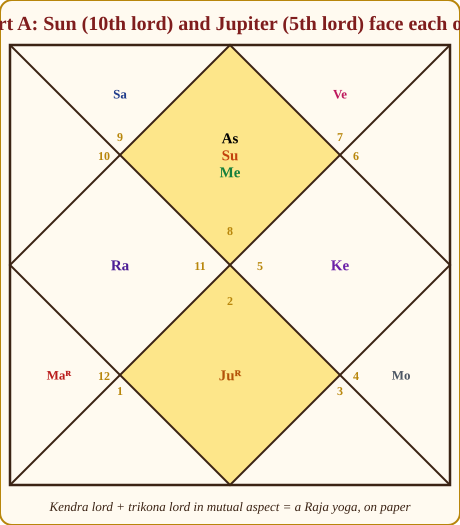
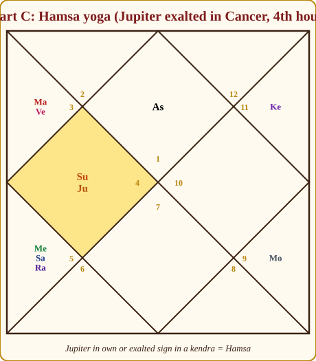
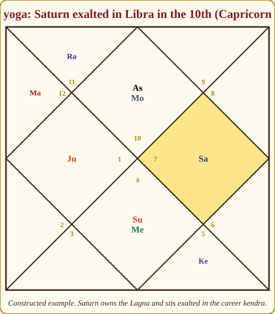
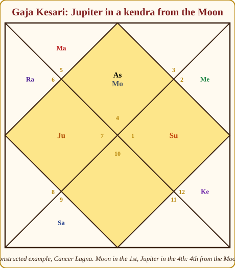
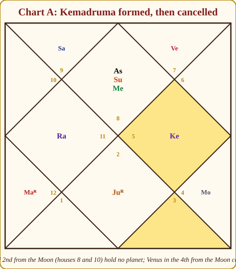
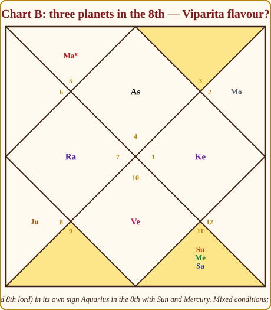
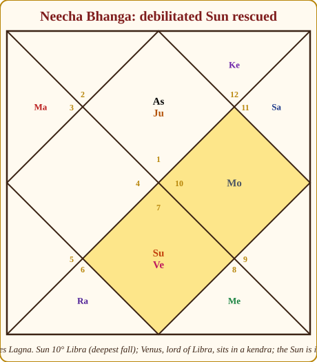
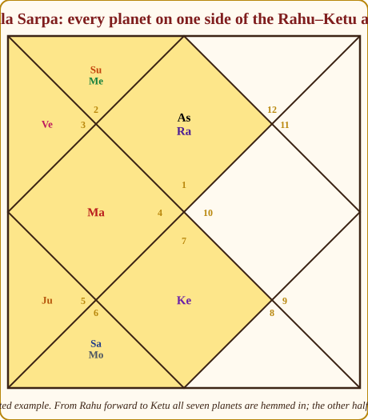
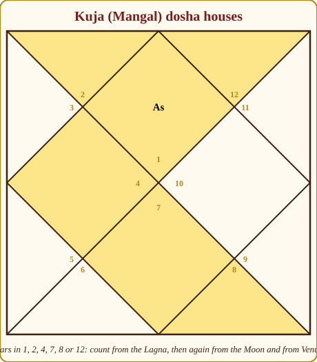

# Chapter 10: Yogas: When Planets Form a Team

A cricket team is eleven players. But eleven good players do not make a good team, and a team of ordinary players who understand each other can win a World Cup. Something happens *between* them.

Planets do the same. Jupiter alone is a wise man; the Moon alone is a sensitive mind. Put Jupiter at a square angle from that Moon and you get something neither produces by itself: a mind that is protected, that recovers from every fall. The old astrologers noticed such combinations again and again and called them **yogas**. The word simply means "joining".

When I was learning this, yogas were the part of the classics that made me want to give up: every page a new name, a new condition, and no reason for any of it. This chapter is the version I wish I had been given: the principle first, then the twenty or so yogas you will actually meet, each with its reason, and finally the skill of judging whether a yoga is *alive* or just a name on paper.

## What a yoga is, and the beginner's danger

A yoga is **a relationship between planets or houses that produces a result neither would produce alone**. A planet in a house is a placement; a planet in a sign is dignity; a yoga needs at least two things to *connect*. Hold that firmly and you stop asking "does this chart have Gaja Kesari?" as though it were a passport stamp, and start asking "are the Moon and Jupiter working together here, and how well?"

Now the danger. Open *Phaladeepika* or *Jataka Parijata* and you find yogas by the hundred; students memorise (and drown) or give up. You need roughly **twenty yogas** in active memory and the **principle** so firmly held that number 201 reads as "ah, a Raja yoga through the 4th and 9th lords". The principle: *connection between the right houses, by the right planets, in good condition*. Four ideas cover most of it: kendra plus trikona gives status; wealth houses connected gives wealth; difficult lords in difficult houses cancel evil; fallen planets rescued by their dispositors rise again.

> **🧭 Anushka's rule of thumb:** A yoga is a sentence, not a word. Ask three things: who is talking (the planets), what about (the houses they own and occupy), and are they actually in the same room (the connection). If any is missing, there is no sentence.

## The glue: four kinds of relationship (Sambandha)

Chapter 6 taught you aspects and conjunctions; here is where you use them. Two planets are in **relationship** (*Sambandha*) when joined in any of these four ways, strongest first:

1. **Together in one sign** (conjunction, *Yuti*): two people in one room; the closer in degree, the tighter the bond.
2. **Mutual aspect** (*Paraspara Drishti*): two people facing each other. Any two planets in opposite signs see each other; Mars (4/8), Jupiter (5/9) and Saturn (3/10) can complete a mutual aspect from other distances too.
3. **Exchange of signs** (*Parivartana*): each sits in the other's house. Many teachers rank this the strongest bond; the two houses fuse.
4. **One-sided influence**: one planet aspects the other without being aspected back, or sits in the other's sign. Influence, not partnership. Half marks.

> **🔍 Why?** System grammar. Conjunction and mutual aspect are *two-way*: each planet receives the other. Exchange is stronger still because each planet lives in the other's house, so the two houses cannot be separated. A one-sided aspect shapes one planet and not the other. Everyday parallel: two colleagues who message each other daily are a team; one who only reads your messages is an audience.

## Raja yogas: the royal combinations

*Raja* means king. A Raja yoga raises status: authority, recognition, a life somewhat larger than the family one was born into. The formation: **a lord of a kendra (1, 4, 7, 10) connected with a lord of a trikona (1, 5, 9).**

> **📖 Story: The pillar-keeper and the treasury-keeper.** In the King's haveli there are two kinds of officers. The pillar-keepers hold the four corners of the building, the kendras (houses 1, 4, 7 and 10), where the doors open and the real business of the household happens. The treasury-keepers hold Lakshmi's three rooms, the trikonas (1, 5 and 9), where merit, children and fortune are stored. Most days they never meet: the pillar-keeper is busy with visitors, the treasury-keeper is counting. But when one pillar-keeper and one treasury-keeper are found in the same room, or looking at each other across the courtyard, or have swapped keys, the household rises. Effort has found its funding; fortune has found a door to walk through. The Lagna lord holds both kinds of key, since house 1 is a pillar *and* a treasury, so he can shake hands with either side. **Rule:** a kendra lord connected with a trikona lord makes a Raja yoga.

> **🔍 Why?** System grammar, stated by Parashara in the Raja yoga chapter of *Brihat Parashara Hora Shastra*: kendras are the houses of *power and position* (Vishnu's houses), trikonas the houses of *merit and fortune* (Lakshmi's houses). Power without merit is a post nobody trusts; merit without power is talent nobody sees. Connected, they make status. Everyday parallel: the officer who has both the post and the public's respect; plenty have one or the other, and the one with both is the one people remember.

Let us derive it for Chart A, Meera, Scorpio Lagna. First the lordships (Chapter 9):

| House | Sign | Lord | Where the lord sits | Condition |
|---|---|---|---|---|
| 1 (kendra + trikona) | Scorpio | Mars | 5th (Pisces), retrograde | 🟢 trikona, friend's sign |
| 4 (kendra) | Aquarius | Saturn | 2nd (Sagittarius) | 🔴 combust, 7° from the Sun |
| 5 (trikona) | Pisces | Jupiter | 7th (Taurus), retrograde | 🟡 kendra, but enemy's sign |
| 7 (kendra) | Taurus | Venus | 12th (Libra) | 🟡 own sign, but a dusthana |
| 9 (trikona) | Cancer | Moon | 9th (Cancer) | 🟢 own sign, own house |
| 10 (kendra) | Leo | Sun | 1st (Scorpio) | 🟡 friend's sign, but 28°, the sign's edge |

Now hunt for connections between kendra lords (Mars, Saturn, Venus, Sun) and trikona lords (Mars, Jupiter, Moon).

- **Sun (10th lord) in the 1st and Jupiter (5th lord) in the 7th** sit in opposite houses and aspect each other by the 7th aspect: a genuine **mutual aspect between a kendra lord and a trikona lord**. The 10th (career, status) joins the 5th (intelligence, students, merit), exactly the right pair for a teacher and consultant.
- **Mars (Lagna lord) in the 5th**, a trikona, in Jupiter's sign; but Jupiter's aspects from the 7th fall on the 11th, 1st and 3rd, not the 5th. Good placement, no partnership.
- **Moon (9th lord) in the 9th**, own sign: strong but alone.
- **Venus (7th lord) in the 12th** and **Saturn (4th lord) in the 2nd**: no trikona lord joins either.

*Figure 10.1: Chart A. The 10th lord Sun in the 1st and the 5th lord Jupiter in the 7th look straight at each other: a Raja yoga by mutual aspect.*

So Meera has one Raja yoga on paper. Now honesty. The Sun sits at 28° Scorpio, the last two degrees of the sign, in the tail of Jyeshtha, the sensitive gandanta edge (Chapter 7). Jupiter is retrograde in Taurus, the sign of Venus, its natural enemy. A real yoga with two tired players: recognition that comes later than hoped and smaller than the effort; respect rather than fame. Say "steady rise, recognition in your forties", not "you will rule".

Chart B, Arjun, Cancer Lagna, shows another pattern. Mars owns both the 5th and the 10th: the **yogakaraka**, which carries the Raja yoga inside itself (Chapter 8). Arjun's Mars, in the 2nd, throws its 4th aspect onto Jupiter, the 9th lord, in the 5th; Jupiter does not aspect back. Half a Raja yoga on a strong yogakaraka: "a rise through your own effort and speech, slowly".

> **💡 Did you know?** The most celebrated Raja yoga is **Dharma-Karmadhipati yoga**, the lords of the 9th (dharma) and 10th (karma) joined. Parashara ranks it first because it fuses grace with work. Neither Meera nor Arjun has it.

## Dhana yogas: the wealth combinations

A **Dhana yoga** is any connection among the lords of the wealth houses, 2 (what you hold), 11 (what flows in), 5 (merit) and 9 (fortune), and the Lagna (the one who must earn). Three planets deserve special mention: **Jupiter**, the natural significator of wealth; **Venus**, comforts and luxury; the **Moon**, liquidity, cash that moves. When one of them is among the connected lords, the yoga is noticeably richer.

> **🔍 Why?** System grammar. The 2nd and 11th are the money rooms: the 2nd is what is *kept*, the 11th what *arrives* (it is the 2nd from the 10th, the earnings of the career). The 5th and 9th are the merit rooms, the reason money is allowed to come. Wealth is money rooms fed by merit rooms, received by the Lagna. Everyday parallel: salary account (11th), savings (2nd), and the goodwill that keeps the salary coming (5th, 9th). Unconnected, money passes through without staying.

In Chart A, Jupiter (2nd and 5th lord) in the 7th and Mercury (11th lord) in the 1st aspect each other: a **mutual aspect between the 2nd/5th lord and the 11th lord**, a proper Dhana yoga. Add the Moon, 9th lord, powerful in its own sign in the 9th, and money comes steadily through knowledge and communication. Meera will not be poor; nor a tycoon. Jupiter's condition sets the ceiling.

## Panch Mahapurusha yogas: the five great persons

These arise when one of the five true planets, Mars, Mercury, Jupiter, Venus or Saturn, sits **in its own sign or exaltation sign, and that sign falls in a kendra from the Lagna.** Think of the five as the King's five great officers each standing at a pillar of the haveli in full regalia: the Commander, the Prince, the Priest, the Minister of Pleasure, the old Judge. A *Mahapurusha* is a "great person".

| Yoga | Planet | Own signs | Exaltation | Personality it stamps |
|---|---|---|---|---|
| **Ruchaka** | Mars | Aries, Scorpio | Capricorn | Commander: courage, strength, leadership in action, a temper |
| **Bhadra** | Mercury | Gemini, Virgo | Virgo | Scholar-speaker: intellect, eloquence, trade, a youthful look |
| **Hamsa** | Jupiter | Sagittarius, Pisces | Cancer | Sage: wisdom, faith, teaching, a fine reputation |
| **Malavya** | Venus | Taurus, Libra | Pisces | Artist-aristocrat: beauty, refinement, comforts, happy marriage |
| **Shasha** | Saturn | Capricorn, Aquarius | Libra | Administrator: authority over others, land, discipline, late power |

> **🔍 Why?** Two conditions, two reasons, both system grammar. Own or exalted sign is *capacity*: full powers. A kendra is *position*: where a planet is seen and can act (Chapter 4). A dignified planet in a dusthana is a strong person in a back room; an undignified planet in a kendra is an ordinary person in a high chair. Only the combination makes a "great person". Varahamihira's *Brihat Jataka* gives the five in this form; the Sun and Moon are left out as King and Queen Mother, above the rank of officer. Everyday parallel: the brilliant surgeon who is also head of department; skill alone or the chair alone does not make the name the whole city knows.

Chart C, Devika, is a textbook case: Jupiter at 26° Cancer, its exaltation, in the 4th house. **Hamsa yoga**. Devika's chart has real struggles in the 5th (Saturn, Rahu and Mercury together), but Hamsa in the 4th is why she comes through them with grace and is respected.

*Figure 10.2: Chart C, Aries Lagna. Jupiter exalted in Cancer in the 4th forms Hamsa yoga. The Sun sits with it at 5°, twenty-one degrees away, so Jupiter is not combust.*

*Figure 10.3: Shasha yoga, constructed. Capricorn Lagna; Saturn, the Lagna lord, exalted in Libra in the 10th. Such a person rises to authority through patience: a bureaucrat, a builder, a judge.*

Two honest notes. Some teachers accept the yoga when the planet is in a kendra **from the Moon**; the classics specify the Lagna, and I note the Moon version only as "supporting". And Chart A's Venus is in its own sign Libra but in the **12th**, not a kendra: no Malavya. A dignified planet in a dusthana is comfortable in private, not on stage.

## Yogas from the Moon

Several yogas are counted from the Moon rather than the Lagna. Why the Moon?

> **🔍 Why?** Symbolic logic shared by the whole tradition: the Moon is the mind (*manas*), where life is actually *experienced*. The Lagna says what happens; the Moon says how it is received. So yogas of protection, support, loneliness and mood are measured from the Moon. Everyday parallel: two students get the same marks; one goes home to a calm house, the other to shouting. Same event, different experience.

### Gaja Kesari yoga

**Jupiter in a kendra from the Moon.** *Gaja* is elephant, *Kesari* is lion: a person with the elephant's weight and the lion's majesty, steady, protected, respected.

*Figure 10.4: Gaja Kesari yoga. Moon in the 1st, Jupiter in the 4th, the 4th from the Moon. Here the kendras from the Moon and from the Lagna coincide, the strongest form.*

> **🔍 Why?** Grammar plus symbol. Jupiter is the natural protector and adviser; a kendra is strength and visibility. Jupiter at a pillar *of the mind* means the mind is never without counsel, whatever the Lagna is going through, which is why the yoga gives recovery and a good name rather than wealth as such. Everyday parallel: a level-headed friend in the next seat during exams. Same paper, no panic.

Gaja Kesari is very common, roughly one chart in three, so the strengthening conditions matter: Jupiter not combust, not debilitated, not in an enemy's sign, preferably aspected by benefics; the Moon reasonably bright. A weak Jupiter here is a kind uncle with no money.

Chart A's Jupiter is the 11th from the Moon: no Gaja Kesari. Chart B's Moon is in Taurus and Jupiter in Scorpio, the 7th from it: **Gaja Kesari**, the source of Arjun's resilience through an 8th-house-heavy life. Chart C's Jupiter is the 8th from the Moon; see Shakata below.

### Chandra-Mangala yoga

**Moon and Mars together or in mutual 7th aspect.** Mind joined with drive: earning capacity, enterprise, sometimes a sharp tongue. Chart C has it: the Moon in Sagittarius and Mars in Gemini face each other. Devika earns through communication and effort (Mars in the 3rd).

### Adhi yoga

**Natural benefics (Mercury, Jupiter, Venus) in the 6th, 7th and 8th from the Moon**, like ministers around a queen: leadership, prosperity, protection. The full form needs all three; we accept a partial form with two. Chart C has it partially: Venus in the 7th from the Moon and Jupiter in the 8th.

### Kemadruma yoga: the lonely Moon

**No planet (other than the Sun, Rahu and Ketu) in the 2nd or 12th from the Moon.**

> **📖 Story: The Queen Mother with no attendants.** The Queen Mother, the Moon, the mind, walks through the haveli every evening. Custom says an attendant walks one step ahead of her (the 2nd house from the Moon) and one step behind (the 12th). With attendants she is at ease: someone to lean on, someone to announce her. One evening both places are empty. The King (the Sun) does not count; he is too bright, too busy, no company at all. The Smoke-headed Stranger and the Headless Sadhu (Rahu and Ketu) do not count; they are shadows, not attendants. So she walks alone through a long, bare corridor, and that is how the mind feels in *Kemadruma*: unsupported, lonely, struggling without help, poor in the old texts. But look up. If any courtier stands at a pillar of the corridor, a kendra from her or from the Lagna, he steps forward and the loneliness ends. **Rule:** Kemadruma forms when the 2nd and 12th from the Moon are empty; any planet in a kendra from the Moon or Lagna cancels it.

> **🔍 Why?** Symbolic logic, and sound psychology. The mind needs *company* to stay steady; the houses either side of the Moon are its immediate support, people in the next room. The Sun is excluded because it outshines rather than supports (astronomically, a Moon near the Sun is dark); the nodes because they have no body. The cancellations follow the same logic: a planet at a pillar of the Moon's chart is support within reach. Everyday parallel: a big house with nobody in the next room feels empty however full of things; one relative next door changes everything.

Here is the important part: **Kemadruma is formed in a very large fraction of charts and cancelled in most of them.** The cancellations: any planet in a kendra from the Moon or from the Lagna; the Moon itself in a kendra from the Lagna; the Moon aspected by Jupiter or joined by a benefic; the Moon in its own or exaltation sign.

Chart A: the Moon is in Cancer (9th house); Gemini (8th house) is empty and Leo (10th house) holds only Ketu. Kemadruma is *formed*, and cancelled three times over: Venus in Libra is the 4th from the Moon, five planets sit in kendras from the Lagna, the Moon is in its own sign. Meera *feels* alone more than she *is* alone, which is very different from "you will suffer poverty".

*Figure 10.5: Chart A. The 12th and 2nd from the Moon (houses 8 and 10) hold no counting planet, so Kemadruma forms; Venus in the 4th from the Moon and several planets in kendras from the Lagna cancel it.*

Charts B and C also form and cancel it. Frighten someone with the word Kemadruma without checking the cancellations and you have stopped being an astrologer.

### Shakata yoga

**Jupiter in the 6th, 8th or 12th from the Moon.** *Shakata* is a cart: fortunes that rise, fall and rise again, because the protector is hidden from the mind's view (the dusthanas from the Moon are its blind spots). Chart C has it: Cancer is the 8th from the Sagittarius Moon. But that same Jupiter is exalted in a kendra from the Lagna, and most texts cancel Shakata then. Ups and downs, with a floor under the falls. The same Jupiter gives Hamsa from one reference point and Shakata from another; your job is to weigh, not choose.

## Yogas of the mind and the good name

**Budha-Aditya: Sun and Mercury together, Mercury not combust.** The King and his clever young Prince in one room: intelligence, articulation, skill with words and numbers. Mercury never strays more than about 28° from the Sun (astronomy: its orbit lies inside ours), so the yoga is common; what matters is the distance. Within the combustion orb (about 14°, Appendix A.2) the Prince is scorched; beyond it, the yoga is clean. Chart A: Sun 28°, Mercury 9° Scorpio, 19° apart, in the 1st: a clean Budha-Aditya in the Lagna; Meera thinks on her feet and explains well. Chart B: Sun 18°, Mercury 2° Aquarius, 16° apart, in the 8th: the same gift applied to research.

**Amala: a natural benefic alone in the 10th from the Lagna or the Moon.** Spotless public action, the honest officer. None of our charts has it.

**Saraswati: Jupiter, Venus and Mercury each in a kendra, trikona or the 2nd, with Jupiter strong.** Wisdom, beauty and speech all in good rooms (the 2nd is included as the house of speech): learning, arts, writing. None of our charts completes it.

**Lakshmi: the 9th lord strong (kendra, own or exalted sign) and the Lagna lord strong.** Wealth with grace: the manager of fortune and the manager of the person both in good shape. Chart C: the 9th lord Jupiter exalted in a kendra and exchanging signs with the 4th lord, a perfect first half; but the Lagna lord Mars sits in Gemini, whose lord Mercury is Mars's enemy (Appendix A.3). Half a Lakshmi yoga: money that arrives but never sits still. Chart A: 9th lord Moon in own sign in the 9th, Lagna lord Mars retrograde in a friend's sign, a modest Lakshmi yoga.

## Viparita Raja yoga: when two wrongs make a right

The 6th, 8th and 12th are the dusthanas (disease and debt, loss and death, expense and exile), and their lords carry those meanings wherever they go.

> **📖 Story: The thief who robs the thief.** Three shady characters lodge in the haveli's back rooms: the lords of the 6th, 8th and 12th, keepers of debt, death and loss. Each carries a bag of trouble meant for whichever room he enters. Now watch what happens when the keeper of the 12th, the room of loss, wanders into the 8th, the room of death and hidden things. He opens his bag of losses and finds nothing good there to spoil. Loss falls on loss. The two thieves rob each other, and the master of the house, who feared both, wakes to find his troubles have cancelled out. He gains what the other side lost; he survives what should have sunk him. That is **Viparita Raja yoga**; *viparita* means inverted. **Rule:** a dusthana lord placed in another dusthana turns its harm on the harm itself.

> **🔍 Why?** Logical derivation, the accountant's double negative. A dusthana lord means "loss of the house it sits in": in the 12th, loss of loss, which is gain; in the 6th, the defeat of enemies and debts; in the 8th, the death of obstacles. Mantreswara's *Phaladeepika* names the three forms with this reasoning. Everyday parallel: a fine that is cancelled. Nothing good happened, yet you are better off.

The three names:

- **Harsha**: the 6th lord in the 6th, 8th or 12th.
- **Sarala**: the 8th lord in the 6th, 8th or 12th.
- **Vimala**: the 12th lord in the 6th, 8th or 12th.

Two conditions: the dusthana lord should not be joined with lords of good houses (they get dragged into the pit), and it should preferably be *weak*. Whether a dusthana lord in **its own** dusthana counts is debated; Appendix A.11 takes the strict view (*another* of the three), most Indian astrologers accept the own-house version with reduced force.

Chart B, Cancer Lagna. The 8th house is Aquarius. Sitting there: Saturn (7th and 8th lord, own sign), the Sun (2nd lord) and Mercury (3rd and 12th lord).

- **Mercury**, 12th lord, in the 8th: a 12th lord in another dusthana. **Vimala yoga**, textbook. Losses reverse into gains through research, analysis, insurance or occult subjects.
- **Saturn**, 8th lord, in the 8th: Sarala by the lenient reading, "strong 8th house" by the strict one. Saturn is in its own sign, but it is also **combust**, only 7° from the Sun, well inside Saturn's 15° orb (Appendix A.2). A weakened dusthana lord actually *favours* the reversal reading, so the Sarala flavour is real; but combustion also scorches what Saturn signifies for him personally (the 7th house it owns, discipline, longevity matters), so the gain comes with some cost.
- All three are *together*, and the Sun is the 2nd lord, a wealth lord dragged into the dusthana. The "not with other lords" condition is broken.

*Figure 10.6: Chart B. Saturn (7th and 8th lord, own sign but combust), the Sun (2nd lord) and Mercury (12th lord) together in the 8th. Vimala forms through Mercury; Sarala is arguable; the crowding weakens both.*

My reading: a partial Viparita Raja yoga with a Sarala *flavour*. Arjun does well where other people's difficulties are the raw material. Not a lottery, not a curse; a pattern. Chart A has the same debate in miniature: Venus, 12th lord, in the 12th in its own sign, Vimala by the lenient rule, a strong 12th house by the strict one.

> **🪔 Consultation tip:** Never introduce Viparita Raja yoga as "you gain when others lose". It sounds like a curse or a con. Say: "Your chart is built for fields where you handle other people's crises: medicine, law, insurance, recovery, research. Where others see a problem, you see your work."

## Neecha Bhanga Raja yoga: the fallen planet that rises

A debilitated planet (*neecha*) sits in the sign opposite its exaltation: Sun in Libra, Moon in Scorpio, Mars in Cancer, Mercury in Pisces, Jupiter in Capricorn, Venus in Virgo, Saturn in Aries (Appendix A.2). Left alone, it promises what it cannot deliver.

> **📖 Story: The fallen minister whose landlord is the King's friend.** A minister is posted to the one district where nobody respects him: the Sun sent to Libra, the Commander sent to Cancer. He arrives humiliated, his orders ignored. But every district has a landlord, the lord of that sign, and this landlord happens to hold a pillar of the palace: he stands in a kendra, in the King's own courtyard. One word from the landlord and the district falls in line behind the fallen minister. Or the minister's own patron, the lord of the sign where he *would* have been honoured, stands in a kendra and sends for him. Or the minister, though weak, is himself stationed in a pillar of the Queen Mother's house, a kendra from the Moon, where nobody can ignore him. The fall is real; the rescue is real too, and it always comes through the rescuer's hand, late and in the rescuer's style. **Rule:** a debilitated planet whose dispositor or exaltation lord stands in a kendra, or which stands in a kendra from the Moon, or exchanges signs with its dispositor, has its debility cancelled.

> **🔍 Why?** System grammar. A planet in a sign is a tenant and the sign's lord is its landlord; results pass through the landlord's condition (the dispositor, Chapter 9). A powerful landlord (in a kendra) protects a weak tenant; the exaltation lord is the planet's natural patron and counts the same way; a kendra from the Moon gives the weak planet a strong seat in the mind's chart. Everyday parallel: a new employee out of his depth whose manager is well connected. He makes mistakes, nothing bad happens, and in a few years he is promoted through that manager's door.

Appendix A.11 lists the four conditions; some texts add aspect by the dispositor or company of an exalted planet, and many accept a kendra from the Lagna as well as from the Moon.

When the cancellation is strong the tradition promotes it to *Neecha Bhanga Raja yoga*: a rise from a humble start to real status, often late, the signature of self-made people. None of our case charts has a debilitated planet (Meera's Mars is in Pisces, a friend's sign, not Cancer; students misremember this), so here is a constructed example.

*Figure 10.7: Neecha Bhanga. Aries Lagna. The Sun at 10° Libra is at its deepest fall. Venus, lord of Libra, sits in the 7th, a kendra from the Lagna, and the Sun is in the 10th from the Moon. Cancelled twice.*

The Sun (self, father, authority) debilitated in the 7th would alone suggest a person who shrinks before authority. Rescued, the story becomes: a modest beginning, then a rise to genuine authority through partnership and diplomacy (the 7th, Venus). The Sun's *style* stays Libran, collaborative rather than commanding, but the result arrives.

> **⚠️ Common beginner mistake:** Reading Neecha Bhanga as "the planet is now exalted". It is not. The planet's *harm* is neutralised and its *promise* restored, usually with delay and through the very planet that rescued it. A rescued Sun does not become a Leo Sun; it becomes a Libra Sun that works.

## Parivartana: a one-paragraph recap

Chapter 9 introduced the exchange of signs: two lords in each other's houses fuse those houses completely. Three kinds: **Maha Parivartana** (between lords of good houses, 1, 2, 4, 5, 7, 9, 10, 11; treat as a Raja or Dhana yoga), **Khala Parivartana** (one lord is the 3rd lord; mixed, results rise and fall), **Dainya Parivartana** (one lord is the 6th, 8th or 12th lord; the good house is pulled down, though with resilience). Chart C has a fine one: the Moon (4th lord) sits in Sagittarius, Jupiter's sign, while Jupiter (9th lord) sits in Cancer, the Moon's sign. A **Maha Parivartana** between a kendra lord and a trikona lord, which is also a Raja yoga by exchange. Chapter 9 called it the quiet engine beneath Devika's chart; it is why her pressured 5th house ends in success.

## Kala Sarpa yoga: popular, powerful, not in Parashara

**Kala Sarpa** ("the serpent of time") forms when **all seven planets lie on one side of the Rahu-Ketu axis**, hemmed between the nodes with the other half of the zodiac empty.

*Figure 10.8: Kala Sarpa yoga. Rahu in the 1st, Ketu in the 7th, every planet between them going forward. The empty half of the chart is the tell-tale sign.*

Two directions: planets **from Rahu forward to Ketu** (zodiacal order, as in the figure) give Kala Sarpa proper; planets **from Ketu forward to Rahu** give what some call **Kala Amrita**, considered gentler. Both describe a life with a strong sense of fate and sudden turns, often with a late flowering.

Now the honest part. **Kala Sarpa is not in *Brihat Parashara Hora Shastra*** or the other classics; it is folk teaching, and its interpretation varies by lineage. Its logic is symbolic: the nodes are the eclipse points, and a life "swallowed" between them is said to be lived under a shadow. I treat it as a *texture*, never a verdict; several accomplished people whose published charts I studied while learning had it. In Chart A, Mars, Jupiter and the Moon lie on one side of the Aquarius-Leo axis and the rest on the other: no Kala Sarpa. One planet on the far side breaks it.

## Kuja dosha (Mangal dosha): a calm treatment

No idea in Indian astrology has caused more unnecessary fear than the "manglik". So we go slowly, with reasons.

**Kuja** is Mars; **dosha** is a blemish. The rule: **Mars in the 1st, 2nd, 4th, 7th, 8th or 12th from the Lagna** gives Kuja dosha. The count is repeated **from the Moon** and **from Venus**, so a chart may show the dosha from one, two or all three reference points.

> **📖 Story: The Commander posted in the bedroom wing.** The Commander (Mars) is a fine officer on the parade ground: the 3rd, 6th, 10th and 11th houses, where courage, competition and work live. Now post him inside the family wing of the haveli: the master's own room (1st), the dining hall where the family talks (2nd), the mother's quarters (4th), the bride's chamber (7th), the room where the marriage's long years are kept (8th), or the bedroom itself (12th). He does not become a villain. He simply behaves like a commander where a commander is not needed: he speaks in orders, he decides in a hurry, he keeps his sword on the table. Meals turn into arguments; the bride feels commanded rather than courted. That heat in the family wing is all *Kuja dosha* means: a *tendency to friction* in married life, not a prediction of widowhood, whatever your neighbour's aunt says. And a commander who is dignified, or watched by the Priest or the old Judge, keeps his manners. **Rule:** Mars in 1, 2, 4, 7, 8 or 12 from the Lagna (also check from the Moon and Venus) gives Kuja dosha, subject to many cancellations.

> **🔍 Why exactly these six houses?** System grammar: they are the six marriage-and-home houses. The 1st is the self who marries; the 2nd, family and the words spoken at the table; the 4th, the home; the 7th, the spouse; the 8th, the marital bond's longevity (the 2nd from the 7th, the spouse's family, the house of *mangalya*); the 12th, bed pleasures and the private life. Heat in any of these rooms strains a shared life. The houses *not* on the list are where Mars is welcome (3, 6, 10, 11) or where merit lives (5, 9). We also count from the Moon (the mind that must live in the marriage) and from Venus (the marriage's own significator). Everyday parallel: the hot-tempered relative whose temper wins cricket matches and starts quarrels at the family dinner.

*Figure 10.9: The six Kuja dosha houses. Count from the Lagna, then from the Moon, then from Venus.*

| Chart | Mars from the Lagna | Mars from the Moon | Mars from Venus | Verdict |
|---|---|---|---|---|
| A (Meera) | 5th 🟢 | 9th (from Cancer) 🟢 | 6th (from Libra) 🟢 | No dosha from any point 🟢 |
| B (Arjun) | 2nd 🔴 | 4th (from Taurus) 🔴 | 8th (from Capricorn) 🔴 | Dosha from all three 🔴; hold that thought |
| C (Devika) | 3rd 🟢 | 7th (from Sagittarius) 🔴 | with Venus, 1st 🔴 | Mixed 🟡, a very common case |

Now the **cancellations**, which the tradition lists generously precisely because it never meant the dosha as a life sentence. The mainstream list:

1. **Mars in its own sign (Aries, Scorpio) or exalted (Capricorn)**: disciplined heat.
2. **Mars in Leo or Aquarius**, by several texts, plus sign-house exemptions (Gemini or Virgo in the 2nd, Cancer or Capricorn in the 7th, Sagittarius or Pisces in the 8th, and so on). Lists differ; say "by most texts".
3. **Both partners have the dosha**: the most reliable remedy; two people with the same heat understand each other.
4. **Jupiter or Saturn joined with or aspecting Mars**: wisdom or restraint cools it. (Some accept only Jupiter.)
5. **Mars combust, with Rahu, or in a dual sign**: weakened Mars, weakened dosha, by some authors.
6. **The folk view: the dosha fades after 28.** No classical text says this; recognise it when a family raises it.

> **🔍 Why do the cancellations make sense?** Each either *disciplines* the heat or *matches* it. A dignified Mars is heat under control. Leo and Aquarius belong to the Sun and Saturn, planets Mars respects. Jupiter's aspect adds judgement, Saturn's restraint. A combust or Rahu-afflicted Mars has less agenda of its own to spill. Two partners with the dosha both run hot, so neither is shocked. Everyday parallel: a loud person is a problem in a quiet family and no problem at all in a loud one.

Return to Arjun. Mars in Leo (exempted by several texts), retrograde, aspected by Saturn from the 8th (Saturn's 7th aspect lands on the 2nd; a combust Saturn, so a softer aspect), and his **yogakaraka**. By the bare rule, manglik three times; by the cancellations, substantially reduced. I would tell him: "Your Mars is a strong, useful planet, but it sits in the house of family and speech. Words spoken in anger at home are your one real risk. Marry someone with some fire of her own, and learn to leave the room for ten minutes."

> **🪔 Consultation tip:** When a family arrives frightened by the word "manglik", do three things in order. First, check the dosha from all three points and every cancellation *out loud*, so they see you working, not pronouncing. Second, translate the result into behaviour, never fate: "a tendency to sharp words early in marriage", not "danger to the spouse". Third, hand them something to *do*: a match with a similarly Martian partner, a Tuesday discipline, a family rule of not deciding things when angry. Fear leaves the room the moment people have work. Never tell a young person their Mars will harm someone they love.

## Daridra yogas and other dark names, in one paragraph

The texts also name combinations of poverty (*Daridra yoga*) and misfortune (*duryogas*): the 11th lord in a dusthana with malefics, the Lagna lord in the 12th with the 12th lord in the 1st, and so on. Every one is the *same principle in reverse*: wealth lords in loss houses. Derive them when you meet them, apply the same cancellations, and remember that a poverty yoga in a chart with two Raja yogas is a season of tight money, not a life of want.

## Yoga bhanga: a yoga is only as strong as its planets

Every yoga above was stated as a *formation*. But a formation is a team on paper; whether it wins depends on the players and on when they take the field. Before you speak about any yoga, run four checks, which together are what the tradition means by *yoga bhanga*, the weakening of a yoga.

**1. Dignity.** A Raja yoga between an exalted Sun and Jupiter in its own sign is a king-maker; the same yoga between a Sun at the sign's edge and a retrograde Jupiter in an enemy's sign (Chart A) is a respectable career. Chapter 12 gives the full method.

**2. Combustion.** A planet within the Sun's orb (Appendix A.2) is a player with a fever. A Dhana yoga through a combust Venus is money that arrives and evaporates.

**3. Dusthana placement.** Planets in the 6th, 8th or 12th work underground, late, through struggle. Not cancelled; muffled.

**4. Dasha activation.** The one beginners miss, and the answer to the commonest complaint in every astrology WhatsApp group: "my chart has three Raja yogas and I am still a clerk."

> **📖 Story: The team that never took the field.** The King has a brilliant pair in his court, the pillar-keeper Sun and the treasury-keeper Jupiter, who get on famously. But the haveli runs on a railway timetable (Chapter 13): each courtier is given the keys of the house for a fixed stretch of years, one after another, and only the key-holder's plans are carried out. For twenty years the keys are with the Minister of Pleasure, Venus. Sun and Jupiter sit in the courtyard, friends still, waiting. Their plans are real; they are simply not on the timetable yet. The clerk with three Raja yogas is not cursed. He is early. **Rule:** a yoga sleeps until the Mahadasha or Antardasha of one of its planets arrives.

> **🔍 Why?** System grammar: the chart is the *promise*, the dasha the *delivery schedule*, and in Parashara's scheme results are given by the planet whose period is running. A yoga is carried by its planets, so it is delivered only when one of them holds the keys. Everyday parallel: an appointment letter with a joining date months away. The job is yours; you are not yet being paid.

Meera's Sun and Jupiter Raja yoga does little during her Venus Mahadasha; it wakes in the Sun Mahadasha (2027–2033, ages about 38 to 44), exactly when I would tell her to expect recognition.

> **🧭 Anushka's rule of thumb:** Formation tells you *what*; dignity tells you *how much*; dasha tells you *when*. A yoga described without all three is a rumour.

A chart nearly always holds good and difficult yogas together. Weigh them like a judge, not a shopkeeper, then speak about tendencies, seasons and work to be done.

## In one breath

- A yoga is a *connection* between planets or houses that produces more than the parts; a placement alone is not a yoga.
- Four glues: conjunction, mutual aspect, exchange of signs, and (weakest) one-sided influence. Exchange is strongest because both planets live in each other's houses.
- Raja yoga = kendra lord (power) connected with trikona lord (merit); Dhana yoga = lords of 2, 5, 9, 11 and Lagna connected (money rooms fed by merit rooms); Dharma-Karmadhipati (9th + 10th) is the finest Raja yoga.
- Panch Mahapurusha = Mars, Mercury, Jupiter, Venus or Saturn in own or exalted sign (capacity) in a kendra (position) from the Lagna. Chart C has Hamsa.
- From the Moon, because the mind is where life is experienced: Gaja Kesari, Chandra-Mangala, Adhi, Shakata; Kemadruma is formed in most charts and cancelled in most. Always check.
- Viparita Raja yoga: a dusthana lord in a dusthana is loss of loss, which is gain. Neecha Bhanga: a debilitated planet rescued by a powerful landlord or patron rises late.
- Kuja dosha: Mars in the six marriage-and-home houses (1, 2, 4, 7, 8, 12) from Lagna, Moon and Venus; a tendency to friction with many cancellations, never a sentence. Kala Sarpa is a popular teaching, not Parashari.
- A yoga is only as strong as its planets (dignity, combustion, dusthana) and sleeps until its planets' dasha arrives: promise first, delivery later.

## Practice

> **✍️ Practice:**
>
> 1. For Chart B (Cancer Lagna), list the kendra lords and trikona lords with their house positions. Which single planet is both, and what is it called?
> 2. Chart C has Hamsa and Shakata from the *same* Jupiter. Explain in two sentences how both can be true and how you would weigh them.
> 3. A client's Moon is in Aries with no planet in Pisces or Taurus, but Saturn sits in Cancer and Jupiter in Libra. Does she have Kemadruma?
> 4. Arjun's family asks whether he is "manglik". Write the three sentences you would actually say.

Answers

1. Kendra lords: Moon (1st), Venus (4th), Saturn (7th), Mars (10th); trikona lords: Moon (1st), Mars (5th), Jupiter (9th). Mars owns the 5th and the 10th: the **yogakaraka** for Cancer Lagna.
2. Hamsa is counted from the Lagna (Jupiter exalted in a kendra); Shakata from the Moon (Cancer is the 8th from the Sagittarius Moon). An exalted Jupiter in a kendra from the Lagna is powerful and most texts cancel Shakata then. Read "ups and downs, with a strong floor under the falls".
3. Formed (Pisces and Taurus, the 12th and 2nd from the Moon, are empty) but cancelled: Saturn in Cancer is the 4th from the Aries Moon and Jupiter in Libra the 7th. Say "a mind that likes its own company", not "loneliness".
4. Something like: "Mars sits in his 2nd house, so by the traditional rule the blemish is present, and I have checked it from the Moon and Venus too. But his Mars is the best planet in his chart, aspected by Saturn and placed in Leo, which the texts count as softening it. In practice this means a tendency to sharp words at home early on, which a well-matched partner handles easily."

