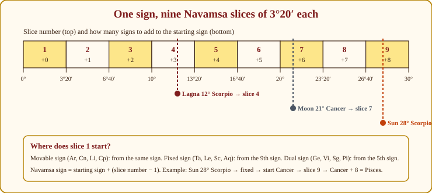
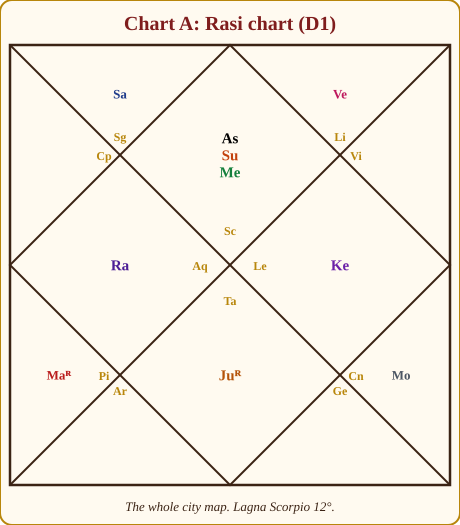
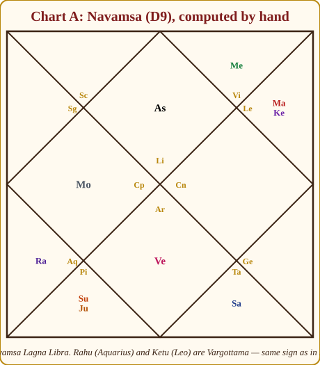
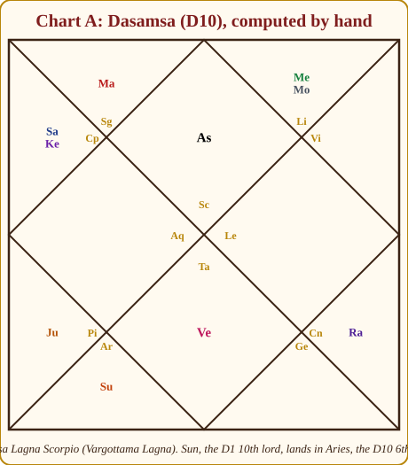

# Chapter 11: Divisional Charts (Vargas) — Zooming In

Open a map of Mumbai. At one glance you see the whole city — the sea, the railway lines, the airport, the rough shape of things. That is your birth chart (D1). Now suppose you want to find a particular flat in Bandra. The city map will not do; you zoom into the Bandra sheet, where every lane is drawn. That zoomed sheet is a **divisional chart** (*Varga*, "a division"). The Navamsa (D9) is the marriage district. The Dasamsa (D10) is the office district. The Saptamsa (D7) is the children's district.

Divisional charts are where beginners either fall in love with astrology or run away from it, because the arithmetic looks frightening and the software prints sixteen charts without saying which one to look at. This chapter fixes both problems. You will compute a Navamsa by hand — the whole of Meera's — so that the charts stop being magic, and you will learn which six to use and how to read them without losing the city for the lanes.

## Why one chart is not enough

The Rasi chart (D1) puts each planet in one of twelve signs. Twelve boxes for nine planets is a coarse grid. Two people born a day apart may have every planet in the same sign, yet one marries happily and the other struggles. Something finer must be at work.

The finer thing is *where inside the sign* a planet sits. A planet at 2° of Taurus and one at 28° of Taurus are both "in Taurus", but they behave differently.

> **📖 Story: The King's map room.** On the wall of the King's map room hangs one great map of the kingdom, cut into twelve districts — the Rasi chart. When a courtier is reported "in Taurus", the King knows roughly where he is. But the young Prince, Mercury, keeps sixteen smaller sheets in a drawer, one for each purpose: the marriage-district sheet, the office-district sheet, the children's-district sheet. On each sheet every district of the big map is cut into lanes — nine lanes on the marriage sheet, ten on the office sheet, seven on the children's sheet — and each lane is given a district name of its own. So the same courtier "in Taurus" may, on the marriage sheet, be standing in a lane called Pisces, and on the office sheet in a lane called Capricorn. The big map says which street; the sheet says which house on the street. **Rule:** a varga re-maps each sign by degree into slices, and each slice carries a sign of its own.

Cut each sign into 9 slices and you get the Navamsa; into 10, the Dasamsa; into 7, the Saptamsa. The planet's *degree* decides its slice; the slice's sign becomes the planet's sign in that chart.

> **🧭 Guruji's rule of thumb:** D1 is the body; the vargas are the organs. You can say a great deal about a person from the body alone. You can say nothing sensible about the liver without first knowing whose liver it is.

## The sixteen charts, and the six you actually use

Parashara lists sixteen divisional charts, the **Shodasavarga**. Appendix A.10 gives the main ones with their uses; here is the full list with my honest advice on each.

| Chart | Division | Primary use | Beginner's verdict |
|---|---|---|---|
| D1 Rasi | 30° | Everything; the body of the horoscope | 🟢 **Use always** |
| D2 Hora | 15° | Wealth | 🟢 Use, as a tint |
| D3 Drekkana | 10° | Siblings, courage, nature of death | 🟡 Later |
| D4 Chaturthamsa | 7°30′ | Property, fixed assets, fortune | 🟡 Later |
| D7 Saptamsa | 4°17′ | Children, progeny | 🟢 **Use** for children questions |
| D9 Navamsa | 3°20′ | Marriage, dharma, inner strength of planets | 🟢 **Use always** — the most important varga |
| D10 Dasamsa | 3° | Career, public life | 🟢 **Use** for career questions |
| D12 Dwadasamsa | 2°30′ | Parents, lineage | 🟡 Later |
| D16 Shodasamsa | 1°52′30″ | Vehicles, comforts | 🟡 Later |
| D20 Vimsamsa | 1°30′ | Spiritual life, worship | 🟡 Later |
| D24 Chaturvimsamsa | 1°15′ | Education, learning | 🟡 Later |
| D27 Bhamsa | 1°6′40″ | Strengths and weaknesses | 🟡 Later |
| D30 Trimsamsa | 1° | Misfortunes, character, disease | 🟡 Later |
| D40 Khavedamsa | 0°45′ | Auspicious and inauspicious effects (maternal line) | 🔴 Rarely |
| D45 Akshavedamsa | 0°40′ | General indications (paternal line) | 🔴 Rarely |
| D60 Shashtiamsa | 0°30′ | Past-life karma; used to separate twins | 🟡 **Know about it**; use with care |

Six for the beginner: **D1, D9, D10, D7, D2 and D60**. The first five are the ones a client's questions actually require (life, marriage, career, children, money); the sixth you need to *know about* because Parashara himself rates it highly and because it is the only tool that separates twins. Leave the rest until the six feel like old friends. A student who reads sixteen charts badly is worse off than one who reads two charts well.

> **💡 Did you know?** Parashara gives each of the sixteen vargas a weight when judging a planet's overall strength — D1 counts 3½ points, D9 counts 3, D60 counts 4, most others 1 or ½ (the *Vimsopaka* scheme, 20 points in all). The Shashtiamsa outranks even the Rasi chart in this scheme, which tells you how seriously the tradition took birth-time accuracy: a D60 changes every minute.

## How a varga is built: the idea of slices

Every divisional chart follows the same recipe:

1. Take the planet's **degree within its sign** (0° to 30°).
2. Divide by the slice width to find **which slice** it falls in (slice 1, 2, 3...).
3. Find the **starting sign** for that D1 sign (each varga has its own rule).
4. Count forward from the starting sign by (slice number − 1). That is the planet's varga sign.

Only step 3 changes from one varga to another. Learn the recipe once and every varga is the same job.

*Figure 11.1: One sign cut into nine Navamsa slices. Read the slice from the degree; then apply the starting-sign rule shown in the box. Meera's Lagna (12°), Moon (21°) and Sun (28°) are marked.*

## The Navamsa, computed by hand

*Nava* is nine, *amsa* is portion: nine portions of 3°20′ each. The slice boundaries are 0°, 3°20′, 6°40′, 10°, 13°20′, 16°40′, 20°, 23°20′, 26°40′ and 30°. A quick way to find the slice: divide the degree by 3⅓ (3.333...), drop the fraction, add one. So 28° ÷ 3.333 = 8.4 → slice 9; 21° ÷ 3.333 = 6.3 → slice 7; 12° ÷ 3.333 = 3.6 → slice 4.

The starting-sign rule (Appendix A.10):

- **Movable sign** (Aries, Cancer, Libra, Capricorn): start counting **from the sign itself**.
- **Fixed sign** (Taurus, Leo, Scorpio, Aquarius): start **from the 9th sign** from it.
- **Dual sign** (Gemini, Virgo, Sagittarius, Pisces): start **from the 5th sign** from it.

> **📖 Story: The three brothers of each element.** Every element has three sign-brothers: fire has Aries, Leo and Sagittarius; earth has Taurus, Virgo and Capricorn; and so on. The eldest brother is the movable sign, the middle one the fixed sign, the youngest the dual sign. When the King's surveyors come to number the nine lanes of a district, custom says the numbering always begins at the *eldest brother's* door. So in a movable district the surveyors start at the district's own gate. In a fixed district they walk to the eldest brother — who lives nine districts on — and start there. In a dual district the eldest brother is five districts on, and they start there. That is the whole rule, and it is why the nine lanes of Aries, Leo and Sagittarius all read Aries, Taurus, Gemini... in the same order: they were all numbered from the same door. **Rule:** movable signs count from themselves; fixed from the 9th; dual from the 5th.

This is also why Chapter 7 could tell you that each nakshatra pada *is* one Navamsa sign: 3°20′ is exactly one pada.

Now Meera. Three planets slowly, then the rest in a table.

**Sun, 28° Scorpio.** Scorpio is fixed, so we start from the 9th sign from Scorpio. Count: Scorpio 1, Sagittarius 2, Capricorn 3, Aquarius 4, Pisces 5, Aries 6, Taurus 7, Gemini 8, **Cancer 9**. Start at Cancer. The Sun is at 28°, in slice 9 (26°40′–30°). Count 9 signs from Cancer, Cancer itself being the first: Cancer, Leo, Virgo, Libra, Scorpio, Sagittarius, Capricorn, Aquarius, **Pisces**. Sun in Pisces in the Navamsa. (Shortcut: Cancer + 8 = Pisces.)

**Moon, 21° Cancer.** Cancer is movable, so start from Cancer itself. 21° is in slice 7 (20°–23°20′). Cancer + 6: Cancer, Leo, Virgo, Libra, Scorpio, Sagittarius, **Capricorn**. Moon in Capricorn.

**Lagna, 12° Scorpio.** Fixed; start from Cancer. 12° is in slice 4 (10°–13°20′). Cancer + 3 = **Libra**. So the **Navamsa Lagna is Libra**. Notice how close this is to the edge: at 13°20′ the Lagna would jump to Scorpio Navamsa. The Lagna moves roughly one degree every four minutes, so a birth time off by about five minutes would change Meera's Navamsa Lagna. Keep that in mind whenever a client is unsure of the birth time.

The whole chart:

| Planet | D1 position | Sign type | Start counting from | Slice | Navamsa sign |
|---|---|---|---|---|---|
| Lagna | 12° Scorpio | fixed | Cancer (9th) | 4 | **Libra** |
| Sun | 28° Scorpio | fixed | Cancer | 9 | Pisces |
| Mercury | 9° Scorpio | fixed | Cancer | 3 | Virgo |
| Venus | 22° Libra | movable | Libra (itself) | 7 | Aries |
| Mars | 4° Pisces | dual | Cancer (5th) | 2 | Leo |
| Jupiter | 8° Taurus | fixed | Capricorn (9th) | 3 | Pisces |
| Saturn | 5° Sagittarius | dual | Aries (5th) | 2 | Taurus |
| Rahu | 16° Aquarius | fixed | Libra (9th) | 5 | Aquarius |
| Ketu | 16° Leo | fixed | Aries (9th) | 5 | Leo |
| Moon | 21° Cancer | movable | Cancer | 7 | Capricorn |

Check a few yourself with a pencil. Venus: 22° ÷ 3.333 = 6.6 → slice 7; Libra + 6 = Aries. Jupiter: 8° → slice 3; Taurus is fixed, 9th from Taurus is Capricorn; Capricorn + 2 = Pisces. Rahu: 16° → slice 5; 9th from Aquarius is Libra; Libra + 4 = Aquarius — the same sign it started in. Notice Rahu and Ketu, always opposite in D1, stay opposite in D9 (Aquarius and Leo), because both sit at the same degree of fixed signs.

Now place the planets in houses from the Navamsa Lagna, Libra. Libra is the 1st; Scorpio the 2nd; Sagittarius the 3rd; Capricorn the 4th (Moon); Aquarius the 5th (Rahu); Pisces the 6th (Sun, Jupiter); Aries the 7th (Venus); Taurus the 8th (Saturn); Gemini the 9th; Cancer the 10th; Leo the 11th (Mars, Ketu); Virgo the 12th (Mercury).

*Figure 11.2: Chart A, the Rasi chart (D1). The whole city.*

*Figure 11.3: Chart A, the Navamsa (D9) we just computed. Navamsa Lagna Libra; Sun and Jupiter in Pisces; Venus in Aries; Rahu and Ketu Vargottama.*

> **⚠️ Common beginner mistake:** Expecting a varga to obey the astronomy of D1. In D1, Mercury is never more than a sign from the Sun. In D9, Meera's Sun is in Pisces and Mercury in Virgo — opposite each other. That is normal: the vargas are mathematical re-mappings, not sky pictures. Only Rahu and Ketu keep their opposition, and only when they sit at the same degree.

## Vargottama: the planet that stays home

When a planet occupies the **same sign in D1 and in D9**, it is **Vargottama** ("best of the divisions"). The outer costume and the inner nature agree; such a planet behaves with unusual consistency and strength, close to being in its own sign. It happens for planets in the first Navamsa of a movable sign, the fifth of a fixed sign, or the ninth of a dual sign.

In Chart A, **Rahu (Aquarius) and Ketu (Leo) are Vargottama** — both at 16°, the fifth slice of fixed signs. Meera's Rahu in the 4th (home, mother, foreign lands, unconventional education) and Ketu in the 10th (a detached, service-minded approach to career) are therefore *strong* themes, not background noise. Software marks Vargottama planets; look for the label.

A Vargottama **Lagna** is a special blessing — the person is exactly what they appear to be. Meera's Lagna is Scorpio in D1 and Libra in D9, so not Vargottama; but jump ahead to the Dasamsa and you will find her Lagna returns to Scorpio there. Some teachers extend the word Vargottama to any varga; strictly it belongs to D9.

## How to read the Navamsa

The Navamsa answers two questions: *how strong is each planet really*, and *what is the marriage like*. Read it in four steps, always with the D1 open beside it.

**Step 1: The dignity of each D1 planet in D9.** A planet may look grand in D1 and be a beggar in D9, or the reverse. The classic warning is the **"hollow" planet: exalted in D1, debilitated in D9** — a promise the person cannot keep. The reverse — weak in D1, strong in D9 — is the quiet planet that delivers more than anyone expected.

Meera's planets, D1 against D9 (friendships from Appendix A.3):

| Planet | D1 sign and dignity | D9 sign and dignity | Reading |
|---|---|---|---|
| Sun | Scorpio — friend's (Mars) 🟢 | Pisces — friend's (Jupiter) 🟢 | Steady inside and out |
| Moon | Cancer — own 🟢 | Capricorn — neutral (Saturn) 🟡 | Warm outside, disciplined within |
| Mars | Pisces — friend's 🟢 | Leo — friend's 🟢 | Consistent |
| Mercury | Scorpio — neutral 🟡 | Virgo — own and exaltation 🟢 | Hidden depth of intellect |
| Jupiter | Taurus — enemy's, retrograde 🔴 | Pisces — own 🟢 | Tired outside, at home within |
| Venus | Libra — own 🟢 | Aries — neutral 🟡 | Comfortable, a little impatient inside |
| Saturn | Sagittarius — neutral, combust 🔴 | Taurus — friend's 🟢 | Weak outside, steadier within |

The Jupiter line matters most. In Chapter 10 I called Jupiter a "tired player" in the Sun–Jupiter Raja yoga. The Navamsa says the tiredness is on the surface; underneath, Jupiter is at home.

> **📖 Story: The Priest in borrowed robes.** On the big map the Royal Priest, Jupiter, is lodged in Taurus, the district of the Minister of Pleasure — his old rival — and he is walking backwards besides. Visitors see a tired, out-of-place priest and lower their expectations. But open the marriage-district sheet and there he is in Pisces, his own house, in his own robes, entirely himself. Which is the real Priest? Both. The Taurus lodging is what the world sees first; the Pisces home is what the family lives with. So I now describe Meera's Raja yoga as "slow to show but solid within" — a better prediction than the D1 alone gave. The opposite case is the courtier grand on the big map and shabby on the sheet — the **hollow planet**, exalted in D1 and debilitated in D9. **Rule:** a planet's D9 dignity shows its inner strength; D1 grand and D9 fallen is hollow, D1 weak and D9 strong is quietly reliable.

No planet of Meera's is debilitated in either chart. Nothing hollow here.

**Step 2: The D9 Lagna and its lord.** The Navamsa Lagna describes the inner person — the one the spouse meets at home. Libra: balance, fairness, an eye for beauty, a need for partnership. Its lord Venus sits in the **7th house of the Navamsa**, in Aries. The inner self is oriented towards the other person. For a consultant who spends her life across a table from people, that fits.

**Step 3: The 7th house of the Navamsa — the spouse.** Aries, a Mars sign, with Venus in it. The partner is energetic, independent, direct, possibly in a Martian or technical field; Venus there makes the relationship itself attractive and central. The 7th lord of the D9, Mars, sits in the D9 11th with Ketu — the marriage brings gains and a wide circle, with a detached, philosophical streak in the partner. Read this together with the D1 7th (Jupiter in Taurus: a learned, steady, somewhat conservative partner) and a fuller picture appears than either chart gives alone.

**Step 4: Venus and Jupiter in D9.** For any chart, Venus in D9 shows the *quality of love and comfort in marriage*; Jupiter in a woman's chart shows the husband, Venus in a man's chart the wife (Appendix A.2). Meera's Venus in Aries D9 is neutral — passionate, a little impatient, sincere. Her **Jupiter in Pisces, its own sign, in the D9 6th house**: the husband is a person of good character and learning (own sign), but the 6th placement says the marriage carries duty, service, health concerns or hard work — the couple builds rather than inherits. That is an honest, useful sentence for a consultation; note it does not say "trouble".

> **🪔 Consultation tip:** Never predict from the Navamsa alone. I have watched students announce a difficult marriage from a D9 7th house while the D1 7th held an exalted Jupiter — and frighten a bride for nothing. The order is always: D1 first, then D9 to confirm, deepen or soften. When they agree, speak with confidence. When they disagree, say "a rough start that settles" or "a smooth start that needs work" — that disagreement *is* the reading.

## The Dasamsa (D10): career under the microscope

*Dasa* is ten: ten slices of 3° each. Slice = degree ÷ 3, drop the fraction, add one. The starting rule: **odd signs (Aries, Gemini, Leo, Libra, Sagittarius, Aquarius) count from the sign itself; even signs (Taurus, Cancer, Virgo, Scorpio, Capricorn, Pisces) count from the 9th sign from it.**

**Sun, 28° Scorpio.** 28 ÷ 3 = 9.33 → slice 10. Scorpio is even, so start from the 9th from Scorpio: Cancer. Cancer + 9 = **Aries**. Sun in Aries in the Dasamsa — its exaltation sign.

The whole chart:

| Planet | D1 position | Odd/even | Start from | Slice | Dasamsa sign |
|---|---|---|---|---|---|
| Lagna | 12° Scorpio | even | Cancer | 5 | **Scorpio** |
| Sun | 28° Scorpio | even | Cancer | 10 | Aries |
| Mercury | 9° Scorpio | even | Cancer | 4 | Libra |
| Venus | 22° Libra | odd | Libra | 8 | Taurus |
| Mars | 4° Pisces | even | Scorpio | 2 | Sagittarius |
| Jupiter | 8° Taurus | even | Capricorn | 3 | Pisces |
| Saturn | 5° Sagittarius | odd | Sagittarius | 2 | Capricorn |
| Rahu | 16° Aquarius | odd | Aquarius | 6 | Cancer |
| Ketu | 16° Leo | odd | Leo | 6 | Capricorn |
| Moon | 21° Cancer | even | Pisces | 8 | Libra |

Houses from the Dasamsa Lagna, Scorpio: Sagittarius 2nd (Mars); Capricorn 3rd (Saturn, Ketu); Pisces 5th (Jupiter); Aries 6th (Sun); Taurus 7th (Venus); Cancer 9th (Rahu); Libra 12th (Mercury, Moon).

*Figure 11.4: Chart A, the Dasamsa (D10). The Lagna returns to Scorpio; the Sun, D1's 10th lord, lands exalted in Aries in the D10 6th house; Venus sits in its own sign in the D10 7th.*

How to read a Dasamsa — three things, then the kendras:

1. **The D1 10th lord's position in D10.** Meera's 10th lord is the Sun. In D10 it is **exalted in Aries** — a career with authority and initiative — but in the **6th house** of the D10: service, institutions, competition, the helping professions. Put together: a leader *within* an institution or a service field, not an entrepreneur. Teaching in a college, consulting within a practice, fits exactly.
2. **The D10 Lagna and its lord.** Scorpio again — her working self and her inner self are the same person, a strong sign of integrity in work. Its lord Mars sits in the **D10 2nd house in Sagittarius**: livelihood through speech, teaching, knowledge (Sagittarius is Jupiter's sign of wisdom). This is the single clearest line in her career picture.
3. **The D10 10th house and its lord.** Leo, empty; its lord the Sun is in the 6th as above — the same message twice.

Then the **planets in D10 kendras**: only Venus, in the 7th, in its own sign Taurus. Career through partnerships, one-to-one work, counsel, comfort-giving — a consultant, again. Jupiter in the D10 5th in its own sign Pisces: students, advice, wisdom as work. Mercury and the Moon in the D10 12th: part of the work happens behind the scenes, in writing, in solitude, or connected with distant places. The D1 said "teacher and consultant"; the D10 says "teacher and consultant, inside an institution, through personal counsel and writing, with real authority". That is what zooming in buys you.

## The Saptamsa (D7): children

*Sapta* is seven: seven slices of 4°17′ each (30 ÷ 7 = 4.2857°). Slice = degree ÷ 4.2857, drop the fraction, add one. Starting rule: **odd signs count from the sign itself; even signs from the 7th sign from it.**

One example, the planet that matters most for children: Jupiter, Meera's 5th lord and the natural significator of progeny. **Jupiter, 8° Taurus.** 8 ÷ 4.2857 = 1.87 → slice 2. Taurus is even, so start from the 7th from Taurus: Scorpio. Scorpio + 1 = **Sagittarius**. Jupiter in its own sign in the Saptamsa — a healthy signal for children, and a good place to begin the D7 reading in Chapter 21. (For practice: the Moon, 21° Cancer → slice 5; Cancer is even, start from Capricorn; Capricorn + 4 = Taurus.) In the D7 you read the D7 Lagna, its 5th house and lord, and Jupiter, exactly as you would read the 5th house of D1.

## The Hora (D2): wealth in two halves

The simplest varga. Each sign is cut in two: the first 15° and the last 15°. In **odd signs** the first half belongs to the **Sun** and the second to the **Moon**; in **even signs** it is reversed — the first half is the Moon's, the second the Sun's. Every planet therefore falls into either the Sun's hora or the Moon's hora; there are no other signs in this chart.

Meera: Sun 28° Scorpio (even, second half) → Sun's hora. Moon 21° Cancer (even, second half) → Sun's hora. Saturn 5° Sagittarius (odd, first half) → Sun's hora. Mercury 9° Scorpio, Mars 4° Pisces and Jupiter 8° Taurus (even, first half) → Moon's hora. Venus 22° Libra (odd, second half) → Moon's hora. Four of the seven planets in the Moon's hora, three in the Sun's. The traditional reading: planets in the Moon's hora bring wealth that accumulates steadily and gently; planets in the Sun's hora bring wealth through effort, authority and struggle. Meera's mix leans gentle. Chapter 18 uses this as a tint on the money reading — a tint, never a verdict.

## The Dwadasamsa (D12) and the Shashtiamsa (D60), briefly

**D12**: twelve slices of 2°30′, counted **from the sign itself** for every sign. Sun 28° Scorpio → 28 ÷ 2.5 = 11.2 → slice 12; Scorpio + 11 = Libra. Moon 21° Cancer → slice 9; Cancer + 8 = Pisces. The D12 is read for parents and lineage: the Sun for the father, the Moon for the mother, plus the D12 9th and 4th houses.

**D60**: sixty slices of 0°30′ each. The rule, sketched: double the degree (with its minutes) to get a number from 0 to 59, take the remainder after dividing by 12, and count that many signs forward from the planet's own sign. Sun 28° Scorpio → 56 → remainder 8 → Scorpio + 8 = Cancer. Each of the sixty slices also carries a name and a deity (benefic or malefic), and it is those names that the classical texts read. Parashara weights the D60 heavily; the tradition reads it for past-life karma and for the residue that D1 cannot explain. Because half a degree of Lagna passes in about two minutes, the D60 is the chart that separates **twins**, and also the chart most ruined by an inaccurate birth time.

> **📖 Story: The twins and the old Judge's ledger.** Two babies are born four minutes apart. On the great map they are identical: same Lagna, same districts for every courtier. Even the marriage and office sheets agree. The family comes to the old Judge of Labour, Saturn, who keeps the finest ledger in the kingdom — sixty lines to every district, one for each half-degree. Only in his book do the twins part: the elder's Lagna falls on a line ruled by a kindly deity, the younger's on the next line, ruled by a harsh one. "Here," says the Judge, "is the debt each brought with him." But the Judge is strict about one thing: if the family cannot tell him the birth minute, he closes the ledger. **Rule:** the D60 separates twins and reads past-life residue, but only with a reliable, rectified birth time.

## Karakamsa: a pointer to Jaimini

One paragraph, so you recognise the word. In the Jaimini system (Chapter 15), the planet with the **highest degree** in any sign is the **Atmakaraka**, the soul's significator. The sign that planet occupies **in the Navamsa** is the **Karakamsa**, and Jaimini reads the soul's direction from it the way Parashara reads the person from the Lagna. Meera's highest-degree planet is the Sun at 28°; its Navamsa sign, as we computed, is Pisces. Her Karakamsa is Pisces — Jupiter's sign of dharma, healing and teaching. Chapter 15 will show what to do with that. For now, simply notice that the Navamsa you have just built by hand is the doorway to a whole second system.

## In one breath

- A divisional chart (varga) cuts each sign into slices and gives each slice its own sign; the planet's degree decides its slice. D1 is the city map, the vargas are the district sheets.
- Sixteen vargas exist; a beginner uses six — D1, D9, D10, D7, D2, and knows about D60.
- Every varga follows one recipe: find the slice from the degree, find the starting sign by that varga's rule, count forward.
- Navamsa (D9): nine slices of 3°20′; movable signs count from themselves, fixed from the 9th, dual from the 5th. Meera's Navamsa Lagna is Libra; her Sun is in Pisces, her Moon in Capricorn.
- Vargottama = same sign in D1 and D9; unusually consistent strength. Meera's Rahu and Ketu are Vargottama.
- Read D9 in four steps: dignity of planets (beware the hollow planet), the D9 Lagna and lord, the D9 7th house, Venus and Jupiter. Always with D1 open.
- Dasamsa (D10): ten slices of 3°; odd signs from themselves, even from the 9th. Read the D1 10th lord's place in D10, the D10 Lagna and lord, planets in D10 kendras.
- D7 (children): odd from itself, even from the 7th. D2 (wealth): Sun's and Moon's halves. D12 (parents): from the sign itself. D60: past-life karma and twins; needs an exact birth time.

## Practice

> **✍️ Practice:**
> 1. Compute the Navamsa sign of Arjun's Venus (Chart B), 24° Capricorn. Then his Moon, 6° Taurus.
> 2. Devika's Jupiter (Chart C) is at 26° Cancer. Find its Navamsa sign. Is it Vargottama? What does that add to the Hamsa yoga of Chapter 10?
> 3. Compute the Dasamsa sign of Arjun's Mars, 21° Leo (his yogakaraka and 10th lord).
> 4. Devika's Saturn is at 18° Leo. Which hora does it fall in? Which Saptamsa sign?
> 5. A client's Jupiter is exalted in Cancer in D1 but falls in Capricorn in D9. In one sentence, what do you tell yourself before you say anything to the client?

Answers

1. Venus 24° Capricorn: 24 ÷ 3.333 = 7.2 → slice 8. Capricorn is movable, count from itself: Capricorn + 7 = **Leo**. Moon 6° Taurus: slice 2 (3°20′–6°40′). Taurus is fixed, start from the 9th from Taurus = Capricorn; Capricorn + 1 = **Aquarius**.
2. 26° Cancer: 26 ÷ 3.333 = 7.8 → slice 8. Cancer is movable, count from itself: Cancer + 7 = **Aquarius**. Not Vargottama (that would need Cancer in both). Jupiter in Aquarius, Saturn's sign, is neutral for Jupiter — so the Hamsa yoga is real on the surface but its inner strength is ordinary: respected wisdom, expressed through unconventional or humanitarian channels rather than through traditional authority.
3. Mars 21° Leo: 21 ÷ 3 = 7 exactly → 7.0, drop the fraction → slice 8 (21° is the start of the 8th slice, 21°–24°). Leo is odd, count from itself: Leo + 7 = **Pisces**. Mars in Pisces in D10 — a friend's sign; career energy directed to service, healing or the water-related and institutional fields.
4. Saturn 18° Leo: Leo is odd; 18° is in the second half → **Moon's hora**. Saptamsa: 18 ÷ 4.2857 = 4.2 → slice 5; Leo is odd, count from itself: Leo + 4 = **Sagittarius**.
5. "This is a hollow Jupiter — the promise is louder than the delivery — so I will look for what supports it (dasha, aspects, D1 house) before I speak, and I will phrase Jupiter's gifts as things that need the person's effort to come true."

