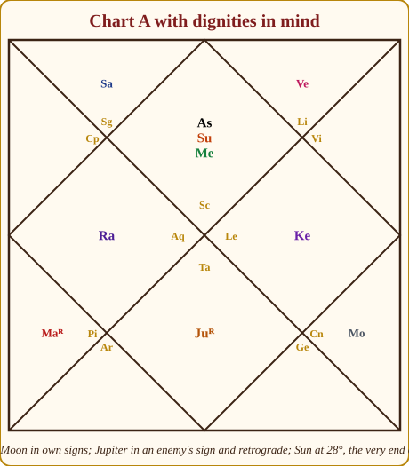
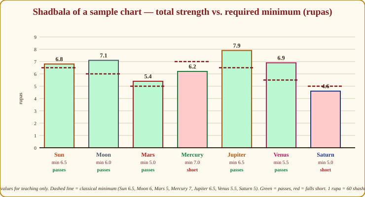
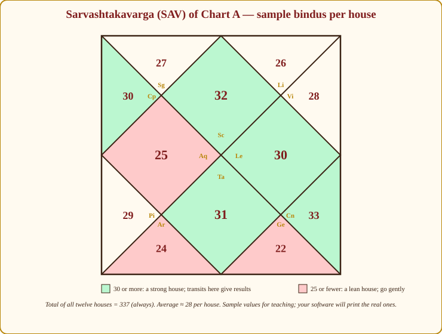
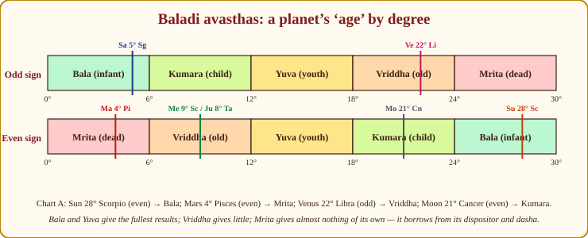

# Chapter 12: How Strong Is That Planet? Shadbala, Ashtakavarga and Avasthas

A friend once showed me her chart with Jupiter in the 2nd house and asked why, with "Jupiter in the house of wealth", she was always short of money. I looked. Jupiter was in Capricorn, its sign of debilitation, eight degrees from the Sun, in the last degrees of the sign, aspected by Saturn. It was Jupiter in name only: a minister with a title and no budget. The house was right; the planet was too weak to fill it.

This is the lesson of the chapter. Every promise a chart makes is made by a *planet*, and a planet keeps its promises only in proportion to its strength. The tradition measures strength in several ways, from a two-minute glance to a page of arithmetic. I will give you the glance first (it is what I actually use), and then the arithmetic, explained so that you can read what your software prints without fear.

## Why strength matters

Two rules, and they are not symmetrical:

- **A weak benefic promises and cannot deliver.** Jupiter in the 5th house *promises* children, wisdom, students; a weak Jupiter gives the longing and the delay.
- **A strong malefic delivers pain, but also results.** A strong Saturn in the 10th gives a hard, slow career with real authority at the end. A weak Saturn in the 10th gives the delays without the authority.

So strength is not the same as goodness. A strong planet is a planet that *does things*. Whether the things are pleasant is the business of Chapters 8 and 10; whether they happen at all is the business of this chapter.

> **🔍 Why?** System grammar. In Parashara's scheme a planet gives the results of the houses it owns and occupies *in proportion to its strength*; nature (benefic or malefic) decides the flavour, strength decides the quantity. A weak benefic is a kind relative with no money; a strong malefic is a strict one who actually pays the school fees. Everyday parallel: a generous uncle who is broke versus a stern uncle who is rich. You know which one funds the wedding.

> **📖 Story: How strong is the soldier?** The Commander, Mars, inspects a new recruit and asks seven quick questions before he trusts him with a post. Is he in his own regiment's uniform, or a borrowed one that fits badly? (Dignity.) Has he a fever from standing too long in the sun? (Combustion.) Is he marching backwards, which in this army means he is doubling his effort, though he looks odd? (Retrogression.) Has he been posted at a pillar of the fort or in the back rooms? (House.) Who is watching him, the Priest and the Minister of Arts, or the old Judge and the Stranger? (Aspects.) Does he carry the same colours on the district sheet as on the great map? (Vargottama.) And is he standing at the gate where his own kind fight best? (Directional strength.) Seven questions, two minutes, and the Commander knows what the man can carry. **Rule:** judge a planet by dignity, combustion, retrogression, house, aspects, Vargottama and directional strength, in that order.

## The consultant's hierarchy: seven checks in two minutes

Here is the glance, in the order I run it. Each item is something you already know from earlier chapters; the skill is running them together.

1. **Dignity**: the planet's relationship to the sign it occupies (Appendix A.2 and A.3): exalted 🟢🟢, in its moolatrikona 🟢, in its own sign 🟢, in a friend's sign 🟢, in a neutral's sign 🟡, in an enemy's sign 🔴, debilitated 🔴🔴. Check Neecha Bhanga (Chapter 10) before you write off a debilitated planet.
2. **Combustion**: within the Sun's orb (Appendix A.2: Moon 12°, Mars 17°, Mercury 14°, Jupiter 11°, Venus 10°, Saturn 15°) 🔴. A combust planet still *exists* but its own agenda is burnt; it serves the Sun's agenda.
3. **Retrogression**: a retrograde planet is counted *strong* in the strength calculations (it is closest to Earth and brightest), but its results are often delayed, internalised or unconventional 🟡. Teachers disagree on whether retrogression is a blessing; I treat it as intensity with a twist.
4. **House position**: kendra (1, 4, 7, 10) and trikona (5, 9) 🟢; upachaya (3, 6, 10, 11) 🟡 for malefics, improving with age; dusthana (6, 8, 12) 🔴 for the planet's own agenda.
5. **Aspects received**: from Jupiter, Venus, a waxing Moon, an unafflicted Mercury 🟢; from Saturn, Mars, Rahu, Ketu, the Sun 🔴 (Chapter 6).
6. **Vargottama**: same sign in D1 and D9 (Chapter 11) 🟢.
7. **Directional strength** (*Dig Bala*, Appendix A.2): Jupiter and Mercury in the 1st, Moon and Venus in the 4th, Saturn in the 7th, Sun and Mars in the 10th 🟢; the opposite house gives none 🔴.

> **🔍 Why is combustion checked by degree, not by sign?** Astronomy. Combustion is a planet lost in the Sun's glare, and glare does not stop at a sign boundary; it is a matter of angular distance in the sky. A planet at 28° Scorpio and one at 5° Sagittarius are seven degrees apart whatever their signs say. That is also why each planet has its own orb: the brighter the planet, the closer it can stand to the Sun and still be seen (Venus 10°, Saturn 15°). Everyday parallel: a new employee seated beside a loud manager. It does not matter whether their desks are in the same room or across a doorway; if he is within earshot, nobody hears him.

> **📖 Story: Each officer's best gate.** The haveli has four gates and each officer fights best at his own. At dawn the east gate, the 1st house, belongs to the Royal Priest and the young Prince: wisdom and wit are sharpest in the morning, so Jupiter and Mercury take the front door. The inner courtyard at midnight, the 4th, is the Queen Mother's and the Minister of Pleasure's: comfort, feeling and beauty rule the night, so the Moon and Venus are strongest there. The western gate at dusk, the 7th, is where the old Judge stands: Saturn, patient and unhurried, guards the door that others tire of. And the roof at noon, the 10th, belongs to the King and his Commander: the Sun and Mars blaze where everyone can see them. Post an officer at the gate opposite his own and he fights at half strength. **Rule:** Dig Bala: Jupiter and Mercury in the 1st; Moon and Venus in the 4th; Saturn in the 7th; Sun and Mars in the 10th.

Now run the glance on Chart A.

*Figure 12.1: Chart A. Venus (Libra) and the Moon (Cancer) sit in their own signs; Jupiter is retrograde in Taurus, an enemy's sign; the Sun is at 28° Scorpio, the sign's last degrees; Saturn at 5° Sagittarius is only 7° from the Sun.*

| Planet | Dignity | Combust? | Retro? | House | Aspects received | Dig Bala | Quick verdict |
|---|---|---|---|---|---|---|---|
| Sun | Scorpio, friend's sign 🟢 (but 28°, sign's edge 🟡) | no | no | 1st 🟢 | Jupiter 🟢 | middling 🟡 | Strong but unsettled 🟢 |
| Moon | Cancer, own 🟢 | no (127° from Sun) | no | 9th 🟢 | none | middling 🟡 | Strong 🟢 |
| Mars | Pisces, friend's 🟢 | no | yes 🟡 | 5th 🟢 | none | middling 🟡 | Adequate 🟡 |
| Mercury | Scorpio, neutral 🟡 | no (19° from Sun) | no | 1st 🟢 | Jupiter 🟢 | **full** 🟢 | Strong 🟢 |
| Jupiter | Taurus, enemy's 🔴 | no | yes 🟡 | 7th kendra 🟢 | Sun 🔴, Mercury 🟢 | **none** (opposite its 1st) 🔴 | Weak outside, strong in D9 🟡 |
| Venus | Libra, own 🟢 | no (36° from Sun) | no | 12th 🔴 | Mars 🔴 (its 8th aspect) | middling 🟡 | Dignified but private 🟡 |
| Saturn | Sagittarius, neutral 🟡 | **yes, 7° from Sun** 🔴 | no | 2nd 🟡 | none | middling 🟡 | Weak 🔴 |

Three things this table taught me that the chart alone did not. First, **Saturn is combust**. I missed this for a whole year in my own early notes on this chart, because Saturn and the Sun are in different signs; the orb does not care about sign boundaries. Saturn is Meera's 3rd and 4th lord: courage and the home both run on a burnt engine, and her Sade Sati years (Chapter 14) would have felt heavier than the textbook says. Second, **Mercury has full directional strength** in the 1st, which is why her Budha-Aditya yoga speaks so clearly. Third, **Jupiter has zero Dig Bala** in the 7th, which adds to its D1 weakness; and yet the Navamsa (Chapter 11) puts it in its own sign. That is a planet to describe as "underrated": it will do more than it appears able to, mostly in the Jupiter periods.

> **⚠️ Common beginner mistake:** Checking combustion by sign instead of by degree. Meera's Sun is at 28° Scorpio and her Saturn at 5° Sagittarius: different signs, seven degrees apart, well inside Saturn's 15° orb. Always subtract the longitudes.

## Shadbala: the six strengths, explained conceptually

*Shad* is six, *bala* is strength. **Shadbala** is Parashara's full arithmetic of planetary strength, computed for the seven planets (not Rahu and Ketu) and expressed in **rupas**; one rupa equals 60 *shashtiamsas*, the small units in which the tables are written. Nobody computes it by hand any more; every serious program prints it. What you must know is what the six numbers *mean*, so that you can read the printout intelligently.

| Strength | Sanskrit | What it measures | Where it comes from |
|---|---|---|---|
| Positional | **Sthana Bala** | How comfortably the planet is placed | Exaltation distance, its dignity in seven vargas, odd/even sign, the *drekkana* (which third of the sign), kendra/panapara/apoklima position |
| Directional | **Dig Bala** | Whether it is at its best gate | Distance from the house of its full strength (see the story above) |
| Temporal | **Kala Bala** | Whether the *time* of birth favours it | Day or night birth (Moon, Mars, Saturn love the night; Sun, Jupiter, Venus the day; Mercury both), bright or dark fortnight (*paksha*), and the lords of the year, month, weekday and hour of birth |
| Motional | **Chesta Bala** | How vigorously it is moving | Retrograde and slow planets score high; planets racing ahead near the Sun score low (the Sun and Moon have their own rules) |
| Natural | **Naisargika Bala** | Its built-in brightness | Fixed for ever: Sun > Moon > Venus > Jupiter > Mercury > Mars > Saturn (60, 51.4, 42.9, 34.3, 25.7, 17.1, 8.6 shashtiamsas) |
| Aspectual | **Drik Bala** | Who is looking at it | Benefic aspects add, malefic aspects subtract, using the partial aspects of Appendix A.4 |

> **🔍 Why these six, and not some other list?** Each answers one plain question about a person's capacity, and the six together cover everything that can make a planet effective. *Where do you stand?* (positional: the sign and house are the planet's posting). *Is this the hour you are naturally strong?* (directional: the gate where your kind fights best). *Does the season suit you?* (temporal: a night planet born at night, a bright-fortnight planet born in the bright fortnight, the day and hour ruled by a friend). *How hard are you moving?* (motional: astronomy again, a retrograde planet is at its closest to Earth and its brightest, so it counts as vigorous). *How bright are you by nature?* (natural: the fixed order of apparent brightness, Sun first, Saturn last). *Who supports you?* (aspectual: the friends and enemies looking at you). Parashara lays these out in the Shadbala chapter of *Brihat Parashara Hora Shastra* as separate quantities to be added, which is why they are additive rather than multiplied. Everyday parallel: judging a candidate for a job by posting, shift, season, energy, natural talent and references. Leave any one out and you have missed something real.

The six are added, and the total is compared with a **minimum** that each planet needs to be considered strong enough to deliver:

| Planet | Required minimum (rupas) | In shashtiamsas |
|---|---|---|
| Sun | 6.5 | 390 |
| Moon | 6.0 | 360 |
| Mars | 5.0 | 300 |
| Mercury | 7.0 | 420 |
| Jupiter | 6.5 | 390 |
| Venus | 5.5 | 330 |
| Saturn | 5.0 | 300 |

Notice that Mercury needs the most and Mars and Saturn the least: the gentle planets must be strong to do good; the harsh ones do their work even when tired. A planet above its minimum is "strong" 🟢; between about 80 and 100 per cent of it, "adequate" 🟡; below that, "weak" 🔴.

> **💡 Did you know?** The word *rupa* means "form" or "coin", the same root as *rupee*. When Parashara says a planet has "seven rupas", he is literally counting its wealth. The *shashtiamsa*, one-sixtieth, is the same unit the D60 chart is named after: the tradition liked sixties as much as the Babylonians did.

## How to read a Shadbala table from software

Open Jagannatha Hora or any serious program and you will see a table like this (the values below are for a *sample chart*, invented for teaching; they are not Meera's):

| Planet | Sthana | Dig | Kala | Chesta | Naisargika | Drik | **Total (rupas)** | Required | Ratio | Verdict |
|---|---|---|---|---|---|---|---|---|---|---|
| Sun | 2.40 | 0.90 | 1.60 | 0.70 | 1.00 | 0.20 | **6.80** | 6.5 | 1.05 | 🟢 |
| Moon | 2.60 | 0.80 | 2.10 | 0.90 | 0.86 | −0.16 | **7.10** | 6.0 | 1.18 | 🟢 |
| Mars | 1.80 | 0.60 | 1.30 | 1.10 | 0.29 | 0.31 | **5.40** | 5.0 | 1.08 | 🟢 |
| Mercury | 2.20 | 1.00 | 1.40 | 1.00 | 0.43 | 0.17 | **6.20** | 7.0 | 0.89 | 🟡 |
| Jupiter | 2.90 | 0.30 | 1.50 | 1.70 | 0.57 | 0.93 | **7.90** | 6.5 | 1.22 | 🟢 |
| Venus | 2.50 | 1.10 | 1.60 | 0.80 | 0.71 | 0.19 | **6.90** | 5.5 | 1.25 | 🟢 |
| Saturn | 1.50 | 1.20 | 1.00 | 0.90 | 0.14 | −0.14 | **4.60** | 5.0 | 0.92 | 🟡 |

*Figure 12.2: The same sample table as bars. Green bars clear the dashed minimum; red bars fall short. Software draws this for you; your job is to read the ratio column.*

How I read such a table, in order:

1. **The ratio column first.** Anything above 1.0 is strong; 0.8–1.0 adequate; below 0.8 weak. In the sample, Jupiter and Venus lead; Mercury and Saturn fall short.
2. **Then the rank order.** The strongest planet's dasha (Chapter 13) tends to be the best of the life; the weakest planet's dasha the most testing. Chapter 13 will show you why this matters more than any single yoga.
3. **Then the weak component.** A low Sthana with a high total means a planet in a poor sign that is rescued by time and aspects; a low Drik means enemies are watching it. Look at *why* it is weak before you speak.
4. **Do not over-trust decimals.** Two programs can differ by half a rupa depending on options (which vargas, which ayanamsa, day-length method). Shadbala tells you *strong, adequate, weak*, not "6.83 versus 6.79".

> **🪔 Consultation tip:** Never read a Shadbala number aloud to a client. "Your Saturn has 4.6 rupas" means nothing to anyone and sounds like a verdict. Translate: "Saturn is the planet in your chart that has to work hardest for its results, so Saturn's periods ask for patience." The number is for you; the sentence is for them.

## Ashtakavarga: votes from eight neighbours

Shadbala measures a planet. **Ashtakavarga** ("the eight-fold division") measures *signs*: it tells you how much support each sign in a chart has, which turns out to be the best tool the tradition has for judging transits and for deciding which houses can bear weight.

> **📖 Story: Votes from eight neighbours.** A new well is to be dug in one of the twelve districts, and the King asks each of eight voters, the seven planets and the Lagna, to say which districts they favour. Each voter has a fixed list: the King himself, standing in his own district, approves of certain districts counted from where he stands (the 1st, 2nd, 4th, 7th, 8th, 9th, 10th and 11th from himself) and disapproves of the rest. Every voter has a different list and votes from a different standing place. When the votes are counted, each district has between 0 and 8 dots (*bindus*) from each voter, and a total; the district that all eight favoured is where the well is dug first. A district with many dots can bear a heavy visitor; a district with few dots cracks under him. **Rule:** each of the seven planets and the Lagna gives or withholds a dot for every sign; the totals show which signs (houses) can carry weight.

> **🔍 Why count from all seven planets and the Lagna?** System grammar: a sign's condition depends on *everyone* in the chart, not on one planet, and the Lagna is the ninth "planet" because it is the person. Each contributor votes from its own position, so the same sign is judged from eight standpoints at once, which is why Ashtakavarga captures things that no single placement shows. Rahu and Ketu do not vote because they have no body and no fixed benefic places in the classical tables. Everyday parallel: a WhatsApp family group deciding where to hold the wedding. Every relative votes from where they live; the venue that suits most of them is the one that works.

Here is the machinery in plain terms. For each of the seven planets, Parashara gives a table of "benefic places": counted from each of the eight contributors (the seven planets and the Lagna), certain houses are favourable to that planet. Each favourable house earns one **bindu** (dot); each unfavourable house earns a **rekha** (line, that is, zero). Add the dots that a given planet receives in a given sign from all eight contributors and you get a number from 0 to 8: that is the planet's **Bhinnashtakavarga** (individual Ashtakavarga) score for that sign. Add all seven planets' scores for a sign and you get the sign's **Sarvashtakavarga** (SAV, total Ashtakavarga) score.

Three numbers to memorise:

- The seven Bhinnashtakavarga tables give fixed totals across the zodiac: Sun 48, Moon 49, Mars 39, Mercury 54, Jupiter 56, Venus 52, Saturn 39, and 48 + 49 + 39 + 54 + 56 + 52 + 39 = **337**. The SAV of every chart ever cast adds up to 337.
- 337 ÷ 12 ≈ **28**: the average SAV score of a sign.
- A sign with **28 or more** 🟢 is well supported; **30 and above** is strong; **25 or fewer** 🔴 is lean; in between 🟡 is ordinary.

> **🔍 Why 337 and why 28?** Pure arithmetic. Each planet's table has a fixed number of favourable places in total (the Sun's tables contain 48 "yes" entries, Jupiter's 56, and so on), and those totals do not change from chart to chart; only *which* signs receive them changes. So every chart distributes the same 337 dots over twelve signs, and 337 ÷ 12 is 28.08. A sign above 28 has taken more than its share; a sign below has given some away. Everyday parallel: a class of 337 marks shared among 12 students. Whoever has 33 has done well; whoever has 22 has been shortchanged, whatever the reason.

*Figure 12.3: A sample Sarvashtakavarga laid on Chart A's houses (Scorpio Lagna). Green houses have 30 or more bindus, red houses 25 or fewer. The twelve numbers always total 337. Values invented for teaching; your software prints the real ones.*

How to *use* it:

**For transits (Chapter 14).** When Saturn or Jupiter enters a sign, look at that sign's SAV. A Saturn transit through a 32-bindu sign is a hard-working season that pays; through a 22-bindu sign it is a season of loss with little return. Finer still, look at Saturn's *own* Bhinnashtakavarga in that sign: 4 or more of its 8 possible dots 🟢 and the transit behaves; 3 or fewer 🔴 and it bites. This single rule explains why two people with the same Sade Sati have completely different experiences of it.

**For judging houses.** A house whose sign carries 30+ bindus can absorb a malefic and still give results; a house with 22 bindus struggles even with a benefic in it. In the sample figure, the 9th (33) and 1st (32) are Meera's strongest rooms, the 8th (22) her weakest, which agrees with a chart whose fortune (Moon in own sign in the 9th) and self (Sun, Mercury in the 1st) are its pillars.

**Kakshas, in one line.** Each sign is further split into eight *kakshas* (compartments) of 3°45′, each ruled by one of the eight contributors in a fixed order (Saturn, Jupiter, Mars, Sun, Venus, Mercury, Moon, Lagna); a transiting planet gives its best results in the days it crosses a kaksha whose ruler gave it a dot. That is fine-tuning for later; know the word.

**Bhinnashtakavarga, in one paragraph.** Each planet's individual table is read for that planet's own affairs: the Sun's table for father, authority and health; the Moon's for mind and mother; Jupiter's for children and fortune. A planet sitting in a sign where its own Bhinnashtakavarga gives 5 or more dots is comfortable and productive; with 3 or fewer it struggles regardless of its Shadbala. The Moon's and Saturn's tables are the two I check most, for Sade Sati and for the mind.

## Avasthas: the states of a planet

Beyond strength, the tradition describes a planet's **state** (*avastha*): its age, its wakefulness, its mood. Three sets are in common use.

### Baladi avasthas: the planet's age by degree

Each sign is cut into five bands of 6°, and the band tells you the planet's "age": infant, child, youth, old, dead. In **odd signs** the ages run forward from 0°; in **even signs** they run backward, so a planet at 2° of an even sign is *old*, not young.

| Degrees | Odd sign (Ar, Ge, Le, Li, Sg, Aq) | Even sign (Ta, Cn, Vi, Sc, Cp, Pi) |
|---|---|---|
| 0°–6° | Bala, infant 🟢 (partial results, growing) | Mrita, dead 🔴 |
| 6°–12° | Kumara, child 🟡 (half results) | Vriddha, old 🔴 |
| 12°–18° | Yuva, youth 🟢 (full results) | Yuva, youth 🟢 |
| 18°–24° | Vriddha, old 🔴 (little) | Kumara, child 🟡 |
| 24°–30° | Mrita, dead 🔴 (almost nothing of its own) | Bala, infant 🟢 |

The traditional proportions: Bala gives about a quarter of its results, Kumara half, Yuva full, Vriddha very little, Mrita almost none; a Mrita planet borrows its results from its dispositor and its dasha.

> **📖 Story: The old Judge and the infant.** In the odd-numbered districts of the kingdom the gate is at the near end: a courtier who has just entered (0°) is a newcomer, an infant in that district, and by the time he reaches the far wall (30°) he has spent his whole life there and has nothing left to give. In the even-numbered districts the gate is at the *far* end, so the same degrees read backwards: a courtier at 4° of an even district is standing by the exit, worn out, while one at 28° has just walked in fresh. The old Judge, Saturn, keeps this register; he does not care how grand the courtier looks, only how much life he has left in that district. **Rule:** Baladi avastha runs Bala, Kumara, Yuva, Vriddha, Mrita by 6° bands in odd signs and in reverse in even signs; Yuva gives full results, Mrita almost none.

> **🔍 Why do the ages reverse in even signs?** The mirror logic of odd and even that runs through the whole system (Appendix A.1): odd signs are male and outward-facing, even signs female and inward-facing, and the tradition consistently treats an even sign as the odd sign read backwards. You met the same mirror in the Hora (the Sun's half comes first in odd signs and second in even ones) and in the Dasamsa and Saptamsa starting points. The middle band, 12°–18°, is Yuva in both, which is the point of the design: the centre of any sign is where a planet is most fully itself. Everyday parallel: two rows of houses on a street, one numbered from the north end and one from the south; number 3 on one side faces number 27 on the other, but the middle of the street is the middle on both sides.

*Figure 12.4: The five age bands. Odd signs read left to right, even signs right to left. Meera's planets are marked: the Sun at 28° of even Scorpio is an infant; Mars at 4° of even Pisces is "dead".*

Chart A, honestly:

| Planet | Position | Sign type | Avastha | Comment |
|---|---|---|---|---|
| Sun | 28° Scorpio | even | **Bala** (infant) 🟢 | Fresh, growing; its results mature slowly, which fits a Sun Mahadasha that arrives only at 38 |
| Mercury | 9° Scorpio | even | Vriddha (old) 🔴 | Experienced but tiring; its dig bala and Jupiter's aspect carry it |
| Venus | 22° Libra | odd | Vriddha (old) 🔴 | Own sign, but low vigour: comfort more than passion |
| Mars | 4° Pisces | even | **Mrita** (dead) 🔴 | The Lagna lord in Mrita avastha is a real weakness: Meera's health and initiative depend on Jupiter (its dispositor) and on the dasha |
| Jupiter | 8° Taurus | even | Vriddha (old) 🔴 | Adds to the "tired outside" picture |
| Saturn | 5° Sagittarius | odd | Bala (infant) 🟢 | Young, but combust: a young planet with a fever |
| Moon | 21° Cancer | even | Kumara (child) 🟡 | Half results; own sign makes up for it |

Two comments the table demands. The **Sun as an infant**: some students think this contradicts "Sun in the Lagna, strong". It does not. The Sun's *dignity and house* are good; its *avastha* says the results unfold like a child growing, slowly, then fully. Meera's authority is real and late. The **Lagna lord Mars in Mrita avastha** is the most sobering line in her chart, and I would rather you saw it than not: it points to stamina that runs low, a need to guard health, and a tendency to start things that others must finish. The rescue is Jupiter (Mars sits in Jupiter's sign and Jupiter is strong in D9) and the Mars dasha, which for her comes only at 54. Notice that the avasthas are usually applied to the seven planets; most teachers leave Rahu and Ketu out.

### Jagradadi avasthas: awake, dreaming, asleep

| State | Condition | Result |
|---|---|---|
| **Jagrat**, awake 🟢 | In own or exaltation sign | Full, conscious results |
| **Swapna**, dreaming 🟡 | In a friend's or neutral's sign | Partial, intermittent results |
| **Sushupti**, asleep 🔴 | In an enemy's sign or debilitated | Results barely felt |

The logic is symbolic and simple: a planet at home is awake to its duties; among friends it dozes; among enemies it withdraws. Chart A: Venus and the Moon are **awake** (own signs). The Sun, Mars, Saturn and Mercury are **dreaming** (friends' and neutrals' signs). Jupiter is **asleep** in Taurus, until you open the Navamsa, where it is at home. Two planets awake, one asleep, four dreaming: a chart that works through its Moon and Venus and grows into the rest.

### Deeptadi avasthas: the nine moods

A finer set, nine states named for the planet's mood. Texts differ slightly on the exact list and on where debilitation belongs (some make it *Kopa*, some add a tenth state, *Bheeta*, "frightened"); this is the mainstream table.

| State | Meaning | Condition | Colour |
|---|---|---|---|
| Deepta | Radiant | Exalted | 🟢 |
| Swastha | At ease | Own sign | 🟢 |
| Mudita | Delighted | Friend's sign | 🟢 |
| Shanta | Peaceful | In a benefic's sign or varga | 🟢 |
| Deena | Humble | Neutral's sign | 🟡 |
| Dukhita | Sorrowful | Enemy's sign | 🔴 |
| Vikala | Crippled | Combust | 🔴 |
| Khala | Wicked | In a malefic's sign or varga | 🔴 |
| Kopa | Angry | Debilitated, or defeated in a planetary war | 🔴 |

The value of this set is the *language* it gives you. "Your Saturn is Vikala, crippled by closeness to the Sun" is a sentence I can turn into advice. "Your Moon is Swastha" is a sentence I can turn into reassurance.

### Ishta and Kashta phala, and Bhava Bala, briefly

Two advanced measures you will meet in software. **Ishta phala** (desired results) and **Kashta phala** (painful results) combine a planet's exaltation strength with its Chesta Bala to say how much *pleasant* and how much *unpleasant* result it will give in its periods; a planet may be strong and still have high Kashta. Read them as a tint, not a verdict. **Bhava Bala** applies the whole apparatus to *houses*: the house lord's Shadbala plus points for the house's own directional strength and the aspects it receives, giving each of the twelve houses a score. A high-scoring house delivers its matters even with an empty room; a low-scoring house needs a strong planet inside it. Both are worth glancing at once you are comfortable with Shadbala; neither should be your first instrument.

## The two-minute strength scorecard

Finally, a tool of my own, **a teaching aid, not a classical method**, that turns the seven-check glance into a number you can write beside each planet in your notebook. It exists so that you form the habit of *checking everything* before you speak; once the habit is set, you will stop needing the points.

| Check | Points |
|---|---|
| Dignity | exalted +4 🟢 · own or moolatrikona +3 🟢 · friend's sign +1 🟢 · neutral 0 🟡 · enemy's −1 🔴 · debilitated −3 🔴 (add +2 back if Neecha Bhanga applies) |
| Combustion | combust −2 🔴 |
| Retrogression | retrograde +1 🟡 (strength with a twist) |
| House | 1st +2 · other kendra +1 · 5th or 9th +1 🟢 · 6th, 8th or 12th −1 🔴 · others 0 |
| Aspects received | each benefic aspect +1 🟢, each malefic aspect −1 🔴 (cap at ±2) |
| Vargottama | +1 🟢 |
| Dig Bala | at its best house +1 🟢 · at the opposite house −1 🔴 · else 0 |
| Baladi avastha | Mrita −1 🔴 · others 0 |
| Navamsa dignity | own or exalted in D9 +1 🟢 · debilitated in D9 −1 🔴 |

**Reading the total:** 4 or more = strong 🟢 (its promises will be kept in its periods); 1 to 3 = middling 🟡 (delivers with effort and support); 0 or less = weak 🔴 (needs remedy, patience, or a rescuer).

Chart A, scored (aspects from Chapter 6; D9 from Chapter 11; Mercury counted as a benefic since it sits with only the mild Sun):

| Planet | Dignity | Comb. | Retro | House | Aspects | Varg. | Dig | Avastha | D9 | **Total** | Verdict |
|---|---|---|---|---|---|---|---|---|---|---|---|
| Sun | +1 | 0 | 0 | +2 | Jupiter +1 | 0 | 0 | 0 | 0 | **4** | 🟢 strong |
| Moon | +3 | 0 | 0 | +1 | 0 | 0 | 0 | 0 | 0 | **4** | 🟢 strong |
| Mars | +1 | 0 | +1 | +1 | 0 | 0 | 0 | −1 | 0 | **2** | 🟡 middling |
| Mercury | 0 | 0 | 0 | +2 | Jupiter +1 | 0 | +1 | 0 | +1 | **5** | 🟢 strong |
| Jupiter | −1 | 0 | +1 | +1 | Sun −1, Mercury +1 | 0 | −1 | 0 | +1 | **1** | 🟡 middling |
| Venus | +3 | 0 | 0 | −1 | Mars −1 | 0 | 0 | 0 | 0 | **1** | 🟡 middling |
| Saturn | 0 | −2 | 0 | 0 | 0 | 0 | 0 | 0 | 0 | **−2** | 🔴 weak |

Read the last column as a summary of the whole chapter: Meera's chart runs on **Mercury, the Sun and the Moon**, intellect, self and mind, with Mars, Jupiter and Venus as middling supporters and Saturn as the weak link. That is exactly the person described in Chapters 5 to 11: a communicator with a strong mind and a steady faith, whose comforts are private, whose partner and wisdom mature slowly, and whose home life and stamina need care. When her Mercury and Sun periods come, the chart delivers; when Saturn's sub-periods come, she should expect to work for less. That one sentence is what the whole apparatus is for, and it took two minutes.

> **🧭 Anushka's rule of thumb:** Strength decides *whether*; nature decides *what*; dasha decides *when*. Before you say anything about a planet, know all three. If you know only one, say nothing yet.

## In one breath

- Strength decides whether a planet can keep its promises: a weak benefic promises and fails; a strong malefic hurts but delivers.
- The two-minute glance: dignity, combustion, retrogression, house, aspects, Vargottama, Dig Bala. Check combustion by degree, not by sign: glare does not stop at a sign boundary, and Meera's Saturn is combust across one.
- Shadbala adds six strengths (positional, directional, temporal, motional, natural, aspectual), each answering one question about capacity, in rupas of 60 shashtiamsas; minimums are Sun 6.5, Moon 6, Mars 5, Mercury 7, Jupiter 6.5, Venus 5.5, Saturn 5. Read the ratio, then the rank order, then the weak component.
- Ashtakavarga scores signs with bindus from the seven planets and the Lagna, everyone voting on every sign; the total is always 337, the average 28; 28+ is supported, 25 or less is lean. Use it for transits and for judging houses.
- Baladi avasthas give a planet's age by 6° bands, reversed in even signs by the odd/even mirror; Yuva gives full results, Mrita almost none. Meera's Sun is an infant, her Lagna lord Mars is Mrita.
- Jagradadi (awake/dreaming/asleep) and Deeptadi (nine moods) give you language for a planet's condition.
- The scorecard is a teaching aid: 4+ strong, 1–3 middling, 0 or less weak. Meera runs on Mercury, Sun and Moon; Saturn is her weak link.

## Practice

> **✍️ Practice:**
>
> 1. Arjun's Saturn (Chart B) is at 25° Aquarius with the Sun at 18° Aquarius. Is Saturn combust? Which Baladi avastha is it in? Which Jagradadi state?
> 2. Devika's Jupiter (Chart C) is at 26° Cancer. Give its dignity, Baladi avastha and Dig Bala, and score it on the two-minute scorecard (its D9 sign is Aquarius; it receives no aspects from other planets; the Sun sits with it, so count the conjunction as a malefic aspect of −1).
> 3. A software printout shows Venus with Shadbala 4.9 rupas. Is Venus strong, adequate or weak? What is the first thing you look at next?
> 4. A sign in a friend's chart has 21 Sarvashtakavarga bindus and Saturn is about to transit it. In one sentence, what do you tell her?

Answers

1. Yes: 25° − 18° = 7°, inside Saturn's 15° orb, so combust (Vikala). Aquarius is an odd sign, so 25° falls in the 24°–30° band: **Mrita** (dead). Aquarius is Saturn's own sign, so **Jagrat** (awake): an awake but exhausted and scorched Saturn, the 7th and 8th lord that will give its results late and through effort.
2. Cancer is Jupiter's exaltation: Deepta, +4. Cancer is even, so 26° is in the 24°–30° band: **Bala** (infant), full potential unfolding slowly. Jupiter's Dig Bala house is the 1st; the 4th is neither best nor opposite: 0. Scorecard: dignity +4, not combust 0 (the Sun is 21° away), not retrograde 0, house 4th kendra +1, aspects (Sun conjunct) −1, not Vargottama 0, Dig 0, avastha Bala 0, D9 Aquarius neutral 0 = **4, strong 🟢**: a Hamsa yoga that will deliver, with the caution that its results grow with age.
3. Venus needs 5.5 rupas; 4.9 ÷ 5.5 = 0.89, **adequate, leaning weak** 🟡. Look next at *which* component is low (a poor Sthana means a poor sign; a negative Drik means malefic aspects) and at its dignity in D9, before deciding whether Venus's periods will deliver comfort or only the wish for it.
4. Something like: "Saturn is about to spend two and a half years in the weakest room of your chart, so this is a season to consolidate, not to expand: keep expenses tight, finish old work, and do not start new loans until it moves on."

