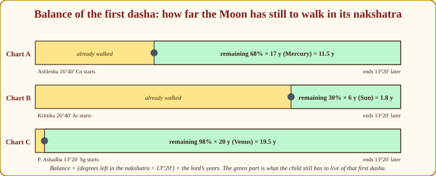
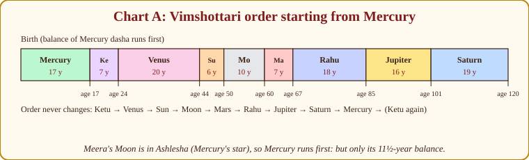
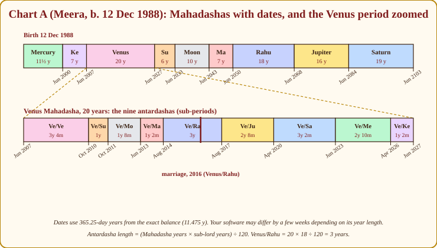
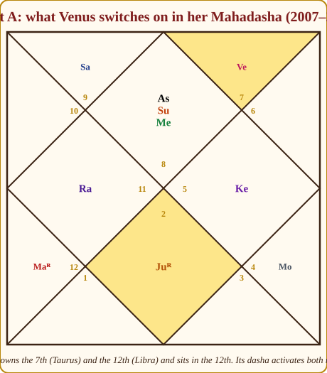
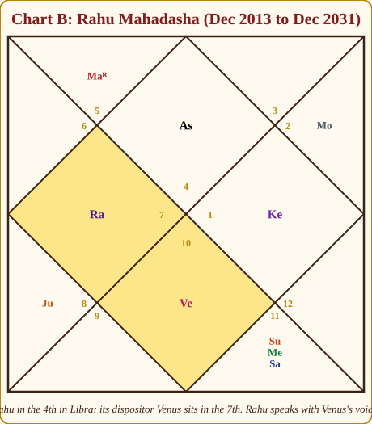

# Chapter 13: Vimshottari Dasha: The Timetable of Life

Everything you have learned so far describes the *chart*: the planets, their houses, their strength, their teams. The chart is a promise. It says "there is a marriage here", "there is a career in teaching here", "there is a difficult stretch for the mother here". What it does not say, by itself, is *when*. A promise without a date is a comfort at best and a torment at worst; ask anyone who has been told "you will get a good job" and waited eleven years.

The **dasha** (the word means "period" or "condition") is the delivery date. The tradition has many dasha systems (Chapter 15 surveys them), but one stands above all others in India, the one every astrologer learns first and trusts most: the **Vimshottari dasha**, the 120-year cycle. This chapter teaches it completely: how to find it, how to compute it by hand for our three charts, and how to *read* it, which is the part software cannot do for you.

## The railway timetable

> **📖 Story: The nine trains.** Life, in this system, is a railway line 120 years long, and nine trains run on it, always in the same order and always for the same number of years each: the Headless Sadhu's train for 7 years, the Minister of Pleasure's for 20, the King's for 6, the Queen Mother's for 10, the Commander's for 7, the Smoke-headed Stranger's for 18, the Royal Priest's for 16, the old Judge's for 19, the young Prince's for 17. Nobody can change the order; nobody can lengthen a train. What differs from person to person is only this: *which train you are already sitting in when you are born*, and *how far along its route it has come*. A child born aboard the Priest's train near the end of its run will change to the Judge's train within a year or two; a child born as the Minister of Pleasure's train pulls out has twenty years of her hospitality ahead. Whoever drives the current train holds the keys to the haveli for those years, and only his plans are carried out. **Rule:** Vimshottari runs Ketu 7, Venus 20, Sun 6, Moon 10, Mars 7, Rahu 18, Jupiter 16, Saturn 19, Mercury 17, always in this order, 120 years in all.

Here is the timetable as a table, with the functional nature each period takes for Meera's Scorpio Lagna (Chapter 8, Appendix A.6):

| Order | Lord | Years | For Scorpio Lagna (Chart A) |
|---|---|---|---|
| 1 | Ketu | 7 | 🟡 by placement (10th house, Leo) |
| 2 | Venus | 20 | 🔴 7th and 12th lord, functional malefic, but in own sign |
| 3 | Sun | 6 | 🟢 10th lord |
| 4 | Moon | 10 | 🟢 9th lord |
| 5 | Mars | 7 | 🟢 Lagna lord (also 6th lord) |
| 6 | Rahu | 18 | 🟡 by placement (4th house, Aquarius) |
| 7 | Jupiter | 16 | 🟢 2nd and 5th lord |
| 8 | Saturn | 19 | 🔴 3rd and 4th lord |
| 9 | Mercury | 17 | 🔴 8th and 11th lord |

> **🔍 Why 120 years?** Tradition, stated plainly: Parashara calls 120 years *Purna Ayu*, the full human lifespan granted in this age, and builds the cycle to that length so that no planet's period ever needs to repeat within one life. The layer here is classical statement, not astronomy; the individual years (Venus 20, Saturn 19 and so on) are given by Parashara without derivation, and the tradition's own account ties them to the nine nakshatra lords of Chapter 7, whose order the dasha follows exactly. Everyday parallel: a school timetable that runs the whole year without repeating a period. Nobody sits through every class; the point is that the sequence is long enough that you never do.

> **💡 Did you know?** The nine dasha lords are the nine nakshatra lords of Chapter 7, and the dasha order is the order of the nakshatras counted from Ashwini (Ketu's star). Learn one list and you have learned both.

## Finding the first train: the Moon's nakshatra

Which dasha are you born into? The one ruled by the **lord of the Moon's nakshatra at birth**. And how far along is it? In proportion to how far the Moon has already travelled through that nakshatra.

> **📖 Story: The Queen Mother's street decides the first train.** When the child is born, the court looks not at the King but at the Queen Mother, the Moon, and asks: on which of the twenty-seven streets of the kingdom is she standing? Every street has an owner, one of the nine lords, and the owner of *that* street is the driver of the first train. Then they ask a second question: how far along the street has she walked? If she has walked two-thirds of it, the child gets only the last third of that train's journey; the rest was spent before he was born. So the first dasha is nearly always a fraction of its full length, and the *balance* is what remains. **Rule:** the first Mahadasha is the lord of the Moon's nakshatra; its balance is (degrees still to travel in the nakshatra ÷ 13°20′) × the lord's years.

> **🔍 Why start from the Moon's nakshatra?** Symbolic logic with an astronomical root. The Moon is the mind, and Vimshottari is a *nakshatra* dasha: the nakshatras are the Moon's own 27 stations, the 27 nights it takes to go round the sky (astronomy: 27.3 days). So the Moon's street at birth is the natural starting address of a system built on the Moon's path, and the mind's state at birth sets where the timetable begins. The Lagna-based and Sun-based dashas exist (Chapter 15), but the tradition made the Moon-based one the backbone because life is lived in the mind. Everyday parallel: when you board a long-distance train, which coach you are in depends on where you were standing on the platform when it arrived.

*Figure 13.1: The balance of the first dasha for our three charts. The yellow part of each nakshatra has already been walked before birth; the green part is what remains, scaled to the lord's years.*

Now the arithmetic, slowly, for all three charts. Each nakshatra spans 13°20′, which is 13.333°; keep that number handy.

**Chart A, Meera. Moon 21° Cancer.** Ashlesha spans 16°40′ to 30°00′ Cancer (Appendix A.7); its lord is **Mercury, 17 years**. The Moon has 30° − 21° = **9°** still to travel in Ashlesha. Balance = 9 ÷ 13.333 × 17 = 0.675 × 17 = **11.475 years**. Convert: 11 years; 0.475 × 12 = 5.7 months, so 5 months; 0.7 × 30 = 21 days. **Mercury balance 11 years 5 months 21 days.** Born 12 December 1988, her Mercury dasha ends around **3 June 2000**.

**Chart B, Arjun. Moon 6° Taurus.** Krittika spans 26°40′ Aries to 10°00′ Taurus; lord **Sun, 6 years**. Remaining: 10° − 6° = **4°**. Balance = 4 ÷ 13.333 × 6 = 0.3 × 6 = **1.8 years** = 1 year; 0.8 × 12 = 9.6 months, so 9 months; 0.6 × 30 = 18 days. **Sun balance 1 year 9 months 18 days.** Born 3 March 1995, his Sun dasha ends around **19 December 1996**.

**Chart C, Devika. Moon 14° Sagittarius.** Purva Ashadha spans 13°20′ to 26°40′ Sagittarius; lord **Venus, 20 years**. Remaining: 26°40′ − 14° = 12°40′ = 12.667°. Balance = 12.667 ÷ 13.333 × 20 = 0.95 × 20 = **19.0 years** exactly. Born 22 July 1979, her Venus dasha ends **22 July 1998**.

> **⚠️ Common beginner mistake:** Using the degrees *already travelled* instead of the degrees *remaining*. The child gets what is left of the train, not what has passed. Meera has walked 4°20′ of Ashlesha and has 9° to go; it is the 9° that counts.

## Building the full Mahadasha timeline: Chart A

Once the first period's end is fixed, the rest is addition, because every later period runs its full length.

| Mahadasha | Years | Runs from | To | Meera's age |
|---|---|---|---|---|
| Mercury (balance) | 11.475 | 12 Dec 1988 | ≈ Jun 2000 | 0 to 11½ |
| Ketu | 7 | Jun 2000 | Jun 2007 | 11½ to 18½ |
| Venus | 20 | Jun 2007 | Jun 2027 | 18½ to 38½ |
| Sun | 6 | Jun 2027 | Jun 2033 | 38½ to 44½ |
| Moon | 10 | Jun 2033 | Jun 2043 | 44½ to 54½ |
| Mars | 7 | Jun 2043 | Jun 2050 | 54½ to 61½ |
| Rahu | 18 | Jun 2050 | Jun 2068 | 61½ to 79½ |
| Jupiter | 16 | Jun 2068 | Jun 2084 | 79½ to 95½ |
| Saturn | 19 | Jun 2084 | Jun 2103 | 95½ to 114½ |

A note on dates: I have used years of 365.25 days. Some programs use 360-day years or a slightly different balance formula, and will show these boundaries a few weeks earlier, late May rather than early June. Do not argue with anyone over three weeks; the dasha is a season, not a train that arrives at 10:42.

*Figure 13.2: The nine Mahadashas in order, starting from Mercury. The bar shows full lengths; remember that Meera's Mercury period was already 5½ years gone at birth, so subtract 5½ from every age tick.*

*Figure 13.3: The same timeline with real dates, and the Venus Mahadasha (2007–2027) opened up into its nine sub-periods. The maroon marker is her 2016 marriage, in Venus/Rahu.*

## Antardashas: the sub-periods

Each Mahadasha is itself divided into nine **Antardashas** (sub-periods), one for each lord, in the *same order*, beginning with the Mahadasha lord itself. The length is a simple proportion (Appendix A.8):

**Antardasha of B inside Mahadasha A = (years of A × years of B) ÷ 120.**

> **🔍 Why multiply?** Logical derivation: proportional share. The 120-year cycle is divided among the nine lords in fixed shares (Venus 20/120, Rahu 18/120 and so on). A Mahadasha is a small copy of the whole cycle, so inside Venus's 20 years each lord gets the *same fraction* of those 20 years that it gets of the 120: Rahu gets 18/120 of 20 years, which is 20 × 18 ÷ 120 = 3 years. Because the shares are the same, the nine sub-periods always add back up to the Mahadasha. Everyday parallel: a family that splits every month's income in the same proportions splits a small month and a large month the same way; the shares scale, the ratios do not.

So inside Venus's 20-year Mahadasha, the Rahu sub-period is 3 years; the Sun sub-period is 20 × 6 ÷ 120 = 1 year. Here is Meera's Venus Mahadasha in full, starting early June 2007, with each sub-lord's position counted from Venus (the 6/8/12 rule, explained below):

| Antardasha | Length | From | To | Sub-lord's house from Venus (Libra) |
|---|---|---|---|---|
| Venus / Venus | 20×20÷120 = 3y 4m | Jun 2007 | Oct 2010 | (itself) |
| Venus / Sun | 20×6÷120 = 1y 0m | Oct 2010 | Oct 2011 | 2nd (Scorpio) 🟢 |
| Venus / Moon | 20×10÷120 = 1y 8m | Oct 2011 | Jun 2013 | 10th (Cancer) 🟢 |
| Venus / Mars | 20×7÷120 = 1y 2m | Jun 2013 | Aug 2014 | 6th (Pisces) 🔴 |
| Venus / Rahu | 20×18÷120 = 3y 0m | Aug 2014 | Aug 2017 | 5th (Aquarius) 🟢 |
| Venus / Jupiter | 20×16÷120 = 2y 8m | Aug 2017 | Apr 2020 | 8th (Taurus) 🔴 |
| Venus / Saturn | 20×19÷120 = 3y 2m | Apr 2020 | Jun 2023 | 3rd (Sagittarius) 🟢 |
| Venus / Mercury | 20×17÷120 = 2y 10m | Jun 2023 | Apr 2026 | 2nd (Scorpio) 🟢 |
| Venus / Ketu | 20×7÷120 = 1y 2m | Apr 2026 | Jun 2027 | 11th (Leo) 🟢 |

Check the sum: 40 + 12 + 20 + 14 + 36 + 32 + 38 + 34 + 14 = 240 months = 20 years. The table in Appendix A.8 gives the commonest sub-period lengths ready-made (Venus/Venus 3-4-0, Venus/Sun 1-0-0, and so on); use it at the desk, but be able to derive any of them in ten seconds.

**Pratyantar dashas**, the sub-sub-periods, divide each Antardasha by the same rule again: Pratyantar of C inside Antardasha A/B = (length of A/B × years of C) ÷ 120. Venus/Rahu/Jupiter, for instance, is 3 years × 16 ÷ 120 = 0.4 years, about 4 months 24 days. Pratyantars are useful for narrowing an event to a season once the Antardasha has told you the year; below that level (the *sookshma* and *prana* dashas) the birth time is rarely accurate enough to trust.

## How to interpret a dasha: the five questions

Software prints the dates. Everything from here on is judgement, and it comes down to five questions asked of the period lord.

> **📖 Story: The key-holder opens his own rooms.** When a courtier's train is running, he holds the keys of the haveli. But a key-holder does not wander everywhere. He goes first to the rooms he *owns*, the houses whose signs are his, and throws them open: if the Minister of Pleasure owns the bride's chamber and the storeroom of expenses, those two rooms come alive in his years. Then he goes to the room where he *happens to be sitting* on the day the keys were handed over, the house he occupies, and that room is busy too. He behaves according to his standing (dignity) and his mood (aspects), he treats the household as his own party treats it (functional nature), and he looks at the Queen Mother's rooms as well, because the mind is where the years are actually lived. **Rule:** a dasha lord activates the houses it owns and the house it occupies, coloured by its functional nature, dignity, aspects, and its house from the Moon.

> **🔍 Why does a dasha lord activate the houses it owns and occupies?** System grammar, and it is the same grammar as Chapter 9. A planet *is* the lord of its houses: their affairs are its department, and it carries their files wherever it goes. When its period runs, it is the employee on duty, so its department's files are the ones on the desk. The house it occupies is where it was standing when the duty began, so that room is opened too. Everyday parallel: when the accounts officer is on duty, accounts move; when the admissions officer is on duty, admissions move; and whichever office they are physically sitting in that week gets busy as well.

**Question 1: Is the dasha lord a functional benefic or malefic for this Lagna?** (Chapter 8, Appendix A.6.) A functional benefic's years *lift*: doors open in its houses. A functional malefic's years *test*: the same houses are pressured, and the person works harder for less. This is the single most reliable rule in the whole of dasha interpretation, and the one most often skipped, because people jump to "Jupiter is good, Saturn is bad".

**Question 2: Which houses does it own and occupy?** Those are the rooms that come alive. Write them down before anything else.

**Question 3: What is its dignity and who aspects it?** (Chapter 12.) A strong lord delivers its houses' promises; a weak one delivers the wish for them. A dasha lord aspected by Jupiter gives its results with grace; one aspected by Saturn gives them late.

**Question 4 (for Antardashas): where does the sub-lord sit from the Mahadasha lord?** The famous **6/8/12 rule**: a sub-period lord placed in the 6th, 8th or 12th house *from the Mahadasha lord* gives friction, obstacles or expense, even when both planets are individually fine, because the two key-holders are at odds. A sub-lord in the 2nd, 5th, 9th, 10th or 11th from the Mahadasha lord cooperates. (The 1st, 3rd, 4th and 7th are mixed, leaning good.)

> **📖 Story: The sub-minister who sits in the wrong room.** During the Minister of Pleasure's twenty years, each of the other courtiers takes a turn as her deputy. Most are placed in rooms where she can call them easily, the 2nd, 5th, 9th, 10th, 11th from her seat, and the household runs smoothly. But two deputies are lodged in rooms she never visits: the Commander in the 6th, the room of disputes, and the Royal Priest in the 8th, the room of hidden things. However able these men are, their years as deputy are awkward: messages are lost, plans are misread, expenses rise. It is not that either courtier is bad; it is that the deputy is sitting where the Minister cannot see him. **Rule:** an Antardasha lord in the 6th, 8th or 12th from the Mahadasha lord gives friction; in the 2nd, 5th, 9th, 10th or 11th it cooperates.

> **🔍 Why 6, 8 and 12?** System grammar applied *relatively*. The 6th, 8th and 12th are the dusthanas, the difficult rooms, from any point you count from (Chapter 4). Counting from the Mahadasha lord treats him as a temporary Lagna: the sub-lord in his 6th is his enemy, in his 8th his obstacle, in his 12th his expense. So the sub-period is spent on the boss's disputes, hidden problems and losses rather than on the sub-lord's own gifts. Everyday parallel: a good employee seconded to a department whose head cannot stand him. The work is competent; the year is miserable for both.

**Question 5: Which house does the dasha lord occupy counted from the Moon?** The Moon is the mind; the dasha lord's house from the Moon tells you how the period *feels*, whatever it does. A dasha lord in the 4th from the Moon feels like home and comfort; in the 8th from the Moon it feels like upheaval even when the results are good.

Three classical "flavours" complete the toolkit. **The dasha of a planet in a dusthana** (6, 8, 12) brings the affairs of that house forward: service, debts, illness, transformation, foreign residence, expense, though a dignified planet there makes them chosen rather than suffered. **The dasha of an exalted planet** is a rise in whatever that planet signifies, often the best years of the life. **The dasha of the Lagna lord** turns the years towards the self: health, identity, personal projects, for good or ill depending on its strength.

> **🧭 Anushka's rule of thumb:** Before you read any dasha, say aloud: "This planet owns houses ___ and ___, sits in house ___, is a functional ___ for this Lagna, and is ___ in strength." If you cannot finish the sentence, you are not ready to predict.

## Two refinements: the nakshatra layer, and the nodes

**The nakshatra-lord layer.** A modern refinement, taught heavily in the Krishnamurti (KP) school and now widespread, holds that a dasha lord also gives the results of the *planet that rules its nakshatra*, its "star lord", and of the houses that planet owns and occupies. I label this as a KP-influenced modern method, not Parashara; but I use it, because it often explains why a period produced something the house lordships alone did not predict. Meera's Venus is at 22° Libra, in **Vishakha, Jupiter's star**. So her Venus dasha also speaks with Jupiter's voice, and Jupiter sits in her **7th house** and owns the 2nd (family) and 5th. A marriage in the Venus period is written twice over.

**Rahu and Ketu.** The nodes own no signs, so Question 2 seems to have no answer for them. The tradition's solution: **Rahu and Ketu give the results of the lord of the sign they occupy, and of any planet conjunct them**; failing both, they give the results of the house they sit in, in their own manner: Rahu amplifying, obsessing, bringing the foreign and the sudden; Ketu detaching, dissolving, bringing the past and the spiritual.

> **📖 Story: The Stranger speaks with his host's voice.** The Smoke-headed Stranger owns no district in the kingdom; when his eighteen-year train runs, whose plans does he carry out? The court has an old answer. The Stranger is a guest, and a guest speaks with his host's voice: whichever courtier owns the district where Rahu is lodged becomes his host, and Rahu's years bring that host's affairs to the front, hugely, hungrily, with a foreign accent. If another courtier is lodged in the same room as the Stranger, that courtier's affairs come too, amplified. The Headless Sadhu does the same in reverse: he empties his host's rooms rather than filling them, and leaves the family wiser and lighter. **Rule:** Rahu and Ketu give the results of their sign lord and of any planet they sit with, in their own style.

> **🔍 Why do the nodes borrow their dispositor's results?** Astronomy first: Rahu and Ketu are not bodies but the two points where the Moon's orbit crosses the Sun's path (Appendix A.2). They own no sign because they have no light of their own to rule with. The system's grammar then follows: a planet with no department must work in someone else's, so the nodes take on the agenda of the sign lord whose house they occupy and of whoever shares the room. Everyday parallel: a guest who stays a month in a household ends up eating its food, keeping its hours and taking its side in arguments; he has no kitchen of his own.

## The junctions, and the maraka periods

**Dasha sandhi**, the junction where one Mahadasha ends and the next begins, is sensitive. The old key-holder is packing and the new one has not yet learned the house. The last Antardasha of a Mahadasha and the first of the next tend to be unsettled: changes of job, residence, health, mood, often without a clear cause. Meera's Venus to Sun junction falls in mid-2027; I would tell her to expect a year of transition around it and not to make irreversible decisions in the six months either side.

**Maraka periods.** Chapter 4 named the 2nd and 7th houses *maraka* (killer) houses, and Appendix A.6 lists the marakas for each Lagna; for Scorpio, Venus and Mercury. The dasha of a maraka lord, especially in old age or when the Lagna lord is weak, is when health and longevity are tested. For Meera, the whole Venus Mahadasha is a maraka period on paper.

> **🪔 Consultation tip:** Never say the word "maraka" to a client, and never predict death. Ever. The classical texts use maraka periods to estimate longevity in a person already old or ill; in a healthy young person the same period simply asks for attention to health. Look: Meera's maraka Venus period brought her a marriage. What you may say is: "This is a period to take your health seriously, regular check-ups, no neglect." What you may never say is "this period is dangerous for your life". The first sentence helps; the second can do real harm to an anxious person, and it is very often wrong.

## Chart A read: the Venus Mahadasha, 2007–2027

Let us run the five questions on Meera's Venus period and see whether the method predicts her life.

*Figure 13.4: The rooms Venus opens in Meera's chart: the 7th (Taurus, marriage) and the 12th (Libra, where Venus sits: expenses, foreign lands, solitude, bed comforts).*

1. **Functional nature.** For Scorpio Lagna, Venus is a functional malefic (7th and 12th lord) and a maraka. So: a *testing* period, not a lifting one; the person works for what she gets.
2. **Houses.** Venus owns the 7th (marriage, partnership, the public) and the 12th (expenses, foreign places, isolation, sleep), and sits in the 12th. The three themes of the period: **marriage and partnership; foreign connections and travel; expenditure and time spent away or alone.**
3. **Dignity and aspects.** Venus is in its own sign, strong, so the themes come as *chosen* events rather than losses. It is aspected by Mars from the 5th (the 8th aspect): some heat and haste in relationships, arguments about money. Venus in Vishakha, Jupiter's star, adds Jupiter's 7th-house voice.
4. **Antardashas.** From the table above: Venus/Mars (Jun 2013 to Aug 2014) and Venus/Jupiter (Aug 2017 to Apr 2020) are the two friction sub-periods (6th and 8th from Venus). Venus/Rahu (Aug 2014 to Aug 2017) has Rahu in the 5th from Venus, cooperative, and Rahu sits in the **4th house** (home, settling down) in Saturn's sign; Saturn sits in the 2nd, the house of family.
5. **From the Moon.** Venus in Libra is the 4th from her Cancer Moon: the period *feels* like home-building and comfort, whatever else it does.

Now the facts from the Case Study Kit: Meera married in **2016**, inside **Venus/Rahu**. Does the method explain it? The Mahadasha lord is the 7th lord, in a star whose lord sits in the 7th house. The Antardasha lord Rahu is cooperative (5th from Venus), sits in the 4th house of home and domestic settling, and speaks with the voice of its host Saturn, lord of the 4th, who sits in the 2nd house of family. A marriage that brought a new home and new family in the middle of the Venus period is exactly what this arrangement describes. I would not have said "2016" from the chart alone; no honest astrologer would. I would have said "marriage most likely between 2014 and 2017, quite possibly to someone met through travel or from another region (Rahu, 12th lord Venus)". That is what dasha prediction looks like when it is done properly: a window, with reasons.

The rest of the period reads the same way. Venus/Jupiter (2017 to 2020): Jupiter is 8th from Venus, friction, yet Jupiter is her 2nd and 5th lord in the 7th; I would expect a child or a major decision about children, with some strain and expense. Venus/Saturn (2020 to 2023): Saturn is combust and her 3rd/4th lord; a heavy stretch for the home and mother, overlapping her Ashtama Shani transit (Chapter 14). Venus/Mercury (2023 to 2026): Mercury is the 11th lord with full directional strength in the Lagna, the best earning window of the period, through writing and speaking (Chapter 18 agrees). Venus/Ketu (2026 to 2027): a quiet closing, then the junction.

## Chart B and Chart C in brief

*Figure 13.5: Arjun's Rahu Mahadasha (Dec 2013 to Dec 2031). Rahu in the 4th in Libra speaks with the voice of Venus, its sign lord, who sits in the 7th.*

**Arjun (Chart B): Rahu Mahadasha, about December 2013 to December 2031 (age 18.8 to 36.8).** Rahu in the 4th house, Libra, in Swati, its own star. Its host is Venus, lord of the 4th and 11th, sitting in the 7th. So Rahu's eighteen years bring the 4th house forward in Rahu's style: changes of home and city, property matters, education that takes an unconventional or foreign route, the mother's affairs in the foreground, and, through Venus in the 7th, partnerships and gains through other people. The sub-periods: Rahu/Jupiter (Aug 2016 to Jan 2019) with Jupiter 2nd from Rahu 🟢, study and mentors; Rahu/Saturn (Jan 2019 to Dec 2021) with Saturn 5th from Rahu 🟢 but combust and the 7th and 8th lord, heavy structured work and a test of a relationship; Rahu/Venus (Jul 2025 to Jul 2028) with Venus 4th from Rahu 🟢 and sitting in the 7th, the natural marriage window of the period, though Arjun's 7th *lord* Saturn is combust in the 8th, so I would say "marriage likely 2025 to 2028, after a delay or a broken first arrangement"; Rahu/Moon (Jun 2029 to Dec 2030) with the Moon 8th from Rahu 🔴, the one sub-period of the eighteen years I would flag for emotional upheaval.

**Devika (Chart C): Rahu Mahadasha, July 2021 to July 2039 (age 42 to 60).** Rahu at 3° Leo in the 5th house, in Magha, Ketu's star, and in the first degrees of a fire sign, the gandanta edge (Chapter 7). Rahu sits *with* Saturn (10th and 11th lord) and Mercury (3rd and 6th lord), so it speaks with three voices: its host the Sun (5th lord, in the 4th with exalted Jupiter), and its two room-mates. The 5th house, children, students, creativity, speculation, is the stage of these eighteen years, and the earlier struggles of that house (Chapter 10) come up for resolution in Rahu's amplified style: children's careers abroad, a late creative venture, students in large numbers, sudden gains and losses through speculation that she should treat with care. The best stretch is Rahu/Jupiter (Apr 2024 to Aug 2026): Jupiter is 12th from Rahu 🔴 by the 6/8/12 rule, which warns of expense, but it is her exalted 9th lord, exchanging signs with the Moon. The day this clicked for me was when I saw a planet of that quality override the 6/8/12 friction in a friend's chart: expense, yes, and worth it. Rahu/Saturn (Aug 2026 to Jul 2029) is the working stretch: career responsibility late in life.

> **⚠️ Common beginner mistake:** Reading a Mahadasha as twenty years of one flavour. Nobody lives twenty flat years. The Mahadasha sets the theme; the Antardasha sets the chapter; the transits (Chapter 14) set the weather. Meera's Venus period contains a marriage, a heavy home stretch and her best earning years: all "Venus", all different.

## In one breath

- The chart is the promise; the dasha is the delivery date. Vimshottari is the backbone dasha of Indian astrology.
- Order and years never change: Ketu 7, Venus 20, Sun 6, Moon 10, Mars 7, Rahu 18, Jupiter 16, Saturn 19, Mercury 17; 120 years, *Purna Ayu*, the full lifespan of the tradition.
- The first Mahadasha is the lord of the Moon's nakshatra, because Vimshottari is a nakshatra dasha built on the Moon's path; its balance = (degrees remaining ÷ 13°20′) × the lord's years. Meera: Mercury, 11 y 5 m 21 d; Arjun: Sun, 1 y 9 m 18 d; Devika: Venus, 19 y.
- Antardasha = (A × B) ÷ 120 years, a proportional share, in dasha order starting with the Mahadasha lord; Pratyantar divides again the same way.
- Five questions for any period lord: functional nature for this Lagna; houses owned and occupied (its department's files); dignity and aspects; the sub-lord's house from the Mahadasha lord (6/8/12 = the boss's difficult rooms); its house from the Moon.
- Rahu and Ketu, having no sign of their own, give the results of their sign lord and any conjunct planet. The nakshatra-lord layer (KP-influenced) adds the star lord's houses.
- Junctions (dasha sandhi) are unsettled; maraka periods ask for attention to health. Never predict death.
- Meera's 2016 marriage falls in Venus/Rahu: 7th lord Mahadasha, in Jupiter's star (Jupiter in the 7th), with a cooperative Antardasha lord in the 4th house of home.

## Practice

> **✍️ Practice:**
>
> 1. A friend's Moon is at 5° Aries. Which nakshatra, which lord, and what is the balance of the first dasha? Then list the first four Mahadashas with their lengths.
> 2. Compute the length of the Saturn/Mercury Antardasha and the Jupiter/Venus Antardasha, in years, months and days.
> 3. Arjun's Jupiter Mahadasha begins around December 2031. Answer the five questions for it in one line each (Jupiter is at 22° Scorpio in the 5th; his Moon is in Taurus).
> 4. In Meera's Venus Mahadasha, why does Venus/Mars count as a friction sub-period even though Mars is her Lagna lord and a functional benefic?
> 5. A frightened acquaintance says, "My astrologer told me my maraka dasha starts next year." Write the two sentences you would say.

Answers

1. 5° Aries is in Ashwini (0° to 13°20′ Aries), lord Ketu, 7 years. Remaining = 13°20′ − 5° = 8°20′ = 8.333°; balance = 8.333 ÷ 13.333 × 7 = 0.625 × 7 = **4.375 years = 4 y 4 m 15 d**. Then Venus 20, Sun 6, Moon 10: so Ketu (balance 4.375), Venus (20), Sun (6), Moon (10).
2. Saturn/Mercury = 19 × 17 ÷ 120 = 2.692 years = 2 y 8 m 9 d (Appendix A.8 agrees: 2-8-9). Jupiter/Venus = 16 × 20 ÷ 120 = 2.667 years = **2 y 8 m 0 d**.
3. (1) Jupiter is a functional benefic for Cancer Lagna (9th lord; also 6th lord): a lifting period. (2) It owns the 6th and 9th and sits in the 5th: fortune, higher learning, children, and service or health matters come forward. (3) In Scorpio, a friend's sign, in a trikona, forming Gaja Kesari with the Moon (7th from it): strong. (4) For its Antardashas, count each sub-lord from Scorpio: Saturn, Sun and Mercury in Aquarius are 4th 🟡, Venus in Capricorn 3rd 🟡, Rahu in Libra 12th 🔴, Ketu in Aries 6th 🔴, Mars in Leo 10th 🟢, Moon in Taurus 7th 🟡. (5) Jupiter is in the 7th from his Taurus Moon: the period feels like partnership and public life.
4. Because the 6/8/12 rule counts the sub-lord's position *from the Mahadasha lord*, not from the Lagna. Mars in Pisces is the 6th from Venus in Libra. Mars's good functional nature softens the outcome but does not remove the friction between the two key-holders: expect effort and some conflict in that year even as Mars's own matters (health, initiative) are active.
5. Something like: "A maraka period is one where the tradition asks us to look after health, not one that predicts harm; in fact the same period in a friend's chart brought her marriage. Let us look at what this planet actually owns in your chart, and I will tell you what to attend to and what to look forward to."

