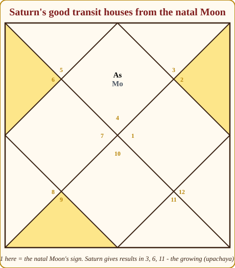
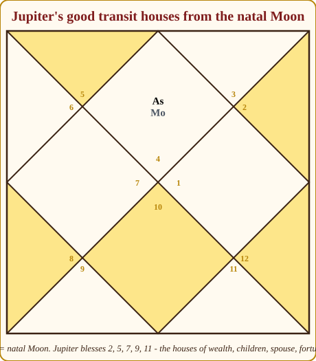
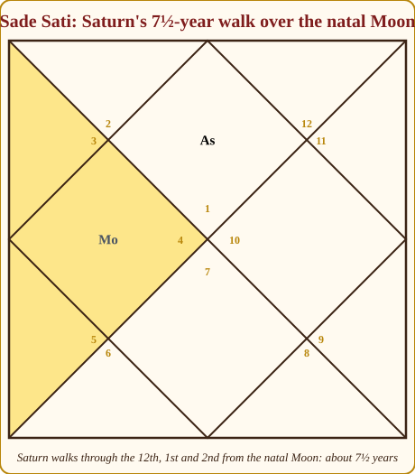
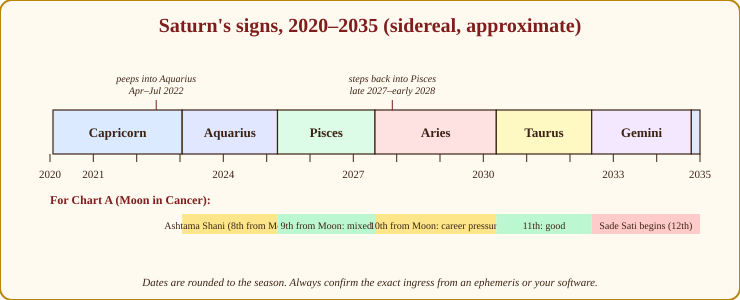
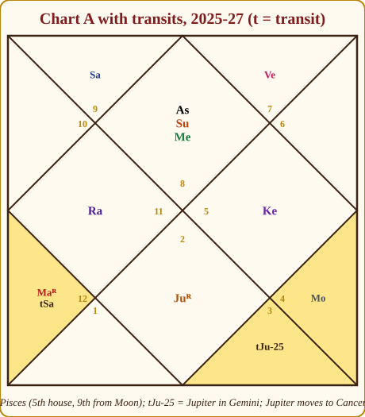

# Chapter 14: Transits (Gochar) — The Weather Report

In the last chapter you learnt the dasha — the long planetary periods that tell you which *season* of life a person is in. Now I want to give you the second half of timing, the half that clients actually feel week to week: the **transits** (*Gochar*, literally "the movement of the cows", the planets grazing their way around the sky).

Here is the picture I give every student. The dasha is the season. The transit is the weather. If the dasha says it is monsoon, a cloudy transit gives you a downpour; the same cloudy transit in a dry season gives you a passing shower and nothing more. Neither works alone. A farmer who reads only the season plants too early; a farmer who reads only the sky never plans beyond tomorrow. You need both, and you need to know which one to trust when they disagree — the season, always the season.

> **🧭 Guruji's rule of thumb:** Dasha promises; transit delivers. A transit can never give what the dasha (and the natal chart behind it) has not promised. It can only decide *when* and *how loudly*.

## Two frames: from the Moon and from the Lagna

A transit means simply this: where the planets are *today*, laid over the birth chart. The question is, counted from where?

The classical texts — *Brihat Samhita*, *Phaladeepika*, the transit chapters of every almanac — count from the **natal Moon**. The Moon is the mind, and Gochar in the old view is about how the person *experiences* the passing weather. When your grandmother says "Shani is in my eighth", she means the eighth from her Moon sign (*rashi*), and every panchanga printed in India follows her.

Modern practice adds a second frame: count from the **Lagna** as well. The Lagna frame tells you which *area of life* the transiting planet is touching in the chart's own house structure — career if it is your 10th, marriage if your 7th. I use both, every time, and I want you to as well. When the two frames agree, speak with confidence. When they disagree, the Moon frame tells you how it will *feel* and the Lagna frame tells you *where* it will happen.

Chart A — Meera, our Scorpio Lagna with the Moon in Cancer — is a clean example. Saturn in Pisces (2025 to about 2027) is in her **5th house from the Lagna** and the **9th from her Moon**. Two different numbers, two different stories, both true. We will finish that reading at the end of the chapter.

## Which transits matter: the speed table

Before any rule, one piece of common sense. A planet's transit matters in proportion to how long it stays. From Appendix A.2:

| Planet | Time in one sign | What its transit can do |
|---|---|---|
| Moon | about 2¼ days | Sets the mood of the day; used for muhurta (Chapter 16), not for life events |
| Sun | about 1 month | Times the *month* within a good year |
| Mercury, Venus | about 1 month (with loops) | Month-level colour: talk, contracts, purchases, romance |
| Mars | about 45 days | Six-week bursts of energy, quarrels, surgery, property moves |
| Jupiter | about 1 year | The yearly blessing — the most-watched benefic transit |
| Rahu / Ketu | about 18 months, moving backwards | Karmic churn, sudden turns, obsessions |
| Saturn | about 2½ years | The heavyweight — Sade Sati, Dhaiya, delays, maturity |

So Saturn, Jupiter and the nodes shape the year; the Sun and Mars pick the month; the Moon picks the day. A beginner who worries about "Mercury in my 8th this week" has the telescope turned the wrong way round.

## The classical good houses from the Moon

Appendix A.9 gives the list every almanac prints. Here it is again, with the one thing the almanacs leave out — the **reason**.

| Transiting planet | 🟢 Good houses from the natal Moon | 🔴 Worst houses (classical) | Why this pattern |
|---|---|---|---|
| Sun | 🟢 3, 6, 10, 11 | 🔴 1, 4, 7, 8, 12 | A mild malefic: it burns what it sits on, so it is welcome only in the growing (upachaya) houses where heat means work and victory |
| Moon | 🟢 1, 3, 6, 7, 10, 11 | 🔴 4, 8, 12 | Fast and gentle; happy over itself, in the upachayas, and in the 7th (public, partnerships) |
| Mars | 🟢 3, 6, 11 | 🔴 1, 4, 7, 8, 12 | A malefic: good only where fighting is useful — courage (3), enemies and debts (6), gains (11) |
| Mercury | 🟢 2, 4, 6, 8, 10, 11 | 🔴 1, 5, 7, 12 | The clever secretary: good where paperwork, speech and calculation help — money, home, work, gains; even the 8th (research, insurance) |
| Jupiter | 🟢 2, 5, 7, 9, 11 | 🔴 6, 8, 12 (transit Shakata) | The priest blesses the houses of wealth (2), children and wisdom (5), spouse (7), fortune (9), gains (11) — and from any of these it aspects the others |
| Venus | 🟢 1, 2, 3, 4, 5, 8, 9, 11, 12 | 🔴 6, 7, 10 | A benefic that enjoys itself almost anywhere; even the 12th (bed comforts) and 8th (inheritance, pleasure) suit it. Avoid only 6, 7, 10 |
| Saturn | 🟢 3, 6, 11 | 🔴 12, 1, 2 (Sade Sati); 4, 8 (Dhaiya) | The great malefic: welcome only in the upachayas, where hard labour and patience are exactly what those houses ask for |
| Rahu / Ketu | 🟢 3, 6, 11 (common practice) | 🔴 1, 4, 7, 8, 12 | Shadows behave like Saturn (Rahu) and Mars (Ketu); the texts are thin here, so this is convention |

Notice the pattern. **Malefics are good in 3, 6, 11** — three of the four upachaya houses (Chapter 4), where pressure is useful. **Benefics are good where they can give**: Jupiter's 2, 5, 7, 9, 11 are the houses of wealth, children, spouse, fortune and gains, and because Jupiter aspects the 5th, 7th and 9th from itself (Appendix A.4), from any house on its list its glance falls on more of the list, or on the Moon. Not arbitrary; geometry.

> **📖 Story: Where each courtier may visit the Queen Mother.** The Queen Mother (the Moon) keeps a haveli of twelve rooms, and every courtier on his rounds must be received somewhere. The Commander (red Mars) and the old Judge (navy Saturn) are welcome only in the working rooms — the 3rd where the servants drill, the 6th where accounts and quarrels are settled, the 11th where the harvest is counted. Put either in her bedchamber (the 1st) or the family hall (the 4th) and the whole house falls silent. Guru-ji (gold Jupiter) is welcome wherever a blessing is needed — the treasury (2nd), the children's rooms (5th), the marriage pavilion (7th), the prayer room (9th), the harvest room (11th) — and from any one of them his gaze reaches the others. Shukracharya (pink Venus) is welcome almost everywhere except the sickroom (6th), the guest-of-honour's seat (7th) and the office (10th), where he only distracts. The clever Prince (green Mercury) is useful wherever there is paperwork. **Rule:** malefics transit well only in 3, 6, 11 from the Moon; Jupiter in 2, 5, 7, 9, 11; each courtier is welcome where his nature is useful.

*Figure 14.1: Put the natal Moon in the 1st house and count. Saturn transiting the 3rd, 6th or 11th (highlighted) gives results; elsewhere it tests. These are the upachaya houses — the reason, not a coincidence.*

*Figure 14.2: The same frame for Jupiter: 2, 5, 7, 9 and 11 from the Moon. From each of these positions, Jupiter's trinal aspects land on other houses in the same list.*

### Vedha — the obstruction (one paragraph, for completeness)

The classics add a refinement called **Vedha** (obstruction): a good transit is spoiled if another planet sits in a particular "obstructing" house at the same time — Saturn's good 3rd is obstructed by a planet in the 12th, its 6th by one in the 9th, its 11th by one in the 5th, and each planet has its own table (the Sun–Saturn and Moon–Mercury pairs do not obstruct each other). I mention it so you recognise the word in *Phaladeepika* or an old almanac. Working consultants rarely apply it at the desk; learn the main list first. Vedha is a garnish for later.

## Sade Sati — the seven-and-a-half years, honestly

No transit frightens Indian clients like this one, and no transit is more misunderstood. Let me give you the whole thing, calmly.

**Definition.** *Sade Sati* means "seven and a half". It is the period when Saturn transits the **12th, 1st and 2nd signs from the natal Moon** — three signs at about 2½ years each, roughly 7½ years in all (Appendix A.9). Because Saturn takes about 29½ years to circle the zodiac, an ordinary life meets Sade Sati two or three times: once in childhood or youth, once in the middle years, once in old age.

*Figure 14.3: The natal Moon sits in the 4th house of this teaching chart. Saturn's walk through the sign before the Moon (12th from it), the Moon's own sign, and the sign after (2nd from it) is the Sade Sati — three highlighted houses, about 2½ years each.*

**Why the Moon?** Because the Moon is the mind and Saturn is weight. When the slowest planet sits on or beside the mind, everything feels heavier — the same workload, the same family, the same body. The events differ from person to person; the weight is common to all.

### The three phases

| Phase | Saturn's position | What it typically brings |
|---|---|---|
| 🟡 **First (rising)** | 12th from the Moon | Expenses rise; sleep suffers; distance from home or family (transfers, travel, a child leaving); a sense of something ending before the new has begun. Saturn from here aspects the 2nd (family, money) and 6th (health, debts) from the Moon. |
| 🔴 **Second (peak)** | Over the Moon itself | The heaviest: health, identity, heavy responsibility, a change of role. Old patterns of thinking are dismantled. Saturn here aspects the 3rd, 7th and 10th from the Moon — courage, marriage, career all feel the pressure at once. |
| 🟡 **Third (setting)** | 2nd from the Moon | Family and money matters, speech and reputation; often the phase where the lessons of the first two are cashed in — a settlement, a new financial discipline, a quieter home. Saturn aspects the 4th, 8th and 11th from the Moon. |

> **📖 Story: The Judge's seven-and-a-half-year audit.** Once in about thirty years the old Judge of Labour (Shani-ji) arrives to audit the Queen Mother's household, and he does it room by room, never hurrying. He begins in the **store-room** (the 12th): he counts the sacks, finds what has been wasted, and the household sleeps badly while the lamps burn late; some servants are sent to distant estates. Then he enters **her own chamber** (the 1st) and sits down: now the Queen Mother herself must answer for her health, her habits and her duties, and the whole court feels her weight — this is the peak. Finally he moves to the **family dining hall** (the 2nd): the accounts are read aloud, debts are settled, careless speech is corrected, and the deposit is refunded to whoever kept honest books. Then he bows and leaves for the next house. Nothing in it is personal; he audits every household in turn, three of the twelve at any moment. **Rule:** Sade Sati is Saturn in the 12th, 1st and 2nd from the natal Moon — expenses, then self, then family — about 7½ years; a quarter of the world is in it right now.

### Why one person's Sade Sati is a promotion and another's is a hospital

The word is the same; the experience is not. Four things decide it, and you already know how to check all four.

**1. The Moon's strength (Chapter 12).** A bright, well-placed Moon — waxing, in its own or a friend's sign, aspected by Jupiter — carries weight the way a strong back carries a sack of rice. A dark Moon in the 8th with Ketu bends under it. Meera's Moon, in its own sign Cancer in the 9th with Jupiter's aspect, is a good back.

**2. Saturn's functional nature for the Lagna (Chapter 8, Appendix A.6).** Almost nobody tells clients this. For **Libra** and **Taurus** Lagnas Saturn is the *yogakaraka*; for Capricorn and Aquarius it is the Lagna lord; for Gemini and Virgo a friend. These people routinely report Sade Sati as the years they were promoted, bought a house, or finally became serious — hard, but *productive* hard. A Libra Lagna's Sade Sati is very often a promotion. For Aries, Cancer, Leo, Scorpio, Sagittarius and Pisces Lagnas, Saturn owns difficult houses and the same transit demands more and gives less.

**3. The house from the Lagna.** Sade Sati falling across the 10th and 11th houses is a career season; across the 6th, 7th and 8th it tests health and marriage.

**4. The running dasha.** The famous rule: **the Sade Sati during which Saturn is also a dasha lord — Mahadasha or Antardasha — is the heavy one.** When season and weather are both Saturn's, the downpour is real. In a Jupiter or Venus Mahadasha the same transit often passes as extra work and a couple of medical bills, remembered later as "the time I grew up".

> **⚠️ Common beginner mistake:** Announcing Sade Sati from the Moon sign alone. Three signs out of twelve are in Sade Sati at every moment — that is **a quarter of all the people on Earth**, right now. Add the two Dhaiya signs (4th and 8th from the Moon) and it is five in twelve. If Sade Sati alone ruined lives, half the world would be in ruins every day. It is a season to be *read*, not a verdict to be *pronounced*.

### Saturn's current cycle (approximate — check an ephemeris)

Sidereal Saturn's recent and coming signs, rounded to the season:

| Sign | Approximate period |
|---|---|
| Capricorn | Jan 2020 – Jan 2023 (with a brief peep into Aquarius, Apr–Jul 2022) |
| Aquarius | Jan 2023 – Mar 2025 |
| Pisces | Mar 2025 – mid-2027 (Saturn steps back into Pisces for a few months around late 2027–early 2028) |
| Aries | roughly 2027/28 – 2030 |
| Taurus | roughly 2030 – 2032 |
| Gemini | roughly 2032 – 2034/35 |

*Figure 14.4: Saturn's road from 2020 to 2035, dates rounded to the season. The lower strip reads the same road from Chart A's Cancer Moon: Ashtama Shani in Aquarius, a mixed 9th in Pisces, a demanding 10th in Aries, a rewarding 11th in Taurus, and the next Sade Sati beginning when Saturn enters Gemini.*

So, with Saturn in **Pisces** from 2025 to about 2027:

- **Pisces Moon** — second phase (the peak): Saturn is on the Moon.
- **Aquarius Moon** — third phase (setting): Saturn is in the 2nd from the Moon.
- **Aries Moon** — first phase (rising): Saturn is in the 12th from the Moon.

When Saturn moves into Aries (around 2027/28), Aquarius Moons are released, Aries Moons enter the peak, and Taurus Moons begin the first phase. Do not memorise these; learn to count them, and confirm the ingress dates in your software, because Saturn's retrograde loops make it enter and leave a sign more than once at the edges.

> **🪔 Consultation tip:** When a client asks "Is my Sade Sati running?", never answer with a single yes. Say something like: *"Yes, you are in the second phase, and it lasts until about such-and-such. Saturn is a strict teacher, not a monster. In these years he removes what is not yours and asks you to work for what is. About a quarter of everyone you know is in Sade Sati right now — your colleague, your neighbour, some cricketer scoring runs on television. Your Moon is strong, your Lagna is friendly to Saturn (if it is), and the current dasha is Venus's, not Saturn's, so this is a season of discipline, not disaster. Here is what I would do with it…"* Then give practical, low-cost advice: sleep, debt reduction, care of the elderly, honest work, Saturday charity if they wish. You have told the truth and lowered the fear. That is the whole job.

### Dhaiya, Kantaka and Ashtama Shani

Two more Saturn transits carry names. **Dhaiya** ("two-and-a-half") is Saturn in the **4th** or the **8th** from the natal Moon, about 2½ years each (Appendix A.9). Saturn in the 4th — **Kantaka Shani** (the thorn), also called *Ardhashtama* — presses on home, mother, vehicles and peace of mind: the season people move house or nurse a parent. Saturn in the 8th — **Ashtama Shani** — brings chronic health matters, hidden expenses, in-laws, and the feeling of a tunnel. Meera had Ashtama Shani from 2023 to early 2025, Saturn in Aquarius being the 8th from her Cancer Moon; Chapter 24 shows what it looked like. Both frames again: for a Libra Lagna the same 8th-from-Moon Saturn may sit in a career house, and the tunnel has a promotion at the end.

## Jupiter — the yearly blessing

If Saturn is the examiner, Jupiter is the scholarship committee. It spends about a year in each sign, and its arrival in a new sign is the most-awaited event in the Indian astrological calendar (Tamil Nadu's *Guru Peyarchi* festivals are exactly this).

**From the Moon**, Jupiter gives its fruit in the **2nd, 5th, 7th, 9th and 11th**, as the table above shows: money and family in the 2nd, children and study in the 5th, marriage and partnerships in the 7th, fortune, father and pilgrimage in the 9th, gains and elder siblings in the 11th. In the 1st, 3rd, 4th, 6th, 8th, 10th and 12th it is quieter, and in the 6th, 8th and 12th from the Moon it forms a transit *Shakata* condition (Appendix A.11) — ups and downs, expenses, distance.

**From the Lagna**, Jupiter over a house, or its aspect on it, is the standard timer for that house's events: over or aspecting the **Lagna** — a new chapter, better health, recognition; the **7th** or natal Venus — the classical marriage trigger in a marriage-promising dasha; the **5th** or its lord — conception, children, the year the student finally passes; the **10th** or its lord — promotion or a change of role; the **2nd** or **11th** — money you can see in the bank.

Since Jupiter aspects the 5th, 7th and 9th from where it sits, it touches about four houses at any time and will bless something in most charts every year. That is why Jupiter's transit alone predicts too much. It needs a partner.

### The double transit — the modern working rule

Here is the technique most working consultants use today, taught widely by the late K.N. Rao's school and now common everywhere. I label it clearly as **a modern rule, not from Parashara**, but I use it daily and it earns its place.

> **🧭 Guruji's rule of thumb (double transit):** A major event — marriage, a child, a new job, a house — tends to happen when **both Jupiter and Saturn, by transit, touch the relevant house or its lord** (by occupation or by their aspects), *while the dasha also promises it*. Jupiter alone brings the wish; Saturn alone brings the work; the two together bring the wedding.

"Touch" means: sitting in the house, aspecting it (Jupiter 5/7/9, Saturn 3/7/10), or sitting on/aspecting the house lord. Because Saturn stays 2½ years and Jupiter one, the two overlap on any given house for a few months to a year. Combine that with the dasha, and you can often narrow a marriage or a job to a window of months. We will do exactly this for Meera below.

> **📖 Story: Two signatures on the deed.** In this kingdom no land deed is valid with one signature. Guru-ji (gold Jupiter) must bless it — he walks briskly, visits every district within twelve years, and would happily bless everything he sees. The old Judge (navy Saturn) must stamp it — he takes thirty years for the same round and stamps only what has been earned. Guru-ji's blessing alone gives the wish and the wedding invitations; the Judge's stamp alone gives the paperwork and the wait. Only when both stand in the same room — or both look into it from where they stand — is the marriage registered, the child born, the post confirmed. **Rule:** a major event tends to come when Jupiter and Saturn by transit both touch the relevant house or its lord, in a dasha that promises it.

## Rahu and Ketu — the churning

The nodes move backwards, about 18 months to a sign, and their transit over a **natal planet** is where they bite. Rahu over the natal Moon brings restlessness, odd fears and a hunger for something new; over the natal Sun, upheaval around father, boss or government; over natal Venus, an unconventional or foreign relationship; over the 10th house, a sudden career turn, often toward technology or foreign firms. Ketu over the Moon detaches — grief, meditation, or simply losing interest; Ketu over Venus cools a relationship; over Mars it can bring cuts, surgery, or a burst of spiritual discipline. Because eclipses happen only near the nodes (Chapter 1), an eclipse within a degree or two of a natal planet is worth a note in your notebook — read with the dasha, never alone.

## The Sun, Mars and Venus — picking the month

Once the year is chosen by Saturn and Jupiter, the fast planets pick the month.

- **The Sun** crosses a sign a month; when it crosses the house the slow planets have prepared — the 10th for a job, the 7th for marriage — that month brings the *event* into the open. The Sun over the Lagna (your solar return, Chapter 15) starts a new personal year.
- **Mars** gives 45 days of heat to whatever it crosses: quarrels over the 7th or Venus, property paperwork over the 4th, injury risk over the Lagna, courage over the 3rd. Mars over natal Saturn (or Saturn over natal Mars) is the classical "friction" transit.
- **Venus** over the 7th, the Lagna or the natal Moon brings romance, purchases and invitations; **Mercury** over the 3rd, 10th or 11th is the month for contracts and interviews.

> **💡 Did you know?** The Tamil word *Peyarchi* and the Sanskrit *Sankranti* both mean a planet's entry into a new sign. *Makar Sankranti*, the harvest festival in January, is simply the Sun's entry into sidereal Capricorn. Every *Sankranti* of the Sun — twelve a year — was once a festival day; most Indian festivals are transit events dressed in ritual.

### Retrograde transits and the triple pass

Every outer planet retrogrades (Chapter 3), so Saturn, Jupiter and Mars usually cross a sensitive degree **three times**: forward, backward, forward again. In my experience the first pass raises the matter (an offer, a symptom, a proposal), the retrograde pass reworks it (renegotiation, second opinion, cold feet), and the final direct pass settles it. When a client says "the deal was on, then off, then on again", look for a retrograde loop of Jupiter or Saturn over the relevant house lord. This is also why an ingress is never one date — the table above has loops at both ends.

## Transits over natal planets

A transit over a house is general; a transit over a **natal planet** is personal. When Saturn or Jupiter sits within a few degrees of a natal planet, that planet's significations are pressed or blessed for months. Tendencies only — weigh the natal planet's strength and its role for the Lagna. (The nodes were covered above.)

| Transit | Over natal Sun | Over natal Moon | Over natal Mars | Over natal Mercury | Over natal Venus | Over natal Jupiter | Over natal Saturn |
|---|---|---|---|---|---|---|---|
| **Saturn** | 🔴 Father's health; friction with bosses; ego lessons | 🔴 Sade Sati peak; heaviness; responsibility | 🔴 Frustration, blocked energy; watch accidents | 🟡 Delayed contracts; careful speech; grind in studies | 🟡 Relationship tested for realism; disciplined spending | 🟡 Faith tested; an elder needs help | 🟡 The "Saturn return" (about 29–30, 58–59): maturity, a new structure |
| **Jupiter** | 🟢 Recognition, honour; health improves | 🟢 Mental peace; new beginnings; often marriage or a child | 🟢 Courage rewarded; property; leadership | 🟢 Studies, publishing, a good contract | 🟢 Marriage, love, artistic success | 🟢 The "Jupiter return" (about 12, 24, 36…): a fresh cycle of growth | 🟢 Relief after a hard stretch; discipline rewarded |

## Moorti Nirnaya — grading a transit at its birth

Appendix A.9 gives a lovely old test for how a new transit will behave. At the **moment a planet enters a new sign**, look at where the **transiting Moon** is, counted from the person's **natal Moon**:

| Transiting Moon from natal Moon at ingress | Moorti (form) | Quality |
|---|---|---|
| 1, 6, 11 | Gold (Swarna) | 🟢 Best |
| 2, 5, 9 | Silver (Rajata) | 🟢 Good |
| 3, 7, 10 | Copper (Tamra) | 🟡 Mixed |
| 4, 8, 12 | Iron (Loha) | 🔴 Difficult |

The logic: the Moon's position at the birth of the transit is like the Lagna of that transit — its first breath colours the whole stay.

> **📖 Story: The four gates.** When a courtier enters a new district of the kingdom, the Queen Mother's own position that day decides which gate he is shown through. If she stands in a friendly place — the 1st, 6th or 11th from her home — the **gold gate** opens and he is received with garlands: his whole stay will be gentle. From the 2nd, 5th or 9th, the **silver gate**: a warm welcome. From the 3rd, 7th or 10th, the **copper gate**: correct, formal, mixed. From the 4th, 8th or 12th, the **iron gate**: he enters by the servants' entrance, and the stay is hard however good his intentions. The gate cannot be changed once he is inside. **Rule:** at a planet's ingress, count the transiting Moon from the natal Moon — 1/6/11 gold, 2/5/9 silver, 3/7/10 copper, 4/8/12 iron.

**Worked example.** Saturn entered sidereal Pisces on about 29 March 2025 — and that day was a new Moon (there was a partial solar eclipse), so the transiting Moon was with the Sun in Pisces. For Meera (natal Moon in Cancer), Pisces is the **9th from her Moon** → **silver form**, a good Moorti. So although Saturn's stay in the 9th from her Moon is not in the "good list", the transit began on a kind note; in practice this softens a mixed transit — the pilgrimage rather than the exile. For someone with a Sagittarius Moon, Pisces is the 4th → iron; the same Saturn wears a harder face for them. One event, twelve different receptions — this is the whole of astrology in miniature.

## Ashtakavarga — the client's own weather map

Chapter 12 introduced **Ashtakavarga**, the system that scores every sign with **bindus** (dots, 0 to 8) for each planet, based on where the seven planets and the Lagna sit in *that* chart. It exists precisely for transits. The rule is simple: when Saturn (or any planet) transits a sign where *its own* Ashtakavarga gives **4 or more bindus**, the transit is bearable or good, however bad the house from the Moon looks; with **3 or fewer**, expect the difficulties to be real, however good the house. The total (*Sarvashtakavarga*) score of the sign — above about 28 is comfortable, below 25 is weak — tells you the same at the level of the whole chart.

When the Sade Sati of two Pisces-Moon clients turns out completely different, the Ashtakavarga usually shows why: one has Saturn's bindus at 5 and 6 across the three signs, the other 2 and 3. Your software prints these tables in a second; look before you speak. It is the most under-used tool in the beginner's kit.

## Putting it together: Chart A's weather, 2025–2027

Let us read Meera's sky for the years around this book, the way I would at the desk. Approximate positions; the *method* is the point.

*Figure 14.5: Chart A with transits marked "t". Saturn sits in Pisces — the highlighted 5th house from the Lagna, 9th from the Moon, on natal Mars. Jupiter was in Gemini (8th from the Lagna, 12th from the Moon) from about May 2025 and moves into Cancer (9th, over the natal Moon) from about June 2026. Highlighted: houses 5, 8, 9.*

**The season first.** Meera is 37 in December 2025, in the last stretch of her Venus Mahadasha (age 18½ to 38½), which ends around mid-2027; then the six-year Sun Mahadasha begins. Venus is a functional malefic for Scorpio (Appendix A.6) but sits in its own sign in the 12th — comfortable, not powerful. The closing years of a twenty-year Mahadasha are years of *winding up*.

**Saturn in Pisces (2025 to about 2027).**
- *From the Moon:* the 9th. Not in Saturn's good list (3, 6, 11); not Sade Sati or Dhaiya either. Mixed — the "silver" Moorti we computed softens it. Tendencies: questions of faith and long journeys, father's or a mentor's health, a slower pace in higher studies.
- *From the Lagna:* the **5th house** — children, students, creative work. Saturn, a functional malefic for Scorpio, sits here **on natal Mars** (4° Pisces), the Lagna lord: her energy and initiatives are being disciplined — the friction transit. For a teacher–consultant the 5th is the classroom: heavier loads, students who test patience, a project that takes twice as long.
- *Saturn's aspects:* the 7th (Taurus — natal Jupiter, marriage), the 11th (Virgo — gains) and the 2nd (Sagittarius — natal Saturn, family). Marriage and income receive Saturn's serious look — not damage, seriousness: joint decisions, budgeting.

**Jupiter in Gemini (about May 2025 to June 2026).**
- *From the Moon:* the **12th** — not in the good list. Expenses, a spiritual turn, travel; not a year for big new commitments.
- *From the Lagna:* the 8th — research, inheritance, in-laws. Jupiter in the 8th protects in crisis but is quiet in celebration.
- *Aspects:* the 12th (natal Venus — the dasha lord!), the 2nd (natal Saturn) and the 4th (natal Rahu). Jupiter's glance on the Mahadasha lord keeps the Venus period pleasant to its close and supports family finances and home.

**Jupiter into Cancer (from about June 2026, roughly a year, with the usual retrograde back-and-forth at the edges).**
- *From the Moon:* the **1st** — Jupiter over the natal Moon, the transit form of Gaja Kesari (Appendix A.11): optimism, a decision to start something.
- *From the Lagna:* the **9th** — fortune, father, higher learning, teaching, long journeys: a course launched, recognition as a guru figure, a pilgrimage or foreign trip.
- *Aspects:* the **Lagna** (Scorpio — natal Sun and Mercury), the 3rd, and the **5th** (Pisces — natal Mars, and transit Saturn).

**Now the double transit.** From mid-2026 into 2027, Jupiter aspects the 5th from Cancer while Saturn sits *in* the 5th. Both slow planets touch the 5th — children, students, creative output — and Jupiter also touches the Lagna. If the natal chart promises a child (Chapter 21 checks her 5th house and D7), this is the window in which it is most likely to be timed; if not, it is the window for a major creative or teaching project — a book, a course, an institution. I say "window", never "will". And Saturn sits in that same house, so whatever comes, comes with labour and delay.

**The month.** Within that window, the Sun crossing the 5th (Pisces, mid-March to mid-April) and the 9th (Cancer, mid-July to mid-August), on Jupiter's direct passes rather than its retrograde one, are the months to watch.

**And then the season changes.** Around mid-2027 the Sun Mahadasha begins — the Sun is a functional benefic for Scorpio, sitting in her Lagna — and almost at the same time Saturn enters Aries: the 6th from the Lagna (an upachaya, where Saturn works well) and the 10th from the Moon (visible responsibility, career pressure). A new dasha and a new Saturn sign within months of each other is what a genuine turning point looks like on paper. Chapter 24 shows how it played out.

> **🪔 Consultation tip:** Never read a transit to a client without first naming the dasha. "Saturn is on your Mars" said alone is a threat. "You are finishing a twenty-year Venus period, and in its last two years Saturn is asking you to be disciplined about your energy and your students, while Jupiter next year opens the 9th — teaching, fortune, travel" is a forecast. The first sentence sells fear; the second sells nothing and helps.

## In one breath

- Dasha is the season, transit is the weather; a transit can only deliver what the dasha and the natal chart promise.
- Count transits from both the natal Moon (classical: how it feels) and the Lagna (modern: where it lands).
- Slow planets shape the year — Saturn 2½ years a sign, Jupiter 1 year, Rahu–Ketu 1½ years; the Sun and Mars pick the month; the Moon picks the day.
- Malefics are good in 3, 6, 11 from the Moon (the upachayas); Jupiter is good in 2, 5, 7, 9, 11 — the houses it blesses and aspects.
- Sade Sati = Saturn in the 12th, 1st, 2nd from the Moon, about 7½ years in three phases; its weight depends on the Moon's strength, Saturn's role for the Lagna, the house from the Lagna, and above all whether Saturn is also the dasha lord. A quarter of humanity is in it at any moment.
- Dhaiya (Kantaka, 4th; Ashtama Shani, 8th) is Saturn's 2½-year cousin.
- Double transit (modern rule): events happen when Jupiter and Saturn together touch a house or its lord, in a promising dasha.
- Grade a transit by Moorti Nirnaya at its ingress and by the person's own Ashtakavarga bindus before you speak.

## Practice

> **✍️ Practice:**
> 1. Chart B (Arjun) has his Moon in Taurus. With Saturn in Pisces (2025–27), which house from his Moon is Saturn in, and is it a named transit? What happens when Saturn enters Aries?
> 2. Chart C (Devika) has her Moon in Sagittarius. Is she in Sade Sati or Dhaiya during Saturn's stay in Pisces? Count and name it.
> 3. Jupiter transits Cancer. For a person with the Moon in Pisces, which house from the Moon is that, and is it on Jupiter's good list? Which three houses from their Moon does Jupiter aspect from there?
> 4. A client with a Libra Lagna and a Pisces Moon is frightened about Sade Sati. Write, in three sentences, what you would say — using both frames.
> 5. Saturn enters a sign while the transiting Moon is in the 4th from a client's natal Moon. What is the Moorti, and what would you check next before judging the transit?

Answers

1. Taurus to Pisces: Taurus 1, Gemini 2, … Pisces is the **11th** from his Moon — one of Saturn's good houses (3, 6, 11), not a named transit. Gains, networks and elder siblings do well. When Saturn enters Aries it is the **12th** from Taurus: his second Sade Sati begins (first phase) — expenses, travel, sleep.
2. Sagittarius to Pisces: Sg 1, Cp 2, Aq 3, Pi **4** — Saturn is in the 4th from her Moon: **Kantaka Shani / Dhaiya**, about 2½ years pressing on home, mother, vehicles and peace of mind. Not Sade Sati.
3. Pisces to Cancer: Pi 1, Ar 2, Ta 3, Ge 4, Cn **5** — the 5th from the Moon, on Jupiter's good list (children, study, creativity). From the 5th, Jupiter aspects the 9th, 11th and 1st from the Moon — fortune, gains, and the Moon itself.
4. Something like: "Yes, Saturn is on your Moon — the middle phase — until about 2027, so the years feel heavy and responsibility grows. But for your Libra Lagna Saturn is the yogakaraka, the planet that gives you status, and it is now in your 6th house, where hard work on health, service and debts pays off. Expect a demanding, productive stretch, not a disaster — and let us look at what dasha is running to see how loud it will be."
5. The 4th from the natal Moon → **iron (Loha)**, the difficult form. Next: check the planet's Ashtakavarga bindus in that sign (4 or more softens it), the house from the Lagna and the planet's functional nature there, and the running dasha. A hard Moorti in a good dasha with 5 bindus is a rough start to a fine stay.

