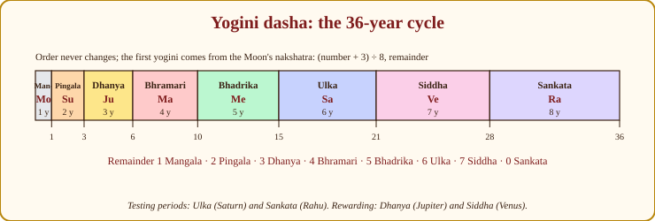
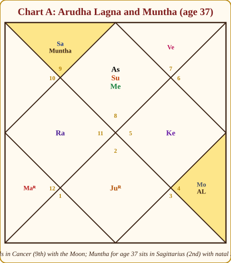
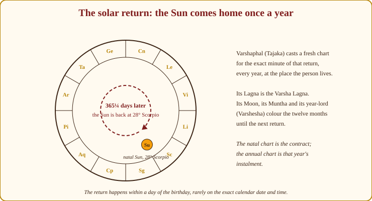

# Chapter 15: Beyond Vimshottari: Yogini, Jaimini Chara Dasha, and the Annual Chart

A friend I was studying with once asked, a little indignantly, "If Vimshottari works, why does Parashara give forty other dashas?" A fair question. Here is the answer I eventually arrived at, and it is the whole spirit of this chapter.

A good doctor does not order one test. She orders the blood test *and* the X-ray, and when both point to the same thing she speaks with confidence; when they disagree she looks harder. Parashara gives dozens of dasha systems (Vimshottari, Ashtottari, Shodashottari, Dwadashottari, Kala Chakra, Chara, Sthira, Yogini and more), not so that you use them all, but so that a practitioner has a **second opinion built into the science**. Vimshottari (Chapter 13) is the backbone; it is the one every Indian astrologer learns first and trusts most. The others are cross-checks. When Vimshottari says "a hard 2027" and Yogini says "a hard 2027", say it plainly. When they disagree, say "mixed" and go back to the transits.

> **🔍 Why do other dashas exist at all?** The classical author's own reasoning. In *Brihat Parashara Hora Shastra*, Parashara does not present the dashas as rivals: he gives Vimshottari as the general system and then lists **conditional dashas**, each recommended for a chart that meets a particular condition (Ashtottari when Rahu stands in a kendra or trikona from the Lagna lord; Shodashottari for a day birth in the bright half or a night birth in the dark half with the Lagna in Sun's hora; and so on). The idea is that a chart may "ask for" a second clock that fits its build. Everyday parallel: a school has one main timetable, but the sports students and the music students each carry an extra schedule that applies only to them.

This chapter gives you a working taste of three more timekeepers (**Yogini dasha**, **Jaimini's Chara dasha**, and the **annual chart, Varshaphal**) plus a nod to two others. Nothing here replaces Vimshottari. Everything here makes you a better second-opinion doctor.

> **🧭 Anushka's rule of thumb:** One dasha is a prediction. Two dashas agreeing is a forecast. Two dashas and a transit agreeing is something you may say to someone's face.

## Yogini dasha: the 36-year wheel

Yogini dasha is short, simple, and loved in North India, Nepal and Bengal. Where Vimshottari runs 120 years through nine planets, Yogini runs **36 years through eight "yoginis"**, goddesses, each carrying a planet and a number of years equal to her position in the sequence:

| # | Yogini | Planet | Years | Flavour |
|---|---|---|---|---|
| 1 | Mangala | Moon | 1 | 🟢 Auspicious, gentle, short |
| 2 | Pingala | Sun | 2 | 🟡 Heat, authority, some struggle |
| 3 | Dhanya | Jupiter | 3 | 🟢 Wealth, blessing, growth |
| 4 | Bhramari | Mars | 4 | 🟡 Wandering, movement, restlessness |
| 5 | Bhadrika | Mercury | 5 | 🟢 Intellect, trade, learning |
| 6 | Ulka | Saturn | 6 | 🔴 Testing, loss, labour ("the meteor") |
| 7 | Siddha | Venus | 7 | 🟢 Accomplishment, comfort, pleasure |
| 8 | Sankata | Rahu | 8 | 🔴 Danger, crisis, upheaval ("the trouble") |

1 + 2 + 3 + 4 + 5 + 6 + 7 + 8 = 36. Then the wheel turns again. A person of 72 has seen each yogini twice.

> **🔍 Why 36 years?** Simple arithmetic built into the design: eight yoginis whose years are their own serial numbers, 1 through 8, and 1 + 2 + … + 8 = 36. There is no astronomical cycle behind it; this is the system's own grammar, a ladder where each rung is one step longer than the last, so the testing periods (Ulka 6, Sankata 8) are also the longest. Everyday parallel: a staircase whose steps get taller as you climb; the hardest steps are also the ones you spend longest on.

> **📖 Story: Eight sisters.** In a village live eight sisters who take turns hosting every traveller, and each keeps him for as many years as her place in the family. Mangala, the eldest and gentlest, one year; Pingala, the fiery one, two; Dhanya, who keeps the granary, three; Bhramari, who never sits still, four; Bhadrika, the reader, five; Ulka, the stern one who works you hard, six; Siddha, in whose house everything comes right, seven; and Sankata, the youngest, in whose house the roof always seems to leak: eight. The order never changes; which sister opens the door first depends only on the street (the Moon's nakshatra) the traveller was born on. **Rule:** Yogini dasha runs 1, 2, 3, 4, 5, 6, 7, 8 years (Moon, Sun, Jupiter, Mars, Mercury, Saturn, Venus, Rahu), 36 in all; Ulka and Sankata test, Dhanya and Siddha reward.

*Figure 15.1: The eight yoginis in their fixed order, each bar as long as her years. The first yogini in a life is found from the Moon's nakshatra; the order never changes after that.*

### Finding the first yogini

Like Vimshottari, Yogini starts from the **Moon's nakshatra** (Chapter 7), but the arithmetic is different and rather charming. Take the nakshatra's number (Ashwini = 1 … Revati = 27), **add 3, divide by 8, and keep the remainder**. Remainder 1 → Mangala, 2 → Pingala, 3 → Dhanya, 4 → Bhramari, 5 → Bhadrika, 6 → Ulka, 7 → Siddha, and 0 (exactly divisible) → Sankata.

Let us do our three charts.

- **Chart A (Meera).** Moon in Ashlesha, nakshatra 9. 9 + 3 = 12. 12 ÷ 8 = 1, remainder **4** → **Bhramari (Mars, 4 years)** first.
- **Chart B (Arjun).** Moon in Krittika, nakshatra 3. 3 + 3 = 6. 6 ÷ 8 = 0, remainder **6** → **Ulka (Saturn, 6 years)** first.
- **Chart C (Devika).** Moon in Purva Ashadha, nakshatra 20. 20 + 3 = 23. 23 ÷ 8 = 2, remainder **7** → **Siddha (Venus, 7 years)** first.

### The balance at birth

Exactly as in Vimshottari, the first period is not run in full: only the **portion of the nakshatra still to be crossed** counts. Take the degrees remaining in the nakshatra, divide by 13°20′, and multiply by the yogini's years.

- **Meera:** Moon at 21° Cancer; Ashlesha runs 16°40′ to 30°, so 9° remain out of 13°20′, a fraction of 0.675. Bhramari's 4 years × 0.675 = **2.7 years** of Bhramari at birth. Then Bhadrika 5 (age 2.7–7.7), Ulka 6 (7.7–13.7), Siddha 7 (13.7–20.7), Sankata 8 (20.7–28.7), Mangala 1 (28.7–29.7), Pingala 2 (29.7–31.7), Dhanya 3 (31.7–34.7), **Bhramari 4 (34.7–38.7)**, Bhadrika 5 (38.7–43.7)…
- **Arjun:** Moon at 6° Taurus; Krittika ends at 10° Taurus, so 4° remain, fraction 0.3. Ulka 6 × 0.3 = **1.8 years**. (Notice this is the same 0.3 that gave his Vimshottari Sun balance of 1.8 years; the fraction is the same, only the multiplier changes.) Then Siddha 7 (1.8–8.8), Sankata 8 (8.8–16.8), Mangala 1, Pingala 2, Dhanya 3 (19.8–22.8), Bhramari 4 (22.8–26.8), Bhadrika 5 (26.8–31.8), **Ulka 6 (31.8–37.8)**.
- **Devika:** Moon at 14° Sagittarius; Purva Ashadha ends at 26°40′, so 12°40′ remain, fraction 0.95. Siddha 7 × 0.95 = **6.65 years**. Then Sankata 8 (6.65–14.65), Mangala, Pingala, Dhanya, Bhramari (20.65–24.65), Bhadrika (24.65–29.65), Ulka (29.65–35.65), Siddha (35.65–42.65), **Sankata 8 (42.65–50.65)**.

Sub-periods exist (each yogini's period is divided among the eight in proportion to their years, starting with herself), but for a cross-check the main periods are enough.

### Reading it simply

Yogini interpretation is deliberately plain. **Sankata (Rahu) and Ulka (Saturn) are the testing periods**; the eight-year Sankata especially is watched the way Vimshottari's Rahu is watched. **Siddha (Venus) and Dhanya (Jupiter) are rewarding.** Bhadrika (Mercury) is good for study and trade, Bhramari (Mars) for movement and change of place, Pingala (Sun) for authority with some heat, Mangala (Moon) is brief and pleasant. Then refine: how is that planet placed in the birth chart, and what does it own for this Lagna (Chapter 8)?

Now look at the cross-checks, because this is why we bother:

- **Meera at 35–39 (2023–2027) is in Bhramari, Mars.** Mars is her *Lagna lord* (Scorpio), a functional benefic, sitting in the 5th. Vimshottari has her in the last years of Venus. Yogini adds: movement, a change of place or role, self-driven effort; a Lagna-lord period is a period of identity. Fits a teacher launching something of her own.
- **Arjun at 31.8 (about December 2026) enters Ulka, Saturn, for six years.** Vimshottari has him in the Rahu Mahadasha (age 18.8–36.8), with Jupiter to follow. Two testing indicators overlapping in his early thirties: I would tell him these are years to build slowly and avoid debt, not years to gamble.
- **Devika at 42.65 (about March 2022) entered Sankata, Rahu, for eight years, until about 2030.** Her Vimshottari Rahu Mahadasha runs from age 42 to 60. **Both systems hand the same planet the same decade.** When that happens, stop hedging: Rahu's themes (foreign matters, technology, obsession, sudden rise and sudden reversal) will run her forties, and the quality depends entirely on how her Rahu sits (5th house, Leo, with Saturn and Mercury; Chapter 24 takes this up).

**When is Yogini used?** In the North and in Nepal as a routine second dasha; anywhere as a quick cross-check when Vimshottari is ambiguous; and in *muhurta*-style questions ("is this a good year to start?"), where its bluntness (good year, bad year) is a virtue. Some traditions say it is especially reliable for women's charts and for charts of night births; I report that as tradition, not as something I can prove.

> **⚠️ Common beginner mistake:** Running Yogini and Vimshottari and then choosing whichever gives the nicer answer. That is not cross-checking; that is shopping. Decide *before* you look which system is your backbone (Vimshottari), and let the other only raise or lower your confidence.

## Jaimini's Chara dasha: periods that belong to signs

Everything so far in this book has been Parashari. **Jaimini**, the sage whose *Upadesha Sutras* form the other great school, does timing differently, and I want you to taste it, because a whole generation of modern Indian astrologers (K.N. Rao's school above all) uses it beside Vimshottari every day. Only a taste. Jaimini deserves a book of its own, and I will name the books.

The central shift: in **Chara dasha**, the periods belong to **signs, not planets**. You live through "a Scorpio period", then "a Sagittarius period", and so on. Each sign's period lasts as many years as the distance from that sign to its own lord: a sign whose lord sits close has a short period; a sign whose lord sits far away has a long one; a sign whose lord sits in the sign itself gets the maximum, **12 years**.

> **🔍 Why signs and not planets?** Jaimini's own grammar. In his system the sign is the primary unit: aspects are sign-to-sign (below), significators are chosen by degree *within* the sign, and a sign's "life" is measured by how far it must reach to find its owner. A sign whose lord has wandered far has a long story to tell before it is at peace, so it gets a long period. Parashara's dashas are about *who* is ruling; Jaimini's are about *where* the action is. Everyday parallel: Vimshottari is a rota of people on duty; Chara dasha is a rota of rooms being renovated, each for as long as it takes to fetch the owner's keys.

**The direction of counting.** This is where variants live. The mainstream simplification (as taught by K.N. Rao and most modern teachers): count **forward** from Aries, Taurus, Gemini, Libra, Scorpio and Sagittarius; count **backward** from Cancer, Leo, Virgo, Capricorn, Aquarius and Pisces. Count from the sign to the sign holding its lord, and **subtract one**; if the lord is in the sign itself, take 12. Other schools (following different readings of the Sutras) reverse some of these and add adjustments for exalted or debilitated lords. Say so if you meet them, and follow one teacher consistently.

Two quick computations on Chart A:

- **Scorpio** (her Lagna, so her first Chara period). Scorpio counts forward. Its lord Mars is in Pisces: Scorpio 1, Sagittarius 2, Capricorn 3, Aquarius 4, Pisces 5 → 5 − 1 = **4 years**. (Jaimini gives Scorpio a second lord, Ketu; when the two lords are in different signs, schools differ on which to use; the mainstream takes the stronger. I have used Mars here for simplicity.)
- **Sagittarius** (the next sign forward). Its lord Jupiter is in Taurus: Sagittarius 1, Capricorn 2, Aquarius 3, Pisces 4, Aries 5, Taurus 6 → 6 − 1 = **5 years**.

So Meera's life in Chara dasha opens with four years of Scorpio, then five of Sagittarius, and so on around the zodiac (the direction of the *sequence* also depends on the Lagna's type: forward for the signs in the first list, backward for the others). The period of a sign brings the affairs of the **house that sign occupies**, and of the planets in it and aspecting it (by Jaimini's own sign-based aspects, below), to the front. Her Sagittarius period, the 2nd house with natal Saturn, was the childhood of family finances and a serious, disciplined home.

### The Chara karakas: the soul and its ministers

Jaimini's second gift is the **Chara karakas** ("movable significators"): instead of fixed rules ("the Sun is always father"), he ranks the planets **by degree within their sign**, highest first, and gives each a role:

| Rank by degree | Karaka | Role |
|---|---|---|
| 1st (highest degree) | **Atmakaraka (AK)** | The soul; the king of the chart; what this life is about |
| 2nd | Amatyakaraka (AmK) | The minister; career, livelihood |
| 3rd | Bhratrikaraka (BK) | Siblings, guru |
| 4th | Matrikaraka (MK) | Mother, home, education |
| 5th | Putrakaraka (PK) | Children, students, intelligence |
| 6th | Gnatikaraka (GK) | Relatives, rivals, disease |
| 7th (lowest degree) | Darakaraka (DK) | Spouse, partners |

> **🔍 Why the highest degree?** Jaimini's symbolic logic, stated in the Sutras: the planet that has travelled furthest into its sign has the most *experience* of that sign; it is the eldest, the most seasoned, and so it carries the soul's own business (*atma*). The planet that has barely entered its sign is the youngest and is given the most outward matter, the partner. Everyday parallel: in a joint family, the one who has lived longest in the house speaks for it; the newest arrival, the bride or groom who married in, is the "other" who joined it.

> **📖 Story: Seniority, not birth.** In Parashara's court the offices are hereditary: the King (Sun) is always the father, the Queen Mother (Moon) always the mother. Jaimini runs his court differently. On the day of the birth he lines up the seven courtiers by how far each has walked into his own district (the degrees) and gives the offices by **seniority**. The one who has walked furthest becomes the soul's own minister, the Atmakaraka, whoever he happens to be; the next becomes minister of livelihood; and so on down to the one who has barely stepped through the district gate, who becomes the Darakaraka and stands for the spouse. In Meera's court the King has walked 28 steps and is Atmakaraka; the Commander, only 4, is Darakaraka. **Rule:** rank the planets by degree within their signs, highest first: AK, AmK, BK, MK, PK, GK, DK.

This is the **seven-karaka scheme** (the seven planets, Sun to Saturn). An **eight-karaka variant** includes Rahu, reckoned by its degrees *counted backwards* (30° minus its degree), and adds a Pitrikaraka (father). K.N. Rao's school uses seven; Sanjay Rath's school uses eight. Both work in their own hands; pick one.

For **Chart A**, the degrees are Sun 28°, Venus 22°, Moon 21°, Mercury 9°, Jupiter 8°, Saturn 5°, Mars 4°. So: **Atmakaraka = Sun** (in the Lagna: a soul whose purpose is visibility, authority, teaching), Amatyakaraka = Venus (career through arts, counsel, harmony; consulting fits), Bhratrikaraka = Moon, Matrikaraka = Mercury, Putrakaraka = Jupiter, Gnatikaraka = Saturn, **Darakaraka = Mars** (spouse-significator, in the 5th in Pisces: a warm, idealistic partner; we return to this in Chapter 19). In the eight-karaka variant Rahu's reckoned degree is 30 − 16 = 14°, which slots it fourth, between Moon and Mercury, and shifts the lower karakas down one.

**Karakamsa** is the sign the Atmakaraka occupies in the **Navamsa (D9)** (Chapter 11). Meera's Sun at 28° Scorpio: Scorpio is a fixed sign, so its navamsas count from the 9th sign from it, Cancer; 28° falls in the 9th navamsa (each is 3°20′), and the ninth sign from Cancer is **Pisces**. Karakamsa = Pisces, Jupiter's sign of dharma and healing, and, in her D1, the sign holding her Darakaraka Mars. Jaimini reads the soul's path from the Karakamsa the way Parashara reads it from the Lagna. A Pisces Karakamsa is the teacher, the counsellor, the one who serves through wisdom. It agrees with everything else we know of her.

### Arudha Lagna: how the world sees you

Jaimini's third idea is one I reach for often, because people ask about it without knowing the word: *"Why does everyone think I'm rich when I'm not?"* That is an Arudha question.

The **Arudha Lagna (AL)** is the *image*, the reflection of the self in the world. To find it: **count from the Lagna to its lord, then count the same distance again from the lord.** Two exceptions: if that landing point is the Lagna itself or the 7th from it, **move ten signs further** (the image cannot coincide with the self or stand exactly opposite it).

> **🔍 Why count the distance twice?** Symbolic logic, and it is the logic of a mirror. In a mirror the image appears as far *behind* the glass as the object stands *in front* of it. The Lagna is the object, its lord is the glass, and the Arudha is the image: the same distance again, on the far side. The two exceptions follow: an image cannot sit on the object itself (1st) or directly facing it (7th), so the tradition moves it to the 10th from there, the most public house, where images are displayed. Everyday parallel: your reputation in the family WhatsApp group is real, but it is a reflection, and it is always a little displaced from who you are at home.

> **📖 Story: The reflection in the palace tank.** The Lagna is the palace door; the lord of the Lagna is the steward, who has wandered off to some other room. Stand at the door, walk to the steward, then walk *the same distance again* in the same direction: where you arrive there is a tank of still water, and in it the palace's reflection, the Arudha, the house as the world sees it. Two rules of the tank: it cannot lie on the doorstep itself, nor exactly opposite the door across the courtyard, for then the reflection would be the thing itself; if the walk lands there, move ten rooms on. **Rule:** AL = count Lagna → lord, then the same count again from the lord; if it lands in the 1st or 7th, take the 10th from there.

**Chart A.** Lagna Scorpio; lord Mars in Pisces. Scorpio to Pisces is the **5th**. The 5th from Pisces: Pisces 1, Aries 2, Taurus 3, Gemini 4, **Cancer 5**. Arudha Lagna = **Cancer**, the 9th house, where her **Moon** sits.

*Figure 15.2: Chart A. The Arudha Lagna (AL) falls in Cancer, the 9th house, on the natal Moon; the Muntha for her 37th year sits in Sagittarius, the 2nd house, with natal Saturn.*

Think about what that says. Her *self* is Scorpio, Sun and Mercury in the Lagna: intense, sharp, private. Her *image* is Cancer with the Moon in the 9th: the world sees a nurturing, motherly, wise teacher. Both are true; one is how she is, the other is how she is seen. When the AL falls on the Moon like this, the public image and the private mind are unusually close; people find her exactly as warm as she looks. Planets in and aspecting the AL, and the 2nd and 11th from it, describe reputation and the wealth others *see*; the 12th from it describes what drains the image.

**Upapada (UL).** The same method applied to the **12th house** gives the Upapada, Jaimini's marriage-and-spouse point, read with the 7th house in Chapter 19. For Meera, the 12th is Libra with its lord Venus sitting in Libra itself: the count lands back on Libra, the 1st from the house, so the exception applies and we move ten signs on, to **Cancer** again. Her Upapada joins her Arudha Lagna and her Moon in the 9th: the marriage and the public image share one room, and the spouse is bound up with faith, teaching and family. Hold that thought until Chapter 19.

### Jaimini aspects: signs look at signs

Jaimini's aspects (*Rashi Drishti*) are between **signs, not planets**, and they are permanent: every **fixed sign aspects the three movable signs except the one next to it**; every **movable sign aspects the three fixed signs except the one next to it**; and the **dual signs aspect each other**. So Scorpio (fixed) aspects Aries, Cancer and Capricorn but not Libra, its neighbour; Cancer (movable) aspects Scorpio, Aquarius and Taurus but not Leo. A planet in a sign aspects whatever those aspected signs hold. Use these only *inside* Jaimini work (Chara dasha, karakas, Arudhas) and Parashari aspects (Chapter 6) everywhere else. Mixing them is the commonest way beginners make a mess of Jaimini.

> **💡 Did you know?** Jaimini's *Upadesha Sutras* are written in a code: the letters of the Sanskrit alphabet stand for numbers (the *Katapayadi* system), so a single word can hide a rule about which house or how many years. This is one reason schools read the same sutra differently, and why you should learn Jaimini from one careful teacher. The modern teachers to read are **K.N. Rao** (Chara dasha in practice, with hundreds of case studies), **Sanjay Rath** (the Sri Jagannath Center tradition, eight karakas), and **Iranganti Rangacharya** (the scholarly translation of the Sutras). Read all three; follow one.

## Two more Parashari dashas, briefly

**Ashtottari dasha** runs **108 years** through eight lords (Rahu is included, Ketu is not: Sun 6, Moon 15, Mars 8, Mercury 17, Saturn 10, Jupiter 19, Rahu 12, Venus 21). Parashara prescribes it conditionally: the traditional rule is that it applies when **Rahu is in a kendra or trikona from the Lagna lord** (some texts add: and not in the Lagna itself; others add conditions about day and night birth in bright or dark fortnights). Its starting nakshatra rule also differs from Vimshottari's. Where the condition is met, many South Indian and Bengali astrologers run Ashtottari as their second dasha in place of Yogini.

Why mention it? Because it is the most common "other dasha" printed on an old family horoscope, and you should recognise the lords and the 108 total rather than think the family astrologer made an error.

**Kala Chakra dasha**, Parashara's own favourite ("the best of dashas", he says), is a nakshatra-pada-based system with sign periods that jump about the zodiac; it is powerful, intricate, and not for a first book. Know the name.

## The annual chart: Tajaka Varshaphal

Now a change of flavour. **Varshaphal** ("the fruit of the year") comes from the **Tajaka** tradition, which entered India from Persian and Arabic astrology in the medieval centuries and was written up in Sanskrit by Neelakantha (*Tajaka Neelakanthi*, 16th century). It is the Indian form of what the West calls the **solar return**. North Indian astrologers use it heavily for the annual "birthday reading"; the South uses it less. Everything in this section is Tajaka, not Parashari, so treat the labels carefully.

### The idea: the Sun comes home

Every year, within a day of your birthday, the Sun returns to the **exact degree and minute** it held at your birth. Cast a fresh chart for that instant, at the place where you now live: that is the **annual chart**. Its rising sign is the **Varsha Lagna** (year-Lagna). The year's chart is read *against* the natal chart: the natal chart is the contract, the annual chart is this year's instalment.

> **🔍 Why is the solar return the "birthday chart"?** Astronomy first: a year *is* one circuit of the Sun through the zodiac, so the Sun standing again at its natal degree is the only exact astronomical definition of "your birthday" (the calendar date drifts by a day because our years are not whole numbers of days). Then grammar: the Sun is the soul and the self, so its return is the self's fresh start, and a chart cast for a fresh start is read like a birth chart for that year. Everyday parallel: the company's financial year begins on a fixed date and gets a fresh balance sheet, but it is still the same company with the same founding deed.

> **📖 Story: The King's homecoming.** Every year the King (the Sun) rides the full circuit of the twelve districts and returns to the exact milestone where he stood when the child was born. The court holds a fresh assembly at that minute: the annual chart. Whoever stands at the door that day (the Varsha Lagna), whichever courtier holds the strongest seat and can see the door (the Varshesha), and the room where the brass marker now stands (the Muntha) decide the year's business. The old contract, the natal chart, is not torn up; the assembly only decides this year's instalment of it. **Rule:** the Varshaphal is cast for the Sun's return to its natal degree; it refines the year, it never replaces the natal chart or the dasha.

*Figure 15.3: Once a year the Sun arrives back at its natal degree (here 28° Scorpio, Chart A's Sun). The moment of that return is the birth of the annual chart. It falls within about a day of the calendar birthday and at a different clock time every year.*

### Muntha: the progressed point

Tajaka's most-quoted device is the **Muntha**. At birth the Muntha sits in the Lagna. It then **advances exactly one sign for every completed year of age**. So at age 1 it is in the 2nd sign from the natal Lagna, at age 12 it is back in the Lagna, and so on: take the age, divide by 12, and count the remainder forward from the Lagna.

> **🔍 Why one sign a year?** Tajaka's grammar. The Muntha is the natal Lagna *progressed* at the pace of the year itself: one solar return, one step. Twelve steps bring it home, so the Muntha completes a circuit every twelve years, the same rhythm as Jupiter and the same twelve-year "return" people notice at 12, 24, 36. It ties the fixed birth chart to the moving year without inventing a new planet. Everyday parallel: a class photo where the same child is moved one seat along each year; by the twelfth year she is back in her first seat, but every seat in between coloured a year.

> **📖 Story: The year's brass marker.** On the day of the birth the steward places a small brass marker in the front room, the Lagna. Every birthday he moves it one room on. At the first birthday it stands in the treasury (the 2nd), at the seventh in the marriage pavilion (the 7th), at the twelfth it is home again, and round it goes for as long as the person lives. Whatever room the marker stands in that year, and whichever courtier happens to be sitting there, colours the year's business. **Rule:** Muntha = natal Lagna advanced by (age ÷ 12, remainder) signs; its house, its lord and its company set the tone of the year.

**Chart A, age 37** (the year beginning December 2025). 37 ÷ 12 = 3, remainder **1** → one sign forward from Scorpio → **Sagittarius**, her natal **2nd house**, where natal Saturn sits (Figure 15.2). The Muntha's house in the natal chart, its house in the annual chart, its lord's condition in both, and the planets with it and aspecting it colour the whole year. A 2nd-house Muntha turns the year toward money, family, speech and food; with Saturn on it, the tone is disciplined and slow: savings rather than windfalls, a family responsibility, careful words. Muntha in the 🟢 1st, 2nd, 3rd, 5th, 9th, 10th or 11th from the annual Lagna is classically welcome; in the 🔴 4th, 6th, 7th, 8th or 12th it is not; and a Muntha with malefics or its lord weak makes a difficult year even in a good dasha.

### Varshesha: the lord of the year

Tajaka names one planet **Varshesha**, lord of the year, and its strength decides the year's basic tone. It is chosen from **five candidates**: the lord of the **Muntha's sign**, the lord of the **natal Lagna**, the lord of the **Varsha Lagna**, the **Tri-rashi lord** (a special lord assigned to each Varsha Lagna sign by day and night birth, from a fixed table), and the **Dina-ratri lord** (the Sun for a day birth, the Moon for a night birth). Whichever of the five is **strongest and aspects the Varsha Lagna** becomes Varshesha, with the Varsha Lagna lord favoured in ties. The strength is measured by Tajaka's own five-fold scheme (*Panchavargiya bala*), not by Shadbala (Chapter 12). Software does it in a moment; what you should understand is the principle: *the year is ruled by whichever of the year's natural candidates can both stand strongly and see the year's Lagna*.

### Tajaka yogas and Tajaka aspects: a flag

Tajaka has **sixteen yogas**, most of them about how two planets are moving toward or away from each other. The two you will meet everywhere are **Ithasala** (an *applying* aspect: the faster planet is moving *into* exact aspect with the slower; the matter is coming together, the answer is "yes, it happens") and **Ishrafa** (a *separating* aspect: the exact aspect is already past; the matter has slipped away, "it was possible, it is going"). The others (Kamboola, Ikkabala, Induvara, Radda, Duphali-kuttha and the rest) refine these two. You will meet Ithasala again in the next chapter, because Prashna borrows it.

And here is the flag: **Tajaka aspects are not Parashari aspects.** Tajaka uses Western-style geometric aspects (trines at 120° and sextiles at 60° as friendly, squares at 90° and oppositions at 180° as hostile, conjunctions as strong), measured in degrees with orbs, and it cares whether the aspect is applying or separating. If you run an annual chart in software and see "Saturn squares the Varsha Lagna lord", you are reading Tajaka, not Parashara. Do not carry the square back into your natal reading.

**Mudda dasha** is the annual chart's own dasha: the 360 days of the year divided among the nine planets in Vimshottari proportions, starting from the Moon's nakshatra at the solar return. It gives you the months.

### When the annual chart is actually used

In practice the annual chart is for two occasions. The **birthday reading**: someone wants to know about *this* year, and the Varsha Lagna, Muntha, Varshesha and Mudda dasha give a twelve-month map with monthly detail that the Vimshottari Antardasha alone cannot. And the **annual review** of a chart you already know, where the Varshaphal tells you which of the dasha's promises this year picks up. I never cast it before reading the natal chart, and I never let it override the dasha. If the Vimshottari says "a quiet year" and the Varshaphal is dramatic, the drama will be small.

> **🪔 Consultation tip:** Frame the year the way a good coach frames a season. "This year your Muntha sits in the house of money with Saturn: it is a saving year, not a spending year, and the discipline will feel heavy in the middle months. Your year-lord is Jupiter and it is strong, so the base of the year is protected. Here are the two months I would use for anything important, and the one month I would keep quiet." A year has twelve months; give the person the *shape*, not a list of good and bad dates they will only fret over.

## Keeping the systems in their boxes

You now have four timekeepers (Vimshottari, Yogini, Chara, Varshaphal) and each has its own aspects, lords and logic. The traditions are precise *because* they are separate: Parashari aspects with Parashari dashas; Jaimini's sign aspects with Chara dasha and the karakas; Tajaka's geometric aspects with the annual chart. When you write a case, label each paragraph with the system it uses (Chapter 24 shows the format). It is the difference between a reading that can be defended and one that cannot.

## In one breath

- Other dashas are second opinions, not replacements; Vimshottari remains the backbone. Parashara gives the others as conditional systems for particular charts.
- Yogini dasha: 36 years (1 + 2 + … + 8), eight yoginis: Mangala 1 (Moon), Pingala 2 (Sun), Dhanya 3 (Jupiter), Bhramari 4 (Mars), Bhadrika 5 (Mercury), Ulka 6 (Saturn), Siddha 7 (Venus), Sankata 8 (Rahu); first yogini = remainder of (nakshatra number + 3) ÷ 8; balance in proportion to the Moon's remaining arc.
- Chart A starts with Bhramari (Mars), Chart B with Ulka (Saturn), Chart C with Siddha (Venus); Devika's Sankata and her Vimshottari Rahu Mahadasha coincide in her forties.
- Jaimini's Chara dasha gives periods to signs (the sign is Jaimini's unit); length = count from the sign to its lord minus one (forward from Aries, Taurus, Gemini, Libra, Scorpio, Sagittarius; backward from the rest, the mainstream simplification), 12 years maximum.
- Chara karakas rank planets by degree, highest first, because the planet furthest into its sign is the most experienced: Atmakaraka (soul) down to Darakaraka (spouse); Karakamsa is the AK's Navamsa sign. Meera's AK is the Sun; her Karakamsa is Pisces.
- Arudha Lagna: Lagna → lord → same distance again, the mirror's image as far behind the glass as the object is in front (with the 1st/7th exception); Meera's AL and Upapada both fall in Cancer on her Moon.
- Varshaphal is Tajaka: a chart for the Sun's yearly return to its natal degree; Muntha advances one sign a year (Meera at 37: Sagittarius, the 2nd); Varshesha from five candidates; Ithasala/Ishrafa; Western-style aspects. Never mix with Parashari.

## Practice

> **✍️ Practice:**
>
> 1. A Moon in Rohini (nakshatra 4). Which yogini comes first, and for how many years in full?
> 2. A Moon in Revati (27) at 25° Pisces. Find the first yogini and its balance at birth.
> 3. Chart B's Lagna is Cancer; its lord the Moon is in Taurus. Compute Arjun's Arudha Lagna. Does the exception apply?
> 4. Chart C's Lagna is Aries; lord Mars is in Gemini. Find Devika's Arudha Lagna and comment on where it falls.
> 5. Compute Arjun's Muntha for age 31 (the year from March 2026) and name the natal house it occupies. Which planets does it join?

Answers

1. 4 + 3 = 7; 7 ÷ 8 leaves remainder 7 → **Siddha (Venus)**, a 7-year yogini.
2. 27 + 3 = 30; 30 ÷ 8 = 3, remainder 6 → **Ulka (Saturn, 6 years)**. Revati runs 16°40′–30°; at 25° there are 5° left of 13°20′ → fraction 0.375 → 6 × 0.375 = **2.25 years** of Ulka at birth, then Siddha 7, Sankata 8…
3. Cancer to Taurus: Cancer 1, Leo 2, … Taurus is the **11th**. The 11th from Taurus: Taurus 1, Gemini 2, Cancer 3, Leo 4, Virgo 5, Libra 6, Scorpio 7, Sagittarius 8, Capricorn 9, Aquarius 10, **Pisces 11**. AL = **Pisces**, his 9th house. Pisces is neither the Lagna nor the 7th (Capricorn), so no exception. He is seen as more philosophical and gentle than his 8th-house planets might suggest.
4. Aries to Gemini is the **3rd**; the 3rd from Gemini is **Leo**. AL = **Leo**, her 5th house, where Saturn, Rahu and Mercury sit. Leo is not the 1st or 7th, so no exception. The world sees her through the 5th house (children, students, creativity, intelligence) and the Saturn and Rahu there mean the image was built through struggle in exactly those matters.
5. 31 ÷ 12 = 2, remainder 7 → seven signs forward from Cancer: Leo 1, Virgo 2, Libra 3, Scorpio 4, Sagittarius 5, Capricorn 6, **Aquarius 7**. Muntha in Aquarius, his natal **8th house**, joining natal Sun, Mercury and Saturn. A year of the 8th: research, insurance, inheritance, in-laws, hidden matters; and, with the Yogini Ulka beginning in December 2026, a year to be careful and thorough rather than bold.

