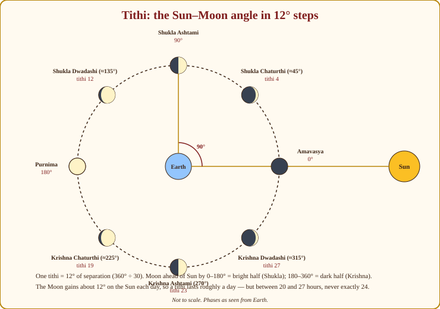
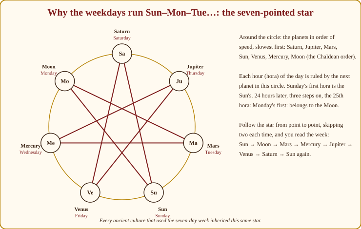
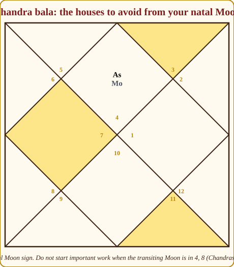
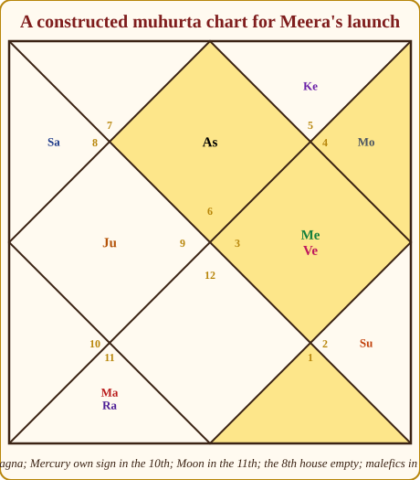

# Chapter 16: The Panchanga and Muhurta: Choosing the Right Moment

My nani could not read a birth chart. She could read a **panchanga**, the Hindu almanac, the way you read a bus timetable, and with it she ran a household of fourteen people: when to sow, when to start the children's schooling, which day the new bride should enter the house, which afternoon not to set out for the market. Before Jyotish predicted anything, it *scheduled* things. This chapter is about that older, humbler, and in some ways more useful skill.

The birth chart tells you what a person carries. The panchanga tells you what the *day* carries. And **Muhurta** (electional astrology, the choosing of a good moment) is where the two meet: given what this person carries, which day and hour should they choose to begin? The first thing anyone asks you, once they know you read charts, is for a date. Let us make sure you can give one honestly.

## The five limbs of a day

*Panchanga* means "five limbs" (*pancha* = five, *anga* = limb). Every day has five qualities, all of them computed from the positions of just two bodies, the **Sun and the Moon**, plus the weekday (Appendix A.14):

| Limb | What it is | How many |
|---|---|---|
| **Tithi** | The lunar day: the Sun-Moon angle in 12° steps | 30 per lunar month |
| **Vara** | The weekday and its planetary lord | 7 |
| **Nakshatra** | The Moon's lunar mansion (Chapter 7) | 27 |
| **Yoga** | The *sum* of Sun and Moon longitudes in 13°20′ steps | 27 |
| **Karana** | Half a tithi | 11 kinds, 60 per month |

Notice that four of the five are about the Moon. The panchanga is a lunar instrument: Jyotish timekeeping trusts the Moon for *quality* and the Sun for *quantity*. The Sun fixes the year and the seasons; the Moon fixes the mood of the day.

### Tithi: the lunar day

Stand in the middle of the sky and watch the Moon race ahead of the Sun. It gains about 12° on the Sun every day. A **tithi** is exactly that: each **12° of separation** between Moon and Sun is one lunar day. 360° ÷ 12° = 30 tithis in a lunar month of about 29½ solar days, so a tithi lasts, on average, a little under a day, and in practice anywhere between about 20 and 27 hours, which is why a printed panchanga always gives the time a tithi *ends*.

> **🔍 Why is the tithi an angle and not a date?** Astronomy. The Moon's phase *is* its angle from the Sun: at 0° we see no lit face (new Moon), at 90° a half, at 180° the full disc. So the tithi is not an arbitrary count; it is the phase of the Moon cut into thirty equal slices, which is why a panchanga can tell you the exact minute a tithi ends while a calendar date cannot. Everyday parallel: the level of water in a tank is the real measure of how much is left; the day of the month is only a rough guess at it.

*Figure 16.1: The Moon's phases are simply its angle from the Sun, seen from Earth. Every 12° is one tithi. From new Moon (0°) to full Moon (180°) is the bright half (Shukla paksha); from full back to new is the dark half (Krishna paksha).*

The first fifteen tithis, from new Moon to full, are the **bright fortnight** (*Shukla paksha*) and end at **Purnima** (full Moon, 180°). The next fifteen, from full back to new, are the **dark fortnight** (*Krishna paksha*) and end at **Amavasya** (new Moon, 0°/360°). Within each fortnight the tithis have the same names:

| # | Tithi | # | Tithi | # | Tithi |
|---|---|---|---|---|---|
| 1 | Pratipada | 6 | Shashthi | 11 | Ekadashi |
| 2 | Dwitiya | 7 | Saptami | 12 | Dwadashi |
| 3 | Tritiya | 8 | Ashtami | 13 | Trayodashi |
| 4 | Chaturthi | 9 | Navami | 14 | Chaturdashi |
| 5 | Panchami | 10 | Dashami | 15 | Purnima (bright) / Amavasya (dark) |

So "Shukla Panchami" is the fifth day of the bright half, "Krishna Ashtami" the eighth of the dark half. Most festivals are tithis: Krishna Janmashtami is Krishna Ashtami of Bhadrapada, Diwali is Kartika Amavasya, Ganesh Chaturthi is Bhadrapada Shukla Chaturthi.

**The five families of tithis.** For muhurta the thirty tithis are grouped into five families, repeating every five days:

| Family | Tithis | Meaning | Best weekday (Siddha pairing) |
|---|---|---|---|
| 🟢 **Nanda** (joy) | 1, 6, 11 | Pleasure, celebration, arts, beginnings of enjoyment | Friday |
| 🟢 **Bhadra** (good) | 2, 7, 12 | Steady, auspicious for most work; trade, learning | Wednesday |
| 🟡 **Jaya** (victory) | 3, 8, 13 | Contests, litigation, medicine, anything to be *won* | Tuesday |
| 🔴 **Rikta** (empty) | 4, 9, 14 | **Avoid for beginnings**; suited only to destructive or harsh acts | Saturday |
| 🟢 **Purna** (full) | 5, 10, 15 | Completion, fullness; marriage, house-warming, big undertakings | Thursday |

> **🔍 Why are the Rikta tithis "empty"?** The tradition's symbolic logic, with a little geometry behind it. Each family of five tithis is one quarter-turn of the Moon's light: five tithis are 60°. Within each quarter, the fourth step (tithis 4, 9, 14) is the moment *just before* the phase visibly turns: just before the first-quarter half-Moon, just before full, just before the last sliver vanishes. The light has not yet arrived, or is about to go; the tradition calls the day "empty" and refuses to begin anything in it, while the fifth step (5, 10, 15) is "full" because the turn has completed. Everyday parallel: you do not open the shop in the last minute before the power cut ends; you wait for the lights to actually come on.

> **📖 Story: Five kinds of days in a village.** Watch a village through a fortnight and you see five kinds of days come round in turn. **Nanda** days (1, 6, 11) are for joy: a wedding song, a new sari, the fair. **Bhadra** days (2, 7, 12) are steady market days when the shop is opened and the ledger balanced. **Jaya** days (3, 8, 13) are for the wrestling pit and the panchayat, anything to be *won*. **Rikta** days (4, 9, 14) are the empty days: the well is cleaned, the old wall pulled down, nothing new begun; the elders sit in the shade. **Purna** days (5, 10, 15) are the full days: the harvest is in, the granary sealed, the house-warming held. Each kind of day has a weekday it loves: joy on Venus's Friday, the market on Mercury's Wednesday, the contest on Mars's Tuesday, the emptying on Saturn's Saturday, the fullness on Jupiter's Thursday. **Rule:** Nanda 1/6/11, Bhadra 2/7/12, Jaya 3/8/13, Rikta 4/9/14 (avoid for beginnings), Purna 5/10/15; Siddha when on its own weekday.

When a tithi falls on its paired weekday, the panchanga calls it a **Siddha tithi**, "accomplished", a small bonus. Whether or not the geometry convinces you, memorise the five families; they are the first thing a panchanga-reader checks.

> **⚠️ Common beginner mistake:** Treating Amavasya as "unlucky". Amavasya is the day for ancestors (*pitru* rites) and for inner work; it is not evil, it is simply not for *starting*. Likewise Ashtami and Chaturdashi are avoided for beginnings by many families but are the great days of Durga and Shiva. "Avoid for muhurta" never means "bad day".

### Vara: the weekday and its hours

Each weekday belongs to a planet: Sunday to the Sun, Monday to the Moon, Tuesday to Mars, Wednesday to Mercury, Thursday to Jupiter, Friday to Venus, Saturday to Saturn. The day's lord colours the day: Tuesday for courage, surgery and disputes; Wednesday for trade, writing, travel; Thursday for learning, ceremonies, finance; Friday for pleasure, arts and marriage; Saturday for labour and long-term, slow work; Sunday for authority and government; Monday for the public, the home, women's matters.

Under the day lies a finer clock. From sunrise the day is divided into **24 horas** (an hour each, roughly; "hora" is the ancestor of our word *hour*), and each hora is ruled by a planet in a fixed cycle that begins with the day's lord. Sunday's first hora is the Sun's; then Venus, Mercury, Moon, Saturn, Jupiter, Mars; then the Sun again: the planets in decreasing order of speed, repeating. The hora of Jupiter or Venus in the morning is a favourite for signing papers; Mercury's hora for trade and study; Saturn's and Mars's horas are left for hard or harsh work.

> **🔍 Why are the weekdays in this order?** Astronomy, read through the horas. Arrange the seven planets by speed, slowest first (Saturn, Jupiter, Mars, Sun, Venus, Mercury, Moon: this is their order of distance from us, and the ancients could see it in how fast each moved against the stars) and give each hour to the next planet in turn. Twenty-four hours is three complete rounds of seven plus three steps. So if Sunday's first hour is the Sun's, the twenty-fifth hour, Monday's first, falls three planets on: the Moon's. Three more steps: Mars, Tuesday. Then Mercury, Jupiter, Venus, Saturn. The weekday order is the speed order read every third planet. Everyday parallel: a shift rotation where seven guards take one-hour turns in a fixed order; whoever happens to be on duty at dawn gives the day its name.

> **📖 Story: Seven guards changing shift.** Seven guards keep the palace gate in hour-long shifts, always in the same order of seniority, slowest first: the old Judge (Saturn), Guru-ji (Jupiter), the Commander (Mars), the King (Sun), Shukracharya (Venus), the Prince (Mercury), the Queen Mother (Moon), and then the Judge again. On Sunday the King takes the first shift at sunrise. Twenty-four shifts later (three full rounds and three more guards) it is the Queen Mother who stands at the gate as Monday dawns: Monday is hers. Three more past her: the Commander, Tuesday. Then the Prince, Guru-ji, Shukracharya, the Judge. Whoever holds the gate at dawn owns the day. **Rule:** hora order is Saturn, Jupiter, Mars, Sun, Venus, Mercury, Moon, repeating from the day lord; every 25th hora gives the next weekday.

*Figure 16.2: The seven planets in decreasing order of speed around the circle. Skip two, land on the third, and the star spells out the week: Sun, Moon, Mars, Mercury, Jupiter, Venus, Saturn. This diagram is at least two thousand years old and appears from Babylon to Kerala.*

### Nakshatra: the Moon's star for the day

You know the 27 nakshatras from Chapter 7 as birth stars. In the panchanga they are the **Moon's star of the day**, and the muhurta texts sort them into seven temperaments, a classification you will use constantly:

| Class | Nakshatras | Suits |
|---|---|---|
| 🟢 **Dhruva / Sthira** (fixed) | Rohini, Uttara Phalguni, Uttara Ashadha, Uttara Bhadrapada | Foundations: laying a house's first stone, planting, coronations, anything meant to last |
| 🟡 **Chara** (movable) | Swati, Punarvasu, Shravana, Dhanishta, Shatabhisha | Travel, vehicles, anything meant to *move* |
| 🔴 **Ugra / Krura** (fierce) | Bharani, Magha, Purva Phalguni, Purva Ashadha, Purva Bhadrapada | Destructive or forceful acts: demolition, weapons, confronting an enemy; not for beginnings |
| 🟡 **Mishra** (mixed) | Krittika, Vishakha | Routine work; fire rituals; mixed results |
| 🟢 **Kshipra / Laghu** (quick, light) | Ashwini, Pushya, Hasta, Abhijit | Quick works: trade, shops, learning, medicine, ornaments, travel |
| 🟢 **Mridu** (soft) | Mrigashira, Chitra, Anuradha, Revati | Arts, music, friendship, new clothes, love, gentle beginnings |
| 🔴 **Tikshna / Daruna** (sharp) | Mula, Ardra, Jyeshtha, Ashlesha | Separation, harsh acts, exorcism, surgery of the cutting kind; avoid for auspicious starts |

> **🔍 Why are the fixed stars for foundations and the movable ones for travel?** The tradition's symbolic logic, read from each star's deity and symbol (Appendix A.7). The four "fixed" stars are the three *Uttaras* (the "latter", completing halves of their pairs, whose symbols are the back legs of a bed or cot, the part that bears the weight) plus Rohini, the Moon's beloved, whose symbol is the ox-cart and whose deity Brahma creates what lasts. The "movable" stars belong to the gods of wind and motion: Swati to Vayu (wind), Punarvasu to Aditi with its symbol of a bow (the arrow flies), Shravana to Vishnu who strides across the worlds, Dhanishta to the travelling Vasus, Shatabhisha to Varuna of the oceans. The "sharp" stars belong to Rudra, Nirriti, Indra's thunderbolt and the serpents. The classification is not arbitrary; it is the myths, tidied into a table. Everyday parallel: you would not lay a foundation stone at the bus stand, or start a bus journey from inside a temple.

> **📖 Story: The streets of the capital.** The twenty-seven streets of the capital each have a temperament, and a wise builder chooses his street. On the **fixed** streets (Rohini, the three Uttaras) stand the temples and the banks: lay a foundation there. The **movable** streets (Swati, Punarvasu, Shravana, Dhanishta, Shatabhisha) lead to the bus stand and the river ghat: start a journey there. The **fierce** streets (Bharani, Magha, the three Purvas) hold the armoury and the demolition yard: go there only to break or to fight. The **quick** streets (Ashwini, Pushya, Hasta, Abhijit) are the bazaar: open a shop, learn a trade. The **soft** streets (Mrigashira, Chitra, Anuradha, Revati) are where the musicians and tailors live: begin a friendship, buy clothes. The **sharp** streets (Mula, Ardra, Jyeshtha, Ashlesha) hold the surgeon and the exorcist: necessary, but not where you begin anything you want to grow. Krittika and Vishakha are the **mixed** lanes of everyday errands. **Rule:** fixed for foundations, movable for travel, quick for trade, soft for arts, fierce and sharp only for harsh acts.

**Abhijit** is the 28th "nakshatra" used only in muhurta (the last quarter of Uttara Ashadha and the first 4° of Shravana, Appendix A.7) and it is universally auspicious. Meera's birth star Ashlesha is a *sharp* nakshatra; that tells you about her (Chapter 7) but for muhurta it simply means "not a day to start a business".

### Yoga: the sum of Sun and Moon

The fourth limb is the least intuitive. Take the longitudes of Sun and Moon, **add** them, and divide by 13°20′: the result, 1 to 27, is the day's **yoga** (*Nitya yoga*). It has no obvious astronomical meaning; it is a numerical harmony, but the tradition attaches a quality to each, and a panchanga reader checks it for muhurta. You do not need all 27; you need the ones to avoid and the best ones:

| Quality | Yogas (with their numbers) |
|---|---|
| 🔴 **Inauspicious: avoid for beginnings** | Vishkumbha (1), Atiganda (6), Shula (9), Ganda (10), Vyaghata (13), Vajra (15), **Vyatipata (17)**, Parigha (19), **Vaidhriti (27)** |
| 🟢 **Good: preferred** | Priti (2), Ayushman (3), Saubhagya (4), Shobhana (5), Sukarma (7), Dhriti (8), Vriddhi (11), Dhruva (12), Harshana (14), Siddhi (16), Variyan (18), Shiva (20), Siddha (21), Sadhya (22), Shubha (23), Shukla (24), Brahma (25), Indra (26) |

Vyatipata and Vaidhriti are the two everyone avoids; no Hindu family fixes a wedding on them. (A small warning about names: you will also see "Amrita yoga", "Siddha yoga" and "Marana yoga" on panchanga pages; those are a *different* set, made from the weekday and the nakshatra together, not from the Sun-Moon sum. Same word, different limb.)

### Karana: half a tithi

The fifth limb is the **karana**, simply **half a tithi** (6° of Sun-Moon separation), so there are 60 in a lunar month. There are only **eleven kinds**: **seven movable** ones that repeat in a fixed cycle eight times each (Bava, Balava, Kaulava, Taitila, Gara, Vanija, **Vishti**) and **four fixed** ones that appear once a month at the dark end and the bright start: Shakuni, Chatushpada, Naga (the last three half-tithis of the month) and Kimstughna (the first half of Shukla Pratipada). The one to know is **Vishti, also called Bhadra**, the karana avoided for all auspicious beginnings; every panchanga marks Bhadra's start and end times, and grandmothers wait for it to pass. Naga and Shakuni are also avoided; Bava, Balava and Kaulava are liked for beginnings.

## Reading a printed panchanga page

Let me construct a day so you can see all five limbs on one page. I am choosing it to be a good one, because we will use it later for Meera's launch. Imagine a Thursday in early June, sunrise 5:28, sunset 19:12, Jaipur; the year is left out on purpose so that the reasoning, not the calendar, is the lesson.

| Panchanga entry | Value on our sample Thursday |
|---|---|
| Samvat / Saka / Masa | Vikram Samvat (year), Saka (year), **Jyeshtha** month (Amanta), **Shukla paksha** |
| Ayana / Ritu | Uttarayana (Sun moving north) / Grishma (summer) |
| Sunrise / Sunset | 05:28 / 19:12 |
| **Tithi** | 🟢 **Shukla Panchami** (Purna) until 14:10, then Shashthi (Nanda) |
| **Vara** | 🟢 **Thursday** (Guruvara), Jupiter's day |
| **Nakshatra** | 🟢 **Pushya** (quick) until 20:35, then 🔴 Ashlesha (sharp) |
| **Yoga** | 🟢 **Dhruva** until 16:45, then 🔴 Vyaghata |
| **Karana** | 🟢 **Bava** until 14:10, then 🟢 Balava |
| Moon's sign | Cancer (all day) |
| Sun's sign / nakshatra | Taurus, Rohini |
| Rahu Kaal | 🔴 14:03 – 15:46 |
| Yamaganda | 🔴 05:28 – 07:11 |
| Gulika Kaal | 🔴 08:54 – 10:37 |
| Abhijit muhurta | 🟢 11:53 – 12:47 |
| Brahma muhurta | 🟢 03:52 – 04:40 |
| Disha Shool | 🔴 South (do not set out southward) |
| Special note | **Guru-Pushya yoga** (Pushya on a Thursday), a celebrated day for trade, gold and new ventures |

Read it the way my nani did. Thursday: Jupiter's day, good for ceremonies and finance. Shukla Panchami: a Purna tithi, on Thursday, a Siddha pairing. Pushya: a *quick* nakshatra, ideal for trade, and on Jupiter's day it makes the famous *Guru-Pushya*. Dhruva yoga: fixed, good. Bava karana: good. The Moon is in Cancer, its own sign, waxing. Everything on the page agrees until about 14:00, when three things change within the hour: the tithi becomes Shashthi (Nanda, still fine), Rahu Kaal begins, and by 16:45 the yoga turns to Vyaghata. The lesson: **good days have good windows**, and the panchanga tells you where the window closes.

### Rahu Kaal, Yamaganda and Gulika: the eight parts of the day

The three "avoid" slots that every Indian knows are computed the same way: divide the time from **sunrise to sunset into eight equal parts**, and each weekday assigns one part to each of the three (Appendix A.14 gives Rahu Kaal for a 6-to-6 day; for a real day, use the real sunrise and sunset, as the table above does; our 13h44m June day gives parts of 103 minutes).

| Weekday | 🔴 Rahu Kaal (part of 8) | 🔴 Yamaganda (part) | 🔴 Gulika Kaal (part) |
|---|---|---|---|
| Sunday | 8th (≈ 4:30–6 pm) | 5th (≈ 12–1:30) | 7th (≈ 3–4:30) |
| Monday | 2nd (≈ 7:30–9) | 4th (≈ 10:30–12) | 6th (≈ 1:30–3) |
| Tuesday | 7th (≈ 3–4:30) | 3rd (≈ 9–10:30) | 5th (≈ 12–1:30) |
| Wednesday | 5th (≈ 12–1:30) | 2nd (≈ 7:30–9) | 4th (≈ 10:30–12) |
| Thursday | 6th (≈ 1:30–3) | 1st (≈ 6–7:30) | 3rd (≈ 9–10:30) |
| Friday | 4th (≈ 10:30–12) | 7th (≈ 3–4:30) | 2nd (≈ 7:30–9) |
| Saturday | 3rd (≈ 9–10:30) | 6th (≈ 1:30–3) | 1st (≈ 6–7:30) |

> **🔍 Why is Rahu Kaal where it is each day?** This one is tradition, not astronomy, and you should know that. The eight parts of the day are given, in the old scheme, to the seven weekday lords in turn plus one part to Rahu, and the sequence is arranged so that Rahu's part shifts through the week in the pattern Monday 2nd, Saturday 3rd, Friday 4th, Wednesday 5th, Thursday 6th, Tuesday 7th, Sunday 8th (a memory rhyme in many families runs "Mother Saw Father Wearing The Turban on Sunday", the first letters giving Mon, Sat, Fri, Wed, Thu, Tue, Sun). Yamaganda and Gulika are the parts assigned to Yama's servant and to Saturn's son Mandi by a similar table. No text I know derives these from the sky; they are a scheduling convention the whole country agreed on, which is itself their value. Everyday parallel: the school bell timetable is arbitrary, but because everyone follows it, it works.

> **📖 Story: The eight watches of the day.** The daylight is cut into eight watches, and three unwelcome figures each take one watch a day, moving to a different watch as the week turns. The Smoke-headed Stranger (Rahu) takes his, Rahu Kaal, and during it nothing new is signed, though routine work goes on (South India keeps this watch more strictly than the North). Yama's runner takes Yamaganda, and no one sets out on a road. And Gulika, the old Judge's slow son (also called Mandi), takes his: whatever is begun in his watch is said to repeat itself, so begin nothing there you do not want twice; some cleverly use it for the first payment into a savings scheme. The rest of the day belongs to the household. **Rule:** divide sunrise-to-sunset by eight; each weekday has its own Rahu Kaal, Yamaganda and Gulika watches; nothing in the tradition is merely "bad", everything has a use.

**Abhijit muhurta** is the good slot hidden in every day: divide the day into **15 muhurtas** (about 48 minutes each on a 12-hour day) and the **8th, straddling local noon**, is Abhijit, universally acceptable when nothing better is available, except on Wednesdays by some texts. **Brahma muhurta** is the 96 minutes to 48 minutes before sunrise: the pre-dawn hour for study, prayer and meditation, when the mind is quietest. And **Chaughadiya** (*chogadiya*) is the popular Gujarati-Rajasthani system that divides day and night into eight slots each, cycling through seven names (Amrit, Shubh, Labh, Char good; Udveg, Rog, Kaal avoid) beginning from the day lord's slot; it is a shopkeeper's quick rule, coarser than the five limbs but practical.

## Muhurta: choosing the moment

Now the craft. Electional astrology (*Muhurta Shastra*) has whole treatises (*Muhurta Chintamani*, *Muhurta Martanda*, *Kalaprakashika*) but the working principles fit in four lines. I call them the four gates, and a moment must pass all four.

**Gate 1: Panchanga shuddhi (a clean day).** All five limbs acceptable for the purpose: a tithi that is not Rikta (and not Amavasya for auspicious work), a weekday that suits the matter, a nakshatra of the right temperament, a yoga not in the avoid list, and no Vishti/Bhadra karana. Plus no eclipse that day, and outside Rahu Kaal.

**Gate 2: Lagna shuddhi (a clean chart of the moment).** The rising sign at the chosen minute should be a **fixed sign** for things meant to last (marriage, house, institution), a **movable sign** for travel and things meant to move, a **dual sign** acceptable for trade and mixed purposes; the Lagna should be **aspected or occupied by a benefic**; **benefics in kendras (1, 4, 7, 10)**; **malefics in 3, 6, 11** (the upachayas, Chapter 14's rule again); and the **8th house empty**. The muhurta texts are unanimous that a planet in the 8th of the muhurta chart brings obstruction to the undertaking. Also check that the muhurta's Lagna is not the 6th, 8th or 12th sign from the person's natal Lagna.

**Gate 3: Chandra bala and Tara bala (the Moon is kind to this person).** This gate makes the muhurta *personal*. **Chandra bala:** the transiting Moon's sign, counted from the person's **natal Moon**, should be good (the 1st, 3rd, 6th, 7th, 10th or 11th, Appendix A.9) and **never the 4th, 8th or 12th**. The 8th from the natal Moon is **Chandrashtama**: about 2¼ days every month when the person is low in energy, prone to error and ill luck; nothing important is begun then. **Tara bala:** count from the person's birth nakshatra to the day's nakshatra and divide by nine; the remainder names the *tara*: 1 Janma (birth, mixed), 2 Sampat (wealth, good), 3 Vipat (danger, avoid), 4 Kshema (well-being, good), 5 Pratyari (obstacle, avoid), 6 Sadhaka (achievement, good), 7 Vadha (destruction, avoid), 8 Mitra (friend, good), 9 or 0 Ati-mitra (great friend, best). Avoid 3, 5 and 7.

> **📖 Story: The Queen Mother's low days.** The Queen Mother (the Moon) walks through the twelve rooms of her haveli every month, two and a quarter days in each. In most rooms she is herself. But when she passes through the three rooms that stand 4th, 8th and 12th from the room where she was born, she is not: the 4th unsettles her, the 12th drains her, and the 8th, the room of hidden things, leaves her tired, forgetful and unlucky for two days. No one in the household asks her to sign anything then. Every person's Moon has her own three low rooms, which is why the same calendar day is good for one person and bad for another. **Rule:** avoid beginnings when the transiting Moon is in the 4th, 8th (Chandrashtama) or 12th from your natal Moon.

*Figure 16.3: Put the natal Moon in the 1st house. When the day's Moon is in the 4th, 8th or 12th from it (highlighted), the day is not this person's. The 8th is Chandrashtama, the worst of the three.*

**Gate 4: The specific rules of the purpose.** Marriage has its nakshatras, house-warming its months, travel its directions. The next section gives the standard ones.

> **🧭 Anushka's rule of thumb:** Panchanga for everyone, Lagna for the deed, Moon for the person. A "good day" from a calendar is Gate 1 only. A real muhurta passes all four, which is why two families with the same panchanga can be given different dates.

### The standard muhurtas

**Marriage (Vivaha).** The classical nakshatras: **Rohini, Mrigashira, Magha, Uttara Phalguni, Hasta, Swati, Anuradha, Mula, Uttara Ashadha, Uttara Bhadrapada, Revati**: eleven stars, a mixture of fixed, soft and quick temperaments (Magha and Mula are included by tradition despite their fierce and sharp classes; texts differ on both). Tithis: Bhadra and Purna families preferred, Rikta avoided. Weekdays: Monday, Wednesday, Thursday, Friday. Months: regional lists differ, but Magha, Phalguna, Vaishakha and Jyeshtha are widely accepted, Margashirsha in many regions; the four monsoon months of *Chaturmas* are avoided, as is *Kharmas* (the Sun in Sagittarius or Pisces) in the North, and an intercalary month (*Adhik maas*) everywhere. The Lagna: fixed sign preferred, the 7th house of the muhurta chart clean, Venus and Jupiter well placed, and the rule every family astrologer knows: **no marriage when Venus or Jupiter is combust** (*Shukra asta*, *Guru asta*: too close to the Sun, Appendix A.2).

> **🔍 Why does combustion of Venus or Jupiter stop weddings?** Astronomy plus grammar. A planet within a few degrees of the Sun is invisible: it rises and sets with the Sun and cannot be seen in the sky at all, which is what the word *asta*, "set", means. Venus is the karaka of marriage and of the wife; Jupiter is the karaka of the husband and of dharma, the vow itself. When the two planets that stand for the two people and the promise between them cannot be seen, the tradition will not hold the ceremony that depends on them. Everyday parallel: you do not hold the wedding when both the bride's family and the priest are out of town.

**House-warming (Griha Pravesh).** Fixed nakshatras (Rohini, the three Uttaras), plus Pushya, Hasta, Chitra, Anuradha, Revati and Mrigashira; a fixed Lagna; Uttarayana (mid-January to mid-July) preferred; Tuesdays avoided; the 4th house of the muhurta chart (home) clean and its lord strong.

**Starting a business or shop.** Quick, movable and soft nakshatras (Ashwini, Pushya, Hasta, Abhijit; Swati, Punarvasu, Shravana, Dhanishta, Shatabhisha; Mrigashira, Chitra, Anuradha, Revati) plus the fixed ones for institutions meant to last generations. Wednesday (Mercury, trade), Thursday (Jupiter, finance) and Friday (Venus, prosperity) are the days. In the muhurta chart, the Lagna lord strong, **Mercury** (trade) and **Jupiter** (wealth) well placed, and the **2nd** and **11th** houses (money and gains) with benefics or their lords strong. Guru-Pushya and Ravi-Pushya (Pushya on a Sunday) are the celebrated days.

**Travel (Yatra).** Movable nakshatras; Chandra bala from the natal Moon; outside Rahu Kaal and Yamaganda; and the **Disha Shool** rule, the direction that is "spiked" each day, in which one does not set out: **East on Monday and Saturday; North on Tuesday and Wednesday; West on Sunday and Friday; South on Thursday.** Village wisdom offers a remedy if travel cannot wait (eat a particular food before leaving: curd for the east, jaggery for the north, and so on) and I pass it on as custom, not as science.

**Beginnings of study (Vidyarambha), naming (Namakarana), first solid food (Annaprashana), tonsure (Chudakarana)**: each has a short list; the *Muhurta Chintamani* gives them, and any good panchanga prints them for the year.

## A worked example: a launch date for Meera

Meera wants to start her own teaching-and-consulting practice, a small institute. Let me walk the four gates with her chart (Chart A: Lagna Scorpio, Moon 21° Cancer in Ashlesha).

**Her constraints first, before any calendar.** Her natal Moon is in **Cancer**, so Chandra bala forbids days with the Moon in **Libra** (4th), **Aquarius** (8th, her Chandrashtama) and **Gemini** (12th). Her birth star is **Ashlesha (9)**, so I compute Tara bala for any candidate star. Her natal Lagna is **Scorpio**, so the muhurta's Lagna must not be **Aries** (6th), **Gemini** (8th) or **Libra** (12th). The purpose is a lasting institution with a trade element, so a fixed or dual Lagna, a quick or fixed nakshatra, Mercury and Jupiter well placed, the 2nd and 11th clean.

**Gate 1, the day.** The sample Thursday above: Shukla Panchami (Purna, Siddha on Thursday), Pushya (quick: trade and learning), Dhruva yoga, Bava karana, Guru-Pushya. Clean until about 14:00.

**Gate 3, the Moon for her.** The Moon is in Cancer, the **1st from her natal Moon**, which is on the acceptable list (1, 3, 6, 7, 10, 11). Tara bala: from Ashlesha (9) to Pushya (8), counting forward, is 27; 27 ÷ 9 leaves remainder 0 → **Ati-mitra**, the best tara. The day is hers.

**Gate 2, the moment.** In early June at Jaipur, Taurus rises at dawn, Gemini until about 8, Cancer until about 10, Leo until about 12:30, and **Virgo from about 12:30 to 15:00**. Leo is fixed and tempting, but with Leo rising the Moon in Cancer falls in the muhurta's **12th house**: I reject it. Virgo is a dual sign (acceptable for trade), is the **11th from her natal Scorpio** (not 6, 8 or 12), and puts the **Moon in the 11th** (gains) of the muhurta chart. I choose **13:05**: after Abhijit ends at 12:47, and a clear hour before Rahu Kaal begins at 14:03 and the tithi changes at 14:10.

*Figure 16.4: The muhurta chart at 13:05 on the sample Thursday (planets illustrative; the year is left generic). Virgo rises with its lord Mercury in the 10th in its own sign Gemini; Venus joins it; the Moon is in the 11th; Jupiter sits in the 4th in Sagittarius; Mars, Rahu and Saturn are in the upachayas 6 and 3; Ketu is tucked in the 12th; the 8th house (Aries) is empty. Highlighted: houses 1, 8, 10, 11.*

Now the checklist on Figure 16.4. Lagna Virgo; its lord **Mercury in the 10th in Gemini, own sign**: the trade planet strong in the career house, a Bhadra-type placement. **Benefics in kendras:** Mercury and Venus in the 10th, Jupiter in the 4th in its own sign. **Malefics in 3, 6, 11:** Saturn in the 3rd, Mars and Rahu in the 6th. **The 8th house empty.** **Moon in the 11th.** The 2nd house (Libra) is empty but its lord Venus is strong in the 10th; the 11th holds the Moon. Ketu in the 12th is tolerable. All four gates pass. If the slow planets of the actual year put something in the 8th, I would move to the next Guru-Pushya or to a Hasta-on-Wednesday with the same method. The method is the point, not the date.

**What I would tell her.** "Thursday, between one and two in the afternoon, after the midday Abhijit and before Rahu Kaal at two. Light the lamp and sign the first paper at five past one. The day is Guru-Pushya, the Moon is your own, and the chart of the moment puts your trade planet at the top." Then the sentence that should follow every muhurta anyone gives: the next section.

## The honest limit of muhurta

A muhurta is a **good start, not a guarantee**. It cannot override a weak natal promise. If Meera's natal chart did not support an independent practice (a weak 10th lord, an afflicted Mercury, a dasha of loss) the finest Guru-Pushya afternoon would only give her a pleasant opening ceremony. The classical image is of a seed and a season: muhurta chooses the season; the seed is the natal chart; the farming is the person's effort. All three are needed, and the astrologer controls only the first.

There is a second limit, more practical: **perfection does not exist.** Every day has a flaw somewhere among the five limbs, the Lagna and the Moon. The skill is in weighting: the person's Moon and the 8th house first, the tithi and nakshatra next, the yoga and karana last. Someone who waits for a flawless day will wait forever.

> **🪔 Consultation tip:** When someone says "just give me the date", do three things. First, ask what the date is *for*; the same day can be right for a shop and wrong for a wedding. Second, offer two or three windows, not one, and say which is best and why in one sentence each; a person who understands the reason will not panic if the caterer is unavailable. Third, say clearly, and kindly: "This is a good moment to begin. What you do after the beginning is yours." Never say that a wrong date will bring ruin. You will only add fear to a family that is already anxious, and it is not true.

> **💡 Did you know?** Indian astronomy measured its longitudes from **Ujjain**, the ancient *Ujjayini*, where Varahamihira worked and the Mahakal temple stands. The *Surya Siddhanta* places its prime meridian through Ujjain the way modern maps use Greenwich, and the Tropic of Cancer passes very near the city. India's official civil calendar, the **Saka calendar** (adopted in 1957 on the recommendation of the Calendar Reform Committee chaired by the physicist Meghnad Saha), counts years from the Saka era of 78 CE and begins its year on 22 March. And panchangas differ by region partly because the lunar months are counted two ways: **Amanta** (the month ends at the new Moon: Maharashtra, Gujarat, Karnataka, Andhra, Tamil Nadu, Kerala) and **Purnimanta** (the month ends at the full Moon: most of North India). The same dark fortnight is "Shravana Krishna" in Mumbai and "Bhadrapada Krishna" in Varanasi. When two families argue over a wedding month, this is often the whole quarrel.

## In one breath

- The panchanga's five limbs (tithi, vara, nakshatra, yoga, karana) are all computed from the Sun, the Moon and the weekday.
- Tithi = the Sun-Moon angle in 12° steps, because the Moon's phase *is* that angle; five families (Nanda, Bhadra, Jaya, Rikta, Purna) with weekday pairings; avoid Rikta tithis (the step just before the light turns), Amavasya and Vishti/Bhadra karana for beginnings.
- Weekday order comes from the horas: the planets in speed order read every third, the seven-pointed star.
- Nakshatras have temperaments read from their deities and symbols: fixed for foundations, movable for travel, quick for trade, soft for arts, fierce and sharp for harsh acts.
- Avoid the yogas Vyatipata and Vaidhriti above all; Rahu Kaal, Yamaganda and Gulika are eighths of the daylight assigned by tradition, not astronomy; Abhijit is the noon muhurta.
- Muhurta's four gates: a clean panchanga; a clean Lagna (fixed for permanence, benefics in kendras, malefics in 3/6/11, 8th empty); Chandra bala and Tara bala from the person's natal Moon (never the 4th, 8th or 12th; avoid Vipat, Pratyari, Vadha taras); the purpose's own rules.
- No marriage when Venus or Jupiter is combust (the two marriage karakas cannot be seen); Disha Shool gives the direction not to travel each day.
- A muhurta is a good start, not a guarantee; it cannot override the natal chart or replace effort.

## Practice

> **✍️ Practice:**
>
> 1. The Sun is at 10° Leo and the Moon at 22° Scorpio. Compute the tithi (name and paksha), the tithi family, and the yoga number.
> 2. Which day of the week is Purna-family Dashami "Siddha" on? Which family is Chaturdashi, and what does that mean for a house-warming?
> 3. Arjun (Chart B) has his Moon in Taurus, birth star Krittika. On a day when the Moon is in Sagittarius in Mula, is the day good for him to sign a lease? Check Chandra bala and Tara bala.
> 4. A friend wants to travel north-east on a Tuesday for a job interview. What does Disha Shool say, and what would you check next?
> 5. Sunrise is 6:40 and sunset 17:40 on a winter Saturday. Compute Rahu Kaal and Abhijit for that day.

Answers

1. Sun 10° Leo = 130°; Moon 22° Scorpio = 232°. Moon − Sun = 102° → 102 ÷ 12 = 8.5 → the **9th tithi, Shukla Navami** (the Moon is less than 180° ahead, so the bright half). Navami is a **Rikta** tithi: avoid for beginnings. Yoga: 130 + 232 = 362 → 2° → 2 ÷ 13°20′ is less than 1 → yoga **1, Vishkumbha** (inauspicious).
2. Purna tithis are Siddha on **Thursday**. Chaturdashi (14) is **Rikta**, "empty": not for a house-warming; wait for Purnima or a Bhadra/Purna day.
3. Taurus to Sagittarius: Taurus 1, Gemini 2, Cancer 3, Leo 4, Virgo 5, Libra 6, Scorpio 7, **Sagittarius 8**: the Moon is in his **Chandrashtama**. Tara: Krittika (3) to Mula (19) is 17; 17 ÷ 9 leaves remainder 8 → **Mitra**, good. But Chandrashtama overrides a good tara, and Mula is a *sharp* nakshatra besides. Not this day.
4. Tuesday's Disha Shool is **North**, the spiked direction, and north-east shares that sting for the cautious. If the interview cannot move, the custom offers a small remedy (eating jaggery before leaving) and the honest advice is to leave outside Rahu Kaal (3–4:30 pm on Tuesday) and Yamaganda (9–10:30 am), with the Moon in a good house from his natal Moon. Do not frighten him; an interview is not a pilgrimage.
5. Day length 11 hours = 660 minutes; one-eighth = 82.5 minutes. Saturday's Rahu Kaal is the **3rd part**: 6:40 + 2 × 82.5 min = **9:25 to 10:47**. Abhijit: 660 ÷ 15 = 44 minutes per muhurta; local midday is 12:10; the 8th muhurta runs **11:48 to 12:32**.

