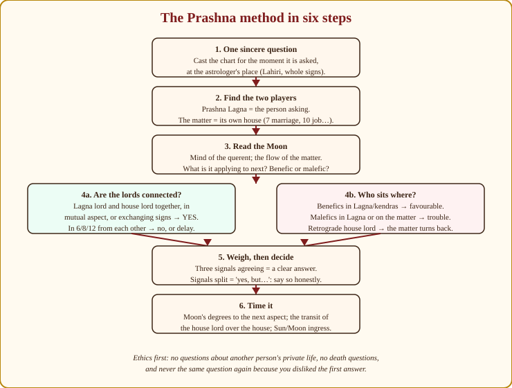
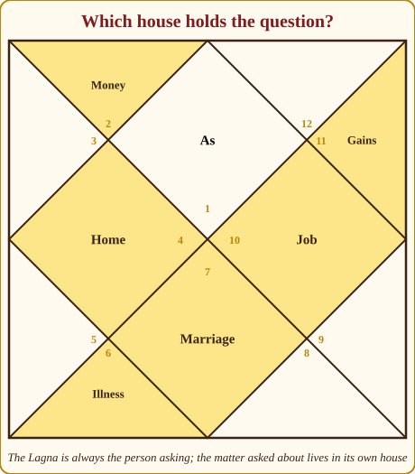
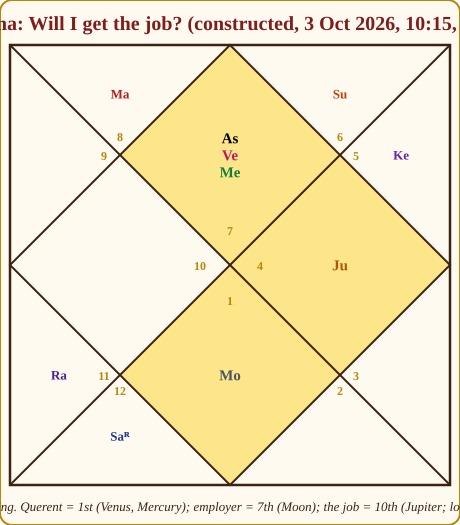

# Chapter 17: Prashna — When There Is No Birth Time

A woman of about sixty came to me years ago with a question about her son's marriage and, when I asked for her son's birth details, produced a torn school certificate with a date and nothing else. "The midwife said evening," she offered. "Or it may have been morning." Half the people in India over a certain age have a birth time like this — and a chart without a birth time is a photograph without focus (Chapter 1).

So I did what astrologers have done for two thousand years when the birth chart is missing: I cast a chart for **that moment** — the minute she asked, in my room — and read her question from it. That is **Prashna** (the Sanskrit simply means "question"), the horary branch of Jyotish. It is the oldest branch after the calendar, it needs no birth data, and it is one of the most satisfying things you will learn, because the sky answers a question *while the person is still sitting in front of you*.

## What Prashna is, and when to use it

The principle is this: **the moment a sincere question is asked is itself a birth** — the birth of the question. Cast the chart for that instant, at the place where the question is received (the astrologer's place, by tradition), with the same tools you already know: Lagna, houses, planets, aspects. Then read the chart *as the question*, not as a person.

> **📖 Story: The messenger at the gate.** A messenger runs up to the palace gate with a sealed question and knocks. The court does not ask when the messenger was born. It notes which district's banner flies over the gate at that exact minute (the Prashna Lagna — the messenger himself), sees which courtiers are sitting in which rooms, and reads the answer from how the court happens to be arranged the moment the knock is heard. A knock a minute earlier or later, or at a different gate, would meet a different arrangement — which is why the moment must be the true one: when the question is really asked, where it is really received. **Rule:** cast the Prashna chart for the minute the sincere question is spoken, at the astrologer's place; the Lagna is the querent.

When do I use it?

- **No birth time, or an unreliable one.** The commonest case in India.
- **Lost objects and missing persons.** Prashna's most famous use — and its most testable.
- **Yes/no questions with a deadline.** "Will the deal close this month?" "Will my visa come?" "Will I get the job I interviewed for?"
- **As a cross-check** on a birth chart whose reading is unclear — a second, independent witness.
- **For a matter about which the birth chart is silent** — a specific event too small for a Mahadasha to show.

And when do I *not* use it? When the question is idle ("what about my career, generally?"), when the same question has been asked already and the person is shopping for a nicer answer, or when the question is about someone who has not consented. More on that under ethics.

> **🧭 Guruji's rule of thumb:** One question, sincerely asked, one chart. Prashna answers the question that was *asked*, not the one you wish had been asked; and it answers a burning question far more clearly than a casual one.

### The mindset: sincerity is the birth time

In a natal chart, the birth time is given by the clock. In Prashna, the "birth" is the moment the question becomes real for the asker — when they stop turning it over and actually ask. The old texts insist on this: the querent should come with the question in mind, having bathed or at least composed themselves, and the astrologer should cast the chart at the moment the question is spoken, not when the appointment was booked. In practice I note the time the client *finishes* stating the question, and I do not let them ask a second question on the same chart. If they have two questions, the second gets its own chart, cast when it is asked. This is not fussiness; it is what makes the method work.

> **⚠️ Common beginner mistake:** Casting the Prashna chart for the time the appointment was *booked*, or for the time you *finished* the reading. The chart belongs to the moment the question is spoken. If a client phones on Monday and comes on Thursday, the Thursday minute when they ask is the birth of the question — unless they asked the whole question on the phone, in which case Monday's minute is, and you should have noted it.

### The roots

Prashna has its own classical library. **Shatpanchasika** ("fifty-six verses"), by Prithuyashas — the son of Varahamihira, 6th century — is the short, foundational text; most of the rules below descend from it. **Prashna Marga** ("the path of questions"), composed in Kerala in the 17th century by a Namboodiri astrologer, is the encyclopaedia of the subject and the backbone of the Kerala tradition, which remains the most vigorous Prashna school in India. **Krishneeya** (*Krishneeyam*), a medieval text attributed to a Krishna, is much quoted in the south for lost-object and illness questions. And the Tajaka school gave Prashna its applying-and-separating aspects through Neelakantha's **Prashna Tantra**. You do not need to read them yet; you need to know they exist, so that when a Kerala astrologer speaks of *Ashtamangala Prashna* or a Delhi astrologer of "KP horary" you know which river each stream comes from.

## The method in six steps

*Figure 17.1: The method on one page. Cast for the moment; identify the querent (Lagna) and the matter (its house); read the Moon; test the connection between the two lords and the company they keep; weigh; then time it.*

### Step 1 — Cast the chart for the moment

Same settings as always: Lahiri ayanamsa, sidereal zodiac, whole-sign houses. Time: the minute the question is asked. Place: where *you* are. (Some modern practitioners use the querent's location for phone consultations; the classical rule is the astrologer's place, and I keep to it — the question is "born" where it is received.)

### Step 2 — Identify the two players

The **Prashna Lagna is the person asking** (the querent), always, whatever the question. The **matter asked about lives in its own house**, and you know the houses from Chapter 4:

*Figure 17.2: The querent is always the 1st house. Money lives in the 2nd (and gains in the 11th), home and lost household objects in the 4th, illness and enemies in the 6th, marriage and the "other party" in the 7th, job and career in the 10th.*

| Question | House (and its lord) | Also look at |
|---|---|---|
| Marriage — "will it happen?" | 7th | Venus; the Moon applying to the 7th lord |
| Job, promotion, career | 10th | The 6th (service), the 11th (gains); Sun, Saturn |
| Money, recovery of lent money | 2nd, 11th | Jupiter; the 2nd for recovery of what was lost |
| Illness, enemies, court cases | 6th (and the 8th for chronic or dangerous) | Lagna lord vs 6th lord; the Moon's condition |
| A lost object at home | 4th | Its lord; the 7th lord as "the thief"; the 2nd for recovery |
| A missing sibling / a letter / a short journey | 3rd | Mercury |
| A long journey, a visa, a foreign move | 9th (long), 12th (foreign, settlement), 3rd (short) | The Lagna lord's movement |
| Children | 5th | Jupiter |
| Property, vehicle, mother | 4th | Venus, Moon |
| A partner, an opponent, the other party in any dealing | 7th | Its lord's relation to the Lagna lord |

The **other party** deserves a word. In every question with two sides — a marriage, a lawsuit, a negotiation, a job interview — the querent is the 1st and the other side is the **7th**. So in a job question the 10th is the job and the 7th is the employer; in a court case the 7th is the opponent; in a lost-object question the 7th lord is, by long tradition, the thief.

### Step 3 — Read the Moon

The Moon in Prashna does two jobs. It is the **mind of the querent** — its sign, house and condition show what state they are in, and whether the question is sincere and urgent (a Moon in the 6th, 8th or 12th, or in a sharp nakshatra like Ashlesha or Mula, often marks anxiety, confusion, or a question already half-answered). And it is the **flow of the matter**: the Moon is the fastest body, so what it is *about to do* — the next planet it will conjoin or aspect by degree — shows what comes next. Moon applying to a benefic, or to the lord of the house asked about: the matter is coming together. Moon applying to a malefic, or separating from the house lord with nothing ahead: the matter is slipping.

> **📖 Story: The Queen Mother carries the message.** In the Prashna court the Queen Mother (the Moon) is the one who carries the messenger's sealed question from room to room, and she is the quickest walker in the palace. Watch where she is heading. If her next stop is Guru-ji's room or the room of the matter's own lord, the question is about to be answered kindly; if she is walking toward the Commander or the old Judge with nothing gentle between, the answer is delayed or harsh; if she has just left the matter's lord and is walking away, the chance has passed. Her own mood — the district she stands in, the street she walks — is the querent's state of mind. **Rule:** the Moon is the querent's mind and the flow of the matter; what it applies to next is what comes next.

### Step 4 — Test the connection, and the company

**The connection.** The heart of the judgement is the relationship between the **Lagna lord** (the querent) and the **lord of the house asked about** (the matter):

| Signal | Reading |
|---|---|
| 🟢 The two lords **together in one sign, in mutual aspect, or exchanging signs** (Parivartana, Chapter 10) | **Yes.** The person and the matter are in contact |
| 🟡 **One aspects the other, but not both** | *Yes, with effort* — whichever is aspecting is doing the reaching |
| 🔴 The two lords **in 6, 8 or 12 from each other**, no aspect | **No, or a long delay.** They cannot see each other |
| 🟢 The matter's natural karaka (Venus for marriage, Jupiter for children and money, Sun and Saturn for a job) joins the connection | The yes grows firmer |

> **📖 Story: Two courtiers who must meet.** Every question is a meeting between two courtiers: the lord of the door (the querent) and the lord of the room the question is about. If they sit in the same room, or can see each other across the courtyard (mutual aspect), or have swapped rooms for the day (exchange), the business is done — yes. If one can see the other but not the reverse, the one who is looking will have to do the walking — yes, with effort. But the palace has wings with no windows between them: rooms 6, 8 and 12 from each other. Two courtiers in those wings can shout all day and never be heard — no, or not until one of them moves. **Rule:** Lagna lord and house lord together, in mutual aspect or in exchange → yes; in 6/8/12 from each other → no or delay.

**The company.**

| Signal | Reading |
|---|---|
| 🟢 Benefics in the Lagna or in the kendras (1, 4, 7, 10) | Favourable; the querent is supported |
| 🔴 Malefics in the Lagna | Trouble for the querent, or a troubled state of mind |
| 🔴 A malefic *in the house asked about* | Obstruction in the matter itself |
| 🟡 A **retrograde** house lord | The matter turns back, is reconsidered, or returns — excellent for a lost object, worrying for a marriage |
| 🟡 A **combust** house lord | The matter is hidden, or overpowered by an authority |

### Step 5 — Weigh and decide

Three signals agreeing — connection, Moon, company — give a clear answer, and you may say it plainly. Signals split give "yes, but" or "no, unless", and the honest reading says which "but". Never force a split chart into a single word; the client deserves the shape of the answer, not a coin toss.

### Step 6 — Time it

Three tools, in order of my trust. First, **the Moon's degrees to its next exact aspect or conjunction** with the relevant planet: the classical conversion counts each degree as a day in a movable sign, a week in a dual sign, a month in a fixed sign — coarse, but often right in kind. Second, **the transit of the house lord** or of the Moon over the house asked about, or of the Sun over the Lagna or the house — the Sun's ingress into a new sign is a reliable "the matter becomes public" marker. Third, the number of signs between the two lords, read as days, weeks or months by the querent's evident urgency. Timing is the weakest part of Prashna; say "within about" and never "on".

### Ithasala and Ishrafa — the Tajaka borrowing

Chapter 15 introduced the two Tajaka yogas that Prashna borrowed wholesale. **Ithasala**: the faster planet is *applying* — moving toward exact aspect (in Tajaka's geometric sense: conjunction, sextile, square, trine, opposition) with the slower — and has not yet reached it: the matter is *coming*. **Ishrafa**: the exact aspect is *past* and the faster planet is separating: the matter *was* possible and is now leaving. In a Prashna chart, look for Ithasala between the Moon and the house lord, or between the Lagna lord and the house lord; it is the sharpest yes/no tool the tradition has. Keep it labelled as Tajaka, and keep its geometric aspects out of your Parashari natal work.

### The Arudha of Prashna — the sign the client touches

The South Indian schools add a beautiful device. Before the reading, the querent is asked to **touch or point to a part of a zodiac diagram** (a *rashi chakra* drawn on a board, or a set of twelve marked positions), or in Kerala to place a gold coin on it; the sign chosen is the **Arudha** (sometimes *Arudha Lagna* — a different thing from Jaimini's Arudha in Chapter 15, so mind the name). The Arudha is read beside the Prashna Lagna as a second ascendant: the Prashna Lagna is what the sky says, the Arudha is what the querent's own hand says, and their agreement or disagreement is itself a signal (Arudha in the 6th, 8th or 12th from the Prashna Lagna is unfavourable). Kerala's *Ashtamangala Prashna* elaborates this with cowrie shells, a lamp, and 108 counted shells — a full ritual I mention so that you recognise it, not so that you attempt it from a book.

## Special topics

**Lost objects.** The most-asked Prashna in any village. The **4th house** is the object if it is a household thing; its lord's position tells you where. The **Moon in a fixed sign** → the object is still where it was put, not moved; in a movable sign → it has travelled; in a dual sign → it is between places, perhaps in a bag or vehicle. The **sign of the 4th lord** gives the **direction** (fire signs east, earth south, air west, water north — Appendix A.1) and, by its nature, the kind of place (water signs near water or damp; earth signs low, in the ground or under things; air signs high, on shelves; fire signs near the kitchen or heat). The **7th lord** stands for a thief if theft is suspected: if the 7th lord is in the Lagna or aspects it, the taker is known to the querent; in the 4th, a household member; retrograde, the object will be returned. The **2nd house** and its lord show recovery: a benefic there or the 2nd lord applying to the Lagna lord → it comes back. **Ketu** in the 4th or with the 4th lord is a classical sign the object is gone.

> **📖 Story: The Judge walks backwards.** When a courtier walks backwards through his district — a retrograde planet — he goes over ground he has already covered, and that is exactly what a lost object needs. If the lord of the 4th room, or the 7th lord who stands for the taker, is walking backwards, the thing comes back, or the taker returns it. In a marriage question the same backward walk is less welcome: the proposal is reconsidered, the engagement retraced. **Rule:** a retrograde house lord means the matter turns back — good for recovery, cautionary for commitments.

**Illness.** The **6th** is disease, the **8th** danger and chronicity, the **Lagna** the patient's body. Compare the **Lagna lord and the 6th lord**: Lagna lord stronger, or in a kendra with benefics → recovery; 6th lord in the Lagna or stronger → the illness has the upper hand. The Moon afflicted in the 6th or 8th → long convalescence. Prashna on illness is for *the course of the matter*, never for diagnosis; send the person to a doctor first and always.

**Travel and settlement abroad.** The **3rd** for short journeys, the **9th** for long ones, the **12th** for foreign residence. The Lagna lord in a movable sign or in the 3rd, 9th or 12th → the journey happens; in a fixed sign in the 4th → the person stays home. The 12th lord connected to the Lagna lord → settlement abroad. Saturn in the 9th → delays with papers.

**Marriage.** The **7th** and its lord, **Venus**, and the **Moon applying to the 7th lord**. Lagna lord and 7th lord in mutual aspect or together → yes; Venus in a kendra → soon; Venus combust or in the 6th/8th/12th → not yet. A malefic in the 7th → friction in the match or a broken engagement; Saturn there → delay but not denial.

**Litigation.** The querent is the **Lagna**, the opponent the **7th**. Whichever lord is stronger, better placed, and better aspected wins; the **6th** is the case itself and the **10th** the judge. Lagna lord in the 6th → the querent is the aggressor and struggles; 7th lord in the 12th → the opponent loses. Retrograde 6th lord → adjournments.

**"Will I get the job?"** The **10th lord**, the **Lagna lord**, and the **Moon**: any two of the three connected → yes. The **7th** is the employer; the **11th** is the offer letter and the salary. **Saturn** well placed → a job of service or a long-term post; the **Sun** strong → government or authority. We will do this one in full below.

## KP — the modern horary many Indian consultants use

You will meet consultants who ask a client to "give a number between 1 and 249" before answering. That is **Krishnamurti Paddhati (KP)**, the system devised by K.S. Krishnamurti (1908–1972) of Tamil Nadu, and it is worth a page because it is probably the most widely used Prashna method in India today.

KP keeps the sidereal zodiac, the 27 nakshatras and the Vimshottari lords — so far, familiar — but changes three things. First, **the sub-lord**: each nakshatra is divided into nine unequal **subs** in Vimshottari proportions (Ketu's sub 7 parts, Venus's 20, the Sun's 6, and so on out of 120), and KP's central claim is that **the sub-lord of a house cusp decides whether that house gives its result**, and the star-lord decides *how*. Second, **Placidus houses**: KP uses the unequal Western house cusps, so a house can begin in the middle of a sign, and the cusp's sign-lord, star-lord and sub-lord are each read. Third, **the ruling planets**: at the moment of judgement, the lords of the weekday, the Moon's sign and star, and the Lagna's sign and star are taken as the planets "ruling" the question, and used for timing. The **1–249 number** is the KP horary shortcut: the zodiac's 249 subs are numbered, the querent chooses one, and the Lagna is set to the start of that sub — so the querent's own choice, not the clock, fixes the ascendant, and the rest of the chart is cast for the time of judgement. KP also uses its own ayanamsa, a few minutes of arc from Lahiri, and it sets aside yogas and most Parashari aspects in favour of significators by star and sub.

Its relationship to Parashari: same planets, same stars, same dasha; different houses, a different unit of judgement (the sub), and a deliberately mechanical yes/no style that many find refreshingly clear. I do not teach it in this book — it is a system, not a technique, and deserves its own — but I want you to recognise it, respect its results when they are good, and never mix Placidus cusps or sub-lords into a whole-sign Parashari chart. Mixing systems is the beginner's disease in every branch of astrology, and Prashna is where the temptation is strongest.

> **💡 Did you know?** Horary astrology was once the *main* work of court astrologers from Baghdad to Ujjain. The Arabic and Persian masters of the 9th to 12th centuries — whose methods entered India as Tajaka — treated the natal chart as a luxury and the question chart as the daily tool, because most people simply did not know when they were born. The 17th-century English astrologer William Lilly built a career, and a famous book, on exactly the lost-object and "will I marry" questions that Indian village astrologers were answering at the same time, with much the same rules. The method is older than the birth chart's popularity and it has not changed much because it did not need to.

## Ethics — the three refusals

Prashna is powerful and intimate, and it needs rules the natal chart does not.

**No question about another person's private matters without their consent.** "Is my husband having an affair?" "Will my brother's business fail?" — the sky may show something, but the person concerned did not ask and did not agree. The exception is a parent asking about a minor child, or a family asking about someone missing or unwell who cannot ask. Otherwise, gently decline: "I can read *your* question — what should you do about this? — but not his private life."

**No death questions.** Not "when will he die", not "will she survive the operation", not from anyone, for any fee. The tradition forbids it, it is nearly always wrong in the specifics, and even when it is right it does harm. Illness questions are answered as *course and care*, never as life and death.

**Do not repeat the question.** A chart answers once. If the client dislikes the answer and asks again next week, the second chart is not a second opinion; it is noise, and the classical texts say it lies. If the *situation* genuinely changes, a new question may be asked; a change of mood is not a change of situation.

And one more, mine rather than the texts': **do not create urgency**. Prashna's timing tools are the weakest part of the method, and a nervous client will hear "within about three weeks" as a countdown. Say "around" and mean it.

## A full worked Prashna

Let me construct one from beginning to end — the chart is constructed for teaching, with positions plausible for the date.

**The question.** A young man, aged around thirty, asks: *"Will I get the job I interviewed for last week?"* Asked at **10:15 am, 3 October 2026, Delhi**, in my room. He states it clearly and stops. I note the time.

**The chart.** At 10:15 on an early-October morning in Delhi, about four hours after sunrise, **Libra** is rising — I take the Lagna at about 20° Libra. The Sun, in early October, is at about 16° sidereal Virgo. Placing the rest plausibly for the date:

| Planet | Sign, degree | House from Libra | Signal for the question |
|---|---|---|---|
| Sun | Virgo 16° | 12th | 🟡 The authority is out of sight |
| Mercury | Libra 3° | 1st | 🟢 Benefic in the Lagna |
| Venus | Libra 14° | 1st | 🟢 Lagna lord strong in own sign |
| Mars | Scorpio 10° | 2nd | 🟡 Heat in the money house |
| Jupiter | Cancer 20° | 10th | 🟢 Exalted benefic in the matter's house |
| Saturn (retrograde) | Pisces 6° | 6th | 🟡 Service house; process repeats |
| Rahu | Aquarius 2° | 5th | 🟡 Not touching Lagna or 10th |
| Ketu | Leo 2° | 11th | 🟡 In the offer house, but quiet |
| Moon | Aries 8° (Ashwini) | 7th | 🟢 10th lord applying to Lagna lord |

The Moon at 8° Aries is 202° ahead of the Sun — the second tithi after the full Moon, Krishna Dwitiya — still bright and strong. Mercury, at 17° from the Sun, is outside its 14° combustion orb; Venus is at 28°. (For any real question you will let the software place the planets; the *reasoning* below is what you are learning.)

*Figure 17.3: The Prashna chart. Libra rises with Venus (its own lord) and Mercury in the 1st — the querent. The Moon, lord of the 10th (the job), sits in the 7th (the employer). Jupiter is exalted in the 10th. The Sun, the authority, is in the 12th. Saturn is retrograde in the 6th, the house of service.*

**Step 2 — the players.** Querent = Lagna, Libra; Lagna lord **Venus**, in the Lagna itself, in its own sign, with Mercury — a composed, articulate, well-presented querent who is in a strong position. The matter = the **10th house, Cancer**, whose lord is the **Moon**. The employer = the **7th house, Aries**, lord Mars. The offer and salary = the 11th (Leo) and 2nd (Scorpio).

**Step 3 — the Moon.** The Moon — both the querent's mind and the 10th lord, the job itself — sits in the **7th house**, the employer's house, in Aries, a movable sign: the job is in the employer's hands right now and the matter is moving quickly. The Moon is bright (two days past full), in Ashwini, a quick nakshatra. It is at 8° Aries, and Venus is at 14° Libra, exactly opposite: the Moon is **applying**, six degrees from an exact aspect with the Lagna lord — a textbook Ithasala between the 10th lord and the Lagna lord. The matter is coming toward the querent, and fast (six degrees in a movable sign → about six days for the first signal).

**Step 4 — the connection and the company.** Lagna lord Venus in Libra; 10th lord Moon in Aries: they are in **mutual 7th-house aspect** — a full aspect each way. The querent and the job see each other. That alone is a yes. The company: **Jupiter, exalted in Cancer, in the 10th** — a great benefic, in its exaltation sign, sitting in the house asked about. (For a Libra Lagna Jupiter owns the 3rd and 6th and is not this Lagna's functional friend, Appendix A.6 — but in a Prashna the natural benefic's strength in the *matter's* house is the louder signal, and the 6th lord — *service* — sitting in the 10th — *career* — is almost a literal sentence: "employment in the career house".) Benefics in the Lagna: Venus and Mercury. Benefics in kendras: Venus, Mercury (1st), Moon (7th), Jupiter (10th). No malefic in the Lagna or the 10th. Saturn — Libra's yogakaraka, and the karaka of service — is **retrograde in the 6th, the house of service**: the job is real, but the process doubles back on itself, a second round or a repeated document. Mars in the 2nd, own sign: a firm, slightly heated salary conversation. The **Sun in the 12th**: the final authority — the person who signs — is behind a closed door, away, or in another office; the approval is not in the interviewer's hands.

**Step 5 — the decision.** Three signals agree: the mutual aspect of the lords, the applying Moon, and the exalted benefic in the 10th with a clean Lagna. **Yes** — he gets the job. The "but": Saturn retrograde in the 6th and the Sun in the 12th say the confirmation comes in two stages and the formal letter waits on an authority who is not yet visible.

**Step 6 — the timing.** The Moon reaches exact aspect with Venus in about six degrees — the first signal (a call, a second-round invitation, an informal "you are selected") within about a week. The **Sun enters Libra, the Prashna Lagna, around 17 October**: the authority walks into the querent's house; the formal offer should follow in the second half of October. Saturn's retrograde in the 6th warns of one repetition — a document to resend, a medical, a reference re-checked — before the letter. I would say: *"Yes. Expect the first good news within a week, the formal letter after the middle of October, and one round of paperwork you thought was finished. Negotiate the salary firmly but not hotly; Mars is in your money house."*

**What I would not say:** "Yes, on the 19th." Prashna does not know the date. It knows the shape.

> **🪔 Consultation tip:** Give a Prashna answer in three sentences — the answer, the shape, the action — and stop. "Yes; in two stages, with the letter after mid-October; meanwhile keep your references warm." A horary client came for a decision, not a lecture, and a short clear answer is what earns the trust to be asked the next, harder question. If the chart says no, say it as *"not this one"*, name what the chart shows blocking it, and turn at once to what the querent can do — the 11th house, the next opening, the timing of the next attempt. Prashna is a lamp, not a gavel.

## In one breath

- Prashna casts a chart for the moment a sincere question is asked, at the astrologer's place, and reads the question from it; it needs no birth time.
- One question, sincerely asked, one chart; never the same question twice.
- The Lagna is the querent; the matter lives in its own house (7th marriage, 10th job, 2nd/11th money, 6th illness, 4th lost household objects); the 7th is always the other party.
- The Moon is the querent's mind and the flow of the matter — what it applies to next is what comes next.
- Lagna lord and house lord together, in mutual aspect, or exchanging → yes; in 6/8/12 from each other → no or delay; benefics in Lagna and kendras favour, malefics in the Lagna or the matter obstruct.
- Time by the Moon's degrees to its next aspect, by the house lord's or the Sun's transit, and always say "around".
- Ithasala (applying) and Ishrafa (separating) are Tajaka borrowings; the Arudha of Prashna is the South's touched-sign method; KP is the modern sub-lord horary with its 1–249 number — recognise all three, mix none into Parashari.
- Ethics: no third-party private questions without consent, no death questions, no repeats, no manufactured urgency.

## Practice

> **✍️ Practice:**
> 1. A question about marriage is asked with Capricorn rising. Saturn is in Capricorn; the Moon (7th lord) is in Virgo. Is the connection a yes, a no, or a delay? What else would you check?
> 2. A lost-objects question: Taurus rising, the 4th lord Sun is in Sagittarius, the Moon is in Leo. Where would you look, and has the object moved?
> 3. In a job question with Aries rising, Mars is in the 8th and the 10th lord Saturn is in Aries. Read the connection and the company.
> 4. A client asks whether her neighbour's daughter will marry this year. What do you do?
> 5. In the worked example above, suppose the Moon had been at 8° Aries but Venus at 2° Libra. What changes in the reading?

Answers

1. Lagna lord Saturn is in the Lagna; the 7th lord Moon is in Virgo, the **9th** from Capricorn — not 6, 8 or 12. Saturn aspects the 3rd, 7th and 10th from itself (Pisces, Cancer, Libra), so it does not aspect Virgo; the Moon's 7th aspect falls on Pisces, not on Saturn. No direct connection, but no 6/8/12 separation either: a **"yes, with effort and delay"** — Saturn in the Lagna also says the querent is patient and the matter slow. Check Venus (marriage karaka) and what the Moon applies to next; if the Moon is heading toward a benefic aspect with Venus or Saturn, the yes strengthens.
2. The 4th lord Sun is in **Sagittarius**, a **fire** sign → **east**; a fire sign suggests a warm place — near the kitchen, a heater, or where sunlight falls. Sagittarius is a dual sign and the Sun is in the 8th from Taurus — hidden, tucked away. The **Moon is in Leo, a fixed sign** → the object has **not moved**; it is where it was put, probably under or behind something in the eastern part of the home. Check the 7th lord Mars: if it is with the Sun or in the Lagna, someone took it; if not, it was merely misplaced.
3. Lagna lord Mars in the **8th** (Scorpio): the querent is anxious, feels kept in the dark, and is in a weak position. The 10th lord Saturn in **Aries**, the Lagna, is in the **6th from Mars** — a 6/8 relationship — and neither aspects the other (Mars glances at Aquarius, Taurus and Gemini; Saturn at Gemini, Libra and Capricorn). By the rule, **no, or a long delay**. The company confirms it: Saturn is debilitated in Aries (Appendix A.2), a weak malefic sitting on the querent — the job knocks at his door in a poor form, with heavy conditions, while his own position is unstable. Reading: *"not this one, or not on these terms"*. Check the Moon's next aspect before answering; only a Moon applying to Saturn or Mars would soften this to a delayed yes.
4. **Decline the question as asked.** The neighbour's daughter has not consented, and her marriage is her private matter. Offer what can honestly be read: the client's own question — "how should I respond to this family's proposal for my son?" — cast as *her* Prashna, or, if the daughter herself wishes, her own question in her own words.
5. With Venus at 2° Libra and the Moon at 8° Aries, the Moon is **six degrees past** the exact opposition — an **Ishrafa**, separating. The mutual aspect by sign still stands (a whole-sign yes), but the Tajaka refinement says the moment of closest contact has *just passed*: the position may already have been decided, possibly for someone else, or the offer has been made to another and may fall to the querent only if that person declines. The reading softens from "yes, fast" to "yes if the first choice falls through; otherwise not this one" — and honesty requires saying so.

