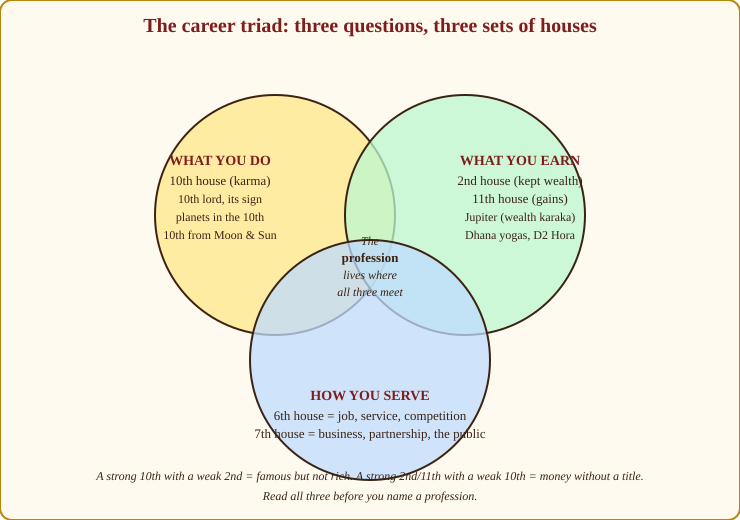
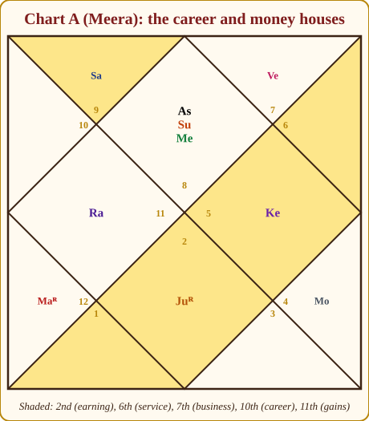
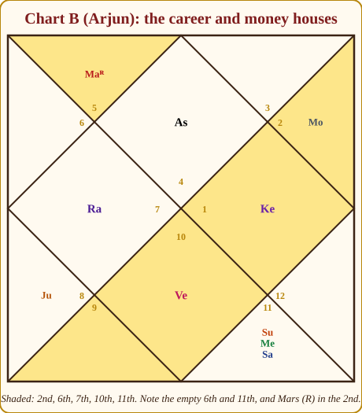

# Chapter 18: Career and Wealth, "What Work Suits Me, and Will I Have Money?"

Of the people who ask me to look at their charts, most ask about work or money before anything else. Not marriage, not health, work. "Should I take the transfer?" "Will my business run?" "My son has finished engineering and wants to become a chef; will he starve?" And underneath every one of these questions is the same two-part worry: *what am I meant to be doing, and will it feed my family?*

This chapter gives you a method for both halves. Seventeen chapters have built the grammar; now we use it the way a client needs it. You get a checklist to run in the same order every time, two worked charts, and the exact words I use at the table, because how you say it matters as much as what you find.

One promise before we begin. I have promised myself never to tell a young person "you will not succeed": not because I am soft, but because the chart cannot say it. A chart shows *which road is downhill for you*. It never says you cannot climb.

## The career triad: three questions, not one

Beginners look at the 10th house and stop. That is like judging a restaurant by its signboard. The 10th tells you *what you do*; it says nothing about whether you are paid well for it, or whether you do it as an employee or your own boss. For those you need two more sets of houses.

*Figure 18.1: The career triad. The profession a person actually lives is found where all three circles overlap.*

**What you do: the 10th house (Karma bhava).** The 10th is the top of the chart, the midday Sun, the most visible point. Whatever sits here is seen by the world. Its lord, the sign on it, its occupants and the planets that aspect it describe the *shape* of your work: leadership or service, hands or head, public or private.

> **🔍 Why?** (Astronomy, then logic.) The 10th house is the meridian, the point directly overhead where the Sun stands at noon. Nothing in the sky is more visible than what is there. So the 10th became the house of what the world sees you doing: your public action, your karma in the plain sense of "work". Everyday parallel: a shop sign facing the main road. Whatever is painted on it is what the whole town believes you do.

**What you earn: the 2nd and the 11th.** The 2nd house (Dhana) is what you *keep*: savings, family wealth, the food on the table, and, remember from Chapter 4, speech, which is why so many people earn through their voice. The 11th (Labha) is what *comes in*: gains, income streams, the networks that send work your way. A chart can have a magnificent 10th and a hollow 2nd (the famous man who dies in a rented room is a real type) or a modest 10th and a fat 11th: the quiet trader who owns four buildings.

> **🔍 Why?** (Logic from the system's grammar.) The 2nd is the house next to the self: what you hold close, in hand and mouth, so food, speech and stored wealth. The 11th is the 2nd from the 10th, that is, the "holdings" produced by your work: earnings. It is also the 6th from the 6th, enemies of your enemies, so it is gains that overcome obstacles. Parallel: the 11th is the salary credited on the first; the 2nd is what is still in the account on the thirtieth.

**How you serve: the 6th and the 7th.** This pair is the least taught and the most useful. The 6th house is service, competition, daily routine, the boss above you: in plain words, *a job*. The 7th house is partnership, the public, other people's money coming to you across a counter: in plain words, *business*. Also recall the Bhavat Bhavam idea (Appendix A.5): the 10th from the 10th is the 7th, so the 7th is a second career house in its own right. That is the classical reason the 7th shows business.

> **🔍 Why?** (Logic.) The 6th is the 12th from the 7th: the loss of the "other party" as an equal, which is what an employee agrees to. You surrender independence for a fixed reward, under someone's roster. The 7th is the other person you meet as an equal: the customer across the counter, the partner who signs beside you. Parallel: the same cook can be a salaried employee in a canteen (6th) or run her own tiffin service for the same customers (7th).

> **🧭 Anushka's rule of thumb:** 10th = the title on your visiting card. 2nd and 11th = the balance in your passbook. 6th and 7th = whether the card says "Manager" or "Proprietor". Read all three before you open your mouth.

> **📖 Story: Three rooms of the haveli.** Walk through the old family haveli with me. The 10th house is the *workshop* on the roof terrace, open to the sky, where the world can see what you make, the King likes to inspect it at noon. The 2nd and 11th are the *treasury*: the 2nd is the locked iron chest where the family gold is kept, the 11th the front counter where the day's takings come in. And the 6th and 7th are the *servants' hall* and the *shop front*: in the 6th you work for the household under the old Judge's roster; in the 7th you open your own door onto the market and deal with strangers. A friend once asked me why his brilliant workshop had never filled the chest. His treasury doors, I showed him, opened outward, the 12th was stronger than the 2nd. **Rule:** 10th = what you do; 2nd and 11th = what you earn and keep; 6th and 7th = job or business. Judge career from all three rooms.

## Job or business? Reading the 6th against the 7th

This is the question I am asked most by people in their late twenties, and the chart answers it fairly reliably.

**The chart leans toward service (a job) when:** the 6th house or its lord is strong, occupied, or connected to the 10th; Saturn (the servant of the court, discipline, hierarchy) or Mercury (the clerk, the secretary) influence the 10th or its lord; the 10th lord sits in the 6th; or the 10th falls in a fixed sign with Saturn's aspect. Give such people structure and they build empires *for* someone.

**The chart leans toward business when:** the 7th and 10th are connected; Mercury (trade), Venus (goods, pleasures, luxury) or Jupiter (counsel, finance) sit in or rule the 7th or 10th; planets in the 10th are in their own signs (a planet in its own house does not like to take orders); the 10th lord is in the 7th or the 11th; or Mars in strength gives the appetite for risk. These people chafe under a boss by thirty.

**Special flavours in the 10th:**

- **Sun or Mars in the 10th**, Sun has directional strength here (Appendix A.2); this is the classic signature of authority, government, administration, uniformed service, and any work where one gives orders.
- **Rahu in the 10th**, foreign connection, technology, the unconventional, a career that did not exist a generation ago. Rahu here is ambitious and often climbs high by an unusual door.
- **Ketu in the 10th**, the headless ascetic in the career house. Either frequent changes and a detachment from ambition, or a career that is itself research or spiritual work: astrology, healing, mathematics, coding. Ketu here does not mean "no career"; it means the person cannot fake enthusiasm for work that has no meaning for them.

> **📖 Story: Salaried in the Judge's office, or your own shop in the market.** Two cousins left the village together. One took a post in Shani-ji's office, the old Judge of Labour keeps strict hours, pays on the first of the month, and promotes slowly but surely; the young Prince Mercury sits at the next desk keeping the ledgers. That is the 6th house: service, routine, a roof over your head that someone else owns. The other cousin rented a stall in the 7th-house market, where Shukracharya sells silks, Mercury brokers deals and Guru-ji advises for a fee. No salary, no roster, but every planet sitting in its *own* sign refuses to take orders, and every strong 7th wants its own signboard. The first cousin thought the second reckless; the second thought the first asleep. Both were reading their charts correctly. **Rule:** 6th strong, Saturn/Mercury on the 10th → service. 7th–10th linked, Mercury/Venus/Jupiter or own-sign planets there → business.

Many charts are mixed, a job first, a business after forty, or employment that behaves like a practice (doctors, lawyers, consultants). Say so: "Your chart supports both; the first half looks structured, and after your Rahu period begins you will want your own name on the door."

## Naming the profession: the four sources

Now the harder question: not job or business, but *which field*. Classical texts give a beautiful rule for this, and it is a good example of why our tradition tells us to read from three reference points.

**Judge the 10th house from the Lagna, from the Moon and from the Sun. Whichever of the three is strongest: most occupied, best-dignified lord, describes the profession.** (Chapter 9 reminded you always to check a house from the Moon as well as from the Lagna; here the Sun joins in, because the Sun is the natural karaka of the 10th and of one's standing in the world.)

> **🔍 Why?** (Classical statement, with a logic behind it.) Parashara and Varahamihira both direct the astrologer to judge livelihood from the 10th counted from the Lagna, the Moon and the Sun. The reason: the Lagna is the body and its circumstances, the Moon is the mind and what it enjoys, the Sun is the soul and its standing. Work lives in all three. Parallel: before a wedding, families ask three different relatives about the same boy, because each sees a different side of him.

From these three 10th houses, gather four pieces of evidence:

1. **The sign of the 10th lord.** Where does the ruler of your career house *sit*? A 10th lord in a fire sign works with energy, leadership and heat; in water, with emotions, people and liquids; in air, with ideas, trade and communication; in earth, with material, money and land.
2. **Planets in the 10th.** An occupant of the 10th is louder than its lord.
3. **The planet in the 10th from the Moon and from the Sun.** These are often the "what I really enjoy" and "what gives me respect" layers.
4. **The Dasamsa (D10).** Chapter 11 introduced this divisional chart of career; the sign on the D10 Lagna and the planets in its 10th house confirm or refine what D1 says. If D1 and D10 agree, speak with confidence. If they disagree, the person often has a public role and a private skill that differ.

If the 10th is empty from all three points, judge by its lord, and by the planet whose dasha is running, people change lanes with their dashas.

### The planet-to-profession table

> **📖 Story: What each courtier does when he leaves the court.** Imagine the court dissolved for a year and every courtier sent to earn his own bread. The King opens a government office or a hospital and gives orders. The Queen Mother runs a guest-house and feeds the town. The Commander joins the police, or builds houses, or operates. The young Prince opens a shop, an accountancy, a newspaper, a coaching class. Guru-ji teaches, judges, banks and blesses. Shukracharya opens a boutique, a jewellery house, a cinema. Shani-ji goes to the mines and the fields, the iron foundry and the old-age home, and is the last to leave every evening. The Smoke-headed Stranger sells foreign machines, flies aeroplanes and speculates. The Headless Sadhu sits under a tree doing mathematics and reading horoscopes. Nobody had to tell them where to go; their characters chose. **Rule:** a planet's profession is its court character taken to the market. Derive the table; never memorise it.

Here is the table I keep in my head. Every row follows from the planet's character in Chapter 3. The dot shows the planet's natural nature at work (🟢 benefic, 🔴 malefic, 🟡 mixed or conditional); a malefic does not mean a bad career (the navy Saturn builds the longest ones); it means the work is harder and slower.

> **🔍 Why?** (Derivation from the karakatwas in Appendix A.2, with tradition for the modern fields.) Each row is the planet's significations taken to the market: the Sun signifies authority and government, so government and administration; the Moon signifies the public and fluids, so hospitality and nursing; Mars signifies blood and land, so surgery and real estate; Saturn signifies labour and old age, so mines and elderly care. Aviation for Rahu and coding for Ketu are the tradition's extensions, not the classics. Parallel: you can guess a person's trade from what they talk about at a wedding dinner.

| Planet | Nature | Fields it points to |
|---|---|---|
| Sun | 🟡 mild malefic | Government, administration, medicine, politics, leadership, father's line of work |
| Moon | 🟡 benefic when bright | Dealing with the public, hospitality, nursing, liquids, women's goods, psychology, food |
| Mars | 🔴 malefic | Engineering, army and police, surgery, sports, real estate and construction, mechanical trades |
| Mercury | 🟡 takes its company's nature | Commerce, accounting, writing, teaching, IT and communication, law, brokering |
| Jupiter | 🟢 great benefic | Teaching, law, finance, priesthood, counselling, banking, publishing |
| Venus | 🟢 benefic | Arts, fashion, beauty, entertainment, luxury goods, hospitality, jewellery, design |
| Saturn | 🔴 great malefic | Labour, mining, oil, iron and heavy industry, real estate, agriculture, the judiciary, elderly care, long-term institutions |
| Rahu | 🔴 shadow malefic | Technology, foreign trade, aviation, pharmaceuticals, photography and film, speculation, politics |
| Ketu | 🔴 shadow malefic | Research, mathematics, astrology, coding, diagnostic medicine, spiritual work |

### The sign-to-field table

The sign of the 10th house (and of the 10th lord) tints the planet's field:

| Sign of the 10th / 10th lord | Field and style |
|---|---|
| Aries | Initiative, engineering, defence, sport, surgery, starting things |
| Taurus | Finance, food, agriculture, luxury goods, music, steady wealth |
| Gemini | Communication, writing, sales, teaching, media, dual careers |
| Cancer | Public service, hospitality, nursing, real estate, the sea, the home |
| Leo | Government, administration, management, performance, politics |
| Virgo | Accounting, analysis, medicine, editing, IT, service professions |
| Libra | Law, diplomacy, arts, fashion, trade, partnerships |
| Scorpio | Research, surgery, insurance, occult sciences, investigation, chemicals |
| Sagittarius | Teaching, law, religion, philosophy, publishing, foreign relations |
| Capricorn | Administration, industry, engineering, mining, construction, long climbs |
| Aquarius | Technology, science, social work, large organisations, networks |
| Pisces | Healing, hospitals, spirituality, arts, charity, liquids, foreign shores |

> **⚠️ Common beginner mistake:** Reading the table as a menu of exactly one dish. The 10th lord Mercury in Leo does not mean "accountant in the government". It means the person communicates and manages information, in a setting where authority and visibility matter, that could be a management consultant, a school principal, a political speech-writer or the head of an IT department. Give the client the *shape*, and let them recognise the specific chair.

### The Amatyakaraka: a second opinion from Jaimini

Chapter 15 introduced the Jaimini karakas, the planets ranked by their degree within their signs. The one with the second-highest degree is the **Amatyakaraka** (AmK), the "minister" of the soul, the planet that shows how you make your living, the skill you carry into the world. When the Parashari 10th house is confusing, I look at the AmK. If it agrees with the 10th, speak firmly. If it adds a new flavour, mention it: "Your career house shows teaching; your minister-planet is Venus, so the teaching may be in an artistic or people-centred field."

## Timing career events

A profession is a road; the dashas tell you when you walk fast, when you rest, and where the bridge is. Chapters 13 and 14 gave you the tools; here is how I apply them to career.

**Periods that raise the career:**

- The **Mahadasha or Antardasha of the 10th lord**, especially if that lord is well placed.
- The dasha of **any planet sitting in the 10th** (from Lagna or Moon).
- The dasha of a **yogakaraka** or a planet forming a Raja yoga with the 10th lord (Chapter 10).
- **Rahu's dasha**, when Rahu is well placed (especially in the 3rd, 6th, 10th or 11th): sudden rises, foreign postings, big titles that arrive faster than expected, and the person must be warned to build foundations under them.

**Transits that release the timing:**

- The **double transit** (Chapter 14): when Jupiter and Saturn, by position or aspect, both touch the 10th house or its lord in the same season, career events happen. Promotions, new jobs, launches. This is my single most reliable timing tool for work.
- **Saturn's transit over the 10th from the Moon**: I call it "Saturn on the job". For about two and a half years the person feels the weight of responsibility, works harder for less praise, and usually comes out promoted or in a completely new line. Do not call it a bad period. Call it the apprenticeship.
- **Jupiter transiting the 10th, 2nd or 11th** from the Moon (its good houses in Appendix A.9 include 2 and 11): recognition, income, new offers.

> **🔍 Why?** (Astronomy and logic.) Saturn spends about two and a half years in a sign, so its stay over the 10th from the Moon is a long season, not a mood. The 10th from the Moon is work as the mind experiences it. Saturn is the Judge of Labour: load, deadlines, accountability. Put the slowest planet of duty on the house where the mind feels its work, and you get two and a half years of "why is everything so heavy". Parallel: the audit year in an office, when every file is checked and the good staff come out promoted.

**Job changes.** The 12th house from any house is its ending. The 12th from the 10th is the 9th, so a strong activation of the 9th (its lord's dasha, or Saturn/Jupiter on the 9th) often coincides with leaving a job, sometimes for a better one, sometimes for study or travel. Transits of Saturn or Rahu over the 8th house (sudden endings, the hidden) also mark disruptions at work. And a job change during the 6th lord's period is usually a lateral move within service; during the 7th lord's period, a move toward independence.

**Business start.** Look for the dasha of the 7th lord or of a planet in the 7th, a Jupiter transit over the 7th or 10th, and Mars strong by transit (courage to sign the lease). I also want the 2nd and 11th supported by the running dasha, a business launched in the 12th lord's dasha with nothing else behind it tends to eat capital.

**Foreign career.** The 12th house (foreign lands), the 9th (long journeys), Rahu (the foreigner at the gate), and movable signs on the Lagna, 10th or 12th. When the 10th lord sits in the 12th or the 9th, or with Rahu, or the 12th lord is strong in its own sign, the career has a foreign chapter. Time it with the dasha of the 12th or 9th lord and with Rahu's periods.

> **💡 Did you know?** The classical rule of judging the 10th from the Lagna, Moon *and* Sun is stated in Parashara and repeated in *Brihat Jataka*. Varahamihira goes further in his chapter on livelihood (*Karmajiva*): he says to take the lord of the sign occupied by the 10th lord, and read the profession from *that* planet's Navamsa sign, a rule some modern teachers still use as a tie-breaker.

## Wealth: will I have money, and will it stay?

Career says what you do; wealth is a separate question with its own houses. People with modest work and quiet money are common; people with big titles and no savings are more common still.

**The Dhana yogas (Chapter 10 reminder).** Wealth combinations form when the lords of the 2nd, 5th, 9th and 11th, and the Lagna lord, connect with each other by conjunction, mutual aspect or exchange. The 2nd lord with the 11th lord in the 2nd, the 5th lord with the 9th lord, the Lagna lord with the 2nd lord: these are the money knots. Count how many such links a chart has; three or more and the person will not want for money in the dashas of those planets.

**The 2nd and 11th lords.** Where they sit and how strong they are (Chapter 12) decide the *size* of the passbook. The 2nd lord in a kendra or trikona, in its own or exalted sign, means savings accumulate. The 11th lord well placed means income keeps arriving. Either of them in the 6th, 8th or 12th means the money comes with friction, debts, losses, expenses abroad, unless a Viparita yoga rescues it.

**Jupiter, the karaka of wealth.** Whatever the houses say, check Jupiter's dignity. Jupiter exalted, in its own sign or in a kendra gives a fundamental "wealth floor", such people are rarely destitute even in bad periods. Jupiter debilitated, combust or in the 6th/8th/12th from the Lagna means money must be earned with more effort, and saved with discipline.

> **🔍 Why?** (Derivation, then symbolism.) Appendix A.5 makes Jupiter the natural karaka of the 2nd, 5th, 9th and 11th, the very houses that form Dhana yogas: holdings, merit, fortune and gains. Why those four? Because 2 and 11 are money in hand and money arriving, while 5 and 9 are the trikonas of merit and grace, the luck you did not work for. Jupiter is the priest who receives offerings and distributes them, the planet of expansion. Parallel: a family that has a salary (11), savings (2) and, now and then, an unexpected windfall (5, 9) is wealthy in every sense.

**The Hora chart (D2) in one paragraph.** Chapter 11 mentioned it. In the D2 every planet falls either in the Sun's hora or the Moon's hora (the two halves of a sign). The traditional reading: more planets in the Moon's hora, wealth accumulated steadily with less struggle; more in the Sun's hora, wealth won through effort and authority. Use it only as a tint, never as a verdict.

**The 5th and the 8th.** The 5th is speculation, a strong 5th lord linked to the 2nd or 11th makes an investor; afflicted by Rahu, a gambler, and I say so gently. The 8th is inheritance, insurance, windfalls and the spouse's money; benefics there mean unearned money arrives at some point.

**"Money comes but doesn't stay."** You will hear this more than any other sentence. Look for a 12th stronger than the 2nd, Rahu or malefics in the 2nd (Saturn blocks, Mars spends, Ketu does not care), or the 2nd lord in the 12th. The remedy is rarely a gemstone; it is a budgeting habit begun in the right dasha.

Here are the wealth signals side by side, colour-coded:

| Signal | Reading |
|---|---|
| 🟢 Lords of 2, 5, 9, 11 and Lagna connected (Dhana yoga) | Money knots; wealth in those planets' periods |
| 🟢 2nd/11th lord in kendra, trikona, own or exalted sign | Savings accumulate; income keeps arriving |
| 🟢 Jupiter exalted, own sign or in a kendra | A wealth floor; rarely destitute |
| 🟡 More planets in the Moon's hora (D2) | Steadier accumulation (a tint, not a verdict) |
| 🟡 Strong 5th lord linked to 2nd/11th | Good investor; with Rahu, a gambler |
| 🟡 Benefics in the 8th or strong 8th lord | Unearned money at some point: inheritance, claims |
| 🔴 2nd/11th lord in 6, 8 or 12 (no Viparita rescue) | Money with friction: debts, losses, expenses abroad |
| 🔴 12th stronger than 2nd; 2nd lord in 12th; Rahu or malefics in 2nd | "Comes but doesn't stay" |
| 🔴 6th lord in Lagna or 2nd | Lives on credit |

**The Indu Lagna (advanced pointer).** Some texts compute a "wealth ascendant" from fixed values (kalas) of the 9th lords from the Lagna and the Moon, counted from the Moon; planets there and its lord's dasha are read for prosperity. Recognise the name; leave it until the basics are second nature.

> **🪔 Consultation tip:** Never say "you will be poor" or "you will be rich". Say what the chart actually shows: "Your chart earns through your own effort rather than inheritance; the periods that fill the passbook are your Jupiter and Mercury dashas; and you should build the habit of saving before your Rahu period, when the money will come faster than the sense to keep it."

## Worked example: Chart A (Meera)

Meera's chart is our teaching workhorse; you know it by now. Scorpio rising, Sun and Mercury in the Lagna, Moon in Cancer in the 9th, Jupiter retrograde in the 7th, Venus in Libra in the 12th, Mars retrograde in Pisces in the 5th, Saturn in the 2nd, Rahu in the 4th, Ketu in the 10th.

*Figure 18.2: Chart A with the career triad shaded. Ketu sits alone in the 10th; the 10th lord Sun and the 11th lord Mercury share the Lagna.*

**Step 1: the 10th house from three points.** From the Lagna, the 10th is Leo, holding Ketu. From the Moon (Cancer), the 10th is Aries, empty, ruled by Mars. From the Sun (Scorpio), the 10th is again Leo with Ketu. Two of three point to Leo and its lord the Sun, so the Sun's placement decides.

**Step 2: the 10th lord.** 🟢 The Sun is in the Lagna, in Scorpio, with Mercury, a Budha–Aditya yoga (Chapter 10) sitting in the most personal house of the chart. A 10th lord in the 1st means *the career is the person*: she is known for what she does, and she does it in her own name. The Sun gives authority and teaching; Mercury gives speech, writing, explanation. The combination is the classic teacher–consultant–communicator signature. Scorpio tints it toward depth: research, investigation, the subjects most people avoid.

**Step 3: occupants of the 10th.** 🟡 Ketu in Leo. Here is the flavour that makes Meera's teaching unusual: Ketu brings research, mathematics, astrology, the unconventional. A teacher, yes, but of something with a hidden or philosophical layer, and one who is not chasing titles. She may change institutions more than once, and she will resist any role that is merely a designation.

**Step 4: the D10.** Chapter 11 drew Meera's Dasamsa; recall that it supported the communication signature.

**Step 5: job or business?** The 6th (Aries) is empty; its lord Mars sits retrograde in the 5th, in Jupiter's sign. The 7th holds Jupiter retrograde. Jupiter in the 7th, the 10th lord in the 1st with Mercury: this is a practice, not a payroll. She may begin in an institution (Saturn in the 2nd gives early caution), but the chart wants a consultancy, a school of her own, a counselling desk.

**Step 6: wealth.** 🟢 The 2nd lord is Jupiter, retrograde in the 7th: money comes through partnerships, through advice given to others, through the spouse's circle, and retrograde Jupiter often means the earning method is unconventional or comes later than the person expects. The 11th lord Mercury is in the Lagna: gains are self-generated; she earns from her own name and voice. Note the Dhana link: the 11th lord (Mercury) joins the 10th lord (Sun) in the 1st, connecting career, gains and self in one house. Saturn in the 2nd gives thrift, a careful tongue, and slow-building savings. The 12th lord Venus in the 12th in its own sign: comfortable expenses, money spent on travel, beauty and foreign connections, but *spent well*, because Venus is at home.

**Step 7: timing.** Meera runs Venus Mahadasha from mid-2007 to mid-2027 (Chapter 13). Venus is the 12th lord in the 12th, and the 7th lord: the period favours partnerships, foreign contacts, comfort, and a career that grows through relationships, consistent with the teaching/consulting she does. The Venus/Mercury sub-period (mid-2023 to early 2026) activates the 11th lord in the Lagna, a good window for independent income. From mid-2027 the Sun Mahadasha begins: the 10th lord's own period, six years of visibility, authority, recognition for her work. That is the period I would tell her to prepare for now.

**What I would say:** "Your chart favours work in which you explain, teach or advise, with an unusual or research angle, and your name on it. The early years may be inside an institution, but the chart wants a practice. Build your reputation through partnerships in this Venus period, and be ready to step forward as an authority from 2027."

## Worked example: Chart B (Arjun)

Arjun's chart: Cancer rising, Sun, Mercury and Saturn in the 8th in Aquarius, Moon in Taurus in the 11th, Mars retrograde in Leo in the 2nd, Jupiter in Scorpio in the 5th, Venus in Capricorn in the 7th, Rahu in Libra in the 4th, Ketu in Aries in the 10th.

*Figure 18.3: Chart B with the career triad shaded. The 10th holds Ketu; its lord Mars is retrograde in the 2nd. The 8th house cluster will turn out to be the real career signature.*

**Step 1: the 10th from three points.** From the Lagna, the 10th is Aries with Ketu; lord Mars. From the Moon (Taurus), the 10th is Aquarius, and there sit Sun, Mercury and Saturn, with Saturn in its own sign. From the Sun (Aquarius), the 10th is Scorpio with Jupiter. The 10th from the Moon is by far the strongest of the three: three planets, one of them at home. This is a chart where reading only from the Lagna would badly mislead you.

**Step 2: the 10th lord.** 🟢 Mars, for a Cancer Lagna, is the yogakaraka (Appendix A.6): lord of the 5th and 10th, a kendra and a trikona in one planet. He sits retrograde in the 2nd, in Leo, the Sun's sign. Career and intelligence fuse with wealth, speech and family. Retrograde Mars works in bursts, reviews, returns; he may leave a line and come back to it.

**Step 3: occupants.** Ketu in the 10th from the Lagna (detachment from conventional ambition; frequent changes or research-type work). Sun–Mercury–Saturn in the 10th from the Moon, in the 8th from the Lagna: Aquarius is the sign of large systems and science, the 8th is the house of hidden things, insurance, research, the occult and other people's money. Saturn there in its own sign gives structure and patience (it is combust, close to the Sun, so the structure is felt more than displayed); Mercury gives analysis and data; the Sun gives a position of some authority within that world. Jupiter in the 10th from the Sun (Scorpio): advisory depth, finance, investigation.

**Step 4: the picture.** Put it together: research, insurance and actuarial work, data analysis, forensic accounting, deep technical or scientific work, or the occult sciences, structured (Saturn), analytical (Mercury), hidden from the public eye (8th), with an unconventional detachment (Ketu in the 10th). He will not enjoy a sales floor. He will thrive where depth is rewarded.

**Step 5: job or business?** The 6th house (Sagittarius) is empty; its lord Jupiter is in the 5th, service without struggle; institutions treat him kindly. The 7th holds Venus in Capricorn, and its lord Saturn sits in its own sign Aquarius, though combust, partnership works too, but Venus is a functional malefic for Cancer, so business partnerships need clear contracts. Saturn strong in the 10th from Moon suggests a long institutional climb: I would say "service first, possibly a specialised consultancy after forty."

**Step 6: wealth.** 🟢 The 2nd holds the yogakaraka Mars, a real Dhana signature; money through his own ability and through family. The 11th holds the Moon in Taurus, near its exaltation point (Appendix A.2 puts the Moon's deepest exaltation at Taurus 3°; his Moon is at 6°): steady gains, public goodwill, income that grows. The 2nd lord Sun is in the 8th with Saturn, savings tied to long-term instruments, insurance, provident funds; money that is *locked* rather than lost. Rahu in the 4th: property through loans or unconventional means, possibly abroad.

**Step 7: timing.** Arjun's Rahu Mahadasha runs from about December 2013 to December 2031 (Chapter 13). Rahu in the 4th, in Libra, disposited by Venus in the 7th: sudden changes of home and city, property matters, foreign connections, and an unconventional route through his career. The Rahu/Saturn sub-period (roughly January 2019 to November 2021) activated the Saturn cluster in the 10th from the Moon, a period of heavy, structured work and institutional responsibility. Rahu/Venus (mid-2025 to mid-2028) touches the 7th: partnerships and possibly a move toward independent practice. The Jupiter Mahadasha from late 2031, Jupiter in the 5th trikona, lord of the 6th and 9th, would be the period of advisory standing and fortune.

**What I would say:** "Your talent is for deep, structured, analytical work, research, risk, data, the hidden machinery of things. You will do best inside solid institutions for a long stretch, with sudden changes of place during this Rahu period. Do not measure yourself against louder colleagues; your chart rewards depth, and the rewards arrive later and last longer."

## The ten-point career checklist

Run this in order, every time.

1. **10th house from Lagna**, sign, occupants, aspects.
2. **10th from Moon and 10th from Sun**, which of the three 10ths is strongest?
3. **10th lord**, its sign, house, dignity (Chapter 12), and who it sits with.
4. **Planets in the 10th**, apply the planet table; note Sun/Mars (authority), Rahu (foreign/tech), Ketu (research/detachment).
5. **6th versus 7th**, job or business? 🟡 Saturn/Mercury toward service; Mercury/Venus/Jupiter and own-sign planets in 7th/10th toward business (neither is "better").
6. **D10 Dasamsa**, does it confirm?
7. **Amatyakaraka**, second opinion on the skill.
8. **2nd and 11th lords, Jupiter's dignity, Dhana yogas** 🟢, will the work pay, and will it stay? Check 🔴 the 12th, the 6th (debts), Rahu or malefics in the 2nd.
9. **Timing**, 10th lord's dasha, dashas of planets in the 10th, Rahu dasha, the double transit on the 10th/10th lord, Saturn over the 10th from Moon.
10. **Foreign or change indicators**, 12th and 9th, Rahu, movable signs, 8th-house transits.

Write the answers down before you speak. A written checklist separates a reader from a guesser.

> **🪔 Consultation tip:** The phrasing that works: "Your chart favours ___-type work. Here is what to develop: ___. The periods that will reward it are ___." Three sentences: the shape, the skill, the timing. Never the single job title, never a verdict. And when a nervous twenty-two-year-old asks "Will I be successful?", the only honest and ethical answer is: "Your chart shows where success is easier for you. Let me show you the road." A chart *cannot* say a young person will never succeed. Anyone who tells a client that is not reading a kundali; they are reading their own bad mood.

> **📕 From Lal Kitab:** In the Lal Kitab tradition, the 10th house is Saturn's permanent house (*pakka ghar*), and Saturn's condition in the chart is read as the "roof" of one's livelihood; a "sleeping" 10th house is said to be woken by the planets in the 2nd and 6th, and remedies for career are often directed at Saturn (serving labourers, feeding crows, keeping the workplace clean and orderly). This is a different system from the Parashari method in this chapter and must not be mixed with it. *(Source: Lal Kitab, Pt. Roop Chand Joshi, 1939–1952 Urdu editions; Hindi translations vary.)*

## In one breath

- Career is a triad: the 10th (what you do), the 2nd and 11th (what you earn and keep), the 6th and 7th (job or business).
- Judge the 10th from the Lagna, the Moon *and* the Sun; the strongest of the three describes the profession. Confirm with the D10 and the Amatyakaraka.
- Name the field from the 10th lord's sign, the planets in the 10th, and the planet and sign tables, as a shape, not a single job title.
- Sun/Mars in the 10th lean to authority; Rahu to foreign, technology and the unconventional; Ketu to research, detachment or frequent change.
- Wealth is a separate reading: Dhana yogas, the 2nd and 11th lords, Jupiter's dignity, the 5th (speculation), the 8th (inheritance), the 12th (outflow), the 6th (debts).
- Time career events with the 10th lord's dasha, planets in the 10th, Rahu's dasha, the double transit on the 10th, and Saturn over the 10th from the Moon.
- Meera (Chart A): 10th lord Sun with Mercury in the Lagna and Ketu in the 10th, teaching, consulting, communication with a research flavour; earning through partnerships and her own name; Sun Mahadasha from 2027 is her period of authority.
- Arjun (Chart B): the 10th from the Moon carries Sun, Mercury and Saturn in Aquarius, research, insurance, data and structured deep work; a long institutional climb through the Rahu period.
- Never tell a young client they will not succeed. Give them the shape, the skill to develop, and the timing.

## Practice

> **✍️ Practice:**
> 1. For Chart C (Devika, Aries Lagna: Sun 5° and Jupiter 26° in Cancer in the 4th; Moon in Sagittarius in the 9th; Mars 27° and Venus in Gemini in the 3rd; Mercury, Saturn and Rahu in Leo in the 5th; Ketu in Aquarius in the 11th), find the 10th house from the Lagna, from the Moon and from the Sun. Which is strongest?
> 2. Devika's 10th lord is Saturn. Where does it sit, and with whom? Using the planet and sign tables, describe the *shape* of her career in two sentences.
> 3. Is Chart C a job chart or a business chart? Give two reasons from the 6th and 7th houses.
> 4. Chart B's 2nd lord is the Sun in the 8th with Saturn. Rewrite this in the client's language, without the words "8th house" or "Saturn".
> 5. A client with Rahu in the 10th asks whether to accept a posting abroad in a technology firm. Which dasha would you check first, and which transit? Write your one-sentence answer.

Answers

1. From the Lagna (Aries): 10th = Capricorn, empty, lord Saturn. From the Moon (Sagittarius): 10th = Virgo, empty, lord Mercury. From the Sun (Cancer): 10th = Aries, the Lagna itself, empty, lord Mars. All three 10ths are empty, so judge by lords. Saturn (10th lord from Lagna) sits in the 5th in Leo with Mercury (10th lord from Moon) and Rahu, two of the three 10th lords are together, which makes that Leo cluster the strongest career signal.
2. Saturn sits in Leo in the 5th with Mercury and Rahu. Shape: structured, disciplined work involving information, analysis or teaching (Saturn + Mercury), in a field with visibility or administration (Leo), with a technological or unconventional edge (Rahu), and connected to children, education or creativity (5th house). A senior educator, an administrator in an institution for the young, a long-serving analyst in a large organisation, that kind of shape.
3. Job leaning: the 6th (Virgo) is ruled by Mercury, which sits with Saturn, service and hierarchy; Saturn itself is the 10th lord, pointing to institutions. The 7th lord Venus in the 3rd with Mars gives some commercial drive, but the dominant note is a long institutional career.
4. "Your savings tend to go into long-term, locked forms, insurance, provident fund, property that is not quickly sold, rather than sitting as cash. Money is safe with you but not liquid; plan for that."
5. Check whether the running Mahadasha or Antardasha is Rahu's, or the 12th or 9th lord's; then check whether Jupiter and Saturn are both touching the 10th house or its lord by transit this year. Answer: "If the period and the double transit agree, the posting is on your road, go; if only one agrees, go with your eyes open and a return plan."

