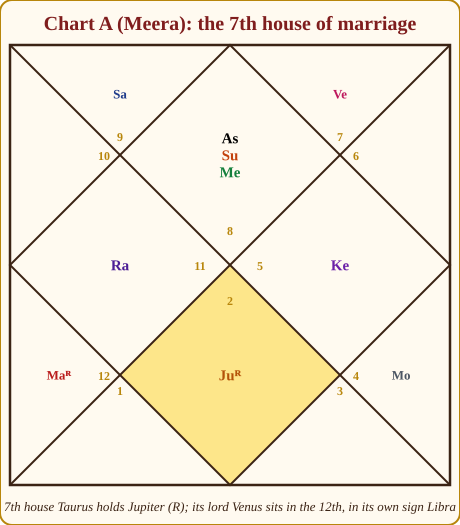
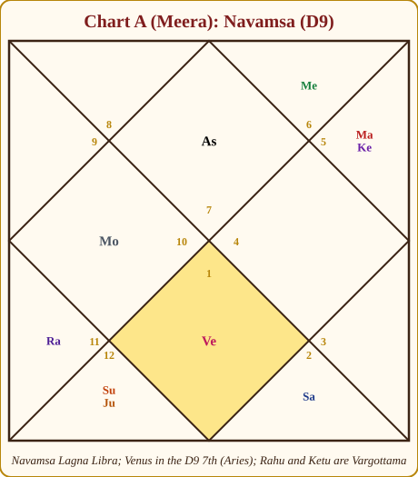
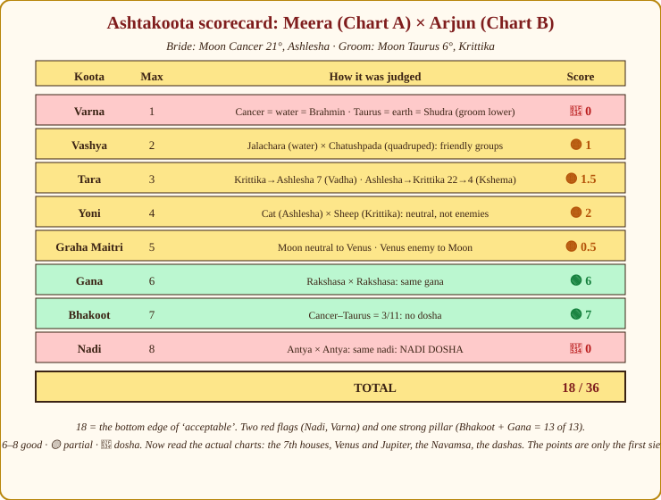

# Chapter 19: Marriage and Relationships, "When, With Whom, and Will It Last?"

A friend's mother once handed me two horoscopes folded inside a wedding card that had already been printed. "Didi, just tell me the points are above eighteen." The points were fourteen. The 7th houses of both charts were beautiful. I told her the truth about both facts, and I told her what I will tell you in this chapter: the points are a sieve, the chart is the river, and a wise astrologer reads the river.

Marriage carries the most emotion into the room, so the method must be the most disciplined: houses and karakas, the partner, the timing, the eight-fold matching with its arithmetic, and the phrases that keep hope and honesty in one sentence.

## The houses and karakas of marriage

> **📖 Story: The guest wing.** In the old haveli the family lived on the east side and the 7th house was the *guest wing* on the west, the rooms where the person who marries into the family will live. Before the wedding the elders would walk through it. Whose portrait hangs there? If Guru-ji's, the guest will be learned and generous; if the Commander's, quick-tempered and brave; if the old Judge's, older, quiet, late to arrive. Who holds the key, the wing's lord, and where is he? A lord standing in his own rooms keeps the wing in order; a lord away in the 12th (the store-room by the back gate) means the guest comes from far, or arrives late. And is the wing swept? Two malefics camped there make the guest's stay stormy. The elders never described the guest's face, only the rooms. **Rule:** the 7th house sign, its occupants and its lord's placement describe the partner and the partnership; read them before any koota.

**The 7th house and its lord.** The 7th (Kalatra bhava) is the house opposite the self, the other person who completes the pair. Its sign, its occupants, the planets aspecting it and, above all, the placement and strength of its lord tell you the *quality* of partnership a person is built for. Chapter 9's five-step method applies here in full: the house, the lord, the karaka, the same house from the Moon, and the varga (here the Navamsa).

> **🔍 Why?** (Astronomy, then logic.) When the Lagna rises in the east, the 7th house is setting in the west: the sky's exact opposite of the self. The tradition read every opposition as "the other": the person who faces you, completes you and sometimes opposes you. That is why the 7th holds spouse, business partner and the public at once. Parallel: the person across the dining table is the one you must negotiate with every day.

**Venus and Jupiter, the karakas.** The classical rule is gendered: Venus is the karaka of the wife in a man's chart and of love and marriage in general; Jupiter is the karaka of the husband in a woman's chart (Appendix A.2). Modern astrologers apply this flexibly: most of us read Venus for the *relationship itself* in every chart, and Jupiter for the *husband* where a woman asks about one, without insisting the two never cross. I do the same. Check the karaka's dignity, its house, and whether it is combust or afflicted; a weak karaka weakens even a good 7th.

> **🔍 Why?** (Symbolic logic, and a classical statement.) Venus is desire and the pleasure of union (kama); Jupiter is dharma, the vow and the protector. Marriage needs both, which is why both are karakas. Parashara's gendered rule, Jupiter for the husband in a woman's chart, came from a society in which the husband was the wife's dharma-protector and the wife the husband's source of comfort and prosperity. The society has changed; the two forces have not. Parallel: every wedding still has both the mehendi night (Venus) and the vows before the fire (Jupiter).

**The Darakaraka (Jaimini).** Chapter 15 introduced the seven Jaimini karakas ranked by degree. The planet with the **lowest degree** is the **Darakaraka** (DK), the spouse-significator; it describes the partner and the karma of partnership. In Chart A the degrees are Sun 28°, Venus 22°, Moon 21°, Mercury 9°, Jupiter 8°, Saturn 5°, Mars 4° (Rahu is excluded in the seven-karaka scheme): so Meera's DK is **Mars**. (Chart B: Mercury at 2°; Chart C: Mercury at 1°.)

**The supporting houses.**

| House | Question it answers |
|---|---|
| 2nd | Family life after marriage; the household that forms |
| 4th | Domestic happiness, the home the couple keeps |
| 5th | Romance, courtship, the children of the union |
| 8th | Marital longevity, in-laws, the spouse's family and money |
| 12th | Bed pleasures, private life, foreign partners |

> **🔍 Why?** (Logic.) The 8th is the 2nd from the 7th: the partner's holdings, the partner's family, and the "savings" of the marriage itself, which is its endurance. It is also the general house of longevity. So the 8th shows in-laws, the spouse's money and how long the bond lasts. Parallel: the in-laws' house is the room next door to the guest wing; what happens there decides how long the guest stays.

**The Navamsa (D9).** Chapter 11 called it the most important varga, and marriage is where it earns the title. Look at the D9 Lagna, the 7th house of the D9 and its lord, and where Venus falls in the D9. A 7th house that looks troubled in D1 but is clean in D9 usually settles down after a rough start; the reverse pattern is the one that needs care.

> **🔍 Why?** (Classical assignment, with a logic.) Parashara assigns the Navamsa to the spouse, and the ninth division is the division of dharma: nine is the number of the 9th house. Marriage is the householder's dharma, so the varga of dharma tests its inner strength. Chapter 11 showed how a planet's D9 sign reveals what the D1 sign only promises. Parallel: the D1 is the wedding album; the D9 is how the couple speak to each other in the kitchen ten years later.

**The Upapada Lagna (UL).** Also from Jaimini (Chapter 15): the Arudha of the 12th house. Count from the 12th house sign to its lord, then the same distance again; if the result lands in the 12th sign itself or in the 7th from it, take the 10th from that instead. Let us compute it for Chart A. The 12th house is Libra; its lord Venus sits in Libra itself. The distance is zero, so the Arudha would fall on Libra, the same sign, and the exception applies: count to the 10th from Libra, which is **Cancer**. Meera's UL is Cancer, her 9th house, where her own Moon sits in its own sign: a marriage that brings fortune, faith and a nurturing home. The **2nd from the UL** (Leo) shows marital longevity; there we find Ketu. A malefic here asks for care, but Ketu is the gentlest of the three, and Leo's lord the Sun is strong in her Lagna, so I read it as "phases of emotional distance that the marriage survives", not a breaking sign.

*Figure 19.1: Chart A. The 7th house Taurus holds Jupiter (R); its lord Venus sits in the 12th in its own sign Libra.*

## Describing the partner

Clients want a portrait. Give them a sketch, temperament, background, direction, never a photograph.

**From the sign of the 7th house** (adjusted by the D9 7th):

| 7th sign | Partner's temperament |
|---|---|
| Aries | Energetic, direct, independent, quick-tempered |
| Taurus | Steady, sensual, loyal, fond of comfort and food |
| Gemini | Talkative, witty, restless, youthful |
| Cancer | Nurturing, emotional, home-loving, moody |
| Leo | Proud, generous, wants admiration, leads |
| Virgo | Practical, analytical, particular, dutiful |
| Libra | Charming, fair-minded, social, indecisive |
| Scorpio | Intense, private, loyal, jealous when hurt |
| Sagittarius | Idealistic, frank, learned, loves freedom |
| Capricorn | Serious, ambitious, reserved, matures late |
| Aquarius | Unconventional, principled, detached, friendly |
| Pisces | Gentle, dreamy, compassionate, impractical |

**From the planets in or ruling the 7th** (and the DK):

| Planet | For the 7th | Partner's type |
|---|---|---|
| Sun | 🟡 | Dignified, dominant, from government or administration |
| Moon | 🟢 when bright | Caring, emotional, homely, changeable |
| Mars | 🔴 heat | Energetic, argumentative, athletic, technical |
| Mercury | 🟡 | Talkative, youthful, clever, commercial |
| Jupiter | 🟢 | Learned, religious, generous, sometimes older |
| Venus | 🟢 | Beautiful, artistic, comfort-loving |
| Saturn | 🔴 delay | Older, serious, hard-working; marriage delayed |
| Rahu | 🔴 unconventional | Foreign, from another community, unconventional |
| Ketu | 🟡 detached | Spiritual, detached, quiet |

**Direction of the partner.** Tradition reads the direction of the spouse's home from the 7th sign's element (Appendix A.1): fire signs east, earth south, air west, water north. Meera's 7th is Taurus, earth, south of her birthplace. Treat this as folklore that clients enjoy, not a prediction to bet on.

**Meera's partner.** Taurus 7th with Jupiter: steady, generous, learned, possibly a teacher or adviser, fond of comforts, perhaps a few years older. The 7th lord Venus in the 12th in its own sign: met through travel, a foreign connection or a distant city; a partner who values privacy. The DK Mars in Pisces: energetic but gentle, idealistic. In the D9 (below), Venus sits in the D9 7th in Aries, ruled by Mars in Leo, an independent, spirited partner with a strong will under the gentle exterior.

*Figure 19.2: Meera's Navamsa (computed with the A.10 rule, as in Chapter 11). Navamsa Lagna Libra; Venus in the D9 7th house (Aries); Rahu and Ketu Vargottama.*

## Love or arranged? One partner or several?

**Love marriage indicators:** a connection between the 5th (romance) and the 7th (marriage), their lords together, exchanged, or in mutual aspect; Venus with Mars (attraction that acts); Rahu in the 7th or 5th (a partner outside the expected circle); the Moon with Venus (the heart chooses). None of these forbids a family-arranged match; they say the person's heart will be involved either way.

**Multiple relationships:** Venus or the 7th lord in dual signs (Gemini, Virgo, Sagittarius, Pisces); a 7th house afflicted by two or more malefics; Rahu, Mars or Saturn in the 7th; the 7th lord in the 6th or 12th with Venus afflicted. Phrase this with great care. "Your chart shows more than one significant relationship in life" is honest. "You will have affairs" is slander dressed as astrology.

**Delays:** Saturn's influence on the 7th, on Venus or on the 7th lord (by placement or aspect) is the single commonest delay factor; the 7th lord in the 6th, 8th or 12th; Venus combust; no planet at all aspecting the 7th. Delay is not denial.

| Indicator | Weight | Reads as |
|---|---|---|
| 5th–7th lords linked; Moon with Venus | 🟡 | The heart chooses (love marriage likely) |
| Venus with Mars; Rahu in 5th or 7th | 🟡 | Attraction that acts; partner outside the circle |
| Venus or 7th lord in a dual sign | 🟡 | More than one significant relationship possible |
| Two or more malefics on the 7th; Rahu/Mars/Saturn in 7th | 🔴 | Storms; multiplicity; phrase with care |
| Saturn on 7th, Venus or 7th lord | 🔴 delay | Marries later; a good marriage still |
| 7th lord in 6, 8 or 12; Venus combust; no aspect on 7th | 🔴 delay | Later, or from a distance |
| Benefic in 7th; 7th lord in own/exalted sign or kendra | 🟢 | Steady partnership; the "guest wing" in order | The sentence I use: "Your chart marries after twenty-eight rather than before; the wait is written, the marriage is too."

> **🪔 Consultation tip:** When a parent asks "why is my daughter still unmarried at thirty", they are asking whether it is their fault. Answer the chart, not the guilt: "Her 7th lord sits in a house of delay; it also sits in its own sign, which means the marriage, when it comes, is a good one. The periods that open the door are ___." Then stop talking.

## Timing the marriage

> **📖 Story: Two signatures on the marriage file.** In our court a marriage is not fixed by a wish; it is fixed by a *file*, and the file needs two signatures. Guru-ji, the Royal Priest, signs first; he is generous and goes round the twelve districts once a year, blessing three at a time with his glance, so his signature is easy to get. Shani-ji, the old Judge, signs last. He spends two and a half years in each district, reads every page, and signs only when he has himself touched the house of marriage or its lord. Families who ran to the pandit the moment Guru-ji smiled at their district came back a year later asking why nothing happened: the Judge had not yet reached the file. And the railway timetable, the dasha, must have a marriage train running at all. Three things, one season. **Rule:** marriage is timed when Jupiter *and* Saturn both touch the 7th house or its lord by transit, inside a dasha of a marriage-giving planet.

The **dasha layer** first. Marriage tends to arrive in the Mahadasha or Antardasha of: the 7th lord; Venus (or Jupiter for a woman, by the classical rule); a planet sitting in the 7th; the lord of the 7th from the Moon; the D9 Lagna lord; the UL lord; or a planet in the 7th of the D9. Two of these in the same window is strong; three is nearly certain.

The **transit layer**, the double transit from Chapter 14, fixes the season. Marriage happens when Jupiter transits, or aspects, the 7th house, the Lagna or the 7th lord, *while* Saturn also touches the 7th or its lord by position or aspect.

> **🔍 Why?** (Astronomy.) Jupiter and Saturn are the two slowest planets we can see: about a year and about two and a half years per sign. Every faster planet crosses the 7th within weeks, so it cannot mark a season. Only when the two slow hands of the clock both point at the same house do we get a window long enough for a real event to fall into. Parallel: a wedding needs both the pandit's free date and the hall's free date; either alone books nothing.

**Worked on Chart A (a constructed example: we are checking that the reasoning holds, not that history did).** Meera's Venus Mahadasha runs mid-2007 to mid-2027. Venus is her 7th lord, the D9 Lagna lord, and the marriage karaka: the whole dasha is a marriage-friendly era. Within it, the Venus/Rahu sub-period runs roughly August 2014 to July 2017. Rahu sits in her 4th (home) and is disposited by Saturn in her 2nd (family), a sub-period that changes the home and the family.

Now the transits. Jupiter was in sidereal Leo from about July 2015 to August 2016, her 10th house. From Leo, Jupiter's 5th, 7th and 9th aspects fall on Sagittarius (her 2nd), Aquarius (her 4th) and Aries (her 6th): family and home are touched, but *not* the 7th. Then Jupiter moved to Virgo (August 2016 to September 2017); from Virgo its aspects fall on Capricorn (3rd), Pisces (5th) and **Taurus: the 7th**. Meanwhile Saturn was in Scorpio from November 2014 to January 2017, sitting on her Lagna; from Scorpio, Saturn's 3rd, 7th and 10th aspects fall on Capricorn (3rd), **Taurus (7th)** and Leo (10th). So from August 2016 until January 2017, Jupiter aspected the 7th and Saturn aspected the 7th, inside the Venus/Rahu sub-period of the 7th lord's Mahadasha. A marriage in late 2016 fits every layer. That is how the double transit is meant to be used: not "Jupiter is somewhere good, so marriage", but two slow planets and one dasha agreeing on one house.

> **⚠️ Common beginner mistake:** Timing marriage from Jupiter alone. Jupiter aspects three houses at once and returns every year; by itself it would "predict" marriage in a third of all years. Without Saturn's agreement and a supporting dasha, it is a hope, not a timing.

## Kuja dosha: the counselling frame

> **📖 Story: The Commander billeted in the bedroom wing.** After a campaign the Commander needs quarters. If the King bills him in the barracks (the 3rd, 6th, 10th, 11th) everyone sleeps well. But suppose he is billeted in the family's private rooms: the front hall (1st), the dining room (2nd), the inner courtyard (4th), the guest wing (7th), the in-laws' rooms (8th) or the bedroom by the back gate (12th). He does nothing wrong; he is simply loud. He argues at dinner, drills in the courtyard at dawn, and the new bride wonders what she has married into. That is the whole of Mangal dosha, a hot temperament in the rooms where a marriage is lived. The elders learned to soften it: if the Commander was in his own district or a friend's, or Guru-ji sat with him, or the other family also had a Commander in their private rooms, the two would understand each other. **Rule:** Mars in 1, 2, 4, 7, 8 or 12 (from Lagna, Moon or Venus) is heat in the marriage rooms; check cancellations; counsel temperament, never curse.

Chapter 10 covered the Mars dosha (Mangal or Kuja dosha): Mars in the 1st, 2nd, 4th, 7th, 8th or 12th from the Lagna, and by the fuller tradition, also from the Moon and from Venus, with its long list of cancellations (Mars in its own or a friend's sign, in Leo or Aquarius, with Jupiter, the partner having the same dosha, and more). Meera has no Kuja dosha from the Lagna, the Moon or Venus. Arjun (Chart B) has Mars in the 2nd from the Lagna, the 4th from his Moon and the 8th from his Venus, but Mars is retrograde in Leo, a friend's sign, and is his yogakaraka, so most teachers would call the dosha 🟡 mild.

> **🔍 Why?** (Logic.) Why count Mars from three points? The Lagna is the body, the Moon the mind, Venus the desire. A quarrel in a marriage can start in any of the three: tiredness, mood or jealousy. Mars is heat; the tradition checked whether heat sat in the marriage rooms of the body, the mind or the heart. Parallel: a kitchen fire can start at the stove, the gas cylinder or the wiring, so an inspector checks all three.

The counselling frame matters more than the rule. Mars in the marriage houses describes *heat*: a sharp tongue in the family (2nd), a restless home (4th), a partner who argues (7th). Tell the couple this as a temperament to manage, "one of you speaks first and thinks second; agree now who cools the kitchen", and never as a curse on the other's life. The frightening folk version of Mangal dosha has broken more engagements than Mars ever did.

## Ashtakoota: the eight-fold matching, done properly

> **📖 Story: Eight gatekeepers at the wedding gate.** At the wedding gate of the old kingdom stood eight gatekeepers, each allowed exactly one question, each holding a different number of coins to give if the answer pleased. The first, a thin old man with one coin, asked about temperament: Varna. The second, with two, asked whether the two would *pull* each other: Vashya. The third, with three, counted the stars between the bride's street and the groom's: Tara. The fourth, with four, asked which animals they were: Yoni. The fifth, with five, asked whether the lords of their two Queen Mothers were friends: Graha Maitri. The sixth, with six, asked whether they were of the gods, of men or of the wild: Gana. The seventh, with seven, measured the distance between their two Moons: Bhakoot. The eighth, tallest, with eight coins, felt their pulses: Nadi. Thirty-six coins in all; eighteen opened the gate. But the wise families knew the gatekeepers had never *seen* the couple, only their two Moons. Inside, the elders still walked the guest wing. **Rule:** Ashtakoota compares the two Moons in eight ways, 36 points; 18 is the gate; the 7th houses, Navamsa and dashas decide the marriage.

Appendix A.12 gives the eight kootas and their points out of 36. Here is how each is actually computed, and then the full match between Chart A (Meera as bride) and Chart B (Arjun as groom).

> **🔍 Why?** (Tradition, from the muhurta texts such as *Muhurta Chintamani*.) Why these eight, and why do the points rise from one to eight? The list is the tradition's ranking of what breaks a marriage, from least to most: ego and temperament (Varna, 1), attraction (Vashya, 2), shared fortune (Tara, 3), instinct (Yoni, 4), mental rapport (Graha Maitri, 5), temperament class (Gana, 6), family and finances (Bhakoot, 7) and health with progeny (Nadi, 8). Everything is judged from the two Moons because the Moon is the mind, and marriage was held to be the meeting of two minds. Parallel: it is the elders' pre-wedding checklist, with the items they feared most placed at the bottom and weighted heaviest.

**1. Varna (1 point): temperament, ego.** From the Moon sign's element: water signs Brahmin, fire Kshatriya, air Vaishya, earth Shudra. These caste words are traditional labels for four *temperaments* (reflective, commanding, transactional, grounded), say so plainly to clients, because the words upset people and mean nothing about birth. Full point if the groom's varna is equal to or "higher" than the bride's; otherwise zero.

**2. Vashya (2 points): mutual pull.** Signs fall in five groups: quadruped (Aries, Taurus, the second half of Sagittarius, the first half of Capricorn), human (Gemini, Virgo, Libra, the first half of Sagittarius, Aquarius), water (Cancer, the second half of Capricorn, Pisces), wild (Leo) and insect (Scorpio). Same group 2; friendly groups 1; where one group is the other's prey or enemy (the wild Leo against quadrupeds or humans, human against water in some tables) 0 or ½. Tables differ slightly between authors; use one and say which.

**3. Tara (3 points): health and fortune together.** Count from the bride's nakshatra to the groom's (inclusive), divide by nine, take the remainder; then count from the groom's to the bride's and do the same. Remainders 3, 5 and 7 (Vipat, Pratyari, Vadha) are unfavourable. Both counts good: 3 points; one good: 1½; both bad: 0.

**4. Yoni (4 points): instinctive compatibility.** Each nakshatra is an animal; the 27 map to 14 animals, mostly in male–female pairs:

| Animal | Nakshatras | Enemy animal |
|---|---|---|
| Horse | Ashwini, Shatabhisha | Buffalo |
| Elephant | Bharani, Revati | Lion |
| Sheep (goat) | Pushya, Krittika | Monkey |
| Serpent | Rohini, Mrigashira | Mongoose |
| Dog | Mula, Ardra | Deer |
| Cat | Ashlesha, Punarvasu | Rat |
| Rat | Magha, Purva Phalguni | Cat |
| Cow | Uttara Phalguni, Uttara Bhadrapada | Tiger |
| Buffalo | Swati, Hasta | Horse |
| Tiger | Vishakha, Chitra | Cow |
| Deer | Jyeshtha, Anuradha | Dog |
| Monkey | Purva Ashadha, Shravana | Sheep |
| Lion | Purva Bhadrapada, Dhanishta | Elephant |
| Mongoose | Uttara Ashadha | Serpent |

Same animal 4; friendly 3; neutral 2; unfriendly 1; enemies 0.

**5. Graha Maitri (5 points): mental rapport.** Take the lords of the two Moon signs and look them up in the friendship table (Appendix A.3). Same lord or mutual friends 5; one friend, one neutral 4; both neutral 3; one friend, one enemy 1; one neutral, one enemy ½; mutual enemies 0.

**6. Gana (6 points): temperament class.** Deva, Manushya or Rakshasa from Appendix A.7. Same gana 6; Deva–Manushya 6 (some tables 5); Deva–Rakshasa 0 (some give 1); Manushya–Rakshasa 0.

**7. Bhakoot (7 points): family welfare and finances.** Count the distance between the two Moon signs both ways. Pairs of 2/12, 5/9 and 6/8 are Bhakoot dosha, 0 points; every other pairing (1/1, 3/11, 4/10, 7/7) scores 7. Exceptions exist when both Moon-sign lords are the same planet or friends.

> **🔍 Why?** (Logic for two pairs, tradition for the third.) When the Moons are 6/8 apart, each mind sits in the other's house of enemies or of death; when 2/12, one mind's gain is the other's loss. Those are dusthana relationships between two minds, so the tradition marked them. The 5/9 pair is a trine and looks friendly; the muhurta texts still call it a dosha, giving progeny as the reason (9 is the 5th from the 5th). Many modern astrologers soften that one, and I say so. Parallel: two colleagues whose desks face each other's blind spots quarrel without meaning to.

**8. Nadi (8 points): health and progeny.** The nakshatras fall into three nadis (pulses):

| Nadi | Nakshatras |
|---|---|
| Adi | Ashwini, Ardra, Punarvasu, Uttara Phalguni, Hasta, Jyeshtha, Mula, Shatabhisha, Purva Bhadrapada |
| Madhya | Bharani, Mrigashira, Pushya, Purva Phalguni, Chitra, Anuradha, Purva Ashadha, Dhanishta, Uttara Bhadrapada |
| Antya | Krittika, Rohini, Ashlesha, Magha, Swati, Vishakha, Uttara Ashadha, Shravana, Revati |

Different nadis 8; the same nadi 0, the **Nadi dosha**, the heaviest single penalty in the system. Classical exceptions cancel it: the same Moon sign with different nakshatras; the same nakshatra with different Moon signs (some texts require different padas); and, in several texts, when the two Moon-sign lords are the same planet or great friends.

> **🔍 Why?** (Tradition.) Nadi means pulse. The old understanding, borrowed from the physicians, was that two people of the same nadi shared one constitution, and children of such a union would inherit a doubled weakness. That is why Nadi carries eight points, the most of any koota: the tradition ranked the health of children above every other worry. Modern medicine tests this differently, but the intention is the same one genetic counselling serves today. Parallel: families who would not marry within the same gotra were guarding the same thing by another rule.

### The worked match: Meera (Chart A) with Arjun (Chart B)

Bride: Moon in Cancer 21°, Ashlesha. Groom: Moon in Taurus 6°, Krittika.

- **Varna.** 🔴 Cancer is water: Brahmin. Taurus is earth, Shudra. The groom's varna is lower than the bride's: **0**.
- **Vashya.** 🟡 Cancer is a water sign (Jalachara); Taurus is a quadruped (Chatushpada). Friendly groups in the common table: **1**.
- **Tara.** 🟡 From Krittika (3) to Ashlesha (9): 7 nakshatras; 7 ÷ 9 leaves 7, Vadha, unfavourable. From Ashlesha (9) to Krittika (3): 22; 22 ÷ 9 leaves 4, Kshema, favourable. One good, one bad: **1½**.
- **Yoni.** 🟡 Ashlesha is the cat; Krittika is the sheep. Not enemies, not friends, so neutral: **2**.
- **Graha Maitri.** 🔴 Cancer's lord is the Moon; Taurus's lord is Venus. From Appendix A.3, the Moon is neutral toward Venus, but Venus counts the Moon as an enemy. One neutral, one enemy: **½**.
- **Gana.** 🟢 Ashlesha is Rakshasa; Krittika is Rakshasa. Same gana: **6**.
- **Bhakoot.** 🟢 Cancer to Taurus is 11; Taurus to Cancer is 3. The 3/11 pair is not a dosha: **7**.
- **Nadi.** 🔴 Ashlesha is Antya; Krittika is Antya. Same nadi, **0**, Nadi dosha. Check the exceptions: different Moon signs, different nakshatras, and the lords (Moon and Venus) are not friends. No exception applies; the dosha stands.

**Total: 0 + 1 + 1½ + 2 + ½ + 6 + 7 + 0 = 18 out of 36.**

*Figure 19.3: The scorecard. Two red rows (Varna, Nadi) and one very strong pillar (Gana and Bhakoot together give 13 of 13).*

Eighteen sits exactly on the lower edge of "acceptable" in Appendix A.12. A family astrologer working from the points alone would frown. Now watch what the *charts* say. Meera's 7th holds Jupiter with its lord in its own sign; Arjun's 7th holds Venus, the marriage karaka, and his 7th lord Saturn sits in its own sign Aquarius, two solid marriage houses, though Saturn in his 8th, combust beside the Sun, delays his. Their Lagnas, Scorpio and Cancer, are both water signs in a 5/9 trine, natural emotional understanding. Meera's 7th lord Venus and Arjun's 7th lord Saturn are natural friends. She runs a Venus Mahadasha; he runs Rahu, disposited by Venus, their timings pull the same way. The Nadi dosha is real and I would say so; I would also say that a Nadi match is traditionally about health and progeny, so we look at both 5th houses and Jupiters (Chapter 21) before we worry. **A low score with strong 7th houses is not a "no".** A high score with two afflicted 7th houses is not a "yes".

> **🧭 Anushka's rule of thumb:** Points first, then the two 7th houses, then the two Navamsas, then the two dashas. If three of these four are good, bless the match. If only the points are good, look again.

## The modern consultant's compatibility method

Beyond the kootas, I compare the two charts in six lines:

1. **Lagnas**, are the rising signs in a friendly relationship (trine, sextile, same element) or in a 6/8 or 2/12 position?
2. **Moon signs**, emotional fit; the same test.
3. **Venus and Mars**, his Venus to her Mars and hers to his: attraction and its endurance.
4. **Saturn**, where does each person's Saturn fall in the other's chart? Saturn on the other's Moon or 7th is heavy; Saturn on the other's 10th or 11th steadies them.
5. **The two 7th lords**, are they friends? Do they fall in good houses of each other's chart?
6. **Dashas**, are both people in periods that favour partnership, or is one in a Saturn/Ketu withdrawal while the other is in a Venus bloom?

## Strain, separation, remarriage, and how to speak of them

The indicators of marital strain, all 🔴: the lords of the 6th, 8th or 12th in the 7th; Saturn, Mars and Rahu together influencing the 7th; the 7th lord in the 6th, 8th or 12th with malefic aspect; the D9 7th house or its lord afflicted; the 2nd from the UL heavily afflicted; Venus debilitated and combust. Against them, the 🟢 sustainers: Jupiter's aspect on the 7th or its lord, a clean D9 7th, a strong UL lord. Two red marks is a chart that must work at marriage. Four is a chart where separation is a real possibility.

**Remarriage** is read from the 2nd house (the second partner, by the classical convention of counting the 8th from the 7th, which is the 2nd) and from planets in dual signs in the 7th or ruling it. Where the 7th is afflicted and the 2nd is strong, I say "the chart has room for a second, happier chapter", and only when I am asked.

**Childlessness** is not a marriage question but is asked as one; Chapter 21 covers the 5th house and Jupiter. Note here only that a Nadi dosha or a weak 5th is a reason to *plan*, not to refuse a match.

> **🪔 Consultation tip:** The ethics of this section are absolute. You never say "this marriage will break", "your husband will leave" or "she will be unfaithful". You say: "This chart shows strain in partnership during ___ period; here is what strengthens it." You never reveal one partner's chart to the other without consent. You never use a chart to end a marriage a client has not already decided to end. And when someone in a bad marriage asks whether the stars permit them to leave, remember that they are asking you for permission to be safe, the stars never forbid safety.

**LGBTQ+ and live-in relationships.** The classical texts do not address same-sex partnership or unmarried cohabitation; they were written for a society that did not name them. The honest consultant reads the 7th house, the 5th, Venus and the DK for *partnership in general*, its quality, timing and endurance, exactly as for any client, and does not moralise. The chart describes how a person loves and commits; it does not rule on whom they may love.

> **💡 Did you know?** The 36-point Ashtakoota is North Indian. South India uses a ten-fold matching (*Dasha Porutham*) with Rajju (longevity) and Vedha (obstruction) tests, so two families from two regions can score the same pair quite differently: one more reason to read the whole chart.

> **📕 From Lal Kitab:** In the Lal Kitab tradition Venus is read in its permanent house, the 7th, and a "sleeping" or afflicted Venus there is said to trouble the spouse's comfort; the commonly taught remedies for marital friction involve the couple keeping a small silver piece, feeding cows, and the husband respecting women of the household as a discipline. This belongs to Lal Kitab's own system and is not to be blended with the Parashari reading above. *(Source: Lal Kitab, Pt. Roop Chand Joshi, 1939–1952 Urdu editions; Hindi translations vary.)*

## The marriage checklist

1. 7th house: sign, occupants, aspects, from the Lagna and from the Moon.
2. 7th lord: house, dignity, company.
3. Venus (and Jupiter for a woman): dignity, combustion, affliction.
4. Darakaraka: which planet, where.
5. D9: Lagna, 7th house, 7th lord, Venus.
6. UL and the 2nd from it.
7. 🔴 Delay and multiplicity factors; 🟡 love-marriage links (5th–7th); 🟢 benefics on the 7th.
8. 🔴 Kuja dosha from Lagna, Moon and Venus, 🟢 with cancellations.
9. Timing: dasha lords of marriage; the double transit on the 7th.
10. If matching: Ashtakoota total, then the six-line modern comparison.

## In one breath

- Marriage is read from the 7th house and its lord, Venus (and Jupiter in a woman's chart, applied flexibly), the Darakaraka, the D9 7th and the Upapada.
- Meera's DK is Mars (lowest degree, 4°); her UL is Cancer (Venus in its own sign forces the "10th from" exception); Ketu in the 2nd from UL is read as phases of distance, not breaking.
- Describe the partner as a sketch from the 7th sign, its planets and the D9, temperament, background, direction, never a photograph.
- Delay comes chiefly from Saturn on the 7th, Venus or the 7th lord, and from the 7th lord in 6/8/12. Delay is not denial.
- Time marriage with the dashas of the 7th lord, Venus, planets in the 7th, the 7th-from-Moon lord, the D9 Lagna lord or the UL lord, and confirm with Jupiter and Saturn both touching the 7th. Meera's late-2016 window passes every layer.
- Ashtakoota: Meera × Arjun scores 18/36, Nadi dosha and Varna fail, Gana and Bhakoot are perfect. Strong 7th houses, friendly Lagnas and aligned dashas outweigh the thin points.
- Strain is spoken of as strain, in periods, with what strengthens it. Never predict a breaking. Never moralise about whom a client loves.

## Practice

> **✍️ Practice:**
>
> 1. Chart C (Devika, Aries Lagna: Sun 5° and Jupiter 26° Cancer; Moon 14° Sagittarius; Mars 27° and Venus 15° Gemini; Mercury 1°, Saturn 18°, Rahu 3° Leo; Ketu 3° Aquarius). Find her 7th house, its lord and where that lord sits. In one sentence, what does it say about partnership?
> 2. Compute Devika's Darakaraka and her Upapada Lagna (12th house Pisces; lord Jupiter in Cancer).
> 3. Devika's Moon is in Purva Ashadha; Arjun's is in Krittika. Compute Gana, Yoni and Nadi for that pair.
> 4. A client's 7th lord is Saturn in the 12th, and Venus is combust. What do you say, in two sentences, when the mother asks "why no marriage at thirty-one"?
> 5. Chart B: Arjun's 7th house Capricorn holds Venus; its lord Saturn sits in the 8th in its own sign, combust. Which dasha lords would you list as marriage-timing candidates for him? (Use his Rahu Mahadasha of December 2013 to December 2031 and its sub-periods.)

Answers

1. The 7th is Libra, lord Venus, sitting in Gemini in the 3rd with Mars. A charming, communicative partner met through siblings, neighbours or short travel; Venus with Mars gives attraction and some argument; Gemini adds wit and restlessness.
2. Degrees: Mars 27°, Jupiter 26°, Saturn 18°, Venus 15°, Moon 14°, Sun 5°, Mercury 1°, lowest is Mercury, so DK = Mercury (a clever, youthful, commercial partner). UL: 12th house Pisces, lord Jupiter in Cancer, which is 5 signs from Pisces; 5 more from Cancer gives Scorpio. Scorpio is neither Pisces nor its 7th (Virgo), so no exception: UL = Scorpio, her 8th house.
3. Gana: Purva Ashadha is Manushya, Krittika is Rakshasa, Manushya–Rakshasa = 0. Yoni: Purva Ashadha is the monkey, Krittika the sheep; these are enemy animals = 0. Nadi: Purva Ashadha is Madhya, Krittika is Antya, different = 8. (A pair that fails temperament and instinct but passes the health test; you would read both 7th houses next.)
4. "Her 7th lord sits in a house of delay and her marriage planet is weakened by the Sun, so her chart marries later than her friends; that is a timing, not a fault. The periods that open the door are Saturn's and Venus's sub-periods, and the season when Jupiter and Saturn both touch her 7th; let me find those dates for you."
5. Saturn (the 7th lord); Venus (the marriage karaka, sitting in the 7th); Mars (the 7th from his Moon in Taurus is Scorpio, whose lord is Mars, also his yogakaraka); and any planet in his D9 7th. Within the Rahu Mahadasha the candidates are Rahu/Saturn (January 2019 to November 2021), Rahu/Venus (mid-2025 to mid-2028) and Rahu/Mars (late 2030 to 2031). With the 7th lord in the 8th (a delay factor), Rahu/Venus is the more likely window; confirm with the double transit on Capricorn or Saturn.

