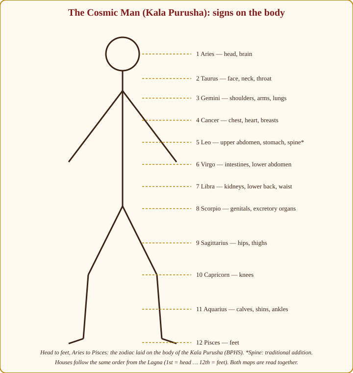
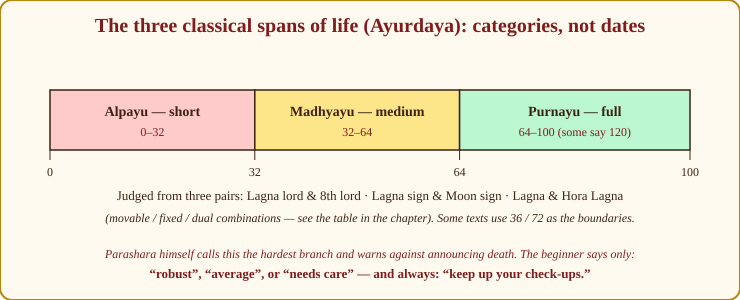
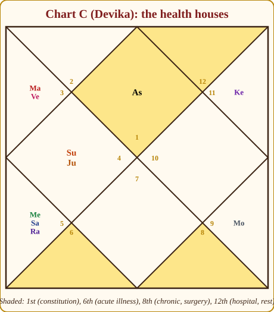

# Chapter 20: Health and Longevity, Reading the Body Without Frightening the Patient

Before a single rule, the ethics. I put this first because in health matters a careless astrologer can do real harm; I have watched one careless sentence frighten a person for months.

An astrologer is not a doctor. You do not diagnose. You do not name a disease from a chart, however sure you feel. You do not predict death, not the year, not the decade, not "after sixty be careful". You never, under any circumstance, advise a client to stop, delay or replace a treatment their doctor has prescribed. Parashara himself warns against announcing the span of life, and every honest teacher since has repeated the warning.

> **🔍 Why?** (Ethics, and logic.) The ethical reason is plain: a frightened person delays treatment, and you are not qualified to treat. The logical reason is deeper: a chart shows tendency, not pathology. The same Saturn on the same Moon sits in thousands of charts, and those thousands have thousands of different bodies. A tendency is a direction, not a diagnosis. Parallel: a weather forecast tells you to carry an umbrella; it does not tell you that you are already wet.

What, then, is the astrologer's job in health? To notice where the chart carries a *sensitivity*, and to say so in a way that sends the person to a doctor sooner rather than later. The sentence I use, word for word, is: **"Your chart shows a sensitivity in this area: please keep up regular check-ups."** That sentence does more good than any gemstone. It has sent people for tests that found things early. It has never frightened anyone.

With that fixed, let us learn the anatomy.

## The anatomy map: signs, houses, planets

The tradition lays the zodiac on the body of the Cosmic Man (*Kala Purusha*), head to feet, Aries to Pisces. The houses follow the same order from the Lagna. And each planet governs a *system* rather than a place. The three maps are read together.

*Figure 20.1: The Kala Purusha. Aries head, Taurus face and throat, Gemini arms and lungs, Cancer chest, Leo stomach, Virgo intestines, Libra kidneys and lower back, Scorpio genitals and excretion, Sagittarius hips and thighs, Capricorn knees, Aquarius calves and ankles, Pisces feet.*

> **📖 Story: The cosmic man asleep across twelve rooms.** Picture a giant lying asleep across the whole haveli: the Kala Purusha, the Man of Time. His head rests in the first room (Aries, the Commander's district), his face and throat in the second, his arms stretch through the third, his chest fills the fourth, his stomach the fifth, and so on down to his feet, which stick out of the twelfth room by the back gate. Now the courtiers walk through the rooms at night. Wherever the old Judge sits down, that part of the giant grows stiff and cold. Wherever the Commander stamps, it heats and bleeds. Wherever the Smoke-headed Stranger stands, it aches in a way no physician can name. And wherever Guru-ji lays his hand, the limb rests easy. Every birth chart is one night in that house; the astrologer only notes which rooms had which visitors. **Rule:** sign and house name the body part (head to feet, Aries to Pisces, 1st to 12th); the planet names the kind of trouble.

**Signs → body parts** come from Appendix A.1. **Houses → body parts** come from A.5: 1st head, 2nd face and mouth, 3rd arms and ears, 4th chest, 5th stomach and upper belly, 6th intestines, 7th lower belly and pelvis, 8th genitals and excretion, 9th thighs and hips, 10th knees, 11th calves and shins, 12th feet. When a planet sits in a house, both the sign and the house speak: Saturn in the 2nd house in Sagittarius touches the face, teeth, throat and speech (2nd) *and* the hips and thighs (Sagittarius).

> **🔍 Why?** (Classical statement with an astronomical logic.) Parashara describes the zodiac as the body of the Kala Purusha, head to feet, Aries to Pisces. Why head first? Because the Lagna, the 1st house, is the sign rising at birth, and a child is born head first: the first house is the head, and the rest of the body follows the order of rising. The houses copy the same order from your own Lagna. Parallel: a tailor measures from the collar down, always in the same order, so that every measurement has a fixed place.

**Planets → systems:**

| Planet | Effect on the body | Body systems and tendencies |
|---|---|---|
| Sun | 🟡 vitality, but heat | Heart, bones, eyes (right eye), vitality, fevers, spine |
| Moon | 🟢 when bright; 🟡 when dark | Fluids, mind and mood, breasts, stomach, left eye, sleep |
| Mars | 🔴 acute, sharp | Blood, muscles, accidents, cuts and surgery, fevers, inflammation |
| Mercury | 🟡 by company | Nerves, skin, speech, lungs and breathing, the intellect |
| Jupiter | 🟢 protector (excess: fat, sugar) | Liver, fat, sugar, ears, growths, the pancreas by extension |
| Venus | 🟢 (excess: indulgence) | Reproductive organs, kidneys, hormones, eyes, the throat |
| Saturn | 🔴 chronic, slow | Chronic conditions, bones, teeth, joints, nerves, low mood, cold |
| Rahu | 🔴 mysterious | Undiagnosed or mysterious illness, poisons, addictions, phobias, infections that puzzle |
| Ketu | 🔴 sudden | Infections, wounds, viral fevers, cuts, surgery, sudden sharp pain |

**The tridosha link (as tradition teaches it).** The Ayurveda–Jyotish crossover assigns the fiery planets Sun and Mars to *pitta* (heat, inflammation, acidity); the Moon and Venus to *kapha* (fluids, weight, congestion); Saturn, Rahu and Mercury to *vata* (nerves, dryness, joints, anxiety). Jupiter is usually given to kapha as well. I label this a tradition rather than a rule: it is useful for the *flavour* of a complaint, "heat-type" versus "cold-type", and it gives a client a language their Ayurvedic doctor will recognise. It is not a prescription.

> **💡 Did you know?** The word *Kala Purusha* means "the Man of Time". The image of the zodiac as a cosmic body appears in the Puranas as well as in Parashara, and the same idea, the sky as a body, the body as a sky, runs through Indian temple architecture, where the plan of a shrine is also laid on the figure of a man (the *Vastu Purusha*).

## The health houses and their lords

> **📖 Story: Clinic, operating theatre and hospital ward.** Three rooms of the haveli were given to the physicians. The 6th room, near the servants' hall, was the *clinic*: fevers, cuts, stomach upsets, you walked in, were treated, and walked out; the Commander was its patron, and a strong clinic meant a household that fought off illness. The 8th room, deep inside and rarely opened, was the *operating theatre* and the family's long-term ledger: chronic complaints, surgeries, and the record of how long each member lived; the old Judge kept its key, and a well-placed Judge there meant a long ledger, not a short one. The 12th room, by the back gate, was the *hospital ward*: the bed where one lay when one could not rise, with the door to the outside world half open. The front room, the 1st, was the *constitution*, how sturdy the house itself was built. **Rule:** 1st = constitution; 6th = acute, treatable; 8th = chronic, surgery, longevity; 12th = hospitalisation. Their lords carry the same meanings wherever they sit.

Four houses do most of the work.

**The 1st house: constitution.** The Lagna, its sign, its occupants and above all its lord describe the body's basic strength. A strong Lagna lord (Chapter 12: own sign, exaltation, kendra, unafflicted) is the immune system of the chart. Such people fall ill and bounce back. A weak Lagna lord means the body needs more care for the same life.

**The 6th house: acute illness.** The 6th (Ripu bhava) is disease that comes and goes: infections, fevers, injuries, the treatable. It is also *fighting* disease, a strong 6th lord gives a good fighter. The sign on the 6th and the placement of its lord show *where* the acute troubles tend to land.

**The 8th house: chronic illness, surgery, longevity.** The 8th is the deep house: conditions that stay, operations, and the span of life itself. Malefics in the 8th are not automatically bad for health, Saturn in the 8th is a classical long-life indicator, but the 8th lord's condition tells you whether chronic matters will be mild or heavy.

> **🔍 Why?** (Logic.) The 6th is an upachaya, a house of effort and fights, so what it brings can be fought off: acute, treatable. The 8th is the 12th from the 9th, the loss of grace, and the house of transformation and longevity; things there work slowly and stay. That is why the 6th is the cold and the 8th is the slipped disc. Parallel: a quarrel at the office (6th) is settled by Friday; a court case (8th) runs for years.

**The 12th house: hospitalisation, confinement.** The 12th is the bed: hospital stays, long rests, isolation. Malefics in the 12th or its lord afflicted point to periods of enforced rest.

> **🔍 Why?** (Logic.) The 12th is the 12th from the 1st: the loss of the body's freedom. It is also the house of the bed, sleep and confinement. A hospital is exactly that, a bed you cannot leave. Parallel: the difference between resting at home and being admitted is the locked ward door.

Two more actors matter more than any house. **The Lagna lord's strength is vitality.** And **the Moon's strength is mental health**, which brings us to a section I ask you to read slowly.

## Mental health: the Moon, read with care

> **📖 Story: The Queen Mother's health.** The whole court takes its mood from the Queen Mother. When Rani Ma is bright, the waxing Moon, in her own district or a friend's, with Guru-ji calling on her, the kitchens sing and even bad news is borne. When the old Judge sits beside her, the palace grows quiet and heavy; when the Smoke-headed Stranger stands at her door, she cannot sleep for fears no one can name; when she is sent to the clinic, the theatre or the ward (the 6th, 8th or 12th) and the malefics follow her there, the court itself sickens. The young Prince, her son, carries her worries into his ledgers and his speech falters. The physician's wisdom was this: the Queen Mother is *never* dismissed as "just moody". She is attended at once, and by a real physician. **Rule:** the Moon is the mind; Saturn, Rahu, dusthana placement and affliction on Mercury are strain markers, and strain on the mind is referred to a professional, never remedied away.

The Moon is the mind. Its sign, its brightness (waxing or waning), its company and its house tell you how a person's mind weathers life. The indicators the tradition watches for mental strain are: the Moon with Saturn (heaviness, low mood, pessimism); the Moon with Rahu (anxiety, obsessive thinking, fears without names); the Moon in the 6th, 8th or 12th *and* afflicted by malefics (the mind under siege); Mercury afflicted (the thinking faculty disturbed; speech and nerves); a weak or afflicted 4th house (inner peace) and 5th house (the capacity for joy, the intellect). A waning Moon close to the Sun (the dark Moon) adds sensitivity.

> **🔍 Why?** (Classical definition, with an astronomical logic.) Parashara names the Moon the karaka of the mind (manas). The astronomy explains the choice: the Moon is the fastest body, changing sign every two and a quarter days and changing shape every night, exactly as moods do. The planet that never stays the same was made the ruler of the faculty that never stays the same. Parallel: your mood on a Monday depends on the news, the weather and who spoke to you; so does the Moon's face.

| Indicator | Reads as |
|---|---|
| 🔴 Moon with Saturn | Heaviness, low mood, pessimism |
| 🔴 Moon with Rahu | Anxiety, obsessive thinking, unnamed fears |
| 🔴 Moon in 6, 8 or 12 *and* afflicted | The mind under siege |
| 🟡 Mercury afflicted | Thinking and speech disturbed; nerves |
| 🟡 Weak 4th or 5th house | Inner peace and joy harder to reach |
| 🟡 Dark Moon (close to the Sun) | Sensitivity |
| 🟢 Jupiter aspecting the Moon; Moon in own/friendly sign, bright | Resilience; the mind rights itself |

These are *tendencies toward strain*, not diagnoses of illness, and none of them is rare, most charts have at least one. What matters is how many stack up, whether Jupiter aspects the Moon (the great protector of the mind), and what dasha is running.

The consultant's duty here is not astrological at all. If a client tells you they cannot sleep, cannot stop crying, cannot feel anything, or are thinking of ending their life, your job is to encourage professional help immediately, a doctor, a counsellor, a helpline, and to follow up. You may add that the chart shows this as a *period* that eases, because that is usually true and always kind. You may never say "it is just your Saturn, do a remedy and it will pass". Mental illness is treatable; an astrologer who delays treatment has done harm.

> **🪔 Consultation tip:** For any mental-health indicator, my three sentences are: "Your chart shows a sensitive mind; that is also the mind of poets and healers. In this period it is under more pressure than usual, and the pressure eases from ___. Please speak to a doctor or counsellor now; the remedy I give you is *in addition* to that, never instead of it."

## The "which body part" method

When a client asks "where should I be careful", run this sequence:

1. **The 6th lord**, the sign and house it occupies name the first sensitive area (sign → A.1; house → A.5).
2. **Planets afflicted**, any planet debilitated, combust, or hemmed by malefics: its system (table above) is sensitive, and the sign and house it occupies say where.
3. **Signs occupied by malefics**, Saturn, Mars, Rahu, Ketu each sit on a body part; read the sign.
4. **The Lagna and 8th lords**, their signs add constitutional weak points.
5. **The D30 Trimsamsa**, the divisional chart of misfortune and disease (Appendix A.10). Malefic-ruled portions of the D30 sharpen the picture. The **D6 Shashthamsa** is used by some for disease specifically. Both are advanced; look at them only after D1 is clear.

**Accidents** are read from Mars–Ketu–Rahu combinations (especially in the Lagna, 4th, 8th or in movable signs, which are about motion and travel), from the 8th house and its lord, and from Mars–Saturn contacts (sudden force meeting rigid structure, falls, fractures). A client with these does not need to be frightened; they need to be told to wear a helmet and not to drive tired during the indicated periods.

**Chronic versus acute.** Saturn, the 8th house and fixed signs point to conditions that stay and need management; Mars, Ketu, the 6th house and movable signs to conditions that arrive sharply and leave. This is the difference between "keep up your check-ups" and "be careful in these months".

> **🧭 Anushka's rule of thumb:** Sign says *where*, house says *where again*, planet says *what kind*. If the three do not point to the same part of the body, you have a general sensitivity, not a specific one, say less, not more.

## Timing illness and recovery

Illness has its seasons, and this is where the astrologer is genuinely useful, not for naming the illness, but for naming the months in which a check-up is wise.

**Periods of vulnerability (🔴):** the Mahadasha or Antardasha of the 6th, 8th or 12th lord; malefic antardashas whose lords sit in the 6th, 8th or 12th *from the Mahadasha lord*; Saturn or Rahu transiting the Lagna, the Lagna lord or the Moon; the second phase of Sade Sati (Saturn on the natal Moon, Appendix A.9); Ashtama Shani (Saturn in the 8th from the Moon); the maraka lords' periods (below).

**Recovery (🟢):** Jupiter's transit over the Lagna, the Moon or the Lagna lord, or its aspect on them; the dasha of the Lagna lord or of a strong benefic; the end of the malefic transit. Always give the client the date recovery indicators arrive. Hope with a date on it is medicine.

**The maraka concept (Chapter 8 reminder).** The lords of the 2nd and 7th, and planets in those houses, are called marakas, "killers", in the classical texts. I use the word in study and *never* with the person in front of me. For the consulting table, maraka periods are simply "periods to take health seriously": more rest, timely check-ups, no bravado.

**Balarishta: infancy.** Classical texts describe combinations for danger in early childhood: the Moon in the 6th, 8th or 12th afflicted by malefics, especially in a night birth; malefics in the Lagna and 7th together; the Lagna lord combust or debilitated with no benefic aspect. They also give the cancellations, which are many: a strong Jupiter aspecting the Moon or Lagna, benefics in kendras, the Lagna lord strong, the Moon waxing. Modern medicine has made the old danger far smaller than the old texts assumed. The ethics for new parents are simple: never say the word. If the chart shows a weak Moon in an infant, say "keep the child's vaccinations and check-ups on schedule and watch the digestion", and nothing more.

**Protective factors (🟢).** Learn these as well as the dangers: Jupiter aspecting the Lagna or the Moon; a strong Lagna lord; benefics in kendras; and a well-placed Saturn, which is the *Ayushkaraka*, the planet of longevity, Saturn strong in the 8th, or in its own sign, is one of the classical marks of a long life.

> **🔍 Why?** (Astronomy, then derivation.) Saturn is the slowest planet we can see, taking about twenty-nine and a half years to go round: it is time itself in the sky. Appendix A.5 makes it the karaka of the 8th, the house of longevity, and A.2 lists longevity first among its significations. The planet of time keeps the ledger of years. Parallel: the oldest servant in a joint family has watched every generation arrive and can tell you who lived long and why.

## Longevity: the three spans, and why the beginner leaves them alone

The classical branch of life-span calculation (*Ayurdaya*) sorts lives into three categories: **Alpayu** (short, 0–32 years), **Madhyayu** (medium, 32–64), **Purnayu** (full, 64–100, with some authors extending to 120). Some texts draw the boundaries at 36 and 72.

*Figure 20.2: The three classical spans. A category, never a date, and even the category is judged only by experienced hands.*

The category is judged from three pairs of signs, using whether each sign is movable, fixed or dual (Appendix A.1): the signs occupied by the **Lagna lord and the 8th lord**; the **Lagna sign and the Moon sign**; and the **Lagna and the Hora Lagna** (a special ascendant your software computes). For each pair:

| Pair | Category |
|---|---|
| Movable + movable | 🟢 Full |
| Fixed + fixed | 🔴 Short |
| Dual + dual | 🟡 Medium |
| Movable + fixed | 🟡 Medium |
| Movable + dual | 🔴 Short |
| Fixed + dual | 🟢 Full |

Where the three pairs agree, the texts take that category; where two agree, the majority; where all three differ, further rules apply (and the authors themselves disagree on them). Then come corrections for Saturn's placement, benefics in kendras, the Lagna lord's strength, and much else.

> **🔍 Why?** (Tradition, and I name it as such.) The pairing of movable, fixed and dual signs into full, short and medium comes from *Jataka Parijata* and *Phaladeepika*; the texts state it without a derivation, and the results are not intuitive (two fixed signs giving a short life, for instance). I have not found a reasoning that satisfies me, so I teach it as a received table and use it only to understand the classics. Parallel: an old family recipe kept exactly as grandmother wrote it, even where nobody remembers why a step is there.

> **📖 Story: The old Judge who keeps the keys.** The family feared Shani-ji most of all, and he was the one who kept them alive longest. He is the *Ayushkaraka*, the keeper of the ledger of years. The households that treated him well, gave him his own quiet room in the 8th, or let him sit in his own districts of Capricorn and Aquarius, found their old people living to see great-grandchildren, slowly, stiffly, but surely. The households that panicked when he entered, and threw him out with stones and threats, lost the one servant who counted the years faithfully. Guru-ji's blessing on the front door and on the Queen Mother added the second protection. **Rule:** a well-placed Saturn is a long-life mark, not a death mark; Jupiter on the Lagna or Moon, a strong Lagna lord and benefics in kendras are the other protectors.

I want to be honest with you about this branch. The classical authors say plainly that Ayurdaya is the hardest part of Jyotish; Parashara gives several methods, admits they conflict, and warns against telling anyone their span. I have never managed to use these tables without embarrassment, and I have watched experts stumble on them too. Learn the table so you understand the tradition; then, at the table, judge only **"robust", "average" or "needs care"**, and say what supports each. A reader who tells a client "medium life" has broken the first rule of this chapter and understood nothing of the second.

> **⚠️ Common beginner mistake:** Mistaking Saturn in the 8th, or the Lagna lord in the 8th, for a death sentence. Saturn in the 8th is a *long-life* mark in the classics. The 8th is the house of longevity itself; planets there are read for the *quality* of the long years, not for their end.

## Worked example: Chart A (Meera)

Scorpio Lagna. Lagna lord Mars retrograde in the 5th in Pisces, Jupiter's sign. Sun 28° and Mercury 9° in the Lagna. Saturn in the 2nd in Sagittarius. Rahu in the 4th (Aquarius), Ketu in the 10th (Leo). Moon in Cancer in the 9th. Venus in the 12th in Libra, own sign. Jupiter retrograde in the 7th in Taurus.

**Constitution.** 🟢 The Lagna is strong: the Sun (vitality) and Mercury sit there, and the Lagna lord Mars sits in a trikona in a friend's sign. Good basic vitality. One refinement from Chapter 12: the Sun at 28° of Scorpio, an even sign, is in the infant (*Bala*) avastha, so its vitality is real but less mature than its house suggests; she tires faster than she looks.

**Where the sensitivities lie.** 🟡 Saturn in the 2nd, Sagittarius: face, teeth, throat and speech (2nd house) and hips and thighs (Sagittarius). Dental care and the voice, and stiffness in the hips later in life. The 6th house is Aries, lord Mars, Aries and Mars together say heat, inflammation, blood, fevers: acute troubles tend to be inflammatory. The 8th house is Gemini, lord Mercury in the Lagna: nerves, breathing, skin, chronic tendencies are nervous rather than structural, and Mercury in the strong Lagna handles them well. Ketu in the 10th in Leo: the 10th is the knees (A.5), joints with age; Leo adds the stomach and spine. Rahu in the 4th in Aquarius: the 4th is the chest and heart; Aquarius the calves and circulation. This is her most important single indicator, and the 4th is also the house of mother and home, so anxiety about family expresses through the chest.

**The mind.** 🟢 The Moon in Cancer, its own sign, in the 9th, with no malefic in or beside it. (Jupiter in the 7th aspects the 11th, 1st and 3rd, so the Moon does not receive its glance, note it honestly.) Even so, a dignified, unafflicted Moon in the house of faith gives good mental resilience, a mind that steadies itself through belief and learning.

**Timing.** Her Ashtama Shani (Saturn in Aquarius, 8th from her Cancer Moon) ran 2023–2025, exactly over natal Rahu in the 4th, the period to have taken the heart and blood pressure seriously. Her Venus Mahadasha (12th lord) is generally comfortable; Venus/Saturn (2020–2023) was the sub-period of the 2nd-house Saturn, teeth, throat, hips. The Sun Mahadasha from 2027 is the Lagna planet's own period: vitality rises, with the Sun's heat asking for care of eyes and blood pressure.

**What I would say:** "Your constitution is good and your mind is your strength. Two areas to keep an eye on: the heart and blood pressure, please make a yearly check a habit, especially when you are anxious about family, and teeth, throat and hips, which need ordinary care. Nothing here worries me; everything here rewards attention."

## Worked example: Chart C (Devika)

Aries Lagna. Lagna lord Mars in the 3rd in Gemini at 27°. Sun 5° and Jupiter 26° (exalted) in the 4th in Cancer. Moon in the 9th in Sagittarius. Mercury 1°, Saturn 18° and Rahu 3° in the 5th in Leo. Venus in the 3rd. Ketu in the 11th in Aquarius.

*Figure 20.3: Chart C with the four health houses shaded. The Lagna and 12th are empty; the 6th (Virgo) and 8th (Scorpio) are empty; the story is in the 5th and 4th.*

**Constitution.** 🟢 Mars, the Lagna lord, also rules the 8th (Scorpio), the same planet governs vitality and longevity, which the classics read as robust. Mars in Gemini at 27°: shoulders, arms and lungs (Gemini and the 3rd house both). She may have respiratory sensitivity, colds that settle in the chest, or shoulder strain, but Mars there is not afflicted, and the constitution is sound.

**The 5th-house cluster.** 🔴 Saturn, Rahu and Mercury in Leo in the 5th. The 5th house is the stomach and upper belly; Leo is the upper abdomen, stomach and, by tradition, the spine. Saturn (chronic, cold, constriction) with Rahu (the mysterious, anxiety) on Mercury (nerves): stress-related digestive trouble, acidity, irregular digestion that flares under worry, and a tendency toward back stiffness. Mercury is also her 6th lord (Virgo), sitting with the two malefics, which confirms that her acute complaints route through digestion and nerves.

**Protection.** 🟢 Exalted Jupiter in the 4th with the Sun protects the chest and heart: a strong shield over the 4th house. Note, honestly, what Jupiter does *not* do: from Cancer, its 5th, 7th and 9th aspects fall on Scorpio (the 8th), Capricorn (the 10th) and Pisces (the 12th). It does not aspect the 5th, so the digestive cluster is not softened by Jupiter's glance. Its protection to the 8th and 12th, however, is the classical kind that makes chronic matters milder and hospital stays shorter.

**The mind.** 🟢 The Moon in Sagittarius in the 9th, unafflicted: buoyant, philosophical, resilient. The worry lives in the 5th cluster (Mercury with Saturn and Rahu, an anxious, over-thinking intellect), not in the Moon. She thinks herself into a stomach-ache; she does not sink.

**Timing.** Her Rahu Mahadasha runs from July 2021 to July 2039, Rahu sitting in the 5th cluster. This is the eighteen-year period in which digestion, blood sugar (Leo and the 5th; Jupiter as karaka of sugar is strong, which helps) and stress management need routine attention. Within it, Rahu/Jupiter (roughly 2024–2026) is softened by the exalted Jupiter; Rahu/Saturn (roughly 2026–2029) and Rahu/Mercury (roughly 2029–2032) are the sub-periods that bring the whole cluster into play.

**What I would say:** "You are physically robust, your chart's vitality and longevity planet are one and the same. Your weak point is digestion under stress: acidity, a nervous stomach, back stiffness when you worry. Through this long Rahu period, make the annual blood-sugar and digestive check a habit and treat stress as a health matter, not a character flaw. Your chest and heart are well protected."

## The ten-point health checklist

1. Lagna, Lagna lord, strength, dignity, affliction: the constitution.
2. Moon, sign, brightness, company, house: the mind.
3. 6th house and lord, acute tendencies; where (sign and house).
4. 8th house and lord, chronic tendencies; surgery; longevity quality.
5. 12th house and lord, hospitalisation, rest.
6. Afflicted planets, debilitated, combust, hemmed: which system, which part.
7. 🔴 Malefics by sign and house, body parts under pressure; Mars–Ketu–Rahu and Mars–Saturn for accidents.
8. 🟢 Protection, Jupiter's aspects, benefics in kendras, Saturn well placed.
9. 🔴 Timing, dashas of 6th/8th/12th lords, maraka periods, Saturn/Rahu on Lagna or Moon, Sade Sati phase 2, Ashtama Shani; and the recovery dates.
10. Phrasing, sensitivity, check-ups, doctor first. Never a diagnosis, never a date.

> **🪔 Consultation tip:** Three model sentences to carry with you. (1) "Your chart shows a sensitivity in the ___ area, please keep up regular check-ups there." (2) "The months from ___ to ___ are a period to take your health seriously: rest more, test on time, no heroics." (3) "Whatever remedy I suggest is in addition to your doctor's treatment, never instead of it."

> **📕 From Lal Kitab:** The Lal Kitab tradition reads health largely through the planet in the 6th house (Ketu's permanent house) and through Mercury and Ketu together, with remedies such as feeding dogs, keeping the house free of cobwebs and not accepting free medicine, as commonly taught in that tradition. It is a separate system and is not blended with the Parashari method above. *(Source: Lal Kitab, Pt. Roop Chand Joshi, 1939–1952 Urdu editions; Hindi translations vary.)*

## In one breath

- Ethics first: no diagnosis, no death date, never interfere with treatment. The sentence is "a sensitivity here, please keep up regular check-ups".
- Three maps: signs on the body (Kala Purusha), houses on the body (A.5), planets on systems. Read a placement through all three.
- The 1st is constitution, the 6th acute illness, the 8th chronic and surgery, the 12th the hospital bed. The Lagna lord is vitality; the Moon is the mind.
- Mental-health indicators (Moon with Saturn or Rahu, in 6/8/12 afflicted, Mercury afflicted, weak 4th/5th) are tendencies toward strain; the consultant's duty is to encourage professional help.
- Time vulnerability by the 6th/8th/12th lords' periods, maraka periods, Saturn/Rahu on Lagna or Moon, Sade Sati and Ashtama Shani; time recovery by Jupiter and the Lagna lord.
- Longevity has three classical categories judged from movable/fixed/dual pairs; the classics call it the hardest branch. The beginner says only robust, average or needs care.
- Meera: strong constitution, heart and blood pressure to watch (Rahu in the 4th), teeth and hips (Saturn in the 2nd), excellent mental resilience.
- Devika: robust (Lagna and 8th lord the same), stress-driven digestion (Saturn, Rahu, Mercury in the 5th), heart well shielded by exalted Jupiter; the Rahu period is the one for routine checks.

## Practice

> **✍️ Practice:**
> 1. Chart B (Arjun, Cancer Lagna: Sun 18°, Mercury 2°, Saturn 25° in Aquarius in the 8th; Moon 6° Taurus in the 11th; Mars 21° (R) Leo in the 2nd; Jupiter 22° Scorpio in the 5th; Venus 24° Capricorn in the 7th; Rahu Libra in the 4th; Ketu Aries in the 10th). Name his Lagna lord and where it sits, and judge his constitution in one sentence.
> 2. Which body areas does Arjun's 8th-house cluster point to? Use both the sign and the house.
> 3. Arjun's Moon in Taurus: is it afflicted? What does Rahu in the 4th add to the mental-health reading?
> 4. Using the longevity table, classify the Lagna lord–8th lord pair and the Lagna–Moon pair for Chart A (Lagna lord Mars in Pisces; 8th lord Mercury in Scorpio; Lagna Scorpio; Moon Cancer). Then write the sentence you would actually say to Meera.
> 5. A client says, "My astrologer told me I have a maraka period from March and I should not travel." What do you tell them?

Answers

1. Lagna lord Moon in Taurus in the 11th, near its exaltation degree, in a benefic Venus sign, unafflicted: a good constitution with strong recuperative power, and a mind that steadies under pressure.
2. Aquarius: calves, shins, ankles, and by extension circulation. The 8th house: genitals and excretory organs. With Saturn (chronic), Sun (heart, bones) and Mercury (nerves) there: chronic tendencies in circulation and the lower legs, and in the excretory or reproductive system, "keep up check-ups" material, not alarm.
3. The Moon is unafflicted (Venus's sign, no malefic conjunct; Jupiter in Scorpio opposes it from the 5th, which is a benefic 7th aspect, protective). Rahu in the 4th adds unease about home, mother and belonging, anxiety with a domestic root, but the strong Moon carries it.
4. Mars in Pisces (dual) with Mercury in Scorpio (fixed): fixed + dual = full. Lagna Scorpio (fixed) with Moon Cancer (movable): movable + fixed = medium. The pairs disagree (the third, the Hora Lagna, would be needed), which is exactly why the beginner does not use the table at the desk. The sentence: "Your constitution is robust; keep an eye on the heart and blood pressure, and you have every reason to plan a long life."
5. The word "maraka" should never have reached them. Explain that the 2nd and 7th lords' periods are read as times to take health seriously, rest, check-ups, no bravado, and that nothing in that concept forbids travel. Ask what the doctor says, and encourage them to follow that.

