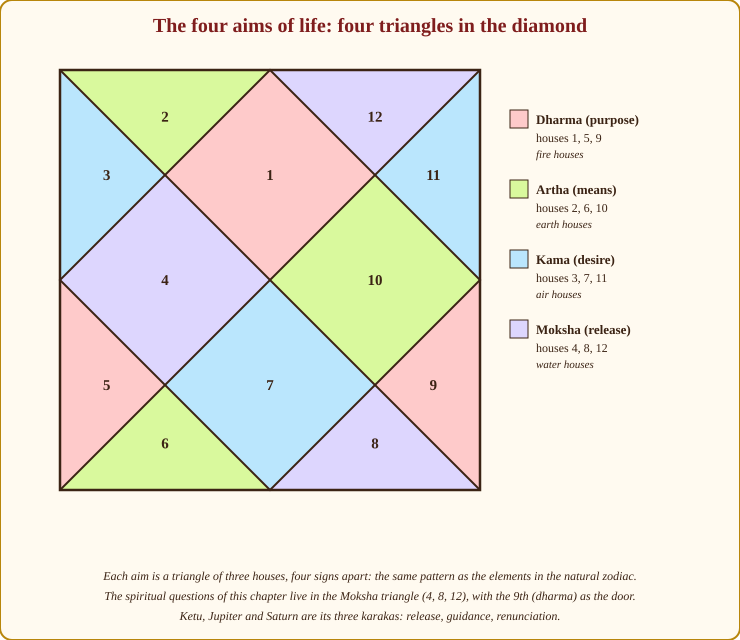
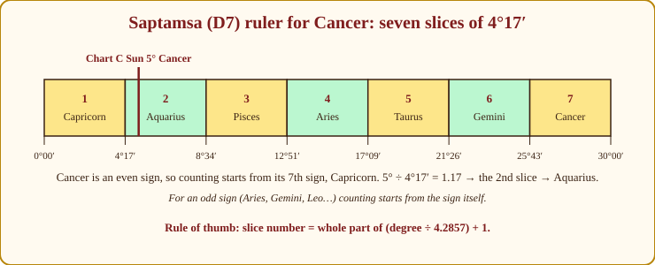
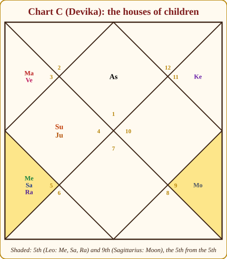
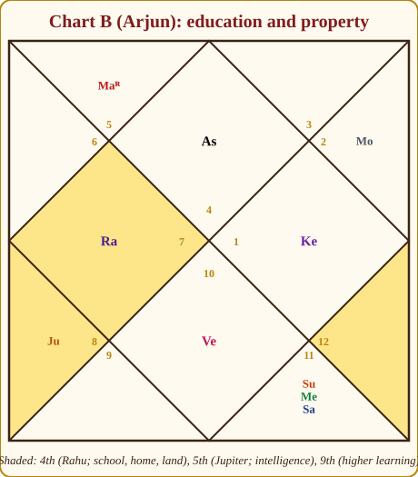
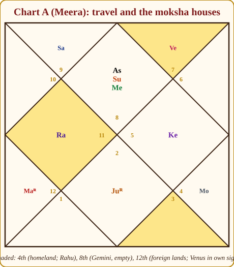

# Chapter 21: Children, Education, Property, Travel and the Spiritual Path

After career, money, marriage and health, the client's list is not finished. "Will we have children?" "Which stream should my daughter take?" "Should I buy the flat now?" "Will I settle abroad?" And, more often than you might expect, quietly at the end: "Guruji, is there something spiritual in my chart?"

Five questions, five short methods. Each one uses the same five-step reading you learned in Chapter 9 — the house, its lord, the karaka, the same house from the Moon, and the divisional chart — and each ends with a mini checklist you can run at the table. We will work every method on a case-study chart, and we will spend a moment on the ethics that each question carries, because every one of them can be answered cruelly.

> **🧭 Guruji's rule of thumb:** Every life question has three witnesses — the house, its lord, and its karaka planet. One witness is a rumour. Two is a lead. Three agreeing is a reading. Never speak on one.

*Figure 21.1: The four aims of life as four triangles. The questions in this chapter touch all four — children and education (5th, 9th, 4th), property (4th), travel (3rd, 9th, 12th) and moksha (4th, 8th, 12th).*

## 1. Children: the 5th house and Jupiter

> **📖 Story: The nursery and the family priest.** The 5th room of the haveli was the *nursery*, painted yellow, and Guru-ji, the family priest, was the one who blessed every birth in it. When he was strong — in his own district or exalted in Cancer, the Queen Mother's home — the cradles filled easily. When he was weak, far away in Capricorn under the old Judge's roof, or scorched standing too near the King, the family waited and prayed. And the nursery had visitors. If the old Judge sat in it, the children came late; if the Smoke-headed Stranger stood at its door, they came by an unexpected road — a clinic, an adoption, a surprise. The 9th room — the nursery's own nursery, five doors on — was where the grandmother kept the second cradle. **Rule:** 5th house and lord, Jupiter's dignity, the 9th as the 5th-from-5th; malefics there mean effort and a different road, never "no children".

**The houses.** The 5th house (Putra bhava) is children, from the Lagna and again from the Moon. Bhavat Bhavam (Appendix A.5) gives a second signal: the 5th from the 5th is the 9th. A chart with a troubled 5th but a strong 9th usually has children after effort. Read the 5th lord's house, dignity and company as you would any lord.

**The karaka.** Jupiter is the Putrakaraka, the significator of children. Its dignity is the first thing I check when a couple asks: exalted or in its own sign, and I relax; debilitated in Capricorn, combust or in the 6th, 8th or 12th, and I prepare to speak of effort.

**The Saptamsa (D7).** The divisional chart of progeny divides each sign into seven parts of 4°17′ each. For an odd sign the seven parts are counted from the sign itself; for an even sign, from its 7th sign. The slice number is the whole part of (degree ÷ 4.2857) plus one. Take Chart C's 5th lord, the Sun at 5° Cancer. Cancer is even, so we start from Capricorn. 5 ÷ 4.2857 = 1.17, whole part 1, plus 1 = the 2nd slice: Capricorn, then **Aquarius**. Devika's 5th lord falls in Aquarius in the D7 — Saturn's sign, which speaks of delay before fulfilment.

*Figure 21.2: The D7 ruler for Cancer. Seven slices of 4°17′, counted from the 7th sign because Cancer is even. The Sun at 5° lands in the second slice, Aquarius.*

**Timing.** Children arrive in the dasha of the 5th lord, of Jupiter, of planets in the 5th, or of the lord of the 5th from the Moon — supported by Jupiter's transit over the 5th, the 9th or the Lagna, or its aspect on the 5th.

**Delays and difficulty — "effort needed".** Saturn, Rahu, Ketu or Mars in the 5th or on its lord; the 5th lord in the 6th, 8th or 12th; Jupiter debilitated or combust; the 5th from the Moon similarly troubled. Two of these and I say "effort"; three or four and I say "medical support is likely to be part of the story — and it succeeds in most charts". Advanced students compute the Beeja sphuta (a point combining Sun, Venus and Jupiter, read for the husband) and the Kshetra sphuta (Moon, Mars, Jupiter, for the wife); the sign and Navamsa of each is judged for fertility. Know the names; leave them for later.

| Signal | Reads as |
|---|---|
| 🟢 Jupiter exalted, own sign or kendra; 5th lord in kendra/trikona; benefic in 5th | Children come easily; strong protection |
| 🟡 One of: Saturn, Rahu, Ketu or Mars on the 5th or its lord; 5th lord in 6, 8 or 12 | Effort, patience, possibly a delay |
| 🟡 5th lord with Rahu or Saturn; Ketu in 5th; 5th from Moon strong while 5th from Lagna is troubled | A different door: medical help, adoption |
| 🔴 Two or more of the above *and* Jupiter debilitated or combust | Medical support likely part of the story — and it succeeds in most charts |

**Putra dosha and Pitru dosha.** The tradition speaks of a "children's affliction" (Putra dosha — Rahu or Ketu with the 5th lord, malefics in the 5th) and an "ancestral affliction" (Pitru dosha — Sun with Rahu or Ketu, the 9th afflicted), and prescribes remedies for both. I present them to clients as *traditional beliefs with traditional remedies*, described in Chapter 23, and I never let them become a verdict on a couple who are already suffering.

**Number and sex of children.** The classical texts do contain rules for counting children (from the Navamsa of the 5th lord, from planets aspecting the 5th) and for predicting sons or daughters (odd signs male, even female, and so on). I tell you plainly: the counting rules are unreliable, and the sex rules are both unreliable *and* unethical to use. If a client asks you to predict or select the sex of a child, refuse, kindly and completely. It is against the law in India and against everything this science is for.

**Adoption.** The 5th lord with Rahu or Saturn, Ketu in the 5th, or the 5th from the Moon strongly placed while the 5th from the Lagna is troubled — these charts often find children by a different door. Say it as a possibility and as a blessing.

**Children's welfare from the parent's chart.** The 5th house and Jupiter also describe the children's health and fortune from the parent's side; a strong 5th means the parent's chart supports the children. The child's own chart, of course, is the real authority.

**Worked example: Chart C (Devika).** Aries Lagna. The 5th is Leo with Mercury 1°, Saturn 18° and Rahu 3°. The 5th lord, the Sun, sits in the 4th in Cancer with exalted Jupiter at 26°. The 5th from her Moon (Sagittarius) is Aries, empty, its lord Mars in the 3rd.

*Figure 21.3: Chart C. Saturn and Rahu on the 5th house with Mercury; the 5th lord Sun protected by exalted Jupiter in the 4th; the Moon in the 9th, the 5th from the 5th.*

🔴 Two heavy malefics on the 5th is the "effort" signature; anxiety about children is written in. 🟢 But look at the protections: the 5th lord sits with the exalted Putrakaraka — the strongest Jupiter possible, in a kendra. The 9th, the 5th from the 5th, holds the Moon in a benefic sign. Delay, then blessing. **Timing:** her Venus Mahadasha ran to age nineteen, the Sun Mahadasha (5th lord!) from nineteen to twenty-five — plausible but young — and the Moon Mahadasha from twenty-five to thirty-five (July 2004 to July 2014), the Moon sitting in the 9th. Within it, Moon/Jupiter ran from about June 2007 to October 2008, and Jupiter transited sidereal Sagittarius — her 9th house — from about late 2007 to late 2008, from where its 9th aspect falls on Leo, the 5th, and its 5th aspect on Aries, the Lagna. Sub-period of the Putrakaraka, Jupiter on the 9th, Jupiter aspecting the 5th and the Lagna: a child around age twenty-eight to twenty-nine. It is a constructed case, but notice how every layer had to agree before I named a window.

**Children mini checklist:**
1. 5th house from Lagna and Moon; the 9th as the 5th-from-5th.
2. 5th lord — house, dignity, company.
3. Jupiter's dignity.
4. D7: the 5th lord's and Jupiter's D7 signs.
5. 🔴 Delay factors (Saturn, Rahu, Ketu, Mars; lord in 6/8/12); 🟡 adoption hints; 🟢 Jupiter's protection.
6. Timing: 5th lord, Jupiter, planets in the 5th; Jupiter's transit.
7. Ethics: "effort", never "never"; refuse sex prediction.

> **🪔 Consultation tip:** To a couple trying for a child: "Your chart asks for effort and patience here, and it also carries a strong protection — the planet of children is at its best in your chart. The periods that favour you are ___. Please take the doctor's help without hesitation; the chart and the clinic work together."

## 2. Education: the 4th, 5th and 9th

> **📖 Story: The school-room and the land deed.** The 4th room of the haveli did double duty. In the morning it was the *school-room*, where the Queen Mother sat the children down and the young Prince taught them letters; in the afternoon the same room held the iron box with the *land deeds*, because the 4th is home, mother, schooling and property all at once — the things that hold you up from below. The tutors who visited decided the subjects: the Commander taught drill and engineering, Guru-ji law and scripture, Shukracharya music and drawing, the old Judge history and patience (his pupils were slow and finished everything), the Headless Sadhu mathematics, and the Smoke-headed Stranger foreign tongues and strange machines. Upstairs, the 5th room was where the clever child read alone, and the 9th was the college in the next town. **Rule:** 4th = schooling and foundations; 5th = intelligence; 9th = higher learning; the planet dominating them and Mercury names the subject. The 4th also holds the land deed.

**The houses.** The 4th is schooling and foundations; the 5th is intelligence and higher study; the 9th is higher learning, philosophy and the university; the 2nd is early speech and the first learning. **The planets:** Mercury is grasp and memory, Jupiter wisdom and the teacher, Saturn perseverance (the slow scholar who finishes), Ketu mathematics, research and intuition. The divisional chart is the **D24 Chaturvimsamsa** (Appendix A.10) — advanced, but worth glancing at for the D24 Lagna lord.

**"Which subject?"** Find the planet that most strongly influences the 4th, the 5th, the 9th and Mercury — by placement, lordship or aspect — and read the table:

| Planet | On the 4th/5th/Mercury | Subjects |
|---|---|---|
| Sun | 🟡 | Medicine, administration, political science |
| Moon | 🟢 when bright | Psychology, hospitality, nursing, home sciences |
| Mars | 🔴 restless | Engineering, surgery, defence studies, sports |
| Mercury | 🟢 grasp | Commerce, mathematics, languages, computer science |
| Jupiter | 🟢 wisdom | Law, philosophy, finance, teaching, religion |
| Venus | 🟢 | Arts, design, media, fashion, music |
| Saturn | 🟡 slow but finishes | History, geology, law, labour studies, archaeology |
| Rahu | 🔴 breaks, foreign | Technology, foreign languages, aviation, unconventional fields |
| Ketu | 🟡 intuitive | Mathematics, astrology, research, coding |

**Breaks in education (🔴):** the 4th lord in the 6th, 8th or 12th; Rahu or Ketu in the 4th; Saturn on the 4th or on Mercury. These do not mean "no degree"; they mean gaps, changes of stream, or a return to study later. **Foreign education:** the 12th or 9th, or Rahu, connected with the 4th or 5th.

**Worked example: Chart B (Arjun).** Cancer Lagna. The 4th is Libra with Rahu; its lord Venus sits in the 7th in Capricorn. The 5th is Scorpio with Jupiter at 22°; its lord Mars is retrograde in the 2nd. Mercury at 2° Aquarius sits in the 8th with the Sun and Saturn.

*Figure 21.4: Chart B. Rahu in the 4th (unconventional or foreign schooling), Jupiter in the 5th (a deep intellect), Mercury in the 8th with Saturn (a slow-ripening, research-type mind).*

A deep, research-type mind: Jupiter in Scorpio in the 5th, Mercury in the 8th (the house of the hidden) in Aquarius (science, systems). Saturn on Mercury makes him a late bloomer in examinations — the boy who is quiet in class and brilliant at twenty-six. Rahu in the 4th: unconventional schooling, or a foreign or technology-flavoured education. **Timing:** the Moon Mahadasha (age 1.8 to 11.8) covered his school years with the Lagna lord strong in the 11th — a happy school life. The Mars Mahadasha (11.8 to 18.8) is the 5th and 10th lord, the yogakaraka: good board results, a strong entry into higher study. The Rahu Mahadasha from 18.8 — Rahu in the 4th — points to higher education abroad or in a new-technology field, with a change of institution along the way. Subjects: Saturn–Mercury–Sun in Aquarius and Jupiter in Scorpio favour data, actuarial or research science, and the systems side of technology.

**Education mini checklist:**
1. 4th (school), 5th (intellect), 9th (higher learning), 2nd (early learning).
2. Mercury and Jupiter — dignity; Saturn's touch for perseverance or delay.
3. Dominant planet on 4th/5th/9th/Mercury → subject table.
4. 🔴 Break indicators; 🟡 foreign-study indicators; 🟢 strong Mercury/Jupiter.
5. Dashas over school and college years.
6. D24 Lagna lord for confirmation.

> **⚠️ Common beginner mistake:** Telling a parent "your child is not academic" because Saturn sits on Mercury. Saturn on Mercury is the *slow* scholar, not the poor one — many of the finest researchers I know carry it. Say "late bloomer; do not judge by the tenth-standard marks".

## 3. Property and vehicles: the 4th house

**The houses and karakas.** The 4th house and its lord govern land, home and vehicles. Mars is the karaka of land; Saturn of old property and long leases; Venus of vehicles and comforts; the Moon of the home itself. The **D4 Chaturthamsa** is the divisional chart of fixed assets; the **D16 Shodasamsa** covers vehicles and comforts (Appendix A.10).

**Buying timing:** the dasha of the 4th lord or of a planet in the 4th; Mars or Saturn transiting the 4th (the effort and the paperwork); Jupiter transiting or aspecting the 4th (the blessing). **Inheritance:** the 8th house and its lord. **Disputes over property:** links between the 4th, 6th and 8th, and Mars–Saturn contacts touching the 4th.

**Worked example: Chart B (Arjun).** Rahu in the 4th in Libra: property acquired through unconventional means — a loan-heavy purchase, a flat abroad, a joint venture. The 4th lord Venus in the 7th: property through the spouse or a partnership — a home bought jointly, or in the partner's city. Mars, the land karaka, retrograde in the 2nd in Leo: family land, ancestral property that returns to him after a delay. Vehicles from Venus in Capricorn in the 7th: sober, practical vehicles bought late and kept long; a partner who influences the choice. **Timing:** the Rahu Mahadasha (2013–2031) is itself the 4th-house planet's period — property matters run through it, with the Rahu/Venus sub-period (mid-2025 to mid-2028), the 4th lord's, the most likely purchase window.

**Property mini checklist:**
1. 4th house, sign, occupants; 4th lord — house, dignity.
2. Mars (land), Saturn (old property), Venus (vehicles), Moon (home).
3. D4 for property, D16 for vehicles.
4. Timing: 4th lord's dasha, Mars/Saturn/Jupiter on the 4th.
5. 🟡 Inheritance (8th); 🔴 disputes (4th–6th–8th, Mars–Saturn); 🟢 Jupiter or 4th lord strong on the 4th.

## 4. Travel and foreign settlement

> **📖 Story: The road out of the kingdom.** Three roads left the haveli. The 3rd-house road went to the neighbouring villages — the Prince rode it weekly with letters. The 9th-house road went to the far temple towns, where Guru-ji made his pilgrimages and the young went to the great university. The 12th-house road went out through the back gate, past the hospital ward, to the border and beyond — the road out of the kingdom altogether. At that gate stood the Smoke-headed Stranger, who knew every foreign tongue and whispered of lands where the family name meant nothing and anything was possible. When the keeper of the 4th room — the home — was found standing at the 12th gate, or talking with the Stranger, the elders knew: this child will not stay. The Judge and the Priest, arriving at that gate in the same season, stamped the passport. **Rule:** 3rd short, 9th long, 12th foreign; Rahu and movable signs add distance; 4th lord in 12th or with Rahu = leaving the homeland; double transit on 12th/9th times it.

**The houses.** The 3rd is short journeys; the 9th long journeys and pilgrimage; the 12th foreign lands and settlement away from home; the 7th travel for work or with a partner. **The planets:** Rahu is the foreigner and the foreign shore; the Moon is movement itself. **Signs:** movable signs on the Lagna, 9th or 12th add restlessness and distance. **Leaving the homeland:** the 4th lord in the 12th, or with Rahu, or the 4th afflicted while the 12th is strong. **Timing:** the double transit of Jupiter and Saturn on the 12th or 9th, inside the dasha of the 12th or 9th lord or of Rahu.

**Worked example: Chart A (Meera).** Venus, the 12th lord, sits in the 12th in its own sign Libra, a movable sign: comfortable foreign connections, money spent abroad, ease in distant places — the traveller who is at home in a hotel. Rahu in the 4th: distance from the homeland and from the mother's house; a life lived partly away. The 9th lord Moon in the 9th in its own sign: long journeys, pilgrimage, higher learning in far places, and good fortune from them. Her Venus Mahadasha (2007–2027) is the foreign period of her life; the Venus/Rahu sub-period (2014–2017) and Venus/Ketu (2026–2027) are its most mobile stretches.

*Figure 21.5: Chart A. The 4th (Rahu — distance from home), the 8th (empty) and the 12th (Venus in its own sign — comfortable foreign connections) form her moksha triangle.*

**Travel mini checklist:**
1. 3rd, 9th, 12th, 7th — occupants and lords.
2. Rahu and the Moon; movable signs on Lagna, 9th, 12th.
3. 4th lord in 12th / with Rahu → leaving the homeland.
4. Dasha of 12th/9th lord or Rahu; double transit on 12th/9th.

## 5. Spirituality and moksha

> **📖 Story: The quiet wing.** The west side of the haveli — the 4th, 8th and 12th rooms — was the *quiet wing*: the inner courtyard where the mother lit the evening lamp, the locked room where the family kept what it did not speak of, and the back room by the gate where the old ones sat with their beads. Three courtiers had leave to walk there. The Headless Sadhu, who had no face left to lose, sat in the courtyard and taught letting-go. Guru-ji came through the 9th-house door with the scriptures and showed the way. And the old Judge, who had served all his life, was the one who finally set down his keys — renunciation is his. Most of the family never left the haveli for the forest; they did their sadhana in the quiet wing between the kitchen and the shop. When the Stranger sat with Guru-ji, the elders did not panic: the Priest simply preached a stranger sermon. **Rule:** moksha lives in 4–8–12 with the 9th as the door; Ketu, Jupiter and Saturn are its karakas; householder spirituality is the norm; Jupiter–Rahu questions, it does not destroy.

**The houses and karakas.** The moksha triangle is the 4th, 8th and 12th (Appendix A.5); the 9th (dharma) is the door to it. Ketu is the moksha-karaka; Jupiter is the guru; Saturn is renunciation. Read the 12th lord and any planets in the 12th for the shape of a person's inner life. From Jaimini (Chapter 15), the Atmakaraka — the planet of highest degree — and its Navamsa sign, the Karakamsa, are read for the soul's direction; Ketu or Jupiter in or aspecting the Karakamsa is the classical mark of a spiritual bent.

**Pravrajya (renunciation) yogas.** The classics list combinations for the renunciate's life: four or more planets in one sign (the strongest planet's nature shows the order of renunciation); Saturn alone aspecting the Lagna lord with no other aspect; the Moon in a Saturn drekkana aspected by Saturn or Mars. Present these as classical, and remember that in a modern chart "four planets in a sign" is more often a specialist than a sannyasi.

**Sannyasa versus householder spirituality.** Most spiritual charts belong to householders. The 12th and Ketu show detachment; the 9th and Jupiter show faith and practice; the 4th shows inner peace found at home. A chart can be deeply spiritual with a family, a job and a mortgage. Say so — many clients arrive half-afraid the chart will tell them to leave.

**The Guru–Chandala myth.** Jupiter with Rahu is called Guru–Chandala yoga in popular teaching and read as "anti-guru": disrespect for teachers, unorthodox beliefs. The balanced view: Rahu magnifies whatever it touches; Jupiter with Rahu gives unconventional, questioning, sometimes brilliant spiritual and intellectual life — the reformer, the scientist of religion. It goes wrong only when Jupiter is otherwise weak.

**Worked example: Chart A (Meera).** Ketu in the 10th in Leo: the career itself becomes the spiritual practice — teaching, astrology, research as a discipline of the self. The Moon in Cancer in the 9th: devotion, faith, a mind that rests in worship. Mars, the Lagna lord, in Pisces in the 5th — Jupiter's sign, the house of mantra: mantra and upasana (personal practice) suit her. The 12th lord Venus in the 12th: comfortable in solitude and retreat; a spiritual life with beauty in it — music, ritual, a well-kept altar.

**Worked example: Chart B (Arjun).** Three planets in the 8th — Sun, Mercury and a combust Saturn in Aquarius: the occult, depth psychology, research into hidden things; a mind that goes down rather than up. Ketu in the 10th: detachment from the ordinary ambitions of career. Jupiter in Scorpio in the 5th: interest in mantra, tantra, the transformative practices; the 5th is the house of mantra and Scorpio the sign of hidden power. His path is the researcher's — through the 8th house.

> **💡 Did you know?** Teachers of the tradition often observe that the charts of astrologers themselves show a strong 8th or 12th house and a prominent Ketu — Ketu being the karaka of Jyotish, the "headless" planet that sees without eyes. It is offered as a charming tradition, not a rule; I have known excellent astrologers with neither.

**Spirituality mini checklist:**
1. 4th, 8th, 12th — occupants and lords; the 9th as the door.
2. Ketu (moksha), Jupiter (guru), Saturn (renunciation) — placement and dignity.
3. Atmakaraka and Karakamsa; Ketu/Jupiter there.
4. 12th lord — where, and how comfortable.
5. Pravrajya yogas — noted as classical.
6. Householder or renunciate? 🟢 Almost always householder; say so. 🟡 Pravrajya yogas present — a specialist more often than a sannyasi.

> **🪔 Consultation tip:** When a client asks about spirituality, they are usually asking whether their inner life is *allowed*. The answer is always yes. "Your chart shows a real inner pull, expressed through ___ (the career, worship, study, solitude). It does not ask you to leave anything; it asks you to bring depth to what you already do."

> **📕 From Lal Kitab:** In the Lal Kitab tradition, Ketu is read in the 6th house as its permanent house and is linked to children (especially sons) and to dogs; the commonly taught remedy for troubles with progeny or with Ketu is to feed and care for dogs and to keep the household free of harshness toward the young. This belongs to Lal Kitab's separate system and is not blended with the Parashari reading above. *(Source: Lal Kitab, Pt. Roop Chand Joshi, 1939–1952 Urdu editions; Hindi translations vary.)*

## In one breath

- Children: the 5th (from Lagna and Moon) and the 9th (5th from 5th), the 5th lord, Jupiter's dignity, the D7; malefics on the 5th mean effort, not never; refuse sex prediction. Devika: two malefics on the 5th, but the 5th lord with exalted Jupiter and the Moon in the 9th — delay, then blessing, plausibly in Moon/Jupiter around 2007–2008.
- Education: the 4th, 5th, 9th and Mercury; the dominant planet names the subject; Saturn on Mercury is the late bloomer. Arjun: research mind, unconventional or foreign higher study in the Rahu period.
- Property: the 4th and its lord, Mars (land), Saturn (old property), Venus (vehicles), D4 and D16; time by the 4th lord's dasha and transits on the 4th. Arjun: property through partnership and loans; family land through retrograde Mars.
- Travel: the 3rd, 9th, 12th and 7th, Rahu, the Moon, movable signs; the double transit on the 12th or 9th. Meera: Venus in its own 12th, Moon in its own 9th — the comfortable traveller; Venus Mahadasha is her foreign era.
- Spirituality: the moksha triangle 4–8–12 with the 9th as the door; Ketu, Jupiter, Saturn; Atmakaraka and Karakamsa; Pravrajya yogas as classical curiosities; householder spirituality is the norm; Jupiter–Rahu is not "anti-guru". Meera's career is her practice; Arjun's path runs through the 8th house.

## Practice

> **✍️ Practice:**
> 1. Compute the D7 sign of Chart C's Jupiter (26° Cancer) and of Chart A's 5th lord Jupiter (8° Taurus). Show the working.
> 2. Chart A (Meera): the 5th is Pisces with retrograde Mars; the 5th lord Jupiter is retrograde in the 7th. Judge her children question in three sentences, using the 5th from the Moon as well.
> 3. Chart C (Devika): which planet dominates her 4th, 5th and 9th, and which subject table row would you read? Explain in two sentences.
> 4. A client with the 4th lord in the 12th and Rahu in the 9th asks whether they will settle abroad. What do you check next, and how do you phrase the answer?
> 5. Chart B: which of Arjun's planets is the Atmakaraka (highest degree, seven-karaka scheme), and what does its placement suggest about his spiritual direction?

Answers

1. Jupiter 26° Cancer: even sign, count from Capricorn; 26 ÷ 4.2857 = 6.07, whole part 6, plus 1 = 7th slice → Capricorn, Aquarius, Pisces, Aries, Taurus, Gemini, **Cancer**. Jupiter is in Cancer in D7 too (Vargottama in the D7 — exalted there as well: strong progeny signature). Jupiter 8° Taurus: even sign, count from Scorpio; 8 ÷ 4.2857 = 1.87, whole part 1, plus 1 = 2nd slice → Scorpio, **Sagittarius**. Meera's 5th lord falls in its own sign in the D7.
2. The 5th holds Mars, her Lagna lord, retrograde in Jupiter's sign — energy on the 5th but a friendly one, not a heavy malefic. The 5th lord Jupiter is in a kendra (7th), retrograde, aspected by nothing hostile, and falls in its own sign Sagittarius in the D7. The 5th from her Moon (Cancer) is Scorpio — her Lagna — holding Sun and Mercury, strong. Children are supported; the retrograde planets suggest some waiting or a change of plan, not denial.
3. Saturn — it sits in the 5th with Mercury and Rahu, and from Leo its 3rd, 7th and 10th aspects fall on Libra (7th), Aquarius (11th) and Taurus (2nd), so it dominates the 5th by occupation; Mercury (3rd and 6th lord) beside it adds the intellect. Read the Saturn–Mercury rows: history, law, geology, labour studies, or structured analytical fields, with Rahu adding technology. Jupiter exalted in the 4th (the house of schooling) with the Sun adds law, finance, medicine or teaching as a second stream.
4. Check the 12th lord's dignity and dasha, Rahu's dasha, whether the Lagna or 12th is a movable sign, and whether Jupiter and Saturn will both touch the 12th or 9th in the coming years. Phrase: "Your chart carries a strong pull away from the homeland — the house of home connects to the house of foreign lands, and the foreign planet sits in the house of long journeys. The periods that open it are ___; whether you stay is your choice, but the road is clearly there."
5. Degrees: Saturn 25°, Venus 24°, Jupiter 22°, Mars 21°, Sun 18°, Moon 6°, Mercury 2°. Saturn is the Atmakaraka. Saturn in the 8th in its own sign Aquarius, combust beside the Sun: a soul learning through discipline, patience and the hidden — the path of the researcher and the servant rather than the devotee; renunciation of the ordinary rather than of the world.

