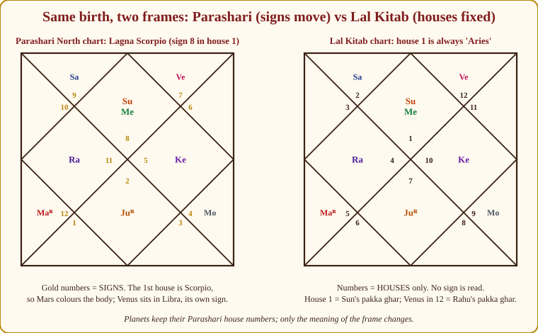
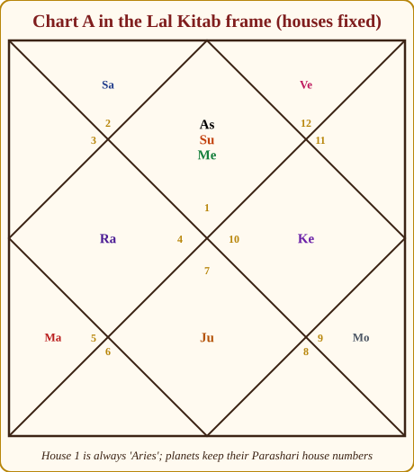
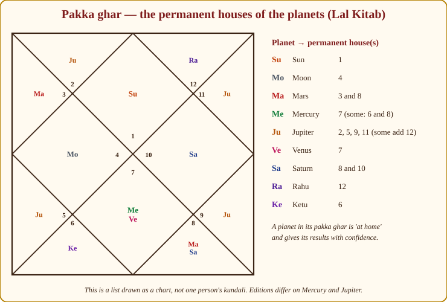
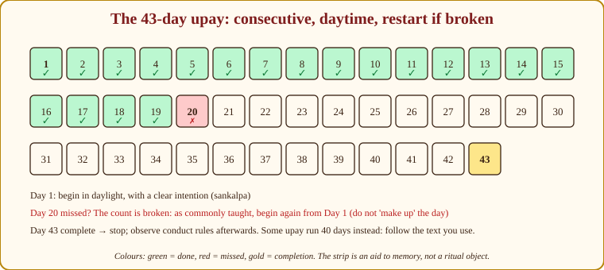

# Chapter 22: Lal Kitab — The Red Book, Clearly Labelled

> **📕 From Lal Kitab:** This whole chapter is about one book and one tradition, so — here and only here — Lal Kitab material appears in ordinary prose rather than boxed. Read every paragraph of this chapter as if it sat inside this box. The source is *Lal Kitab* by Pt. Roop Chand Joshi, written in Urdu in undivided Punjab and published in five volumes in 1939, 1940, 1941, 1942 and 1952. The Hindi translations (and the many later commentators who built courses on them) differ from one another, sometimes seriously. Wherever I am not certain that a point is in the original text, I write "as commonly taught in the Lal Kitab tradition". Verify against the edition you actually own. *(Source: Lal Kitab, Pt. Roop Chand Joshi, 1939–1952 Urdu editions; Hindi translations vary.)*

A young man came to me with a printout from an app. "Guruji, my Saturn is sleeping, my Mercury is in its pakka ghar, and I have been told to float a coconut in the river for forty-three days. But my Lagna is Scorpio and my Saturn is in Sagittarius — is that good or bad?"

Half of what he said was Parashari (Scorpio Lagna, Saturn in Sagittarius); the other half was Lal Kitab (sleeping planets, pakka ghar, the coconut). Nobody had told him they were two different languages. He was trying to read Urdu with a Sanskrit dictionary.

This chapter gives you the second dictionary — and, more importantly, teaches you to notice which language a sentence is written in. Everything in the rest of this book is Parashari. Everything in this chapter is Lal Kitab. Keep the two shelves separate and both become useful; mix them and both become noise.

## Where the Red Book came from

Pt. Roop Chand Joshi was a Punjabi from the Jalandhar district who, by the accounts that have come down to us, worked as a government accountant. Between 1939 and 1952 he published five volumes in Urdu — the working language of educated Punjab then — under the name *Lal Kitab*, "the Red Book", for its red binding. The 1952 volume is the longest and the one most Hindi translations rest on.

Three things explain the book's whole character. First, it was written **for households, not pandits**: aphorism and rhymed saying (*farmaan*), not treatise and proof; it says what to do far more than why. Second, it is **remedy-centred**: in Parashari texts remedies are a chapter at the end; in Lal Kitab they are the point, and chart-reading exists to choose the remedy. Third, the original **mixes astrology with palmistry** (*samudrik shastra*) — a chart may be built from the hand when the birth time is unknown, and the first volume's title pairs the two subjects. Modern courses drop the palmistry.

The book became enormously popular in Punjab, Haryana and Delhi and travelled with Punjabi families wherever they went; if your clients come from the north-west, you will meet it.

> **💡 Did you know?** Lal Kitab is one of very few Indian astrological texts written in a modern vernacular within living memory, with a known author and known dates. That closeness cuts both ways: the text is accessible, but there is no long chain of learned commentary to stabilise its meaning, so the "tradition" around it is largely a creation of the last fifty years.

## Why students get confused

Its words travel without a passport.

Open ten online "planet profile" videos and you will hear, in one breath: "Saturn is exalted in Libra" (Parashari), "Saturn's pakka ghar is the eighth and tenth" (Lal Kitab), and "if the house opposite Saturn is empty, Saturn is sleeping" (Lal Kitab). Each is defensible in its own system; together, unlabelled, they describe a Saturn no text ever described.

The three Lal Kitab ideas that leak most often are **pakka ghar** (a planet's permanent *house* — Parashari homes are *signs*), **sleeping planets and houses** (*soya grah / soya ghar*, with no Parashari counterpart), and **the 43-day remedies** — the coconut in the river, the feeding of dogs. None of these is in Parashara, Varahamihira or Mantreswara.

> **⚠️ Common beginner mistake:** Saying "Venus in the 12th is bad because the 12th is Rahu's house." The 12th is Rahu's *pakka ghar* — a Lal Kitab statement. In Parashari, the 12th has no owner until you know the Lagna; in Chart A the 12th is Libra, Venus's own sign, and Venus there is dignified. Same placement, two systems — say which one you are speaking in.

## The Lal Kitab chart: houses that never move

In Parashari we cast the rising sign (Lagna), put it in the 1st house, and let the other eleven follow; the sign colours everything in its house. The signs move; the houses are the frame.

Lal Kitab throws the signs away. **House 1 is always treated as Aries, house 2 as Taurus — around to house 12 as Pisces — for every person ever born.** There is no separate reading of signs at all. A planet is placed in the Lal Kitab chart by the house it occupies in the ordinary Parashari chart, and from then on only the house number matters.

*Figure 22.1: The same birth in two frames. Left, the Parashari chart: gold numbers are signs and Scorpio (8) sits in the 1st house. Right, the Lal Kitab chart: numbers are houses only, and house 1 is "Aries" for everyone. The planets keep their house numbers; only what the frame means has changed.*

Convert Chart A: Sun and Mercury in the 1st; Saturn 2nd; Rahu 4th; Mars 5th; Jupiter 7th; Moon 9th; Ketu 10th; Venus 12th. Her Lal Kitab chart is exactly those house numbers in the fixed frame.

*Figure 22.2: Chart A in the Lal Kitab frame, generated with the book's chart tool. Read the numbers as houses, never as signs.*

What changes in the reading? In Parashari, Scorpio in the 1st gives Meera's body Mars's colour — intense, private, resilient — and the Sun and Mercury are read *in Scorpio*. In Lal Kitab there is no Scorpio. House 1 is the Sun's permanent house (next section); a Sun there is "at home", read as a strong father, authority, health and self-respect.

Venus in the 12th is the sharpest contrast. In Parashari, Venus sits in Libra, its own sign, as 12th lord in the 12th — dignified, forming Vimala yoga (Chapter 10). In Lal Kitab the 12th is Rahu's permanent house, and yet, as commonly taught in the Lal Kitab tradition, Venus in the 12th is regarded as fortunate — a comfortable later life. Two roads, one hill, this time. Often they diverge, and then you must choose whose map you are reading.

> **🧭 Guruji's rule of thumb:** If a sentence mentions a *sign* — Scorpio, Libra, exaltation, own sign — it is Parashari. If it mentions only a house number and a planet, ask which system before you agree with it.

## Pakka ghar — every planet's permanent home

In Parashari a planet's home is a sign. In Lal Kitab it is a *house*, its **pakka ghar** ("permanent house"). The list, exactly as Appendix A.15 gives it:

| Planet | Pakka ghar (permanent house) |
|---|---|
| Sun | 1 |
| Moon | 4 |
| Mars | 3 and 8 |
| Mercury | 7 (some teachers and editions give 6 and 8) |
| Jupiter | 2, 5, 9, 11 (some editions add 12) |
| Venus | 7 |
| Saturn | 8 and 10 |
| Rahu | 12 |
| Ketu | 6 |

*Figure 22.3: The pakka ghar drawn as a chart. This is a list, not a real kundali — Jupiter appears four times. Where editions differ (Mercury, Jupiter), the legend says so.*

> **📖 Story: The haveli with twelve fixed rooms.** In Parashari the court travels: the King holds durbar wherever the Lagna pitches his tent, and the twelve districts (signs) turn around him. Lal Kitab builds a haveli instead — one old house with twelve rooms that never move, and every courtier has a permanent room. The King (Sun) sleeps in room 1, by the front door. The Queen Mother (Moon) keeps room 4, the heart of the house. Guru-ji (Jupiter) has the run of rooms 2, 5, 9 and 11 — treasury, nursery, prayer room and granary. Shukracharya (Venus) and the young Prince (Mercury) share room 7, the guest hall. The Commander (Mars) guards rooms 3 and 8, the door and the vault. Old Shani-ji (Saturn) keeps rooms 8 and 10, the vault and the workshop. The Smoke-headed Stranger (Rahu) sleeps in room 12, the outhouse; the Headless Sadhu (Ketu) in room 6, with the dogs. In his own room a courtier speaks with authority; in another's room he is a guest, treated as that host treats him. **Rule:** Pakka ghar is the planet's permanent room — strong there; elsewhere, read host and guest.

In Chart A, Saturn in the 2nd is a guest in one of Jupiter's rooms; Rahu in the 4th in the Moon's; Ketu in the 10th in Saturn's; Venus in the 12th in Rahu's. As commonly taught, a planet in its own pakka ghar needs no remedy for itself.

> **💡 Did you know?** Put the pakka ghar list beside Parashara's natural house significators (Appendix A.5) and you get a small shock. Parashari gives the Sun as karaka of the 1st, the Moon of the 4th, Jupiter of the 2nd, 5th, 9th and 11th, Venus of the 7th, and Saturn of the 8th and (with others) the 10th. Lal Kitab's pakka ghar: Sun 1, Moon 4, Jupiter 2/5/9/11, Venus 7, Saturn 8/10. Nearly identical. Whatever else the Red Book is, its author knew the Parashari scheme and built his fixed chart on it. The differences — Mars in 3 and 8, Mercury in 7, Ketu in 6, Rahu in 12 — are where Lal Kitab is most itself.

## The planets as a family, with their objects

Every planet stands for people, colours, foods, metals and animals, and these are what the remedies use. The table is as commonly taught in the Lal Kitab tradition; the original scatters these correspondences across its volumes.

| Planet | Family member | Objects, foods, metals, colours, animals (as commonly taught) |
|---|---|---|
| Sun | Father; the king of the house | Wheat, jaggery, copper; the monkey |
| Moon | Mother | Milk, rice, silver, water; white |
| Mars | Brother | Red lentils (masoor), copper, neem; red; the sweet *rewri* |
| Mercury | Daughter, sister | Green things, moong, ivory; the goat and the parrot |
| Jupiter | Guru, grandfather; the father in some readings | Saffron, gold, turmeric, gram (chana); yellow; the peepal tree |
| Venus | Wife; the woman of the house | Curd, ghee, perfume, silk; the cow |
| Saturn | Servant, uncle, labourer | Iron, mustard oil, leather, black; the crow; the buffalo |
| Rahu | In-laws; the outsider who has joined the family | The elephant, blue and smoky colours, coconut, barley; silver in some readings; lead |
| Ketu | Son, nephew; the dog at the gate | Blanket, sesame, multicoloured cloth; the dog |

> **📖 Story: The elephant and the dog.** Parashari seats the planets in a court; Lal Kitab seats them at a family dinner. The father breaks the wheat roti (Sun); the mother pours the milk (Moon); the brother argues over the red lentils (Mars); the daughter brings green moong (Mercury); the grandfather says grace with a turmeric mark on his forehead (Jupiter); the wife sets out curd and ghee (Venus); the old servant refills the mustard-oil lamp (Saturn). At the gate stand two who are not quite family: the in-laws' elephant, huge, smoke-blue and impossible to ignore (Rahu), and the loyal dog who guards the door and wants a blanket in winter (Ketu). Feed each what it eats and the dinner goes well. **Rule:** In Lal Kitab every planet is a family member with its own foods, metals, colours and animals — and its remedy feeds that member.

So when a Lal Kitab astrologer says "your Mercury is troubled", he is also thinking "something about your sister or daughter"; when he says "your Rahu is bad", he is thinking about in-laws.

## Mangal Nek and Mangal Bad — the two faces of Mars

Lal Kitab gives one planet two names: **Mangal Nek**, the good Mars — courage, a brother who stands by you — and **Mangal Bad**, the bad Mars — quarrels, blood, a brother turned enemy. In Parashari we judge Mars by sign, house, lordship and aspects and call it a functional benefic or malefic *for a given Lagna* (Chapter 8). Lal Kitab has no such machinery; it judges Mars by its company and its room.

> **📖 Story: The Commander's company.** Senapati Mangal is a fine officer when he rides alone: he guards the brothers, protects the land, fights only when he must. But watch whom he drinks with. Seated beside old Shani-ji the Judge he turns sullen and cruel; beside the Smoke-headed Stranger he schemes; beside the Headless Sadhu he stops caring who gets hurt. And put him in room 4 — the Queen Mother's room — or room 8, the vault, and he is a soldier in the wrong place, breaking the crockery. That, as commonly taught in the Lal Kitab tradition, is Mangal Bad; the same man riding alone in the open is Mangal Nek. **Rule:** Mars with Saturn, Rahu or Ketu, or in the 4th or 8th, is read as Mangal Bad; Mars alone elsewhere is Mangal Nek (as commonly taught; verify your edition).

| Mars's condition (as commonly taught) | Verdict |
|---|---|
| Alone, not in the 4th or 8th | 🟢 Mangal Nek |
| With the Sun or Moon (pairings differ by commentator) | 🟡 Mixed — check your edition |
| With Saturn, Rahu or Ketu | 🔴 Mangal Bad |
| In the 4th or 8th house | 🔴 Mangal Bad |

In Chart A, Mars sits in the 5th with no Saturn, Rahu or Ketu beside it — 🟢 Mangal Nek. Parashari agrees in spirit by a different road: Mars is Meera's Lagna lord, a functional benefic for Scorpio, in the trikona 5th. When the systems disagree, I trust Parashari and use Lal Kitab for its remedy.

## Friends and enemies, Lal Kitab style

Parashari friendship (Appendix A.3) has seven planets and leaves the nodes out. Lal Kitab treats Rahu and Ketu as full planets with friends and enemies of their own. As commonly taught in the Lal Kitab tradition (the seven-planet core matches Parashara closely; the nodes are added):

| Planet | 🟢 Friends | 🔴 Enemies | 🟡 Neutral |
|---|---|---|---|
| Sun | 🟢 Moon, Mars, Jupiter | 🔴 Venus, Saturn, Rahu, Ketu | 🟡 Mercury |
| Moon | 🟢 Sun, Mercury | 🔴 Rahu, Ketu | 🟡 Mars, Jupiter, Venus, Saturn |
| Mars | 🟢 Sun, Moon, Jupiter | 🔴 Mercury, Ketu | 🟡 Venus, Saturn, Rahu |
| Mercury | 🟢 Sun, Venus, Rahu | 🔴 Moon | 🟡 Mars, Jupiter, Saturn, Ketu |
| Jupiter | 🟢 Sun, Moon, Mars | 🔴 Mercury, Venus, Rahu | 🟡 Saturn, Ketu |
| Venus | 🟢 Mercury, Saturn, Ketu | 🔴 Sun, Moon, Rahu | 🟡 Mars, Jupiter |
| Saturn | 🟢 Mercury, Venus, Rahu | 🔴 Sun, Moon, Mars | 🟡 Jupiter, Ketu |
| Rahu | 🟢 Mercury, Saturn, Ketu | 🔴 Sun, Mars, Venus | 🟡 Moon, Jupiter |
| Ketu | 🟢 Venus, Rahu | 🔴 Moon, Mars | 🟡 Sun, Mercury, Jupiter, Saturn |

Two cautions: commentators differ on several cells (Ketu especially), and Lal Kitab uses this table mainly for the *guest–host* relationship and *companions in one house*, not for Parashari's five-fold friendship.

## How houses look at each other (drishti)

In Parashari the aspect belongs to the planet (Chapter 6): every planet sees its 7th, Mars adds the 4th and 8th, Jupiter the 5th and 9th, Saturn the 3rd and 10th. In Lal Kitab the aspect belongs to the **house**: houses look at one another in fixed pairs, and whatever sits in a house joins its gaze. The mainstream idea, as commonly taught in the Lal Kitab tradition, is that opposite houses see each other — 1–7, 2–8, 3–9, 4–10, 5–11, 6–12 — with special pairings on top that commentators list differently (some give the 2nd looking at the 6th, or the 3rd at the 11th). I will not print a precise table; I have seen three that contradict one another. Take the opposite-house principle as safe and anything beyond it from your edition.

## Sleeping houses, sleeping planets — and the blind and the righteous

A **sleeping house** (*soya hua ghar*) is, as commonly taught, a house with no planet in it — dormant, not bad, giving results only when something *wakes* it. A **sleeping planet** (*soya hua grah*) is, as commonly taught, a planet whose partner house is empty, so it has nothing to act upon. Appendix A.15 puts it carefully: the precise rules differ between editions.

> **📖 Story: The unlit rooms.** Walk through the haveli at night. Rooms with someone in them have a lamp burning. Rooms with nobody in them are dark — not cursed, just unlit — and the tradition calls them asleep (*soya ghar*). Now notice a courtier in a lit room staring across the courtyard at a dark one: the room he "looks at" is empty, so he has nobody to talk to, and he dozes off — a sleeping planet (*soya grah*). A traveller (a transit) walks into the dark room and lights the lamp; the watcher wakes and begins to speak. In Parashari there is no such thing: an empty room is read through whoever owns it, and the Queen Mother in her own district is wide awake whether or not anyone sits opposite. **Rule:** In Lal Kitab an empty house, and a planet facing one, are dormant until a transit or related planet wakes them — rules vary by edition.

In Chart A, houses 3, 6, 8 and 11 are empty and would be called asleep; her Moon in the 9th looks at the empty 3rd and, in this reading, sleeps until something enters it. In Parashari the same Moon, in its own sign in the 9th, is emphatically awake.

Two more terms. An **andha** (blind) planet is, as commonly taught in the Lal Kitab tradition, one placed where it cannot "see" its own matters and so acts weakly; a **dharmi** (righteous) planet does no harm by its placement even if a natural malefic, and must not be "punished" with a remedy. The words are genuine Lal Kitab vocabulary; the placements behind them vary by edition.

## Rin — debts the family pays together

Parashari karma is personal: the chart shows *your* ripened karma (*prarabdha*), and the remedy is yours. Lal Kitab adds a **family level**: certain placements are **rin** — a debt (the Hindi/Urdu word for a loan) carried by the family line and repaid by the *whole family together*, each blood relative contributing an equal share, in one collective act.

The list below is as commonly taught in the Lal Kitab tradition. The *concept* is unquestionably in the text; the placement rules vary by edition. Verify against your edition.

| Debt (rin) | Read from (as commonly taught; varies by edition) | Whose debt |
|---|---|---|
| Self debt (*swayam rin*) | Venus in the 5th | One's own past conduct |
| Ancestral debt (*pitru rin*) | Jupiter afflicted in the 2nd, 5th, 9th or 12th; or Venus, Mercury or Rahu in the 2nd, 5th, 9th or 12th — rules differ most here | Forefathers |
| Mother's debt (*matru rin*) | Ketu in the 4th | Mother's line |
| Sibling debt | Mercury or Ketu in the 1st or 8th | Brothers |
| Spouse debt (*stri rin*) | Sun, Moon or Rahu in the 2nd or 7th | Partner's line |
| Daughter's / sister's debt | Moon in the 3rd or 6th | Women of the family |
| Divine / natural debt (*kudarti rin*) | Moon or Mars in the 6th | Owed to nature or the divine |
| Anti-social debt (*apni* or *ajaat rin*) | Various — the most variable of all | Owed to society |

Run Chart A through the table and the edition problem appears at once: Mercury in the 1st flags a sibling debt; Venus in the 12th is an ancestral debt by the broader *pitru rin* rule and nothing by the narrower Jupiter-only version. When editions disagree, say so, rather than sending a family of twelve to the river on one photocopy.

> **📖 Story: The family ledger.** In every old Punjabi house there was a ledger (*bahi*) of the family's debts — not one person's, the family's. Grandfather borrowed for a wedding; the loan passed down; nobody remembers the wedding, but the entry remains. Lal Kitab reads certain placements as entries in that ledger. Guru-ji sitting troubled in the treasury, the nursery, the prayer room or the outhouse — an unpaid debt to the ancestors. The Headless Sadhu in the Queen Mother's room — a debt to the mother's line. The young Prince at the front door — a debt to the brothers. Nobody argues about whose fault it is. Every blood relative puts an equal coin on the table, and the entry is struck out in one act. **Rule:** Rin is a family debt read from specific placements (lists vary by edition) and paid collectively, in equal shares by all blood relatives.

The remedy, as commonly taught, is collective — equal contributions pooled for a temple offering (ancestral debt), or a specified material collected from each blood relative and given together (mother's debt). The *shape* is the constant; the material varies.

> **🪔 Consultation tip:** When a client asks "Do we have pitru rin?", never answer with a yes that frightens a whole family. Say: "In the Lal Kitab tradition your chart *may* show an ancestral debt — editions differ on the rule. If your family would like to do the collective remedy, it is gentle and costs little. If not, the Parashari remedy for the same planet is available to you alone." Give them the choice, and the size of the choice.

## Varshphal — the thirty-five-year wheel

Parashari times life with dashas — Vimshottari's 120-year cycle (Chapter 13) — and refines the year with the Tajaka annual chart (Chapter 15). Lal Kitab's annual method, also called **varshphal**, is built on a **35-year cycle**: each year of life, counted from birth, is ruled by a planet from a fixed table, and after thirty-five years the table repeats. The year-lord's condition in the birth chart — its room, whether it is in its pakka ghar, whether asleep, its companions — flavours the year, and a badly placed year-lord gets that planet's upay.

I am deliberately **not** printing the table: several versions circulate and disagree, and a wrong table is worse than none. Take it from your edition. Used properly: suppose a client's 42nd year is ruled, in her edition, by Saturn, and her Saturn sits in the 2nd — a guest in Jupiter's room — facing an empty 8th. The tradition reads a Saturn year slow to wake, touching Jupiter's matters (wealth, elders), and prescribes Saturn's upay. In Parashari you would look at her Vimshottari period and Saturn's transit; lay the two side by side, never one in place of the other.

## Upay — the remedies

Now the heart of the book. Remember the **principles** above all; they are what make Lal Kitab remedies safe to recommend, and they are given exactly as Appendix A.15 has them:

1. **Simple household items, low cost.** Wheat, milk, a coconut, a blanket. Never a stone that costs a month's salary.
2. **Forty or forty-three consecutive days**, depending on the upay. The count is the discipline.
3. **If a day is missed, begin again from day one.** No making up, no doubling.
4. **Never harm any being.**
5. **Never for revenge or selfish gain against another.** An upay to defeat a rival is not an upay; the tradition treats it as backfiring.
6. **Not a substitute for conduct.** A man who floats coconuts and cheats his brother has done nothing.
7. **Done in the daytime**, as commonly taught in the Lal Kitab tradition.
8. **House-and-planet specific.** There is no "Saturn remedy"; there is "Saturn in the 2nd remedy".

*Figure 22.4: The 43-day upay as a calendar strip. Green days are done; the red day is missed, and the count returns to day 1. I give clients this strip; the discipline is the remedy.*

> **📖 Story: The fast that starts again.** A grandmother keeps a forty-three-day upay for her grandson's Saturn. Every morning, before the sun is high, she puts grain out for the crows. On the twentieth morning she is unwell and forgets. That evening she does not double the next day's grain; she quietly turns the calendar back to day one. "Shani-ji does not count grain," she says. "He counts whether you kept your word." The remedy was never the grain. It was forty-three unbroken mornings of remembering someone smaller than herself. **Rule:** An upay runs 40 or 43 consecutive days in daylight; a missed day restarts the count; the discipline, not the object, is the remedy.

### The classic upay families by planet

These are the remedies you will meet most often, by planet for orientation — but remember principle 8: in the book itself the remedy depends on the house too. Every line is as commonly taught in the Lal Kitab tradition.

| Planet | Classic upay families (as commonly taught) |
|---|---|
| Sun | Offer water to the rising Sun; respect and serve the father; feed monkeys; give jaggery or wheat |
| Moon | Keep silver on the person or in the house; offer water or milk; serve the mother; keep a vessel of water or a little rice at the bedside |
| Mars (Bad) | Distribute *rewri* or sweets; plant or water a neem tree; keep a red handkerchief; feed one's brothers |
| Mercury | Feed cows green fodder; give away green things (moong, cloth); care for sisters and daughters; avoid caged birds; some editions warn against certain green objects in the house — check yours |
| Jupiter | Saffron or turmeric *tilak*; give gram dal or turmeric; respect teachers and elders; water a peepal tree; keep gold |
| Venus | Give curd, ghee or perfume; feed cows; honour the wife; keep the home clean; give white or silk cloth |
| Saturn | Mustard oil (give it, or keep some in an iron vessel); feed crows; give iron, but — as commonly taught — do not *buy* iron on a Saturday; help servants, labourers and the elderly; avoid alcohol |
| Rahu | Float a coconut (or barley) in running water; keep silver, or a small silver elephant; feed birds; avoid blue and smoky colours; clear the house of rubbish and broken electricals |
| Ketu | Feed dogs, or keep a dog; give blankets to the poor; wear gold in the ear (a custom many Punjabi families keep for sons); give sesame; care for one's son and nephews |

Notice that these are almost all **acts of care directed at the planet's family member** — the dinner-table story again.

### The kayde — the don'ts

Alongside the upay come rules of conduct (*kayde*). As commonly taught in the Lal Kitab tradition: take nothing free, and accept no gifts from certain relatives (in-laws, for Rahu); no gambling or speculation; honour the in-laws; keep the house clean, lit and repaired; do not lie or break a promise made during a remedy; do not harm animals, especially the planets' animals. Any grandmother would say the same. That is the point.

## How I actually use Lal Kitab in my practice

Let me be plain about my position; you should form your own.

**Parashari is my predictive engine**: Lagna, functional benefics and malefics, divisional charts, Vimshottari and transits. I have never found the fixed chart to predict *events* as well, and I do not think it was built to.

**Lal Kitab is my remedy toolbox and second lens.** When Parashari says "Saturn is the difficult planet, and Saturn's period is coming", I often reach for a Lal Kitab upay — crows, mustard oil, service to labourers — because it is cheap, harmless, disciplining and easy to explain. When a family carries something bigger than one chart, rin gives me a language Parashari lacks.

### When a client says "a Lal Kitab astrologer told me…"

Translate before you react. The little dictionary I keep in my head:

| The client says… | It means in Lal Kitab | Parashari counterpart to check |
|---|---|---|
| "My Saturn is in its pakka ghar" | Saturn in the 8th or 10th | Saturn's sign dignity and lordship for that Lagna |
| "My Moon is sleeping" | The Moon's partner house is empty (edition-dependent) | Moon's sign, strength, aspects — an empty house means little in Parashari |
| "I have Mangal Bad" | Mars with Saturn/Rahu/Ketu, or in the 4th/8th | Mars's functional nature; Kuja dosha (Chapter 10) if marriage is the question |
| "We have pitru rin" | A family debt read from Jupiter/Venus/Mercury/Rahu in 2, 5, 9 or 12 | Pitru dosha (Sun, 9th house, Rahu–Ketu with Sun) — a *different* concept with a different remedy |

Usually the other astrologer was not wrong; he was speaking Lal Kitab.

### Parashari and Lal Kitab, side by side

| Aspect | Parashari (BPHS) | Lal Kitab |
|---|---|---|
| The chart | Lagna sets the 1st house; signs move | Houses fixed; house 1 = Aries for everyone |
| Signs | Central: dignity, exaltation, lordship | Not read separately |
| Aspects | Belong to the planet | Belong to the house; vary by commentator |
| Timing | Vimshottari and other dashas; transits; Tajaka varshaphal | 35-year varshphal; transits that wake sleeping houses |
| Karma | Personal (prarabdha) | Personal plus family (rin) |
| Remedies | Mantra, daan, gemstone, fasting, worship (Chapter 23) | Household-item upay, 40/43 days, conduct rules; no gemstones as a rule |
| Philosophy | A map of tendencies; dharma and knowledge | Practical, family-centred: do the upay, mend your conduct |

### Strengths and limits

| Feature of Lal Kitab | Verdict |
|---|---|
| Accessible — a farming family can perform its remedies without a priest | 🟢 Strength |
| Remedies cheap, harmless, aimed at care and discipline; no gemstone bills | 🟢 Strength |
| Family-karma view (rin) — much of what enters a consulting room is family pattern | 🟢 Strength |
| Fixed houses throw away sign dignity — Venus in Libra and Venus in Virgo become the same | 🔴 Limit |
| Edition variance — two sincere practitioners can read one placement in opposite ways | 🔴 Limit |
| Over-commercialisation — 43-day "kits" and courses that borrow the vocabulary unlabelled | 🔴 Limit (not the book's fault) |
| As a predictive engine for timed events | 🟡 Weaker than Parashari; use as a second lens |

> **🪔 Consultation tip:** A remedy is a prescription, not a sale. Before suggesting any upay, from either system, ask yourself three questions: Does it harm anyone? Does it cost more than the client can comfortably spare? Would I do it myself in their place? If any answer is wrong, do not prescribe it. Then say to the client, in these words: "This is one of several things you can do. It supports your effort; it does not replace it. You may choose not to do it."

## In one breath

- Lal Kitab is a separate system: five Urdu volumes by Pt. Roop Chand Joshi (1939–1952), remedy-centred, written for households, originally mixed with palmistry; Hindi editions and commentators vary.
- Its chart keeps the houses fixed — house 1 is always "Aries" — and reads no signs; planets are placed by their Parashari house number.
- Each planet has a permanent house (pakka ghar): Sun 1, Moon 4, Mars 3 & 8, Mercury 7, Jupiter 2/5/9/11, Venus 7, Saturn 8 & 10, Rahu 12, Ketu 6 — with edition variants; the list closely mirrors Parashari's house significators.
- Planets are read as a family with objects and animals; Mars has two faces (Nek and Bad); Rahu and Ketu are full planets with friends and enemies; aspects belong to houses, not planets.
- Empty houses and their planets may be "asleep" until woken; "andha" and "dharmi" are genuine terms whose exact rules vary.
- Rin (karmic debt) is a family-level idea with a collective remedy; the placement lists are commonly taught but edition-dependent.
- Varshphal follows a 35-year cycle from a fixed table — take the table from your edition, never from memory.
- Upay use cheap household items for 40 or 43 consecutive days, restart if broken, harm no being, are never for selfish gain, and never replace conduct.
- Use Lal Kitab as a remedy toolbox and a second lens; keep Parashari as the predictive engine; always say which system you are speaking in.

## Practice

> **✍️ Practice:**
> 1. Convert Chart B (Arjun; Parashari houses: Sun, Mercury, Saturn in 8; Moon in 11; Mars in 2; Jupiter in 5; Venus in 7; Rahu in 4; Ketu in 10) into the Lal Kitab frame. Which planets sit in their own pakka ghar? Which are guests, and in whose house?
> 2. In Chart A, which houses are empty and therefore "asleep" in the Lal Kitab reading? Give one Parashari reason why an empty house is not a problem in itself.
> 3. Is Chart B's Mars Mangal Nek or Mangal Bad by the commonly taught conditions? What does Parashari say about the same Mars for a Cancer Lagna?
> 4. A client says: "A Lal Kitab astrologer told me my Venus is in Rahu's house, so my marriage will suffer." Write three sentences translating this for a Parashari reading of Chart A, without dismissing the other astrologer.
> 5. Write the eight upay principles from memory. Then design a 43-day Saturn upay for a client of modest means and check it against all eight.

Answers

1. In their own pakka ghar: Saturn (8th), Jupiter (5th), Venus (7th) — and Mercury if your edition gives Mercury the 6th and 8th. Guests: Sun and Mercury in the 8th (Saturn's and Mars's room); Moon in the 11th and Mars in the 2nd (Jupiter's rooms); Rahu in the 4th (the Moon's); Ketu in the 10th (Saturn's).
2. Houses 3, 6, 8 and 11 — "asleep" as commonly taught. In Parashari an empty house is read through its lord and its aspects; Meera's empty 11th is read through Mercury, strong in the 1st.
3. Mars in the 2nd, alone — 🟢 Mangal Nek. Parashari: Mars owns the 5th and 10th for Cancer and is the yogakaraka (Appendix A.6), in a friend's sign — 🟢 functional benefic. The systems agree.
4. Something like: "The astrologer is speaking Lal Kitab, where the 12th is Rahu's permanent house for everyone — and in that tradition, as commonly taught, Venus in the 12th is actually read as fortunate, so the conclusion is stronger than the system supports. In the Parashari chart your Venus is in Libra, its own sign, as 12th lord in the 12th, which forms Vimala yoga — a dignified, protective placement. Marriage is judged from the 7th house and its lord — Jupiter in your 7th — and from the Navamsa, not from the 12th alone."
5. Household items and low cost; 40 or 43 consecutive days; restart if broken; harm no being; never for selfish ends; not a substitute for conduct; daytime; house-and-planet specific. Sample (as commonly taught): each morning for 43 days put out food for crows and on Saturdays give a little mustard oil to a labourer, while keeping a promise to speak respectfully to helpers. Check all eight — and confirm the rule for Saturn in *that* client's house against your edition.

