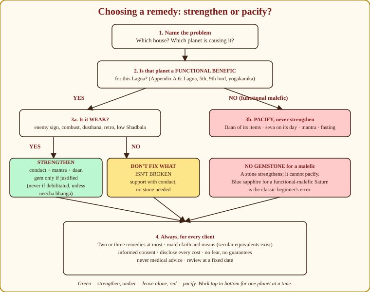
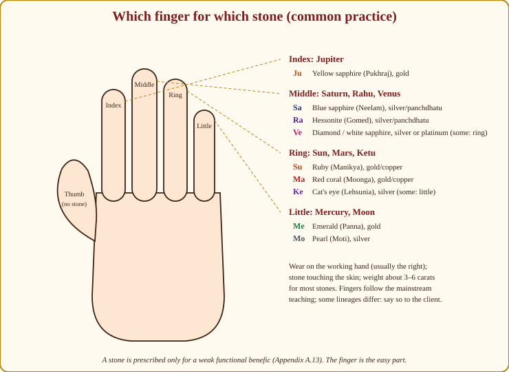
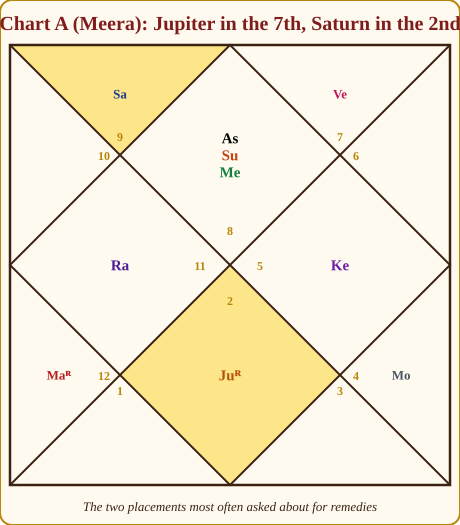
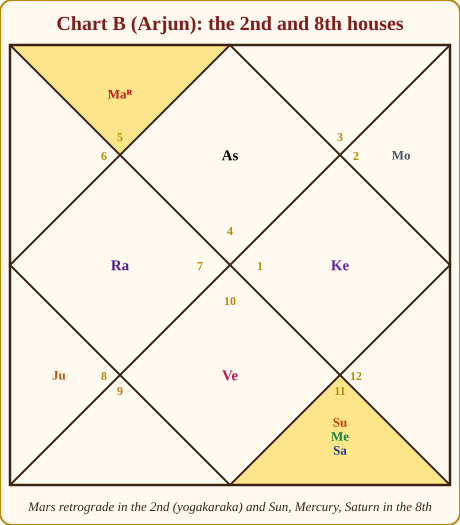

# Chapter 23: Remedies (Upaya) — Helping Without Harming

A woman came to me wearing three rings — a yellow sapphire, a blue sapphire and a hessonite. She had spent close to two lakh rupees over four years on the advice of three astrologers, and nothing in her life had moved. "Guruji, which stone is wrong?"

All of them. Her chart had Taurus rising. Jupiter, lord of the 8th and 11th, is a functional malefic for Taurus; the yellow sapphire was *strengthening* the wrong planet. The blue sapphire was for Saturn, her yogakaraka and already well placed — a stone for a planet that was not broken. The hessonite was for Rahu, which nobody should be strengthening. Three rings, three sales, no prescription.

I took nothing off her that day. I explained each ring and gave her one thing to do for forty days that cost nothing. She came back a year later without the rings. That is what this chapter is about: remedies as **prescription, not sale**.

## What a remedy is — and what it is not

A remedy (*upaya*) works, first, on the **mind and conduct of the client**. A person who feeds crows every Saturday for forty days has practised humility, regularity and attention to the neglected — precisely what a troubled Saturn asks for. The planet's signification and the remedy's action are aligned, and the alignment does its work in the doer.

A remedy works, second, as an **act of intention** (*sankalpa*): a deliberate, repeated offering aligned with a planet's nature softens or supports that planet's results. Take this as faith, as psychology, or both; I have never seen it help someone who did it resentfully.

A remedy is **not** a substitute for effort, medicine, law or common sense; not a bargain with fate; not a guarantee; and never a way to harm a third party.

> **🧭 Guruji's rule of thumb:** A remedy is a prescription, not a sale. If you would be embarrassed to explain to a doctor why you prescribed it, do not prescribe it.

## The classical basis

Parashara devotes chapters of *Brihat Parashara Hora Shastra* to remedies: propitiation of the planets (*graha shanti*), worship of the nine planets (*Navagraha*), and remedies for afflictions such as birth in Gandanta or on an eclipse day. The Vedic tradition behind him gives us two words. **Shanti** — peace, pacification — is the ritual and mental quieting of a disturbing influence. **Daan** — giving — is the release of something of value into the world as an act of dharma. Around these grew the *Navagraha* worship you still see in every South Indian temple.

Later texts and the Puranas add the mantras, fasts and gemstones. Gemstones are the youngest of the family, widespread only in the last few centuries; the modern gem trade has shaped "Vedic remedies" more than any rishi did. Stones are not the heart of astrology; they are its edge.

> **💡 Did you know?** The nine-planet shrine (*Navagraha sannidhi*) in almost every Tamil temple arranges the planets so that no two face each other — the Sun in the centre, the others around it, each looking a different way. Devotees walk around it nine times. The arrangement is a lesson in itself: the planets are honoured together, as a court, not bargained with one at a time.

## The four families of remedy

In Parashari practice I sort remedies into four families, and I teach students to reach for them in this order:

1. **Conduct, worship and fasting** (*vrata, puja, seva*) — what you do and how you live. Free, safe, always appropriate.
2. **Mantra** (*japa*) — repeated sacred sound for a planet or its deity. Free, safe, needs discipline.
3. **Donation** (*daan*) — giving away the items of a planet. Low cost, safe, and it *pacifies*.
4. **Gemstone** (*ratna*) — wearing a planet's stone. Costly, and it *strengthens*; therefore the most restricted.

The pair that organises everything is **strengthen versus pacify**. A weak functional benefic needs strengthening — mantra, conduct, perhaps a stone. A troublesome functional malefic needs pacifying — daan, seva, fasting, mantra — and *never* a stone.

*Figure 23.1: The remedial decision tree I keep on my desk. Work down it for one planet at a time. Most consultations end in the middle branch (leave it alone) or the right branch (pacify).*

## Mantra (japa)

The planetary **seed mantras** (*beeja mantras*) are the working tools. They are given exactly as Appendix A.13 has them, with the classical counts.

| Planet | Beeja mantra | Classical japa count |
|---|---|---|
| Sun | Om Hraam Hreem Hraum Sah Suryaya Namah | 7,000 |
| Moon | Om Shraam Shreem Shraum Sah Chandraya Namah | 11,000 |
| Mars | Om Kraam Kreem Kraum Sah Bhaumaya Namah | 10,000 |
| Mercury | Om Braam Breem Braum Sah Budhaya Namah | 9,000 (some 17,000) |
| Jupiter | Om Graam Greem Graum Sah Gurave Namah | 19,000 |
| Venus | Om Draam Dreem Draum Sah Shukraya Namah | 16,000 |
| Saturn | Om Praam Preem Praum Sah Shanaye Namah | 23,000 |
| Rahu | Om Bhraam Bhreem Bhraum Sah Rahave Namah | 18,000 |
| Ketu | Om Sraam Sreem Sraum Sah Ketave Namah | 17,000 |

The counts are classical totals for a complete undertaking (*anushthana*); the tradition multiplies them by four in Kali Yuga — Saturn's 23,000 becomes 92,000 — and a priest is usually hired to complete such a number. For a client doing it herself I prescribe a **daily** practice: one *mala* of 108 a day for forty days or for a troubling sub-period. Regularity matters more than arithmetic.

Beside them stands the **Navagraha Stotra** attributed to Vyasa — nine verses, one per planet, chanted in every Navagraha shrine. Know at least the opening of each:

- **Sun:** *Japakusuma-sankasham kashyapeyam mahadyutim…* ("Red as the hibiscus, son of Kashyapa, of great radiance…")
- **Moon:** *Dadhi-shankha-tusharabham kshirodarnava-sambhavam…*
- **Mars:** *Dharani-garbha-sambhutam vidyut-kanti-samaprabham…*
- **Mercury:** *Priyangu-kalika-shyamam rupena-pratimam budham…*
- **Jupiter:** *Devanam cha rishinam cha gurum kanchana-sannibham…*
- **Venus:** *Hima-kunda-mrinalabham daityanam paramam gurum…*
- **Saturn:** *Nilanjana-samabhasam ravi-putram yamagrajam…*
- **Rahu:** *Ardha-kayam maha-viryam chandraditya-vimardanam…*
- **Ketu:** *Palasha-pushpa-sankasham taraka-graha-mastakam…*

The older **Vedic Navagraha mantras** — Rig Vedic verses used by priests in the fire ritual (*homa*) — are a different set; the Sun's begins *Aa krishnena rajasa vartamano…*, and the rest are best learned from a priest. Do not confuse them with the Vyasa stotra.

The tradition also matches planets to **deities**; a client who already has a devotion is best served by it:

| Planet(s) | Traditional devotional remedy |
|---|---|
| Saturn, Mars | Hanuman Chalisa; Hanuman worship on Saturday and Tuesday |
| Jupiter, Mercury | Vishnu Sahasranama; Vishnu or Dakshinamurti worship |
| Venus, Rahu | Durga and Lakshmi worship; Durga Saptashati for Rahu |
| Ketu | Ganesha worship and mantra |
| Moon, and health generally | Shiva; the Mahamrityunjaya mantra |
| Sun | Aditya Hridayam; Surya Namaskar at dawn |

### How to prescribe a mantra

Say **which planet**, **which mantra**, **which count**, **which day to begin**, **how long**, and **what for** — the *sankalpa*, spoken at the start: "I undertake this for forty days for steadiness in my work." The classic frame: begin on the planet's weekday, in the morning after bathing, facing east, one mala of 108 a day, for forty days. Pronunciation matters less than sincerity.

## Daan — giving away

The donation table, exactly as Appendix A.13, with the traditional recipients added:

| Planet | Items (daan) | Traditional recipient | Day |
|---|---|---|---|
| Sun | Wheat, jaggery, copper, red cloth | Father-figures, temple priests, the poor | Sunday |
| Moon | Rice, milk, white cloth, silver | Mother-figures, women, the elderly | Monday |
| Mars | Red lentils (masoor), red cloth, copper | Young men, soldiers, brother-figures | Tuesday |
| Mercury | Green moong, green cloth, books | Students, young girls | Wednesday |
| Jupiter | Chana dal, turmeric, yellow cloth, books | Teachers, priests, scholars | Thursday |
| Venus | Curd, ghee, rice, white cloth, perfume | Young women, wife-figures | Friday |
| Saturn | Black sesame, mustard oil, iron, black cloth | Labourers, servants, the disabled and destitute | Saturday |
| Rahu | Coconut, blue cloth, mustard, blanket | The marginalised, sweepers, lepers (traditionally) | Saturday (some: Wednesday) |
| Ketu | Blanket, sesame, multi-coloured cloth; feeding dogs | Ascetics, the homeless; dogs | Tuesday / Thursday |

> **📖 Story: Don't give away your Jupiter.** A family whose Guru-ji was frail — a weak Jupiter, lord of their Lagna — was told to "do Jupiter's daan". Every Thursday for a year they carried turmeric, gram and yellow cloth out of the house and gave them away. The Priest grew thinner. Daan is a farewell gift: it says to a planet, "I release what you grip; I ask nothing more of you." That is exactly what you say to the drunken Judge you want out of the hall. It is the opposite of what you say to the Priest whose blessing you need. For him you bring gifts *in* — his mantra, his Thursday, respect for teachers, and, if he is truly weak, his yellow stone. **Rule:** Donate the items of a functional malefic to pacify it; never donate the items of a functional benefic you need.

I have met more than one client faithfully donating the very planet they needed to keep. Check the functional nature (Appendix A.6) before you write a single daan on the card.

Timing: the planet's weekday, in daylight, with the recipient's dignity preserved — a gift handed over with respect, never thrown from a car window. The quality of the giving is the remedy.

## Gemstones (ratna)

> **📖 Story: The loudspeaker and the muzzle.** A gemstone is a loudspeaker. Hang it on a courtier and everything he says is heard in every room of the haveli. Now picture the wedding at which Shani-ji, the old Judge of Labour, has had too much to drink and is lecturing the guests on their failings. The frightened host runs to the jeweller: "Give me a blue sapphire — for Saturn!" The jeweller, smiling, hands him a loudspeaker. The lecture is now audible in the street. What the host needed was a muzzle — a quiet word, a plate of food, a task for the old man's hands: daan, seva, mantra. No jeweller sells a muzzle. **Rule:** A stone strengthens; it never pacifies. Prescribe it only for a weak functional benefic, never for a functional malefic.

**A gemstone strengthens.** It does not pacify, calm, block or "balance". Therefore a stone is prescribed **only** for a **functional benefic** that **needs strength** — the Lagna lord, the 5th or 9th lord, the yogakaraka — and **never** for a functional malefic. Not for the 6th, 8th or 12th lord; not for the 3rd or 11th lord; not for Rahu or Ketu except in the narrowest, rarest circumstances that you will not meet in your first decade of practice.

Two refinements. A **debilitated** planet gets no stone unless its debility is cancelled (Neecha Bhanga, Chapter 10). And a functional benefic **already strong** — exalted, in its own sign, in a kendra with dig bala — needs no stone either. Don't fix what isn't broken.

| May this planet receive a gemstone? | Verdict |
|---|---|
| Lagna lord, 5th or 9th lord, or yogakaraka — and weak (enemy sign, combust, dusthana, retrograde, low strength) | 🟢 Yes — the only case |
| Lagna lord, 5th or 9th lord — but already strong (exalted, own sign, kendra) | 🟡 Not needed; don't fix what isn't broken |
| Kendra lord (4th, 7th, 10th) that is a natural benefic | 🟡 Rarely; only with a clear reason and a trial |
| Debilitated planet without Neecha Bhanga | 🔴 No |
| Lord of the 3rd, 6th, 8th, 11th or 12th (functional malefic for that Lagna) | 🔴 Never |
| Rahu or Ketu | 🔴 Never, in your first decade of practice |

| Planet | Stone (Hindi) | Metal | Finger | Approx. weight |
|---|---|---|---|---|
| Sun | Ruby (Manikya) | Gold or copper | Ring | 3–6 carats |
| Moon | Pearl (Moti) | Silver | Little | 3–6 carats |
| Mars | Red coral (Moonga) | Gold or copper | Ring | 5–9 carats (coral is light) |
| Mercury | Emerald (Panna) | Gold | Little | 3–6 carats |
| Jupiter | Yellow sapphire (Pukhraj) | Gold | Index | 3–6 carats |
| Venus | Diamond (Heera) or white sapphire | Silver or platinum | Middle (some: ring) | Diamond ½–1 carat; white sapphire 3–6 |
| Saturn | Blue sapphire (Neelam) | Silver, panchdhatu or iron | Middle | 3–6 carats; 3-day trial |
| Rahu | Hessonite (Gomed) | Silver or panchdhatu | Middle | 3–6 carats |
| Ketu | Cat's eye (Lehsunia) | Silver or panchdhatu | Ring or little | 3–6 carats |

*Figure 23.2: Fingers and stones by common practice. Index for Jupiter; middle for Saturn, Rahu and Venus; ring for Sun, Mars and Ketu; little for Mercury and Moon. Lineages differ on Venus and Ketu — say so.*

Metals and fingers follow the mainstream teaching; weights are the working range. The stone must **touch the skin** (open-backed setting), on the **working hand**, first worn on the planet's **weekday**, after washing in milk and water and 108 repetitions of its mantra. That is the whole ritual.

### The trial period

Blue sapphire is famous for a **three-day trial**: kept under the pillow or worn loosely for three nights, and returned if the days bring bad dreams, accidents, illness or a sharp turn of luck. I extend the idea to *every* stone: wear it a week, watch, stop if anything feels wrong.

### Never wear enemies together

> **📖 Story: Two parties, one hand.** The court has two parties (Chapter 3). The Royal Party — the King, the Queen Mother, the Commander and Guru-ji the Priest — wears ruby, pearl, coral and yellow sapphire. The People's Party — the young Prince, Shukracharya the Minister of Pleasure and old Shani-ji the Judge, with the Smoke-headed Stranger and the Headless Sadhu at their table — wears emerald, diamond, blue sapphire, hessonite and cat's eye. Seat both parties on one small hand and they quarrel all day: the King's ruby shouting at the Judge's sapphire on the next finger, the Queen Mother's pearl flinching from the Stranger's hessonite. My client with three rings had seated the Priest beside the Judge. **Rule:** Never wear the stones of enemy planets together; keep the Royal Party's stones and the People's Party's stones apart.

| Pair | Wear together? |
|---|---|
| Ruby + pearl, ruby + coral, ruby + yellow sapphire (Royal Party) | 🟢 Yes |
| Emerald + diamond, emerald + blue sapphire, diamond + blue sapphire (People's Party) | 🟢 Yes |
| Coral + yellow sapphire, pearl + yellow sapphire | 🟢 Yes |
| Yellow sapphire + emerald; pearl + emerald | 🟡 Traditions differ — avoid unless a teacher you trust allows it |
| Ruby + blue sapphire, ruby + diamond, ruby + hessonite | 🔴 No |
| Pearl + hessonite, pearl + cat's eye, pearl + blue sapphire | 🔴 No |
| Coral + emerald, coral + blue sapphire, coral + hessonite | 🔴 No |
| Yellow sapphire + diamond, yellow sapphire + blue sapphire | 🔴 No |

### Substitute stones (upa-ratna)

The precious stones are expensive; the tradition allows cheaper substitutes, and I prescribe them freely:

| Precious | Substitute (upa-ratna) |
|---|---|
| Ruby | Garnet, red spinel |
| Pearl | Moonstone |
| Red coral | Carnelian |
| Emerald | Peridot, green tourmaline |
| Yellow sapphire | Citrine, yellow topaz |
| Diamond | White sapphire, white zircon |
| Blue sapphire | Amethyst, iolite, lapis lazuli |
| Hessonite | Orange zircon |
| Cat's eye | Tiger's eye |

### Quality and certification

Glass does nothing but lighten the purse. Insist on a **natural, untreated** stone with a certificate from a recognised gemmological laboratory, a dealer who accepts returns, and a price range told to the client *before* they shop. Never sell stones yourself; never take commission.

> **⚠️ Common beginner mistake:** Prescribing a stone as the *first* remedy, because it is the one the client expects and the one that pays. Reverse the order. Conduct first, mantra second, daan third; a stone only when the analysis says a functional benefic is weak and the client's means allow. In my practice fewer than one client in ten leaves with a stone recommendation.

> **🪔 Consultation tip:** On stone-selling. The temptation is real. A beginner earns five hundred rupees for a reading and could earn five thousand on a sapphire. The industry built on that arithmetic has done more damage to astrology's name than any sceptic. If you sell stones, your prescriptions are no longer trusted — not by the client, and, soon, not by you. Read charts; let jewellers sell jewels.

## Fasting (vrata)

The weekday fasts are the oldest household remedies: **Monday** for the Moon and Shiva, **Tuesday** for Mars and Hanuman, **Thursday** for Jupiter, **Friday** for Venus and the goddess, **Saturday** for Saturn; and **Ekadashi**, the eleventh lunar day, for Vishnu. A fast is usually one meal a day, or fruit and milk, until sunset.

Health first. No fasting for diabetics, pregnant or nursing women, the frail, children, or anyone whose medication needs food — say so aloud. For them a fast becomes a *restriction* (no salt, grain, meat or alcohol) on the planet's day. The point is a small act of self-command, not hunger.

## Seva and conduct — the remedies that always work

If I had to keep only one family of remedies, it would be this one.

> **📖 Story: The Judge's Saturday.** Shani-ji, the old Judge of Labour, cannot be bribed and cannot be flattered — a stone does not impress him and a sweet does not soften him. He was a servant before he became a judge, and he remembers. What he watches is how you treat his people: the labourer, the sweeper, the old man nobody visits. Bring him nothing; instead, on his day, give your hour to someone who works with his hands. Then he nods, and the sentence he was about to pass becomes a lesson instead. Every planet has such a door, and it is always a person. **Rule:** Each planet is honoured by caring for the people it signifies, on its weekday; Saturn by seva to the poor, the old and those who labour.

Each planet's signification tells you exactly what conduct pacifies or honours it:

| Planet | Conduct remedy (seva) |
|---|---|
| Sun | Respect the father and authority; punctuality; face the dawn; keep your word in public |
| Moon | Care for the mother and for women who are mothers; keep regular sleep; give water; tend the emotional life |
| Mars | Control anger; protect younger siblings; physical discipline; donate blood |
| Mercury | Honest speech; teach someone what you know; care for a sister or a young student |
| Jupiter | Respect teachers and elders; study something daily; give knowledge freely |
| Venus | Honour the spouse and women generally; cleanliness and beauty in the home; the arts |
| Saturn | Serve the poor, the elderly, labourers and servants; punctuality and thrift; humility |
| Rahu | Discipline and routine; avoid intoxicants, gambling and shortcuts; help outsiders and migrants |
| Ketu | Feed dogs; meditate; serve ascetics and the dying; practise detachment from a specific craving |

Every line is something a wise grandmother would prescribe without a chart; the chart tells you *which* grandmother's advice this person needs most.

## Yantras and rudraksha

A **yantra** is a geometric diagram of a planet or deity, engraved on copper or drawn on paper, kept on the altar; the nine planetary yantras are number-squares. It is a focus for daily attention; its power is what you bring to it.

**Rudraksha** beads — seeds of the *Elaeocarpus* tree, sacred to Shiva — are classified by their natural faces (*mukhi*), matched by tradition to planets: **1 Sun, 2 Moon, 3 Mars, 4 Mercury, 5 Jupiter, 6 Venus, 7 Saturn, 8 Rahu, 9 Ketu**. The five-faced bead is the universal, safe, cheap one I most often suggest. Fakes are common; buy from a temple or trusted source.

## Colours and directions

The Vastu-lite version: honour a planet with its colour — saffron for the Sun, white for the Moon and Venus, red for Mars, green for Mercury, yellow for Jupiter, dark blue or black for Saturn, smoky blue for Rahu, multicolour for Ketu — and avoid a malefic's colour on its day. One common scheme of directions: Sun east, Venus south-east, Mars south, Rahu south-west, Saturn west, Moon north-west, Mercury north, Jupiter north-east. Facing the planet's direction for its mantra is harmless; rearranging a client's house is a separate profession.

## The remedial logic — how to choose

> **📖 Story: The vaidya's slip of paper.** My grandfather's physician never sold medicine. He listened, pressed the wrist, named the trouble, and wrote three lines on a slip of paper: one thing to stop, one thing to take, one thing to do. Then he named the day to return. He would not write a fourth line — "a patient with seven instructions follows none" — and he would not write a tonic for a man who was already strong: "why fatten a healthy bull?" When a patient begged for the expensive syrup, he asked what it was for. That slip is what a remedy prescription should look like: the trouble named, tonic or sedative decided, two or three lines, a review date, no sale. **Rule:** Name the planet and house; decide strengthen or pacify; prescribe at most three things; write it down; review.

Here is the procedure, in the order I follow it:

1. **Identify the problem house and planet** from the analysis — not from the client's fear. The chart says where the pressure is; the dasha says when.
2. **Decide: strengthen or pacify.** Functional benefic and weak → strengthen. Functional malefic troubling the house → pacify. Functional benefic and already strong → leave it alone.
3. **Prefer conduct + mantra + daan.** Gems only when justified by step 2 and by means.
4. **Match the client's faith and means.** A Muslim, Christian, Sikh or non-religious client gets remedies in their own language: charity for daan, a prayer of their tradition or a silent discipline for a mantra, service for puja, the planet's weekday as the day. "On Saturdays, for forty days, give something to a labourer and speak to no one harshly" is a Saturn remedy in any religion.
5. **Never more than two or three remedies at once.** A client with seven instructions does none.

### The remedy prescription card

I write every prescription on a card the client takes home:

- **Name / chart reference · Date**
- **Concern:** (in the client's words)
- **Chart reading:** house(s) ___ · planet ___ · period ___ (from–to)
- **Aim:** 🟢 strengthen ___ / 🔴 pacify ___ / 🟡 leave alone
- **Remedy 1 (conduct):** ___ — daily / on ___days
- **Remedy 2 (mantra or prayer):** ___ — count ___ — begin ___ — for ___ days
- **Remedy 3 (daan or charity):** item ___ — to whom ___ — on ___
- **Gemstone:** not indicated / indicated: ___, ___ carats, ___ metal, ___ finger — reason: ___ — estimated cost ___
- **Review date:** ___
- Footer, printed on every card: "These support your effort; they do not replace it. Nothing here is medical advice. You may stop any of them at any time."

The card forces you to justify every line, stops the client mis-remembering, and is your record.

> **📕 From Lal Kitab:** Lal Kitab's remedies (upay) follow their own principles and sit beside the Parashari families rather than inside them: simple household items at low cost; performed for 40 or 43 consecutive days, restarting if a day is missed; never harming any being; never for selfish gain against another; not a substitute for right conduct; done in the daytime as commonly taught; and specific to both planet and house. As a rule the tradition uses no gemstones. I draw on these upay when I want a cheap, harmless, disciplining act for a pacification — feeding crows, floating a coconut, giving a blanket — and I always tell the client which system it comes from. Chapter 22 gives the full picture. *(Source: Lal Kitab, Pt. Roop Chand Joshi, 1939–1952 Urdu editions; Hindi translations vary.)*

## Worked remedies for the three charts

For each chart: the functional nature of the planet (Appendix A.6), the decision, the remedy.

### Chart A — Meera (Scorpio Lagna)

*Figure 23.3: Chart A. Jupiter (retrograde) in the 7th and Saturn in the 2nd are the two placements clients most often ask remedies for.*

**Venus, the running Mahadasha lord (2007–2027).** Venus owns the 7th and 12th for Scorpio and is a functional malefic (A.6), sitting as 12th lord in the 12th in its own sign Libra — Vimala yoga. Decision: **do not strengthen, and do not fuss.** Venus is dignified and its period brought her marriage (2016) and a steady career; a diamond would be a sale. If Venus sub-periods bring expense or restlessness, a Friday daan of curd or white cloth is enough.

**Jupiter, 2nd and 5th lord, retrograde in the 7th in Taurus.** A functional benefic carrying wealth, children and learning. Weak? Taurus is an enemy's sign for Jupiter and it is retrograde; but it is not combust, sits in a kendra and aspects the Lagna. Weak-ish, not broken. Yellow sapphire? *In principle yes*; *in practice* begin with Thursday conduct, the Jupiter beeja mantra, no daan of Jupiter's items — and hold the stone in reserve for a Jupiter sub-period that shows strain.

**Saturn in the 2nd in Sagittarius.** Saturn owns the 3rd and 4th for Scorpio — a functional malefic (A.6) in the house of speech, family and savings. Decision: **pacify, never a blue sapphire.** Speech discipline (the 2nd is the mouth) — a specific promise about harsh words at home; Saturday seva to the elderly; the Hanuman Chalisa; a modest daan of black sesame or mustard oil. Two or three of these, not all.

**Rahu in the 4th, Ketu in the 10th.** Mother and home; career. Decision: pacify by conduct — care for her mother, order in the home, a coconut daan in Rahu sub-periods; feeding dogs, a Ganesha practice and unpaid teaching for Ketu. No hessonite, no cat's eye.

### Chart B — Arjun (Cancer Lagna)

*Figure 23.4: Chart B, generated with the book's tool. Mars retrograde in the 2nd is the yogakaraka; the Sun, Mercury and Saturn crowd the 8th.*

**Mars, retrograde in the 2nd in Leo.** Mars owns the 5th and 10th for Cancer — the **yogakaraka** (A.6), a functional benefic of the first rank. In a friend's sign, retrograde, in a wealth house — less than it could be, and Mars sub-periods recur through life. Decision: **strengthen; a red coral is justified** — five to seven carats, gold or copper, ring finger, first worn on a Tuesday. Add control of anger and speech, Tuesday Hanuman worship, no daan of red lentils.

**Saturn in the 8th in Aquarius.** Saturn owns the 7th and 8th for Cancer — neutral to malefic (A.6) — and sits in its own sign in the 8th, combust (7° from the Sun) and beside Mercury. As 7th lord it also carries his marriage. Decision: **pacify; not a blue sapphire.** A beginner sees "combust" and reaches for a stone to strengthen; but Saturn is not a planet this Lagna wants louder. Saturday seva, the Hanuman Chalisa, a daan of mustard oil in Saturn sub-periods — and, since the 8th is research and insurance, the advice to put Saturn's patience to work.

**Rahu in the 4th in Libra.** Decision: pacify — a coconut floated in running water on a Saturday, discipline at home, care for the mother, no intoxicants, especially through the Rahu Mahadasha (age 18.8–36.8, roughly 2014–2032).

**Moon, Lagna lord, in the 11th in Taurus.** The Moon is a functional benefic and Arjun's Lagna lord, sitting in Taurus — its exaltation sign, 6° past the deepest point and within its Moolatrikona range (A.2). Not weak. Decision: **a pearl is *possible*, not necessary** — it harms nothing, but "don't fix what isn't broken" says spend the money elsewhere. Monday conduct is enough.

### Chart C — Devika (Aries Lagna)

**Mars, Lagna lord, in the 3rd in Gemini.** Mars is a functional benefic (A.6) in the sign of Mercury, its natural enemy, in the 3rd — a house of effort where Mars is comfortable but not dignified. Decision: **strengthen; a red coral is justified** for the Lagna lord, particularly through Mars sub-periods. Add Tuesday conduct — protecting siblings, physical discipline, controlled anger.

**Jupiter, 9th and 12th lord, exalted in the 4th in Cancer with the Sun.** A functional benefic, exalted, in a kendra. Weak? Not remotely. Yellow sapphire? **No — don't fix what isn't broken**; a stone on an exalted kendra Jupiter is a sale. Thursday conduct honours it at no cost; the stone can be reconsidered in her Jupiter Mahadasha (age 60–76).

**Saturn and Rahu (with Mercury) in the 5th in Leo.** The 5th is children, intellect and mantra. Saturn owns the 10th and 11th for Aries — a functional malefic (A.6); Rahu is a shadow malefic; and the pair sits on her children's house. Decision: **pacify, with 5th-house remedies; no stones for Saturn or Rahu, ever, here.** Ganesha worship (the remover of obstacles, matched to Ketu and to the 5th's mantra nature), Saturday seva to children who lack teachers, a coconut daan for Rahu, the Hanuman Chalisa. Her Rahu Mahadasha (age 42–60, about 2021–2039) is exactly the time; put Ganesha first and keep the rest simple.

| Chart · planet | Functional nature | Decision |
|---|---|---|
| A · Venus (12th lord in 12th, MD 2007–2027) | 🔴 malefic, but dignified | 🟡 Leave alone; Friday daan if sub-periods pinch; no diamond |
| A · Jupiter (2nd/5th lord, retro in 7th) | 🟢 benefic, somewhat weak | 🟢 Strengthen: mantra, Thursday conduct; yellow sapphire held in reserve |
| A · Saturn (3rd/4th lord in 2nd) | 🔴 malefic | 🔴 Pacify: speech discipline, Saturday seva, Hanuman Chalisa; no stone |
| A · Rahu (4th), Ketu (10th) | 🔴 shadow malefics | 🔴 Pacify by conduct: mother, home, dogs, service |
| B · Mars (yogakaraka, retro in 2nd) | 🟢 benefic, first rank | 🟢 Strengthen: red coral justified |
| B · Saturn (7th/8th lord, combust in 8th) | 🟡 neutral to malefic | 🔴 Pacify: Saturday seva, Hanuman Chalisa; no blue sapphire |
| B · Rahu (4th) | 🔴 shadow malefic | 🔴 Pacify: coconut, discipline, care of mother |
| B · Moon (Lagna lord, exalted sign, 11th) | 🟢 benefic, strong | 🟡 Pearl possible, not necessary |
| C · Mars (Lagna lord in 3rd, enemy sign) | 🟢 benefic, weakish | 🟢 Strengthen: red coral justified |
| C · Jupiter (9th lord, exalted in 4th) | 🟢 benefic, very strong | 🟡 Leave alone; no yellow sapphire |
| C · Saturn + Rahu (5th) | 🔴 malefics | 🔴 Pacify: Ganesha, Saturday seva, coconut; no stones |

> **🧭 Guruji's rule of thumb:** Across three charts we prescribed two stones (coral for B and C), held one in reserve (yellow sapphire for A), and refused four (diamond and blue sapphire for A, blue sapphire for B, yellow sapphire and any Saturn/Rahu stone for C). That ratio — more refusals than prescriptions — is what an honest remedial practice looks like.

## Ethics — what you owe the person across the table

- **Informed consent.** Explain why each remedy is chosen, what it costs, and that they may decline.
- **No fear.** A remedy offered as escape from a threat you have just planted is extortion, however gentle the voice.
- **No guarantees.** Never say a remedy *will* bring the job, the child, the marriage. It supports; the effort is theirs.
- **Disclose costs; take no commission.** Never route a client to a dealer who pays you.
- **Never medical advice.** A client with symptoms goes to a doctor first, and you say so in those words.
- **Nothing that harms.** No remedy against another person, no injury to an animal, no fasting diabetic.

> **🪔 Consultation tip:** The exact words, for a Saturn prescription: "Looking at your chart, the pressure right now is on your fourth house — home and mother — through Saturn's period, which runs until March 2028. I am going to suggest three things, all of them free. Feeding crows or giving a little oil to a labourer on Saturdays for forty days; the Hanuman Chalisa on Saturday mornings if you are comfortable with it, or ten quiet minutes if you are not; and a promise to yourself about how you speak at home. These support your effort — they do not replace it, and none of them is medical advice. You may stop any of them whenever you wish. I am not recommending a stone; nothing in your chart calls for one. Let us review in six months."

## In one breath

- A remedy works on the client's mind and conduct in alignment with the planet's meaning; it is a prescription, not a sale, and never a guarantee.
- Four families in Parashari practice: conduct/worship/fasting, mantra, daan, gemstone — reach for them in that order.
- The organising question is **strengthen or pacify**: strengthen a weak functional benefic; pacify a troublesome functional malefic.
- Mantras: the nine beeja mantras with their classical counts (×4 in Kali Yuga); the Vyasa Navagraha stotra; deity practices matched to planets; prescribe planet, count, day, duration and sankalpa.
- Daan pacifies: donate a malefic's items to its traditional recipients on its day; never give away the items of a benefic you need.
- Gemstones strengthen: only for a weak functional benefic, never for a malefic, never for a debilitated planet without neecha bhanga, never for a planet already strong; respect enemy pairs, use substitutes, insist on certification, and never sell.
- Fasting with health caveats; seva matched to the planet; rudraksha 1–9 mukhi for Sun through Ketu; colours and directions as a light touch.
- Choose by the five-step logic, give at most two or three remedies, adapt to the client's faith and means, and write it on a card with a review date.

## Practice

> **✍️ Practice:**
> 1. A Taurus-Lagna client asks for a yellow sapphire "for luck". Using Appendix A.6, decide and explain in two sentences.
> 2. For Chart B, design a complete prescription card for the Saturn-in-the-8th concern, using the template above.
> 3. Which of these pairs may be worn together, and which not: ruby and pearl; pearl and hessonite; emerald and blue sapphire; coral and emerald? Give the reason from natural friendship.
> 4. A client is a practising Christian and wants help with a difficult Saturn period. Write a three-line secular/faith-matched prescription.
> 5. For Chart C, a jeweller has told Devika to buy a yellow sapphire and a blue sapphire. Write what you would say to her.

Answers

1. For Taurus Lagna, Jupiter owns the 8th and 11th and is a functional malefic (A.6); a stone strengthens, so a yellow sapphire would strengthen a malefic. Decline it, and if Jupiter is troubling her, pacify with Thursday daan of Jupiter's items and respect for teachers.
2. Sample: Concern — anxiety about health and sudden events. Reading — 8th house; Saturn, 7th/8th lord, own sign, combust, with Sun and Mercury; Rahu MD to about 2032. Aim — 🔴 pacify Saturn. Remedy 1 — weekly Saturday seva to an elderly neighbour or a labourer. Remedy 2 — Hanuman Chalisa (or ten quiet minutes) on Saturday mornings for 40 days. Remedy 3 — a small monthly Saturday daan of mustard oil. Gemstone — not indicated (a stone would strengthen a functional malefic). Review — six months. Footer.
3. Ruby and pearl — yes (Sun and Moon are friends). Pearl and hessonite — no (Moon and Rahu are hostile). Emerald and blue sapphire — yes (Mercury and Saturn are friends). Coral and emerald — no (Mars and Mercury are enemies).
4. Something like: "For the next forty Saturdays, give something — money, food or an hour's help — to someone who works with their hands or to an elderly person; keep a fixed Saturday-morning time for prayer or quiet in your own tradition; and choose one habit of discipline (punctuality, a budget) to keep through the period." Saturn's meaning, no ritual the client does not own.
5. "Your Jupiter is exalted in a strong house — it does not need help, and a yellow sapphire would be money for something already working. Saturn owns your 10th and 11th and sits with Rahu in your 5th; it is a planet to calm, not to strengthen, so a blue sapphire is the one stone you must not wear. The 5th house asks for Ganesha worship, Saturday service and a coconut daan for Rahu — a few rupees at most. The coral for Mars, your Lagna lord, is the only stone I would consider."

