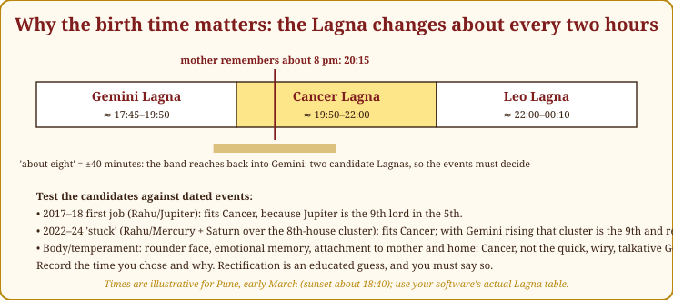
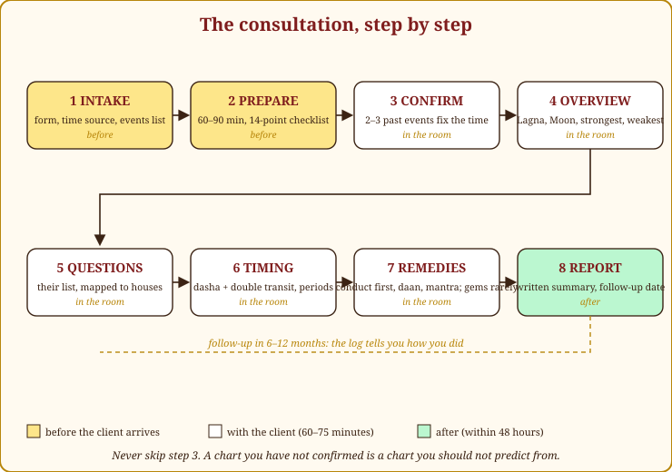
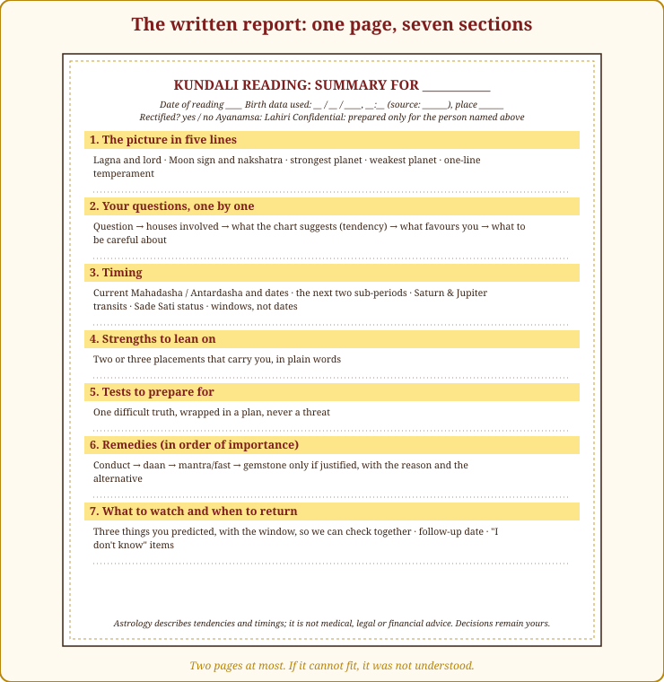
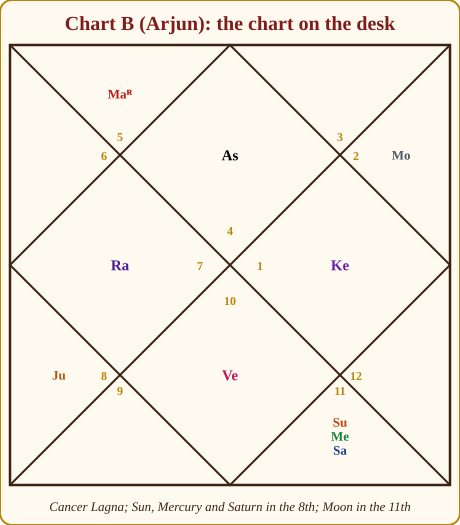

# Chapter 24: The Consultation, From Birth Details to a Client Who Comes Back

Everything before this page was about reading the sky. This chapter is about the other half of the job, the half that no classical text teaches and that decides whether you will still be practising in ten years: the hour a frightened, hopeful, sceptical human being spends in the chair across from you.

I remember my first paid sitting. I knew the chart cold and still made a mess of the hour: I answered the question before I had checked the birth time, said one true thing too bluntly, and watched a woman I read for leave paler than she had arrived. I also remember the first sitting that went right, a year later, and what had changed was not the astrology. It was the preparation, the order, the language, and the ethics. Those four things can be learned, and this chapter is everything I wish someone had handed me before that first hour.

> **🧭 Anushka's rule of thumb:** A consultation is judged by what the client can *do* on Monday morning. If they leave with a plan, you did your job. If they leave with a fear, you did the client harm and yourself no favour.

## The mindset: a counsellor with a map

Get one idea straight before anything else. You are not an oracle. You are a counsellor who happens to have a very good map.

A map shows the terrain: here the road climbs, here it is flat, here there is a river and a bridge at mile thirty-two. It does not tell the traveller whether to walk. Chapter 1 called the chart a map of tendencies and timings, and every chapter since has shown you how to read the terrain. Now you will hand that reading to someone who has to walk the road, and the way you hand it over matters as much as its accuracy.

Two consequences follow. First, **the client's dignity comes before your cleverness.** You will be tempted to show how much you see, the difficult marriage, the father's illness, the money that went missing in 2019. Resist. Say only what helps, in the order that helps. Second, **the client keeps the decisions.** You may say the wind favours a move abroad in 2027. You may never say "go". The moment you decide for people, you have taken a responsibility no chart entitles you to and no fee can pay for.

Think of the family doctor of the old kind, the one who knew your grandmother's knees. He had test results in his hand and he told you the truth, but he told it in a way that made you want to get better. That is the posture.

## Before the session

The consultation begins two days before the client arrives, when their birth details land in your inbox. Most beginners skip this stage and try to read cold, in the room, with the client watching. Do not. A surgeon does not open the patient and then look for the textbook.

### The intake form

Ask for these in writing, before you accept the appointment. A one-page form, on paper or online, is fine.

| Field | Why you need it |
|---|---|
| Full name (and the name they use) | Records, and so you address them correctly |
| Date of birth | Obvious, but ask them to write the year in full; "89" has cost me an hour |
| Time of birth, **and its source** | Hospital record, birth certificate, a parent's memory, "around dawn", each deserves a different level of trust |
| Place of birth (town, not just state) | Latitude and longitude fix the Lagna |
| Their question or questions, in their own words | So you prepare the right houses, and so you can quote them back |
| Have they consulted an astrologer before? What were they told? | Half your session may be undoing fear someone else planted |
| **The events list:** marriage date; children's birth years; father's and mother's major events (illness, retirement, passing, if they are willing); job changes with years; surgeries or serious illness; moves to another city or country | This is your rectification material and your confirmation material |
| Anything they do not want discussed | Consent, in advance |

Tell them on the form why you want the events: "so that I can check the birth time against your life before I say anything about your future." Clients respect this. It tells them you are serious.

> **🪔 Consultation tip:** If the time comes from family memory, ask one more question: "Was it before or after breakfast? Was it dark?" Indian families remember meals and daylight better than clocks. Those two answers often narrow a vague "morning" to a two-hour window, which is exactly one Lagna. It worked on my own grandmother's memory of my birth.

### Birth-time rectification, the basics

The Lagna changes roughly every two hours (Chapter 5, the eastern horizon sweeps through one sign in about that time, faster for some signs, slower for others). The Moon moves about one degree every two hours, which shifts the dasha balance by weeks, not years. So a birth time that is off by twenty minutes rarely breaks a chart; one that is off by two hours breaks everything.

Rectification is the craft of testing candidate times against a known life. Here is the routine I use; it took me an hour at first and takes about twenty minutes now.

1. **Draw the candidate Lagnas.** If the family says "about eight in the evening", cast the chart at 19:30, 20:15 and 21:00 and see which Lagnas appear. Often two candidates survive; sometimes three.
2. **Test each candidate against 3–4 dated events.** Take the marriage, the first job, a parent's major event, a surgery. For each candidate Lagna, ask: which dasha and antardasha was running (Chapter 13), and which houses were Saturn and Jupiter touching (Chapter 14)? The right Lagna makes the events fall on the right houses. The wrong one makes you argue with yourself.
3. **Use the Navamsa Lagna and the D10 as tie-breakers.** The D9 Lagna changes every 13–15 minutes and the D10 Lagna every 12 or so (Chapter 11). If two Rasi candidates both fit, ask which Navamsa Lagna fits the marriage and which Dasamsa Lagna fits the career.
4. **Apply the personality test, lightly.** Chapter 5 gave each Lagna a body type and temperament. A Cancer Lagna and a Leo Lagna sit differently in a chair, speak differently, and remember differently. This is the weakest evidence and I use it last, but it has tipped a coin for me many times.
5. **Choose, record, and say so.** Write down the time you settled on, the events that supported it, and the one that did not quite fit. Tell the client: "I have used 20:15; it fits your first job and your difficult 2022 best. If a prediction feels wrong later, this is the first thing we will revisit."

*Figure 24.1: Arjun's evening. "About eight o'clock, from his mother's memory": 20:15, sits early in the Cancer window, so a ±40-minute uncertainty reaches back into Gemini. The dated events decide between the two. Times shown are illustrative.*

> **🔍 Why?** The reason is astronomical. The Lagna is the degree rising in the east, and the whole zodiac rises once a day, so a new sign comes up roughly every two hours and the exact degree moves every four minutes. A birth time that is off by two hours moves every planet into a different house and changes every lord; nothing you say afterwards can be right. Checking the time against dated events is the only test that uses the client's own life as the measuring stick. Everyday parallel: a doctor confirms the patient's name and date of birth before reading out the report, however sure she is that she has the right file.

Be honest with yourself and the client: rectification is an approximation. Anyone who tells you they have fixed a birth time to the second from a few life events is performing, not practising.

> **⚠️ Common beginner mistake:** Rectifying the time *until the chart says what the client wants to hear.* If a candidate Lagna "explains" the marriage only after you have also changed the house system, the ayanamsa and your interpretation of the 7th lord, you have not rectified anything. You have decorated a guess.

### The 60–90 minute preparation routine

Once the time is settled, I sit with the chart alone for an hour, sometimes ninety minutes, with Appendix A open and a blank page. I fill the page in the same order every time, because order is what saved me the first time a client cried and I could not think. The list below is the same one you will find printed in Appendix C; photocopy it and tick it off for every chart until it is in your bones.

1. **Lagna:** sign, degree and lord; the lord's sign, house and dignity.
2. **Moon:** sign, nakshatra and pada, waxing or waning, and strength (own, exalted or debilitated; alone or supported).
3. **Sun:** sign, house and dignity; then check combustion for every planet within orb of it.
4. **Functional benefics and malefics for this Lagna** (Chapter 8, Appendix A.6); mark the yogakaraka and the marakas.
5. **Planets in kendras (1, 4, 7, 10), trikonas (5, 9) and dusthanas (6, 8, 12).**
6. **Exalted, debilitated, combust and retrograde planets;** any Neecha Bhanga.
7. **Yogas present,** and whether the planets forming them are strong enough to deliver.
8. **The seven key houses (1, 2, 4, 5, 7, 10, 11),** read by the five-step method (the house, its lord, the karaka, the same house from the Moon, the divisional chart).
9. **Navamsa (D9) and Dasamsa (D10) quick read:** varga Lagnas, Vargottama planets, and the D9/D10 dignity of the Lagna lord, the 7th lord and the 10th lord.
10. **Current Mahadasha and Antardasha with dates,** and the next two sub-periods.
11. **Saturn and Jupiter transit positions** counted from the Lagna and from the Moon; Sade Sati or Dhaiya status; where the double transit falls.
12. **The client's stated questions,** each mapped to its houses, lord, karaka and the periods that activate them.
13. **Remedies shortlist:** conduct first, then daan and mantra; a gemstone only if a functional benefic needs strength.
14. **Three past events or traits you will ask the client to confirm** before you predict anything.

Fourteen items looks like a lot. After twenty charts it takes forty minutes; after a hundred, you will find that items 1 to 7 assemble themselves while you make tea, and the real work is in 8, 11 and 12.

> **🪔 Consultation tip:** Item 14 is the one beginners skip and the one I would keep if I had to throw away the other thirteen. Choose three things the chart says about the *past*, a job change in a particular year, a difficult period with the mother, a move, and hold them ready. If two of the three land, your time is good and your client is listening. If none land, stop and revisit the time before you predict a single thing.

## The order of a session

Sessions have a shape, and the shape is not negotiable. Clients arrive wanting their question answered in the first minute; if you oblige, you skip the confirmation, and you skip the general picture that makes the specific answer make sense. Here is the order I settled on after my first fifty sittings, with rough timings for a seventy-five-minute sitting.

*Figure 24.2: The eight steps. Two happen before the client arrives, five in the room, one after. The dashed line is the follow-up: the log you keep tells you, a year later, how well you read.*

> **📖 Story: A petitioner comes to court.** A farmer arrives at the haveli with a question about his land. The Queen Mother (Moon) receives him first and asks about his journey, was the road as he remembers it? That is the confirmation. Then the King (Sun) speaks for a minute, not more: "You are an honest man with a stubborn streak; your land is good, your well is shallow." That is the overview. The young Prince (Mercury) takes the petitions one at a time, in the order the farmer wrote them. The old Judge of Labour (Saturn) opens the railway timetable and says which season the water will come. The Royal Priest (Jupiter) gives him a blessing and a task for Thursdays. And the Secretary writes it all down and hands the farmer the page before he leaves. Nobody at that court answers the question before the journey has been checked.
>
> **Rule:** Open, confirm, overview, questions, timing, remedies, written record, in that order, every time.

> **🔍 Why?** The reason for the order is logical. Every specific answer depends on a frame: the Lagna and its lord tell you *whose* career or marriage you are timing, and the dasha tells you *which years* count, so the frame has to be laid before any detail can mean anything. Past before future, because the past is the only thing you can check. Everyday parallel: a school report card begins with the child's name, class and attendance before it lists the marks; a mark without the class it was scored in tells a parent nothing.

**1. Opening (5 minutes).** Set expectations and confidentiality in plain words. "Everything you tell me stays here. I will tell you what your chart suggests, as tendencies and time windows, not as certainties. You will make your own decisions; my job is to make sure you make them with your eyes open. Please stop me if anything is unclear or if I say something that is not true of your life, that helps me, it does not offend me." Then repeat their questions back to them from the intake form, and ask if anything has changed.

**2. Confirm the time (5–10 minutes).** Offer your three past observations from item 14. Do this as questions, not as boasts. "Your chart suggests a change of work or study around 2017 or 2018, does that ring true?" If it does, note it. If it does not, ask what did happen that year, and listen. Two out of three is enough to proceed. Fewer, and you say: "I want to check something about the time before I go further," and you do it, in front of them, without embarrassment. Clients respect a craftsman who checks his measurements.

**3. The general picture (5 minutes).** Four sentences: the Lagna and what it says about temperament; the Moon and what it says about the mind; the strongest planet and what it carries; the weakest planet and what it asks for. This is where the client starts to trust you, because you are describing them, not predicting them. Do not go past five minutes, the temptation to show off here is enormous.

**4. Their questions (25–30 minutes).** Take them in the order the client gave, not the order you find interesting. For each: name the houses involved, say what the chart suggests as a tendency, say what supports it and what tests it, and give a window. Then stop and ask, "Does that make sense? Is that your experience so far?" Move on only when they nod.

**5. Timing (10 minutes).** Pull the threads together: the current Mahadasha and Antardasha and what they favour, the next two sub-periods, and where Saturn and Jupiter are and will be. Give windows, never dates, unless the client explicitly asks and you hedge.

**6. Remedies (5–10 minutes).** Conduct first, then daan and mantra, then, rarely, a gemstone, and only with the reasoning aloud (Chapter 23). Say what each remedy is *for*, and say plainly that a remedy supports effort; it does not replace it.

**7. Close and written summary (5 minutes).** Repeat the three most important things you said. Tell them when a follow-up would be useful and why. Promise the written summary within 48 hours and deliver it. The summary is what they will actually remember; the session is what they will feel.

> **🧭 Anushka's rule of thumb:** General before specific, past before future, strengths before tests, plan before goodbye. If you remember nothing else about the order, remember these four pairs.

## Language: the ten rules of astrological speech

A reading is words. The same true observation can be delivered as a blessing or a curse, and the client will live for years with whichever version you chose. These ten rules are how I learned to guard my mouth.

1. **Tendency, not certainty.** The chart shows a slope, not a fall. "Your chart leans towards…" is always true; "you will…" is never fully true.

> **🔍 Why?** Two reasons, one classical and one practical. The classical one: the tradition itself divides karma into *prarabdha*, the portion ripe for this life, which the chart shows, and *kriyamana*, what the person does now, which the chart cannot show; a prediction stated as certainty denies the second half of the system's own teaching. The practical one is ethical: a hedged tendency cannot harm. If it comes true, the client was prepared; if it does not, no life was rearranged around it. Everyday parallel: the weather forecast says "70 per cent chance of rain", and you carry an umbrella; nobody cancels the wedding.

2. **Period, not date**, unless asked, and then hedged. "The second half of 2027 is the strongest window I see" is honest. "Your marriage is on 14 November" is a lottery ticket with your name on it.
3. **Never death.** Not the client's, not a parent's, not a spouse's. Not with a date, not with a year, not with a wink. Chapter 20 taught you longevity; this chapter tells you to keep it to yourself and speak of health and care instead.
4. **Never "you will divorce". Never "your child will fail".** Say what the tendency asks for, patience, communication, a different kind of schooling, not the worst outcome.
5. **Malefics are tests; benefics are support.** Saturn in the 7th is not "trouble in marriage"; it is "marriage will ask you for patience and will reward it slowly". Same chart, different life.
6. **Use the verbs of the trade:** *your chart suggests, favours, leans towards, asks you to be careful about, supports.* Retire *will, must, cannot, never.*
7. **Give agency.** Every difficult observation ends with what the client can do. "This period is heavy for finances; it is also the best period in years for learning a new skill, that is where to put the energy."
8. **One difficult truth per session, wrapped in a plan.** People can carry one hard thing home. Two, and they drop both. If the chart has five hard things, choose the one that matters for the next two years and hold the rest for the follow-up.

> **🔍 Why?** This one is psychological, and the tradition agrees with it in spirit: Varahamihira asks the astrologer to be of steady mind and to speak so that the listener is not thrown. People can carry one hard thing home and act on it; a second cancels the first, and a third turns both into fear. Everyday parallel: a good teacher returns an essay with one thing to fix, not fifteen, because the student with fifteen corrections fixes none.

9. **Never blame a spouse, a mother-in-law, a business partner from the chart.** You are reading one person's map; the others are not in the room to answer.
10. **Do not diagnose, and do not promise.** "Your chart asks you to take care of digestion" is astrology. "You have an ulcer" is malpractice. "This coral will fix your career" is a lie; "this coral may support your Mars while you do the work" is the truth.

> **📖 Story: The two heralds.** The old Judge (Saturn) issues one decree for a village: "The granary must be filled before the rains, or there will be hunger." Two heralds ride out with it. The first stands in the square and shouts, "Hunger is coming! You will starve!" The village panics, hoards, and quarrels; half the fields go unsown. The second herald reads the same decree and says, "The Judge asks you to fill the granary before the rains. Those who fill it will eat well through the winter." The village plants. Same Saturn, same decree, two futures, and only the herald differed.
>
> **Rule:** A malefic is a test. Say what the test asks for, never what failure would look like.

### Twelve phrases to retire

Here are sentences I have heard beginners say, and said myself in my first year, with what I say now instead.

| 🔴 Don't say | 🟢 Say instead |
|---|---|
| "You will never have money." | "Money in your chart comes slowly and through discipline; the 2nd house asks you to save before you spend. Your 11th house improves steadily after 35." |
| "Your marriage will break." | "Your 7th house asks for patience and honest conversation, especially in Saturn's sub-periods. Couples with this placement do well when they learn to argue kindly." |
| "Your father will die in this period." | "This is a period to give your father extra care and attention, and to make sure his check-ups are regular." |
| "Your child is weak in studies." | "Your child's chart favours learning by doing rather than by rote. The 4th house suggests a practical or creative stream will suit better." |
| "Saturn is bad for you." | "Saturn is your teacher in this chart. He is slow, but everything he gives, he lets you keep." |
| "You have Kaal Sarp dosha, you must do a puja." | "Rahu and Ketu hold your planets in a tight band, which often gives a life of strong direction and some sense of being fated. It is not a curse, and no puja is compulsory." |
| "You will get the job in March." | "March to May is the strongest window I see for career movement. Apply hard then; if it comes in June, you were still on time." |
| "Your mother-in-law is the problem." | "Your 4th house is under some pressure right now. Home will feel crowded; it usually eases when Jupiter moves next year." |
| "Wear a blue sapphire, everything will be fine." | "I would not recommend a blue sapphire here: Saturn is not a friend to your Lagna. Let us look at conduct and daan first." |
| "You have a very bad chart." | "Your chart has three real strengths and two real tests. Let us name all five." |
| "Don't start anything this year." | "This year favours preparation over launch. Use it to build; launch in the window after." |
| "Astrology says you should leave him." | "That decision is yours alone. What I can tell you is what the chart suggests about timing and about your own needs, and you can weigh that with everything else you know." |

> **⚠️ Common beginner mistake:** Softening the language so much that you say nothing. "Things may or may not improve at some point" is not hedging; it is cowardice. Give a real tendency and a real window, then hedge that. The client should leave knowing what you actually think.

## Handling difficult moments

Every session has one. Here is what I have learned to do.

**A client begins to cry.** Stop talking. Offer water and a tissue; do not fill the silence. When they are ready, say, "Take your time. We have the hour." Do not use the tears as a cue to soften a prediction you have already made, and do not use them to add a remedy. When they resume, ask what touched them, it is often something you did not expect, and it tells you which house matters most today.

**A client wants to know when they, or someone, will die.** Refuse, warmly and completely. "I do not read longevity for clients, and I would not trust any astrologer who does. What I can do is tell you which periods ask for extra care of health, and that is more useful." If they push, and a bereaved or anxious client will push, hold the line and change the subject to care.

**A parent asks about an unborn child's gender.** Refuse, flatly, every time, and say why: it is illegal in India under the pre-natal diagnostic laws, and the tradition itself never sanctioned it. "I will happily read the pregnancy for health and timing. I will not touch gender." No exceptions, no hints, no "the chart leans towards".

**A couple asks whether to end a pregnancy, or to separate.** Refuse to decide for them, and say so with respect. "This is a decision for the two of you, perhaps with a doctor or counsellor. I can tell you what each chart suggests about the coming years, and you may use that as one input among many." Then give them the tendencies honestly and get out of the way.

**"Another astrologer said…"** Never contradict a colleague to score a point, and never agree to be polite. Say, "I can only tell you what I see. Here is my reading of that placement, and here is why." If the other reading planted fear, a curse, a "dosha", a costly puja, gently take the fear apart with the chart itself, in front of them.

**A client who wants a stone.** Ask what they want it for. Then check the rule (Chapter 23): a stone strengthens; it is only for a functional benefic that needs strength. If the chart justifies it, say so and name the alternative remedies too. If it does not, refuse and explain, and do not, ever, sell the stone yourself.

> **🔍 Why?** The reason for refusing to sell stones, or to take a cut, is ethical and very plain: the moment your income rises when the client is frightened, your reading will drift towards frightening them, without your noticing. The incentive corrupts the judgement before it corrupts the person. Everyday parallel: you would not trust a mechanic who is paid a commission by the spare-parts shop to tell you honestly whether the part needs changing.

**A sceptic.** Welcome them. Skip nothing, especially the confirmation step. Say, "Tell me when I am wrong." A sceptic who hears two accurate observations about their past becomes your most careful listener; a sceptic who is flattered stays a sceptic.

**A client in crisis.** Occasionally someone in the chair is not there for astrology. They have not slept in a week, they speak of not wanting to go on, they are shaking. Your reading stops. You say, "I am going to put the chart aside for a moment, because you matter more than it does." You stay with them, you make sure they are not alone tonight, and you give them the number of a mental-health helpline or a doctor. In India, national and state helplines exist and every practitioner should keep two numbers written on the inside cover of their notebook. Astrology waits. If they insist on the reading, keep it short, keep it kind, and say plainly that a counsellor will help more than any transit.

> **🪔 Consultation tip:** Keep a small card in your drawer with three names on it: a general physician, a counsellor or psychiatrist, and a lawyer who does family and property work. When a client's problem belongs to one of them, hand over the card. Referring out is not a failure of astrology; it is the mark of someone who knows what astrology is for.

## The ethics code

> **📖 Story: The Stranger's shop.** The Smoke-headed Stranger (Rahu) opens a gem shop outside the court gate. He makes a quiet arrangement with a junior secretary: for every frightened petitioner sent across the road with the words "only a blue stone can save you," a silver coin. Within a season the secretary has stopped reading the maps at all; he reads faces, finds the fear, and names the stone. The Royal Priest (Jupiter) notices that the petitioners come back poorer and no happier, and has the secretary's desk moved into the courtyard, where everyone can hear what he says. The shop closes within a month. The Priest's only comment: "A counsellor who profits from a fear will always find one."
>
> **Rule:** No fear-selling, no gem commissions, and say your readings where they could be overheard.

Every profession that touches people's fears eventually writes itself a code. Ours has not been written down in any classic, so here is the one I wrote for myself in my first year and still keep on the wall. Adopt it, adapt it, print it and hang it where clients can read it. It is reproduced word for word in Appendix C.

1. **Confidentiality.** What is said in the room, and the chart itself, stays in the room: no sharing, no teaching examples with identifying details, no screenshots.
2. **Consent for third parties.** Read another adult's chart only with that person's consent; for a minor, only when a parent or guardian asks in the child's interest.
3. **No fear-selling.** Never frighten a client into a remedy, a return visit or a purchase. A prediction that leaves a person more afraid and less capable was badly delivered.
4. **Fees disclosed upfront,** in writing where possible, before the session begins; no surprise charges for "special" remedies.
5. **No gem commissions.** Recommend a stone only when the chart justifies it; never sell it yourself or take a cut from a seller.
6. **Stay inside your competence.** No medical diagnosis, no legal opinion, no investment advice. Astrology describes tendencies and timing; qualified professionals decide the rest.
7. **Refuse sex-determination** of an unborn child in every form, and refuse any remedy intended to harm another person.
8. **Keep records:** birth data as given, the time you used and why, what you said, what you predicted and by when.
9. **Admit errors.** When a prediction fails, say so, log it and learn from it; never rewrite history to protect your reputation.
10. **Keep learning.** Read the classics, sit with a teacher, meet peers. An astrologer who stopped learning ten years ago is practising ten-year-old mistakes.
11. **Do not read for a person who is intoxicated,** or for a minor without a guardian present; postpone a reading for someone in acute crisis until they are safe.
12. **Refer out.** When the matter belongs to a doctor, a lawyer, a counsellor or a financial planner, say so plainly and help the client get there.

> **💡 Did you know?** Varahamihira, in the sixth century, listed the qualities of a good astrologer in *Brihat Samhita*: clean in habit, well versed in the texts, of steady mind, and, this is the part I love, "not given to boasting". The ethics of our trade are older than most of its techniques.

## Fees and practice

Nobody teaches this either, and I got it wrong before I got it right, so let us be practical.

### Setting a fee

Charge for time, not for miracles. A **time-based** fee, so much for a seventy-five-minute session, so much for a written report, is honest and easy to explain. Many practitioners use **tiers**: a shorter single-question session, a full reading, a couple's matching, an annual review. Keep a **sliding scale for hardship**, quietly; the student, the widow, the man who has just lost his job pay what they can or nothing, and you do not announce it. Publish your fees, and never, this is the ethics code again, let a fee depend on a remedy.

A fee is also a boundary. Clients who pay arrive on time, bring their birth details, and listen. The free reading for the neighbour's cousin is where most of my early mistakes happened, because neither of us took it seriously.

### Free readings as practice

In your first months, read for free, but say so, and ask for something in return: written birth details, a completed events list, and honest feedback afterwards. "I am learning. This reading is free. In exchange, I would like you to tell me, in six months, what came true and what did not." That sentence taught me more in six months than the shelf of classics I had failed with.

### Recording and the written report

Ask permission to record audio; many clients like to have it, and it protects both of you. Whether or not you record, send a **written summary within 48 hours**. Mine follows a fixed template (one page, two at most), and the discipline of writing it has caught more of my own errors than any client ever has.

*Figure 24.3: The report template. Section 7, "what to watch and when to return", is the one that turns a reading into a relationship. It is also your prediction log in the client's hands.*

> **🔍 Why?** The written report exists because memory rewrites predictions. Six months later the client remembers "she said I would get the job in March" when you said "March to May favours applications", and you remember being more right than you were. A page written within 48 hours is the only record neither of you can edit. Everyday parallel: the prescription is written down because nobody, patient or doctor, remembers the dose correctly a week later.

### Follow-ups and the prediction log

Offer a follow-up at six to twelve months, timed to the next dasha change or a major transit. Before the follow-up, open your notebook, the one Chapter 1 asked you to keep, and read what you predicted. Then ask the client what happened. Write both down, side by side. After a hundred such pairs you will know, with humbling precision, which of your techniques work and which are habits you copied from a book. I found two of my own habits that way, and dropped them. This is called calibration, and it is the only road from a good student to a trustworthy astrologer.

### Social media

Do: teach, explain a placement, share a composite story with all details changed, show your working. Don't: post a client's chart, predict for public figures (you do not have their consent or their correct time), forecast disasters, or sell stones from your feed. If you make monthly or yearly forecasts, say plainly that a sign-based forecast is weather for a whole country and not a reading for one person.

### When to say "I don't know"

Often, and out loud. "I don't know" followed by "here is what I would need to find out" is the most trust-building sentence in the consulting room. The client who hears you say it once believes everything else you say twice as much.

### Continuing education

Read the classics, slowly, a verse a day of *Brihat Jataka* or *Phaladeepika* with a good commentary is enough (Appendix C has the list). Find a teacher whose charts you can watch being read; there is no substitute for sitting beside someone while they think aloud. I found mine late, and wish I had looked sooner. Join or form a peer group of three or four students who meet monthly and read one chart each, blind, then compare. Your errors will be different from theirs, and that is the point.

### The law, hedged and general

In India, practising astrology is legal; the Supreme Court has treated it as a matter of belief and it is taught in some universities. What is not legal is fraud, and what is regulated is medicine: claiming to cure disease, selling "medicines", or making medical diagnoses can bring you under the drugs-and-remedies advertising laws and consumer-protection law. Sex-determination is a criminal offence. Consumer-protection rules also mean that a fee paid for a promised result, "your visa will come in three months, guaranteed", can be disputed. So: disclose fees, promise nothing, keep records, stay out of medicine and law, and you will never have a problem. I am not a lawyer, and this paragraph is not legal advice; a one-hour conversation with one before you open a practice is money well spent.

## If you never take a consultation

Most readers of this book will never charge a rupee for a reading, and that is exactly who I wrote it for. Everything in this chapter still applies; only the chair is different.

Start with your own chart and run the fourteen-point list on it as if you were a stranger. Do the confirmation step honestly: pick three past events, find their dasha and transits, and see whether your birth time holds. Then read the general picture aloud, the three pillars and the strongest and weakest planet, and notice how much of it you already knew about yourself and how much you had never put into words. That noticing is the whole reward.

Then read for the people you love, with the same rules you would use for a paying client, and one more. The rules: ask before you read an adult's chart; speak in tendencies and windows; one hard thing at a time; never death, never blame. The extra rule: you are not their astrologer, you are their daughter, brother, wife or friend, and that relationship comes first. If the chart shows your mother a heavy Saturn period, the reading is "I want to sit with you more this year", not a forecast. If it shows your husband's Rahu sub-period, the reading is patience, not an accusation dressed as a transit.

Used this way, the method does something no consultation can: it lets you understand your own nature without paying anyone to tell you, and it lets you see what is happening with the people around you while it is happening, so that you can be kinder in time rather than wise afterwards. Keep the notebook for these readings too. Some of my best lessons came from being wrong about my own family.

## The first 100 charts: a six-month plan

Reading a chart in a book and reading one across a table are different skills. This is the plan I followed, tidied up with hindsight, to build the second one without hurting anyone.

**Weeks 1–4: friends and family, free, with consent.** Ten to fifteen charts. Use the full fourteen-point preparation on every one, even when you know the person. Practise the opening script aloud. Ask for the events list and do the confirmation step even though you know the answers, you are training the habit, not testing the astrology. Log every prediction with a window.

**Weeks 5–12: low-fee readings with feedback forms.** Twenty to thirty charts, for a nominal fee that makes both sides take it seriously. Send the written report every time. Include a one-page feedback form: what was accurate about the past, what was useful, what was unclear, what you said that frightened them. Read the forms. The third one will sting; that is the one to keep.

**Months 4–6: specialise.** Choose one area, career, marriage and matching, children and education, health windows, or annual reviews, and take forty to fifty charts in that area. Depth in one field teaches you more about the whole system than breadth ever will, because you see the same houses behave under a hundred different Lagnas. Keep the notebook. At chart 100, read the notebook from the beginning. You will meet a stranger on page one; I did.

> **🧭 Anushka's rule of thumb:** A hundred charts with a log beats a thousand without one. The log is the teacher; the charts are only the lessons.

## A sample session: Arjun

Here is a condensed transcript of a seventy-five-minute session, reconstructed and simplified for teaching. The client is Arjun, Chart B, Cancer Lagna, born 3 March 1995 at about 20:15 in Pune, just after sunset. He is about to turn thirty-one. His intake form asked two things: "Should I move into a research career abroad or stay in my current job?" and "When will I marry?" Under "previous consultations" he wrote: "One, in 2021. Was told I have Kaal Sarp dosha and should do a puja costing 21,000 rupees. Did not do it. Have been worried since." The session takes place in February 2026: Rahu Mahadasha, Venus Antardasha; Saturn in Pisces; Jupiter in Gemini, about to enter Cancer in the middle of the year.

*Figure 24.4: The chart on the desk. Three planets in the 8th (Aquarius), the Moon exalted in the 11th (Taurus), Jupiter in the 5th (Scorpio), Venus in the 7th (Capricorn), Mars retrograde in the 2nd (Leo), Rahu in the 4th, Ketu in the 10th.*

---

**Anushka:** Arjun, welcome. Before we start: everything we discuss stays in this room. I will describe what your chart suggests, as tendencies and time windows, and I will tell you where I am unsure. You will make the decisions; I am here so that you make them with your eyes open. If I say something that is not true of your life, please tell me at once. It helps me. Your two questions are the research move and marriage, is that still right?

**Arjun:** Yes. And the dosha thing, Didi. I want to know if it is real.

**Anushka:** We will get to it, and I will show you on the chart. First I want to check the birth time against your life, because everything I say depends on it. Your form says about eight in the evening: 20:15, from your mother's memory. Twenty-five minutes earlier and you would be a Gemini rising, a different person, so I have three things to test. One: your chart suggests a change of direction, finishing studies and starting work, around 2017 or 2018. Does that fit?

**Arjun:** Exactly. I finished my master's in 2017 and joined the company in early 2018.

**Anushka:** Good. Two: it suggests that late 2021 through 2024 felt stuck, not disaster, but doors that did not open, a sense of being in a waiting room.

**Arjun:** *(laughs)* That is the reason I am here. Since about the start of 2022.

**Anushka:** Three, and this is a softer one: your Lagna is Cancer. People with this rising sign tend to have a rounder face, a strong emotional memory, they remember how a room felt, not what was said, and a deep tie to their mother and to home. Is that you?

**Arjun:** My friends say I remember every slight from school. And yes, my mother.

**Anushka:** Then 20:15 is good enough for us to proceed, a Gemini Lagna would not have made 2022 feel like a waiting room; the three planets in your 8th house would have been in the 9th, and Saturn's transit over them would have read as travel and study. If anything I say later feels off, the time is the first thing we revisit. Now, the general picture, in four sentences. You are a Cancer rising, protective, cautious on the outside, very feeling on the inside. Your Moon, which is the mind, is in Taurus in the 11th house, where it is exalted: a stable, stubborn, loyal mind, good with people and networks. Your strongest planet is that Moon, and after it Mars, who for a Cancer Lagna is the planet that gives success, he sits in your 2nd house, in Leo, retrograde: your drive turns inward, you rework things, you are better at deep effort than at showing off. Your weakest area is the cluster in the 8th house, Sun, Mercury and Saturn together in Aquarius, with Saturn very close to the Sun and therefore weakened. The 8th is the house of research, insurance, hidden things, sudden change, and also of feeling that life happens to you rather than through you. Does that description sit right?

**Arjun:** The inward part, yes. I work in a data team at an insurance firm. Nobody knows what I do, including my manager.

**Anushka:** Insurance and data, that is the 8th house speaking, and Mercury in it is your analytical mind working in hidden places. Let us take your first question. Research career abroad, or stay. Three houses matter: the 9th for higher learning and long journeys, the 12th for living in foreign lands, and the 10th for career itself. Your 9th house is Pisces, and its lord Jupiter sits in your 5th house, in Scorpio, a fortunate place for him, in a friend's sign. That says higher study suits you and would go well. Your 10th house holds Ketu, the planet of detachment, which is why titles and visibility do not satisfy you; you want the work itself to mean something. And your 12th lord, Mercury, sits in the 8th with the Sun: foreign lands connect to research and to hidden, technical work. So the tendency is clear: your chart favours research, and it favours doing it somewhere else. That is not the same as saying "go". It says the door is a real door.

**Arjun:** When?

**Anushka:** Timing. You have been in Rahu's major period since late 2013, Rahu is the planet of foreigners and of technology, and he runs until the end of 2031. The sub-period that made 2022 to 2024 heavy was Mercury's, and Saturn was also transiting your 8th house then, sitting on top of that cluster. Both have passed. Since mid-2025 you are in Rahu–Venus, which runs to mid-2028; Venus sits in your 7th house, so this is a period of partnerships, relationships, and gains through others. Now the transits. Saturn entered Pisces, your 9th house, in 2025 and stays until about 2027; Jupiter enters Cancer, your own Lagna, in the middle of this year and from there he aspects the 9th house where Saturn is standing. When Saturn and Jupiter both touch a house, that house tends to deliver, that is the double-transit rule. So the window for applications, admissions and a decision about abroad is roughly mid-2026 to mid-2027. The move itself, if it comes, leans towards 2027–28, when Saturn moves to Aries and aspects your 12th house. I would not promise the move; I would say this is the best two-year window your chart has shown in a decade, and you should use it.

**Arjun:** And if I stay?

**Anushka:** Then use the same window to change *how* you work, a research role inside the firm, a part-time degree. The chart favours the direction more than the geography. Now, marriage. Your 7th house is Capricorn, and its lord Saturn is in the 8th, weakened by the Sun. That is why marriage has not been quick: Saturn delays, and he is not at his best here. But Venus, the planet of marriage, sits in your 7th house itself, in a friendly sign, and you are in Venus's sub-period right now. Jupiter, entering Cancer this year, will aspect your 7th house and Saturn. So the tendency is that late 2026 through 2028 is your marriage window, with the second half of 2026 to 2027 the first serious opening. I am giving you a window, not a date. If someone asks you a question at a wedding in December, listen.

**Arjun:** My mother will be pleased. Now, Anushka, the dosha.

**Anushka:** Look at the chart. Rahu is in your 4th house, Ketu in your 10th. For the so-called Kaal Sarp pattern, all the other planets would have to sit on one side of that axis. Yours do not, your Moon in the 11th and your Mars in the 2nd sit on the other side. So the pattern is not even formed. And even where it is formed, it is not in the classical texts; it is a popular teaching, and it describes a strongly directed life, not a curse. Nobody needs to pay twenty-one thousand rupees to be released from something they do not have. I would like you to leave that fear on this table.

**Arjun:** *(quiet)* Thank you.

**Anushka:** There is one real thing to say about Mars, since we are being honest. Mars sits in your 2nd house, and from the Moon and from Venus he is also in sensitive places, what the tradition calls Kuja or Mangal dosha. Here is the whole truth: technically it is present; practically, Mars is the best planet for your Lagna, in a friend's sign, and the tradition lists many cancellations. What it asks of you is a partner with comparable energy and a marriage where you learn to disagree without wounding. When a match is proposed, have the two charts read together, not for a verdict, but for understanding. Do not let anyone use the word dosha to frighten you or your family.

Remedies, in order. First, conduct: you have three planets in the 8th; the 8th rewards depth and honesty and punishes shortcuts, so no quick fixes, in work or in love. Second, for Rahu's period, a Saturday practice, a coconut or a blanket to someone who needs it, once a month, and a real discipline about screens after ten at night; Rahu lives in our phones now. Third, Jupiter is your 9th lord and he will carry the abroad question, respect your teachers, and on Thursdays give something yellow, chana dal or turmeric, to a temple or a person. Fourth, and only if you want it: red coral for Mars, your success-giving planet. It is justified in your chart, and it is the only stone I would consider. Not a blue sapphire, Saturn is not a friend to your Lagna, whatever anyone online says. And I am not selling the coral; buy it from whoever you trust.

To close. Three things: your chart favours research and favours abroad, with mid-2026 to mid-2027 as the decision window. Marriage leans towards late 2026 to 2028, with Venus's sub-period running now. And you have no Kaal Sarp dosha. I will send the written summary in two days. Come back in about a year, around the time Jupiter moves into Leo, and we will see what came true; I will have it written down, and so will you.

---

Notice what I did *not* do: predict a date, diagnose the 8th-house cluster as illness, tell him to resign, or mention that Saturn in the 8th is classically linked to longevity. Notice what I did: confirmed the time, described before predicting, answered in the client's order, gave windows, dismantled a fear with the chart, told one hard truth (Mars) wrapped in a plan, and closed with three sentences and a follow-up.

## The Consultation Checklist (print this page)

The fourteen preparation points and the twelve-point code, one page, identical to the version in Appendix C. Tick the preparation list for every chart; hang the code where the client can see it.

### Preparation, before the client arrives

1. **Lagna:** sign, degree and lord; the lord's sign, house and dignity.
2. **Moon:** sign, nakshatra and pada, waxing or waning, and strength (own, exalted or debilitated; alone or supported).
3. **Sun:** sign, house and dignity; then check combustion for every planet within orb of it.
4. **Functional benefics and malefics for this Lagna** (Chapter 8, Appendix A.6); mark the yogakaraka and the marakas.
5. **Planets in kendras (1, 4, 7, 10), trikonas (5, 9) and dusthanas (6, 8, 12).**
6. **Exalted, debilitated, combust and retrograde planets;** any Neecha Bhanga.
7. **Yogas present,** and whether the planets forming them are strong enough to deliver.
8. **The seven key houses (1, 2, 4, 5, 7, 10, 11),** read by the five-step method (the house, its lord, the karaka, the same house from the Moon, the divisional chart).
9. **Navamsa (D9) and Dasamsa (D10) quick read:** varga Lagnas, Vargottama planets, and the D9/D10 dignity of the Lagna lord, the 7th lord and the 10th lord.
10. **Current Mahadasha and Antardasha with dates,** and the next two sub-periods.
11. **Saturn and Jupiter transit positions** counted from the Lagna and from the Moon; Sade Sati or Dhaiya status; where the double transit falls.
12. **The client's stated questions,** each mapped to its houses, lord, karaka and the periods that activate them.
13. **Remedies shortlist:** conduct first, then daan and mantra; a gemstone only if a functional benefic needs strength.
14. **Three past events or traits you will ask the client to confirm** before you predict anything.

### The code, on the wall

1. **Confidentiality.** What is said in the room, and the chart itself, stays in the room: no sharing, no teaching examples with identifying details, no screenshots.
2. **Consent for third parties.** Read another adult's chart only with that person's consent; for a minor, only when a parent or guardian asks in the child's interest.
3. **No fear-selling.** Never frighten a client into a remedy, a return visit or a purchase. A prediction that leaves a person more afraid and less capable was badly delivered.
4. **Fees disclosed upfront,** in writing where possible, before the session begins; no surprise charges for "special" remedies.
5. **No gem commissions.** Recommend a stone only when the chart justifies it; never sell it yourself or take a cut from a seller.
6. **Stay inside your competence.** No medical diagnosis, no legal opinion, no investment advice. Astrology describes tendencies and timing; qualified professionals decide the rest.
7. **Refuse sex-determination** of an unborn child in every form, and refuse any remedy intended to harm another person.
8. **Keep records:** birth data as given, the time you used and why, what you said, what you predicted and by when.
9. **Admit errors.** When a prediction fails, say so, log it and learn from it; never rewrite history to protect your reputation.
10. **Keep learning.** Read the classics, sit with a teacher, meet peers. An astrologer who stopped learning ten years ago is practising ten-year-old mistakes.
11. **Do not read for a person who is intoxicated,** or for a minor without a guardian present; postpone a reading for someone in acute crisis until they are safe.
12. **Refer out.** When the matter belongs to a doctor, a lawyer, a counsellor or a financial planner, say so plainly and help the client get there.

## In one breath

- You are a counsellor with a map, not an oracle; the client's dignity and the client's decisions come first.
- The session begins with the intake form: exact time *and its source*, the questions in their words, and a dated events list for rectification and confirmation.
- Rectify by testing candidate Lagnas against three or four dated events, with the D9 and D10 Lagnas as tie-breakers; record the time you chose and say it is an approximation.
- Prepare for 60–90 minutes with the fourteen-point checklist, and always finish with three past events to confirm.
- The order never changes: open and set expectations, confirm the time, the general picture in five minutes, their questions, timing, remedies, a written summary within 48 hours.
- Speak in tendencies and windows; never death, never "you will divorce", never blame a third party, never diagnose, never promise a remedy will fix anything; one hard truth per session, wrapped in a plan.
- Adopt the twelve-point code: confidentiality, consent, no fear-selling, fees upfront, no gem commissions, stay in your competence, refuse sex-determination, keep records, admit errors, keep learning, protect the vulnerable, refer out.
- A hundred charts with a prediction log will make you an astrologer; a thousand without one will make you a performer.

## Practice

> **✍️ Practice:**
>
> 1. A client writes on the intake form: "Born 1990, morning, in Lucknow. Grandmother remembers it was just after the milkman came." Write the three follow-up questions you would ask before casting any chart.
> 2. Rewrite each of these in the language of the ten rules: (a) "Your Saturn dasha will destroy your business." (b) "You will have a son in 2027." (c) "Your husband's chart is the reason you are unhappy."
> 3. A client asks, "Just tell me, will my father survive this illness?" Write your reply in full, in no more than four sentences.
> 4. From the sample session, list the three confirmation points the astrologer used and say which house or dasha each came from.
> 5. Design your own one-page feedback form for the "weeks 5–12" stage of the first-100-charts plan. It should have no more than six questions.

Answers

1. Examples: "Roughly what time did the milkman come to your grandmother's house, before or after sunrise? Before or after the morning tea?" "Was it already light outside when the baby arrived?" "Is there any document, a hospital slip, a horoscope made at the time, a school certificate with a time, anywhere in the family?" (Any three questions that narrow the window to about two hours and search for a written source.)
2. (a) "Saturn's period will test your business, it favours consolidation over expansion, and it rewards the ones who keep their costs and their word. Plan for slower growth, not for failure." (b) "Your 5th house is well supported in 2027, which favours a child in that window; the chart does not reliably show a child's sex, and I do not read for it." (c) "Your own 7th house is under pressure just now, and it asks for patience and honest conversation. I can only read your map; the reasons for unhappiness in a marriage are never in one chart alone."
3. Something like: "I do not read for longevity, for anyone, and I would not trust an astrologer who did. What your chart does show is that this is a period to give your father your presence and to make sure his medical care is steady and regular. Let us look at what the coming months ask of *you*, so that you can be strong for him. And please lean on his doctors for the medical questions; that is their map, not mine."
4. (i) The 2017–18 change from study to work, Rahu–Jupiter antardasha (Jupiter 9th lord in the 5th). (ii) The stuck feeling from 2022 to 2024, Rahu–Mercury antardasha (Mercury 12th lord in the 8th) plus Saturn's transit through the 8th house (Aquarius). (iii) The Cancer Lagna personality test, rounder face, emotional memory, attachment to mother and home.
5. Your own design. Good forms include: what I said about your past that was accurate; what was not; the most useful thing you heard; anything unclear; anything that frightened you; would you recommend me and why or why not.

