# Chapter 25: Three Complete Readings: Meera, Arjun and Devika

We have walked through the alphabet, the grammar and the manners. Now we read three whole charts from the first line of birth data to the last line of advice, in exactly the order I use at my own desk. You have met all three people before: Meera in almost every chapter, Arjun in the consultation you just watched, Devika in the health and children chapters, so nothing here should surprise you. What is new is seeing the *whole* done in one sitting, with nothing skipped and nothing hidden.

I follow the same eleven steps for each. That is deliberate. The steps are the point; the three lives are only the material. By the third reading you should be able to predict what I am going to look at next, and by the end of the chapter you should be able to do it yourself on a fourth chart, alone.

Two housekeeping notes. First, every position, nakshatra, Navamsa placement and dasha date below was computed, not copied, and cross-checked against Appendix A; the arithmetic is shown where it teaches something. Second, transit positions for 2026–2029 are approximate, Saturn in Pisces from 2025 until about mid-2027 and then Aries (with a brief return to Pisces late in 2027); Jupiter in Gemini until mid-2026, Cancer to mid-2027, Leo to mid-2028, Virgo to mid-2029. Check an ephemeris before you quote them to a client.

> **🧭 Anushka's rule of thumb:** Read the chart the same way every time. Method is what protects you on the day your intuition is tired.

> **💡 Did you know?** The Sun's house is a clock you can read at a glance, and it is the fastest check on a birth time. The Sun in the 1st house means a birth around sunrise (Meera, 06:40); in the 10th, around noon; in the 7th, around sunset; in the 4th, around midnight (Devika, 23:55). Arjun's Sun in the 8th (one house past the 7th) says "shortly after sunset", which is exactly his 20:15. If a client's stated time puts the Sun in the 10th house at nine in the evening, something is wrong before you have read a single planet.

## Reading one: Meera (Chart A)

### 1. Birth data, the chart, and the planetary table

Born 12 December 1988, 06:40, Jaipur (constructed). Lagna Scorpio 12°, in Anuradha nakshatra, pada 3. The Sun rose about half an hour after her birth, so the Sun sits at the very end of the 1st house, a dawn birth, which fits a Sun-in-Lagna personality.

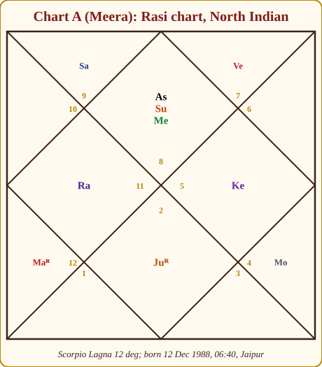
*Figure 25.1: Chart A, North Indian style. Sun and Mercury in the Lagna (Scorpio), Saturn in the 2nd, Rahu in the 4th, Mars retrograde in the 5th, Jupiter retrograde in the 7th, Moon in the 9th, Ketu in the 10th, Venus in the 12th.*

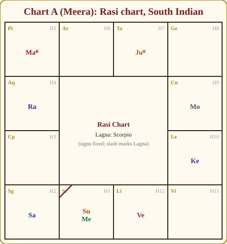
*Figure 25.2: The same chart in the South Indian grid. Find the Lagna mark in Scorpio and count clockwise.*

The table is the spine of the reading. Absolute longitude = (sign number − 1) × 30 + degree; nakshatra = that longitude divided by 13°20′, pada by 3°20′. Dignity follows Appendix A.2 (own, exaltation, debilitation) and A.3 (friend, neutral, enemy by the sign lord). Combustion uses the A.2 orbs measured from the Sun at 28° Scorpio (238°).

| Planet | Sign | Degree | House | Nakshatra, pada (lord) | Dignity (🟢 good 🟡 neutral 🔴 difficult) | Notes |
|---|---|---|---|---|---|---|
| Sun | Scorpio | 28° | 1 | Jyeshtha 4 (Mercury) | 🟢 Friend's sign (Mars) | 10th lord in the Lagna; last 2° of the sign, in the Jyeshtha gandanta zone |
| Moon | Cancer | 21° | 9 | Ashlesha 2 (Mercury) | 🟢 Own sign | Five days past full, still bright, counted benefic by most teachers |
| Mars | Pisces | 4° | 5 | Uttara Bhadrapada 1 (Saturn) | 🟢 Friend's sign (Jupiter) | Retrograde; Lagna lord in a trikona |
| Mercury | Scorpio | 9° | 1 | Anuradha 2 (Saturn) | 🟡 Neutral (Mars) | 19° from the Sun, **not combust** (orb 14°) |
| Jupiter | Taurus | 8° | 7 | Krittika 4 (Sun) | 🔴 Enemy's sign (Venus, per A.3) | Retrograde; 2nd and 5th lord in a kendra |
| Venus | Libra | 22° | 12 | Vishakha 1 (Jupiter) | 🟢 Own sign | 12th lord in the 12th |
| Saturn | Sagittarius | 5° | 2 | Mula 2 (Ketu) | 🟡 Neutral (Jupiter) | 7° from the Sun, **combust** (orb 15°) |
| Rahu | Aquarius | 16° | 4 | Shatabhisha 3 (Rahu) | (none) | In its own nakshatra |
| Ketu | Leo | 16° | 10 | Purva Phalguni 1 (Venus) | (none) | |

Two things in this table are easy to miss and matter. Saturn is combust, only seven degrees from the Sun across the sign boundary. A combust 2nd lord-in-residence (Saturn sits in the 2nd but rules the 3rd and 4th) weakens what Saturn carries here: her savings discipline and her mother's house both need conscious care. And Jupiter sits in Venus's sign, which Appendix A.3 marks as an enemy for Jupiter; many teachers soften this to "neutral" because Jupiter is a great benefic, but I keep the table's word and let his kendra position and retrogression (which many say adds strength) balance it.

The dispositor chain (Chapter 9) runs Sun → Mars → Jupiter → Venus, and Venus in her own sign closes the chain; Mercury, Saturn, Rahu and Ketu also end at Venus. Only the Moon stands alone, in her own sign. So two planets hold the whole chart up: Venus in the 12th, and the Moon in the 9th. Remember that when we come to remedies.

### 2. First impression: the three pillars

**Lagna.** Scorpio rising at 12°, with the Sun and Mercury in the sign: a fixed water sign, intense, private, and (with the Sun there) dignified, visible, a natural authority in a room. The Lagna lord Mars is in the 5th in Pisces, retrograde: her drive goes into ideas, students, and reworking things until they are right. Scorpio Lagna people carry their wounds quietly and their loyalties for life.

**Moon.** Cancer, own sign, 9th house, Ashlesha. An emotional, retentive mind that finds its peace in learning, teaching and faith. Ashlesha adds shrewdness and a tendency to hold on. Strong, bright, alone in its sign, the second pillar of the chart.

**Sun.** Own-lordship of the 10th, sitting in the Lagna in a friend's sign: career and self are the same thing for Meera. She is what she does. The Sun at 28° is at the very edge of Scorpio, in the gandanta zone of Jyeshtha; I read that as a life that had to cross a threshold early (a change of home or of father's fortunes in childhood) and I would ask about it.

### 3. Functional benefics and malefics for Scorpio

From Appendix A.6:

| 🟢 Functional benefics | 🔴 Functional malefics | 🟡 Neutral | Yogakaraka | Marakas |
|---|---|---|---|---|
| Jupiter, Moon, Sun, Mars | Mercury, Venus, Saturn | (none) | Sun + Moon together | Venus, Mercury |

Applied here: all four benefics are reasonably placed, Sun in the Lagna, Moon in own sign in the 9th, Mars in a friend's sign in the 5th, Jupiter in a kendra though in an uncomfortable sign. The three malefics are each in a place that limits their harm: Mercury with the benefic Sun in the Lagna (a Budha-Aditya that lends intellect), Venus in her own sign in the 12th (a malefic in a dusthana, she pays her own bills), Saturn combust in the 2nd (weakened, so his malefic bite is dulled, but so is his gift of discipline). This is a chart whose green lights are on and whose red lights are dimmed. That is a fortunate pattern, and it explains why Meera's life has been steady rather than dramatic.

### 4. House by house

Each house: the house and its occupants, the lord and where it sits, the karaka, the same house from the Moon, and the varga where it matters (Chapter 9). After each verdict I give the reason, so you can see the chain and not just the conclusion.

**1st (Scorpio), self.** Sun and Mercury here; lord Mars in the 5th; karaka Sun in the house itself; from the Moon, Cancer with the Moon. A strong, articulate, self-directed person, because the karaka of the body sits in the body's house and the Lagna lord is in a trikona. Heat and acidity are the health note, because Mars and the Sun are both fiery.

**2nd (Sagittarius), wealth, speech, family.** Saturn, combust; lord Jupiter retrograde in the 7th; karaka Jupiter; from the Moon, Leo with Ketu. Money slow and earned, because the planet of delay sits in the house of savings and its lord is weakened by an enemy's sign; careful speech, because the 2nd is also the mouth and Saturn restrains.

**3rd (Capricorn), courage, siblings, effort.** Empty; lord Saturn combust in the 2nd; karaka Mars retrograde in the 5th; from the Moon, Virgo, lord Mercury in the Lagna. Effort is mental rather than physical, because the karaka of courage sits in the house of ideas; a sibling bond that asked for patience, because a combust Saturn rules it.

**4th (Aquarius), mother, home, education.** Rahu; lord Saturn combust in the 2nd; karaka Moon strong in the 9th; from the Moon, Libra with Venus in own sign. Mixed: Rahu (restlessness, the foreign) in the house of home and a weakened lord say home and mother need attention; the strong karaka and the strong 4th from the Moon say both are protected. Two of the five steps are weak and three are strong, so read the majority.

**5th (Pisces), intelligence, children, students.** Mars retrograde, the Lagna lord; lord Jupiter in the 7th; karaka Jupiter; from the Moon, Scorpio with Sun and Mercury. A teacher's 5th, because the Lagna lord (the self) sits in the house of students and ideas and the intellect pair sits in the 5th from the mind. Children later than expected, because the karaka is in an enemy's sign and the occupant is retrograde (reworking).

**6th (Aries), service, debts, illness.** Empty; lord Mars in the 5th; karakas Mars and Saturn; from the Moon, Sagittarius with Saturn. Hard work that turns into teaching, because the lord of service sits in the house of students; minor chronic complaints of Saturn's kind (joints, fatigue), because Saturn sits in the 6th from the Moon.

**7th (Taurus), marriage, partnerships, business.** Jupiter retrograde; lord Venus own-sign in the 12th; karaka Venus; from the Moon, Capricorn, lord Saturn combust. A learned, decent spouse, because the great benefic occupies the house; a partner met away from home and a private marriage, because the 7th lord sits in the 12th (foreign lands, retreat). Marriage in 2016 in Venus–Rahu fits: the 7th lord's own sub-period, with Rahu sitting in the 4th, the house of settling. The 7th is also the 10th from the 10th, so business partnerships suit her.

**8th (Gemini), transformation, inheritance, research.** Empty; lord Mercury in the Lagna with the Sun; karaka Saturn; from the Moon, Aquarius with Rahu. A researcher's 8th, because the lord of hidden things sits in the house of self beside the intellect. Sudden events arrive through documents and words (Mercury), not the body.

**9th (Cancer), fortune, father, guru, higher learning.** The Moon in her own sign, herself the lord; karakas Jupiter and Sun; from the Moon, Pisces with Mars. The best house in the chart, because a lord in its own house in a trikona has nothing pulling against it: grace, a guide at the right time, a steady father, easy higher education.

**10th (Leo), career.** Ketu; lord Sun in the Lagna; karakas Sun, Mercury, Jupiter, Saturn; from the Moon, Aries, lord Mars in the 5th. Work is identity, because the career lord sits in the house of self; no attachment to titles, because Ketu, the headless sadhu of detachment, sits in the house of status; teaching and consulting, because the 10th lord sits with Mercury (speech) and the lord of the 10th from the Moon sits in the 5th (students).

**11th (Virgo), gains, networks, elder siblings.** Empty; lord Mercury in the Lagna; karaka Jupiter; from the Moon, Taurus with Jupiter. Income through words and knowledge, because the gains lord is Mercury in the 1st; learned friends, because Jupiter sits in the 11th from the mind.

**12th (Libra), expenses, foreign lands, solitude, release.** Venus in own sign, the lord in its own house; karaka Saturn; from the Moon, Gemini, empty. Comfortable spending, a love of retreat, foreign travel that feels like home, because the minister of beauty owns the house of expenses and solitude and is at home there. This is the Vimala pattern, weighed below.

### 5. Yogas present, honestly weighed

- 🟢 **Budha-Aditya** in the Lagna: Sun and Mercury together, Mercury not combust. Strong; it gives her articulacy and a mind that organises. This is her most visible yoga.
- 🟡 **Raja yoga by mutual aspect:** the Sun (10th lord, a kendra) and Jupiter (5th lord, a trikona) aspect each other across the 1st–7th axis. Real, and moderate, Jupiter is in an enemy's sign and retrograde, so the rise is steady rather than sudden.
- 🔴 **Gaja Kesari:** *not* present. Jupiter in Taurus is the 11th from the Moon in Cancer, not a kendra. Beginners assume every Jupiter-in-a-kendra chart has it; check from the Moon.
- 🟡 **Lakshmi yoga, modest form:** the 9th lord (Moon) strong in her own sign, the Lagna lord Mars in a friend's sign and a trikona. Present but not textbook (the 9th lord is in a trikona, not a kendra, and Mars is retrograde). It shows as grace rather than wealth.
- 🟢 **Vimala (Viparita) flavour:** the 12th lord Venus in the 12th. Strictly, Vimala needs the 12th lord in the 6th, 8th or 12th; the 12th itself qualifies for many teachers, and since Venus is alone and in her own sign, I count it. Expenses turn into assets, travel that becomes work, solitude that becomes study.

> **🔍 Why?** The Viparita logic is a derivation from the system's own grammar. The 6th, 8th and 12th are the houses of loss; a lord of loss sitting in a house of loss spends its power on losing *the loss itself*, so the person loses expenses, loses enemies, loses hidden fear. Everyday parallel: a debt that the bank writes off is money in your hand.

- 🟡 **Kemadruma, cancelled:** no planet in the 2nd (Leo has only Ketu, which does not count) or the 12th (Gemini) from the Moon, the pattern forms, but Venus in a kendra from the Moon (Libra, 4th from Cancer) and Jupiter in a kendra from the Lagna cancel it (Chapter 10). She has felt lonely at times; she has never been without support.
- 🟢 **Kuja dosha:** none. Mars is in the 5th from the Lagna, the 9th from the Moon, the 6th from Venus. Her marriage was never under that particular cloud.
- 🟡 **Saturn in the 2nd, combust; Rahu–Ketu on the 4th–10th axis; Mars retrograde in the 5th.** Not yogas, but patterns: money by patience, a life pulled between home and work, and a teaching mind that revises.

> **📖 Story: The Queen Mother's empty neighbours.** The Queen Mother (Moon) sits in the ninth room in her own colours, strong, serene. But look either side of her: the eighth room (Gemini) is empty, and in the tenth (Leo) there is only the Headless Sadhu (Ketu), who does not count as company. That is Kemadruma, the loneliness of a queen with no attendants. Then look across the courtyard: the Minister of Pleasure (Venus) sits in the fourth room from her, in a kendra, in her own silks, and the Royal Priest (Jupiter) sits in a kendra from the front door. A queen with a minister across the hall is not alone. She is only quiet.
>
> **Rule:** Kemadruma forms when the 2nd and 12th from the Moon are empty; a planet in a kendra from the Moon or the Lagna cancels it.

### 6. Navamsa (D9) quick read

Using the A.10 rule, movable signs count from themselves, fixed from the 9th, dual from the 5th; each part is 3°20′, the Navamsa positions are:

| Planet | D1 | D9 sign | D9 house | Comment |
|---|---|---|---|---|
| Lagna | Scorpio 12° (fixed → count from Cancer; 4th part) | **Libra** | 1 | |
| Sun | Scorpio 28° | Pisces | 6 | 🟢 Friend's sign |
| Moon | Cancer 21° | Capricorn | 4 | 🟡 Neutral; a kendra of the D9 |
| Mars | Pisces 4° (dual → from Cancer; 2nd part) | Leo | 11 | 🟢 Friend's sign |
| Mercury | Scorpio 9° | Virgo | 12 | 🟢 **Own and exalted sign** |
| Jupiter | Taurus 8° | Pisces | 6 | 🟢 **Own sign** |
| Venus | Libra 22° | Aries | 7 | 🟡 Neutral; the D9 7th house |
| Saturn | Sagittarius 5° | Taurus | 8 | 🟢 Friend's sign |
| Rahu | Aquarius 16° | Aquarius | 5 | 🟢 **Vargottama** |
| Ketu | Leo 16° | Leo | 11 | 🟢 **Vargottama** |

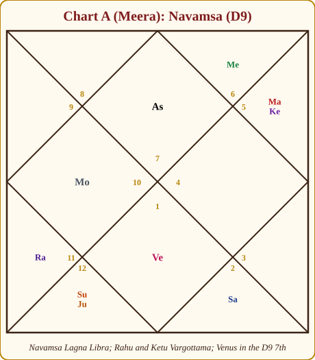
*Figure 25.3: Meera's Navamsa. Jupiter comes home to Pisces and Mercury to Virgo: two planets that looked ordinary in the Rasi chart are inwardly strong.*

What the D9 adds: Jupiter, awkward in Taurus in D1, sits in his own sign in D9, his promises about marriage and children are kept. Mercury, merely neutral in D1, is exalted in D9, her intellect is deeper than it shows. Venus in the D9 7th confirms marriage as a central theme. Rahu and Ketu Vargottama make the home–career pull a lifelong, not passing, theme. No planet is debilitated in either chart.

### 7. Dasha timeline

The Moon at 21° Cancer is in Ashlesha, Mercury's star. Balance of Mercury at birth = (30° − 21°) ÷ 13°20′ × 17 years = 11.475 years. Computed from 12 December 1988:

| Mahadasha | From | To | Age |
|---|---|---|---|
| Mercury (balance) | birth | Jun 2000 | 0–11½ |
| Ketu | Jun 2000 | Jun 2007 | 11½–18½ |
| Venus | Jun 2007 | Jun 2027 | 18½–38½ |
| Sun | Jun 2027 | Jun 2033 | 38½–44½ |
| Moon | Jun 2033 | Jun 2043 | 44½–54½ |
| Mars | Jun 2043 | Jun 2050 | 54½–61½ |
| Rahu | Jun 2050 | May 2068 | 61½–79½ |

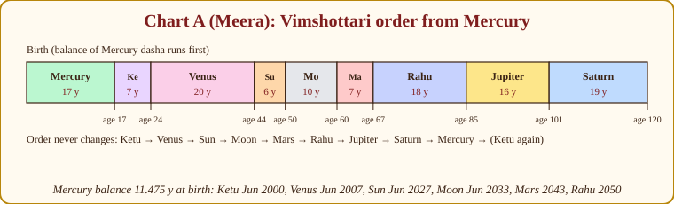
*Figure 25.4: The order from Mercury. The first block runs only its 11½-year balance; every later block is full length.*

Venus's sub-periods (Venus years × sub-lord years ÷ 120): Venus–Venus Jun 2007–Oct 2010; Venus–Sun to Oct 2011; Venus–Moon to Jun 2013; Venus–Mars to Aug 2014; **Venus–Rahu Aug 2014–Jul 2017**; Venus–Jupiter to Mar 2020; Venus–Saturn to May 2023; Venus–Mercury to Mar 2026; Venus–Ketu Mar 2026–May 2027.

**Past confirmations.** Marriage in 2016 falls in Venus–Rahu: Venus is the 7th lord and Rahu occupies the 4th, the house of home, a textbook fit. Sade Sati ran roughly 2000–2007 as Saturn crossed Gemini, Cancer and Leo, the 12th, 1st and 2nd from her Cancer Moon; that was also Ketu's Mahadasha, her school-leaving and college years, which she remembers as lonely and formative. Ashtama Shani, Saturn in Aquarius in the 8th from the Moon, 2023–2025, coincided with Venus–Saturn and Venus–Mercury: a heavy, grinding stretch at work and at home. I would put these three to her as questions, not statements.

**Now (2026).** Venus–Ketu, March 2026 to May 2027: the last sub-period of a twenty-year Venus era. Ketu sits in her 10th. A closing sub-period behaves like a clearing because the sub-lord is Ketu, whose whole nature is release, and because the next Mahadasha lord (the Sun) is already waiting; the tradition reads the junction of two Mahadashas (the *dasha sandhi*) as unsettled ground. This is a wind-down and a clearing, the classic year in which people leave a role they have outgrown and do not yet know what comes next. Saturn in Pisces is in her 5th house and the 9th from the Moon (a good transit position by A.9); Jupiter in Gemini until mid-2026 is in her 8th, quiet, then enters Cancer, directly over her natal Moon, for the year to mid-2027.

**The next three to five years.** The Sun Mahadasha begins in June 2027. The Sun is her 10th lord, a functional benefic, sitting in her Lagna: a six-year era in which career, authority and identity fuse. Sun–Sun (to Sep 2027) and Sun–Moon (to Mar 2028) open it, the two yogakarakas for Scorpio running back to back. Jupiter moves into Leo, her 10th house, in mid-2027, aspecting the 2nd and 4th, while Saturn moves to Aries, her 6th house (an upachaya where Saturn does well) from about mid-2027. The double transit does not fall neatly on the 10th house itself in this stretch, so I do not promise a dramatic promotion; I say instead that 2027–28 favours a change of *role*, from employee to authority in her own name, with the Sun's period supplying the confidence.

### 8. Her three questions

**"Should I start my own consulting practice?"** Houses: the 10th (career), the 7th (business, and the 10th from the 10th), the 3rd (enterprise), the 2nd and 11th (money in). Findings: 10th lord Sun in the Lagna, she is built to work in her own name; Jupiter in the 7th and Venus own-sign in the D10's 7th (from the Dasamsa: Venus in Taurus in the D10 7th, and the Sun exalted in Aries in the D10) favour partnership-based practice; the combust Saturn in the 2nd warns that cash flow will be the discipline she has to learn. Timing: Venus–Ketu (2026–May 2027) is the year to *prepare*, register, build the client list, leave cleanly. The Sun Mahadasha from June 2027, with Jupiter entering her 10th house that same summer, is the launch window. So: yes, the chart favours it; not yet, and not alone at the start.

**"When will finances stabilise?"** Houses: the 2nd (Saturn, combust; lord Jupiter retrograde in the 7th), the 11th (empty; lord Mercury in the Lagna), and Venus, who disposits the whole chart from the 12th. Findings: the chart's money is *slow and knowledge-based*, never fast. The Venus–Saturn and Venus–Mercury sub-periods (2020–2026), with Ashtama Shani in the middle, were the hardest stretch, and she will confirm that. Sun–Moon (Sep 2027–Mar 2028) and Sun–Rahu (to Jun 2029) bring the 9th lord and then the 4th-house Rahu into play: income steadies and property or a home matter becomes possible. Tendency: stability from 2028, with 2026–27 as the year to hold savings and avoid large fixed commitments.

**"My mother's health?"** Houses: the 4th (Rahu; lord Saturn combust in the 2nd), the Moon as karaka (strong, own sign, 9th), the 4th from the Moon (Libra, Venus own sign). Findings: the karaka and the Moon's own 4th are both strong, a resilient constitution and a good support system around her mother. The Rahu in the 4th and the combust lord say: irregular, hard-to-pin-down complaints, and a mother who does not like doctors. Timing: Jupiter aspects her 4th house from Gemini (until mid-2026) and again from Leo (mid-2027 to mid-2028); the year in between lacks that protection, so I would ask for regular check-ups in the second half of 2026 and early 2027. I do not diagnose. I say: keep the appointments, and let the doctors do the rest.

> **🪔 Consultation tip:** Meera's mother is not in the room. Everything about her is said to help Meera *act* ("book the check-up", "sit with her more this winter") never to describe the mother's fate.

### 9. Remedies

Following Chapter 23: strengthen functional benefics that need it, pacify functional malefics by conduct and giving, and prescribe a stone only where a functional benefic genuinely lacks strength.

- **Jupiter**: 2nd and 5th lord, a functional benefic, in a kendra but in an enemy's sign and retrograde: the one planet in this chart where a gemstone is defensible. A **yellow sapphire (pukhraj)** in gold on the index finger, Thursday, after a trial period; alternatives are Thursday chana dal or turmeric daan and respect for teachers. Jupiter is strong in the D9, which is why I expect the stone to work quietly rather than dramatically.
- **Sun and Moon**: already strong; no stone needed. Sunday Surya Namaskar and Monday water-offering are enough to keep the yogakarakas engaged.
- **Saturn**: a functional malefic, combust, in the 2nd: pacify by conduct. Saturday sesame or mustard-oil daan; a fixed monthly savings transfer on the first Saturday of every month (Saturn loves a system); truthful, sparing speech.
- **Venus**: a functional malefic but the dispositor of the chart, in her own sign: honour rather than fight. Friday giving of white things (curd, rice) and mindful spending.
- **Rahu in the 4th**: coconut or a blanket to someone in need on Saturdays, and a calm, uncluttered home.
- **Ketu in the 10th**: feed street dogs; work without demanding credit.
- **No blue sapphire, no emerald, no diamond**: Saturn, Mercury and Venus are all functional malefics for Scorpio, and a stone strengthens; it does not pacify.

> **📕 From Lal Kitab:** In the Lal Kitab chart, where houses are fixed, Meera's Rahu sits in the 4th house, the Moon's *pakka ghar*. The tradition considers Rahu in the Moon's house unsettling for mother, home and peace of mind, and commonly teaches keeping a small piece of solid silver on one's person and offering coconut into flowing water, along with never quarrelling with the mother, as commonly taught in the Lal Kitab tradition; the exact prescription varies with the edition. *(Source: Lal Kitab, Pt. Roop Chand Joshi, 1939–1952 Urdu editions; Hindi translations vary.)*

### 10. What I would say in the first two minutes

"Meera, you are a Scorpio rising with the Sun and Mercury sitting right in your first house, a person who is what she does, speaks precisely, and is far more private than her confidence suggests. Your Moon is in its own sign in the ninth house: your mind finds its peace in learning and in teaching others; you have almost certainly been someone's guru already without calling it that. Your strongest planets are that Moon and the Sun, grace and authority. The planet that asks the most of you is Saturn in your second house, weakened by the Sun: money and savings will always need a system rather than a mood. The twenty-year Venus period that shaped your adult life ends next year, and the Sun's period that follows is, frankly, the one your chart has been preparing you for. Let us see whether the past agrees with me before we talk about that."

### 11. Lessons for the student

- A strong Lagna with the 10th lord in it makes career and identity one thing; read them together.
- Always test Gaja Kesari *from the Moon*. Jupiter in a kendra from the Lagna is not enough.
- Combustion crosses sign boundaries: Saturn at 5° Sagittarius is combust by a Sun at 28° Scorpio.
- A dispositor chain that ends in one planet tells you which planet to honour in remedies, here Venus, a functional malefic, whom we respect rather than strengthen.
- The last sub-period of a long Mahadasha (here Venus–Ketu) is a clearing, not a launch. Time the launch to the new Mahadasha.

## Reading two: Arjun (Chart B)

You watched Arjun's consultation in Chapter 24. Here is the preparation that sat under it, the hour at the desk that made the seventy-five minutes in the chair look easy.

### 1. Birth data, the chart, and the planetary table

Born 3 March 1995, 20:15, Pune (constructed), just after sunset, which is why the Sun sits in the 8th house, below the western horizon. Lagna Cancer 19°, in Ashlesha nakshatra, pada 1.

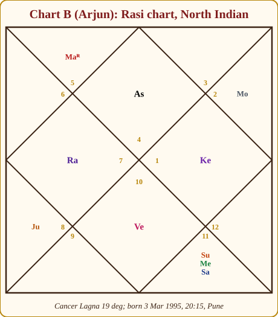
*Figure 25.5: Chart B, North Indian style. Sun, Mercury and Saturn in the 8th (Aquarius); Moon in the 11th (Taurus); Mars retrograde in the 2nd (Leo); Jupiter in the 5th (Scorpio); Venus in the 7th (Capricorn); Rahu in the 4th, Ketu in the 10th.*

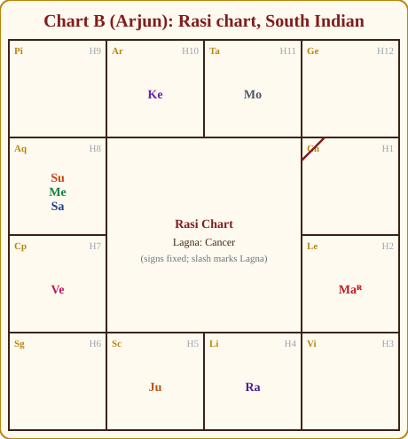
*Figure 25.6: The same chart in the South Indian grid; the Lagna mark is in Cancer.*

Combustion is measured from the Sun at 18° Aquarius (318°).

| Planet | Sign | Degree | House | Nakshatra, pada (lord) | Dignity (🟢 good 🟡 neutral 🔴 difficult) | Notes |
|---|---|---|---|---|---|---|
| Sun | Aquarius | 18° | 8 | Shatabhisha 4 (Rahu) | 🔴 Enemy's sign (Saturn) | 2nd lord in the 8th |
| Moon | Taurus | 6° | 11 | Krittika 3 (Sun) | 🟢 **Exalted** (past the deepest point at 3°, still in the sign) | Waxing, seventh day of the bright half; Lagna lord |
| Mars | Leo | 21° | 2 | Purva Phalguni 3 (Venus) | 🟢 Friend's sign (Sun) | Retrograde; **yogakaraka** (5th and 10th lord) |
| Mercury | Aquarius | 2° | 8 | Dhanishta 3 (Mars) | 🟡 Neutral (Saturn) | 16° from the Sun, **not combust** (orb 14°); 3rd and 12th lord |
| Jupiter | Scorpio | 22° | 5 | Jyeshtha 2 (Mercury) | 🟢 Friend's sign (Mars) | 6th and 9th lord |
| Venus | Capricorn | 24° | 7 | Dhanishta 1 (Mars) | 🟢 Friend's sign (Saturn) | 4th and 11th lord; 24° from the Sun, not combust (orb 10°) |
| Saturn | Aquarius | 25° | 8 | Purva Bhadrapada 2 (Jupiter) | 🟢 Own sign, but 🔴 **combust**, 7° from the Sun (orb 15°) | **7th and 8th lord** |
| Rahu | Libra | 12° | 4 | Swati 2 (Rahu) | (none) | In its own nakshatra |
| Ketu | Aries | 12° | 10 | Ashwini 4 (Ketu) | (none) | In its own nakshatra |

The one line a beginner misses: **Saturn is combust.** He sits in his own sign, which normally makes him solid, but the Sun is seven degrees away and scorches him. Saturn is also the lord of the 7th house (Capricorn), not Venus, who merely *occupies* the 7th as the marriage karaka while owning the 4th and 11th. So the marriage lord is weak, and the marriage karaka is strong. Hold that tension; it explains his whole question about marriage.

> **⚠️ Common beginner mistake:** Calling Venus "the 7th lord" because she sits in the 7th. A house's lord is the planet that *owns the sign* there (Capricorn belongs to Saturn) and the occupant is a separate fact. Mixing the two here would make Arjun's marriage look quick and easy when the chart says the opposite: a weak lord, a strong karaka, and therefore late but good.

> **🔍 Why?** Combustion is astronomy first. A planet within a few degrees of the Sun rises and sets with it and cannot be seen at all: it is lost in the glare. The tradition reads what cannot be seen as unable to act, and Parashara lists the orbs (A.2). Being in its own sign does not move a planet away from the Sun, so it does not save it. Everyday parallel: a brilliant new employee seated next to the loudest manager in the office; everything he says is drowned out, however good it is.

Now the dispositor chain. Sun and Mercury are in Saturn's sign; the Moon is in Venus's sign and Venus in Saturn's; Mars is in the Sun's sign, Jupiter in Mars's, Rahu in Venus's, Ketu in Mars's. Follow every thread and it ends at Saturn, in his own sign, combust, in the 8th house. The whole chart rests on a scorched Saturn in the room of hidden things. That is Arjun: patient, private, working in insurance data where nobody sees him, and never quite sure his effort is noticed.

> **📖 Story: Three ministers locked in the eighth room.** The eighth room of the haveli is the strong-room, vaults, old papers, the family's secrets, the insurance ledgers. Three men are shut in there together: the King (Sun), the young Prince-Secretary (Mercury) and the old Judge of Labour (Saturn). It is the Judge's own room; he has the keys and knows every ledger. But the King has brought his brazier, and the Judge, sitting seven feet from it, is sweating, half-blinded, working at half his strength. The Prince, sixteen feet away, is uncomfortable but clear-headed; he reads the ledgers aloud and turns them into reports. Nobody outside the room knows how much work is done in there. The family's fortune depends on that room, and the family barely remembers it exists.
>
> **Rule:** Planets in the 8th work in hidden, technical, research-like fields; a planet within its combustion orb of the Sun loses strength even in its own sign.

### 2. First impression: the three pillars

**Lagna.** Cancer rising at 19°, empty, its lord the Moon exalted in the 11th. A protective, cautious exterior over a deeply feeling interior; identity built through friends, networks and belonging rather than through display. Ashlesha on the Lagna adds a watchful, slightly wary quality.

**Moon.** Taurus, exalted, 11th house, Krittika, waxing and bright. Stable, stubborn, loyal, practical; good with people once trust is earned; a mind that wants security. The strongest planet in the chart, and it is the Lagna lord, which makes it the pillar that holds the rest.

**Sun.** Aquarius, 8th house, in an enemy's sign, with Mercury and Saturn. The soul and the father are both in the strong-room: a father who was distant or rule-bound, a sense of self that formed through private struggle rather than applause, and a lifelong pull towards research and what lies beneath the surface.

### 3. Functional benefics and malefics for Cancer

| 🟢 Functional benefics | 🔴 Functional malefics | 🟡 Neutral / mixed | Yogakaraka | Marakas |
|---|---|---|---|---|
| Mars, Jupiter, Moon | Venus, Mercury | Sun, Saturn | **Mars** | Saturn, Venus |

Applied here: all three benefics are well placed, Mars in a friend's sign, Jupiter in a friend's sign in a trikona, the Moon exalted. Both malefics sit where they cannot do much harm, Venus in a friend's sign in the 7th (she gives comfort and delays nothing but her own promises), Mercury in the 8th (a dusthana lord in a dusthana, which the tradition often reads as protective). The two neutrals, Sun and Saturn, are the weak ones, and both are in the 8th. Read that pattern once and the man's life makes sense: the good things come steadily through effort and people; the difficult things come through father, authority and hidden processes.

### 4. House by house

**1st (Cancer), self.** Empty; lord Moon exalted in the 11th; karaka Sun in the 8th; from the Moon, Taurus with the Moon. Identity through belonging and networks, because the Lagna lord sits in the house of friends and gains; a body that gains weight and holds water, because Cancer and an exalted Moon are both watery.

**2nd (Leo), wealth, speech, family.** Mars retrograde, the yogakaraka; lord Sun in the 8th; karaka Jupiter in the 5th; from the Moon, Gemini, lord Mercury in the 8th. Money through effort and technical skill, because the success-planet sits in the house of savings and its lord in the house of research; blunt speech, because Mars sits in the mouth's house; a father–son tension in the family, because the 2nd lord is the Sun (father) sitting with Saturn in the 8th.

**3rd (Virgo), courage, siblings, communication.** Empty; lord Mercury in the 8th; karaka Mars in the 2nd; from the Moon, Cancer, the Lagna. Courage turned into analysis rather than argument, because the lord of communication sits in the house of hidden research.

**4th (Libra), mother, home, education.** Rahu; lord Venus in the 7th; karakas Moon (exalted) and Mercury (8th); from the Moon, Leo with Mars. A strong mother, because the karaka is exalted; a restless relationship with home and a foreign-flavoured education, because Rahu the stranger sits in the house of home and schooling; property through a partner, because the 4th lord sits in the 7th.

**5th (Scorpio), intelligence, children, past merit.** Jupiter, the 9th lord; lord Mars in the 2nd; karaka Jupiter here; from the Moon, Virgo, empty. Deep, investigative intelligence, because the planet of wisdom sits in the house of intellect in Mars's probing sign; children later but well supported, because the karaka is present and strong while the lord is retrograde. Mars aspects Jupiter here by his 4th aspect from Leo: the 10th lord meets the 9th lord, a Raja yoga.

**6th (Sagittarius), service, debts, disease.** Empty; lord Jupiter in the 5th; karakas Mars (2nd) and Saturn (8th); from the Moon, Libra with Rahu. A salaried career, because the lord of service sits in a trikona and service becomes his merit; digestion and weight, because Jupiter governs fat and liver; anxiety about unseen rivals, because Rahu sits in the 6th from the mind.

**7th (Capricorn), marriage, partnership.** Venus, the karaka, lord of the 4th and 11th; lord Saturn combust in the 8th, own sign; from the Moon, Scorpio with Jupiter. Late, because the house's lord is weak and is Saturn, the planet of delay, in the 8th; good, because the karaka sits in the house itself and Jupiter sits in the 7th from the mind (a principled, educated partner); comfort and home through the partner, because the 4th–11th lord is the occupant.

**8th (Aquarius), research, inheritance, sudden change.** Sun, Mercury, Saturn (own, combust); lord and karaka Saturn here; from the Moon, Sagittarius, lord Jupiter in the 5th. Hidden, technical, research-like work, because three planets sit in the house that is the 12th from the 9th, where visible fortune disappears and depth begins; inheritance late and complicated, because its lord is combust. Longevity is not for the client; Saturn own-sign in the 8th is classically steadying, and that is all I note.

**9th (Pisces), fortune, father, higher learning, long journeys.** Empty; lord Jupiter in the 5th; karakas Jupiter and Sun; from the Moon, Capricorn with Venus. Strong higher education, because the 9th lord sits in the 5th, the house of learning, in a friend's sign; a father who provided from a distance, because the karaka of father sits in the 8th; long journeys favoured, and Saturn is transiting this house in 2025–27.

**10th (Aries), career.** Ketu; lord Mars in the 2nd; karakas Sun, Mercury and Saturn in the 8th, Jupiter in the 5th; from the Moon, Aquarius, the cluster itself. Hidden analytical work, because every career signifier sits in the 8th and the 10th from the mind *is* the 8th house; detachment from titles, because Ketu sits in the house of status. In the Dasamsa (D10, Chapter 11) the Sun sits in his own sign Leo in that chart's 12th (authority exercised in institutions or abroad) and Saturn is exalted there (discipline in work rewarded, late).

**11th (Taurus), gains, friends, elder siblings.** Moon exalted, the Lagna lord; lord Venus in the 7th; karaka Jupiter in the 5th; from the Moon, Pisces, empty. Gains through people, because the self's lord sits at full strength in the house of friends; wishes fulfilled slowly, because the house's lord sits in Saturn's sign.

**12th (Gemini), foreign lands, expenses, sleep.** Empty; lord Mercury in the 8th with Sun and Saturn; karaka Saturn in the 8th; from the Moon, Aries with Ketu. Foreign residence tied to research, because the lord of foreign lands sits in the house of hidden work; sleep disturbed by thinking, because Mercury (the mind's chatter) rules the house of sleep.

> **🔍 Why?** Two conclusions above rest on the grammar of the houses. The 8th is the 12th house counted from the 9th: the loss of visible fortune, hence what is hidden, sudden, buried and researched; planets there work below the surface. Ketu in the 10th gives detachment from status because the 10th is the most visible house (the noon point, where the Sun has directional strength) and Ketu is the headless sadhu who has given up wanting to be seen. Everyday parallel: the back-office team that keeps the company running and never appears in the brochure, led by a man who does not care to.

### 5. Yogas present, honestly weighed

- 🟢 **Gaja Kesari:** Jupiter in Scorpio is the 7th from the Moon in Taurus (a kendra from the Moon) and Jupiter aspects the Moon directly. Genuine and reasonably strong (Jupiter in a friend's sign). Protection, a good name among those who know him.
- 🟢 **Raja yoga by aspect:** Mars, lord of the 5th and 10th, aspects Jupiter, lord of the 9th, by his 4th aspect. A kendra lord touching a trikona lord. Real; moderate, because the aspect is one-way and Mars is retrograde.
- 🟡 **Budha-Aditya** in the 8th: Mercury with the Sun, not combust. Intelligence, but pointed at hidden and technical things, and sobered by Saturn's presence.
- 🟡 **Viparita flavour:** the 12th lord Mercury in the 8th (Vimala type) and the 8th lord Saturn in his own 8th (Sarala type, by some teachers). Both are diluted because the 2nd lord Sun sits with them, the "not with other lords" clause. It shows as resilience through crises, not windfalls.
- 🔴 **Kuja dosha:** Mars is in the 2nd from the Lagna, the 4th from the Moon and the 8th from Venus, present on all three counts. Mitigations: Mars is the yogakaraka, in a friend's sign, and retrograde (which several teachers count as softening). It asks for a partner of comparable energy and a marriage where disagreement is allowed. Never say the word "dosha" to him without the mitigations in the same breath.
- 🔴 **Saturn combust in the 8th:** the dispositor of the whole chart, weakened. This is the real fault line, not a yoga, but the thing every remedy has to respect.
- 🔴 **Kala Sarpa:** *not* formed. Rahu in Libra and Ketu in Aries; the Moon in Taurus and Mars in Leo sit on the far side of the axis from the rest. Arjun had been told otherwise, and the chart itself dismantles it.
- 🟢 **The exalted Lagna lord in the 11th:** not a named yoga, but the backbone of the chart.

> **📖 Story: The Commander who walks backwards.** The Commander (Mars) is the one officer in this court whom the Lagna trusts completely, for a Cancer-born king, Mars is the yogakaraka, the single planet who can deliver a rise in status. He has been posted to the second room, the treasury and the family dining hall, in the King's own colours (Leo), which suits him. But he is walking backwards, retrograde. He does not charge; he re-checks, re-does, reworks the plan a third time, and gets there later than the others expected and more thoroughly than anyone else could. From that room he looks across at the fifth, where the Royal Priest (Jupiter) sits, and the two of them: Commander and Priest, quietly run the kingdom's real affairs.
>
> **Rule:** A retrograde yogakaraka still gives its rise, but through repetition and depth rather than speed.

### 6. Navamsa (D9) quick read

| Planet | D1 | D9 sign | D9 house | Comment |
|---|---|---|---|---|
| Lagna | Cancer 19° (movable → from Cancer; 6th part) | **Sagittarius** | 1 | |
| Sun | Aquarius 18° (fixed → from Libra; 6th part) | Pisces | 4 | 🟢 Friend's sign; a D9 kendra |
| Moon | Taurus 6° | Aquarius | 3 | 🟡 Neutral |
| Mars | Leo 21° | Libra | 11 | 🟡 Neutral |
| Mercury | Aquarius 2° | Libra | 11 | 🟢 Friend's sign |
| Jupiter | Scorpio 22° | Capricorn | 2 | 🔴 **Debilitated**, the D9 Lagna lord |
| Venus | Capricorn 24° | Leo | 9 | 🔴 Enemy's sign |
| Saturn | Aquarius 25° | Taurus | 6 | 🟢 Friend's sign |
| Rahu | Libra 12° | Capricorn | 2 | (none) |
| Ketu | Aries 12° | Cancer | 8 | (none) |

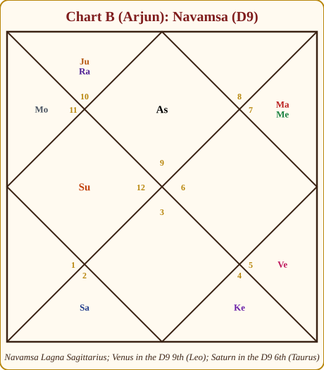
*Figure 25.7: Arjun's Navamsa. Jupiter, comfortable in the Rasi chart, is debilitated here, the inner reserve of faith is thinner than the outer confidence.*

No planet is Vargottama. The honest finding is Jupiter: friend's sign in D1, debilitated in D9, and he is the D9 Lagna lord. Arjun's outer optimism about study and travel rests on an inner doubt, and he will need a teacher or mentor to hold the faith for him at times. For marriage, the D9 7th house is Gemini, whose lord Mercury sits in the D9 11th with Mars in a friend's sign, a partner met through networks or work, articulate and independent. Venus in the D9 9th in an enemy's sign suggests a partner from a different background, and a love that needs adjusting to.

### 7. Dasha timeline

The Moon at 6° Taurus is in Krittika, the Sun's star, which runs to 10° Taurus. Balance of the Sun at birth = (10° − 6°) ÷ 13°20′ × 6 years = 1.8 years.

| Mahadasha | From | To | Age |
|---|---|---|---|
| Sun (balance) | birth | Dec 1996 | 0–1.8 |
| Moon | Dec 1996 | Dec 2006 | 1.8–11.8 |
| Mars | Dec 2006 | Dec 2013 | 11.8–18.8 |
| Rahu | Dec 2013 | Dec 2031 | 18.8–36.8 |
| Jupiter | Dec 2031 | Dec 2047 | 36.8–52.8 |
| Saturn | Dec 2047 | Dec 2066 | 52.8–71.8 |

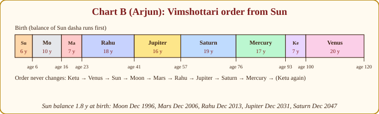
*Figure 25.8: The order from the Sun. Rahu's eighteen years (the whole of his twenties and early thirties) are the current chapter.*

Rahu's sub-periods, computed from December 2013 (Rahu years × sub-lord years ÷ 120): Rahu–Rahu to Aug 2016 (2y 8m 12d); **Rahu–Jupiter to Jan 2019** (2y 4m 24d); Rahu–Saturn to Nov 2021 (2y 10m 6d); **Rahu–Mercury to Jun 2024** (2y 6m 18d); Rahu–Ketu to Jul 2025 (1y 0m 18d); **Rahu–Venus Jul 2025–Jul 2028** (3y); Rahu–Sun to May 2029 (10m 24d); Rahu–Moon to Nov 2030 (1y 6m); Rahu–Mars to Dec 2031 (1y 0m 18d).

**Past confirmations.** The Mars Mahadasha (age 12–19) was his school success, the yogakaraka running through the exam years, with Mars–Venus (Nov 2011–Jan 2013) at the board-exam and college-entry stage. Rahu–Jupiter (Aug 2016–Jan 2019), Jupiter the 9th lord in the 5th, finished the master's and started the job in 2017–18. Rahu–Mercury (Nov 2021–Jun 2024), the 12th lord in the 8th, with Saturn transiting Aquarius over the 8th-house cluster from January 2023, produced the "stuck since 2022" feeling he came in with. Rahu–Ketu (Jun 2024–Jul 2025), Ketu being in his 10th, was the year of "what am I doing here". Three confirmations, all landed in the session.

**Now (early 2026).** Rahu–Venus, to July 2028: Venus in the 7th, lord of the 4th and 11th, partnerships, relationships, home and gains through others. Saturn in Pisces is in his 9th house and the 11th from the Moon, one of Saturn's three good transit positions (A.9). Jupiter is in Gemini, his 12th, until mid-2026, then enters Cancer, his Lagna, for a year.

> **🔍 Why?** The double-transit rule is astronomy put to work. Jupiter takes about a year per sign and Saturn about two and a half, so they are the two slow hands of the clock; every other planet passes over a house several times a year, but these two mark out stretches long enough for a life event to ripen. Jupiter's aspect opens a door (growth, permission); Saturn's makes it real (structure, paperwork, commitment). Both are needed because a door with no frame is a hole in the wall. Everyday parallel: a wedding needs the couple to choose a date *and* the hall to be free; either alone is a wish.

**The next three to five years.** Mid-2026 to mid-2027: Jupiter on the Lagna, aspecting the 5th, 7th and 9th houses, while Saturn stands in the 9th, the double transit falls on the 9th (higher learning, long journeys) and Jupiter alone lights the 7th. From about mid-2027 Saturn moves to Aries, his 10th house and the 12th from the Moon: the first phase of Sade Sati begins, and Saturn's 10th aspect from Aries falls on Capricorn, the 7th house. Jupiter in Leo (mid-2027 to mid-2028) crosses his natal Mars and aspects the 8th-house cluster and the 10th; Jupiter in Virgo (mid-2028 to mid-2029) aspects the 7th again. Then Rahu–Sun (Jul 2028–May 2029) asks for care with father and authority; Rahu–Moon (May 2029–Nov 2030) brings the exalted Lagna lord forward, a settling period; Rahu–Mars (to Dec 2031) is the yogakaraka's sub-period, and Jupiter's Mahadasha follows.

### 8. His three questions

**"Research career abroad, or stay?"** Houses: the 9th (higher learning, long journeys), the 12th (foreign residence), the 10th (career). Findings: the 9th lord Jupiter strong in a trikona; the 12th lord Mercury in the 8th with the Sun, foreign lands linked to research; every 10th-house karaka in the 8th; the D10 Sun in his own sign in the 12th of that chart. The chart favours research and favours doing it elsewhere. Timing: the decision window is **mid-2026 to mid-2027** (double transit on the 9th, Rahu–Venus running); the move itself leans towards **2027–28**, when Saturn from Aries aspects the 12th house and Jupiter from Leo aspects the 12th lord. I say "favours", not "go".

**"When will I marry?"** Houses: the 7th (Venus present; lord Saturn combust in the 8th), the D9 7th (Gemini, lord Mercury with Mars in the D9 11th), Venus as karaka in the current sub-period. Findings: a weak lord delayed it; a strong karaka and her sub-period now bring it forward. Timing: **late 2026 through 2028**, Jupiter aspecting the 7th house and the transiting 7th lord from Cancer (mid-2026 to mid-2027), then Saturn's aspect on the 7th from Aries (from about mid-2027) and Jupiter's from Virgo (mid-2028). The first serious opening is the second half of 2026 into 2027. The Kuja dosha conversation belongs here, with its mitigations, and with the advice to read both charts together when a match is proposed.

**"Why have I felt stuck since 2022?"** Rahu–Mercury (Nov 2021–Jun 2024): the 12th lord, a functional malefic for Cancer, in the 8th. Saturn transiting Aquarius (Jan 2023–Mar 2025), the 8th house, sitting on his natal Sun, Mercury and Saturn, and the 10th from the Moon. Then Rahu–Ketu with Ketu in the 10th. Three heavy indicators, all passed by mid-2025. Naming the period, and its end, was worth more to him than any prediction.

### 9. Remedies

- 🟢 **Mars**, the yogakaraka, in a friend's sign, retrograde: the one stone I would consider. **Red coral (moonga)**, gold or copper, ring finger, Tuesday, after a trial period. It strengthens the planet that gives him his rise; the tradition does not hold that it worsens Kuja dosha.
- 🟢 **Jupiter**, 9th lord and the planet carrying the abroad question, weak in the D9: Thursday chana dal or turmeric daan, respect for teachers, a mentor sought and kept. A yellow sapphire is defensible but I would not give two stones at once; coral first.
- 🟢 **Moon**, exalted; nothing to add but Monday's water offering and a fixed sleep hour.
- 🟡 **Saturn**, combust, the dispositor: pacify by conduct. Saturday sesame or mustard-oil daan; service to someone older; no shortcuts in work, ever, the 8th punishes them.
- 🟡 **Sun**, in an enemy's sign with Saturn: mend the father relationship by small regular acts; Sunday Surya Namaskar.
- 🔴 **Rahu**, his Mahadasha lord: coconut or a blanket on Saturdays to someone in need, and a hard rule about screens after ten at night.
- **No blue sapphire** (Saturn is neutral and a maraka for Cancer), **no diamond** (Venus is a functional malefic), **no emerald** (Mercury likewise).

> **📕 From Lal Kitab:** In the Lal Kitab house-chart, Arjun's Saturn sits in the 8th house, one of Saturn's *pakka ghar* (permanent houses), so the tradition treats it as settled rather than hostile. Commonly taught remedies for Saturn in the 8th include offering a few drops of mustard oil on Saturdays, feeding a black dog or crows, keeping the home's drains and dark corners clean, and neither lending nor borrowing iron, as commonly taught in the Lal Kitab tradition; editions differ on the details. *(Source: Lal Kitab, Pt. Roop Chand Joshi, 1939–1952 Urdu editions; Hindi translations vary.)*

### 10. What I would say in the first two minutes

"Arjun, you are a Cancer rising (protective on the outside, deeply feeling inside) with your Moon, which is your mind, exalted in the eleventh house: a steady, loyal, practical mind that succeeds through people and networks, and that is the strongest thing in your chart. After the Moon comes Mars, in your second house, retrograde, for your Lagna he is the planet of success, and he works by doing things deeply and twice rather than fast. Your weak point is the three planets in the eighth house, the Sun, Mercury and Saturn together, with Saturn scorched by the Sun. The eighth is research, insurance, hidden work, and the feeling that life happens to you. That is where your career has been and where the frustration has been. Let me check three things about your past before we go further."

### 11. Lessons for the student

- Find the lord of a house before you read its occupant. Chart B's 7th lord is Saturn; Venus only lives there.
- Combustion in one's own sign is still combustion. A scorched dispositor weakens a whole chart quietly.
- A yoga is a claim; the D9 is the audit. Jupiter looked fine in D1 and is debilitated in D9, say both.
- When a client names a year they felt stuck, find the antardasha *and* the Saturn transit; when both agree, the birth time is confirmed.
- Dismantle a planted fear (here, Kala Sarpa) with the chart in front of the client, not with your opinion of the other astrologer.

## Reading three: Devika (Chart C)

Devika is the oldest of the three and the one with the most life behind her to check against. That makes her chart the best teacher of timing in this book: three Mahadashas have already run, and each left a mark she can confirm.

### 1. Birth data, the chart, and the planetary table

Born 22 July 1979, 23:55, Kolkata (constructed), five minutes before midnight, the Sun deep below the horizon in the 4th house. Lagna Aries 7°, in Ashwini nakshatra, pada 3.

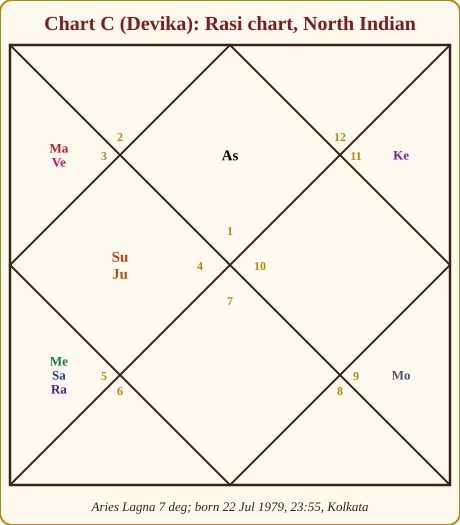
*Figure 25.9: Chart C, North Indian style. Sun and Jupiter in the 4th (Cancer); Mars and Venus in the 3rd (Gemini); Mercury, Saturn and Rahu in the 5th (Leo); Moon in the 9th (Sagittarius); Ketu in the 11th (Aquarius).*

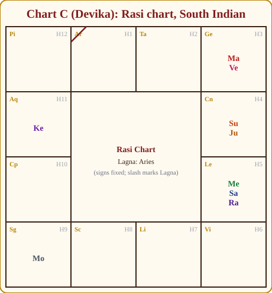
*Figure 25.10: The same chart in the South Indian grid; the Lagna mark is in Aries.*

Combustion is measured from the Sun at 5° Cancer (95°).

| Planet | Sign | Degree | House | Nakshatra, pada (lord) | Dignity (🟢 good 🟡 neutral 🔴 difficult) | Notes |
|---|---|---|---|---|---|---|
| Sun | Cancer | 5° | 4 | Pushya 1 (Saturn) | 🟢 Friend's sign (Moon) | 5th lord in the 4th, with Jupiter |
| Moon | Sagittarius | 14° | 9 | Purva Ashadha 1 (Venus) | 🟡 Neutral (Jupiter); 🟢 waxing, two days from full | 4th lord in the 9th |
| Mars | Gemini | 27° | 3 | Punarvasu 3 (Jupiter) | 🔴 Enemy's sign (Mercury); 🔴 **combust**, 8° from the Sun (orb 17°) | **Lagna lord** and 8th lord; Vargottama in D9 |
| Mercury | Leo | 1° | 5 | Magha 1 (Ketu) | 🟢 Friend's sign (Sun) | 26° from the Sun, not combust; in the first 3°20′ of Magha, a gandanta zone; 3rd and 6th lord |
| Jupiter | Cancer | 26° | 4 | Ashlesha 3 (Mercury) | 🟢 **Exalted** | 9th and 12th lord; 21° from the Sun, not combust (orb 11°) |
| Venus | Gemini | 15° | 3 | Ardra 3 (Rahu) | 🟢 Friend's sign (Mercury) | 2nd and 7th lord; 20° from the Sun, not combust (orb 10°) |
| Saturn | Leo | 18° | 5 | Purva Phalguni 2 (Venus) | 🔴 Enemy's sign (Sun) | 10th and 11th lord |
| Rahu | Leo | 3° | 5 | Magha 1 (Ketu) | (none) | Gandanta zone |
| Ketu | Aquarius | 3° | 11 | Dhanishta 3 (Mars) | (none) | |

Two lines to underline. **Mars, the Lagna lord, is combust** (eight degrees behind the Sun across the sign boundary) and in an enemy's sign. That is the weakest planet in the chart, and it is the planet that stands for her body and her will. And Jupiter is exalted, at 26° Cancer: past the deepest exaltation point of 5°, but still in the sign of his exaltation, and in a kendra.

The dispositor chain is the prettiest of the three charts. Sun in Cancer reports to the Moon; the Moon in Sagittarius reports to Jupiter; Jupiter in Cancer reports back to the Moon, a closed loop, an exchange of signs between the 4th lord and the 9th lord. Mars and Venus report to Mercury, Mercury and Saturn and Rahu to the Sun, Ketu to Saturn; every planet in the chart flows into the Sun and from there into that Moon–Jupiter loop. The 4th house (home, mother, property) and the 9th (fortune, father, faith) are the engine of her life.

> **📖 Story: The exchange of keys.** In Devika's haveli the Queen Mother (Moon) and the Royal Priest (Jupiter) have swapped rooms. The Queen Mother has moved into the ninth room, the family temple, with the Priest's books and lamps around her; the Priest has moved into the fourth, the mother's room at the heart of the house, and he has never been so well, sitting in his exaltation, with the King (Sun) beside him as his guest. Each holds the other's keys. Whatever happens to the home happens to the family's fortune, and whatever happens to their faith happens to their home. Then look up: from the temple in the ninth room the Priest's new seat is the eighth room away, the Shakata pattern, so the Queen Mother's fortunes rise and dip like a cart on a rutted road. But the cart is pulled by an exalted Priest and a King, so it never overturns.
>
> **Rule:** Two lords in each other's signs fuse their houses (Parivartana); Jupiter exalted in a kendra is Hamsa yoga; Jupiter in the 6th, 8th or 12th from the Moon is Shakata, and one chart can hold all three.

> **🔍 Why?** An exchange of signs fuses two houses by plain logic: each lord is living in the other's house, so whatever reaches one house's affairs reaches the other's lord, and the two cannot act without acting for each other. Parashara ranks the exchange between a kendra lord and a trikona lord (Maha) above the others because those are the houses of support and of merit. Everyday parallel: two sisters who have swapped kitchens for a year; each one's cooking now depends on the other's stove.

### 2. First impression: the three pillars

**Lagna.** Aries rising at 7°, empty, its lord Mars combust and in an enemy's sign in the 3rd. Courage, initiative and heat, but the Lagna lord's weakness shows as energy that comes in bursts and then runs out, headaches and impatience, and a will that is strongest when defending others (the 3rd house is siblings and courage).

**Moon.** Sagittarius, 9th house, Purva Ashadha, nearly full. An optimistic, principled, faith-oriented mind; a mother herself who mothers through teaching; the exchange with Jupiter makes the Moon far stronger than "neutral" suggests. The Moon is her second pillar.

**Sun.** Cancer, 4th house, with exalted Jupiter, in a friend's sign. Soul and father in the mother's room, beside the Priest: a father who was a moral presence in the home, a childhood steeped in learning and religion, and (as the 5th lord) children and intelligence flowing through home and education. This Sun–Jupiter pair is the yogakaraka combination for Aries (A.6), and it is the strongest thing in the chart.

### 3. Functional benefics and malefics for Aries

| 🟢 Functional benefics | 🔴 Functional malefics | 🟡 Neutral / mixed | Yogakaraka | Marakas |
|---|---|---|---|---|
| Sun, Mars, Jupiter | Mercury, Venus, Saturn | Moon | Sun + Jupiter together | Venus, Mercury |

> **🔍 Why?** The marakas are derived, not decreed. The 8th house is longevity and the 3rd, being the 8th from the 8th, is its second signal; the houses that are the 12th (loss) from those two are the 7th and the 2nd. So the 2nd and 7th and their lords are where life-force is spent, which is why Parashara calls them maraka. For Aries that means Venus (2nd and 7th lord) and Mercury (6th lord, the other classical candidate). Everyday parallel: the two exits of a house are not dangerous rooms, but they are where people leave from.

Applied here: two of the three benefics (Sun and Jupiter) are together in a kendra, one of them exalted. The third, Mars, is the weak one. All three malefics are in Mercury's or the Sun's signs: Mercury and Saturn in the 5th with Rahu (the difficult corner of the chart), Venus in the 3rd with Mars. So the pattern is: an exceptionally strong core (home, faith, children's future) with two soft spots (the body (Mars) and the 5th house (Saturn, Rahu, Mercury)) that will make her *work* for what the core promises.

### 4. House by house

**1st (Aries), self.** Empty; lord Mars combust in the 3rd; karaka Sun in the 4th with Jupiter; from the Moon, Sagittarius with the Moon. A strong spirit in a body that tires, because the karaka of vitality is excellently placed while the Lagna lord is scorched; head, heat and blood to respect, because Aries is the head and Mars is blood.

**2nd (Taurus), wealth, speech, family.** Empty; lord Venus in the 3rd, a friend's sign; karaka Jupiter exalted; from the Moon, Capricorn, empty. Steady money by her own effort, because the wealth lord sits in the house of effort; gentle speech, because Venus rules the mouth's house.

**3rd (Gemini), siblings, courage, effort.** Mars (Lagna lord) and Venus (2nd and 7th lord); lord Mercury in the 5th; karaka Mars here; from the Moon, Aquarius with Ketu. Siblings central and contested, because the self's lord sits weakened in the siblings' house; great personal effort, because the Lagna lord and the karaka of courage are both here; the property matter lives in this house, because Mars is also the karaka of land.

**4th (Cancer), mother, home, property, education.** Sun and exalted Jupiter; lord Moon in the 9th in exchange; karakas Moon and Mercury; from the Moon, Pisces, lord Jupiter exalted. The best house, because a great benefic exalted in a kendra and the exchange with the 9th tie home to fortune: a good mother, a home that is a temple, property that is rightfully hers, education completed well. Hamsa and Raja yoga both live here.

**5th (Leo), children, intelligence, past merit.** Mercury, Saturn, Rahu; lord Sun in the 4th with Jupiter; karaka Jupiter exalted; from the Moon, Aries, empty. Children delayed and worried over, then well, because the occupants (delay, foreignness, anxiety) are malefic while the lord and karaka are excellent: struggle in the process, success in the outcome. Some popular teachings call Saturn with Rahu "cursed"; Parashara does not, and I read it as a stern tutor and a foreign one in the nursery.

**6th (Virgo), illness, debts, litigation, service.** Empty; lord Mercury in the 5th with Saturn and Rahu; karakas Mars (3rd) and Saturn (5th); from the Moon, Taurus, empty. Digestive and anxious illness, because the lord of disease sits in Leo, the stomach's sign (A.1), with Saturn and Rahu; long, document-heavy litigation, for the same reason.

**7th (Libra), marriage.** Empty; lord Venus in the 3rd with Mars, a friend's sign; karaka Venus, and in a woman's chart Jupiter as husband-karaka, exalted; from the Moon, Gemini with Mars and Venus. A steady marriage to a principled, learned man, because the husband-karaka is exalted in a kendra; sharp arguments that pass quickly, because Mars sits with the 7th lord.

**8th (Scorpio), transformation, inheritance, chronic matters.** Empty; lord Mars combust in the 3rd; karaka Saturn in the 5th; from the Moon, Cancer with Sun and Jupiter. Inheritance real but contested, because the lord of inheritance sits in the house of siblings; sudden events touch the body, because the 8th lord is also the Lagna lord.

**9th (Sagittarius), fortune, father, faith, higher learning.** Moon, in exchange with Jupiter; lord Jupiter exalted in the 4th; karakas Jupiter and Sun; from the Moon, Leo with Mercury, Saturn and Rahu. Grace through home and family, because of the exchange; a father who was the family's conscience, because the Sun sits with Jupiter; higher learning good, and likely to continue in later life.

**10th (Capricorn), career.** Empty; lord Saturn in the 5th, an enemy's sign; karakas Sun (4th), Mercury and Saturn (5th), Jupiter (4th); from the Moon, Virgo, empty. Career through children, education or institutions, because the career lord sits in the 5th; status late and by patience, because that lord is Saturn in an uncomfortable sign.

**11th (Aquarius), gains, elder siblings, friends.** Ketu; lord Saturn in the 5th; karaka Jupiter exalted; from the Moon, Libra, empty. Gains that arrive unchased, because the detached sadhu sits in the house of gains while the karaka is strong.

**12th (Pisces), expenses, hospitals, foreign lands, release.** Empty; lord Jupiter exalted in the 4th; karaka Saturn in the 5th; from the Moon, Scorpio, empty. Expenses on home and children, because the 12th lord sits in the 4th; a genuine spiritual bent, because the house of release is ruled by an exalted great benefic; foreign links through the daughter. Saturn transits here in 2025–27.

### 5. Yogas present, honestly weighed

- 🟢 **Hamsa Mahapurusha:** Jupiter exalted in the 4th, a kendra. Strong. Dignity, learning, a moral centre that others lean on.
- 🟢 **Raja yoga by conjunction:** the 5th lord Sun and the 9th lord Jupiter together in a kendra, the two trikona lords, the yogakaraka pair for Aries, in one room. Strong. A rise through family, property and children's achievements rather than through office.
- 🟢 **Maha Parivartana:** the 4th lord Moon in Jupiter's sign, the 9th lord Jupiter in the Moon's, a kendra lord and a trikona lord exchanging. Strong. Home and fortune are one account.
- 🟡 **Chandra–Mangala:** the Moon in Sagittarius and Mars in Gemini are in mutual 7th aspect. Present; moderate, because Mars is combust. Earning capacity and drive, in bursts.
- 🔴 **Shakata:** Jupiter is the 8th from the Moon. Present. Ups and downs in fortune, but the Hamsa and the exchange set a high floor under the dips.
- 🟡 **Kemadruma, cancelled:** the 2nd from the Moon (Capricorn) and the 12th (Scorpio) are empty, but Mars and Venus sit in a kendra from the Moon, and Jupiter in a kendra from the Lagna. Solitude felt, never suffered.
- 🟡 **Adhi yoga, partial:** Venus in the 7th and Jupiter in the 8th from the Moon; the 6th is empty. Some leadership in her circle, not the full result.
- 🟡 **Kuja dosha, partial:** Mars is the 3rd from the Lagna (clear), the 7th from the Moon and the 1st from Venus (both count). Combust Mars weakens the dosha; her marriage has held, which is the proof.
- 🔴 **Saturn, Rahu and Mercury in the 5th, Saturn in an enemy's sign:** the fault line, children and education by struggle, and the seat of the current Rahu Mahadasha.
- 🔴 **Lagna lord combust in an enemy's sign:** the second fault line. The D9 answers it (below).
- Not present: Gaja Kesari (Jupiter 8th from the Moon), Budha–Aditya (Sun and Mercury in different signs), Neecha Bhanga (nothing is debilitated), Amala, Saraswati.

> **📖 Story: The Judge, the Stranger and the young Prince in the nursery.** The fifth room is the children's room and the schoolroom. Devika's has three occupants: the old Judge of Labour (Saturn), sitting stiffly in the King's colours which do not suit him; the Smoke-headed Stranger (Rahu), who speaks of foreign universities and strange new sciences; and the young Prince (Mercury), bright, a little anxious, standing right at the threshold. It is not a warm nursery. But look at who owns it (the King (Sun), who is sitting next door with the exalted Priest) and who is its karaka: that same Priest. The child raised in this room learns discipline from the Judge, ambition from the Stranger and cleverness from the Prince, and inherits the King's and Priest's blessing from across the wall. Hard schooling; good ending.
>
> **Rule:** Read a house's lord and karaka before you judge its occupants; malefics in a house whose lord and karaka are strong give struggle first and success after.

### 6. Navamsa (D9) quick read

| Planet | D1 | D9 sign | D9 house | Comment |
|---|---|---|---|---|
| Lagna | Aries 7° (movable → from Aries; 3rd part) | **Gemini** | 1 | |
| Sun | Cancer 5° (movable → from Cancer; 2nd part) | Leo | 3 | 🟢 **Own sign** |
| Moon | Sagittarius 14° (dual → from Aries; 5th part) | Leo | 3 | 🟢 Friend's sign; with the Sun |
| Mars | Gemini 27° (dual → from Libra; 9th part) | Gemini | 1 | 🟢 **Vargottama**, in the D9 Lagna (🔴 still an enemy's sign) |
| Mercury | Leo 1° (fixed → from Aries; 1st part) | Aries | 11 | 🟡 Neutral |
| Jupiter | Cancer 26° | Aquarius | 9 | 🟡 Neutral; the D9 9th |
| Venus | Gemini 15° | Aquarius | 9 | 🟢 Friend's sign; with Jupiter |
| Saturn | Leo 18° | Virgo | 4 | 🟢 Friend's sign; a D9 kendra |
| Rahu | Leo 3° | Aries | 11 | (none) |
| Ketu | Aquarius 3° | Libra | 5 | (none) |

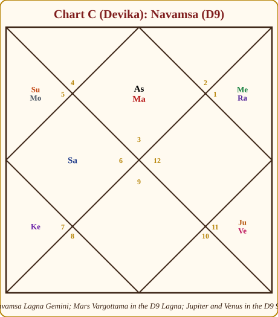
*Figure 25.11: Devika's Navamsa. The combust Lagna lord Mars returns as Vargottama in the D9 Lagna, the inner stamina the Rasi chart hides.*

What the D9 adds: Mars, so weak in D1, is Vargottama and rises in the D9 Lagna, her constitution recovers better than it looks, and her will outlasts her energy. The Sun in his own sign with the Moon in the D9 3rd, soul and mind in one room, in the King's colours, is inner steadiness. For marriage, the D9 7th is Sagittarius, whose lord Jupiter sits in the D9 9th with Venus: a husband of faith and learning, and a marriage held together by shared principles. Saturn, so awkward in D1, is in a friend's sign in a D9 kendra, the discipline is real underneath.

### 7. Dasha timeline

The Moon at 14° Sagittarius is in Purva Ashadha, Venus's star, which runs from 13°20′ to 26°40′. Balance of Venus at birth = (26°40′ − 14°) ÷ 13°20′ × 20 years = 19.0 years.

| Mahadasha | From | To | Age |
|---|---|---|---|
| Venus (balance) | birth | Jul 1998 | 0–19 |
| Sun | Jul 1998 | Jul 2004 | 19–25 |
| Moon | Jul 2004 | Jul 2014 | 25–35 |
| Mars | Jul 2014 | Jul 2021 | 35–42 |
| Rahu | Jul 2021 | Jul 2039 | 42–60 |
| Jupiter | Jul 2039 | Jul 2055 | 60–76 |

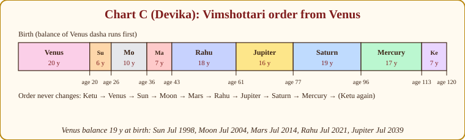
*Figure 25.12: The order from Venus. A nineteen-year Venus balance gave her a long, comfortable childhood; Rahu now runs to 2039.*

Rahu's sub-periods from July 2021: Rahu–Rahu to Apr 2024; **Rahu–Jupiter Apr 2024–Aug 2026**; **Rahu–Saturn Aug 2026–Jul 2029**; Rahu–Mercury to Jan 2032; Rahu–Ketu to Feb 2033; Rahu–Venus to Feb 2036; Rahu–Sun to Dec 2036; Rahu–Moon to Jun 2038; Rahu–Mars to Jul 2039.

**Past confirmations.** Marriage in the Sun–Venus sub-period (Jul 2003–Jul 2004): the 7th lord Venus running inside the Mahadasha of the 5th lord Sun, who sits with Jupiter, the husband-karaka, at 24, in the last year of the Sun's period. A daughter born in Moon–Jupiter (Jun 2007–Oct 2008), after the worry of Moon–Rahu (Dec 2005–Jun 2007) with Rahu in the 5th, delay, then the exalted karaka delivers. The Mars Mahadasha (2014–2021), the combust Lagna lord's period, overlapped almost exactly with her Sade Sati, Saturn through Scorpio, Sagittarius and Capricorn, roughly late 2014 to early 2023, and I would expect a surgery or a serious health episode in Mars–Saturn (Dec 2016–Jan 2018), and the property dispute surfacing around 2020–21 in Mars–Venus and Mars–Sun, when Saturn in Capricorn aspected her 4th house. All of these I would ask as questions.

**Now (2026).** Rahu–Jupiter until August: the exalted 9th lord's sub-period, the kindest stretch of the whole Rahu era, good for the daughter's admissions and for movement on property. Saturn in Pisces (2025 to about mid-2027) is her 12th house and the **4th from the Moon, a Dhaiya** (A.9): home, peace of mind and expenses under pressure for two and a half years. Jupiter in Gemini until mid-2026 sits on her natal Mars and Venus and aspects the 7th, the 9th (her Moon) and the 11th.

**The next three to five years.** From August 2026, Rahu–Saturn (to July 2029): Saturn in the 5th with Rahu, in an enemy's sign, lord of the 10th and 11th, slow, procedural, paperwork-heavy years that reward patience and punish haste, and that ask for discipline with health. Mid-2026 to mid-2027: Jupiter in Cancer, sitting on her natal Sun and Jupiter in the 4th, a Jupiter return over her strongest house, while Saturn from Pisces aspects the 4th lord Moon in Sagittarius: the double transit falls on the 4th house and its lord. From about mid-2027, Saturn enters Aries, over her Lagna, until about 2030, aspecting the 3rd (Mars, Venus), the 7th and the 10th; Jupiter moves through Leo (mid-2027 to mid-2028), over the 5th-house trio, then Virgo.

### 8. Her three questions

**"My daughter's higher education?"** Houses: the 5th (children; Mercury, Saturn, Rahu; lord Sun in the 4th with Jupiter), the 4th and 9th (education; both superb), the 12th (foreign study; lord Jupiter exalted), and Jupiter as karaka. Findings: the daughter's education is carried by the strongest part of her mother's chart; the occupants of the 5th say the field will be analytical and disciplined (Mercury, Saturn) and possibly unconventional or abroad (Rahu), and that the path has delays and paperwork. Timing: until mid-2026, Jupiter aspects the 9th and Saturn's 10th aspect from Pisces also falls on the 9th (a double transit on higher learning, inside Rahu–Jupiter) so the 2026 admission season is favoured. From August 2026 (Rahu–Saturn) things slow: scholarships, visas and paperwork need effort but are not refused. Jupiter over the 5th house in 2027–28 supports the daughter's next step. Tendency: yes, with patience; the field and the place may surprise her.

**"The property dispute?"** Houses: the 4th (Sun and exalted Jupiter; lord Moon in exchange), the 3rd (siblings; Mars, the land karaka, combust with Venus), the 6th (litigation; lord Mercury in the 5th with Saturn and Rahu), the 8th (inheritance; lord Mars). Findings: her *right* is strong (the 4th house could hardly be better) but her *force* is weak (Mars combust in the house of siblings), and the case itself will be long and technical (the 6th lord with Saturn and Rahu). Tendency: settlement or mediation rather than a courtroom victory, and she keeps her rightful share. Timing: the double transit on the 4th house and its lord, **mid-2026 to mid-2027**, is the resolution window; the Rahu–Saturn sub-period beginning August 2026 says it will conclude slowly, on paper, with lawyers, not in a dramatic hearing. Advice: a good lawyer, a written offer to the siblings in this window, no ultimatums. I never say "you will win"; I say "your position is strong and this is the window to settle from strength."

**"My health, and this Rahu period?"** Houses: the 1st (lord Mars combust (energy, head, heat), the 6th (lord Mercury in the 5th with Saturn and Rahu) digestion, anxiety, the upper abdomen that Leo governs), the 8th (lord Mars, sudden episodes rather than chronic decline), the 12th (Saturn transiting it, and the Dhaiya). Findings: a body that tires before the will does; digestive and stress-linked complaints in Rahu's period, and a tendency to search the internet at midnight for diagnoses; protection from the exalted Jupiter in the 4th (the chest) with the Sun, and from the Vargottama Mars in the D9. Timing: 2025 to mid-2027 (Saturn in the 12th, Dhaiya from the Moon) asks for routine tests, sleep and a fixed rhythm; from mid-2027 Saturn on the Lagna asks for the disciplined management of anything chronic, joints, teeth, bones. I do not diagnose. I say: "Two check-ups a year, a walk every morning, and let the doctors do the naming."

### 9. Remedies

- 🟢 **Jupiter**, 9th lord, exalted, one of the yogakaraka pair, and the karaka for both children and husband; the Rahu era leans on him. The one stone I would recommend: **yellow sapphire (pukhraj)**, gold, index finger, Thursday. Some teachers hesitate because Jupiter also owns her 12th; I weigh the 9th lordship and the exaltation higher.
- 🟡 **Mars**, the Lagna lord, a functional benefic, but combust and in an enemy's sign. A red coral is the textbook answer and I hesitate, and the reason is the logic of what a stone does: the tradition treats a gem as a lens that lets more of a planet's light through, so it magnifies the planet *as it is*, awkwardness included (everyday parallel: a louder microphone helps a good singer and exposes a nervous one). So: a stone amplifies a planet as it is, and this Mars is awkward. Conduct first for forty days: Tuesday masoor daan, daily exercise, Hanuman Chalisa, and a *trial* coral only after that, watched for a month.
- 🟢 **Sun**, 5th lord with Jupiter: Sunday Surya Namaskar and the Aditya Hridaya. A ruby is defensible; one stone at a time, and the sapphire comes first.
- 🔴 **Saturn and Rahu in the 5th**, pacify by conduct: Saturday sesame or mustard-oil daan; service to an elderly person; for Rahu, coconut in flowing water or a blanket given, and a firm rule against shortcuts and second-hand information in the legal matter.
- 🔴 **Mercury**, 6th lord in the difficult 5th: Wednesday green moong daan; keep the paperwork immaculate.
- 🟡 **Ketu in the 11th**, feed street dogs; accept gains without suspicion.
- **No blue sapphire** (Saturn is a functional malefic for Aries), **no emerald, no diamond**.

> **📕 From Lal Kitab:** In the Lal Kitab house-chart, Devika's Saturn and Rahu sit in the 5th house, one of Jupiter's *pakka ghar* (permanent houses). The tradition reads malefics in Jupiter's house as a call to strengthen Jupiter there, and commonly teaches: a saffron or turmeric tilak on the forehead, a small piece of gold kept on the body, feeding and serving cows, avoiding alcohol and meat; for Saturn in the 5th it commonly teaches donating almonds at a temple and bringing half of them home, as commonly taught in the Lal Kitab tradition; editions differ. *(Source: Lal Kitab, Pt. Roop Chand Joshi, 1939–1952 Urdu editions; Hindi translations vary.)*

### 10. What I would say in the first two minutes

"Devika-ji, you are an Aries rising (courage, initiative, heat) but the planet that rules your rising sign, Mars, is weakened by the Sun and sits in the house of siblings, so your energy comes in bursts and you spend most of it fighting for other people. Your real strength is in the fourth house: Jupiter exalted, with the Sun, in the room of home, mother and property (one of the great yogas of the tradition) and your Moon in the ninth house has exchanged places with that Jupiter, so your home and your fortune are one account. The difficult corner is the fifth house (Saturn, Rahu and Mercury together) which is children and education: hard schooling, good endings. You are in Rahu's long period; this year's sub-period is the kindest in it, and the next one, from August, will be slower. Let me check three things about your past before we talk about your daughter, the property and your health."

### 11. Lessons for the student

- A Lagna lord can be combust across a sign boundary; check the Sun's distance in degrees, not the sign.
- An exchange of signs between two lords (Parivartana) is easy to miss when the planets are in different houses; trace the dispositor chain and it jumps out.
- Hamsa and Shakata can sit in the same chart; report both and say which sets the floor.
- The D9 can rescue a planet the D1 condemns: Vargottama Mars here. Never pronounce on health from the Rasi alone.
- Time a property matter to the double transit on the 4th house *and its lord*; time a legal matter to the sub-period lord's nature (Saturn: slow, on paper).

## The template

Three charts, one method. Here it is as a card. The shaded rows are where beginners rush.

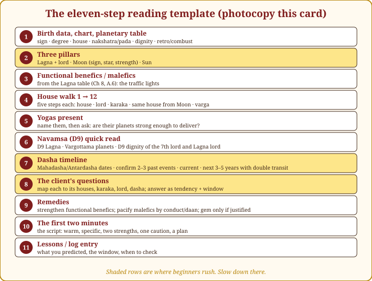
*Figure 25.13: The eleven steps. Photocopy it and keep it under the chart until you no longer need to look.*

1. **Birth data, chart, planetary table**, sign, degree, house, nakshatra and pada, dignity, retrograde and combustion. Compute; do not copy.
2. **Three pillars**, Lagna and lord, Moon (sign, star, brightness, strength), Sun.
3. **Functional benefics and malefics** for the Lagna (Chapter 8, A.6): the traffic lights.
4. **House walk 1 to 12**, the house, its lord, the karaka, the same house from the Moon, the varga (Chapter 9).
5. **Yogas**, name them, then ask whether their planets can deliver (Chapter 10).
6. **Navamsa quick read**: D9 Lagna, Vargottama planets, D9 dignity of the Lagna lord and the 7th lord (Chapter 11).
7. **Dasha timeline**: Mahadasha and Antardasha dates, two or three past confirmations, the current period, the next three to five years with the double transit (Chapters 13–14).
8. **The client's questions**, houses, lord, karaka, dasha; answer as tendency plus window.
9. **Remedies**, strengthen functional benefics, pacify functional malefics by conduct and daan, a gemstone only when justified (Chapter 23).
10. **The first two minutes**, write the script before the session.
11. **Lessons and the log entry**, what you predicted, the window, when to check.

> **🧭 Anushka's rule of thumb:** If you cannot fill step 7's "past confirmations" line with at least two dated events, you are not ready to fill step 8. Go back to the birth time.

## What next

You have reached the end of the book, which is where the astrology begins.

**Keep the notebook.** Every chart you meet from today (a cousin's, a colleague's, your own) gets a page: the three pillars, one yoga, one prediction with a window. Read the notebook every six months. It is the only teacher that knows your particular mistakes.

**Read the classics slowly.** Appendix C lists them in order. A verse a day of *Brihat Jataka* or *Phaladeepika*, with a good commentary, checked against a chart you know, will teach you more than a course. Do not read Parashara straight through; read him by topic, when a chart raises the question.

**Find a teacher.** Not a course, a person. Someone whose charts you can watch being read, who will let you sit at the desk and say your reading first and then correct it. Offer to do their paperwork in exchange. The two people who let me sit beside their desk taught me what the shelf of classics I had failed with could not.

**Do a hundred charts,** the way Chapter 24 laid out: free and careful, then low-fee with feedback, then specialised. At the hundredth, open the notebook at page one and meet the beginner you were; I still wince at mine. Then start the second hundred.

The sky will keep moving whether or not you look up. The difference an astrologer makes is that someone, somewhere, walks into their Monday morning knowing which way the wind is blowing and what to do about it. That is the whole job. Go and do it kindly.

## In one breath

- All three readings follow the same eleven steps: data and table, three pillars, functional nature, house walk, yogas, D9, dasha with confirmations, questions, remedies, script, lessons.
- Compute every position: nakshatra and pada from absolute longitude; combustion from the Sun's distance in degrees (Saturn is combust in Charts A and B, Mars in Chart C); D9 from the movable–fixed–dual rule.
- Meera (Scorpio): Budha-Aditya in the Lagna, Moon strong in the 9th, Venus own-sign in the 12th closing the dispositor chain; Venus's period ends 2027 and the Sun's begins, the launch window for her own practice.
- Arjun (Cancer): the chart rests on a combust Saturn in the 8th; Gaja Kesari and a Mars–Jupiter Raja yoga hold him up; Rahu–Venus now, marriage window late 2026–2028, research abroad favoured mid-2026 to 2028; no Kala Sarpa.
- Devika (Aries): Hamsa, a Sun–Jupiter Raja yoga and a Moon–Jupiter exchange make the 4th house her engine; the combust Lagna lord and the 5th-house trio are the tests; Rahu–Saturn from August 2026 is slow and procedural; the property window is mid-2026 to mid-2027.
- Gems only where a functional benefic needs strength (yellow sapphire for Meera and Devika, red coral for Arjun) and no blue sapphire for any of the three.
- Every answer is a tendency plus a window, and every remedy begins with conduct.

## Practice

> **✍️ Practice:**
> 1. Compute the nakshatra and pada of Arjun's Venus (24° Capricorn) and Devika's Jupiter (26° Cancer) from the absolute longitude, and name each nakshatra's lord.
> 2. Using the A.10 rule, find the Navamsa sign of Meera's Saturn (5° Sagittarius) and Devika's Venus (15° Gemini). Show the counting.
> 3. In Chart B, Saturn is the 7th lord and Venus occupies the 7th. Write two sentences on marriage for Arjun that use both facts and neither the word "delay" nor the word "dosha".
> 4. Devika's Rahu–Saturn sub-period begins in August 2026. Compute its length from the A.8 formula and its end date, then write one hedged sentence about the property matter for that period.
> 5. Take a fourth chart (your own or a friend's) and fill the eleven-step template on one page. Time yourself. Under ninety minutes is the goal by the end of your first hundred charts.

Answers

1. Venus 24° Capricorn: absolute longitude (10 − 1) × 30 + 24 = 294°; 294 ÷ 13.333 = 22.05 → the 23rd nakshatra, Dhanishta (Mars); 294 − 293.33 = 0.67° into it → pada 1. Jupiter 26° Cancer: (4 − 1) × 30 + 26 = 116°; 116 ÷ 13.333 = 8.7 → the 9th nakshatra, Ashlesha (Mercury); 116 − 106.67 = 9.33° → 9.33 ÷ 3.333 = 2.8 → pada 3.
2. Saturn 5° Sagittarius: Sagittarius is dual, so count from the 5th sign from it, Aries; 5° ÷ 3°20′ = 1.5 → the 2nd part → Aries + 1 = Taurus. Venus 15° Gemini: dual, count from Libra; 15 ÷ 3.333 = 4.5 → the 5th part → Libra + 4 = Aquarius.
3. For example: "Your 7th house is ruled by Saturn, who sits weakened in your 8th, so marriage in your chart matures slowly and asks for patience with paperwork and family process. Venus herself lives in that 7th house in a friendly sign, and you are in her sub-period now, which is why the coming two years are the most supportive for it that you have had."
4. Rahu 18 × Saturn 19 ÷ 120 = 2.85 years = 2 years 10 months 6 days; from late August 2026 that ends about the start of July 2029. "During Saturn's sub-period the property matter tends to move slowly and on paper (mediation and documents rather than hearings) so this is a period to settle patiently from a position of strength rather than to expect a quick result."
5. Your own work. Keep the page; it is the first entry in the second half of your notebook.

