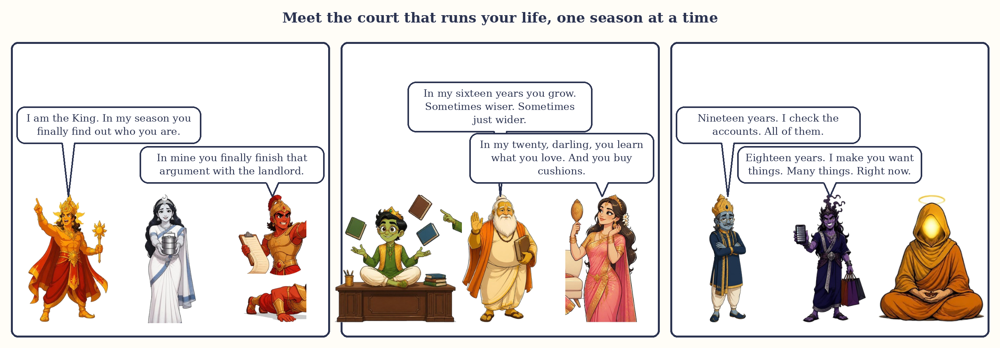

# Why This Book

Dear reader,

The most common question I am asked is not "what am I like?" It is "how long will this last?"

A woman whose marriage has gone quiet. A man who has sent out two hundred applications and heard nothing. A mother whose child has changed overnight into someone she does not recognise. A friend who feels, for no reason she can name, that a door is closing behind her and another has not yet opened. None of them wants a personality reading. They want to know whether the weather will change, and when, and what they are supposed to do in the meantime.

Vedic astrology has an answer to that question, and it is one of the most beautiful ideas in the whole subject. It says that a life is not one long undifferentiated road. It moves in seasons. Each season is run by one of the nine planets, for a fixed number of years, in a fixed order, and the one you are born into depends on where the Moon was standing in the sky the night you arrived. The system is called the dasha system. The word simply means a period, a stage, a season. The Venus season lasts twenty years. The Saturn season lasts nineteen. The Sun season lasts six. Inside each season are smaller seasons, and inside those, smaller ones still, like a year that holds months that hold weeks.

Once you know this, you stop asking "what is wrong with me?" and start asking "what is this season asking of me?" That change of question is, in my experience, worth more than any prediction.

I wrote my first book, *Astrology, Gently*, for people who wanted to learn to read a whole chart. This one is narrower and, in a way, more personal. It is about time. You do not need to have read the first book. You do not need to know any astrology at all. You need your date, time and place of birth, a free app, and about two hundred pages.

Three promises.

**Plain words.** The Indian astrology books on my shelf are heavy with Sanskrit that nobody explains, and I watched that weight push away friend after friend who genuinely wanted to learn. So in this book a mahadasha is a *season*, an antardasha is a *sub-season*, a nakshatra is *the Moon's star*, a house is a *room*. Every Sanskrit word appears once, in brackets, when the idea is introduced, and lives afterwards in the glossary at the back, so that you can still talk to any astrologer in their own language. In the chapters themselves, you will read English.

**A reason for everything.** Where a rule comes from astronomy, I say so. Where it comes from the logic of the system, I show the logic. Where it is simply what the tradition hands down, with no reason given, I tell you that too, because you deserve to know how firm the ground is under your feet.

**No fear.** A hard season is a season with a task, not a verdict. You will not find the words "you will" followed by anything frightening in this book. You will find "this season tends to ask for" and "this is a time to take care of", and you will find, in every chapter, what to actually do.

The planets appear here as the same cast of characters as in the first book: a King and a Queen Mother, a Commander, a clever young Prince, a Priest, a Minister of Pleasure, an old Judge, and two strangers at the gate. A season, in this telling, is simply the years when one of them is running your household. You will meet them in stories and in small comic strips, because a planet you can picture is a planet you can live with.

*The cast: the nine planets as they appear in the comic strips, with you in the middle.*

Three constructed lives run through the book: Meera, Arjun and Devika. Their charts are made up for teaching, their events are composites, and their season maps are worked out in full so that you can see the method before you turn it on yourself. By the last chapter you will have drawn your own.

My hope is modest and specific. I hope that the next time a hard year arrives, for you or for someone you love, you will be able to open your season map, find where you are, understand what the time is asking, and know roughly how long it will last. That knowledge does not make the year easy. It makes it bearable, and it makes it useful. For me, that has been the whole gift of this subject.

Go gently.

Anushka Bharti
