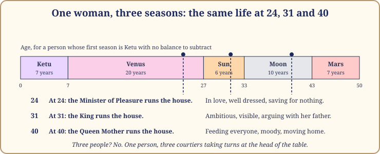
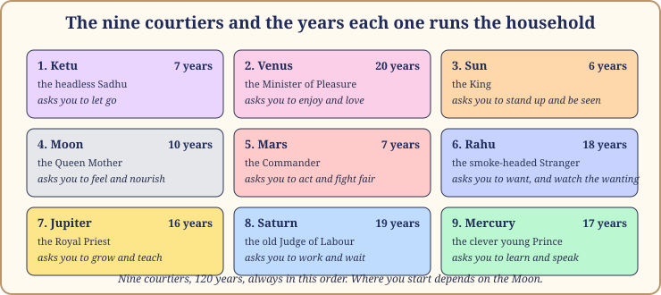
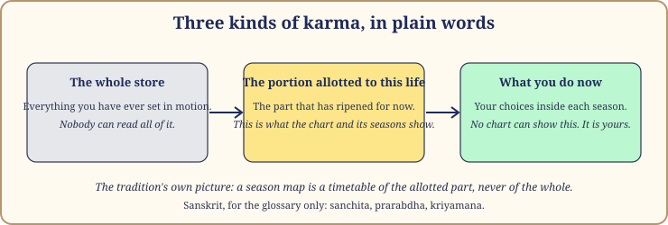

# Chapter 1: The Same Person, Different Lives

Let me tell you about a woman I will call Nandini. She is a composite, stitched from several people I have read for and a little of myself.

**At 24**, Nandini is in love. Not only with the boy from her office, though there is one; she is in love with everything. She buys a kurta in a colour her mother would never choose. She spends her first salary on a haircut and a dinner she cannot afford. She sings in the kitchen. She is soft, generous, a little lazy about her career and not worried about it. Asked what she wants from life, she says: to be happy, and to be loved.

**At 31**, you would not recognise her. She has a title at work and a corner of the office with her name on it. She argues with her father at dinner, and she wins. She has stopped singing. She wakes at five to exercise. People call her "strong", and some do not mean it kindly. She wants to be seen, respected, right. The soft girl of 24 looks, to her, like a stranger who wasted seven years.

**At 40**, she is softer again, in a different way. She has moved house twice in three years. Her mother has come to live with her. She feeds everyone who walks through the door and worries about them after they leave. Her moods rise and fall with the news, the weather, her daughter's face after school. The title matters less. She cries easily and laughs easily. She is, in a word her family uses with love and exasperation, "emotional".

Three women. One life. If you met them separately you would say they had different natures, different values, different gods. And yet the same birth chart sat under all three. This book is about why.

## Life moves in chapters

You already know this in your bones. We say "that was a different phase of my life", "the year everything changed". The person who sat the board exams is not quite the person who sat in the delivery room, and neither is the person at the kitchen table at fifty, wondering where the time went.

What most of us do not have is a map of the chapters. We find out that a chapter has ended only when we look back. We find out that a hard stretch was a stretch, not the rest of our lives, only when it lifts. And inside it, the question that keeps us awake is almost never "why am I like this?" It is "how long will this last?"

Vedic astrology has a timetable for exactly this: the dasha system, which simply means the system of seasons, and the subject of this book.

*Figure 1.1: Nandini's three scenes on a timetable of seasons: Venus at 24, the Sun at 31, the Moon at 40. Three courtiers, one woman.*

## What the dasha system is, in one paragraph

Here it is, whole, so you can see the shape before we take it apart. The sage Parashara, in his great textbook of astrology, gives a timetable of 120 years (the Vimshottari dasha; the word means "a hundred and twenty"). The 120 years are divided among the nine planets, each getting a fixed number of years, always in the same order. Where you start depends on where the Moon stood at your birth, in which of the 27 small star-groups along its path (your birth star, nakshatra). From there the timetable rolls forward. The planet whose years you are in colours everything: your wants, your fears, the people who arrive, the doors that open and close. We will call those years a **season**, and the planet in charge the **season lord**. Each season divides again into nine **sub-seasons**, in the same proportions, so every stretch of life has a main colour and a second colour laid over it. That is the whole machine. The rest is detail and kindness.

> **📖 Story: The household changes hands.** In Book 1 the nine planets were a royal court, and I am keeping them. The **King** (the Sun), proud and warm, wants to be seen. The **Queen Mother** (the Moon) runs the household and knows everyone's moods because she has them all herself. The **Commander** (Mars) guards the gate and starts the fights. The clever young **Prince** (Mercury) writes the letters and counts the coins. The **Royal Priest** (Jupiter) teaches, blesses and gives too much. The **Minister of Pleasure** (Venus) arranges music, weddings and comfort. The old **Judge of Labour** (Saturn) keeps the ledger of every debt. At the gate stand two strangers: **Rahu**, the smoke-headed traveller who wants everything he sees, and **Ketu**, the headless sadhu who wants nothing. When the Minister holds the keys, the house fills with music and visitors. When the Judge takes over, the music stops and the accounts come out. Same house, different person in charge. **Rule:** a season is the years when that courtier runs your household; to understand the season, ask what that courtier wants.

*Figure 1.2: The court, with each courtier's share of the 120 years. Chapter 2 explains the lengths and the order.*

## Why timing, not character, answers the questions people ask

Most astrology books, including most of Book 1, are about character and structure: what your chart says about your mind, your marriage, your work, your mother. That is useful. But think about what people actually ask when they sit across from me. Almost nobody asks "what am I like?" They ask: how long will this go on? Why *now*? Is it me, or the time? When does it get better? Every one of those is a question about timing. The chart alone cannot answer them, because the chart is a photograph: it does not move. The seasons make the photograph into a film.

> **🔍 Why?** This is the system's own logic. A birth chart shows every promise in a life at once: the good marriage and the hard stretch at work, the move abroad and the quiet years, all in one picture. But a life is not lived all at once. Something has to decide *which* promise ripens *when*, and that is the season system: a planet's promises come due, says Parashara, in that planet's own seasons and sub-seasons. The chart is the seed packet; the seasons are the sowing calendar. Everyday parallel: a school timetable. Every subject is "in" your year, but on Tuesday morning it is Maths and nothing else. You do not ask whether you are a Maths person; you ask what period it is.

This is why the same person seems to become three people. Nandini's chart did not change; the courtier in charge did. And it is why a hard year is not a verdict on you. It is a period on the timetable, and periods end.

Now the honest part, which I would rather say on page five than have you discover on page two hundred.

## What the dasha system is not

**It is not a script.** The season system tells you which courtier is in charge and what that courtier wants, not what you will do about it. Two people in a Saturn season both feel the weight of work and limits. One grows bitter. The other learns a craft so well that it feeds her for the rest of her life. The season was the same; the person was not.

The tradition itself says this, more clearly than many modern astrologers do. It divides karma into three kinds. In plain words: **the whole store**, everything you have ever set in motion, which nobody can read; **the portion allotted to this life**, the part that has ripened and is due now; and **what you do now**, the choices you make inside each season, which no chart can show because you have not made them yet. A birth chart, and the seasons built on it, show only the second kind.

*Figure 1.3: The tradition's picture of karma. A season map is a timetable of the allotted part only.*

> **🔍 Why?** This is the tradition's own teaching, not my softening of it; the three Sanskrit names are in the glossary. If the chart showed the whole store, every life would be fully written and no effort would matter, and the tradition plainly does not believe that, because it spends whole chapters on conduct and practices. The middle position is the only one that fits: the chart and its seasons show what has ripened for this life, and leave what you do now to you. Everyday parallel: the monsoon arrives on its own calendar; nobody chooses that. Whether your roof is fixed by June is up to you.

**It is not a fortune-telling machine.** This book will never tell you that a particular month brings a death, a divorce or a lost fortune. I do not believe anyone can read a chart that precisely, and I have seen what fear does to people who were told such things. You will read instead that a season "tests a marriage" or "asks you to take your health seriously". That is as precise as honesty allows, and it tells you where to put your attention.

**It is not the whole of astrology.** The seasons are one layer. The chart underneath (which planets own which rooms of your life, how strong each is, who sits with whom) decides *how* a season lands on you in particular. That is why one woman's Venus season is a wedding and another's is a lesson about wanting the wrong things. Part III returns to the chart, and Book 1 goes deeper still, but you do not need Book 1 to use this one.

## The plain-words promise

Indian astrology books fail their readers in one particular way: they are written in a Sanskrit nobody explains. You open a page, meet a sentence made of six technical words, and close the book feeling stupid. You are not stupid. The book was written for people who already knew the words.

So here is my promise. In this book, **the prose is in English.** When I introduce an idea that has a Sanskrit name, I give you the Sanskrit once, in parentheses, so you recognise it when an app or a family astrologer uses it. After that I use the English word only. A major period is a *season*. A sub-period is a *sub-season*. The ascendant is your *rising sign*. The houses of the chart are *rooms*. The 27 lunar mansions are *the Moon's stars*. The planets moving overhead today are *the weather*. Appendix B lists every English term with its Sanskrit. The one Sanskrit word I keep is *dasha* itself, because it is in the title and on every app screen; think of it simply as "season".

> **💡 Did you know?** The textbook I keep calling "Parashara's" is the *Brihat Parashara Hora Shastra*, shortened to BPHS, a conversation between the sage and his student Maitreya. It describes many season systems; the 120-year one is the system Parashara says to use in ordinary times. When this book says "the tradition gives no reason", it means Parashara states the rule and moves on.

## Why the Moon is the starting point

The whole timetable begins with the Moon: not the Sun, not your rising sign. Where the Moon stood at your birth decides which courtier runs your first season. Newcomers find this odd. The Sun is the King; surely the King should set the calendar?

> **🔍 Why?** Two layers. The first is tradition: Parashara keys the timetable to the Moon's star, and the texts do not argue the point. The second is the system's own logic. The Moon is the fastest hand on the sky's clock; it crosses one of the 27 stars in about a day, so it is the only body whose star changes fast enough to make the timetable differ between two children born a day apart. The Moon also stands for the mind, the part of you that feels each season. A season is lived through the mind long before it is lived through events, so the mind's planet is the natural place to start the clock. Everyday parallel: a household runs on the Queen Mother's calendar, not the King's. The festivals, the fasts, the days the house is full or empty: she decides those. The King makes speeches; she decides what day it is.

> **📖 Story: The Queen Mother's calendar.** The court argued about who should keep the royal calendar. The King said: I am the light of the kingdom, measure the year by me. The Priest said: I move slowly and wisely, measure it by me. The old Judge said nothing and kept his own accounts. The Queen Mother listened, then asked one question. "Which of you knows, tonight, what every member of this household is feeling?" Nobody answered. "Then the calendar is mine," she said, "because a year is not what happens in a kingdom. It is what the people in it live through." From that night the court's seasons were counted from where she stood when each child was born. **Rule:** the first season is chosen by the Moon's star at birth, because seasons are lived through the mind, and the Moon is the mind.

## What you will be able to do by the end

You will be able to **find your own season and sub-season** with a free app (Chapters 2 and 3); **understand what each of the nine seasons asks of a person**, as a task and not a verdict (Chapters 4 to 12); **read the shape of your own life so far**, laying the seasons under the chapters you already know (Chapters 16 and 18); **prepare for the next changeover** (Chapter 15); and **live a hard season without fear**, with practices that cost nothing and a clear sense of when to ask a doctor or a counsellor instead of an astrologer (Chapter 17).

You will meet three constructed lives again and again: Meera, born in Jaipur in 1988; Arjun, born in Pune in 1995; and Devika, born in Kolkata in 1979. They are composites built for teaching, so we can take their lives apart without hurting anyone.

> **⚠️ Common mistake:** reading your season as a sentence rather than a season. I have watched people see "Saturn" or "Rahu" against their current age and go quiet for a week. Every one of the nine seasons has been lived well by millions of people. The question is not "is it good or bad?" but "what is it asking of me, and for how long?" That question has an answer.

> **🧭 Anushka's rule of thumb:** when life feels like weather you did not order, look up your season before you look inside yourself for a fault. Half the time the weather explains it.

## A word about dates

Every date in this book is approximate, and I will say so once in each chapter. Season tables depend on the exact minute of birth and on a setting in the software, and both can shift a changeover by weeks or months. When I write that Meera's Venus season ends "around June 2027", I mean that stretch of the year, not a particular Tuesday. A date in this book is a tide, not a bell. Read the book in order once; after that, open it at the season you are in.

## In one breath

- Life moves in chapters, and the same person can seem like three people at 24, 31 and 40; the dasha system, which simply means the system of seasons, is Vedic astrology's timetable for those chapters.
- Parashara's timetable is 120 years long, divided among the nine planets in a fixed order; where you start depends on the Moon's star at your birth.
- A season is the years when one courtier runs your household; to understand it, ask what that courtier wants.
- Timing answers the questions people actually ask ("how long?", "why now?"); the chart is the seed packet, the seasons are the sowing calendar.
- It is not a script: a chart shows only the portion of karma allotted to this life, never the whole store and never what you choose to do now.
- This book speaks English, gives each Sanskrit word once in parentheses, and keeps a glossary in Appendix B; all dates are approximate.

## Try this

> **✍️ Try this:**
>
> 1. Divide your life so far into chapters, the way you would divide a book. Give each a title and an approximate age range. Do not use astrology yet; use your memory. Keep this page for Chapter 16.
> 2. Pick one chapter and write three lines: what you wanted then, what you feared then, who was closest to you then. Notice how different the answers are from today's.
> 3. Think of one hard stretch that has ended. How long did it last? Did you know, while inside it, that it would end?
> 4. Without looking back at the Story box, name the nine courtiers and what each one wants. Then check.

Answers

Exercises 1 to 3 are yours alone. For 4: the King (Sun) wants to be seen; the Queen Mother (Moon) to feel and nourish; the Commander (Mars) to act and win; the Prince (Mercury) to learn and talk; the Royal Priest (Jupiter) to grow, teach and give; the Minister of Pleasure (Venus) love, comfort and beauty; the Judge of Labour (Saturn) the work done and the debts paid; the Stranger (Rahu) everything he sees; the headless Sadhu (Ketu) nothing at all.

