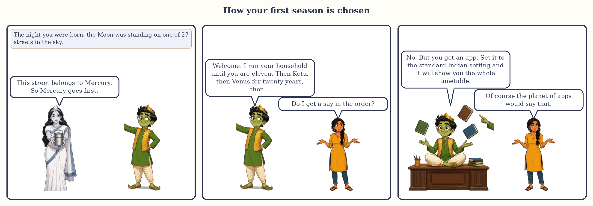
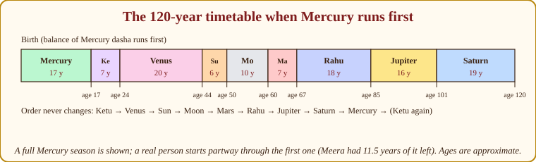
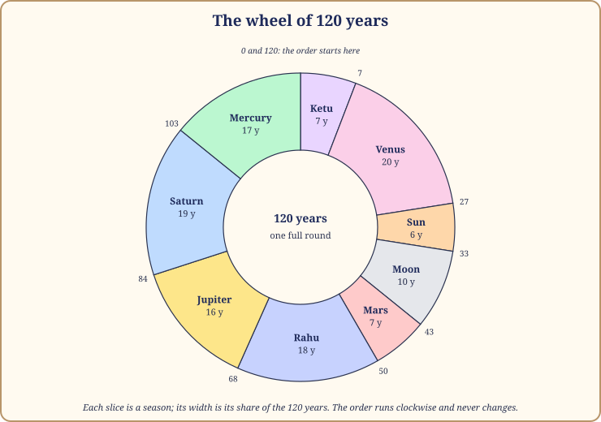
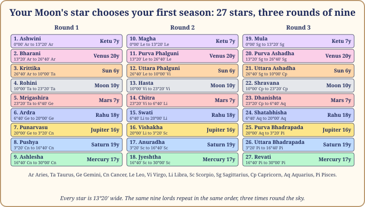
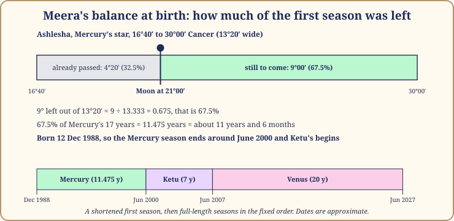

# Chapter 2: The Sky's Timetable: How the Seasons Work

Think of a railway line with nine stations. The train always stops at them in the same order, never skipping one, never turning back. What differs from passenger to passenger is only which station you boarded at, and how far along the platform you stood when the train pulled in.

*How your first season is chosen: the Moon's street on the night you were born decides who goes first.*

That is the whole of the season system's mechanics: nine stations, one fixed order, and a starting point chosen by the Moon. This chapter gives you all three, then shows you how to read your own timetable off a free app in five steps. All dates here are approximate.

## Nine planets, nine seasons

Each planet gets a fixed number of years. Here they are, in the order the timetable always runs.

| Order | Season lord | The courtier | Years | Share of the 120 |
|---|---|---|---|---|
| 1 | Ketu | the headless Sadhu | 7 | 5.8% |
| 2 | Venus | the Minister of Pleasure | 20 | 16.7% |
| 3 | Sun | the King | 6 | 5.0% |
| 4 | Moon | the Queen Mother | 10 | 8.3% |
| 5 | Mars | the Commander | 7 | 5.8% |
| 6 | Rahu | the smoke-headed Stranger | 18 | 15.0% |
| 7 | Jupiter | the Royal Priest | 16 | 13.3% |
| 8 | Saturn | the old Judge of Labour | 19 | 15.8% |
| 9 | Mercury | the clever young Prince | 17 | 14.2% |

Add them up: 7 + 20 + 6 + 10 + 7 + 18 + 16 + 19 + 17 = 120. Nobody lives all of it. Most of us see five or six seasons, and the first is usually cut short. Notice how unequal the shares are: three long seasons (Venus, Saturn, Rahu) take almost half the cycle, three short ones (Sun, Ketu, Mars) barely a sixth. A Venus season is an era; a Sun season is a chapter.

*Figure 2.1: The timetable as a bar, for a first season of Mercury. The ages assume a full first season; a real person starts partway through it.*

## The order that never changes

Ketu, Venus, Sun, Moon, Mars, Rahu, Jupiter, Saturn, Mercury, and then Ketu again. Whatever season you were born into, the next is always the next on this list. Meera was born in a Mercury season, so her life runs Mercury, Ketu, Venus, Sun, Moon. Arjun was born in a Sun season, so his runs Sun, Moon, Mars, Rahu, Jupiter. Same list, different boarding station.

> **🔍 Why?** Here I owe you honesty. The order and the lengths are tradition: Parashara states them and gives no reason, and I have never seen a convincing one. They do not follow the planets' speeds (the Moon, the fastest, gets 10 years; Venus, not much slower, gets 20) or their distance from the Sun. What I can tell you is that the order is ancient, shared by every school of Indian astrology, and consistent: the same nine lords in the same order also label the 27 stars, which is what ties the timetable to the Moon. Everyday parallel: the order of courses at a wedding feast. Nobody can tell you why the sweet comes last, but everyone knows it does, and the whole kitchen is organised around it.

> **📖 Story: The order of the procession.** Once a year the court walks in procession through the city, in an order settled so long ago that nobody remembers the quarrel that fixed it. The headless Sadhu goes first, because he wants nothing and cannot be bribed to let anyone ahead. The Minister of Pleasure follows, strewing flowers for a very long way. Then the King, briefly, in full sun. Then the Queen Mother, slow and attentive. The Commander marches past quickly. The Stranger wanders for miles, looking at everything. The Priest walks and teaches. The old Judge walks longest and checks that nothing has been left behind. The young Prince runs alongside, talking, and then the Sadhu is at the front again. A new courtier once asked to change places. The Judge said, "You may change your pace. You may not change your place." **Rule:** the nine seasons always run Ketu, Venus, Sun, Moon, Mars, Rahu, Jupiter, Saturn, Mercury, and then round again.

*Figure 2.2: The wheel of 120 years. Each slice is a season; the numbers outside are the running total of years.*

> **💡 Did you know?** Why 120? The texts call it the full span of a human life in our age. Treat it as a convention, like a 100-point exam: the marks are real, the total is a choice.

## Where you board: the Moon's star

Now the part that makes the timetable yours. The Moon's path round the sky is divided into 27 equal parts, each 13°20′ wide (360° ÷ 27). These are the Moon's stars (the 27 nakshatras), and each has a name and a lord. The lords run in exactly the order you just learned: the first star belongs to Ketu, the second to Venus, the third to the Sun, and so on through Mercury at the ninth. Then the list repeats for stars 10 to 18, and again for 19 to 27. Three rounds of nine. Find the star your Moon was in at birth. Its lord is your first season lord. That is the whole rule.

*Figure 2.3: The 27 stars, their spans and the season each one opens. The nine lords repeat three times in the fixed order.*

So Ashwini, the first star, opens a Ketu season; Bharani opens Venus; Krittika opens the Sun; and so on to Ashlesha, the ninth, which opens Mercury. Magha, the tenth, starts the round again with Ketu, and Mula, the nineteenth, starts the third round. Appendix A lists all 27 with their spans.

> **🔍 Why?** Two layers again. The astronomy: the Moon takes about 27.3 days to go once round the sky against the stars, so the ancients marked one "resting place" for each night of its journey, and 27 of them fit. The system's own logic: 27 is three times nine, so the nine lords fit the stars exactly, three rounds each, with nothing left over; that neatness is almost certainly why nine lords and 27 stars were married in the first place. Everyday parallel: a nine-day duty rota in a joint family kitchen. Run it three times and the month is covered; whoever's day it is when a guest arrives, that person cooks.

Every chart app prints your Moon's star beside its degree: Meera's is Ashlesha, Arjun's Krittika, Devika's Purva Ashadha.

## The balance at birth: how much of the first season was left

Here is the subtlety that trips up almost everyone, and the reason your first season is almost never a full one. The Moon does not usually sit at the very start of its star at birth; it is somewhere inside. And the rule is proportional: **however much of the star the Moon has still to cross, that same fraction of the first season is still to run.** A quarter of the way in, three quarters of the lord's years remain. At the very end, you get a few days of the first season and then the next begins.

Let me walk through Meera's; every app does this sum silently, and you should see it once with the lid off.

- Her Moon is at **21°00′ Cancer**, in **Ashlesha**, which runs from 16°40′ to 30°00′ Cancer and belongs to Mercury.
- Already crossed: 21°00′ minus 16°40′ = **4°20′**. Still to cross: 30°00′ minus 21°00′ = **9°00′**.
- As a fraction of the star's 13°20′: 9 ÷ 13.333 = **0.675**, that is 67.5%.
- 67.5% of Mercury's 17 years = **11.475 years**, about 11 years and 6 months.
- Born 12 December 1988, so Mercury's season ends around **June 2000**, and Ketu's seven years begin.

After that, every season is full length: Ketu to June 2007, Venus to June 2027, the Sun to June 2033, and so on down the list.

*Figure 2.4: Meera's balance at birth. The shaded part of the star is still to come; the same share of Mercury's 17 years is still to run.*

> **🔍 Why?** This is the system's own logic, the one piece of the timetable that is pure arithmetic rather than tradition. If the first season did not shrink in proportion, two babies born hours apart in the same star would have identical timetables for life, and the Moon's precise position would mean nothing. The proportional rule makes the exact degree matter, and so makes each timetable personal. Everyday parallel: walking into a film forty minutes late. Your ticket is valid, but you only get the part that is left, and the next show starts on time regardless.

> **📖 Story: The Prince's half-finished term.** A child was born in the palace while the clever young Prince was steward of the household. He had already spent a third of his term; two thirds remained. The nurse asked whether the Prince would start again from the beginning, for the baby's sake. The old Judge, who kept the ledger, shook his head. "The term belongs to the household, not to the child. She joins it where it stands." So the child's first season was the Prince's remaining years, not a day more, and when they ran out the headless Sadhu took the keys exactly on schedule. **Rule:** your first season is only the part of its lord's years still unspent at your birth; the fraction of the star left for the Moon to cross is the fraction of the season left for you.

> **⚠️ Common mistake:** trusting a rough birth time. The Moon moves about 13° a day, roughly half a degree an hour. An hour's error shifts the Moon by about 4% of a star, and so shifts *every changeover in your life* by 4% of the first lord's years: about three months for a Sun start, five for the Moon, eight for Mercury, ten for Venus. If the family says "around six in the morning", give every date a margin of several months and let your own life events tell you which side is right (Chapter 18 shows how).

## Finding your seasons in a free app, in five steps

You do not need to do that arithmetic. You need to know it was done.

1. **Collect three facts:** date of birth, time of birth as exactly as possible, and place of birth (town is enough).
2. **Open a free tool.** On Windows, Jagannatha Hora is the professional's workhorse. On a phone, the AstroSage app is easiest. On the web, Drik Panchang has a chart page.
3. **Check two settings.** The zodiac must be sidereal (star-fixed), with Lahiri as the reference point (the standard Indian setting; the technical name is the ayanamsa), and the season system must be the 120-year one (apps call it Vimshottari). These are the defaults in all three tools, but look.
4. **Find the season table.** In Jagannatha Hora it is the "Dasas" tab; click a season to open its sub-seasons. In AstroSage, open your chart and find the "Dasha" tab. In Drik Panchang, the dasha section sits below the chart.
5. **Read the row that contains today's date.** Write down the season lord, its start and end, and the indented sub-season row you are in. Keep this note; the rest of the book talks to it.

Appendix C has more detail for each tool.

> **🪔 If you read for others:** ask for the birth time twice, once at the start and once in passing. People round. "Six o'clock" often turns out to be "before the milk came, maybe quarter to seven". Ask for a photograph of the hospital record when you can.

## Which season am I in? A quick table by age

If you have no app to hand, this table gives a rough answer. Find the row for your first season and read along to your age. It assumes a full first season; in real life, subtract the part you missed, which shifts everything earlier.

| First season | Ages at which each season runs (full first season assumed) |
|---|---|
| **Ketu** | Ketu 0 to 7, Venus 7 to 27, Sun 27 to 33, Moon 33 to 43, Mars 43 to 50, Rahu 50 to 68, Jupiter 68 to 84, Saturn 84 to 103, Mercury 103 to 120 |
| **Venus** | Venus 0 to 20, Sun 20 to 26, Moon 26 to 36, Mars 36 to 43, Rahu 43 to 61, Jupiter 61 to 77, Saturn 77 to 96, Mercury 96 to 113, Ketu 113 to 120 |
| **Sun** | Sun 0 to 6, Moon 6 to 16, Mars 16 to 23, Rahu 23 to 41, Jupiter 41 to 57, Saturn 57 to 76, Mercury 76 to 93, Ketu 93 to 100, Venus 100 to 120 |
| **Moon** | Moon 0 to 10, Mars 10 to 17, Rahu 17 to 35, Jupiter 35 to 51, Saturn 51 to 70, Mercury 70 to 87, Ketu 87 to 94, Venus 94 to 114, Sun 114 to 120 |
| **Mars** | Mars 0 to 7, Rahu 7 to 25, Jupiter 25 to 41, Saturn 41 to 60, Mercury 60 to 77, Ketu 77 to 84, Venus 84 to 104, Sun 104 to 110, Moon 110 to 120 |
| **Rahu** | Rahu 0 to 18, Jupiter 18 to 34, Saturn 34 to 53, Mercury 53 to 70, Ketu 70 to 77, Venus 77 to 97, Sun 97 to 103, Moon 103 to 113, Mars 113 to 120 |
| **Jupiter** | Jupiter 0 to 16, Saturn 16 to 35, Mercury 35 to 52, Ketu 52 to 59, Venus 59 to 79, Sun 79 to 85, Moon 85 to 95, Mars 95 to 102, Rahu 102 to 120 |
| **Saturn** | Saturn 0 to 19, Mercury 19 to 36, Ketu 36 to 43, Venus 43 to 63, Sun 63 to 69, Moon 69 to 79, Mars 79 to 86, Rahu 86 to 104, Jupiter 104 to 120 |
| **Mercury** | Mercury 0 to 17, Ketu 17 to 24, Venus 24 to 44, Sun 44 to 50, Moon 50 to 60, Mars 60 to 67, Rahu 67 to 85, Jupiter 85 to 101, Saturn 101 to 120 |

Look at how different two lives can be. A person who starts in Venus spends childhood and youth in one soft season and meets the first changeover at 20. A person who starts in Ketu or Mars has three changeovers before 35. Neither is better, but the first feels a season ending as a rare, large event and the second as a familiar rhythm.

> **🧭 Anushka's rule of thumb:** a season lasts about as long as it takes to become a different person. Six years changes your job; twenty years changes your face.

## In one breath

- Nine planets, nine seasons, fixed lengths: Ketu 7, Venus 20, Sun 6, Moon 10, Mars 7, Rahu 18, Jupiter 16, Saturn 19, Mercury 17; total 120 years.
- The order never changes. Order and lengths are tradition, stated by Parashara without a reason; the arithmetic built on them is exact.
- The Moon's path is cut into 27 stars of 13°20′, labelled by the nine lords three times over; the lord of your Moon's star is your first season lord.
- The first season is cut short in proportion: the fraction of the star still to cross is the fraction of the first lord's years you receive (Meera: 9° of 13°20′, so 67.5% of 17 years, 11.475 years).
- An hour's error in birth time moves every changeover by three to ten months.
- Free tools (Jagannatha Hora, AstroSage, Drik Panchang) show the whole table; check sidereal, Lahiri and the 120-year system, then read the row containing today.
- All dates are approximate.

## Try this

> **✍️ Try this:**
>
> 1. Arjun's Moon is at 6° Taurus, in Krittika (26°40′ Aries to 10°00′ Taurus, the Sun's star). How much of the star is left, and how long was his Sun season at birth?
> 2. Devika's Moon is at 14° Sagittarius, in Purva Ashadha (13°20′ to 26°40′ Sagittarius, Venus's star). Work out her balance of Venus.
> 3. A friend's Moon was in Rohini and she is 36. Using the quick table, which season is she in (full first season assumed), and which is next?
> 4. Open a free app, enter your own details, and find your season table. Write down your first season lord, your balance at birth, your current season and the date it ends. Did any changeover fall near a year you already think of as a turning point?

Answers

1. The star ends at 10°00′ Taurus and the Moon is at 6°00′, so 4° of 13°20′ remain: 4 ÷ 13.333 = 0.30. Thirty per cent of 6 years is 1.8 years: March 1995 to around December 1996.
2. 12°40′ remain of 13°20′: 12.667 ÷ 13.333 = 0.95. Ninety-five per cent of 20 years is 19 years: July 1979 to around July 1998.
3. Rohini is the Moon's star. Moon 0 to 10, Mars 10 to 17, Rahu 17 to 35, Jupiter 35 to 51: at 36 she has just entered Jupiter; Saturn comes at 51. A real balance shifts everything a little earlier.
4. Your own answers. Chapter 3 opens the current season into its sub-seasons.

