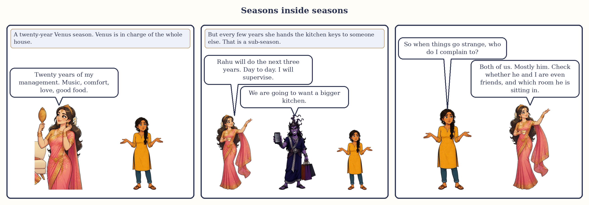
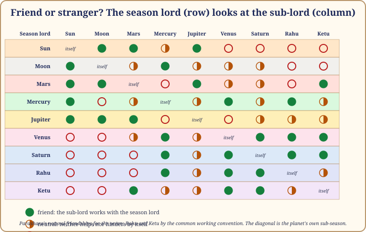
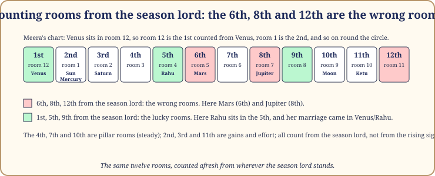
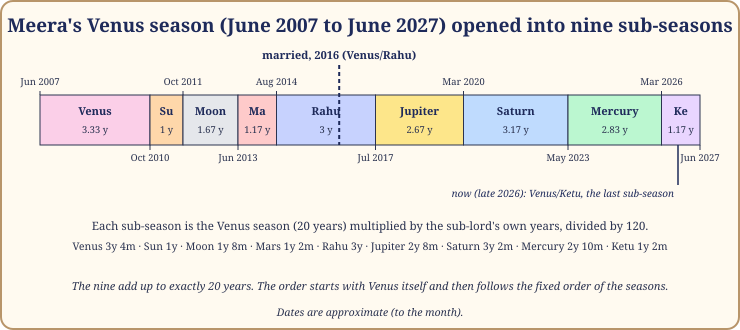

# Chapter 3: Seasons Inside Seasons

The monsoon is one season, but nobody lives through it as one thing. There is the week the first clouds come and everyone is happy. There is the fortnight when the drains fail. There is the long grey middle, the hot break in August, the last heavy burst, the clear light at the end. One season, many weathers.

A planetary season is the same. A twenty-year Venus season is not twenty identical years. It has nine stretches inside it, each with a second courtier beside the first, and the pair together is what you actually live. This chapter shows how those stretches are cut, in what order they run, how to read them off an app, and the two questions that tell you whether a stretch will feel like a help or a test. Then we open Meera's Venus season and watch her marriage arrive on time. Dates, as always, are approximate.

*Seasons inside seasons: the season lord runs the house, the sub-season lord runs the kitchen.*

## The proportional rule

Each season is divided among the nine planets again, in the same order and proportions as the big timetable. These are the **sub-seasons** (antardasha). The rule for their length is one line of arithmetic:

**Sub-season of B inside the season of A = (A's years × B's years) ÷ 120.**

Inside Venus's 20 years, the Rahu sub-season is 20 × 18 ÷ 120 = 3 years exactly. The Sun sub-season is 20 × 6 ÷ 120 = 1 year. Venus's own is 3 years 4 months. Add all nine and you get 20 years back, because the nine lords' years add to 120. Here is the full table.

| Season \ Sub | Ketu | Venus | Sun | Moon | Mars | Rahu | Jupiter | Saturn | Mercury |
|---|---|---|---|---|---|---|---|---|---|
| **Ketu** (7y) | 0y 4m 27d | 1y 2m 0d | 0y 4m 6d | 0y 7m 0d | 0y 4m 27d | 1y 0m 18d | 0y 11m 6d | 1y 1m 9d | 0y 11m 27d |
| **Venus** (20y) | 1y 2m 0d | 3y 4m 0d | 1y 0m 0d | 1y 8m 0d | 1y 2m 0d | 3y 0m 0d | 2y 8m 0d | 3y 2m 0d | 2y 10m 0d |
| **Sun** (6y) | 0y 4m 6d | 1y 0m 0d | 0y 3m 18d | 0y 6m 0d | 0y 4m 6d | 0y 10m 24d | 0y 9m 18d | 0y 11m 12d | 0y 10m 6d |
| **Moon** (10y) | 0y 7m 0d | 1y 8m 0d | 0y 6m 0d | 0y 10m 0d | 0y 7m 0d | 1y 6m 0d | 1y 4m 0d | 1y 7m 0d | 1y 5m 0d |
| **Mars** (7y) | 0y 4m 27d | 1y 2m 0d | 0y 4m 6d | 0y 7m 0d | 0y 4m 27d | 1y 0m 18d | 0y 11m 6d | 1y 1m 9d | 0y 11m 27d |
| **Rahu** (18y) | 1y 0m 18d | 3y 0m 0d | 0y 10m 24d | 1y 6m 0d | 1y 0m 18d | 2y 8m 12d | 2y 4m 24d | 2y 10m 6d | 2y 6m 18d |
| **Jupiter** (16y) | 0y 11m 6d | 2y 8m 0d | 0y 9m 18d | 1y 4m 0d | 0y 11m 6d | 2y 4m 24d | 2y 1m 18d | 2y 6m 12d | 2y 3m 6d |
| **Saturn** (19y) | 1y 1m 9d | 3y 2m 0d | 0y 11m 12d | 1y 7m 0d | 1y 1m 9d | 2y 10m 6d | 2y 6m 12d | 3y 0m 3d | 2y 8m 9d |
| **Mercury** (17y) | 0y 11m 27d | 2y 10m 0d | 0y 10m 6d | 1y 5m 0d | 0y 11m 27d | 2y 6m 18d | 2y 3m 6d | 2y 8m 9d | 2y 4m 27d |

*Table 3.1: Sub-season lengths in years, months and days. Row: season lord. Column: sub-lord.*

The table is symmetrical (Venus inside Saturn and Saturn inside Venus are both 3 years 2 months), a handy check when reading an app.

> **🔍 Why?** The system's own logic, pure arithmetic once the lengths are given. Each season is a miniature of the whole 120 years: the same nine courtiers take turns inside it, each taking the same share of it that they take of the whole. Rahu's share of any season is 18 ÷ 120, that is 15%. Everyday parallel: a school year is divided into terms, and each term has the same subjects in the same proportions as the year. Maths gets its usual share of a short term and a long one; what changes is how many weeks that share comes to.

## The order: the season's own lord goes first

Sub-seasons run in the same fixed order as the seasons, with one twist: the sequence **starts with the season's own lord**. A Venus season opens with Venus/Venus, then Venus/Sun, Venus/Moon, Venus/Mars, Venus/Rahu, Venus/Jupiter, Venus/Saturn, Venus/Mercury, and ends with Venus/Ketu. A Rahu season opens with Rahu/Rahu, then Rahu/Jupiter, and so on round to Rahu/Mars.

So the first stretch of any season is its purest taste: the same courtier holds both keys. And the last sub-season is always run by the planet who walks just ahead of the season lord in the procession; it closes the door for you.

> **📖 Story: The Minister takes the first turn.** When the Minister of Pleasure was given the keys to the household for twenty years, she invited the whole court to serve under her, one at a time. "But I go first," she said, "so that everyone sees how I like things done." For three years and four months she ran the household alone, all music and new curtains. Then the King came to help, for one year, and the house became grander and louder. Then the Queen Mother, then the Commander, each bringing their own manner into her rooms. The old Judge's turn came late and lasted over three years, and the household learned that even the Minister's house has accounts. The headless Sadhu came last and quietly took down the curtains for the King's own term. **Rule:** sub-seasons run in the fixed order, starting with the season's own lord; the first stretch of a season is its purest expression, the last already smells of the changeover.

## The small turns

Each sub-season divides once more, by the same rule and order, into nine smaller stretches (the pratyantardasha; I will call them the small turns and mention them only here). A small turn inside Venus/Rahu lasts six weeks to six months. They are useful for one thing: when two readers disagree about whether an event fits a sub-season, the small turn often settles it. Do not live at this level. A season is a chapter, a sub-season a scene; the small turns are sentences, and nobody plans a life sentence by sentence.

## How to read a dasha table from software

Open the table you found in Chapter 2. Every app shapes it the same way.

- The **top level** rows are the seasons, with start and end dates; most apps label them "MD".
- Expand a season and nine **indented** rows appear: the sub-seasons ("AD"). The first carries the season lord's own name.
- A third indentation, if shown, is the small turns ("PD"). Collapse it.
- A pair like **"Venus/Rahu"** or **"Ve-Ra"** always means season first, sub-season second: the weather of the decade, then of the year.

Find today. Note the season, the sub-season, and how long until it ends.

> **⚠️ Common mistake:** reading the sub-season as if it were the season. If an app says "Saturn" in an indented row under "Venus", you are in a Venus season with a Saturn flavour for about three years. People who read only the indented row frighten themselves nine times per season.

## The changeovers: sensitive stretches

Every line where one lord hands over to another is a **changeover** (dasha sandhi), and the months on either side are the stretches most worth watching. The changeover between two *seasons* is the big one; Chapter 15 is devoted to it. But each sub-season has its own smaller changeover, and these too are often the weeks when things happen: the job offer, the argument, the move.

> **🔍 Why?** Tradition and the system's logic together. The tradition treats the junction of two periods as unsteady, the way a turning tide makes confused water. The logic: at a changeover two courtiers are in the room at once, one packing and one unpacking, and neither fully runs the household. Everyday parallel: the fortnight when a new manager takes over your office. The old one has stopped deciding, the new one has not started, and that is when the strange emails arrive.

## The two questions for any sub-season

Nine sub-seasons per season, nine seasons: eighty-one pairs. Two questions sort almost all of them.

**Question one: is the sub-lord a friend of the season lord?** The nine planets have fixed friendships, not always mutual. Parashara gives them for the seven; for Rahu and Ketu the tradition uses a working convention (Rahu is friendly to Venus, Saturn and Mercury, hostile to the Sun, Moon and Mars; Ketu is friendly to Mars, Venus and Saturn, hostile to the Sun and Moon). Read along the season lord's row in the grid to the sub-lord's column. A friend works with the season lord; a stranger pulls against it.

*Figure 3.1: Friend or stranger? Read the season lord's row, then the sub-lord's column. Filled circle: friend. Half circle: neutral. Empty circle: stranger. A planet's own sub-season doubles whatever that planet is for you.*

**Question two: where does the sub-lord sit, counted from the season lord?** Call the season lord's room the first and count round to the sub-lord's room. If it is the **6th, 8th or 12th**, that sub-season tends to pull against the season: delays, friction, a change of direction you did not ask for. I call these the **wrong rooms**: the three hard rooms of any chart (dusthana), counted afresh from the season lord instead of from the rising sign. The 1st, 5th and 9th are the lucky rooms, where the two work together easily. The pillar rooms (4th, 7th, 10th) are steady; the 2nd, 3rd and 11th are gains and effort.

*Figure 3.2: Counting from the season lord. Meera's Venus sits in room 12, so her Mars (room 5) is 6th from it, her Jupiter (room 7) 8th, her Rahu (room 4) 5th.*

> **🔍 Why?** The system's own logic. The 6th, 8th and 12th rooms of a chart are the rooms of struggle, upheaval and loss; that much is Book 1. The season system says: for the length of a season, the season lord is the centre of the chart, so count the rooms from it. A sub-lord in the 8th from the season lord is to that season what the 8th room is to a life: where the ground shifts. Everyday parallel: in a joint family, where a visiting relative sleeps matters. Next to the kitchen, the household runs; in the store-room at the back, there is friction every day through nobody's fault.

> **📖 Story: The guest in the wrong room.** The Minister of Pleasure was running the household when the Commander's turn came to serve beside her. The two had always been civil. But his quarters lay in the sixth room from hers, past the kitchens, and every morning he marched through her music-room in boots to reach the door. Within a month the musicians had left and the Minister had a headache. "It is not that he is bad," she told the Queen Mother. "It is where he lives." When the Stranger's turn came, he lodged in the fifth room from hers, with a window onto the same garden, and they got on so well that there was a wedding. **Rule:** count the sub-lord's room from the season lord's; the 6th, 8th and 12th pull against the season, the 1st, 5th and 9th pull with it, whatever the planets' temperaments.

These two questions are a first sieve, not a verdict; Part III adds the third layer, whether the sub-lord is on your side by your rising sign and how strong it is.

## Worked: Meera's Venus season, opened

Meera's Venus season runs from June 2007 to June 2027, age 18½ to 38½. Here it is, opened into nine sub-seasons, with the two questions answered. Venus sits in her room 12 (Libra, its own sign), so we count from there.

| Sub-season | From | To | Friend of Venus? | Room from Venus | First impression |
|---|---|---|---|---|---|
| Venus/Venus | Jun 2007 | Oct 2010 | itself | 1st | 🟡 Venus doubled |
| Venus/Sun | Oct 2010 | Oct 2011 | 🔴 stranger | 2nd 🟢 | 🟡 mixed |
| Venus/Moon | Oct 2011 | Jun 2013 | 🔴 stranger | 10th 🟢 | 🟡 mixed |
| Venus/Mars | Jun 2013 | Aug 2014 | 🟡 neutral | 6th 🔴 | 🔴 pulls against |
| Venus/Rahu | Aug 2014 | Jul 2017 | 🟢 friend | 5th 🟢 | 🟢 works with |
| Venus/Jupiter | Jul 2017 | Mar 2020 | 🟡 neutral | 8th 🔴 | 🔴 pulls against |
| Venus/Saturn | Mar 2020 | May 2023 | 🟢 friend | 3rd 🟢 | 🟢 works with |
| Venus/Mercury | May 2023 | Mar 2026 | 🟢 friend | 2nd 🟢 | 🟢 works with |
| Venus/Ketu | Mar 2026 | May 2027 | 🟢 friend | 11th 🟢 | 🟢 closes the door |

*Table 3.3: Meera's Venus sub-seasons with the two questions.*

*Figure 3.3: Meera's Venus season as a timeline. The marriage falls inside Venus/Rahu; late 2026 sits in Venus/Ketu, the last sub-season.*

Now the row that matters most. **Venus/Rahu, August 2014 to July 2017.** Rahu is a friend of Venus. Rahu sits in Meera's room 4, the 5th counted from Venus in room 12: a lucky room. Both questions say "works with". And Venus, for a Scorpio rising sign, owns room 7, the room of marriage, as well as room 12. A marriage-owning season lord, in a sub-season run by a friendly planet in a lucky room from it: if you had to pick three years out of twenty for Meera's wedding, you would pick these. She married in 2016, in the middle of them. A season map cannot tell you the day; it can tell you which three years out of twenty to look at.

Two honest footnotes. Venus/Mars and Venus/Jupiter both land in wrong rooms, and Chapter 5 shows they were restless stretches, though Jupiter is strongly on her side, which softened it. And Venus/Saturn passes both quick tests, yet Chapter 5 treats 2020 to 2023 as her testing stretch, because Saturn mildly tests her by rising sign and is outshone by the Sun in her chart. The two questions are the first sieve; the chart is the second.

> **🧭 Anushka's rule of thumb:** say the pair out loud with "in" between: "Rahu in Venus's household." The host sets the menu; the guest sets the mood.

> **🪔 If you read for others:** when someone asks "what is coming?", point to the sub-season rows, not the season row. Three years is a length a person can plan around. Twenty is a wall.

## In one breath

- Every season divides into nine sub-seasons by one rule: (season lord's years × sub-lord's years) ÷ 120; the nine add back to the season's length.
- Sub-seasons run in the fixed order, starting with the season's own lord; the first stretch is the purest taste of a season, the last already belongs to the changeover.
- Each sub-season divides again into nine small turns; use them to settle a dispute, never to live by.
- In any app, the outer row is the season (MD), the indented row the sub-season (AD); Venus/Rahu is always season first, sub-season second.
- The junction between any two lords is a changeover and a sensitive stretch.
- Two questions sort most sub-seasons: is the sub-lord a friend of the season lord, and does it sit in the 6th, 8th or 12th room counted from the season lord?
- Meera's marriage came in Venus/Rahu (August 2014 to July 2017): friend, lucky room, marriage-owning season lord. All dates approximate.

## Try this

> **✍️ Try this:**
>
> 1. How long is the Jupiter sub-season inside a Rahu season? Work it out from the rule, then check Table 3.1.
> 2. Arjun's Rahu season runs December 2013 to December 2031. Which sub-season runs in late 2026? (Starts: Rahu/Ketu Jun 2024, Rahu/Venus Jul 2025, Rahu/Sun Jul 2028.)
> 3. In Arjun's chart Rahu sits in room 4 and Venus in room 7. Counting from Rahu, which room is Venus in, and is Venus a friend of Rahu? What is your first impression?
> 4. Open your own table, find your current sub-season, and answer the two questions. Then write one sentence about what this stretch has actually felt like. Do they agree?

Answers

1. 18 × 16 ÷ 120 = 2.4 years = 2 years 4 months 24 days, as in Table 3.1.
2. Rahu/Venus, from July 2025 to July 2028.
3. Room 4 is the 1st from Rahu, room 7 the 4th: a pillar room, steady. Rahu counts Venus a friend. First impression: works with the season (Chapter 9 adds the chart's view, since Venus tests Arjun by rising sign).
4. Your own answers. If they disagree, Part III usually explains why.

