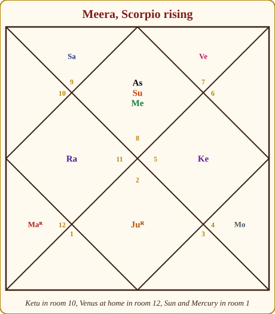
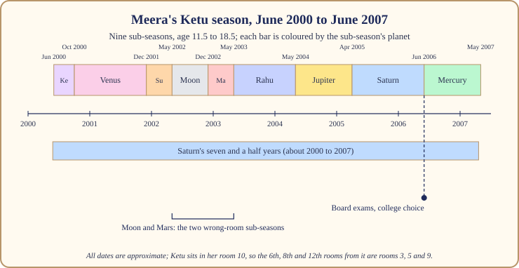

# Chapter 4: The Ketu Season (7 Years): The Art of Letting Go

There is a moment in every Indian wedding that nobody photographs. The band has packed up, the last relatives have been seen off at the gate, the hall is full of folding chairs and marigold petals, and someone has to stay behind to count the steel plates. The lights are harsh. The silence is enormous. That moment is what a Ketu season feels like from the inside, and it is why so many people tell me, halfway through one, that "nothing is happening in my life".

Something is happening. It is just not the kind of thing that photographs well.

Ketu's season is the shortest of the nine but one, seven years in all. In the royal court, Ketu is the headless Sadhu, the renouncer at the gate who wants nothing. When he runs the household, the household learns to want less. Possessions, titles, friendships and plans that were never truly yours tend to fall away, often without any drama at all. You simply stop reaching for them. What is left at the end of seven years is lighter, and it is more honestly you.

This chapter walks through what the season asks, how it feels, where its sharp corners are, and how one of our three case lives, Meera, lived through hers between the ages of eleven and a half and eighteen and a half. All dates in this chapter are approximate; a dasha table in any free app will show a month or two of difference depending on the settings.

## The headless Sadhu runs the household

> **📖 Story: The Sadhu takes the keys.** When it was Ketu's turn to run the palace, the courtiers panicked. The Minister of Pleasure asked who would arrange the feasts. The Commander asked who would plan the campaigns. The clever Prince asked who would keep the accounts. The Sadhu said nothing, because he had no head to speak with, and simply walked through the palace opening windows. Within a year the storerooms were half empty, the guest list was short, and the King's youngest daughter had taken to sitting in the courtyard reading old manuscripts nobody had opened in decades. "Nothing is being done," the courtiers complained. The Queen Mother, who had been watching, disagreed. "Everything that did not matter is being put down," she said, "so that our hands are free when the Minister of Pleasure returns." **Rule:** Ketu's season does not build; it clears. Judge it by what you have put down, not by what you have picked up.

What the season asks of you is one thing, repeated in different rooms of your life: let go of what is finished. The task can arrive gently (a hobby you no longer enjoy, a friend group that drifts) or sharply (a job that ends, a plan that dissolves), but the invitation is the same. Ketu also brings a pull towards the inner life: solitude, research, spiritual practice, questions about meaning. People in Ketu seasons often take up meditation, go deep into one narrow subject, or simply spend more time alone than they ever have.

> **🔍 Why?** This comes from astronomy and from the tradition's reading of it. Rahu and Ketu are not bodies in the sky. They are the two points where the Moon's path crosses the Sun's, which is why eclipses happen only near them. In the old story the demon who stole the nectar of immortality was cut in two: Rahu kept the head, forever hungry, and Ketu kept the body, which cannot eat, cannot speak and cannot want. Tradition took the south crossing-point and gave it that body. So Ketu is the planet of what is done with wanting. Everyday parallel: an old uncle who has retired, given away his good shirts, and now sits on the verandah perfectly content while the rest of the house runs around. He is not idle; he has finished.

## How it feels

**Body.** Ketu seasons often bring puzzling, hard-to-name complaints rather than clear ones: tiredness without cause, odd aches, a sensitivity to noise and crowds. This is a season to take rest seriously and to see a doctor early about anything that lingers rather than hoping it will pass.

**Mind.** Detached, sometimes to the point of feeling numb. Many people describe watching their own life "from a little distance". Concentration on one deep subject becomes easy; concentration on small talk becomes nearly impossible. Intuition sharpens.

**Home.** The house empties in some way. A sibling leaves for college, a grandparent's room becomes a store room, or you yourself move somewhere quieter. Family WhatsApp groups go unanswered for days.

**Love.** Ketu does not oppose love, but it removes the hunger from it. Relationships built on need tend to end; relationships built on companionship deepen quietly. Single people in a Ketu season frequently say they "cannot be bothered", and they are telling the truth.

**Work.** Visibility drops. You may be moved sideways, step back from a leading role, or find that the ladder you were climbing no longer interests you. Research, archives, laboratories, back-end work and anything requiring solitary depth go well.

**Money.** Flat. Not usually a season of loss, but not one of growth either. Expenses shrink because wants shrink. People often finish a Ketu season with less stuff and fewer debts than they began with.

## The arc: first year, middle, last year

**The first year** (Ketu's own sub-season, under five months, then Venus's) is the strangest. The previous season's energy is still in the room, and Ketu is opening windows. Things end abruptly. People often mistake this for bad luck. It is clearing.

**The middle years** settle into the Sadhu's rhythm. Life becomes smaller and deeper. This is when the research gets done, the practice takes root, the real friends are counted. It can be lonely. It is also, for many people, the first time in their adult life they have heard their own thoughts.

**The last year** belongs to Mercury's sub-season, and the clever Prince begins to chatter again. Curiosity returns, plans return, and the changeover towards Venus's twenty-year season starts to glimmer. People feel like themselves again, but a lighter version. The art is not to grab the first bright thing that passes.

## When Ketu is on your side and when it tests you

Ketu owns no sign, so the usual question ("which rooms does this planet own for my rising sign?") has no direct answer. The common rule, and the one I follow, is that **Ketu takes the colour of the lord of the sign it sits in, and of any planet it sits with**. If Ketu sits in Leo, the Sun's sign, it behaves as the Sun behaves for your rising sign. If it sits next to Jupiter, it borrows Jupiter's manners.

> **🔍 Why?** This is the system's own logic rather than a rule from Parashara, who says little about the shadow planets. A planet with no home of its own has nothing to express except its landlord's intentions. Everyday parallel: a tenant in a joint family's spare room is judged by the family he lives with. A quiet tenant in a kind household is a blessing; the same tenant in a quarrelling one becomes part of the quarrel.

So the table below reads: for your rising sign, Ketu is on your side when it sits in these signs and tests you in those. (Find Ketu's sign in your chart from any app; it is marked Ke.)

| Rising sign | 🟢 Ketu is on your side in | 🔴 Ketu tests you in | 🟡 Mixed in |
|---|---|---|---|
| Aries | Leo, Aries, Scorpio, Sagittarius, Pisces | Gemini, Virgo, Taurus, Libra, Capricorn, Aquarius | Cancer |
| Taurus | Capricorn, Aquarius, Leo, Gemini, Virgo | Cancer, Sagittarius, Pisces, Aries, Scorpio | Taurus, Libra |
| Gemini | Taurus, Libra, Capricorn, Aquarius, Gemini, Virgo | Aries, Scorpio, Sagittarius, Pisces, Leo | Cancer |
| Cancer | Aries, Scorpio, Sagittarius, Pisces, Cancer | Taurus, Libra, Gemini, Virgo | Leo, Capricorn, Aquarius |
| Leo | Aries, Scorpio, Sagittarius, Pisces, Leo | Gemini, Virgo, Taurus, Libra, Capricorn, Aquarius | Cancer |
| Virgo | Taurus, Libra, Gemini, Virgo | Aries, Scorpio, Sagittarius, Pisces, Cancer | Leo, Capricorn, Aquarius |
| Libra | Capricorn, Aquarius, Gemini, Virgo, Taurus, Libra | Sagittarius, Pisces, Leo, Aries, Scorpio | Cancer |
| Scorpio | Sagittarius, Pisces, Cancer, Leo, Aries, Scorpio | Gemini, Virgo, Taurus, Libra, Capricorn, Aquarius | (none) |
| Sagittarius | Leo, Aries, Scorpio, Sagittarius, Pisces | Taurus, Libra, Capricorn, Aquarius | Gemini, Virgo, Cancer |
| Capricorn | Taurus, Libra, Gemini, Virgo, Capricorn, Aquarius | Aries, Scorpio, Sagittarius, Pisces, Cancer | Leo |
| Aquarius | Taurus, Libra, Capricorn, Aquarius | Sagittarius, Pisces, Cancer, Aries, Scorpio | Gemini, Virgo, Leo |
| Pisces | Aries, Scorpio, Cancer, Sagittarius, Pisces | Capricorn, Aquarius, Taurus, Libra, Leo, Gemini, Virgo | (none) |

Even when Ketu is "on your side", remember what he is. A friendly Ketu season still clears. It just clears the right things, and leaves you with a sense of relief rather than loss.

## The room Ketu sits in changes the story

| Room | What the seven years tend to clear and deepen |
|---|---|
| 1 | You stop performing yourself; a quieter, odder, more honest person comes forward. |
| 2 | Family ties loosen, speech grows sparse, savings stay flat but wants shrink to match. |
| 3 | Effort for its own sake feels empty until one pursuit proves worth it; a sibling's path diverges from yours. |
| 4 | The home empties or changes; inner peace is found after the furniture is gone; mother may need care. |
| 5 | Studies turn inward and specialised; romance goes cool; children teach patience. |
| 6 | Old quarrels and debts quietly end; a good season for healing work and daily service. |
| 7 | Partnerships are tested by distance or silence; two people learn to be alone together. |
| 8 | The natural research room: deep study, hidden matters, a slow inner transformation. |
| 9 | Faith is questioned and rebuilt; a teacher is found, or outgrown; journeys to quiet places. |
| 10 | You step off the stage; work moves behind the scenes; the career path dissolves and re-forms. |
| 11 | The friends circle shrinks to the few who matter; income is steady, wishes change. |
| 12 | The Sadhu in his own room: retreats, far places, dreams, sleep; the most natural seat for him. |

## The sub-seasons that matter most

Chapter 3 gave you the two questions for any sub-season: is the sub-season's planet a friend of the season's planet, and where does it sit counted from the season's planet? If it sits in the 6th, 8th or 12th room counted from Ketu, it is working from the wrong room, and even a helpful planet delivers its help awkwardly, late, or through a loss.

> **🔍 Why?** This is the system's own logic, following Parashara's rule for judging sub-seasons. The three hard rooms of any chart are the 6th, 8th and 12th (struggle, hidden upheaval, loss). When you count them from the season's planet instead of from the rising sign, you are asking: from where the season lord stands, is this sub-lord in a place of struggle, upheaval or loss? Everyday parallel: a good colleague who sits in a different building. The help is real, but it arrives by email, a day late, and never quite when you needed it.

**Ketu/Ketu** (the first five months). The windows open. Expect at least one sudden ending and do not fight it.

**Ketu/Venus** (fourteen months). The Minister of Pleasure visits the Sadhu, and the two are friends. Comfort, affection and a little beauty come back into a bare life. If Venus is on your side, this is the sweet spot of the season; if Venus tests you, it brings a tempting attachment that the season will later ask you to release.

> **📖 Story: The Sadhu and the Minister of Pleasure.** The Minister of Pleasure arrived at the Sadhu's bare courtyard with musicians and a tray of sweets. The Sadhu, having no mouth, could not eat them, but he did not send her away. He let her hang one lamp, plant one jasmine bush, and sit with him in the evenings. When she left fourteen months later she took the musicians but left the jasmine. **Rule:** Venus inside Ketu brings a small, real comfort. Keep the jasmine; do not try to keep the band.

**Ketu/Rahu** (a year and eighteen days). The two halves of the severed demon face each other, always exactly opposite in the sky. This is the restless stretch: a sudden craving, a new technology or obsession, travel, confusion about what you want. Rahu is always the 7th room from Ketu, never the 6th, 8th or 12th, so it is not a "wrong room" sub-season, but it is a loud one.

> **📖 Story: The two strangers face each other.** Once a year the Sadhu and the smoke-headed Stranger must share a corridor. The Stranger talks all night about distant cities and new machines; the Sadhu cannot answer, and cannot leave. By morning the Stranger has sold him a telescope he will never use. **Rule:** In Ketu/Rahu, sleep on every purchase and every plan for a month. The hunger is borrowed and will pass.

**Ketu/Saturn** (thirteen months). The old Judge of Labour comes to audit a house that owns almost nothing. By convention Saturn and Ketu are friendly, so the audit is fair, but it is slow and heavy. Work, duty and a sense of being tested by time. Where Saturn sits in the 6th, 8th or 12th from Ketu, this is the stretch that asks for the most patience in the whole season.

**Ketu/Mercury** (the closing year). The Prince chatters, plans and studies. If Mercury is on your side, the season ends in a clear decision; if Mercury tests you, it ends in a crowd of options and a little anxiety. Either way, this is the bridge to Venus.

## Two more lives in the Ketu years

A friend of mine, a software engineer, entered her Ketu season at thirty-four with Ketu in her 10th room. Within a year she had left a management role she had fought for, moved to a smaller firm, and taken up the long-abandoned research problem she had loved at university. Her family thought she had lost her ambition. By the end of the seven years she had published, quietly, more than her old department had in a decade, and she said the sentence I hear most often from Ketu people: "I did not lose anything. I put it down."

Another, a man with Ketu in his 4th room, spent his Ketu season between two cities after his parents' flat was sold. He described those years as "camping in my own life". What he found, around the middle years, was a daily morning practice that has stayed with him long after the furniture came back.

## What to do and what not to do

> **🧭 Anushka's rule of thumb:** In a Ketu season, ask of every attachment, "Is this finished?" If the honest answer is yes, let the season take it. If the answer is no, hold it gently and expect the season to test the grip.

**Do** keep one steady daily practice: a walk, a prayer, a page of writing, ten minutes of sitting quietly. Ketu rewards depth and routine more than any other planet except Saturn. **Do** take up the deep subject that keeps calling. **Do** rest properly and take any lingering complaint to a doctor early. **Do** serve someone quietly; feeding and caring for animals and the elderly are traditional Ketu practices, and they work because they teach the hands to give without expecting.

**Do not** start large, public, shiny ventures expecting the season to feed them; wait for Venus. **Do not** buy a stone because a stranger frightened you about Ketu. **Do not** mistake detachment for depression; but if the numbness comes with sleeplessness, hopelessness or no interest in anything at all, that is a medical matter, not a planetary one, and you should see a doctor.

> **⚠️ Common mistake:** Reading "nothing happened in my Ketu years" as the season failing. Look again at what ended, what you stopped wanting, and what you learned to do alone. That is the record of a Ketu season, and it is usually long.

## Meera's Ketu season: June 2000 to June 2007

Meera, our Chart A, was born in Jaipur in December 1988 with Scorpio rising. Her Ketu sits at 16° Leo in her 10th room, the room of career, visibility and standing in the world. Leo is the Sun's sign, and the Sun is a planet on her side for Scorpio rising, so her Ketu borrows a friendly colour. Her Ketu season ran from around June 2000, when she was eleven and a half, to around June 2007, when she was eighteen and a half: the whole of her secondary schooling.

*Figure 4.1: Meera's chart. Ketu (Ke) sits in room 10, the career and visibility room, in Leo, the Sun's sign. Her Moon is in Cancer in room 9.*

Two things coloured these years at once. The first is Ketu in the 10th room: this was a girl who stepped back from the stage. Her mother remembers her refusing the annual-day play she had been offered, preferring the library. The second is that Saturn's seven and a half years (Saturn passing over the sign before her Moon, then her Moon's sign of Cancer, then the sign after) overlapped the whole Ketu season, from around 2000 to around 2007. So the Sadhu's quiet was weighted down by the Judge's seriousness. She was, by her own account, an old child.

*Figure 4.2: Meera's Ketu season, around June 2000 to June 2007, with Saturn's seven and a half years running underneath it the whole way.*

Now the wrong-room count. From Ketu in room 10, the 6th room is her room 3, the 8th is her room 5, and the 12th is her room 9. Her Mars sits in room 5 and her Moon in room 9. So **Ketu/Moon (around May to December 2002) and Ketu/Mars (around December 2002 to May 2003)** were her two wrong-room sub-seasons, even though both planets are on her side. She was thirteen and a half to fourteen and a half: a year in which home felt far away (the Moon, from the 12th room counted from Ketu) and energy came in bursts she did not know what to do with (Mars, from the 8th). She changed schools in this stretch. The help those planets carry was real, but it arrived late and sideways, exactly as the rule says.

**Ketu/Rahu (around May 2003 to May 2004)** brought the first computer into the house (Rahu in her 4th room, the home, in Aquarius, Saturn's sign of machines and systems), and with it the restless curiosity of the two strangers facing each other. **Ketu/Jupiter (around May 2004 to April 2005)** was gentler: Jupiter is on her side and sits in room 7, the 10th room counted from Ketu, and this was the year a teacher noticed her and her Class 10 results surprised everyone but the teacher. **Ketu/Saturn (around April 2005 to June 2006)** was the hard, heavy year of Class 11, a demanding stream chosen under family pressure (Saturn in her 2nd room, the family room, outshone by the Sun). And **Ketu/Mercury (around June 2006 to May 2007)**, the closing year, was board exams and entrance season, with Mercury in her 1st room chattering about options. The changeover to Venus around June 2007 took her out of Jaipur to college, which is where the next chapter begins.

What did seven years of Ketu give her? A habit of solitude she has never lost, a comfort with libraries and silence, and a very short list of real friends. Nothing happened, her relatives would say. Everything that mattered later was planted.

## In one breath

- Ketu, the headless Sadhu, runs a seven-year season whose task is letting go of what is finished; it clears rather than builds.
- It feels detached, quiet and inward: visibility drops, wants shrink, depth and solitude come easily.
- The first year ends things abruptly, the middle years deepen, the last year (Mercury's sub-season) brings curiosity back.
- Ketu owns no sign, so it takes the colour of the lord of its sign and of any planet it sits with; use the 12-row table to see whether it is on your side.
- The room Ketu sits in says which part of life is cleared; the 12th and 8th rooms suit him best, the 10th and 7th feel it most.
- A sub-season's planet sitting in the 6th, 8th or 12th room counted from Ketu works from the wrong room, delivering its results late or through a loss.
- Meera's Ketu season (around June 2000 to June 2007) was her whole secondary schooling, weighted by Saturn's seven and a half years, and planted the habits her later life grew from.

## Try this

1. Open your season map in a free app and find your Ketu season, past or future. Write down its start and end years and your ages at each.
2. Find Ketu's sign in your chart and look it up in the rising-sign table. Is Ketu on your side, testing you, or mixed? Does the room it sits in match any period of your life when you "put something down"?
3. If you have lived through a Ketu season, list three things that ended in it and three things that began quietly. Which list is longer? Which mattered more?
4. Count the 6th, 8th and 12th rooms from your Ketu's room. Which planets sit there? Those are your wrong-room sub-seasons inside Ketu; mark them on your map.
5. Choose one small daily practice you could keep for a month. Start it this week, whatever season you are in; Ketu will eventually come, and you will be glad of the habit.
