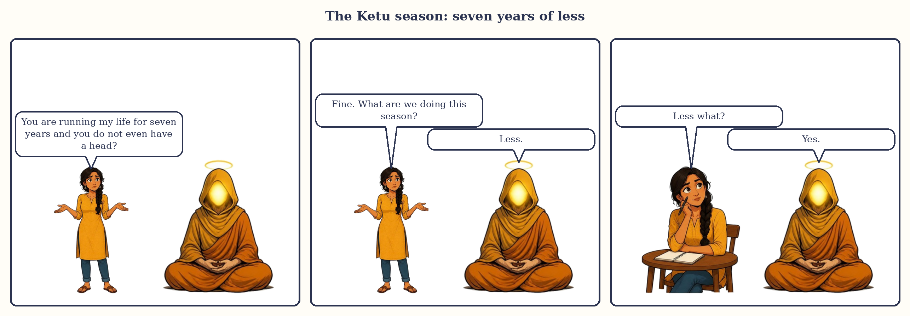

# Chapter 4: The Ketu Season (7 Years): The Art of Letting Go

There is a moment in every Indian wedding that nobody photographs. The band has packed up, the last relatives have been seen off, the hall is full of folding chairs and marigold petals, and someone has to stay behind to count the steel plates. That moment is what a Ketu season feels like from the inside, and it is why so many people tell me, halfway through one, that "nothing is happening in my life".

*The Ketu season in three panels.*

Something is happening. It is just not the kind of thing that photographs well.

Ketu's season lasts seven years. In the royal court, Ketu is the headless Sadhu, the renouncer at the gate who wants nothing. When he runs the household, the household learns to want less. Possessions, titles, friendships and plans that were never truly yours fall away, often without drama. What is left is lighter, and more honestly you. All dates in this chapter are approximate; a free app may show a month or two of difference.

## The headless Sadhu runs the household

> **📖 Story: The Sadhu takes the keys.** When it was Ketu's turn to run the palace, the courtiers panicked. Who would arrange the feasts, plan the campaigns, keep the accounts? The Sadhu said nothing, having no head to speak with, and simply walked through the palace opening windows. Within a year the storerooms were half empty, the guest list short, and the King's youngest daughter sat in the courtyard reading manuscripts nobody had opened in decades. "Nothing is being done," the courtiers complained. The Queen Mother disagreed. "Everything that did not matter is being put down," she said, "so that our hands are free when the Minister of Pleasure returns." **Rule:** Ketu's season does not build; it clears. Judge it by what you have put down, not by what you have picked up.

What the season asks is one thing, repeated in different rooms of your life: let go of what is finished. The task can arrive gently (a hobby you no longer enjoy) or sharply (a job that ends). Ketu also pulls you inward: solitude, research, spiritual practice, meaning. People in Ketu seasons take up meditation, go deep into one subject, or simply spend more time alone than ever.

> **🔍 Why?** Astronomy first, then tradition. Rahu and Ketu are not bodies in the sky but the two points where the Moon's path crosses the Sun's, which is why eclipses happen only near them. In the old story the demon who stole the nectar of immortality was cut in two: Rahu kept the head, forever hungry, and Ketu kept the body, which cannot eat, speak or want. Tradition gave the south crossing-point that body, so Ketu is the planet of what is done with wanting. Everyday parallel: a retired uncle who has given away his good shirts and sits on the verandah content while the house runs around him. He is not idle; he has finished.

## How it feels

**Body.** Puzzling, hard-to-name complaints: tiredness without cause, sensitivity to noise and crowds. See a doctor early about anything that lingers.

**Mind.** Detached, sometimes to the point of numbness; people describe watching their own life "from a little distance". Deep concentration becomes easy, small talk nearly impossible. Intuition sharpens.

**Home.** The house empties in some way: a sibling leaves for college, a grandparent's room becomes a store room. The family WhatsApp group goes unanswered for days.

**Love.** Ketu removes the hunger from love. Relationships built on need tend to end; those built on companionship deepen quietly.

**Work.** Visibility drops. You step back from a leading role, or the ladder you were climbing stops interesting you. Research, archives and solitary depth go well.

**Money.** Flat: rarely loss, rarely growth. Expenses shrink because wants shrink.

## The arc: first year, middle, last year

**The first year** (Ketu's own sub-season, under five months, then Venus's) is the strangest. The previous season's energy is still in the room and Ketu is opening windows. Things end abruptly. People mistake this for bad luck. It is clearing.

**The middle years** settle into the Sadhu's rhythm. Life becomes smaller and deeper. The research gets done, the practice takes root, the real friends are counted. It can be lonely. It is also, for many, the first time they hear their own thoughts.

**The last year** is Mercury's sub-season, and the clever Prince chatters again. Curiosity and plans return and Venus's twenty-year season starts to glimmer. Do not grab the first bright thing that passes.

## When Ketu is on your side and when it tests you

Ketu owns no sign, so the usual question ("which rooms does this planet own?") has no direct answer. The common rule, and the one I follow, is that **Ketu takes the colour of the lord of the sign it sits in, and of any planet it sits with**. Ketu in Leo behaves as the Sun does for your rising sign; Ketu beside Jupiter borrows Jupiter's manners.

> **🔍 Why?** This is the system's own logic rather than a rule from Parashara, who says little about the shadow planets. A planet with no home of its own has nothing to express but its landlord's intentions. Everyday parallel: a tenant in a joint family's spare room is judged by the family he lives with; in a kind household he is a blessing, in a quarrelling one he joins the quarrel.

So the table reads: for your rising sign, Ketu is on your side in these signs and tests you in those.

| Rising sign | 🟢 On your side in | 🔴 Tests you in | 🟡 Mixed in |
|---|---|---|---|
| Aries | Leo, Aries, Scorpio, Sagittarius, Pisces | Gemini, Virgo, Taurus, Libra, Capricorn, Aquarius | Cancer |
| Taurus | Capricorn, Aquarius, Leo, Gemini, Virgo | Cancer, Sagittarius, Pisces, Aries, Scorpio | Taurus, Libra |
| Gemini | Taurus, Libra, Capricorn, Aquarius, Gemini, Virgo | Aries, Scorpio, Sagittarius, Pisces, Leo | Cancer |
| Cancer | Aries, Scorpio, Sagittarius, Pisces, Cancer | Taurus, Libra, Gemini, Virgo | Leo, Capricorn, Aquarius |
| Leo | Aries, Scorpio, Sagittarius, Pisces, Leo | Gemini, Virgo, Taurus, Libra, Capricorn, Aquarius | Cancer |
| Virgo | Taurus, Libra, Gemini, Virgo | Aries, Scorpio, Sagittarius, Pisces, Cancer | Leo, Capricorn, Aquarius |
| Libra | Capricorn, Aquarius, Gemini, Virgo, Taurus, Libra | Sagittarius, Pisces, Leo, Aries, Scorpio | Cancer |
| Scorpio | Sagittarius, Pisces, Cancer, Leo, Aries, Scorpio | Gemini, Virgo, Taurus, Libra, Capricorn, Aquarius | (none) |
| Sagittarius | Leo, Aries, Scorpio, Sagittarius, Pisces | Taurus, Libra, Capricorn, Aquarius | Gemini, Virgo, Cancer |
| Capricorn | Taurus, Libra, Gemini, Virgo, Capricorn, Aquarius | Aries, Scorpio, Sagittarius, Pisces, Cancer | Leo |
| Aquarius | Taurus, Libra, Capricorn, Aquarius | Sagittarius, Pisces, Cancer, Aries, Scorpio | Gemini, Virgo, Leo |
| Pisces | Aries, Scorpio, Cancer, Sagittarius, Pisces | Capricorn, Aquarius, Taurus, Libra, Leo, Gemini, Virgo | (none) |

Even a friendly Ketu season clears. It just clears the right things, leaving relief rather than loss.

## The room Ketu sits in changes the story

| Room | What the seven years tend to clear and deepen |
|---|---|
| 1 | You stop performing yourself; a quieter, odder, more honest person comes forward. |
| 2 | Family ties loosen, speech grows sparse, savings stay flat but wants shrink to match. |
| 3 | Effort for its own sake feels empty until one pursuit proves worth it. |
| 4 | The home empties or changes; peace is found after the furniture goes; mother may need care. |
| 5 | Studies turn inward and specialised; romance goes cool; children teach patience. |
| 6 | Old quarrels and debts quietly end; good for healing work and daily service. |
| 7 | Partnerships are tested by distance or silence; two people learn to be alone together. |
| 8 | The natural research room: deep study, hidden matters, slow inner transformation. |
| 9 | Faith is questioned and rebuilt; a teacher is found, or outgrown. |
| 10 | You step off the stage; work moves behind the scenes; the career path dissolves and re-forms. |
| 11 | The friends circle shrinks to the few who matter; income steady, wishes change. |
| 12 | The Sadhu in his own room: retreats, far places, dreams; the most natural seat for him. |

## The sub-seasons that matter most

Chapter 3 gave you two questions for any sub-season: is its planet a friend of the season's planet, and where does it sit counted from it? In the 6th, 8th or 12th room from Ketu it works from the wrong room, and even a helpful planet delivers late, sideways, or through a loss.

> **🔍 Why?** The system's own logic, following Parashara's rule for judging sub-seasons. The three hard rooms of any chart are the 6th, 8th and 12th (struggle, upheaval, loss). Counting them from the season's planet asks: from where the season lord stands, is this sub-lord in a place of struggle, upheaval or loss? Everyday parallel: a good colleague in another building. The help is real, but it arrives by email, a day late.

**Ketu/Venus** (fourteen months). The Minister of Pleasure visits the Sadhu, and they are friends. Comfort, affection and a little beauty return. If Venus is on your side, this is the sweet spot of the season; if Venus tests you, it brings a tempting attachment the season will later ask you to release.

> **📖 Story: The Sadhu and the Minister of Pleasure.** The Minister of Pleasure arrived at the Sadhu's bare courtyard with musicians and sweets. He could not eat them, having no mouth, but he did not send her away. He let her hang one lamp, plant one jasmine bush, and sit with him in the evenings. When she left she took the musicians but left the jasmine. **Rule:** Venus inside Ketu brings a small, real comfort. Keep the jasmine; do not try to keep the band.

**Ketu/Rahu** (a year and eighteen days). The two halves of the severed demon face each other, always exactly opposite in the sky. The restless stretch: a sudden craving, a new gadget, confusion about what you want. Rahu is always the 7th room from Ketu, never a wrong room, but a loud one.

> **📖 Story: The two strangers face each other.** Once a year the Sadhu and the smoke-headed Stranger must share a corridor. The Stranger talks all night about distant cities and new machines; the Sadhu cannot answer, and cannot leave. By morning the Stranger has sold him a telescope. **Rule:** In Ketu/Rahu, sleep on every purchase and every plan for a month. The hunger is borrowed and will pass.

**Ketu/Saturn** (thirteen months). The old Judge audits a house that owns almost nothing. Saturn and Ketu are friendly by convention, so the audit is fair, but slow and heavy: duty, work, the feeling of being tested by time.

**Ketu/Mercury** (the closing year). The Prince chatters, plans and studies. On your side, Mercury ends the season in a clear decision; testing you, in a crowd of options. Either way, it is the bridge to Venus.

## What to do and what not to do

> **🧭 Anushka's rule of thumb:** In a Ketu season, ask of every attachment, "Is this finished?" If the honest answer is yes, let the season take it. If no, hold it gently and expect the season to test the grip.

**Do** keep one steady daily practice: a walk, a prayer, a page of writing, ten minutes of sitting quietly. **Do** take up the deep subject that keeps calling. **Do** serve someone quietly; feeding animals and caring for the elderly are traditional Ketu practices, and they work because they teach the hands to give without expecting.

**Do not** start large, shiny ventures expecting the season to feed them; wait for Venus. **Do not** buy a stone because a stranger frightened you about Ketu. **Do not** confuse detachment with depression; if the numbness comes with sleeplessness, hopelessness or no interest in anything at all, that is a medical matter, not a planetary one. See a doctor.

> **⚠️ Common mistake:** Reading "nothing happened in my Ketu years" as the season failing. Look again at what ended, what you stopped wanting, and what you learned to do alone. That record is usually long.

## Meera's Ketu season: June 2000 to June 2007

Meera, our Chart A, was born in Jaipur in December 1988 with Scorpio rising. Her Ketu sits at 16° Leo in her 10th room, the room of career, visibility and standing. Leo is the Sun's sign, and the Sun is on her side for Scorpio rising, so her Ketu borrows a friendly colour. Her Ketu season ran from around June 2000 (age eleven and a half) to around June 2007 (eighteen and a half): the whole of her secondary schooling.

*Figure 4.1: Meera's chart. Ketu (Ke) sits in room 10, the career room, in Leo, the Sun's sign. Her Moon is in Cancer in room 9.*

Two things coloured these years. The first is Ketu in the 10th room: this was a girl who stepped back from the stage, refusing the annual-day play for the library. The second is that Saturn's seven and a half years (Saturn passing over the sign before her Moon, her Moon's sign of Cancer, and the sign after) overlapped the whole Ketu season, around 2000 to 2007. The Sadhu's quiet was weighted by the Judge's seriousness; she was, by her own account, an old child.

*Figure 4.2: Meera's Ketu season, around June 2000 to June 2007, with Saturn's seven and a half years running underneath it the whole way.*

Now the wrong-room count. From Ketu in room 10, the 6th, 8th and 12th rooms are her rooms 3, 5 and 9. Her Mars sits in room 5 and her Moon in room 9. So **Ketu/Moon (around May to December 2002) and Ketu/Mars (around December 2002 to May 2003)** were her two wrong-room sub-seasons, even though both planets are on her side. She was thirteen and a half to fourteen and a half: a year in which home felt far away (the Moon, from the 12th counted from Ketu) and energy came in bursts she did not know what to do with (Mars, from the 8th). The help those planets carry was real, but it arrived late and sideways, exactly as the rule says.

**Ketu/Rahu (around May 2003 to May 2004)** brought the first computer into the house (Rahu in her 4th room, the home, in Aquarius, Saturn's sign of machines) and the restless curiosity of the two strangers facing each other. **Ketu/Jupiter (around May 2004 to April 2005)** was gentler: Jupiter is on her side and sits in room 7, the 10th counted from Ketu, and this was the year a teacher noticed her and her Class 10 results surprised everyone but him. **Ketu/Saturn (around April 2005 to June 2006)** was the heavy year of Class 11, a demanding stream chosen under family pressure (Saturn in her 2nd room, the family room, outshone by the Sun). **Ketu/Mercury (around June 2006 to May 2007)**, the closing year, was board exams and entrance season, Mercury in her 1st room chattering about options. The changeover to Venus around June 2007 took her out of Jaipur to college, where the next chapter begins.

What did seven years of Ketu give her? A habit of solitude, a comfort with silence, and a very short list of real friends. Nothing happened, her relatives would say. Everything that mattered later was planted.

## In one breath

- Ketu, the headless Sadhu, runs a seven-year season whose task is letting go of what is finished; it clears rather than builds.
- It feels detached, quiet and inward: visibility drops, wants shrink, depth and solitude come easily.
- The first year ends things abruptly, the middle years deepen, the last year (Mercury's sub-season) brings curiosity back.
- Ketu owns no sign, so it takes the colour of its sign's lord and of any planet it sits with.
- The room Ketu sits in says which part of life is cleared; a sub-season's planet in the 6th, 8th or 12th room counted from Ketu works from the wrong room.
- Meera's Ketu season (around June 2000 to June 2007) was her secondary schooling, weighted by Saturn's seven and a half years, and planted the habits her later life grew from.

## Try this

1. Open your season map in a free app and find your Ketu season. Note its start and end years and your ages at each.
2. Find Ketu's sign in your chart and look it up in the rising-sign table. Is Ketu on your side, testing you, or mixed?
3. If you have lived through a Ketu season, list three things that ended in it and three that began quietly. Which list mattered more?
4. Count the 6th, 8th and 12th rooms from your Ketu's room. Which planets sit there? Mark those wrong-room sub-seasons on your map.
