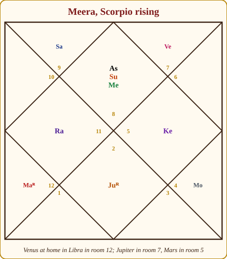
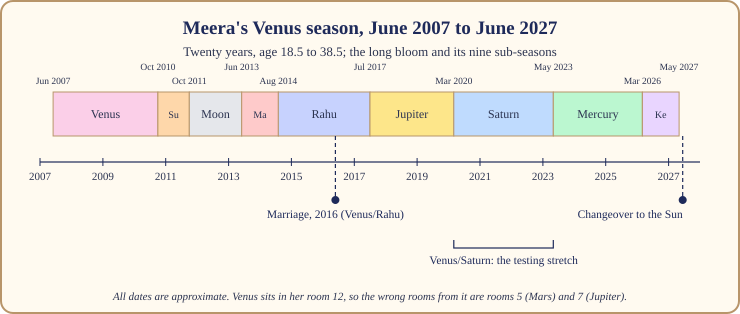

# Chapter 5: The Venus Season (20 Years): The Long Bloom

Twenty years. Say it slowly. A child who enters a Venus season in Class 1 leaves it with a job. A woman who enters it at thirty leaves it at fifty. Nobody is the same person at both ends of twenty years, and that is the first thing to understand: this season is not an event, it is a climate. You will remember your twenties, your marriage, your first house, and only later notice that one courtier was running the household the whole time.

In the royal court Venus is the Minister of Pleasure, who arranges the music, the weddings, the comfort and the beauty of the palace. When she runs the household, life softens and fills: love, marriage, money through taste, good food, friendships, art. The season asks something that sounds easy and is not: to enjoy without drowning, to receive without going soft.

This chapter follows the long bloom through its arc and its sharp corners, and then through Meera's own Venus season, around June 2007 to around June 2027, which is in its closing year as I write. All dates here are approximate; a free app may differ by a month or two.

## The Minister of Pleasure runs the household

> **📖 Story: The Minister hangs the lamps.** The Sadhu left the palace bare, and the Minister of Pleasure walked in behind him with a long list. She hung lamps in every corridor, planted the courtyard, hired musicians and sent for the cooks. Within three years the palace was full of guests, laughter and the smell of ghee. The old Judge grumbled about the bills. But the Queen Mother noticed that the courtiers were kinder, marriages were being arranged, and the treasury, oddly, was growing, because people like to pay a house that makes them welcome. "Twenty years of this," said the Judge. "Yes," said the Minister, "and you will have to find your own way not to get fat." **Rule:** Venus's season fills the house. The task is to keep your shape inside the abundance.

What does the season ask? To open. To let yourself be loved, to make things beautiful, to earn through what gives people pleasure, and to build the partnerships, especially marriage, that most people build in this stretch. It also asks for taste: choosing among many good things rather than grabbing all of them.

> **🔍 Why?** Tradition and the system's own logic together. Parashara makes Venus a minister, the adviser who knows what people want. Venus owns Taurus (food, wealth, the face, the voice) and Libra (balance, the scales, partnership), so by the system's logic her season turns on comfort and on the other person. Everyday parallel: the aunt who runs every family wedding. She knows which caterer, which sari shop, which cousins must be kept apart; the wedding is beautiful because of her, and so is the bill.

## How it feels

**Body.** Softer. Weight tends to come on; skin and hair often improve; the appetite for sweets and rest grows. Take care of the kidneys, lower back and reproductive system, Venus's territory.

**Mind.** Agreeable, aesthetic, a little lazy. You care more about harmony than winning; decisions get made to keep the peace. Creativity flows if given a channel.

**Home.** Fills up: furniture, guests, a better flat, a car, curtains that match. People in Venus seasons buy things for the house without noticing.

**Love.** The season's heart. Most people who marry do so in a Venus season or sub-season. Romance comes easily; so does the temptation to stay in a comfortable relationship that is not right.

**Work.** Smoother than it is productive. You are liked; promotions come through relationships as much as results. Beauty, design, hospitality, food, fashion, film and finance do especially well.

**Money.** Grows, and goes. Venus earns well and spends well; the savings at the end depend on whether Saturn's sub-season taught you discipline.

## The arc: first years, middle, last year

**The first three years and four months** are Venus's own sub-season, the longest opening of any season. The house fills: new friends, new comforts, often a first love. It feels like spring after Ketu's winter, and people overspend on everything, including affection.

**The middle** is where the twenty years earn their reputation. Rahu's three years bring appetite and often the marriage itself. Jupiter's two years and eight months bring children, faith, growth. Saturn's three years and two months arrive around the fourteenth year and sober everyone up: the bill for the bloom is presented, and the real character of the season is decided.

**The last year and two months** belong to Ketu, and the Sadhu starts opening the windows again. Attachments loosen. People feel restless, done with comfort, ready for something sharper: the Sun's season, which asks who you are when the comfort is taken away.

> **🔍 Why twenty years?** Honestly: tradition gives the length and no reason. The nine lengths add to 120 and come down from Parashara without an astronomical explanation. I will not invent one. Everyday parallel: nobody knows why a cricket over is six balls; it simply is, and the game is built around it.

## When Venus is on your side and when it tests you

Venus is gentle by nature, but whether she helps or tests you depends on which two rooms she owns for your rising sign. Parashara's rule, explained in full in Book 1: the lord of rooms 1, 5 or 9 is on your side; the lord of 3, 6 or 11 tests you; the lord of a pillar room (4, 7, 10) is neutral unless the other room decides; the lord of 2, 8 or 12 goes by its other sign.

| Rising sign | Venus | Rooms Venus owns for you |
|---|---|---|
| Aries | 🔴 Tests you | 2 and 7 |
| Taurus | 🟡 Mixed | 1 and 6 |
| Gemini | 🟢 On your side | 5 and 12 |
| Cancer | 🔴 Tests you | 4 and 11 |
| Leo | 🔴 Tests you | 3 and 10 |
| Virgo | 🟢 On your side, your best planet | 2 and 9 |
| Libra | 🟢 On your side | 1 and 8 |
| Scorpio | 🔴 Tests you | 7 and 12 |
| Sagittarius | 🔴 Tests you | 6 and 11 |
| Capricorn | 🟢 On your side, your best planet | 5 and 10 |
| Aquarius | 🟢 On your side, your best planet | 4 and 9 |
| Pisces | 🔴 Tests you | 3 and 8 |

A Venus that tests you does not take love away. She still brings the wedding, with complications, costs or lessons attached. A Venus on your side brings the same wedding and pays for it.

## The room Venus sits in changes the story

| Room | What the twenty years tend to fill |
|---|---|
| 1 | Charm and good looks; you are liked everywhere and a little vain. |
| 2 | Money through taste or voice; family comfort grows; watch sweets and spending. |
| 3 | The arts, writing, music, short travels; a sibling's wedding; courage through charm. |
| 4 | A house bought or made beautiful, a car, mother's comfort; Venus's strongest seat. |
| 5 | Romance, creative flowering, the joys of children. |
| 6 | Love found through work or service; comfort that costs health; debts from luxury. |
| 7 | The natural marriage room; partnerships prosper; the public likes you. |
| 8 | Love with secrets; money through a partner or inheritance; intense attachments. |
| 9 | Luck through a partner; teachers and travel; perhaps a partner from far away. |
| 10 | A career in beauty, design, hospitality or the arts; respected and liked at work. |
| 11 | Income from many sources; a wide circle; too many parties. |
| 12 | Comfort far from home; spending on pleasure; a private, sensual life. |

## The sub-seasons that matter most

Four of the nine deserve special attention. For each, ask Chapter 3's two questions: is this planet a friend of Venus, and does it sit in the 6th, 8th or 12th room counted from Venus?

**Venus/Venus** (three years, four months). The Minister alone in her own house; everything Venus promises, undiluted. On your side, golden years; testing you, pleasant years in which habits form that you will pay for later.

**Venus/Rahu** (three years). The smoke-headed Stranger is Venus's friend by convention, and he magnifies her: appetite, glamour, unconventional love, foreign partners, matrimonial apps, weddings with a twist. Many marriages happen here. In a wrong room from Venus, the magnification comes with confusion.

> **📖 Story: The Stranger at the wedding.** The Minister of Pleasure was arranging a wedding when the smoke-headed Stranger offered to help. He doubled the guest list, hired a band from another country, and introduced the bride to a man nobody had vetted. The wedding was the talk of the kingdom, and the marriage, surprisingly, was good: the Stranger's choices are often right, only reached by strange roads. **Rule:** Venus/Rahu brings love and commitments by unconventional routes. Check the road, not just the destination.

**Venus/Saturn** (three years, two months). The old Judge and the Minister are natural friends, which surprises people. He comes to audit her bloom: money tightens, work gets heavy, romance cools into responsibility. In a wrong room from Venus this is the hardest stretch of the twenty years; otherwise it is simply the sobering one. Either way it builds the discipline the season otherwise lacks.

> **📖 Story: The Judge inspects the garden.** After thirteen years of feasts the old Judge of Labour walked through the Minister's garden with a ledger. He did not uproot a single plant. He simply asked of each one, "Who waters this, and with what?" By the end of his three years the garden was smaller and every plant in it was paid for. **Rule:** Venus/Saturn does not end the bloom. It asks what you can actually afford to keep.

**Venus/Ketu** (the closing year and two months). The Sadhu opens the windows. Something comfortable is set down. People feel vaguely dissatisfied with a life that looks, from outside, very pleasant. This is the bridge to the Sun, and the time for the closing rituals of Chapter 15.

> **🔍 Why?** The wrong-room rule again, the system's own logic: the 6th, 8th and 12th rooms counted from the season's planet are places of struggle, upheaval and loss as seen from where that planet stands, so a sub-lord sitting there delivers late, sideways or at a cost. Everyday parallel: an excellent wedding caterer based in another city. The food arrives, and so does the delay.

## What to do and what not to do

> **🧭 Anushka's rule of thumb:** In a Venus season, say yes to love and beauty, and keep one habit that has nothing to do with either: a budget, a sport, a fast, a craft that requires sweat. Softness is the only real danger of the season, and one hard habit is enough to prevent it.

**Do** marry, build partnerships, make your home beautiful, learn an art. **Do** keep a monthly account of money from the first year, because Saturn's sub-season will present the bill. **Do** move your body; Venus does not ask for it, which is exactly why you must. **Do** be generous; Friday is traditionally Venus's day, and a small act of hospitality on a Friday is the practice that suits the season.

**Do not** stay in a relationship because it is comfortable. **Do not** confuse being liked with being right. **Do not** buy a stone to "strengthen" Venus; if she tests you, a stone makes the test louder, and if she is on your side, she does not need it.

> **⚠️ Common mistake:** Expecting twenty uninterrupted years of pleasure. The Venus season contains Saturn, Rahu and Ketu sub-seasons. The season is soft overall; its parts are not.

## Meera's Venus season: June 2007 to June 2027

Meera's Venus sits at 22° Libra, at home, in her 12th room. For Scorpio rising Venus owns rooms 7 and 12, so she tests Meera, but a Venus at home is a strong Venus, and a strong planet that tests you gives real things with real lessons attached. The 12th room is the room of far places, expenses, private life and bed pleasures. So we should expect a Venus season lived away from home, with comfort, spending and love, and the lessons of a planet not quite on her side.

*Figure 5.1: Meera's chart. Venus (Ve) is at home in Libra in room 12. From there the 6th room is her room 5 (Mars) and the 8th is her room 7 (Jupiter).*

The season opened around June 2007, at eighteen and a half, with her leaving Jaipur for college in another city: Venus in the 12th room, far from home, on time. **Venus/Venus (around June 2007 to October 2010)** were the hostel years: friendships, a first love, a wardrobe, more spending than her parents knew about. **Venus/Sun (October 2010 to October 2011)** brought her first job; the Sun is on her side but is Venus's natural enemy, so comfort and ambition pulled against each other. **Venus/Moon (October 2011 to June 2013)**, her Moon in room 9, the 10th from Venus, was an emotional, homesick, studious stretch with a further qualification.

*Figure 5.2: Meera's Venus season, around June 2007 to June 2027. The marriage falls in Venus/Rahu, the testing stretch in Venus/Saturn.*

Now the wrong-room count. From Venus in room 12, the 6th is her room 5, where Mars sits walking backwards, and the 8th is her room 7, where Jupiter sits. **Venus/Mars (around June 2013 to August 2014)** was a strained romance (room 5 is the romance room) that ended; Mars is on her side, but from the wrong room the help came as a clean break rather than a wedding. **Venus/Rahu (around August 2014 to July 2017)** brought the wedding in 2016. Rahu is Venus's friend and sits in her 4th room (the home) in Aquarius; the match came through an online matrimonial route her mother distrusted. A new home, a new city, the Stranger's road.

**Venus/Jupiter (around July 2017 to March 2020)** is the one that puzzles people. Jupiter is her best planet and sits in her 7th room, the marriage room, yet that is the 8th counted from Venus: the wrong room. These were the adjustment years of early marriage, with in-laws (an 8th-room matter) and a slow settling rather than a flowering. Real help, sideways. **Venus/Saturn (around March 2020 to May 2023)** was the testing stretch. Saturn sits in her 2nd room (family, savings, speech), outshone by the Sun, and tests her mildly; he is also Venus's natural friend. Money was tight, work heavy, family duties multiplied, and she learned to keep accounts. Those three years built the discipline the first three had not.

**Venus/Mercury (around May 2023 to March 2026)** was busy and talkative, full of work and new skills, Mercury in her 1st room. And **Venus/Ketu (around March 2026 to May 2027)** is where she stands as I write: the windows opening, a comfortable job that no longer fits, a restlessness she cannot name. Around June 2027 the Sun's season begins, with the Sun in her 1st room. The question it will ask, after twenty years of being liked and comfortable, is the title of the next chapter.

## In one breath

- Venus, the Minister of Pleasure, runs the longest season: twenty years of love, comfort, beauty, partnership and money through pleasure.
- The task is to enjoy without going soft; the danger is comfort that becomes a cage.
- The opening three years and four months fill the house; Saturn's sub-season in the middle presents the bill; Ketu's closing year opens the windows.
- Whether Venus is on your side depends on the two rooms she owns for your rising sign; she favours Virgo, Capricorn and Aquarius most.
- Venus/Rahu often brings the marriage, by an unusual road; Venus/Saturn builds the discipline the season otherwise lacks; a sub-lord in the 6th, 8th or 12th from Venus works from the wrong room.
- Meera's Venus season (around June 2007 to June 2027) took her away from home, married her in 2016, tested her from 2020 to 2023, and is closing now.

## Try this

1. Find your Venus season on your season map. If you have lived any of it, mark your first love, your marriage or partnership, and your biggest purchase. Which sub-seasons were they in?
2. Look up your rising sign in the Venus table. Does the verdict match how love and money have treated you?
3. Count the 6th, 8th and 12th rooms from your Venus. Which planets sit there? Those are the sub-seasons to prepare for.
4. Write down one hard habit (a budget, a sport, a craft) you could keep through a soft season. Start it this month.
