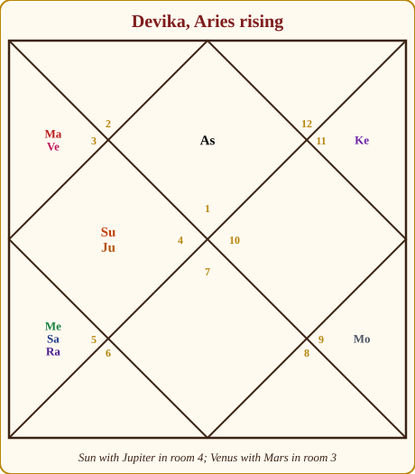
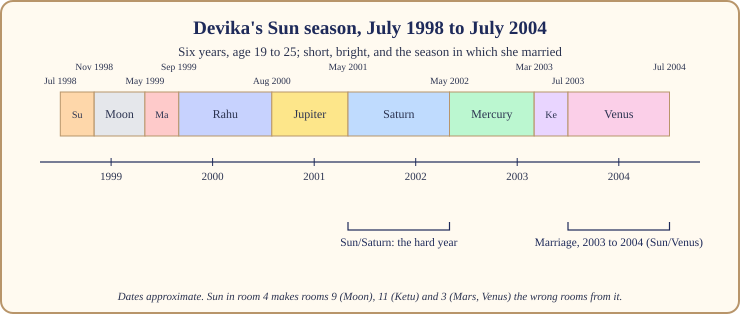
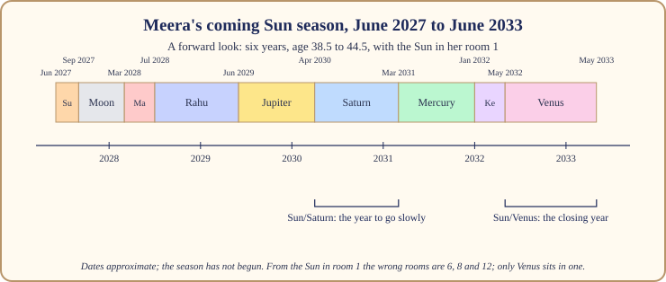

# Chapter 6: The Sun Season (6 Years): Who Am I When Nobody Is Watching?

After twenty years of Venus, the Sun's six years feel like someone has switched on the tube light in a room lit by candles. Everything is suddenly visible, including you. The music stops, the guests go home, and a question the long bloom let you avoid stands in the middle of the floor: who are you when nobody is clapping?

In the royal court the Sun is the King. He does not arrange feasts or keep accounts; he is the centre, and when he runs the household everything is measured against him. His season is about identity, the father, authority, visibility, the heart and spine, and the hard, clean business of standing on your own name. It is the shortest season, six years, but almost nobody comes out of it the same person.

This chapter follows the King's six years, then Devika's Sun season (around July 1998 to July 2004), in which she married, and finally the one Meera enters around June 2027. All dates here are approximate; a free app may differ by a month or two.

## The King runs the household

> **📖 Story: The King walks the kingdom alone.** When the Minister of Pleasure's long tenure ended, the King sent the musicians home and walked out of the palace in plain clothes. For six years he visited every village and asked everyone he met one question: "What are you for?" Many could not answer; they had been busy being comfortable. The King was not angry; he wrote their names in a book and moved on. When he came back, those who knew what they were for were given work; those who did not had been given six years to find out. **Rule:** The Sun's season asks what you stand for and makes it visible. There is nowhere to hide, and that is the gift.

What the season asks is to become yourself in public: to take authority where it is yours, to stop borrowing confidence from partners or comfort, to make peace with your father (and the fatherly voice inside you), and to look after the heart and back.

> **🔍 Why?** Astronomy first: the Sun is the centre of the system, and every other planet, including the Moon, shines by its light. Then tradition: Parashara makes the Sun the King and the planet that stands for the soul, the father and the government, as befits the source of the light the others reflect. Everyday parallel: the head of a joint family. When he walks in, the television goes off, the children sit up, and everybody remembers who they are supposed to be.

## How it feels

**Body.** Warmer, more upright, more tired by evening. The Sun stands for the heart, spine, eyes and bones: a season to take the heart and back seriously, with posture, blood pressure checks and sleep.

**Mind.** Clear, proud, impatient with pretence. You see through people and they see through you. Confidence rises if the Sun is on your side; self-doubt sharpens into self-examination if not.

**Home.** The father comes to the centre: his opinions, his approval or the lack of it. Property and family standing come up.

**Love.** Harder than in Venus. The Sun wants respect more than comfort, and relationships that depended on you dimming yourself are tested.

**Work.** Visibility: promotions, titles, government and institutional work, leadership. You are noticed, wonderful if your work is good and uncomfortable if not.

**Money.** Through position rather than pleasure. Salaries and titles rise; so does spending on status.

## The arc: first year, middle, last year

**The first year** is short and bright. The Sun's own sub-season lasts under four months, then the Moon's six. People feel the light switch on, make bold declarations, quit things. Then the Moon softens it and the real question forms.

**The middle** holds Rahu, Jupiter and Saturn in turn: a year of ambition and shadow, a year of growth and recognition, a year of audit. Most of the identity work gets done here, usually through conflict with an authority, a father or a boss.

**The last year** belongs to Venus, the King's natural enemy, and it is the season's quiet surprise. Softness returns; marriages, partnerships and pleasures come back into focus, as if the kingdom, having found out who it is, can afford to enjoy itself again. It is the bridge to the Moon's ten years.

## When the Sun is on your side and when it tests you

The Sun owns only one sign, Leo, so for your rising sign he owns one room, and that room decides. Parashara's rule: the lord of rooms 1, 5 or 9 is on your side; the lord of 3, 6 or 11 tests you; the lord of a pillar room (4, 7, 10) or of 2, 8 and 12 is neutral unless the planet's nature tips it, and the Sun's steadiness tips the pillar rooms his way for Taurus and Scorpio.

| Rising sign | The Sun | Room the Sun owns for you |
|---|---|---|
| Aries | 🟢 On your side | 5 |
| Taurus | 🟢 On your side | 4 |
| Gemini | 🔴 Tests you | 3 |
| Cancer | 🟡 Mixed | 2 |
| Leo | 🟢 On your side | 1 |
| Virgo | 🟡 Mixed | 12 |
| Libra | 🔴 Tests you | 11 |
| Scorpio | 🟢 On your side | 10 |
| Sagittarius | 🟢 On your side | 9 |
| Capricorn | 🟡 Mixed | 8 |
| Aquarius | 🟡 Mixed | 7 |
| Pisces | 🔴 Tests you | 6 |

> **🔍 Why?** The system's own logic: one room, one verdict, the cleanest case of Parashara's rule. Everyday parallel: an employee with one responsibility is easy to appraise; one with five is always "mixed".

A Sun that tests you does not stop you being seen; it makes the seeing uncomfortable. Egos clash, authority figures block you, you are promoted into a job you cannot yet do. The lesson is the same, learned the hard way.

## The room the Sun sits in changes the story

| Room | What the six years tend to light up |
|---|---|
| 1 | A strong, visible self; you become the centre; watch pride and headaches. |
| 2 | Authority in the family; earning through position; speech turns commanding. |
| 3 | Courage and initiative; a brother's rise; short journeys for work. |
| 4 | The father's presence at home; property; education; take care of the heart. |
| 5 | A child's achievements; recognition for talent; leading in creative work. |
| 6 | Victory over rivals; government or institutional service; health needs watching. |
| 7 | A strong-willed partner; a marriage of two egos; public dealings. |
| 8 | The self tested by sudden change; deep interests; the father's affairs. |
| 9 | The father's season proper; higher learning; luck through authority; pilgrimage. |
| 10 | The natural throne: promotion, government, visibility; the Sun's strongest seat. |
| 11 | Income through position; powerful friends; a wish fulfilled. |
| 12 | Identity found abroad or in retreat; spending on status; the King in the shadows, his hardest seat. |

## The sub-seasons that matter most

As always, ask Chapter 3's two questions: is the sub-season's planet a friend of the Sun, and does it sit in the 6th, 8th or 12th room counted from him?

**Sun/Sun and Sun/Moon** (the first ten months). The King, then the Queen Mother: the season announces itself, then asks how you feel about it. The Moon is the Sun's friend, so the opening is usually kind, unless the Moon sits in a wrong room from the Sun.

**Sun/Rahu** (ten months, twenty-four days). The smoke-headed Stranger swallows the King: literally, the eclipse pair. Ambition, borrowed identity, a craving for status or a foreign stage, confusion about who you are. Rahu is hostile to the Sun by convention, so this is loud whatever room it sits in.

> **📖 Story: The eclipse at court.** One afternoon the smoke-headed Stranger stood in front of the King and, for a few minutes, the court could not see the throne. Ministers took orders from the Stranger; courtiers wore his clothes. Then the shadow passed and the King was exactly where he had always been, embarrassed by how quickly everyone had forgotten him. **Rule:** In Sun/Rahu you will be tempted to become someone else. Wait for the shadow to pass before signing anything in the new name.

**Sun/Saturn** (eleven months, twelve days). In the old story Saturn is the Sun's neglected son, and the two cannot stand each other. The season's hard year: conflict with authority, with the father, with a boss; duty, delay, a reckoning. It is almost always where the identity work actually gets done.

> **📖 Story: The King and the Judge.** The old Judge of Labour came to audit his father's household and found the ledgers empty, because kings do not keep accounts. For eleven months he made the King sign for every lamp, every meal, every title he had handed out. The King hated it. At the end he knew, for the first time, what his kingdom cost and what he was for. **Rule:** Sun/Saturn is the audit of your authority. Do the paperwork; the clarity is worth the humiliation.

**Sun/Venus** (the closing year). The Minister of Pleasure returns to a kingdom that has found itself: marriages, partnerships, comforts, and often a decision about love that could not be made while identity was in question. The Sun and Venus are natural enemies, so the softness has an ego cost: you have to let someone else matter.

> **🔍 Why?** Tradition and myth, named as such. Saturn as the Sun's rejected son and Rahu swallowing the Sun are Puranic tales, and the friendship table in Book 1 follows them. Everyday parallel: the father and grown son who quarrel at every family dinner and are, underneath, the two most alike people in the room.

## What to do and what not to do

> **🧭 Anushka's rule of thumb:** In a Sun season, do the thing that would embarrass you if you were caught not doing it. The season will make you visible anyway; let it find you at work.

**Do** take responsibility, ask for the title, lead the project. **Do** call your father, or make peace with his memory. **Do** look after the heart and spine: walk at sunrise, sit straight, check the blood pressure. **Do** keep a Sunday practice; ten minutes of stillness facing the morning sun suits the season.

**Do not** confuse authority with arrogance; the Sun's shadow is pride, and Saturn's sub-season collects on it. **Do not** take Sun/Rahu's borrowed ambitions as your own. **Do not** buy a ruby to "strengthen your Sun"; if he tests you, a stone makes him louder, and if he is on your side, he does not need help.

> **⚠️ Common mistake:** Reading the Sun's season as six years of guaranteed promotion. It is six years of visibility, which promotes good work and exposes poor work with equal efficiency.

## Devika's Sun season: July 1998 to July 2004

Devika, our Chart C, was born in Kolkata in July 1979 with Aries rising. Her Sun sits at 5° Cancer in her 4th room (home, mother, education, the heart) with Jupiter at 26° Cancer, at Jupiter's strongest place. For Aries rising the Sun owns room 5, so he is on her side. A Sun in his friend the Moon's sign, beside a strong Jupiter, in the education room: expect a season about learning, home and the father, lived with a scholar's seriousness.

*Figure 6.1: Devika's chart. The Sun (Su) sits with Jupiter in room 4. From there the 6th, 8th and 12th rooms are her rooms 9, 11 and 3.*

The season ran from around July 1998 (age nineteen) to around July 2004 (twenty-five): her college and postgraduate years in Kolkata.

*Figure 6.2: Devika's Sun season, around July 1998 to July 2004. The marriage falls in Sun/Venus, the closing year.*

Now the wrong-room count, and it is unusual. From the Sun in room 4, the 6th room is her 9th (the Moon), the 8th her 11th (Ketu) and the 12th her 3rd (Mars and Venus). Four of her nine sub-seasons ran from the wrong room. **Sun/Moon (around November 1998 to May 1999)** and **Sun/Mars (May to September 1999)** made the opening year emotional and scattered: a quarrel with a sibling (room 3), energy without direction. **Sun/Rahu (around September 1999 to August 2000)** was the eclipse year: Rahu sits in her 5th room in Leo, the Sun's own sign, and she spent a year among clever, unconventional friends who nearly pulled her out of her course.

**Sun/Jupiter (around August 2000 to May 2001)** was the season's gift: Jupiter sits with the Sun, at his strongest, on her side, and she graduated with distinction into the course her father had hoped for. **Sun/Saturn (around May 2001 to May 2002)** was the hard year. Saturn sits in her 5th room, tests her (he owns rooms 10 and 11 for Aries) and is the Sun's enemy. Her father retired, the household's money changed, and she took a job she did not want. The audit. **Sun/Mercury (around May 2002 to March 2003)** was busy with exams and writing. **Sun/Ketu (around March to July 2003)**, from the 8th counted from the Sun, dissolved a friendship circle.

And then **Sun/Venus (around July 2003 to July 2004)**: the marriage. Venus owns room 7, the marriage room, for Aries rising, so her sub-season is when marriage is most likely to arrive. But Venus tests Devika (she also owns room 2), and she sits in room 3 with Mars, the 12th counted from the Sun: the wrong room. Read it plainly: the Sun is her parental home (room 4), and the 12th from it is leaving that home. Marriage took her out of her father's house, by a route more adjustment than romance, and asked the newly lit Devika to make room for another person's light. The Moon's ten years began around July 2004: Chapter 7.

## Meera's coming Sun season: a forward look

Meera's Sun sits at 28° Scorpio in her 1st room, with Mercury. For Scorpio rising the Sun owns room 10, career, so he is on her side, and he sits in the room of the self. The season beginning around June 2027, at thirty-eight and a half, will ask her to let her work become her identity, after twenty years in which comfort and partnership were.

*Figure 6.3: Meera's Sun season, around June 2027 to June 2033, as a forward look.*

From the Sun in room 1 the wrong rooms are simply rooms 6, 8 and 12, and only Venus sits in one. So **Sun/Venus (around May 2032 to May 2033)**, the closing year, is her one wrong-room sub-season: the comfort she set down in 2027 asking to be renegotiated. Before that, **Sun/Rahu (around July 2028 to June 2029)**, Rahu in her 4th room, will test the home; **Sun/Jupiter (around June 2029 to April 2030)**, Jupiter in her 7th, is the year to lean on the partnership and a mentor; and **Sun/Saturn (around April 2030 to March 2031)**, Saturn in her 2nd room and outshone by this very Sun, is the year to go slowly with money and family. I do not know what will happen in these years; nobody does. I know what they will ask.

## In one breath

- The Sun, the King, runs a six-year season about identity, the father, authority, visibility, the heart and the spine.
- It feels bright, proud and exposed: good work is promoted and poor work is seen.
- The first year switches the light on, the middle (Rahu, Jupiter, Saturn) does the identity work, the last year (Venus) softens.
- The Sun owns one room for your rising sign and that room decides; he favours Aries, Taurus, Leo, Scorpio and Sagittarius.
- Sun/Rahu is the eclipse, Sun/Saturn the audit; a sub-lord in the 6th, 8th or 12th from the Sun works from the wrong room.
- Devika's Sun season (around July 1998 to July 2004) was college, a father's retirement, and a marriage in Sun/Venus that took her out of the parental home; Meera's begins around June 2027.

## Try this

1. Find your Sun season on your season map. If you have lived it, write down who held authority over you then and what you did about it.
2. Look up your rising sign in the Sun table. Does the verdict match how authority and visibility have treated you?
3. Count the 6th, 8th and 12th rooms from your Sun. Which planets sit there? Mark those sub-seasons on your map.
4. Write one sentence answering the King's question, "What are you for?" If you cannot, that is what the season is for.
