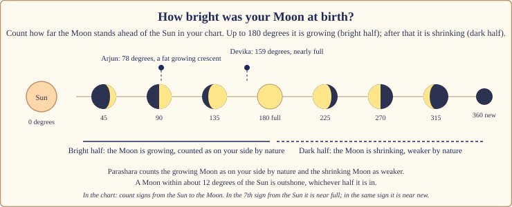
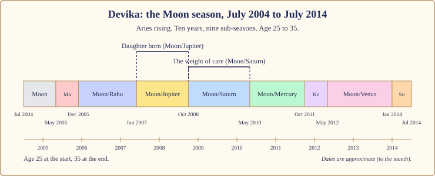
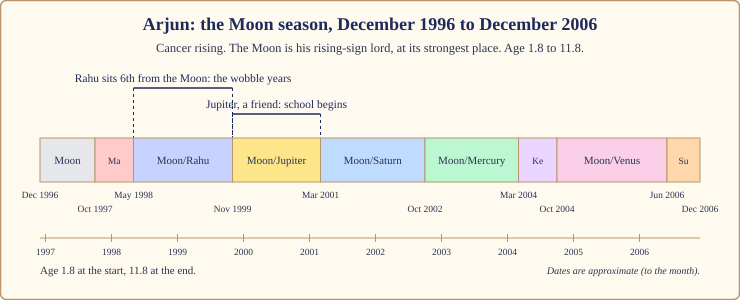

# Chapter 7: The Moon Season (10 Years): The Household of the Mind

A woman I read for once described her Moon season in one sentence. "For ten years, everything happened in the kitchen." She did not mean she cooked more. She meant that the centre of her life moved indoors: to her mother, her children, the people who came through her door, the question of where home actually was. Ask her what those years were *about* and she would name a house, not a promotion.

That is the Moon season. Ten years when the Queen Mother holds the keys, and the household of the mind becomes the main stage.

## The Queen Mother takes the keys

In the court of Book 1 the Moon is the Queen Mother. She does not sit on the throne; she runs the palace. She knows which servant is unwell and who has not eaten. She is the mood of the whole building, and she changes a little every day, because the Moon in the sky changes a little every night.

When her season begins, the court reorganises itself around her concerns. Nourishment. Shelter. Belonging. What the public thinks of you, because the Moon is also the crowd, the many faces that reflect you back to yourself. And underneath it all, the mind: your moods, your memory, your need to feel safe.

> **📖 Story: The Queen Mother takes the keys.** When the King's season ended the court expected quiet. Instead the Queen Mother walked through every room with a bunch of keys and opened doors nobody had opened in years. "Who sleeps here? Who cooks for them? When did this child last see her mother?" The Commander wanted a campaign; she sent him to repair the well. The Prince wanted to publish accounts; she asked him to write to the relatives. By the end of the year the palace was fuller, warmer, noisier and more emotional, and nobody could say what had been achieved, except that everyone had been fed. **Rule:** the Moon season measures success by how well the household is held, not by what is won.

What the season asks of you is simple to say and hard to do: **tend**. Tend your mind, your body, your home, your mother and the people who depend on you. Learn what feeds you and what drains you. Build the kind of safety that does not depend on anyone else's mood.

## How the Moon season feels

**Body.** The Moon stands for fluids, the stomach, sleep and the chest. Weight comes and goes; everything depends on sleep; a bad week shows up in digestion first.

**Mind.** More changeable. Not worse, more changeable. Old memories return. Hurt comes faster, and so does tenderness.

**Home.** Houses change: people move, renovate, return to the family home or finally leave it. Mothers, grandmothers and the women of the family come forward.

**Love.** Security over romance. You want to be known, held, cooked for.

**Work.** The public comes into it. Work that faces people (teaching, nursing, hospitality, food, caring) grows; solitary work feels lonely.

**Money.** It flows towards the household. Saving becomes emotional ("in case"). Income is steady but rarely dramatic.

## The arc: first year, middle, last year

The **first year** (the Moon's own sub-season, ten months) is a turning inward. After the Sun's six years of identity and visibility, the mind wants a nest. It can feel like a loss of drive. It is a change of priority.

The **middle**, roughly years two to eight, holds the big sub-seasons: Rahu, Jupiter, Saturn and Mercury, each well over a year. This is where the events happen and the quality of the season is decided.

The **last year** belongs to Venus (a year and eight months) and then the Sun (six months). Venus softens the end: comfort, companionship, the house finally furnished. The Sun's months are the bridge to Mars, and you can feel the temperature rise.

> **🔍 Why ten years?** Tradition, honestly. Parashara's timetable gives the Moon ten of the 120 years and no astronomical reason, and I will not invent one. Ten years is long enough for a household to form, fill and change shape. Everyday parallel: the school system decides a child needs about ten years before anything else; nobody derived that from the stars either.

## When the Moon is on your side, and when it tests you

Whether the Moon runs your house kindly depends on two things: which room it owns in your chart (Parashara's rule about rooms, from Book 1), and how bright it was when you were born.

| Rising sign | The Moon owns | In your Moon season |
|---|---|---|
| Aries | room 4 (a pillar) | 🟡 mixed: home and mother come to the front |
| Taurus | room 3 | 🔴 tests you: restless wanting, effort for its own sake |
| Gemini | room 2 | 🟡 mixed: money, food and family speech |
| Cancer | room 1 | 🟢 on your side: your own planet runs the house |
| Leo | room 12 | 🟡 mixed: expenses, sleep, faraway places |
| Virgo | room 11 | 🔴 tests you: gains with worry |
| Libra | room 10 | 🟡 mixed: work and public standing move |
| Scorpio | room 9 | 🟢 on your side: luck, teachers, journeys |
| Sagittarius | room 8 | 🟡 mixed: hidden changes, in-laws |
| Capricorn | room 7 | 🔴 tests you: marriage and partnerships tested |
| Aquarius | room 6 | 🔴 tests you: debts, health and rivals |
| Pisces | room 5 | 🟢 on your side: children, creativity, study |

"Tests you" does not mean "bad". It means the season brings the matters of a hard room to the front of the household. That is work, not punishment.

Now the second thing, which matters more in a Moon season than anywhere else: the Moon's phase at birth.

*Figure 7.1: How bright was your Moon at birth? Count how far the Moon stands ahead of the Sun. Growing (up to 180 degrees) is the bright half; shrinking is the dark half.*

> **🔍 Why does the Moon's phase at birth matter?** Two layers. **Astronomy:** the Moon has no light of its own; moonlight is sunlight bounced off its surface, and how much we see depends on where the Moon stands relative to the Sun. **Parashara's rule:** the growing, bright Moon is a planet on your side by nature; the shrinking, dark Moon is weaker and harder; within about twelve degrees of the Sun it is outshone altogether. Everyday parallel: two travellers start the same long train journey, one with a full water bottle and one nearly empty. The journey is identical. How they feel at hour six is not.

To check, count signs from your Sun to your Moon, going forward. Same sign: new. Seventh sign: full. Up to the seventh is growing; after it, shrinking. A bright Moon steadies the whole season. A dark Moon asks you to protect your sleep and mind more carefully, and that is all it asks.

> **📖 Story: The Queen Mother's lamp.** Every evening the Queen Mother walked the corridors with a lamp. Some years the lamp was full of oil and the whole palace saw her coming and felt safe. Some years the oil was low and she walked in near darkness, and the servants said she was angry, when really she could not see them. The King said nothing; he was the Sun, the source of the oil, and he lit her only when she stood far enough from him to catch his light. **Rule:** a Moon far from the Sun at birth is a bright Moon and a steadier mind; a Moon near the Sun is a dark Moon, not a bad one, and needs tending.

## The room the Moon sits in changes the story

| The Moon sits in | The Moon season tends to be about |
|---|---|
| room 1 | your body and your moods on display |
| room 2 | the family table, food, savings, speech |
| room 3 | siblings, short journeys, the courage to speak |
| room 4 | mother, house, land, inner peace; the Moon's natural room |
| room 5 | children, study, creativity, romance |
| room 6 | service, routine, health, debts |
| room 7 | marriage, partners, the public |
| room 8 | hidden changes, in-laws, inheritance; a private decade |
| room 9 | faith, teachers, long journeys; luck through people |
| room 10 | public work and reputation |
| room 11 | friends, gains, elder siblings, networks |
| room 12 | sleep, solitude, foreign lands, expenses |

A hint, not a verdict: a Moon in room 8 for a Scorpio rising (where it is on her side) is a deep, private decade with luck in it.

## The sub-seasons that matter most

Nine courtiers take turns inside the Moon's ten years. Four shape it most. For each, ask the two questions from Chapter 3: is the sub-lord a friend of the Moon, and where does it sit counted from the Moon? In the 6th, 8th or 12th room from the Moon it is in the "wrong room": the two planets cannot see each other's concerns, and that sub-season wobbles, even when both are good for you.

**Moon/Rahu (a year and six months).** The Stranger in the Queen Mother's kitchen. Rahu is hostile to the Moon in the common teaching, so this is the fog inside the season: strange hungers, anxiety, a far-off move, a public that suddenly notices you. In a wrong room, the household itself is unsettled.

> **📖 Story: The Queen Mother and the Stranger.** A smoke-headed traveller arrived at the kitchen door and asked for shelter. The Queen Mother, who fed everyone, fed him. But he wanted a dish from a country nobody had heard of, then another, then the recipe, then the cook. Within a month the kitchen smelled of unfamiliar spices and the servants could not sleep. He left as suddenly as he came, and three of his recipes were now family favourites. **Rule:** Moon/Rahu unsettles the household and widens its table; keep your sleep and you will keep the good recipes.

**Moon/Jupiter (a year and four months).** The Royal Priest blesses the house. Jupiter counts the Moon among his friends, and the Moon has no enemies at all, so this is usually the warmest stretch: children, teachers, faith, growth in the family. In a wrong room the blessing still comes, with cost or delay attached.

**Moon/Saturn (a year and seven months).** The old Judge audits the household. Duty, tiredness, elders who need care. Not cruel, but heavy. If Saturn tests you by rising sign, protect sleep, keep routine, and do not take on dependents you cannot carry.

**Moon/Venus (a year and eight months, the longest).** The Minister of Pleasure furnishes the house. Comfort, companionship, beauty. It can tip into spending for comfort, but most people remember it kindly.

## What to do, and what not to do

**Do:** protect your sleep like a job; tend your mother, or those who mothered you, while you can; make your home a place you want to be in, even a rented room; face the public through work that holds people; keep a mood diary for a month; and on Mondays, the Moon's day, do one quiet kind thing for someone who depends on you. A practice, not a bargain.

**Do not:** buy a pearl because someone said your Moon is "weak" (a stone strengthens a planet; it does not steady a mind; routine is the practice); make big decisions on a bad night; mistake sensitivity for weakness; or isolate. The Moon season heals through people, even when people are what hurt.

> **🪔 If you read for others:** never say "your mother will fall ill" or "you will lose your home". Say: "This is a decade when your mother and your home come forward. Give them time."

## Two lives through the Moon season

The dates below are approximate to the month, as all dasha dates are.

### Devika, July 2004 to July 2014

Devika is our Aries rising. Her Moon sits at 14° Sagittarius in room 9, nearly full (about 159 degrees ahead of the Sun), in Jupiter's sign; and Jupiter sits in the Moon's sign, Cancer, at its strongest place in room 4. The two have swapped homes. For Aries rising the Moon is mixed by ownership, so the exchange sets the tone: her Moon season borrows Jupiter's grace.

*Figure 7.2: Devika's Moon season, age 25 to 35. The daughter arrived in Moon/Jupiter (June 2007 to October 2008); Moon/Saturn after it was the weight of early motherhood.*

She entered the season at 25, newly married (the wedding was 2003 to 2004, at the end of her Sun season, Chapter 6). Moon/Moon built the household. Moon/Mars (May to December 2005) was brisk; Mars, her rising-sign lord, sits 7th from the Moon. Moon/Rahu (December 2005 to June 2007) was the fog, but her Rahu sits in room 5, the children's room, 9th from the Moon: the placement that makes a young couple start talking seriously about a family.

Then Moon/Jupiter, June 2007 to October 2008, and her daughter was born. Here is an honest problem. Counted from her Moon in room 9, Jupiter in room 4 is in the 8th room: a wrong room by our first check. Reading only by the rule, I would have predicted a wobble, and I would have been wrong. Three things outvote it. The exchange: when two planets swap homes, each behaves as if it sat in the other's room, so Jupiter effectively acts from room 9, beside the Moon's concerns. Jupiter is the planet that stands for children, at its strongest place, in a pillar room. And Jupiter owns room 9, one of her three lucky rooms. The wrong-room rule is the first question, not the last.

> **🧭 Anushka's rule of thumb:** when the 6/8/12 check says "wobble" but the sub-lord is strong, on your side, and tied to the season lord by an exchange or by sitting with it, trust the strength. The room rule is a tie-breaker, not a judge.

Moon/Saturn (October 2008 to May 2010) was the weight of care: a baby, broken sleep, and Saturn, who tests her, sitting in the children's room. Nothing went wrong. Everything was heavy. Knowing it had an end date is worth more than any stone.

Moon/Mercury and Moon/Ketu (May 2010 to May 2012) were the quieter middle. Moon/Venus (May 2012 to January 2014) softened the decade: Venus tests her by ownership but sits with Mars in room 3, 7th from the Moon, so the comfort came through siblings, short trips and a settled house. Moon/Sun (January to July 2014) was the bridge: the Sun, on her side, sits in room 4 with Jupiter, the temperature rose, and in July 2014 the Commander took the keys. That is Chapter 8.

### Arjun, December 1996 to December 2006

Arjun is our Cancer rising, which makes the Moon his rising-sign lord. It sits at 6° Taurus, at its strongest place, in room 11, and was a fat growing crescent at birth, about 78 degrees ahead of the Sun. Bright, strong, on his side. He had his Moon season as a child, from age 1.8 to 11.8.

*Figure 7.3: Arjun's childhood Moon season, age 1.8 to 11.8. His Moon is at its strongest place in room 11: a well-held childhood with many people in it.*

Arjun's file gives me no childhood events, and I will not invent any. A child does not run his own season; his household does. A bright rising-sign Moon in room 11 is the season of a well-held child: fed, surrounded by cousins and the children of the colony, with a mother who was present.

Moon/Rahu (May 1998 to November 1999), age three to four, is the one wobble: Rahu sits in room 4, the home, the 6th room from his Moon. If there was a year when the household was unsettled (a move, a change in who lived there), this is where I would look. Moon/Jupiter (November 1999 to March 2001), age four to six, is the opposite: Jupiter, on his side, in room 5 (study), 7th from the Moon. The natural stretch for a child to start school and take to it.

Moon/Saturn and Moon/Mercury (March 2001 to March 2004) both work from room 8, the 10th room from his Moon: ordinary primary-school years. Moon/Venus (October 2004 to June 2006) had Venus testing him by ownership but sitting 9th from the Moon: comfort and friendship rather than trouble. Moon/Sun (June to December 2006) was the bridge to Mars at 11.8, the age when the Commander takes over a boy's life anyway.

The same season asked two different things: of Devika, to build a household; of Arjun's parents, to hold a child. Same Queen Mother, same keys, different house.

## In one breath

- The Moon season is ten years when the Queen Mother runs the household: mind, mother, home, nourishment, the public and belonging.
- It asks you to tend: your sleep, your mind, your home and the people who depend on you.
- Cancer, Scorpio and Pisces rising have the Moon as a friend; Taurus, Virgo, Capricorn and Aquarius rising are tested by it; the rest are mixed.
- The Moon's phase at birth matters most here: a bright, growing Moon steadies the decade; a dark Moon asks you to protect your sleep and mind.
- The sub-seasons that shape it most are Rahu (the fog), Jupiter (the blessing), Saturn (the weight) and Venus (the comfort); strength and exchange outvote the 6/8/12 rule.
- Devika's Moon season built her household and brought her daughter in Moon/Jupiter (2007 to 2008); Arjun's was a well-held childhood under a strong Moon.
- Practices, not stones: sleep, routine, tending your mother and your home, work that faces people.

## Try this

1. Find your Moon's phase: count signs from your Sun to your Moon, going forward. Was it growing or shrinking? Then write one sentence about how you sleep when life is hard. Do the two match?
2. Find the room your Moon sits in and the room it owns for your rising sign. Using the two tables here, write a two-line summary of what your Moon season was or will be about.
3. If you have lived a Moon season, list the houses you lived in and the women who mattered most. Mark where Moon/Rahu and Moon/Saturn fell. Did the household change there?
4. For a child in your family now in a Moon season, write three things their household could do to hold them well this year.
5. A factual check: how long is Moon/Venus, and why is it the longest sub-season inside the Moon's ten years?

Answers

5. One year and eight months: (10 × 20) ÷ 120 years. Venus's 20 years is the largest allocation in the timetable, so Venus always gets the biggest slice of any season it enters.

