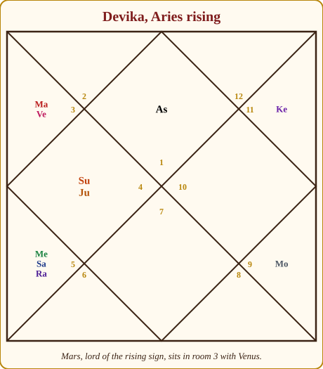
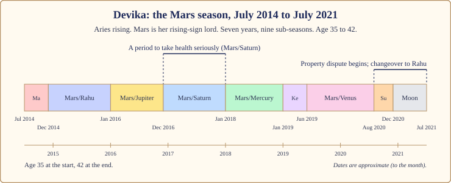
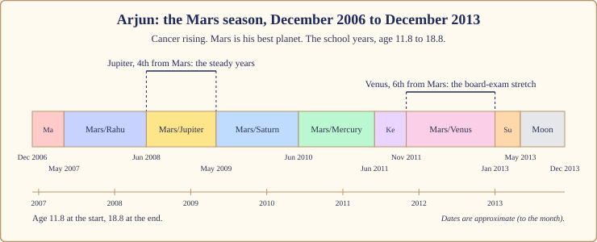

# Chapter 8: The Mars Season (7 Years): The Commander Takes Charge

My father's younger brother once told me he could divide his life into the years before he bought his land and the years after. He bought it at 38, against everyone's advice, with a loan he could barely carry, after a quarrel with a cousin that nobody in the family will discuss. He also broke his wrist that year, falling off a two-wheeler, and started running every morning at five. "I don't know what came over me," he said. What came over him was the Commander.

The Mars season is seven years: the shortest of the long seasons and the hottest of all. It does not ask you to tend, or to learn, or to let go. It asks you to **act**.

## The Commander takes the keys

In the court, Mars is the Commander of the army. He guards the gates, trains the soldiers, defends the kingdom's land and starts most of the fights. He is loyal to the King and the Queen Mother, respectful of the Royal Priest, impatient with the clever Prince, and has no idea what the Minister of Pleasure is for.

When his season begins, the palace becomes a barracks. Decisions get made faster. Arguments that have simmered for years come to a head. Things that were "someday" (the house, the business, the confrontation, the fitness) become "now".

> **📖 Story: The Commander takes the keys.** The Queen Mother handed over the keys and the Commander did not even look at them. He walked straight to the boundary wall, found the crack everyone had stepped around for a decade, and had it rebuilt in a week. Then he started a dispute with the neighbouring kingdom over a field, trained the kitchen boys to march, and bought three horses the treasury could not afford. By the end of his seven years the court was exhausted, bruised and in possession of a stronger wall, a bigger field, a fitter household and two feuds. "Was it worth it?" asked the Priest. "Ask me in the next season," said the Commander. **Rule:** the Mars season builds, defends and fights, in that order of value; your job is to choose the fights.

What the season asks of you: **courage with aim**. Act, but at a target. Build something that outlasts the heat. Defend what is yours, and learn the difference between defending and attacking.

## How the Mars season feels

**Body.** Mars stands for blood, muscle, heat, cuts and surgery. The body wants to move and pays you back when you let it. It also runs hot: inflammation, fevers, accidents from hurry. A season to take care, practically. Wear the helmet. Keep the check-up.

**Mind.** Impatience, and clarity. Mars cuts through dithering. You know what you want faster, and what you do not want, loudly.

**Home.** Property. The classic time for buying land, building, renovating, or fighting over who owns what. Brothers and sisters come forward as allies or rivals.

**Love.** Passion rises and patience falls. A good partnership fights well and makes up well. A fragile one finds out how fragile it is.

**Work.** Ambition, competition, promotions sought rather than waited for. Tools, machines, engineering, uniform, sport, surgery, land: all do well.

**Money.** Spent on action: property, vehicles, equipment, a venture. Mars does not save; it deploys. Loans are taken boldly, and that boldness needs a budget behind it.

## The arc: first year, middle, last year

The **first five months** are Mars's own sub-season: a sudden rise in temperature. People start things: a gym, a fight, a business, a renovation. It can feel like waking up.

The **middle**, roughly years two to six, holds Rahu (a year), Jupiter (eleven months), Saturn (a year and a month), Mercury (a year) and Venus (a year and two months, the longest). The property gets bought, the health gets tested, the rival gets faced.

The **last year** belongs to the Sun (four months) and the Moon (seven months). The Sun is the Commander's King, so the end often brings recognition for what was built. The Moon's months are the bridge to Rahu: a cooling before the eighteen-year churning.

> **🔍 Why is the Mars season so short and so hot?** Two layers. **Tradition:** Parashara gives Mars seven of the 120 years, the same as Ketu, with no reason attached. **The system's own logic:** Mars is fire, and fire burns fast; of the planets beyond the Earth it is also the quickest, crossing a sign in about forty-five days where Jupiter takes a year and Saturn two and a half. A fast, hot planet gets a fast, hot season. Everyday parallel: a pressure cooker. Seven minutes on a high flame does what an hour of simmering does, and you cannot leave the kitchen while it is on.

## When Mars is on your side, and when it tests you

Mars is a hard planet by nature; Parashara lists it among the cruel ones. But whether it is *your* hard planet or your best friend depends on the rooms it owns for your rising sign. For Cancer and Leo rising it owns one pillar room and one lucky room, which makes it the single best planet in the chart. For Taurus and Libra rising it owns no lucky room at all.

| Rising sign | Mars owns | In your Mars season |
|---|---|---|
| Aries | rooms 1 and 8 | 🟢 on your side: your own planet takes charge |
| Taurus | rooms 7 and 12 | 🔴 tests you: heat lands on marriage and expenses |
| Gemini | rooms 6 and 11 | 🔴 tests you: rivals, debts, gains through struggle |
| Cancer | rooms 5 and 10 | 🟢 your best planet: career and children rise together |
| Leo | rooms 4 and 9 | 🟢 your best planet: home, land, luck and faith gain |
| Virgo | rooms 3 and 8 | 🔴 tests you: effort without ease, sudden changes |
| Libra | rooms 2 and 7 | 🔴 tests you: money, family speech and marriage tested |
| Scorpio | rooms 1 and 6 | 🟢 on your side: your own planet, with a taste for competition |
| Sagittarius | rooms 5 and 12 | 🟢 on your side: children, creativity, faraway places |
| Capricorn | rooms 4 and 11 | 🔴 tests you: property and gains with friction |
| Aquarius | rooms 3 and 10 | 🔴 tests you: ambition at work, rivalry, a tired household |
| Pisces | rooms 2 and 9 | 🟢 on your side: money, family and luck grow |

> **🔍 Why can Mars be a friend for Cancer and an enemy for Taurus?** **Parashara's own logic**, from Book 1. A planet works for the rooms it owns. For Cancer rising, Mars owns room 10 (career, a pillar) and room 5 (children and merit, a lucky room): both rooms you want strong, so their owner is on your side, whatever its nature. For Taurus rising, Mars owns rooms 7 and 12, neither a lucky room, so it has no stake in your fortune. Everyday parallel: a tough building contractor. If he is building *your* house he is the best man in town. If he is building the one that blocks your light, he is a problem.

## The room Mars sits in changes the story

| Mars sits in | The Mars season tends to be about |
|---|---|
| room 1 | your own body and will; fitness, a hotter temper |
| room 2 | bold earning, sharp words at the dinner table |
| room 3 | courage, siblings, short journeys; Mars's natural room |
| room 4 | home, land, mother, vehicles; buying or fighting over property |
| room 5 | children, sport, speculation, romance; competitive and risky |
| room 6 | rivals, debts, service, health; Mars wins contests here |
| room 7 | heat in the partnership: fights and passion together |
| room 8 | sudden changes, surgery, inheritance; take care of the body |
| room 9 | faith, father, long journeys; courage with purpose |
| room 10 | career and public action; authority won |
| room 11 | gains, friends, elder siblings; acquisitive |
| room 12 | expenses, foreign lands, hospitals; energy spent far away |

A Mars walking backwards (as Arjun's is) turns the energy inward: a person who thinks before charging, or who charges at himself. A Mars outshone by the Sun (as Devika's is) is a Commander standing too close to his King: loyal, with less independent force.

## The sub-seasons that matter most

Mars's friends are the Sun, the Moon and Jupiter; Mercury is its enemy; Venus and Saturn are neutral. For each sub-season ask: is the sub-lord a friend, and where does it sit counted from Mars? The 6th, 8th or 12th room from Mars is the wrong room, and that sub-season wobbles.

**Mars/Rahu (a year).** The Stranger hands the Commander a map of a country he has never seen. Ambition becomes outsized; risks get taken; foreign places and bold ventures call. In a good room, a genuine leap. In a wrong room, a leap without a landing: check the budget twice.

**Mars/Jupiter (eleven months).** The Royal Priest advises the Commander, and the Commander listens. Courage with wisdom: the right property bought, the right fight chosen. If Jupiter is on your side, this is the sub-season to build.

**Mars/Saturn (a year and a month).** The accelerator and the brake, pressed together. This is the stretch in a Mars season to take health seriously: slow down, see the doctor, finish what was started. Not a verdict. A speed limit.

> **📖 Story: The Commander and the Judge.** The Commander had three campaigns planned when the old Judge of Labour arrived with his ledgers. "You cannot march," said the Judge, "until the wall is paid for." The Commander raged, then sulked, then, for the first time in years, sat still. In the stillness he noticed that his shoulder had hurt for months and that two of his best soldiers were unwell. He spent the year mending, paying and resting, and hated every day of it. The next spring his army was the fittest it had ever been. **Rule:** Mars/Saturn stops the Commander so the body and the accounts can catch up; the stop is the gift.

**Mars/Venus (a year and two months, the longest).** The Minister of Pleasure in the barracks. Passion, marriage heat, property bought for comfort, money spent on beauty and vehicles. In a good room from Mars, the sweetest stretch of the season; in a wrong room, distraction, over-spending, a relationship that burns hot and uneven.

## What to do, and what not to do

**Do:** move your body every day (a body that trains does not pick fights); build something that outlasts the heat; choose your fights in writing, and if you cannot write down what you want from one, do not have it; take care practically, with helmet, seatbelt, check-ups and sleep; repair one sibling relationship; and on Tuesdays, Mars's day, do something that costs you effort for someone else. A practice, not a payment.

**Do not:** buy red coral because someone says your Mars is "weak" or "angry" (a stone strengthens; it does not calm; discipline and exercise are the practice); sign a property deal in a hurry; drive angry, and I mean this literally; or mistake the season's heat for your character. You are hotter for seven years, not forever.

> **🪔 If you read for others:** never say "you will have an accident" or "you will have surgery". Say: "This is a season to take the body seriously, especially from this month to that month. See the doctor about the small things."

## Two lives through the Mars season

All dates below are approximate to the month, as dasha dates always are.

### Devika, July 2014 to July 2021

Devika is Aries rising, so Mars is her rising-sign lord. He owns rooms 1 and 8 and sits in room 3 (courage, siblings, effort) in Gemini, with Venus beside him, only eight degrees from the Sun, so he is outshone: a loyal Commander standing too close to his King.

*Figure 8.1: Devika's chart. Mars, lord of her rising sign, sits in room 3 with Venus, outshone by the Sun in the next room. Saturn, Mercury and Rahu share room 5.*

She came into the season at 35, with a six-year-old daughter. Mars/Mars (July to December 2014) was the rise in temperature. Mars/Rahu (December 2014 to January 2016) pushed ambition outward; Rahu sits in room 5, 3rd from Mars, a brisk room. Mars/Jupiter (January to December 2016) was the good year: Jupiter, on her side, at its strongest place, 2nd from Mars, in room 4, the home.

*Figure 8.2: Devika's Mars season, age 35 to 42. Mars/Saturn (December 2016 to January 2018) was a period to take health seriously; the property dispute began in 2020 and ran into the changeover.*

Then Mars/Saturn, December 2016 to January 2018, a period to take health seriously; it involved surgery and a long recovery. Here is how the chart said so without my ever saying "surgery". Saturn tests her by ownership. He sits 3rd from Mars, so the wrong-room rule does not fire. But look at what Mars *owns*: room 8, the room of hidden things and the body's deep repairs. When the season lord owns room 8 and hands the keys to a slow, testing planet, the body asks for attention. Add that Mars is outshone, and the reading is plain: slow down, see the doctor, let the accounts catch up. She did. The Commander and the Judge, exactly as in the story.

> **🧭 Anushka's rule of thumb:** when the season lord owns room 6 or 8, a testing planet's sub-season is a health check, whatever room that planet sits in. Say it that way and only that way.

Mars/Mercury (January 2018 to January 2019) was recovery and paperwork. Mercury tests her and is Mars's landlord (Mars sits in Gemini, Mercury's sign), so the stretch had his flavour: forms, follow-ups, siblings helping. Mars/Ketu (January to June 2019) was brief. Mars/Venus (June 2019 to August 2020), the longest, had the Minister of Pleasure sitting beside the Commander in room 3. Venus tests her by ownership, but a sub-lord who shares the season lord's room at least sees the same things: comfort, home improvements, the pleasures of a body that worked again.

Then Mars/Sun (August to December 2020). The Sun is on her side and sits in room 4: land and home. It is the Sun who outshines her Mars, and in his sub-season the Commander's attention went where the King's was: to property. The dispute over family property began in 2020. Mars/Moon (December 2020 to July 2021), the bridge, carried it on, and it was still open when the Stranger took the keys in July 2021. Chapter 9 picks it up at the changeover.

### Arjun, December 2006 to December 2013

Arjun is Cancer rising, which makes Mars his best planet: owner of room 10 (career) and room 5 (study, merit). His Mars sits at 21° Leo in room 2, walking backwards. He had his Mars season from age 11.8 to 18.8: the school years, when the Commander takes charge of every boy's life whether the dasha says so or not.

*Figure 8.3: Arjun's school-years Mars season, age 11.8 to 18.8. Mars is his best planet, walking backwards in room 2.*

I have no school events in Arjun's file beyond the dates of his seasons, and I will not invent marks or medals. I can read the shape.

Mars/Mars (December 2006 to May 2007), age twelve: the child becomes a competitor. Mars/Rahu (May 2007 to June 2008): Rahu sits in room 4, home and schooling, 3rd from Mars. A year of outsized wanting in a thirteen-year-old. Mars/Jupiter (June 2008 to May 2009): Jupiter, on his side, in room 5, the room of study, 4th from Mars, a pillar. The steady year; the Priest teaching the young soldier.

Mars/Saturn (May 2009 to June 2010) and Mars/Mercury (June 2010 to June 2011) both work from room 8, 7th from Mars: a good room, though both planets are neutral or testing for him, so likely years of grind. If he sat his class ten boards at the usual age, they fell in Mars/Mercury, spring 2011: the Prince at the Commander's desk.

Mars/Venus (November 2011 to January 2013) is the one wobble: Venus tests him and sits in room 7, the 6th room from Mars. Age sixteen to seventeen, the class eleven and twelve years. Friendships, first attractions, distraction. Mars/Sun (January to May 2013), the Sun in room 8, 7th from Mars, covered the spring of his class twelve examinations. And Mars/Moon (May to December 2013), the bridge: the Moon is his rising-sign lord, at its strongest place, in room 11 (friends), 10th from Mars. College, new friends, a new city perhaps. In December 2013, at 18.8, the Stranger took the keys. That is the next chapter.

Two lives, one Commander. For Devika, at 35, he built, defended and sent her to the doctor. For Arjun, at 12, he turned a child into a competitor and carried him through school.

## In one breath

- The Mars season is seven years when the Commander runs the court: courage, conflict, property, siblings, sport, ambition, blood and muscle.
- It asks for courage with aim: act, build, defend, and choose your fights in writing.
- Mars is a friend for Aries, Cancer, Leo, Scorpio, Sagittarius and Pisces rising (the best planet of all for Cancer and Leo) and tests Taurus, Gemini, Virgo, Libra, Capricorn and Aquarius rising; the rooms it owns decide, not its nature.
- The sub-seasons that shape it most are Rahu (the leap), Jupiter (the wise build), Saturn (the brake, and the time to take health seriously) and Venus (the longest, passion and comfort).
- When the season lord owns room 6 or 8, a testing planet's sub-season is a health check; say it that way and never as an event.
- Devika's Mars season (2014 to 2021) built, then stopped her in Mars/Saturn to take health seriously, then turned to property as it ended; Arjun's (2006 to 2013) carried him through school with his best planet in charge.
- Practices, not stones: daily movement, construction, chosen fights, practical care of the body.

## Try this

1. Find the two rooms Mars owns for your rising sign and the room it sits in. Using the two tables here, write a two-line summary of what your Mars season was or will be about.
2. If you have lived a Mars season, list what you built, what you fought over, and any period when the body asked for attention. Mark where Mars/Saturn fell. Does it line up?
3. Write down one fight you are in or avoiding. In one sentence, what do you actually want from it? If you cannot write the sentence, what does that tell you?
4. For thirty days, move your body for twenty minutes every morning and note your temper each evening in one word.
5. A factual check: using the proportional rule from Chapter 3, how long are Mars/Saturn and Mars/Venus, and which is longer?

Answers

5. Mars/Saturn is (7 × 19) ÷ 120 years, about one year, one month and nine days. Mars/Venus is (7 × 20) ÷ 120 years, exactly one year and two months. Venus's is longer by about three weeks.

