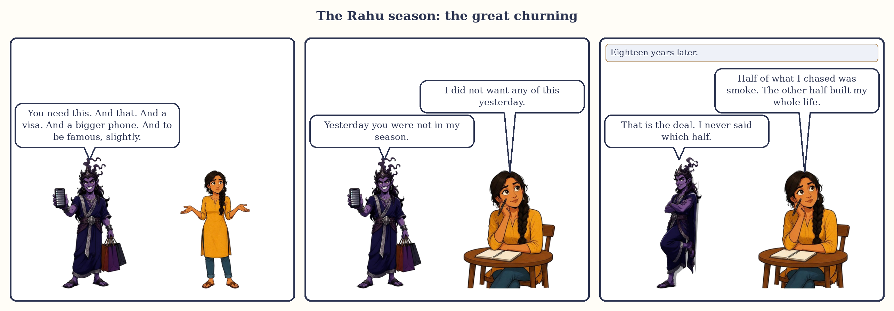

# Chapter 9: The Rahu Season (18 Years): The Great Churning

There is an old story about the churning of the ocean. Gods and demons pulled a serpent back and forth around a mountain until the sea gave up the nectar of immortality. A demon in disguise slipped into the line of gods and drank. The Sun and Moon told on him. His head was cut off, but the nectar had passed his throat, so the head lived on: forever hungry, never full. That head is Rahu. The body, which wants nothing, is Ketu.

The Rahu season is the most misunderstood of the nine, and the story holds the key: eighteen years of hunger. Not evil. Hunger. What you do with it is the whole season.

*The Rahu season in three panels.*

## The Stranger takes the keys

In the court, Rahu is the smoke-headed Stranger at the gate. He has no kingdom of his own and wants everything he sees. He speaks every language a little, knows the newest machines, the foreign markets, the shortcut, and is magnificent at promising.

When his season begins, the court is pulled outward: towards the new, the foreign, the big. The Stranger says there is more, and you can have it. Sometimes he is right. The sudden rises of a lifetime happen in Rahu seasons. So do the sudden falls, and the long fogs between.

> **📖 Story: The Stranger takes the keys.** The Commander handed over the keys and the Stranger smiled with a mouth nobody could quite see. Within a year the palace had a telegraph, a foreign cook, three new trade routes and a debt to a kingdom nobody had heard of. And yet the treasury doubled, the young people learned languages, and a servant's son became a minister. When the Stranger left, the court could not agree whether it had been robbed or enriched. Both, said the Judge. **Rule:** the Rahu season brings more of everything, including confusion; it rewards those who know what they actually want.

What the season asks of you: **hunger with direction**. Want big, but know what you want. Go far, but keep one honest friend who will tell you when the smoke is just smoke.

## How the Rahu season feels

**Body.** Nerves, light sleep, the hard to diagnose. Take care with what you put in the body. Ordinary check-ups matter because Rahu's complaints are the vague ones.

**Mind.** Restless, ambitious, easily obsessed. You can hold a goal with a grip you never had before, or lose a year to a screen. Illusion is the risk: seeing what you want to see.

**Home.** Far away: another city, another country, another kind of community.

**Love.** Unconventional, intense, often outside the circle the family expected.

**Work.** Technology, foreign companies, new industries. Rises come fast and sideways; titles inflate. Ask "is this real?" twice a year.

**Money.** Big swings. Debt taken for appearances is the Rahu trap. Debt taken for a real build is the Rahu gift.

## The arc: first years, middle, last years

The **first two years and eight months** are Rahu's own sub-season: fog and hunger together. People change direction sharply here, often without knowing why.

The **middle**, roughly years three to fifteen, holds Jupiter, Saturn, Mercury, Ketu and Venus, each between one and three years.

The **last three years** belong to the Sun, the Moon and Mars, the courtiers Rahu is least at ease with: the hunger meets the heart, and the season closes with a push of will. Then Jupiter arrives, and the changeover from hunger to meaning is one of the great turns of a life (Chapter 15).

> **🔍 Why eighteen years?** **Tradition.** Parashara gives Rahu eighteen of the 120 years and no reason. Rahu's actual journey around the sky takes about 18.6 years, but the tradition does not make this connection, and the other eight seasons have no such match; treat it as a coincidence. Everyday parallel: a shop that happens to be eighteen minutes' walk from your house is not eighteen minutes away *because* of your house.

## Why Rahu borrows: the shadow planet

Here is the rule that decides every Rahu season. **Rahu takes the colour of the planet whose sign it sits in, and of the planets it sits with.** This is the common teaching across Indian practice, not a line from Parashara.

*Figure 9.1: Rahu and Ketu are the two points where the Moon's path crosses the Sun's path, always opposite each other, sliding backwards through the zodiac, one round in about 18.6 years.*

> **🔍 Why does Rahu borrow its nature?** Two layers. **Astronomy:** Rahu is not a body. Seen from Earth, the Sun's yearly path and the Moon's monthly path are two rings tilted about five degrees apart; they cross at two points, Rahu and Ketu. Eclipses happen only when a new or full Moon falls near one of them: hence the old stories of the swallowers of the Sun and Moon. A crossing point has no light, no colour, no nature. **Common practice's logic:** a shadow takes the colour of whatever it falls on. Everyday parallel: a tenant has no address of his own; he uses the landlord's, and the landlord's house tells you a great deal about the tenant.

> **📖 Story: The Stranger borrows a coat.** The Stranger arrived at court with no clothes of his own. He borrowed the Priest's robe, and everyone found him wise; the Commander's armour, and everyone found him brave; the Minister of Pleasure's silks, and everyone found him charming. "Who is he really?" asked the King. "Whoever he is standing next to," said the Judge, "so look at who is standing next to him." **Rule:** judge Rahu by the lord of its sign and by the planets in its room; Rahu itself is a mirror with an appetite.

## When Rahu is on your side, and when it tests you

Because Rahu borrows, this table names, for each rising sign, the landlords whose colour puts Rahu on your side, tests you, or leaves it mixed (Parashara's room-ownership table, Book 1). The landlords' signs: the Sun owns Leo; the Moon, Cancer; Mars, Aries and Scorpio; Mercury, Gemini and Virgo; Jupiter, Sagittarius and Pisces; Venus, Taurus and Libra; Saturn, Capricorn and Aquarius. Companions in the room shift the result, and tradition adds that Rahu does best in the growing rooms, 3, 6, 10 and 11.

| Rising sign | 🟢 on your side when the landlord is | 🟡 mixed | 🔴 tests you when the landlord is |
|---|---|---|---|
| Aries | Sun, Mars, Jupiter | Moon | Mercury, Venus, Saturn |
| Taurus | Saturn, Sun, Mercury | Venus | Moon, Jupiter, Mars |
| Gemini | Venus, Saturn, Mercury | Moon | Mars, Jupiter, Sun |
| Cancer | Mars, Jupiter, Moon | Sun, Saturn | Venus, Mercury |
| Leo | Mars, Jupiter, Sun | Moon | Mercury, Venus, Saturn |
| Virgo | Venus, Mercury | Sun, Saturn | Mars, Jupiter, Moon |
| Libra | Saturn, Mercury, Venus | Moon | Jupiter, Sun, Mars |
| Scorpio | Jupiter, Moon, Sun, Mars | (none) | Mercury, Venus, Saturn |
| Sagittarius | Sun, Mars, Jupiter | Mercury, Moon | Venus, Saturn |
| Capricorn | Venus, Mercury, Saturn | Sun | Mars, Jupiter, Moon |
| Aquarius | Venus, Saturn | Mercury, Sun | Jupiter, Moon, Mars |
| Pisces | Mars, Moon, Jupiter | (none) | Saturn, Venus, Sun, Mercury |

## The room Rahu sits in changes the story

| Rahu sits in | The Rahu season tends to be about |
|---|---|
| room 1 | reinvention; a hunger to be seen |
| room 2 | money and speech in big swings |
| room 3 | bold effort, media, technology; a growing room |
| room 4 | home far from home; land unsettled, then rebuilt |
| room 5 | children, speculation, unusual studies and loves |
| room 6 | rivals and debts fought and won; a growing room |
| room 7 | an unconventional partner; the public in your life |
| room 8 | sudden changes, hidden matters, research |
| room 9 | foreign teachers, far journeys, a faith remade |
| room 10 | a career that rises sideways and fast; a growing room |
| room 11 | gains, networks, outsized friends; the classic rise |
| room 12 | foreign lands, hospitals, sleep, spending |

## The sub-seasons that matter most

By the common rule Rahu is at ease with Venus, Saturn and Mercury and hostile to the Sun, Moon and Mars; Jupiter is left out, and I treat him as neutral. For each sub-season ask where the sub-lord sits counted from Rahu: the 6th, 8th or 12th room is the wrong room, and that stretch wobbles. One more Rahu rule: the landlord's own sub-season brings the whole season's theme to a head.

**Rahu/Rahu (two years and eight months).** Fog and hunger. The direction of life changes before the reason is clear. Keep a journal.

**Rahu/Jupiter (two years and five months).** The Priest sits with the Stranger, and the hunger finds a meaning: studies completed, a teacher found, a real job, a child. With Jupiter on your side and in a good room from Rahu, this is the best stretch of the eighteen years. Hunger that reads is better than hunger that does not.

**Rahu/Saturn (two years and ten months).** The Judge audits the Stranger's promises. Whatever was inflated deflates here, and whatever was real holds. If Saturn tests you, this is the stretch to take seriously: routine, duty, no shortcuts.

**Rahu/Mercury (two years and seven months).** The clever Prince at the Stranger's desk: ideas, plans, courses, all at once. When Mercury is on your side, a brilliant stretch of learning and trade. When Mercury tests you or sits in a hard room, cleverness with nowhere to go: the "stuck" years.

**Rahu/Venus (three years, the longest).** The Minister of Pleasure: comfort, love, money, a softening. When Venus is Rahu's landlord, this is where the whole season's theme arrives.

## What to do, and what not to do

**Do:** write down the one thing you actually want this year, and read it monthly; keep one honest friend who is allowed to say "that is smoke"; learn the new thing; serve strangers and outsiders in some small regular way; protect your sleep from screens; and on Saturdays (tradition gives Rahu no weekday of its own; most teachers use Saturn's) check your plans against reality.

**Do not:** buy a hessonite because someone frightened you (a stone cannot give a hungry mind direction); borrow for appearances; take the shortcut or the deal that must be kept quiet; or decide that a confusing year means a cursed life. Fog lifts.

## Two lives through the Rahu season

All dates are approximate to the month, as dasha dates always are.

### Arjun, December 2013 to December 2031

Arjun is Cancer rising. His Rahu sits at 12° Libra in room 4, alone. Libra belongs to Venus, so his Rahu wears Venus's colour, and for Cancer rising Venus tests him (she owns rooms 4 and 11); his Venus sits in room 7, a pillar room. A Stranger in the home room, dressed as a Minister who is not quite on his side: a season about home, belonging and relationship.

*Figure 9.2: Arjun's chart. Rahu sits alone in room 4, in Libra, Venus's sign; Venus sits in room 7.*

He entered at 18.8, in his first year of college. Rahu/Rahu (December 2013 to August 2016) was the fog: wanting several futures at once.

*Figure 9.3: Arjun's Rahu season, age 18.8 to 36.8: studies and first job in Rahu/Jupiter, the stuck stretch in Rahu/Mercury, Rahu/Venus running now.*

Rahu/Jupiter (August 2016 to January 2019): Jupiter, on his side, in room 5, the room of study, 2nd from Rahu. He finished his studies in 2017 and took his first job in 2018. Hunger that reads.

Rahu/Saturn (January 2019 to November 2021), with Saturn neutral for him, outshone, in room 8, 5th from Rahu: the grind of the first years at work.

Rahu/Mercury (November 2021 to June 2024): he felt stuck from 2022 to 2024. Mercury tests him (he owns rooms 3 and 12 for Cancer rising) and sits in room 8, a hard room. Rahu and Mercury get on by the common rule; the Prince simply had nothing good to offer. Clever years with nowhere to go.

Rahu/Ketu (June 2024 to July 2025): the headless Sadhu opposite the Stranger, in room 10, the career room. A year of letting go of a path.

And now Rahu/Venus (July 2025 to July 2028): the landlord's sub-season, so these three years bring the whole season's theme to a head: home, partnership, belonging. Venus sits in room 7, marriage and partners, 4th from Rahu, a strong room; but she tests him by ownership, so what arrives comes with a cost or a choice. If I were sitting across from Arjun today I would say: this is where you decide who and where you belong to; decide slowly. Rahu/Sun follows (July 2028 to May 2029), then Rahu/Moon (May 2029 to November 2030), with his strong Moon 8th from Rahu, a wrong room: the heart pulling against the hunger. Rahu/Mars (November 2030 to December 2031), his best planet 11th from Rahu, is the strong close and the bridge to Jupiter at 36.8.

### Devika, July 2021 to July 2039

Devika is Aries rising. Her Rahu sits at 3° Leo in room 5, with Mercury and Saturn. Leo belongs to the Sun, who is on her side, so Rahu's borrowed colour is warm; both companions test her, which cools it. Mixed, in the room of children and big bets.

*Figure 9.4: Devika's Rahu season, age 42 to 60. The property dispute straddled the changeover from Mars; Rahu/Saturn runs now.*

The property dispute of 2020 to 2021 sat exactly on the changeover. In the Mars season's last year the Commander fought for land; in the Rahu season's first months the Stranger took over the same fight: outsiders, lawyers, paperwork. That is what a changeover looks like: the same event handed from one courtier to another, changing character as it passes.

Rahu/Rahu (July 2021 to March 2024) was the churning and the dispute's long tail. Rahu/Jupiter (March 2024 to August 2026): Jupiter is on her side, at its strongest place, in room 4, but 12th from Rahu, a wrong room: good things with a cost, and by the rule of thumb in Chapter 7 the strength holds. Rahu/Saturn (August 2026 to June 2029) is running now: the Judge beside the Stranger in the children's room. Work, duty, a daughter at the age of examinations and leaving home: the stretch to take seriously, with routine and no shortcuts. Rahu/Mercury (June 2029 to January 2032) follows, then Ketu, then three years of Rahu/Venus from February 2033, the softening. Her Jupiter season begins in July 2039, at sixty.

## In one breath

- The Rahu season is eighteen years when the Stranger runs the court: hunger, ambition, foreign places, technology, illusion, sudden rises and falls.
- It asks for hunger with direction: want big, know what you want, keep one honest friend.
- Rahu has no nature of its own; it takes the colour of the lord of its sign and of the planets beside it, and does best in rooms 3, 6, 10 and 11. Find the landlord first.
- The sub-seasons that shape it most are Jupiter (meaning), Saturn (the audit), Mercury (the stuck years) and Venus (the softening); the landlord's sub-season brings the theme to a head.
- Arjun's Rahu (2013 to 2031) wears Venus's colour and is in Rahu/Venus, the landlord's sub-season, now; Devika's (2021 to 2039) sits with Mercury and Saturn, in Rahu/Saturn now.
- Practices, not stones: a written goal, an honest friend, learning the new thing, sleep, and service to strangers.

## Try this

1. Find the sign your Rahu sits in, its lord, and who shares the room. Write Rahu's "borrowed colour" in one line.
2. If you are in or have lived a Rahu season, write down the one thing you most wanted in its first three years. Was it what you thought it was?
3. Mark the landlord's sub-season on your season map. If it is past, what came to a head? If ahead, what would you like to have decided by then?
4. A factual check: using the proportional rule from Chapter 3, which is the longest sub-season inside Rahu's eighteen years, how long is it, and which comes second?

Answers

4. Rahu/Venus, at (18 × 20) ÷ 120 years: three years exactly. Second is Rahu/Saturn, at (18 × 19) ÷ 120 years: two years, ten months and six days.

