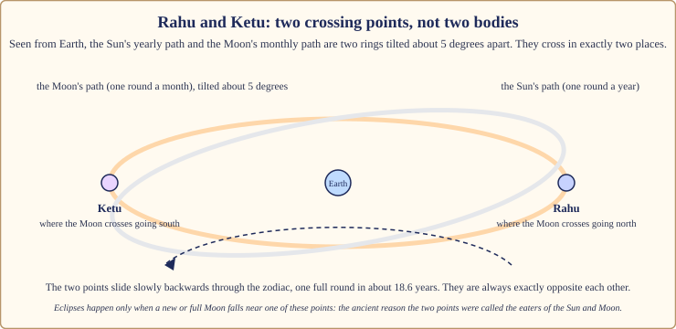
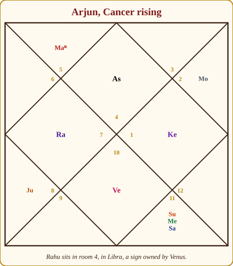
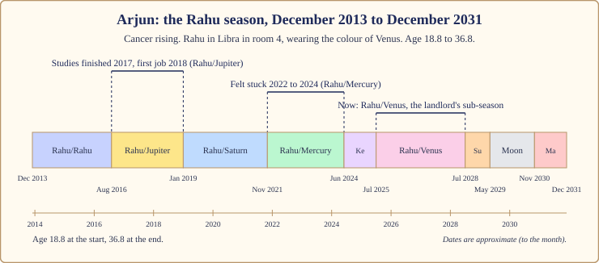
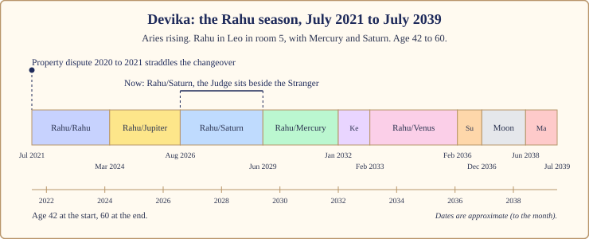

# Chapter 9: The Rahu Season (18 Years): The Great Churning

There is an old story about the churning of the ocean. The gods and the demons pulled a serpent back and forth around a mountain until the sea gave up its treasures, and finally the nectar of immortality. A demon disguised himself, slipped into the line of gods and drank. The Sun and Moon saw him and told. His head was cut off, but the nectar had already passed his throat, so the head lived on: forever hungry, forever swallowing, never full. That head is Rahu. The body, which wants nothing, is Ketu.

I tell you this because the Rahu season is the most misunderstood of the nine, and the story holds the key. It is eighteen years of hunger. Not evil. Hunger. What you do with hunger is the whole season.

## The Stranger takes the keys

In the court, Rahu is the smoke-headed Stranger at the gate. He has no kingdom of his own, no face anyone can quite describe, and he wants everything he sees. He speaks every language a little. He knows the newest machines, the foreign markets, the shortcut. He is magnificent at promising.

When his season begins, the court is pulled outward. Towards the new, the foreign, the big. Towards technology, ambition, strangers, the unconventional. The rules of the household feel small. The Stranger says: there is more, and you can have it. Sometimes he is right. The sudden rises of a lifetime happen in Rahu seasons. So do the sudden falls, and the long fogs in between where nothing is what it seemed.

> **📖 Story: The Stranger takes the keys.** The Commander handed over the keys and the Stranger smiled with a mouth nobody could quite see. Within a year the palace had a telegraph, a foreign cook, three new trade routes and a debt to a kingdom nobody had heard of. The Queen Mother could not sleep. The Priest was told his teachings were old. The King found himself admired by strangers and ignored at home. And yet the treasury doubled, the young people learned languages, and a servant's son became a minister. When the Stranger left eighteen years later, the court could not agree whether it had been robbed or enriched. Both, said the Judge. **Rule:** the Rahu season brings more of everything, including confusion; it rewards those who know what they actually want.

What the season asks of you: **hunger with direction**. Want big, but know what you want. Go far, but keep one honest friend who will tell you when the smoke is just smoke.

## How the Rahu season feels

**Body.** Rahu stands for nerves, the unusual and the hard to diagnose. Sleep is lighter; the mind runs at night. Take care with what you put in the body: intoxicants, shortcuts, miracle diets. Ordinary check-ups matter more than usual because Rahu's complaints are the vague ones.

**Mind.** Restless, ambitious, easily obsessed. You can hold a goal with a grip you never had before. You can also lose a year to a screen. Illusion is the risk: seeing what you want to see, in people and in plans.

**Home.** Far away. The Rahu season moves people: to another city, another country, another kind of community. The family home becomes a place you visit.

**Love.** Unconventional, intense, often outside the circle the family expected. Attraction to the foreign, the different, the unavailable. Relationships that begin in a Rahu season need an honest friend's eyes as well as yours.

**Work.** Technology, foreign companies, new industries, anything that did not exist when your parents started working. Rises come fast and sideways. Titles inflate. The question "is this real?" is worth asking twice a year.

**Money.** Big swings. Money arrives from unexpected directions and leaves the same way. Debt taken for appearances is the Rahu trap. Debt taken for a real build is the Rahu gift.

## The arc: first years, middle, last years

The **first two years and eight months** are Rahu's own sub-season: the fog and the hunger together. People change direction sharply here, often without knowing why. Wanting rises before clarity does.

The **middle**, roughly years three to fifteen, holds Jupiter (two years and five months), Saturn (two years and ten months, the longest), Mercury (two years and seven months), Ketu (a year) and Venus (three years). This is where the season's real work gets done, and where it gets its reputation, for good and ill.

The **last three years** belong to the Sun (eleven months), the Moon (a year and a half) and Mars (a year). The three courtiers Rahu is least at ease with. The hunger starts to meet the heart, and the season closes with a push of will. Then Jupiter arrives, and the changeover from Rahu to Jupiter, hunger to meaning, is one of the great turns of a life (Chapter 15).

> **🔍 Why eighteen years?** **Tradition.** Parashara gives Rahu eighteen of the 120 years and no reason. It is tempting to note that Rahu's actual journey around the sky takes about 18.6 years, and I will note it, but the tradition itself does not make this connection, and the other eight seasons have no such match. Treat it as a coincidence. Everyday parallel: a shop that happens to be eighteen minutes' walk from your house is not eighteen minutes away *because* of your house.

## Why Rahu borrows: the shadow planet

Here is the rule that decides every Rahu season, and the reason most beginners get the season wrong. Rahu has no sign of its own and no nature of its own. **Rahu takes the colour of the planet whose sign it sits in, and of the planets it sits with.** This is the common teaching across Indian practice, not a line from Parashara, and I use it because it works.

*Figure 9.1: Rahu and Ketu are the two points where the Moon's path crosses the Sun's path. They are not bodies. They are always opposite each other and slide backwards through the zodiac, one round in about 18.6 years.*

> **🔍 Why does Rahu borrow its nature?** Two layers. **Astronomy:** Rahu is not a body at all. Seen from Earth, the Sun's yearly path and the Moon's monthly path are two rings tilted about five degrees apart; they cross at two points, and those points are Rahu and Ketu. Eclipses happen only when a new or full Moon falls near one of them, which is why the old stories called them the swallowers of the Sun and Moon. A crossing point has no light, no colour, no nature. **The system's own logic, as common practice reads it:** a shadow takes the colour of whatever it falls on, so Rahu behaves like the lord of the sign it occupies and like the planets beside it. Everyday parallel: a tenant has no address of his own; he uses the landlord's. Ask what kind of house the landlord keeps and you know a great deal about the tenant.

> **📖 Story: The Stranger borrows a coat.** The Stranger arrived at court with no clothes of his own. On the first day he borrowed the Priest's robe, and everyone found him wise. On the second he borrowed the Commander's armour, and everyone found him brave. On the third he borrowed the Minister of Pleasure's silks, and everyone found him charming. "Who is he really?" asked the King. "Whoever he is standing next to," said the Judge, "so look at who is standing next to him." **Rule:** judge Rahu by the lord of its sign and by the planets in its room; Rahu itself is a mirror with an appetite.

So the question for your Rahu season is not "is Rahu good or bad?" It is: which planet owns the sign Rahu sits in, is *that* planet on your side for your rising sign, and who shares the room?

## When Rahu is on your side, and when it tests you

Because Rahu borrows, the table below works differently from the ones in the other season chapters. For each rising sign I list the signs in which Rahu would wear a friendly colour (their lords are on your side), a testing colour (their lords test you) or a mixed one, using Parashara's room-ownership table from Book 1. Companions in the room then shift the result: a planet on your side beside Rahu warms it; a testing planet cools it. Tradition adds that Rahu does best in the growing rooms, 3, 6, 10 and 11, whatever its colour.

| Rising sign | 🟢 Rahu on your side in | 🟡 mixed in | 🔴 Rahu tests you in |
|---|---|---|---|
| Aries | Aries, Scorpio, Leo, Sagittarius, Pisces | Cancer | Taurus, Libra, Gemini, Virgo, Capricorn, Aquarius |
| Taurus | Capricorn, Aquarius, Leo, Gemini, Virgo | Taurus, Libra | Cancer, Sagittarius, Pisces, Aries, Scorpio |
| Gemini | Taurus, Libra, Capricorn, Aquarius, Gemini, Virgo | Cancer | Aries, Scorpio, Sagittarius, Pisces, Leo |
| Cancer | Aries, Scorpio, Sagittarius, Pisces, Cancer | Leo, Capricorn, Aquarius | Taurus, Libra, Gemini, Virgo |
| Leo | Aries, Scorpio, Sagittarius, Pisces, Leo | Cancer | Gemini, Virgo, Taurus, Libra, Capricorn, Aquarius |
| Virgo | Taurus, Libra, Gemini, Virgo | Leo, Capricorn, Aquarius | Aries, Scorpio, Sagittarius, Pisces, Cancer |
| Libra | Capricorn, Aquarius, Gemini, Virgo, Taurus, Libra | Cancer | Sagittarius, Pisces, Leo, Aries, Scorpio |
| Scorpio | Sagittarius, Pisces, Cancer, Leo, Aries, Scorpio | (none) | Gemini, Virgo, Taurus, Libra, Capricorn, Aquarius |
| Sagittarius | Leo, Aries, Scorpio, Sagittarius, Pisces | Gemini, Virgo, Cancer | Taurus, Libra, Capricorn, Aquarius |
| Capricorn | Taurus, Libra, Gemini, Virgo, Capricorn, Aquarius | Leo | Aries, Scorpio, Sagittarius, Pisces, Cancer |
| Aquarius | Taurus, Libra, Capricorn, Aquarius | Gemini, Virgo, Leo | Sagittarius, Pisces, Cancer, Aries, Scorpio |
| Pisces | Aries, Scorpio, Cancer, Sagittarius, Pisces | (none) | Capricorn, Aquarius, Taurus, Libra, Leo, Gemini, Virgo |

> **⚠️ Common mistake:** reading Rahu's season from Rahu's "nature" alone, as if it were simply a hard planet. Two people with Rahu in the same room can have opposite Rahu seasons because the sign, and therefore the landlord, differs. Always find the landlord first.

## The room Rahu sits in changes the story

| Rahu sits in | The Rahu season tends to be about |
|---|---|
| room 1 | an outsized self; reinvention, a new identity, a hunger to be seen |
| room 2 | money and speech in big swings; foreign food, unconventional earning |
| room 3 | bold effort, media, siblings, technology; a growing room, Rahu does well |
| room 4 | home far from home; mother, land and inner peace unsettled, then rebuilt |
| room 5 | children, speculation, unusual studies and loves; big bets of the heart |
| room 6 | rivals and debts fought and won; a growing room, strong for competition |
| room 7 | an unconventional partner or partnership; the public in your life |
| room 8 | sudden changes, hidden matters, research; a deep and foggy season |
| room 9 | foreign teachers, far journeys, a faith remade |
| room 10 | a career that rises sideways and fast; a growing room, Rahu does well |
| room 11 | gains, networks, outsized friends; a growing room, the classic Rahu rise |
| room 12 | foreign lands, hospitals, sleep, spending; the mind goes abroad or inward |

## The sub-seasons that matter most

By the common rule Rahu is at ease with Venus, Saturn and Mercury and hostile to the Sun, Moon and Mars; Jupiter is left out of the list, and I treat him as neutral. For each sub-season ask where the sub-lord sits counted from Rahu. The 6th, 8th or 12th room from Rahu is the wrong room, and that stretch wobbles. One more Rahu rule: the sub-season of Rahu's landlord, the planet whose sign it sits in, brings the whole season's theme to a head.

**Rahu/Rahu (two years and eight months).** Fog and hunger. The direction of life changes, often before the reason is clear. Keep a journal; you will not remember later why you did what you did.

**Rahu/Jupiter (two years and five months).** The Priest sits with the Stranger, and the hunger finds a meaning. Studies completed, a teacher found, a real job, a child. If Jupiter is on your side and in a good room from Rahu, this is the best stretch of the eighteen years.

> **📖 Story: The Stranger and the Priest.** The Stranger wanted the whole library. The Priest said, "Read one book properly first." The Stranger, to everyone's surprise, did. For two years he studied, sat examinations, took a post in the treasury and was seen at the temple. The court relaxed. "Has he changed?" asked the Queen Mother. "No," said the Priest, "but hunger that reads is better than hunger that does not." **Rule:** Rahu/Jupiter gives the hunger a direction; take the exam, finish the degree, accept the real job.

**Rahu/Saturn (two years and ten months, the longest).** The Judge audits the Stranger's promises. Slow, heavy, honest. Work becomes work. Whatever was inflated in the first years deflates here, and whatever was real holds. If Saturn tests you, this is the stretch of the season to take seriously: routine, duty, no shortcuts.

**Rahu/Mercury (two years and seven months).** The clever Prince at the Stranger's desk. Ideas, plans, courses, messages, all at once. When Mercury is on your side, a brilliant stretch of learning and trade. When Mercury tests you or sits in a hard room, cleverness with nowhere to go: the "stuck" years, busy and unmoving.

**Rahu/Venus (three years).** The Minister of Pleasure, and the longest sub-season of all: comfort, love, money, a softening. When Venus is Rahu's landlord, this is the sub-season where the whole season's theme arrives.

## What to do, and what not to do

**Do:** write down the one thing you actually want this year, and read it monthly; keep one honest friend who is allowed to say "that is smoke"; learn the new thing, the language, the machine, the market, because the season rewards it; serve strangers and outsiders in some small regular way (the Stranger's own people); protect your sleep from screens; and, since tradition gives Rahu no weekday of its own and most teachers use Saturday, make Saturday the day you check your plans against reality.

**Do not:** buy a hessonite because someone frightened you (a stone cannot give a hungry mind direction); borrow for appearances; take the intoxicant, the shortcut or the deal that needs to be kept quiet; or decide that a confusing year means a cursed life. Fog lifts. Eighteen years is long, and the sub-seasons inside it are very different from one another.

> **🪔 If you read for others:** never call someone's Rahu season "bad" or "dangerous". Say: "This is a season of big wanting. Let us find out what it is you want, and which of these years asks you to slow down." That sentence has saved more Rahu seasons than any ritual.

## Two lives through the Rahu season

All dates are approximate to the month, as dasha dates always are.

### Arjun, December 2013 to December 2031

Arjun is Cancer rising. His Rahu sits at 12° Libra in room 4, alone. Libra belongs to Venus, so his Rahu wears Venus's colour; and for Cancer rising Venus tests him (she owns rooms 4 and 11). His Venus sits in room 7, Capricorn, a pillar room. So: a Stranger in the home room, dressed as a Minister of Pleasure who is not quite on his side, in a chart whose best planets are Mars, Jupiter and the Moon. A season about home, belonging and relationship, with hunger in it.

*Figure 9.2: Arjun's chart. Rahu sits alone in room 4, in Libra, a sign owned by Venus; Venus sits in room 7. Jupiter in room 5 is 2nd from Rahu.*

He entered at 18.8, in his first year of college. Rahu/Rahu (December 2013 to August 2016) was the fog: three years of wanting several futures at once, which is what nineteen is for.

*Figure 9.3: Arjun's Rahu season, age 18.8 to 36.8. Studies finished and first job in Rahu/Jupiter; the stuck stretch in Rahu/Mercury; Rahu/Venus, the landlord's sub-season, running now.*

Rahu/Jupiter (August 2016 to January 2019) was the Priest with the Stranger. Jupiter is on his side and sits in room 5, the room of study, 2nd from Rahu: a good room. He finished his studies in 2017 and took his first job in 2018. Exactly the story: hunger that reads.

Rahu/Saturn (January 2019 to November 2021): Saturn is neutral for him, sits in room 8 and is outshone by the Sun, 5th from Rahu. The grind of the first years at work, heavy but not in a wrong room.

Rahu/Mercury (November 2021 to June 2024): he felt stuck from 2022 to 2024. Look at why. Mercury tests him (he owns rooms 3 and 12 for Cancer rising) and sits in room 8, a hard room from the rising sign, though 5th from Rahu. Mercury is Rahu's friend by the common rule, so the two got on; the problem was that the Prince had nothing good to offer. Clever years with nowhere to go: busy, unmoving, exactly the Rahu/Mercury I described above.

Rahu/Ketu (June 2024 to July 2025): the headless Sadhu opposite the Stranger, in room 10, the career room. Ketu is always 7th from Rahu. A year of letting go of a path, or of the idea of one.

And now Rahu/Venus (July 2025 to July 2028): the landlord's sub-season. Venus owns the sign Rahu sits in, so these three years bring the whole season's theme to a head: home, partnership, belonging, what he wants his life to look like. Venus sits in room 7, the room of marriage and partners, 4th from Rahu, a pillar: a strong room, not a wrong one. But Venus tests him by ownership, so what arrives comes with a cost or a choice attached. If I were sitting across from Arjun today I would say: this is the stretch where you decide who and where you belong to, and it is worth deciding slowly. Rahu/Sun follows (July 2028 to May 2029), then Rahu/Moon (May 2029 to November 2030), where his strong Moon sits 8th from Rahu, a wrong room: the heart pulling against the hunger. And Rahu/Mars (November 2030 to December 2031), his best planet 11th from Rahu: a strong close, and the bridge to Jupiter at 36.8.

### Devika, July 2021 to July 2039

Devika is Aries rising. Her Rahu sits at 3° Leo in room 5, with Mercury and Saturn. Leo belongs to the Sun, who is on her side, so Rahu's borrowed colour is warm; but both companions test her, which cools it. Mixed, leaning hard, in the room of children and big bets. Her daughter was thirteen when it began.

*Figure 9.4: Devika's Rahu season, age 42 to 60. The property dispute of 2020 to 2021 straddled the changeover from Mars; Rahu/Saturn, with the Judge beside the Stranger, runs now.*

The property dispute of 2020 to 2021 sat exactly on the changeover. In the Mars season's last year the Commander fought for land (room 4, the Sun's room). In the Rahu season's first months the Stranger took over the same fight: outsiders, lawyers, paperwork, people from outside the family. That is what a changeover looks like: the same event, handed from one courtier to another, changing character as it passes.

Rahu/Rahu (July 2021 to March 2024) was the churning and the dispute's long tail. Rahu/Jupiter (March 2024 to August 2026): Jupiter is on her side, at its strongest place, in room 4, but 12th from Rahu, a wrong room. Good things with a cost, or arriving through letting go; by the rule of thumb from Chapter 7, the strength holds. Rahu/Saturn (August 2026 to June 2029) is running now: the Judge sitting beside the Stranger in the children's room, the longest stretch of the season. Work, duty, a daughter at the age of examinations and leaving home. Not a verdict. The stretch to take seriously, with routine and no shortcuts. Rahu/Mercury (June 2029 to January 2032) follows, with Mercury also in the room; then Ketu, and from February 2033 three years of Rahu/Venus, the softening. Her Jupiter season begins in July 2039, at sixty.

## In one breath

- The Rahu season is eighteen years when the smoke-headed Stranger runs the court: hunger, ambition, foreign places, technology, confusion and illusion, sudden rises and falls.
- It asks for hunger with direction: want big, know what you want, keep one honest friend.
- Rahu has no nature of its own; it takes the colour of the lord of its sign and of the planets beside it, and does best in rooms 3, 6, 10 and 11. Find the landlord first.
- The sub-seasons that shape it most are Jupiter (meaning), Saturn (the audit, the longest), Mercury (cleverness, or the stuck years) and Venus (the softening); the landlord's sub-season brings the theme to a head.
- Arjun's Rahu (2013 to 2031) wears Venus's colour from room 4: studies and first job in Rahu/Jupiter, stuck in Rahu/Mercury, and now Rahu/Venus, the landlord's sub-season.
- Devika's Rahu (2021 to 2039) sits with Mercury and Saturn in room 5; the property dispute straddled the changeover from Mars, and Rahu/Saturn runs now.
- Practices, not stones: a written goal, an honest friend, learning the new thing, sleep, and service to strangers.

## Try this

1. Find the sign your Rahu sits in and its lord. Is that lord on your side for your rising sign? Who shares the room? Write Rahu's "borrowed colour" in one line.
2. If you are in or have lived a Rahu season, write down the one thing you most wanted in its first three years. Did you get it? Was it what you thought it was?
3. Mark the landlord's sub-season on your season map. If it is past, what came to a head? If ahead, what would you like to have decided by then?
4. Name your one honest friend. Tell them this week that they are allowed to say "that is smoke".
5. A factual check: using the proportional rule from Chapter 3, which is the longest sub-season inside Rahu's eighteen years, how long is it, and which comes second?

Answers

5. Rahu/Venus, at (18 × 20) ÷ 120 years: three years exactly. Second is Rahu/Saturn, at (18 × 19) ÷ 120 years: two years, ten months and six days.

