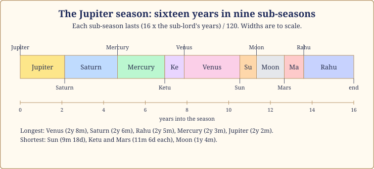
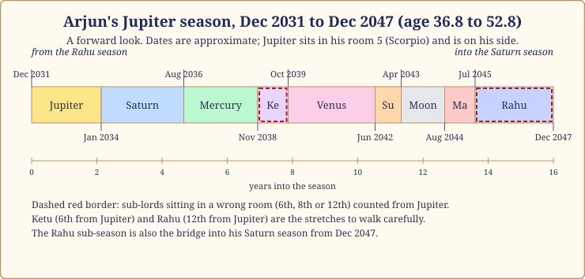
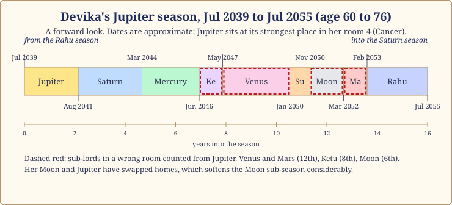

# Chapter 10: The Jupiter Season (16 Years): Growth and Grace

If you asked a hundred people which season they would choose, most would choose this one. Jupiter is the planet the old books call the great benefic, the Royal Priest of our court, the one who blesses weddings, teaches the children and keeps the King honest. Sixteen years with the Priest running the household sounds like sixteen years of grace.

Often it is. I have watched this season bring a late child, a first house, a teacher who changed a life, a faith that finally felt like the person's own. I have also sat across from people halfway through a Jupiter season who were confused and a little ashamed: "Everyone told me these would be my best years. Why do I feel heavier, slower and poorer?" This chapter is for both. Jupiter's season is the season of growth, and growth is not the same as ease. Some things grow that you wanted, and some that you did not. As in every chapter of this part, the dates for our case-study lives are approximate, to within a month or two.

## The Priest runs the household

> **📖 Story: The Priest takes the keys.** When the Royal Priest's turn came to run the palace, the courtiers relaxed. The first thing he did was open the storerooms and feed everyone. He hired tutors for the children, invited scholars from distant kingdoms, and blessed every marriage proposal at the gate. By the third year the treasury was lower, the kitchen busier, and every courtier had put on weight, including the Priest. "You are generous to a fault," said the Judge. "Yes," said the Priest, "and in my years the fault and the generosity come together. Learn to tell them apart." **Rule:** Jupiter's season expands whatever it touches: wisdom, children, faith, money, and also waistlines, debts and promises made too freely.

The season asks three things. **Grow in the right direction:** Jupiter stands for wisdom, teachers, children, faith, law and wealth, and this is when those doors open; walk through the ones that matter instead of saying yes to all of them. **Give, and learn to receive:** you become the one the family turns to for advice, loans and blessings, which is lovely and can hollow you out; the season also asks you to let others help you. **Believe in something:** not necessarily a religion. The season raises the question "what do I actually believe?" and rewards an honest answer.

## How it feels

**Body.** Jupiter is the planet of fat and the liver in the old lists. Many people gain weight, especially in the Jupiter and Venus sub-seasons. A period to take the liver, blood sugar and weight seriously, with kindness rather than panic.

**Mind.** Calmer and broader than the Rahu season that usually precedes it. People read more, think about meaning more, are more easily moved by a teacher. The shadow is complacency.

**Home.** Children arrive, grow up, or leave for study. Elders lean on you. The home fills with guests; someone revives an old family practice.

**Love.** Jupiter is the planet of marriage, and of the husband, in a woman's chart in the traditional reading; in anyone's it favours commitment over flirtation. Where Jupiter tests you, it can bring a partner or in-law who is more preacher than companion.

**Work.** Teaching, law, finance, advising, publishing, counselling: anything paid for judgement rather than speed. A mentor appears, or you become one.

**Money.** More comes in, and more goes out. Jupiter is wealth, but also the open hand. The people who finish richer treated generosity as a budget line.

## The arc of sixteen years

**The first year.** Jupiter's own sub-season, usually a relief after Rahu. Something lifts; a blessing arrives early. It is also where the overspending starts, because everything feels possible.

**The middle.** Years two to eleven hold the long Saturn, Mercury, Ketu and Venus sub-seasons: a child's education, a long project, a slow rise in standing. The Saturn stretch corrects the complacency; the Venus years, around nine to eleven, are the sweetest.

**The last year.** The Rahu sub-season closes the season, the Stranger walking the Priest's halls. The hunger returns just as Saturn's season approaches. Hold steady; Chapter 15 covers that changeover.

*Figure 10.1: The sixteen-year Jupiter season in its nine sub-seasons, to scale. Venus, Saturn and Rahu take the longest stretches.*

> **🔍 Why sixteen years, and why weight?** The length is tradition: Parashara's 120-year timetable gives Jupiter 16 years and no reason, and I will not invent one. The weight is the system's own logic: Jupiter is the planet that stands for fat, the liver and abundance, so its season brings abundance to the body as readily as to the bank. Everyday parallel: the relative whose house you always leave heavier, in every sense.

## When Jupiter is on your side, and when it tests you

Here is the part most books leave out, and the part that most often explains a disappointing Jupiter season. Whether a planet is on your side depends on your rising sign, because the rising sign decides which rooms that planet owns. Jupiter owns Sagittarius and Pisces. For some rising signs those fall in the lucky rooms; for others, in the hard or greedy ones.

| Rising sign | Jupiter owns rooms | Jupiter and you | The season tends to bring |
|---|---|---|---|
| Aries | 9 and 12 | 🟢 on your side | fortune, teachers, long journeys, faith |
| Taurus | 8 and 11 | 🔴 tests you | gains with strings, sudden changes, in-law matters |
| Gemini | 7 and 10 | 🔴 tests you | marriage and career both demanding |
| Cancer | 6 and 9 | 🟢 on your side | fortune wins over struggle; protection |
| Leo | 5 and 8 | 🟢 on your side | children, creativity, inheritance handled well |
| Virgo | 4 and 7 | 🔴 tests you | home and partner heavy; growth as obligation |
| Libra | 3 and 6 | 🔴 tests you | effort, competition, debts, health routines |
| Scorpio | 2 and 5 | 🟢 on your side | wealth, speech, children, learning |
| Sagittarius | 1 and 4 | 🟢 on your side | self and home flourish; your own planet's season |
| Capricorn | 3 and 12 | 🔴 tests you | expenses, foreign places, effort for little return |
| Aquarius | 2 and 11 | 🔴 tests you | money comes; ambition outgrows wisdom |
| Pisces | 1 and 10 | 🟢 on your side | identity and career grow together; your own planet's season |

> **🔍 Why can the great benefic's season disappoint?** This is the system's own logic, set out by Parashara. Lords of the three lucky rooms (1, 5, 9) help you; lords of rooms 3, 6 and 11 work against you; and a naturally kind planet that owns the pillar rooms (4, 7, 10) loses its kindness there, because the pillars demand action and a priest is not built for action. So for Taurus, Gemini, Virgo, Libra, Capricorn and Aquarius rising, Jupiter owns the wrong rooms, and its season gives Jupiter's themes (teachers, children, faith, expansion) through Jupiter's hardest offices: debt, obligation, the in-laws, the heavy career. The great benefic has not turned cruel; he has been given the wrong job. Everyday parallel: the kindest uncle in the family is made treasurer of the housing society. He is still kind. He is also now the man who chases you for the maintenance money.

If Jupiter tests you, do not dread this season. It still brings learning and growth; it simply sends the bill with them: the child who needs expensive schooling, the promotion that eats your evenings, the guru who wants a donation. Knowing this in advance is most of the protection you need.

## The room Jupiter sits in changes the story

| Jupiter in room | The season leans towards |
|---|---|
| 1 | you become the wise one; weight and dignity both increase |
| 2 | family wealth, good food, a persuasive voice; watch indulgence |
| 3 | writing, teaching siblings, short pilgrimages |
| 4 | a house, a car, mother's blessing; Jupiter's happiest room |
| 5 | children, students, creative work, a faith of your own |
| 6 | service, debts paid down, health through discipline |
| 7 | a marriage or partnership that teaches |
| 8 | inheritance, research, slow transformation; faith tested |
| 9 | the classic room: a guru, long journeys, father's fortune, grace |
| 10 | a visible rise at work, a reputation for judgement |
| 11 | gains, elder siblings, a wide circle; ambition dressed as wisdom |
| 12 | foreign lands, retreats, expenses on good causes |

Chapter 13 takes this further. For now, hold the room and the "on your side or tests you" column together, and you have the skeleton of the season.

## The sub-seasons that matter most

Every sub-season is a conversation between the season lord and the sub-lord, and two questions decide its tone, as Chapter 3 explained: are they friends, and where does the sub-lord sit counted from the season lord? A sub-lord in the 6th, 8th or 12th room counted from Jupiter is in a "wrong room", and that sub-season works against the season's promises even if the planets are friendly. Four stretches matter most.

**Jupiter/Jupiter (the first 2 years 2 months).** The Priest alone. If Jupiter is on your side, blessings; if it tests you, the first bills arrive dressed as opportunities. Whatever happens here is the theme of the next fourteen years.

**Jupiter/Saturn (2 years 6 months).** The Priest and the Judge are neutral to each other, the best Saturn gets from anyone. Still, the season slows here: delays in children's matters, a demanding senior, a parent's needs. It usually passes with something solid built.

**Jupiter/Mercury (2 years 3 months).** Not friends; Jupiter finds Mercury clever without being wise, and Mercury finds Jupiter long-winded. A busy sub-season of paperwork, exams and arguments about money: good for study, bad for grand decisions.

**Jupiter/Rahu (the last 2 years 5 months).** The Stranger closing the Priest's season. Ambition returns, often as a foreign offer or a scheme. Because it leads straight into Saturn, treat it as a bridge: finish things, do not start a loan.

> **📖 Story: The Priest and the Judge count the grain.** In the Priest's third year the Judge came to the storeroom with his ledger. "You have promised grain to four villages, and we have grain for two." The Priest was wounded. "I promised in good faith." "Faith is yours," said the Judge, "arithmetic is mine." They sat up all night and found a way: two villages now, two after the harvest, and the Priest himself would write to each and explain. The villages loved him more for the honest letter than for the grain. **Rule:** the Saturn sub-season inside a Jupiter season turns promises into schedules; meet it with honesty and it strengthens the season.

## What to do, and what not to do

This season rewards practices more than purchases, whether Jupiter is on your side or tests you.

- **Teach something.** A niece's maths, a colleague's spreadsheet. Jupiter's season flows best when knowledge moves through you rather than piling up in you.
- **Keep a generosity budget.** Decide in advance what you give each month, in money and in time, and give it gladly. Say no to the rest without guilt. This one habit separates those who finish richer from those who finish tired.
- **Find a teacher and check them.** A good one makes you more capable; a poor one makes you more dependent. Notice which way you are moving after six months.
- **Thursday as a quiet day.** Jupiter's day in the tradition: a simpler meal, a chapter of something worth reading, yellow lentils or turmeric given to someone who cooks for others. The rhythm matters, not the ritual.
- **Do not** buy a yellow sapphire because a shop said your Jupiter is weak. If Jupiter tests you, strengthening it is the opposite of what you want; if it is on your side, conduct does more than a stone.
- **Do not** stand guarantor for anyone's loan in the Rahu sub-season.

> **🧭 Anushka's rule of thumb:** In a Jupiter season, say yes to learning and no to lending. Most of the regret I hear about from these sixteen years comes from the second kind of yes.

## Two lives approaching the Priest's years

None of our three case-study people is in a Jupiter season as I write; two are approaching it, so this is a forward look. The dates are solid, because the timetable is arithmetic. The texture is a reading of tendencies, the kind of thing I would say to a friend over tea, not a prophecy.

*Figure 10.2: Arjun's Jupiter season, December 2031 to December 2047. The dashed sub-seasons are those whose lords sit in a wrong room counted from his Jupiter.*

**Arjun, Cancer rising.** His Rahu season ends around December 2031, and Jupiter runs until December 2047, from age 36.8 to 52.8. For Cancer rising Jupiter owns rooms 6 and 9, and the 9th wins: Jupiter is on his side. It sits in his room 5, Scorpio, the room of children, students and creative work, in the sign of his best planet, Mars. On paper this should feel like coming home after a long hard trip: a teacher, perhaps a child, work that uses his judgement rather than only his hours.

Counting rooms from Jupiter in Scorpio: his Saturn, Sun and Mercury in Aquarius are 4th from it, Venus 3rd, the Moon 7th, Mars 10th; none in a wrong room. Two are: Ketu in Aries, 6th from Jupiter (around November 2038 to October 2039), and Rahu in Libra, 12th (around July 2045 to December 2047). So the first dozen years look clear, with the usual Saturn slowing from early 2034 to mid 2036; the short Ketu stretch may bring a withdrawal he should not act on hastily; and the closing Rahu years are his bridge into Saturn, where I would want him finishing things. That is as far as I will go.

*Figure 10.3: Devika's Jupiter season, July 2039 to July 2055, age 60 to 76. Several sub-lords sit in wrong rooms from her Jupiter, but her Jupiter itself is unusually strong.*

**Devika, Aries rising.** Her Jupiter season runs from around July 2039 to July 2055, age 60 to 76. For Aries rising Jupiter owns rooms 9 and 12, and again the 9th wins. Her Jupiter sits at its strongest place, Cancer, in her room 4, the room of home, mother and inner peace, beside her Sun; and her Moon and Jupiter have exchanged homes, which the tradition reads as a binding of mind and wisdom.

This is the chart of someone who could become the grandmother everyone consults. Four sub-lords do sit in wrong rooms from her Jupiter: Venus and Mars in Gemini (12th), Ketu in Aquarius (8th), the Moon in Sagittarius (6th, softened by that exchange). So the Venus years, around May 2047 to January 2050, may bring expenses and a quieter social life rather than the usual sweetness. Against that, a Jupiter this strong in the room of home tends to carry its season. If I were reading for her in 2039 I would say: this is your season to teach, to settle, to give the household its shape. Keep the generosity budget. Enjoy it.

> **📖 Story: The Priest's two pupils.** The Priest once took two pupils. The first came from the lucky rooms of the palace, and every lesson landed softly. The second was the treasurer's son, and every lesson came with a cost: a fee, a duty, a ledger to balance. Years later both were wise. "Who learned more?" asked the King. "The same," said the Priest. "Who paid more?" "The second. And he will never lend grain he does not have." **Rule:** when Jupiter tests you, the season still teaches; it only charges tuition.

## In one breath

- The Jupiter season is sixteen years when the Royal Priest runs the household: teachers, children, faith, law, wealth and expansion of every kind, including weight and debt.
- It asks you to grow in the right direction, to give within a budget, and to decide what you believe.
- Whether Jupiter is on your side depends on your rising sign; for Taurus, Gemini, Virgo, Libra, Capricorn and Aquarius rising it owns the wrong rooms, and its blessings arrive with a bill.
- Watch Jupiter/Jupiter (the theme), Jupiter/Saturn (the audit), Jupiter/Mercury (the paperwork) and Jupiter/Rahu (the bridge into Saturn); a sub-lord in the 6th, 8th or 12th room from Jupiter works against the season.
- Practices beat stones: teach, give on a budget, check your teachers, keep Thursdays simple.
- Arjun enters this season around December 2031 and Devika around July 2039; both have Jupiter on their side, with a few sub-seasons to walk carefully.

## Try this

1. Find your rising sign in the table. Note which rooms Jupiter owns for you and whether it is on your side. If you have lived through any of a Jupiter season, write three things that grew in those years. Were they the things you wanted?
2. In a free app, find your Jupiter season, past or future, and mark the Jupiter/Saturn and Jupiter/Rahu sub-seasons. If they are past, what slowed in the first and what tempted you in the second?
3. Count the rooms from your Jupiter to each other planet. Which sit in the 6th, 8th or 12th from it? Note those sub-seasons' dates.
4. Write your generosity budget for one month, in money and in hours, and keep it.
5. A factual check: for Cancer rising, which rooms does Jupiter own, and why is it counted as on your side?

Answers

5. Sagittarius and Pisces are rooms 6 and 9 for Cancer rising. Parashara's rule treats the lord of a lucky room (1, 5 or 9) as on your side, and the 9th outweighs the 6th; Arjun's chart is an example.

