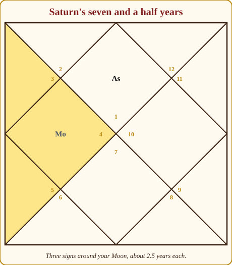

# Chapter 11: The Saturn Season (19 Years): The Long Audit

Nobody comes to me excited about their Saturn season. They come with the phrase "Saturn is coming" said the way you would say a monsoon is coming to a house with a leaking roof. Some have been told by a relative or a website that these will be the hard years. Some have been offered a blue sapphire at a price that made them call me first.

So let me say at the start what I will say again at the end. The Saturn season is nineteen years when the old Judge of Labour runs the household. It is slow, it is serious, and it does not let you skip steps. It is also, in my experience, the season that builds the most. People come out of it with a house they paid for, a skill they actually have, a body they finally look after, and a very short list of friends who are real. It is the season people fear and the one they thank, usually about ten years later.

None of our three case-study lives is in a Saturn season yet, so this chapter leans on a composite, a man I read for who was in Saturn/Saturn at 52, with Meera's far-future Saturn season as a note. Dates for the case-study lives are approximate, to within a month or two.

## The Judge runs the household

> **📖 Story: The Judge opens the ledger.** When the old Judge of Labour took the keys, he did not open the storerooms as the Priest had. He opened the ledger. Every courtier was called in and shown their page: what they had promised, what they had done, what they had borrowed and from whom. The Minister of Pleasure wept. The Prince talked very fast. The Commander tried to leave and found the gate locked. "I am not punishing anyone," said the Judge. "I am reading. Then we will work, every day, until the pages balance. After that you will be free in a way you have never been." The courtiers who worked grew strong. The ones who argued with the ledger grew old. **Rule:** Saturn's season is an audit, not a sentence; the work it asks for is the work you were always going to have to do.

The season asks three things. **Do the work, slowly:** Saturn stands for labour, discipline, delay and endurance, and whatever you have been avoiding (the qualification, the debt, the difficult conversation, the body) comes to the front of the queue and stays there. **Accept limits:** time, money, energy, other people's willingness; this season teaches the difference between what you want and what you can carry, a humbling and finally a relieving lesson. **Serve someone:** Saturn is the servant in the court, the planet of workers, elders, the poor and the chronically unwell, and the season goes better for people who have someone to look after.

## How it feels

**Body.** Bones, teeth, joints, nerves, and anything chronic rather than sudden. Fatigue is the common complaint. This is a period to take long-term health seriously: sleep, posture, the back, a yearly check. Nothing dramatic is written; neglect is what Saturn charges for.

**Mind.** Sober. Many describe the first years as a grey filter, not sadness exactly but a loss of lightness. Later this settles into a steadiness they would not trade. If the greyness becomes an inability to get out of bed, that is a doctor's matter, not astrology, and I say so plainly to everyone.

**Home.** Responsibility for elders. Repairs. A move that is practical rather than exciting. Fewer guests, more quiet.

**Love.** Saturn tests commitments, which strengthens the real ones and exposes the rest. Loneliness is a theme even inside a good marriage: the sense of carrying something alone. Couples who say this aloud do well.

**Work.** Saturn's real home. Long hours, slow rises, recognition that comes late and lasts. Trades, building, land, government, medicine, labour of every kind. Careers here are made of brick instead of paper.

**Money.** Slow and steady, with a bias towards paying down rather than piling up. Savings grow in the dull way that works. Debt is the one thing this season punishes consistently.

## The arc of nineteen years

**The first year.** The Saturn/Saturn sub-season opens the season and lasts a full three years, so the "first year" is really a first phase, often the heaviest stretch of the nineteen. Something is taken off the table: a plan, a comfort, an illusion. Hold on; this phase ends.

**The middle.** From about year three to year fourteen the season runs through Mercury, Ketu, Venus, Sun, Moon and Mars. The Venus stretch, around years six to nine, is the kindest: comfort returns, relationships warm. The short Sun, Moon and Mars years that follow are where the building becomes visible to others.

**The last year.** The season ends with Rahu and then Jupiter, and the Jupiter stretch (the final two and a half years) is where Saturn pays. The old books say Saturn gives his results late, and this is the lateness: the promotion, the finished house, the respect of people who watched you work. Then comes the changeover to Mercury, a lightening that can feel almost giddy.

*Figure 11.1: Nineteen years in nine sub-seasons, by age, for the composite man who began his Saturn season at 52. Saturn's own sub-season takes the first three years.*

> **🔍 Why nineteen years, and why so slow?** Two different answers, and I want to keep them apart. The length is tradition: Parashara's 120-year timetable gives Saturn 19 years and gives no reason, and I will not invent one. The slowness is astronomy: Saturn takes about 29.5 years to go once around the sky, about two and a half years in each sign, the slowest of the visible planets. The ancients watched the slowest hand on the clock and gave it the meanings of slowness: delay, age, endurance, things that last. Everyday parallel: the hour hand on a wall clock seems not to move while you watch it, yet it is the hand that tells the real time.

## When Saturn is on your side, and when it tests you

Saturn owns Capricorn and Aquarius; your rising sign decides which rooms those are, and this table decides more about your Saturn season than any general description.

| Rising sign | Saturn owns rooms | Saturn and you | What the season tends to bring |
|---|---|---|---|
| Aries | 10 and 11 | 🔴 tests you | career pressure and ambition without ease; gains that cost |
| Taurus | 9 and 10 | 🟢 on your side, your best planet | fortune through work; a late, lasting rise |
| Gemini | 8 and 9 | 🟢 on your side | slow luck, inheritance, deep study; quiet building |
| Cancer | 7 and 8 | 🟡 neutral | partnership and hidden matters tested; neither friend nor foe |
| Leo | 6 and 7 | 🔴 tests you | work, health routines and marriage all under audit |
| Virgo | 5 and 6 | 🟡 neutral | children and service weigh; discipline rewarded in study |
| Libra | 4 and 5 | 🟢 on your side, your best planet | home, property and children built solidly |
| Scorpio | 3 and 4 | 🔴 tests you, mildly | effort for home and comfort; demanding but fair |
| Sagittarius | 2 and 3 | 🔴 tests you | money and family matters slow; courage must be earned |
| Capricorn | 1 and 2 | 🟢 on your side | your own planet's season; identity and wealth mature |
| Aquarius | 12 and 1 | 🟢 on your side | your own planet's season; solitude turns into strength |
| Pisces | 11 and 12 | 🔴 tests you | expenses and foreign places; gains that leave as they come |

> **🔍 Why?** The system's own logic from Parashara. A naturally hard planet that owns a lucky room (1, 5 or 9) becomes your worker rather than your warden, and one that owns a pillar room (4, 7 or 10) loses its harshness there. That is why Saturn is the best planet of all for Taurus and Libra rising: it owns a lucky room and a pillar room at once. For Aries, Leo, Sagittarius and Pisces it owns rooms 3, 6, 11 or 12, the rooms of effort, struggle, greed and loss, and there it keeps its old sternness. Everyday parallel: a strict teacher is a gift when she is teaching your child, and a burden when she is your landlord.

When Saturn is on your side, the slowness builds things that are yours. When it tests you, the same slowness feels like obstruction, and the answer is not to fight Saturn but to out-work it: do the dull thing, on time, for years. I have never seen it not work.

## The room Saturn sits in changes the story

| Saturn in room | The season leans towards |
|---|---|
| 1 | you age into yourself; responsibility, stiffness, a serious face |
| 2 | slow money, careful speech, duty to family; savings that finally stick |
| 3 | effort rewarded; work with the hands, siblings' burdens, courage learned |
| 4 | home repairs, mother's care, property through patience; a quiet house |
| 5 | children's matters delayed or demanding; disciplined study |
| 6 | Saturn's good room: debts cleared, enemies outlasted, service, health routines |
| 7 | marriage tested and matured; partnerships that need contracts |
| 8 | the long transformation; inheritance questions, research, chronic matters managed |
| 9 | a late teacher, long journeys for work, father's affairs; faith with discipline |
| 10 | Saturn's other good room: a career built brick by brick; respect late and lasting |
| 11 | gains through labour, elder siblings' needs, a smaller but truer circle |
| 12 | foreign work, hospitals as service, solitude, expenses that teach |

## Saturn's seven and a half years inside a Saturn season

Now the thing people fear most, and the thing I most want to explain clearly.

Saturn's seven and a half years (Sade Sati) is weather, not season. It is the stretch when Saturn, moving overhead now, passes through the sign before your Moon, your Moon's own sign, and the sign after it: three signs at about two and a half years each. Everyone gets it roughly every thirty years, in any season; Chapter 14 explains the weather in full. But when this weather falls inside a Saturn season, you hear the Judge twice: once through the season, once through the sky. Of all the stretches in all nine seasons, this is the one I would call the heaviest. Not the worst; the heaviest. There is a difference.

*Figure 11.2: The audit years. A nineteen-year Saturn season with a seven-and-a-half-year band of Saturn's weather inside it. The band can fall anywhere in the season, or miss it entirely.*

> **🔍 Why is this the heaviest stretch, and why does it build the most?** Both answers are the system's own logic. Heaviest: the season says which planet's themes fill your years, and the weather says which planet is pressing on your mind (the Moon) right now. When both are Saturn, there is no second voice to soften the first; the same lesson arrives through your circumstances and through your mood. Builds the most: Saturn stands for labour, longevity and anything that lasts, and the tradition, Parashara included, says Saturn gives his results late and keeps them. Whatever you make while two Saturns are watching is made properly, because nothing less survives the audit. Everyday parallel: a bridge inspected by two engineers takes twice as long to approve, and it is the bridge you drive over without thinking for forty years.

*Figure 11.3: Saturn's walk over the three signs around your Moon, drawn on a North Indian chart. The Moon here is in the 4th room; Saturn's weather covers the 3rd, 4th and 5th.*

> **📖 Story: The Judge visits the Queen Mother.** In his seventh year as head of the household, the Judge went to live in the Queen Mother's wing for a while, as he does every thirty years. She had always run the mood of the palace, and now the mood was his: sober breakfasts, early nights, every worry written down and dated. The courtiers said the palace had never been so gloomy. The Queen Mother said it had never been so honest. "He does not frighten me. He only asks me what is true, and then he helps me carry it." When he left two and a half years later, her accounts were clear for the first time in her life. **Rule:** when Saturn's weather crosses your Moon inside a Saturn season, the task is honesty about your own mind; it is the heaviest stretch and the most clarifying.

## The sub-seasons that matter most

As always: is the sub-lord a friend of Saturn, and in which room does it sit counted from Saturn? A sub-lord in the 6th, 8th or 12th room from Saturn is in a wrong room, and its sub-season pulls against the season even when the planets are friendly. Four stretches matter most.

**Saturn/Saturn (the first 3 years).** The Judge alone, the longest opening sub-season of any planet. If Saturn is on your side, this lays a foundation that carries nineteen years; if it tests you, the avoided work becomes unavoidable. Either way, the only thing that helps is to start.

**Saturn/Mercury (2 years 8 months).** Friends, and a working sub-season: training, qualifications, paperwork, a job that uses the mind in a disciplined way. If Mercury sits in a wrong room from Saturn, the paperwork is about debts or disputes.

**Saturn/Venus (3 years 2 months).** The longest sub-season in the season and the kindest. Saturn and Venus are friends; the Minister of Pleasure is let back into the Judge's palace, with a budget. Comfort, relationships, a purchase for the home. If Venus is in a wrong room from Saturn, expect expense and strain instead, so check.

**Saturn/Jupiter (the last 2 years 6 months).** The Priest arrives to close the Judge's season: the paying-out stretch, where nineteen years of work become visible, and the bridge into the Mercury season.

## What to do, and what not to do

Practices, not stones. In nineteen years you will be offered a blue sapphire more than once. Decline.

- **Pick one dull thing and do it daily.** A walk, a page of a textbook, a ledger. Saturn's season rewards repetition, not intensity. The habit you keep for nineteen years is what you will have at the end.
- **Serve someone below you in the world's eyes.** The domestic worker, the watchman, the elderly neighbour, the stray dog. Saturn is their planet. I know no better practice for this season.
- **Saturday as a plain day.** Saturn's day in the tradition: simple food, an early night, a lamp of mustard oil if that is your family's way, black sesame or a blanket given to someone who needs it. Rhythm over form.
- **Tell the truth about money.** Write down what you owe and to whom. The Judge's ledger is less frightening when you hold the pen.
- **Protect sleep and the back.** Boring advice. Saturn is a boring planet. It works.
- **Do not** borrow to look prosperous. Debt is the one thing this season punishes without exception.
- **Do not** mistake the season's greyness for a verdict on your life. It is a filter, and it lifts.

> **🪔 If you read for others:** Never say "Saturn is coming" and leave it there. Tell them the three things: it is slow, it builds, and here are the sub-seasons where it eases. If they describe hopelessness that does not lift, send them to a doctor the same week.

## A man in Saturn/Saturn at 52

Since none of our case-study lives has reached this season, here is a composite from my notebook. Call him R. He came to me at 52, two years into his Saturn season, in Saturn/Saturn, with Saturn's seven and a half years also running over his Moon. Both voices at once.

He was a mid-level manager in a manufacturing firm, Taurus rising, which means Saturn owned his rooms 9 and 10 and was his best planet. Nobody had told him this. He had been told, by a relative and by an app, that his Saturn years would be his undoing. He described the previous two years: a restructuring that took his comfortable role and gave him a harder one running a plant, his father's health needing his weekends, a loan for a flat that ate half his salary, and a persistent tiredness he put down to age. He asked how long until it ended.

I showed him the table above and asked him to read the Taurus row aloud. Then I told him the honest thing: Saturn/Saturn would run until about his fifty-fifth birthday; the seven and a half years would lift about three years after that; the Mercury sub-season would bring training and systems he would be good at; and the Venus years, from about 58 to 62, would be when the flat felt like a home and the plant job turned into a reputation. I asked him to do three things: keep the loan payments as the first line of every month, find one person at the plant to mentor, and see a doctor about the tiredness rather than blaming the planet. He did all three. The tiredness had an ordinary cause, now managed.

I cannot tell you how his season ends; he is still in it. At 56 he told me the plant was the best work he had ever done, and that he no longer thought of Saturn as the enemy. He thought of him as the man with the ledger who had, for once, been on his side.

**A note on Meera.** Her Saturn season lies far ahead: around May 2084 to June 2103, from age 95.5, with Saturn/Saturn running until about June 2087. For Scorpio rising Saturn tests her mildly, owning rooms 3 and 4, and hers sits in room 2, outshone by the Sun. If she reaches it, it will be a season of family duty and careful speech at the very end of a long life. Arjun's begins around December 2047, at 52.8, the age of our composite, which is one reason I chose him. Chapter 16 reads all three lives in full.

> **📖 Story: The Judge's late payment.** On the last day of his nineteen years, the courtiers gathered to see the Judge hand back the keys, expecting a lecture. Instead he opened the ledger to the last page and read out what each of them now owned: the Commander, a fortress built stone by stone; the Minister, a garden tended through two droughts; the Prince, a library of everything he had learned when he stopped talking. "You thought I was taking," said the Judge. "I was holding. Here it is." **Rule:** Saturn gives late and gives what lasts; the end of the season is where the work is paid.

## In one breath

- The Saturn season is nineteen years when the old Judge of Labour runs the household: work, limits, duty to elders, loneliness, maturity and slow rewards.
- The length is tradition; the slowness is astronomy, from Saturn's 29.5-year walk around the sky.
- Whether Saturn is on your side depends on your rising sign; it is the best planet of all for Taurus and Libra rising and the sternest for Aries, Leo, Sagittarius and Pisces.
- Saturn's seven and a half years is weather, not season; inside a Saturn season both voices say the same thing, which makes it the heaviest stretch in the timetable and the one that builds the most.
- Watch Saturn/Saturn (the weight lands), Saturn/Mercury (the training), Saturn/Venus (the kindness) and Saturn/Jupiter (the payment).
- Practices, not stones: one dull daily habit, service to someone below you, plain Saturdays, honesty about money, no new debt.
- Hopelessness that does not lift is a doctor's matter, never a planet's.

## Try this

1. Find your rising sign in the table and note whether Saturn is on your side, tests you or is neutral, and which rooms it owns for you. If you have lived through any of a Saturn season, write what you built in those years, however small.
2. In a free app, find your Moon sign and work out when Saturn's seven and a half years last ran or will next run. Does that band fall inside your Saturn season? Mark it on your season map.
3. Choose the one dull daily thing you would keep for nineteen years. Write it down. Start tomorrow, whichever season you are in.
4. Think of the most Saturn-like person you know: slow, reliable, a little stern, always there. What did their fifties look like?
5. A factual check: why is Saturn's seven and a half years that long, and is the length tradition or astronomy?

Answers

5. Saturn takes about two and a half years to cross one sign, and the stretch covers three signs (the one before your Moon, the Moon's own sign, and the one after). Three times two and a half is seven and a half. The length is astronomy, from Saturn's orbit; the choice of these three signs around the Moon is tradition.

