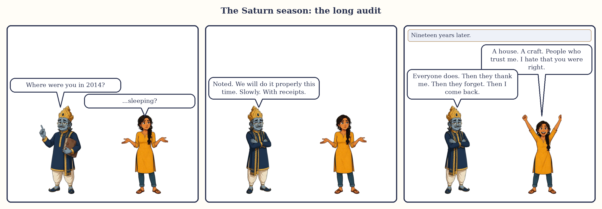
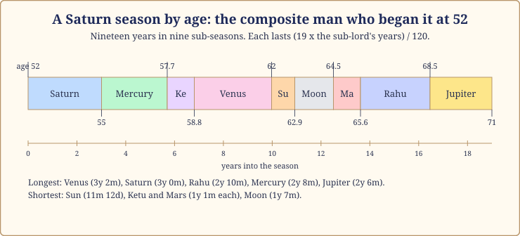
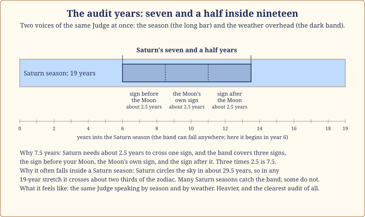

# Chapter 11: The Saturn Season (19 Years): The Long Audit

Nobody comes to me excited about their Saturn season. They come with the phrase "Saturn is coming" said the way you would say a monsoon is coming to a house with a leaking roof.

The Saturn season is nineteen years when the old Judge of Labour runs the household. It is slow, serious, and it does not let you skip steps. It is also, in my experience, the season that builds the most: a house paid for, a skill actually learned, a body finally looked after, a short list of friends who are real. It is the season people fear and the one they thank, usually about ten years later.

None of our three case-study lives is in a Saturn season yet, so this chapter leans on a composite, a man I read for in Saturn/Saturn at 52, with Meera's far-future season as a note. Dates are approximate, to within a month or two.

*The Saturn season in three panels.*

## The Judge runs the household

> **📖 Story: The Judge opens the ledger.** When the old Judge of Labour took the keys, he did not open the storerooms as the Priest had. He opened the ledger. Every courtier was shown their page: what they had promised, done and borrowed. The Minister of Pleasure wept; the Prince talked very fast; the Commander found the gate locked. "I am not punishing anyone," said the Judge. "I am reading. Then we will work until the pages balance, and after that you will be free in a way you have never been." The courtiers who worked grew strong. The ones who argued with the ledger grew old. **Rule:** Saturn's season is an audit, not a sentence; the work it asks for is the work you were always going to have to do.

The season asks three things. **Do the work, slowly:** Saturn stands for labour, discipline, delay and endurance, and whatever you have been avoiding (the qualification, the debt, the body) comes to the front of the queue and stays there. **Accept limits:** the season teaches the difference between what you want and what you can carry. **Serve someone:** Saturn is the servant in the court, the planet of workers, elders and the poor, and the season goes better for people who have someone to look after.

## How it feels

**Body.** Bones, teeth, joints, nerves, anything chronic rather than sudden; fatigue is the common complaint. A period to take long-term health seriously: sleep, posture, the back, a yearly check.

**Mind.** Sober. Many describe the first years as a grey filter, not sadness exactly but a loss of lightness; later it settles into a steadiness they would not trade. If the greyness becomes an inability to get out of bed, that is a doctor's matter.

**Home.** Responsibility for elders, repairs, a practical move, fewer guests.

**Love.** Saturn tests commitments, which strengthens the real ones and exposes the rest. Loneliness is a theme even inside a good marriage.

**Work.** Saturn's real home: long hours, slow rises, recognition that comes late and lasts.

**Money.** Slow and steady, paying down rather than piling up; debt is what this season punishes.

## The arc of nineteen years

**The first year.** The Saturn/Saturn sub-season lasts three years, so the "first year" is really a first phase, often the heaviest of the nineteen. Something is taken off the table: a plan, a comfort, an illusion.

**The middle.** From about year three to fourteen the season runs through Mercury, Ketu, Venus, Sun, Moon and Mars. The Venus stretch, around years six to nine, is the kindest; the short Sun, Moon and Mars years are where the building becomes visible.

**The last year.** Rahu and then Jupiter close the season, and the Jupiter stretch (the final two and a half years) is where Saturn pays. The old books say Saturn gives his results late, and this is the lateness: the promotion, the finished house, late respect.

*Figure 11.1: Nineteen years in nine sub-seasons, by age, for the composite man who began his Saturn season at 52.*

> **🔍 Why nineteen years, and why so slow?** Two answers, kept apart. The length is tradition: Parashara's 120-year timetable gives Saturn 19 years and no reason, and I will not invent one. The slowness is astronomy: Saturn takes about 29.5 years to circle the sky, about two and a half years a sign, the slowest of the visible planets, so the ancients gave the slowest hand on the clock the meanings of slowness: delay, age, things that last. Everyday parallel: the hour hand seems not to move, yet it is the hand that tells the real time.

## When Saturn is on your side, and when it tests you

Saturn owns Capricorn and Aquarius; your rising sign decides which rooms those are.

| Rising sign | Saturn owns rooms | Saturn and you | The season tends to bring |
|---|---|---|---|
| Aries | 10 and 11 | 🔴 tests you | career pressure, ambition without ease |
| Taurus | 9 and 10 | 🟢 on your side, your best planet | fortune through work; a late, lasting rise |
| Gemini | 8 and 9 | 🟢 on your side | slow luck, inheritance, deep study |
| Cancer | 7 and 8 | 🟡 neutral | partnership and hidden matters tested |
| Leo | 6 and 7 | 🔴 tests you | work, health and marriage under audit |
| Virgo | 5 and 6 | 🟡 neutral | children and service weigh; study rewarded |
| Libra | 4 and 5 | 🟢 on your side, your best planet | home, property and children built solidly |
| Scorpio | 3 and 4 | 🔴 tests you, mildly | effort for home and comfort; fair but demanding |
| Sagittarius | 2 and 3 | 🔴 tests you | money and family slow; courage earned |
| Capricorn | 1 and 2 | 🟢 on your side | your own planet's season; identity and wealth mature |
| Aquarius | 12 and 1 | 🟢 on your side | your own planet's season; solitude becomes strength |
| Pisces | 11 and 12 | 🔴 tests you | expenses, foreign places; gains that leave |

> **🔍 Why?** The system's own logic from Parashara. A naturally hard planet that owns a lucky room (1, 5 or 9) becomes your worker rather than your warden, and one that owns a pillar room (4, 7 or 10) loses its harshness there; Saturn is the best planet for Taurus and Libra rising because it owns both at once. For Aries, Leo, Sagittarius and Pisces it owns rooms 3, 6, 11 or 12, the rooms of effort, struggle, greed and loss, and keeps its sternness. Everyday parallel: a strict teacher is a gift when she teaches your child, and a burden when she is your landlord.

When Saturn tests you, the answer is not to fight it but to out-work it: do the dull thing, on time, for years.

## The room Saturn sits in changes the story

| Saturn in room | The season leans towards |
|---|---|
| 1 | you age into yourself; responsibility, a serious face |
| 2 | slow money, careful speech, duty to family |
| 3 | effort rewarded; work with the hands, siblings' burdens |
| 4 | home repairs, mother's care, property through patience |
| 5 | children's matters delayed or demanding; disciplined study |
| 6 | Saturn's good room: debts cleared, enemies outlasted, service |
| 7 | marriage tested and matured; partnerships that need contracts |
| 8 | inheritance, research, chronic matters managed |
| 9 | a late teacher, journeys for work, father's affairs |
| 10 | Saturn's other good room: a career built brick by brick |
| 11 | gains through labour, elder siblings' needs, a truer circle |
| 12 | foreign work, hospitals as service, solitude |

## Saturn's seven and a half years inside a Saturn season

Now the thing people fear most.

Saturn's seven and a half years (Sade Sati) is weather, not season. It is the stretch when Saturn, moving overhead now, passes through the sign before your Moon, your Moon's own sign, and the sign after it: three signs at about two and a half years each. Everyone gets it roughly every thirty years, in any season (Chapter 14). When it falls inside a Saturn season, you hear the Judge twice: through the season and through the sky. Of all the stretches in all nine seasons, this is the heaviest. Not the worst; the heaviest.

*Figure 11.2: A nineteen-year Saturn season with a seven-and-a-half-year band of Saturn's weather inside it; the band can fall anywhere, or miss the season entirely.*

> **🔍 Why is this the heaviest stretch, and why does it build the most?** Both answers are the system's own logic. Heaviest: the season says which planet's themes fill your years, and the weather says which planet is pressing on your mind (the Moon) right now; when both are Saturn, there is no second voice to soften the first. Builds the most: Saturn stands for labour, longevity and anything that lasts, and the tradition, Parashara included, says Saturn gives his results late and keeps them. Whatever you make while two Saturns are watching is made properly. Everyday parallel: a bridge inspected by two engineers takes twice as long to approve, and it is the one you trust for forty years.

> **📖 Story: The Judge visits the Queen Mother.** In his seventh year as head of the household, the Judge went to live in the Queen Mother's wing, as he does every thirty years. She had always run the mood of the palace, and now the mood was his: sober breakfasts, early nights, every worry written down and dated. The courtiers said the palace had never been so gloomy. The Queen Mother said it had never been so honest: "He only asks me what is true, and then helps me carry it." When he left, her accounts were clear for the first time. **Rule:** when Saturn's weather crosses your Moon inside a Saturn season, the task is honesty about your own mind; it is the heaviest stretch and the most clarifying.

## The sub-seasons that matter most

As always: is the sub-lord a friend of Saturn, and in which room does it sit counted from Saturn? A sub-lord in the 6th, 8th or 12th room from Saturn is in a wrong room, and its sub-season pulls against the season even when the planets are friendly.

**Saturn/Saturn (the first 3 years).** The Judge alone, the longest opening sub-season of any planet. If Saturn is on your side, this lays a foundation that carries nineteen years; if it tests you, the avoided work becomes unavoidable. Either way, start.

**Saturn/Mercury (2 years 8 months).** Friends, and a working sub-season: training, qualifications, paperwork. If Mercury sits in a wrong room from Saturn, the paperwork is about debts or disputes.

**Saturn/Venus (3 years 2 months).** The longest sub-season and the kindest: the Minister of Pleasure is let back into the Judge's palace, with a budget. In a wrong room from Saturn, expect expense and strain instead.

**Saturn/Jupiter (the last 2 years 6 months).** The Priest closes the Judge's season: the paying-out stretch, where nineteen years of work become visible.

## What to do, and what not to do

Practices, not stones. In nineteen years you will be offered a blue sapphire more than once. Decline.

- **Pick one dull thing and do it daily.** A walk, a page of a textbook, a ledger. Saturn rewards repetition, not intensity; the habit you keep for nineteen years is what you will have at the end.
- **Serve someone below you in the world's eyes.** The domestic worker, the watchman, the elderly neighbour, the stray dog. Saturn is their planet.
- **Saturday as a plain day.** Saturn's day in the tradition: simple food, an early night, a blanket given to someone who needs it.
- **Do not** borrow to look prosperous, and do not mistake the season's greyness for a verdict on your life. It is a filter, and it lifts.

> **🪔 If you read for others:** Never say "Saturn is coming" and leave it there; say it is slow, it builds, and where it eases. Hopelessness that does not lift goes to a doctor the same week.

## A man in Saturn/Saturn at 52

A composite from my notebook. Call him R. He came to me at 52, two years into his Saturn season, in Saturn/Saturn, with Saturn's seven and a half years also running over his Moon. Both voices at once.

He was a manager in a manufacturing firm, Taurus rising, so Saturn owned his rooms 9 and 10 and was his best planet. Nobody had told him this; a relative and an app had told him his Saturn years would be his undoing. He described the previous two years: a restructuring that gave him a harder role running a plant, his father's health needing his weekends, a loan for a flat that ate half his salary, and a persistent tiredness he put down to age.

I had him read the Taurus row aloud, then told him the honest thing: Saturn/Saturn would run until about his fifty-fifth birthday; the seven and a half years would lift about three years after that; the Mercury sub-season would suit him; and the Venus years, from about 58 to 62, would be when the flat felt like a home and the plant job turned into a reputation. I asked him to keep the loan payments as the first line of every month, mentor one person at the plant, and see a doctor about the tiredness rather than blaming the planet. He did all three; the tiredness had an ordinary cause, now managed. At 56 he told me the plant was the best work he had ever done, and that Saturn was no longer the enemy but the man with the ledger who had, for once, been on his side.

**A note on Meera.** Her Saturn season lies far ahead: around May 2084 to June 2103, from age 95.5, with Saturn/Saturn running until about June 2087. For Scorpio rising Saturn tests her mildly, owning rooms 3 and 4, and hers sits in room 2, outshone by the Sun: a season of family duty and careful speech at the very end of a long life. Arjun's begins around December 2047, at 52.8.

> **📖 Story: The Judge's late payment.** On the last day of his nineteen years, the courtiers gathered to see the Judge hand back the keys, expecting a lecture. Instead he opened the ledger to the last page and read out what each now owned: the Commander, a fortress built stone by stone; the Minister, a garden tended through two droughts; the Prince, a library. "You thought I was taking," said the Judge. "I was holding. Here it is." **Rule:** Saturn gives late and gives what lasts; the end of the season is where the work is paid.

## In one breath

- The Saturn season is nineteen years when the old Judge of Labour runs the household: work, limits, duty to elders, loneliness, maturity and slow rewards.
- The length is tradition; the slowness is astronomy, from Saturn's 29.5-year walk around the sky.
- Whether Saturn is on your side depends on your rising sign: best for Taurus and Libra, sternest for Aries, Leo, Sagittarius and Pisces.
- Saturn's seven and a half years is weather, not season; inside a Saturn season both voices say the same thing: the heaviest stretch, and the one that builds the most.
- Watch Saturn/Saturn (the weight lands), Saturn/Mercury (the training), Saturn/Venus (the kindness) and Saturn/Jupiter (the payment).
- Practices, not stones: one dull daily habit, service to someone below you, plain Saturdays, no new debt. Hopelessness that does not lift is a doctor's matter.

## Try this

1. Find your rising sign in the table and note whether Saturn is on your side, tests you or is neutral. If you have lived through any of a Saturn season, write what you built in those years.
2. In a free app, find your Moon sign and work out when Saturn's seven and a half years last ran or will next run. Does it fall inside your Saturn season?
3. Choose the one dull daily thing you would keep for nineteen years, and start tomorrow.
4. A factual check: why is Saturn's seven and a half years that long, and is the length tradition or astronomy?

Answers

4. Saturn takes about two and a half years to cross one sign, and the stretch covers three signs (the one before your Moon, the Moon's own sign, and the one after): three times two and a half is seven and a half. The length is astronomy, from Saturn's orbit; the choice of these three signs around the Moon is tradition.

