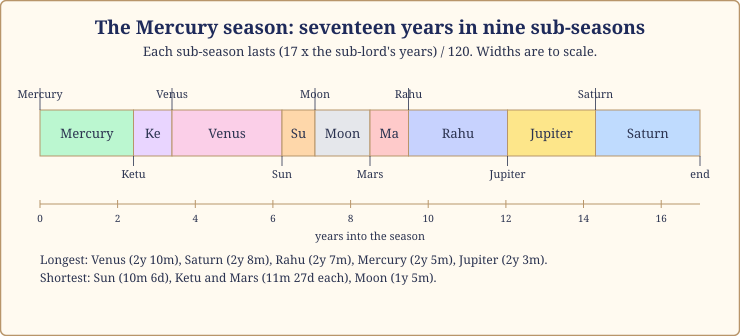
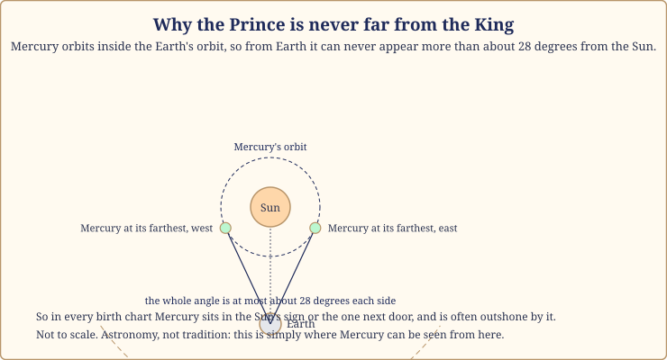
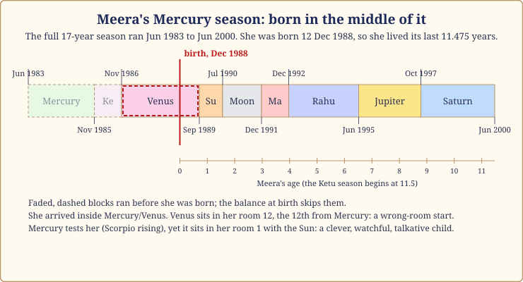

# Chapter 12: The Mercury Season (17 Years): The Clever Years

After the Judge, the Prince. The Mercury season comes straight after Saturn's nineteen years in the fixed order, and people who live through that changeover describe it the same way: the window opens. Suddenly there are ideas, conversations, a new phone, a course, a trip, three plans at once. The clever young Prince of our court has the keys, and the palace fills with messengers.

For many readers, though, the Mercury season is the first season of childhood, because the Moon's star at birth so often lands them there. Meera is one of those, and her childhood is our case. Either way, the season asks the same thing of a child or a seventy-year-old: learn, speak, trade, move, and do not scatter yourself so thin that nothing finishes.

One warning first, and it is the key to the whole chapter. Mercury has no fixed nature; the Prince takes the colour of his company. So this season, more than any other, is read from who Mercury sits with in your chart. As throughout this part, dates for our case-study lives are approximate, to within a month or two.

## The Prince runs the household

> **📖 Story: The Prince takes the colour of the room.** When the clever young Prince took the keys, the court noticed how much he changed depending on who stood beside him. In the Priest's study he spoke of law. In the Minister of Pleasure's garden he wrote songs. Beside the Commander he grew sharp-tongued. Beside the Judge he became a careful clerk who finished every file. Left alone, he was simply bright and busy, loyal to no plan for more than a week. "Who are you, really?" asked the Queen Mother. "Whoever I am standing next to," said the Prince, "so choose my company carefully." **Rule:** Mercury has no nature of its own; its season takes the colour of the planets it sits with and the room it sits in.

The season asks three things. **Learn, and keep learning:** Mercury stands for intellect, speech, writing, mathematics, trade and the nerves, and seventeen years of it is a long schooling at any age. **Trade honestly:** the season rewards cleverness and punishes cleverness that cuts corners, because the Prince gets caught. **Finish something:** Mercury's weakness is scatter, and the season's deepest task is to turn quickness into completion.

## How it feels

**Body.** Nerves, skin, lungs and sleep. People feel wired: a busy head at night, meals at odd hours. A period to take the nerves seriously in plain ways: less caffeine, more walking, a fixed bedtime.

**Mind.** Fast, curious, easily bored, youthful at any age. People pick up new technology quickly; they also worry quickly, running the same thought in circles. The gift is adaptability; the shadow is anxiety dressed as planning.

**Home.** Siblings, cousins and neighbours matter more. Books, devices and paperwork pile up; short trips, moves for study, a child's exams becoming the household calendar.

**Love.** Mercury is the planet of friendship more than romance; relationships grow through talk and shared projects.

**Work.** Writing, teaching, accounting, trade, sales, media, software: anything where words and numbers earn the money. Several job changes in seventeen years is normal, not failure.

**Money.** Many small streams rather than one river; good for traders and freelancers, hard for anyone who wants a single steady salary.

## The arc of seventeen years

**The first year.** The Mercury/Mercury sub-season runs about two years five months. After Saturn, this is the window opening: offers, courses, conversations; in a child, first words and endless questions.

**The middle.** Years three to twelve carry Ketu, Venus, Sun, Moon, Mars and Rahu. The Venus stretch, around years three to six, is the sweetest; the Rahu stretch, around years ten to twelve, brings the biggest ambitions and the biggest confusion.

**The last year.** Jupiter and then Saturn close the season. The Saturn sub-season (the final two years eight months) is where the scattered threads are gathered and judged: what did you actually finish? It is also the bridge into the Ketu season, so the end often brings a quieting that surprises people.

*Figure 12.1: The seventeen-year Mercury season in its nine sub-seasons, to scale.*

> **🔍 Why does Mercury take the colour of its company?** This is Parashara's own rule, written into the planet's nature in the classical texts: Mercury is kind alone or with kind planets, and difficult with difficult ones. The logic is that Mercury is the intellect, and the intellect has no values of its own; a clever thief and a clever doctor are both clever. Everyday parallel: the youngest child in a joint family, polite at the grandparents' table and wild at the cousins' table, and perfectly honest both times.

## When Mercury is on your side, and when it tests you

Mercury owns Gemini and Virgo; your rising sign decides which rooms those are, and so whether the Prince works for you or against you.

| Rising sign | Mercury owns rooms | Mercury and you | The season tends to bring |
|---|---|---|---|
| Aries | 3 and 6 | 🔴 tests you | effort, competition, debts, paperwork about disputes |
| Taurus | 2 and 5 | 🟢 on your side | money through speech, children's learning, creative work |
| Gemini | 1 and 4 | 🟢 on your side | your own planet's season; identity, home and education grow |
| Cancer | 12 and 3 | 🔴 tests you | expenses, travel, siblings' needs; busy for little return |
| Leo | 11 and 2 | 🔴 tests you | gains with greed, money through talk; watch your promises |
| Virgo | 1 and 10 | 🟢 on your side | your own planet's season; a career of skill and words |
| Libra | 9 and 12 | 🟢 on your side | fortune through learning, foreign places, a distant teacher |
| Scorpio | 8 and 11 | 🔴 tests you | sudden changes, gains with strings, research into hidden things |
| Sagittarius | 7 and 10 | 🟡 neutral | partnership and career demanding; a kind planet in two pillars |
| Capricorn | 6 and 9 | 🟢 on your side | fortune through service and study; the 9th wins |
| Aquarius | 5 and 8 | 🟡 neutral | children and transformation; mixed, read the company |
| Pisces | 4 and 7 | 🔴 tests you | home and marriage both busy; two pillars for a kind planet |

> **🔍 Why?** The system's own logic, from Parashara: lords of the lucky rooms (1, 5, 9) help you, lords of 3, 6 and 11 work against you, and a naturally kind planet owning the pillar rooms (4, 7, 10) loses its kindness there. For most rising signs Mercury owns one helpful room and one unhelpful one, and the table shows which wins. Everyday parallel: a smart cousin can be the one who files your taxes or the one who talks you into a bad investment, depending on where he sits at the family table.

Even when Mercury tests you, remember the colour rule: a testing Mercury with Jupiter in a good room gives a mild, bookish season; a helpful Mercury with Rahu in the 8th room gives a brilliant, restless, risky one.

## The room Mercury sits in changes the story

| Mercury in room | The season leans towards |
|---|---|
| 1 | you become the talker, the explainer; youthful looks, a restless body |
| 2 | money through speech and trade; a family of talkers |
| 3 | writing, siblings, short journeys, small skills; Mercury's natural room |
| 4 | education, a home office, mother's influence on the mind |
| 5 | clever children, exams, games of skill; creative writing |
| 6 | service through skill, accounts, disputes won on paper |
| 7 | a talkative or younger partner; business partnerships |
| 8 | research, secrets, paperwork; a sharp mind turned to hidden things |
| 9 | higher study, publishing, a teacher met through travel |
| 10 | a career of words and numbers; several job changes |
| 11 | gains through networks, friends in trade; many small incomes |
| 12 | foreign study or work, writing in solitude, expenses on courses |

## Never far from the King

*Figure 12.2: Mercury's path lies inside the Earth's, so from here it never strays far from the Sun.*

> **🔍 Why is Mercury never far from the Sun?** Astronomy, not tradition. Mercury circles the Sun inside the Earth's own path, so from where we stand it can never swing out more than about 28 degrees from the Sun. So in every birth chart Mercury is in the same sign as the Sun or the sign next door, and it is often outshone by the Sun, so close that its own light is lost in the King's. An outshone Mercury gives a mind that is bright but struggles to be heard apart from authority: the father, the boss. Everyday parallel: the clever younger brother always introduced as "so-and-so's brother", who takes years to be known by his own name.

> **📖 Story: The Prince and the King.** The Prince was never allowed far from the throne. Wherever the King went, the Prince went a few steps behind, carrying the letters. Sometimes he stood so close to the King's blaze that nobody saw him at all, and his best ideas were announced in the King's voice. He did not sulk. He wrote everything down, so that when the King was away, even briefly, the court discovered how much of its cleverness had been his. **Rule:** Mercury is always within a sign of the Sun; when outshone, it works best in writing and in the King's absence.

## The sub-seasons that matter most

Two questions for every sub-season: is the sub-lord Mercury's friend, and in which room does it sit counted from Mercury? A sub-lord in the 6th, 8th or 12th room from Mercury is in a wrong room, and its stretch pulls against the season even if the planets like each other.

**Mercury/Mercury (the first 2 years 5 months).** The Prince alone. If Mercury is on your side, the window opens: study, offers, a new skill. If it tests you, a busy, scattered start where much begins and little finishes.

**Mercury/Venus (2 years 10 months, the longest).** Friends, and the sweetest sub-season: charm, friendships, art, money through pleasant work. If Venus sits in a wrong room from Mercury, it turns into expenses and distraction.

**Mercury/Rahu (2 years 7 months).** The Stranger in the Prince's palace: technology, foreign places, big ideas, confusion. People change careers, move countries or fall for a scheme here. Keep your contracts in writing.

**Mercury/Saturn (the last 2 years 8 months).** Friends, and the gathering: the Judge comes to see what the Prince has finished. Good for qualifications and serious decisions, and the bridge into the Ketu season.

## What to do, and what not to do

Practices, not stones. An emerald will not organise your mind; a notebook will.

- **Keep one notebook, not six.** Mercury's season scatters; a single place for every idea, list and plan is the most useful practice I know for these years.
- **Learn one thing to completion each year.** A language level, a certificate, a recipe book cooked through. The point is the finishing.
- **Wednesday as a learning day.** Mercury's day in the tradition: an hour of study, a letter actually written, green moong or a book given to a child who needs one. Rhythm over ritual.
- **Walk and breathe.** Mercury rules the nerves and the lungs; a daily walk and a few minutes of slow breathing do more than any clever system.
- **Do not** sign anything in the Rahu sub-season that you have not read twice, slowly, and do not mistake restlessness for a sign that you should change everything. Sometimes it is just the Prince wanting a walk.

> **🧭 Anushka's rule of thumb:** In a Mercury season, judge your year by what you finished, not by what you learned about. The first list is always shorter and always the one that counts.

## Meera's childhood: born in the middle of the Prince's season

Meera was born on 12 December 1988 with the Moon at 21 degrees of Cancer, in the star Ashlesha, whose lord is Mercury. So her first season was Mercury's, and because the Moon had already crossed part of that star, she arrived with 11.475 of the seventeen years remaining: birth to around June 2000, age eleven and a half.

*Figure 12.3: Meera was born inside the Mercury/Venus sub-season of a season that had begun before her birth. The faded blocks ran before she arrived.*

For Scorpio rising, Mercury owns rooms 8 and 11 and tests her. But read the company: her Mercury sits in room 1, Scorpio, with the Sun, 19 degrees apart, so not outshone. A testing Mercury in the room of the self, beside the King: a child who is sharp, watchful, talkative, a little intense, with a mind that argues back and a taste for finding out what the adults are hiding.

Her sub-seasons, counted in rooms from Mercury in Scorpio: she was born inside Mercury/Venus, which ran until about September 1989. Venus sits in her room 12, the 12th from Mercury, a wrong room, but in a baby's first nine months that means little beyond expenses and interrupted sleep. Then Mercury/Sun to about July 1990 (a strong-willed toddler), Mercury/Moon to about December 1991 (the Moon in her 9th: grandmother, stories), Mercury/Mars to about December 1992 (Mars in her 5th: first fights, first games), Mercury/Rahu to about June 1995 (Rahu in her 4th: a change at home, a new school), Mercury/Jupiter to about October 1997 (Jupiter in her 7th, on her side: a good teacher, learning to love reading), and Mercury/Saturn to June 2000 (Saturn in her 2nd: school getting serious, money tighter).

That last stretch led into her Ketu season, which Chapter 4 described, and into Saturn's seven and a half years over her Cancer Moon from 2000 to 2007. If you had read for her parents in 1999, the kind thing to say would have been: she has had eleven years of a bright, busy, questioning mind; the next seven will be quieter and more inward, and that is not a loss.

**A note on Arjun.** His Mercury season comes at the other end of life, around December 2066 to December 2083, from age 71.8. For Cancer rising Mercury owns rooms 12 and 3 and tests him, and it sits in his room 8 with the Sun and Saturn, not outshone but very much in the Judge's company: a late season of research, writing and the sorting of family papers, careful rather than playful. Chapter 16 reads his whole life in order.

> **📖 Story: The Prince's unfinished letters.** At the end of his seventeen years the Prince brought the Judge a chest of letters. Hundreds: brilliant, witty, half-written. "Which of these did you send?" asked the Judge. The Prince counted. Eleven. "Then your season is eleven letters long," said the Judge, "and the rest is weather." The Prince took one unfinished letter, finished it, and sent it, and that was the one the kingdom remembered. **Rule:** a Mercury season is measured by what was finished; the Saturn sub-season at its end is when the count is taken.

## In one breath

- The Mercury season is seventeen years when the clever young Prince runs the household: learning, speech, trade, travel, nerves, youthfulness and scattered attention.
- Mercury has no nature of its own; the season takes the colour of the planets Mercury sits with and the room it sits in.
- Mercury is never more than about 28 degrees from the Sun, so it always sits in the Sun's sign or the one beside it, and is often outshone; that is astronomy.
- Whether Mercury is on your side depends on your rising sign: helpful for Taurus, Gemini, Virgo, Libra and Capricorn, testing for Aries, Cancer, Leo, Scorpio and Pisces.
- Watch Mercury/Mercury (the theme), Mercury/Venus (the sweetness), Mercury/Rahu (the confusion) and Mercury/Saturn (the count).
- Meera lived the last 11.475 years of a Mercury season as her childhood, birth to June 2000; Arjun's comes at the end of his life, from December 2066.

## Try this

1. Find your rising sign in the table and note which rooms Mercury owns for you. Then look at your chart: which planets sit with Mercury, and in which room? Write one sentence about what colour your Mercury takes.
2. If your first season was Mercury's (your Moon in Ashlesha, Jyeshtha or Revati), ask a parent or older sibling what you were like as a child. Does it fit the Prince?
3. Make the two lists from the rule of thumb for the past year: what you learned about, and what you finished. Move one item from the first list to the second.
4. A factual check: Meera was born with 11.475 years of Mercury's season remaining. How many years had already passed, and which sub-season was running at her birth?

Answers

4. Seventeen minus 11.475 leaves 5.525 years already passed. Adding the sub-seasons in order (Mercury 2.41 years, Ketu 0.99, Venus 2.83) reaches 6.23 years, so at 5.525 years she was inside Mercury/Venus, with about 0.7 years of it left; it ended around September 1989.

