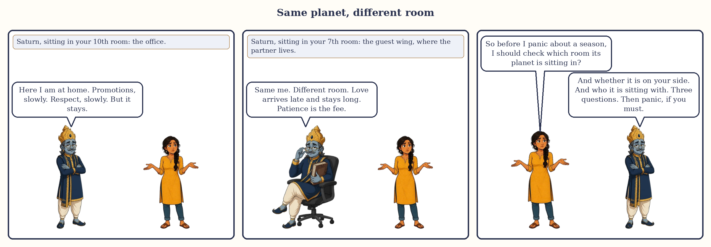
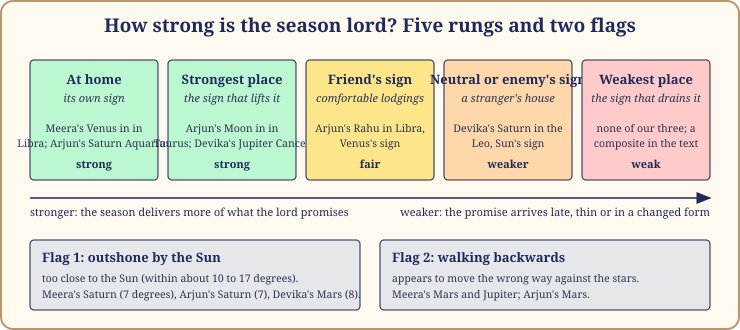
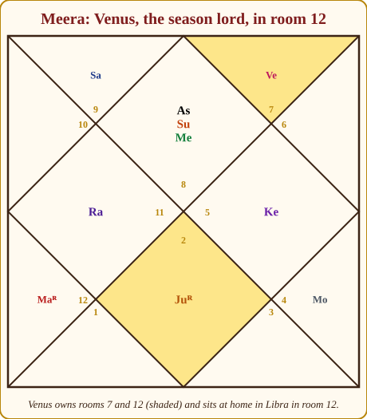
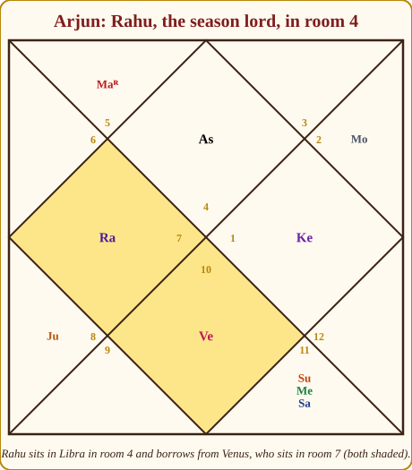
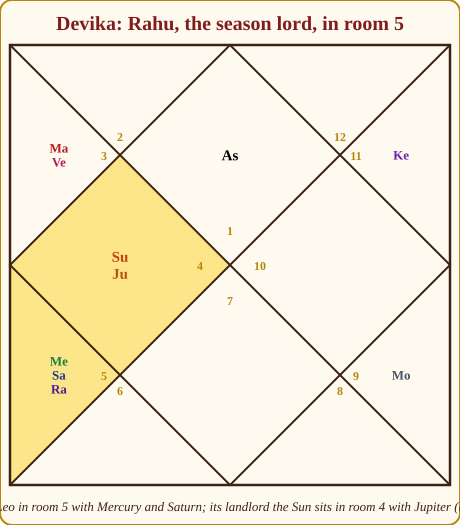

# Chapter 13: Where the Planet Sits Changes the Season

Two women are both in a Venus season. One spends twenty years in a house full of music, hosting weddings, buying saris she does not need. The other spends the same twenty years paying for other people's comfort, quietly, from a room at the back. Same courtier. Same years. Completely different seasons.

Part II gave you nine portraits. This chapter turns a portrait into a photograph of a particular person: where that planet sits in your own chart. Every date here is approximate.

I ask three questions of any season lord, the questions you would ask about a new manager at your office: what is this person in charge of, how strong is their position, and who do they sit with at lunch?

*Same planet, different room: the three questions before you judge a season.*

## Question one: which rooms does it own, and which room does it sit in?

Every planet except Rahu and Ketu owns one or two signs, and in your chart each sign falls in one of the twelve rooms (bhavas, which Book 1 calls houses). So every season lord manages one or two rooms, and when its season comes the matters of those rooms arrive on your desk whether you asked for them or not.

Then there is the room the planet sits in: where the season does its work. A planet that owns the marriage room but sits in the career room runs a marriage season from the office: the partner met at work, the wedding squeezed between projects.

> **🔍 Why?** The system's own logic. Parashara builds the whole chart on the idea that a planet carries the business of the signs it owns into the place where it stands; the season is the years when that business comes to the front. Everyday parallel: when the finance head becomes acting director, finance files suddenly reach every department.

The dots judge the room, not the person.

| Where the season lord sits | What the season tends to feel like | |
|---|---|---|
| A pillar room: 1, 4, 7, 10 (the kendras of Book 1) | Visible, active, out in the open; shapes life's main structure | 🟢 |
| A lucky room: 1, 5, 9 (the trikonas) | Fortunate, help arrives; tends to leave you better off | 🟢 |
| A growing room: 3, 6, 10, 11 | Improves with effort; slow at first, better later | 🟡 |
| Room 2 | Family, money, speech; depends on the lord's nature | 🟡 |
| One of the three hard rooms: 6, 8, 12 | Works behind the scenes: debts, health to manage, losses, foreign places, privacy; demanding but deep | 🔴 |

## Question two: how strong is it?

Strength decides how much of the promise gets delivered: fully and on time, or late, thin, and in a changed form.

**At home (in its own sign, which the books call swakshetra).** The planet owns the sign it sits in; it has keys to every cupboard. Meera's Venus in Libra and Arjun's Saturn in Aquarius are at home.

**At its strongest place (exalted).** Each planet has one sign where tradition says it is lifted: the Sun in Aries, the Moon in Taurus, Mars in Capricorn, Mercury in Virgo, Jupiter in Cancer, Venus in Pisces, Saturn in Libra. Arjun's Moon and Devika's Jupiter are at their strongest places.

**At its weakest place (debilitated).** The sign opposite the strongest place (Jupiter in Capricorn, Saturn in Aries, and so on). None of our three has one. A friend with Jupiter at its weakest place spent his Jupiter season learning that wisdom, for him, would come through hard practical work, not teachers. He got there. The tradition softens this too: when the sign's owner is strong, much of the weakness is cancelled. Never pronounce a season weak from one line.

**Outshone by the Sun (combust).** A planet within about ten to seventeen degrees of the Sun. Meera's Saturn is seven degrees from her Sun; so is Arjun's. Devika's Mars is eight degrees from hers. Its season still comes, but its themes arrive mixed with the King's: identity, father, authority.

**Walking backwards (retrograde).** Meera's Mars and Jupiter and Arjun's Mars appear to move the wrong way against the stars. The reading I trust most: the planet's matters come back for a second look. A walking-backwards Jupiter often brings back a teacher or a faith you once dropped. Not weaker. Revisited.

*Figure 13.1: The strength ladder. The two flags change the manner of delivery rather than the amount.*

> **🔍 Why?** Two layers here. Outshone by the Sun is astronomy: a planet near the Sun is lost in the glare, and the old astronomers took "cannot be seen" as "cannot act freely". Walking backwards is also astronomy: a planet appears to reverse when the Earth overtakes it, and at that moment it is closest to us and brightest, which is why some teachers call it strong and others disturbed. The strongest and weakest places are tradition: Parashara gives the list without a reason, and I will not invent one. Everyday parallel: everyone agrees the examination hall is quiet (astronomy); which school is best is something the city has decided over time (tradition).

> **📖 Story: The Judge who stood too near the throne.** The old Judge of Labour had a report to read to the court: twenty years of accounts. But he stood a step too close to the King, and the King was in full voice. Every time the Judge opened his mouth, the hall heard only the King. The accounts were real; the Judge's season still came. But the kingdom remembered those years as the King's years, about pride and position and the father's name. **Rule:** a season lord outshone by the Sun still gives its season, but its themes arrive tangled with the Sun's: identity, authority, the father, the ego.

## Question three: who is it with?

A planet sharing a room with another shares its season with it. The friendship table from Book 1 (A.3 in the reference tables) says whether the company is good: the Sun with Jupiter is a King with his Priest; Saturn with Mars is the Judge and the Commander, who have never once agreed.

Two things matter more than the table: is the companion on your side, by your rising sign, and how close are they? Two planets within a few degrees are in each other's laps; fifteen degrees apart, they are at different tables.

> **🔍 Why?** The system's own logic again: Parashara's friendships come from the court roles, so a season lord with a friend works with help and with an enemy works with interference. Everyday parallel: a manager who shares an office with her college friend gets things done in a week; one who shares it with a rival spends the month in meetings about the meetings.

## The hidden agenda: the planet whose star it sits in

Now a refinement, clearly labelled, because it comes from a more modern school.

The dasha system is built on the 27 stars: your first season is chosen by the star your Moon sits in. The modern practice influenced by K.S. Krishnamurti's school (KP astrology, twentieth century) goes one step further: every planet sits in some star, that star has a lord, and the planet quietly speaks for that lord too. A season lord has an open agenda (its own rooms and nature) and a hidden one (its star lord's). Mainstream Parashara readers do not need this step; many good astrologers use it anyway, because it answers "why did my Venus season feel like a Jupiter season?"

To find the star you need the planet's degree, which any app shows; the 27-star table is in the reference appendix. I computed all three of ours so I would not slip.

> **📖 Story: The Stranger who carried the Sadhu's message.** The smoke-headed Stranger was given the household for eighteen years, and everyone braced for noise and hunger. But he had taken his lodgings, by chance, in the Sadhu's old cell, and the longer he lived there the more the Sadhu's silence crept into his voice. He still wanted everything. He also kept giving things away, and could not explain why. The court said: he speaks for himself, but the cell he sleeps in speaks through him. **Rule:** a season lord also carries the agenda of the planet whose star it sits in; the loudest voice is its own, the second comes from the star.

## Worked: Meera's Venus season, ending around June 2027

Meera is Scorpio rising, in the farewell sub-season (Venus/Ketu) of a twenty-year Venus season that runs from June 2007 to around June 2027.

*Figure 13.2: Meera's chart. Venus owns Taurus (room 7) and Libra (room 12) and sits in room 12, at home.*

**Rooms.** Venus owns room 7 (marriage, partnership) and room 12 (expenses, foreign places, sleep, privacy, letting go), and sits in room 12. So her Venus season was always going to be about partnership, run from a private room, and paid for. For a Scorpio rising, Venus tests her, and this is how a testing Venus behaves: sweet, and costly.

**Strength.** At home in Libra, not outshone (her Sun is thirty-six degrees away), not walking backwards. Whatever Venus promised, it delivered: the marriage in Venus/Rahu in 2016, the comforts too, with a steady leak of money and privacy she noticed only around Venus/Saturn (2020 to 2023).

**Company.** Alone.

**Hidden agenda.** Venus at 22° Libra is in Vishakha, Jupiter's star. Her Jupiter is on her side, owns rooms 2 (family, savings) and 5 (children, creativity), and sits in room 7 in Taurus, Venus's own sign: tied in both directions. This is why her Venus season, for all its expense, built a family and a home full of books, and why her partner is more teacher than charmer.

## Worked: Arjun's Rahu season, December 2013 to December 2031

Arjun is Cancer rising, in year thirteen of an eighteen-year Rahu season, in the Rahu/Venus sub-season (July 2025 to July 2028).

*Figure 13.3: Arjun's chart. Rahu in room 4 borrows Venus's nature; Venus itself sits in room 7.*

**Rooms.** Rahu owns nothing, so the question becomes: whose sign is it in, and where is that owner? Rahu sits in Libra in room 4 (home, mother, land, formal education). Libra belongs to Venus, who owns rooms 4 and 11 (gains, friends, networks) and sits in room 7 (partnership). So the Rahu season borrowed Venus's business: home, property, education, gains through networks, and lately partnership. He finished his studies in Rahu/Jupiter (2017), took his first job in 2018, and felt stuck in Rahu/Mercury (2022 to 2024), when the sub-lord Mercury, which tests him, sat in room 8 with his Sun and Saturn.

**Strength.** Rahu has no home, and the tradition argues about its strongest place, so I grade it by its landlord: Libra is a friend's sign for Rahu, and room 4 is a pillar room. Fair to strong. Neither flag applies to Rahu.

**Company.** Alone. Its landlord Venus sits in room 7, the fourth room counted from Rahu: not one of the wrong rooms (6, 8 or 12 from the lord) you met in Chapter 3. The current Rahu/Venus sub-season is therefore workable: busy about partnership, not hostile.

**Hidden agenda.** Rahu at 12° Libra is in Swati, Rahu's own star. No second voice. This is rarer than you would think, and it makes a season single-minded: eighteen years asking where home is and what he will leave to find it.

## Worked: Devika's Rahu season, July 2021 to July 2039

Devika is Aries rising, in year five of an eighteen-year Rahu season. Rahu/Jupiter ended in August 2026; Rahu/Saturn has just begun and runs to around June 2029.

*Figure 13.4: Devika's chart. Rahu, Mercury and Saturn in room 5; the landlord Sun in room 4 with Jupiter.*

**Rooms.** Rahu sits in Leo in room 5 (children, intelligence, creativity). Leo is the Sun's sign, and her Sun, firmly on her side as an Aries rising, sits in room 4 (home, mother, land) with Jupiter at its strongest place. So Rahu borrows the Sun: a hunger for recognition, played out through her daughter, her creative work and the home. The property dispute of 2020 to 2021 sat at the changeover into this season: room 4 matters, through the Sun, arriving early.

**Strength.** The Sun and Rahu are not friends by any convention: an unfriendly sign, a lucky room, a very strong landlord. Mixed, but the landlord carries it.

**Company.** Here her season gets its texture. Mercury sits at 1° Leo, two degrees from Rahu at 3°: in Rahu's lap. Saturn sits at 18°, at the far table. Both test her, and both are friendly to Rahu, so the company helps Rahu and not her: a clever, anxious, hard-working edge. The sub-season just begun, Rahu/Saturn, puts the sub-lord in the season lord's own room: not a wrong room, but a heavy companion for nearly three years, and a stretch to let creative work be slow.

**Hidden agenda.** Rahu at 3° Leo is in Magha, Ketu's star. Her Rahu speaks for Ketu, which sits in room 11 (gains, friends, elder siblings): the gains of this season come through letting go. Magha is also the star of ancestors and lineage, a fair description of a property dispute inside a family.

> **📖 Story: The Minister's own house.** When the Minister of Pleasure was given the household, she did not move into the palace. She ran it from her own mansion, where every carpet was hers and every servant knew her. The court grumbled that she was never seen, that money left by the back gate. All true. But nothing she promised failed to arrive: the weddings were held, the music played, the beds were soft. **Rule:** a season lord at home delivers its promise fully, in the manner of the room it sits in.

## Reading the three answers together

| | Meera: Venus | Arjun: Rahu | Devika: Rahu |
|---|---|---|---|
| Rooms owned and occupied | Owns 7 and 12, sits in 12 (hard room, but at home) 🟡 | Borrows Venus (4 and 11), sits in 4 (pillar room) 🟢 | Borrows the Sun (5), sits in 5 (lucky room) 🟢 |
| Strength | At home, unflagged 🟢 | Friend's sign, pillar room 🟢 | Unfriendly sign, strong landlord 🟡 |
| Company | Alone 🟡 | Alone 🟡 | Mercury close, Saturn far; both test her 🔴 |
| Hidden agenda | Jupiter (on her side) 🟢 | Rahu itself: one voice 🟡 | Ketu (room 11) 🟡 |
| On her or his side? | Tests her 🔴 | Borrows a planet that tests him 🟡 | Borrows a planet on her side 🟢 |

No row decides the season alone. Meera's Venus tests her from a hard room, yet it is at home and speaks for a friendly Jupiter: a sweet, expensive, family-building twenty years. Devika's Rahu has the best rooms and the hardest company: fortunate in outline, tiring in its days.

> **🧭 Anushka's rule of thumb:** Ask the three questions in order, rooms then strength then company, and write one sentence for each before you allow yourself an opinion. Then check the star. If it contradicts everything else, trust everything else; if it explains a puzzle, keep it.
## In one breath

- Ask three questions about any season lord: which rooms it owns and sits in, how strong it is, and who it sits with.
- The rooms owned bring their matters into the season; the room occupied is where the season does its work.
- Strength in plain words: at home, strongest place, weakest place, outshone by the Sun, walking backwards. The first three are tradition; the last two are astronomy.
- Company changes the texture: a friend helps, an enemy interferes, closeness matters.
- The hidden agenda is the modern, KP-influenced refinement: a season lord also speaks for the planet whose star it sits in. Use it to explain puzzles, not to overrule the chart.
- Meera's Venus: at home in a hard room, speaking for Jupiter. Arjun's Rahu: a pillar room, speaking for itself. Devika's Rahu: a lucky room, heavy company, speaking for Ketu.

## Try this

1. From your own chart, write the three answers for your current season lord in three plain sentences. No opinion yet.
2. Find your season lord's degree in your app and look up its star's lord in the reference appendix. Does the second voice explain anything about your season so far?
3. Meera's Sun sits at 28° Scorpio. Which star is that, and which planet is the hidden agenda of her coming Sun season?
4. Devika's Mercury (1° Leo) and Rahu (3° Leo); Arjun's Saturn (25° Aquarius) and Sun (18°). Which pair is closer company, and which involves a planet outshone by the Sun?
5. Think of one past season that felt unlike its portrait in Part II. Which of the three questions, or the star, best explains the difference?

Answers

3. Jyeshtha (16°40′ to 30° Scorpio), whose lord is Mercury. Mercury owns her rooms 8 and 11 and sits with the Sun in room 1.
4. Devika's Mercury and Rahu are the closer company. Arjun's Saturn is outshone (seven degrees, within Saturn's limit of about fifteen). Rahu is never outshone.

