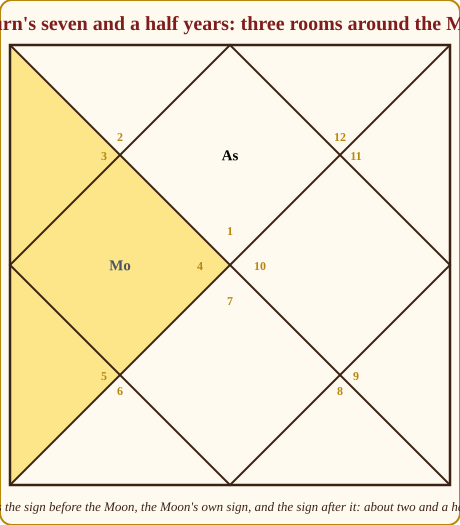
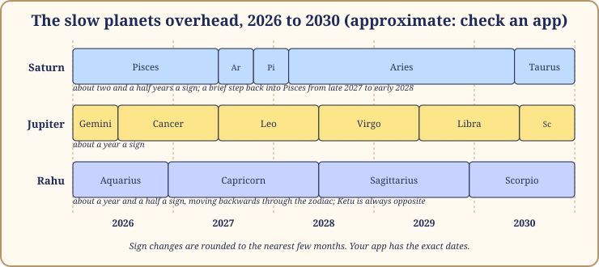
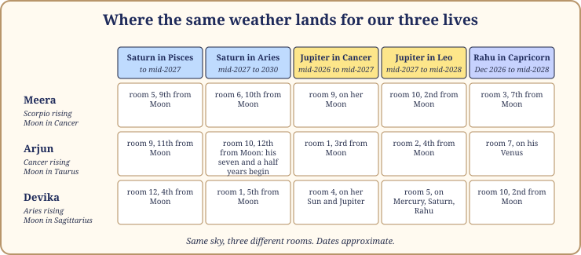

# Chapter 14: Weather Inside the Season

A season is a climate. Jaipur in a Venus season is still Jaipur: hot, dry, beautiful. But inside the climate there is weather. Some weeks it rains in the desert; some years the monsoon does not come. Know only the climate and you will be surprised every afternoon; know only the weather and you will never understand why the same rain is a blessing in one city and a flood in another.

The dasha system is the climate. The planets moving overhead right now are the weather (gochar, which Book 1 and most apps call transit). This chapter teaches you to read the two together, which is the only way either makes sense. Every date here is approximate; your app has the exact ones.

## Only the slow planets are weather that matters for seasons

The Moon crosses a sign in about two and a quarter days; the Sun, Mercury and Venus take about a month each; Mars about a month and a half. These are showers. They matter for choosing a wedding date, not for understanding a year of your life.

Three movements are slow enough to shape a year:

- **Saturn** takes about two and a half years to cross a sign, and about twenty-nine and a half years to go round.
- **Jupiter** takes about a year a sign, twelve years for the round.
- **Rahu and Ketu** take about a year and a half a sign, eighteen and a half years for the round, moving backwards through the signs, always exactly opposite each other.

> **🔍 Why?** Astronomy. The further a planet is from the Sun, the slower it orbits: Jupiter's year is twelve of ours, Saturn's nearly thirty. Rahu and Ketu are not bodies but the two points where the Moon's path crosses the Sun's, and those points drift slowly backwards as the Moon's orbit wobbles. Everyday parallel: local trains rush through the platform every few minutes and you stop noticing them; the one long-distance train changes the shape of your afternoon.

## Two places to stand: from the rising sign and from the Moon

A moving planet is always in some sign, which is one room counted from your rising sign and another counted from your Moon's sign. Counting from the rising sign tells you **which part of life** the weather falls on: career, home, partnership. Counting from the Moon tells you **how it will feel**, because the Moon is the mind, and the tradition's oldest weather rules are all counted from the Moon. The dots judge the room; a red dot is a room where that planet's passage is traditionally felt as pressure, not a sentence passed on you.

| Moving planet | Good rooms from the Moon (classical) | The rest | Felt most as pressure |
|---|---|---|---|
| Saturn | 3, 6, 11 🟢 | 🟡 | 12, 1, 2 (the seven and a half years) and 4, 8 🔴 |
| Jupiter | 2, 5, 7, 9, 11 🟢 | 🟡 | 6, 8, 12 🔴 |
| Rahu / Ketu | 3, 6, 11 🟢 (common practice, not Parashara) | 🟡 | 1, 7, 8, 12 🔴 |

> **🔍 Why?** Tradition, with a logic underneath. The classical authors give the lists without derivation, but you can see the shape: Saturn, the planet of work, is welcome in the growing rooms where effort pays and heavy on the rooms of self and comfort; Jupiter, the planet of gifts, is welcome where gifts land. Everyday parallel: a strict uncle visiting is a help at exam time and a strain at a party.

## Saturn's seven and a half years, explained from the Moon

Now the weather everybody has heard of and almost everybody misunderstands: Saturn's seven and a half years (Sade Sati, which simply means "seven and a half" in Hindi).

Take your Moon's sign. Saturn, at two and a half years a sign, will at some point enter the sign before it: the first phase. Then it crosses your Moon's own sign: the second phase, the heaviest. Then the sign after: the third, when the weight lifts. Three signs, seven and a half years in all, roughly once every thirty years: in the late twenties, the late fifties, the late eighties, give or take.

*Figure 14.1: Saturn's seven and a half years. Saturn crosses the sign before the Moon, the Moon's sign, and the sign after, about two and a half years each.*

Here is the honest framing, which I wish every WhatsApp forward included. Three of the twelve signs are "in" the seven and a half years at any moment: a quarter of everyone alive. As I write in late 2026, Saturn is in Pisces, so everyone with the Moon in Aquarius, Pisces or Aries is somewhere in it, hundreds of millions of people having every kind of year. When Saturn enters Aries around mid-2027, the Aquarius Moons are released and the Taurus Moons begin. It is a tide, not a curse.

What it asks is real, though. Saturn over the Moon is the old Judge of Labour going through the Queen Mother's accounts. The mind feels heavier. Things take longer. Supports you leaned on are tested: a parent ages, a job becomes work, a friendship shows its true weight. People who come out well used the years to take responsibility for something they had been avoiding. People who come out badly spent seven years waiting for it to end.

The tradition adds two smaller Saturn stretches, in the fourth and the eighth sign from the Moon, two and a half years each: lighter, but felt as pressure on home and comfort (the fourth) or on security (the eighth). And a strong Moon bears the audit better: a Moon at its strongest place, at home, or with Jupiter softens Saturn's weight. Arjun's Moon is at its strongest place; his seven and a half years, beginning around mid-2027, should be a real audit but not a crushing one.

> **📖 Story: The Judge visits the Queen Mother.** Once in a generation the old Judge of Labour came to audit the Queen Mother's household. He arrived in the room before hers and sat for two and a half years, reading. Then he moved into her own apartments and the palace went quiet; the feasts stopped, every servant's work was weighed. Then he moved to the room beyond and slowly the music returned. The Queen Mother who had kept honest accounts wept at the start and thanked him at the end: he had found three servants stealing and one old debt she could at last pay off. The one who had hidden things wept all the way through. **Rule:** Saturn's seven and a half years is an audit of the mind's household; it rewards whoever has nothing to hide and whoever starts keeping accounts now.

## The same weather, a friendly season and a testing season

The weather does not act on its own. It acts on whatever the season has already put in the room.

Picture Saturn crossing your rising sign, room 1, tiring for anyone. In a Jupiter season, with Jupiter on your side, the tiredness is the weight of real responsibility: a promotion that costs your evenings, a child, a house with a loan. You are carrying something worth carrying. In a Saturn season, with Saturn testing you, the same Saturn is the season lord itself walking over you: no gift inside it yet, only the task, which is to endure well and build slowly. Both people say "Saturn is on my rising sign and I am exhausted." Only one is in trouble, and hers is the kind that builds a person.

The same is true the other way. Jupiter over your room 10 in a friendly season is the Priest blessing work you are already doing: recognition, a good offer, a mentor. In a Ketu season it is a blessing on a desk you are trying to leave: good news about a job you no longer want. Still good weather, on a different climate.

> **🧭 Anushka's rule of thumb:** The season decides what can happen. The weather decides when it is likely, and how it feels that year. Never read the weather without first asking which season it falls into.

> **📖 Story: Rain on two fields.** The same monsoon fell on two farms outside the city. On the first, the Priest had spent the year sowing, and the rain brought a harvest that filled the storerooms. On the second, the headless Sadhu had let the land rest, and the rain brought wildflowers and a flooded path. The second farmer was not cursed. He had simply not planted anything, because it was not that kind of year for him, and the rain honoured what was there. **Rule:** the weather waters whatever the season has planted; good weather on an empty field grows wildflowers, not grain.

## The two signatures: how astrologers time an event

Now the most useful timing tool I know, clearly labelled: a modern Indian teaching, spread by the Delhi school of K.N. Rao and his students, not a line from Parashara. Practitioners call it the double transit (Jupiter and Saturn together); I call it the two signatures.

The rule: an event in some area of life tends to happen in the year when **both Saturn and Jupiter touch that room or its lord**, by sitting in it or by looking at it, **and** the running season or sub-season promises that matter. Jupiter alone is a wish. Saturn alone is a duty. Both together, on a room the season has opened, is a date.

"Looking at" is the gaze from Book 1: every planet looks at the room opposite it; Saturn also at the third and the tenth from itself; Jupiter also at the fifth and the ninth. So each slow planet touches four rooms at any time.

> **🔍 Why?** The system's own logic, as its teachers explain it. Jupiter is the planet of permission and growth; Saturn is the planet of structure and completion. A matter needs both: the expansion that makes it possible and the solidity that makes it real. Everyday parallel: a large bank cheque needs two signatures, the director's and the accountant's. One gets you a smile at the counter; two gets you the money.

Two cautions. The season must promise the matter: two signatures on the marriage room in a season unconnected to marriage give you a year of weddings in the family, not your own. And Saturn's signature lasts about two and a half years, so the rule narrows the window to Jupiter's year within Saturn's stretch. That is as precise as honest astrology gets.

## The sky from 2026 to 2030, approximately

*Figure 14.2: The slow planets overhead, 2026 to 2030. Approximate: sign changes are rounded to the nearest few months. Check an app for exact dates.*

In words, with "about" before every date: **Saturn** is in Pisces until mid-2027, then Aries, stepping back into Pisces from late 2027 to early 2028, then Aries again, reaching Taurus from about 2030. Aries is Saturn's weakest place, so those are slower, more irritable Saturn years for everyone. **Jupiter** is in Gemini until June 2026, Cancer (its strongest place) to mid-2027, Leo to mid-2028, Virgo to mid-2029. **Rahu** is in Aquarius until December 2026, then Capricorn until mid-2028, then Sagittarius; Ketu is always opposite. If your app disagrees by a month or two, trust the app.

## Where it lands for our three lives

*Figure 14.3: The same sky, three different rooms: the room from the rising sign and the count from the Moon.*

**Meera (Scorpio rising, Moon in Cancer).** Her seven and a half years ran from 2000 to 2007, inside her Ketu season, when she was a schoolgirl; the next begins in the early 2030s, inside her Moon season. Until 2030 Saturn is kind to her Moon: Pisces is the ninth sign from Cancer, Aries the tenth, Taurus the eleventh. From the rising sign, Saturn sits in her room 5 until mid-2027 and then in room 6, daily work and health routines. Jupiter in Cancer from mid-2026 to mid-2027 sits on her Moon itself, in room 9: a year when faith, a teacher or a long journey comes to the mind, in the farewell sub-season of Venus. Then Jupiter in Leo from mid-2027 sits in her room 10, the career room, in the first year of her Sun season, and the Sun is the lord of room 10. Two signatures? In that first Sun year Saturn sits in room 6 and Jupiter from Leo looks straight at it: daily work, service, health, competition. Not a glamorous room. But the Sun season asks who you are when nobody is watching, and room 6 is exactly where nobody watches. I would expect her first Sun year to be about the discipline of work rather than its glory, with the glory coming later.

**Arjun (Cancer rising, Moon in Taurus).** Saturn enters Aries, the twelfth sign from his Moon, around mid-2027: his seven and a half years begin, inside his Rahu season, and run through the end of Rahu into the first years of Jupiter from December 2031. His strong Moon will help. From the rising sign, Saturn in Aries is in his room 10, the career room, and from there it looks at room 7, where his Venus sits, and at room 4, where Rahu sits. Meanwhile Jupiter in Cancer (mid-2026 to mid-2027) sits in his room 1 and looks at room 7, while Rahu moves into Capricorn, his room 7, from December 2026, sitting on his Venus. Partnership is being asked about loudly through 2027, in a Rahu/Venus sub-season whose sub-lord sits in that very room. Whether it answers as a marriage or a business partner is for him and his chart to decide; the weather only puts the question on the table. Then from mid-2027 to mid-2028, Saturn sits in his room 10 and Jupiter in Leo looks at it: two signatures on career, in the last year of Rahu/Venus and the first months of Rahu/Sun. A career turn is very likely in that window, and it will feel like work, because Saturn is signing from inside the room.

**Devika (Aries rising, Moon in Sagittarius).** Her seven and a half years are behind her: Saturn walked through Scorpio, Sagittarius and Capricorn from around late 2014 to early 2023, covering her Mars season and the changeover into Rahu, the surgery of 2016 to 2018 and the property dispute of 2020 to 2021. Now Saturn in Pisces is the fourth sign from her Moon until mid-2027, one of the smaller Saturn stretches, and from Pisces it looks straight at her Moon's sign. From the rising sign it sits in her room 12 while Jupiter in Cancer sits in her room 4, on her Sun and her own Jupiter, and looks at room 12. Two signatures on room 12 from mid-2026 to mid-2027: expenses, hospitals, foreign places, rest, letting go. In the first year of Rahu/Saturn I would tell her plainly: a year to take rest and health seriously and to spend deliberately, possibly a year of a long journey. Then from mid-2027, Saturn sits in her room 1 while Jupiter in Leo sits in room 5, on her Mercury, Saturn and Rahu, and looks at room 1. Two signatures on the self: a reshaping year, with Saturn signing from the room of the body. Slower, more serious, and hers.

## In one breath

- The season is the climate; the planets overhead now are the weather. Read them together or you will misread both.
- Only the slow movers shape a year: Saturn (two and a half years a sign), Jupiter (about a year), Rahu and Ketu (a year and a half, backwards).
- Count the weather from the rising sign for which part of life it touches, and from the Moon for how it feels.
- Saturn's seven and a half years is Saturn crossing the sign before the Moon, the Moon's sign and the sign after. A quarter of everyone alive is in it at any moment. An audit, not a curse.
- The same weather lands differently inside a friendly season and a testing season: good weather on an empty field grows wildflowers, not grain.
- Two signatures: when Saturn and Jupiter both touch a room or its lord, and the season promises that matter, that is the year to expect it. A modern teaching, widely used.

## Try this

1. Find your Moon's sign and the signs on either side of it. Using Figure 14.2, is Saturn in any of the three between now and 2030? If so, note when, and which season and sub-season you will be in.
2. Devika's Moon is in Sagittarius. Which sign is the fourth from it, and when is Saturn there according to this chapter? Which sign is the eighth from it?
3. Take your current season lord and the room it sits in. Between now and 2030, is there a stretch when both Saturn and Jupiter touch that room, by sitting or by gaze? Mark it in pencil.
4. Think of the hardest year of your past decade and look up where Saturn was. Was it in a pressure room from your Moon? Which season were you in? Write two lines on how the climate changed the weather.

Answers

2. The fourth sign from Sagittarius is Pisces; Saturn is there until about mid-2027, with a brief return from late 2027 to early 2028. The eighth sign is Cancer; Saturn is not there in this window.

