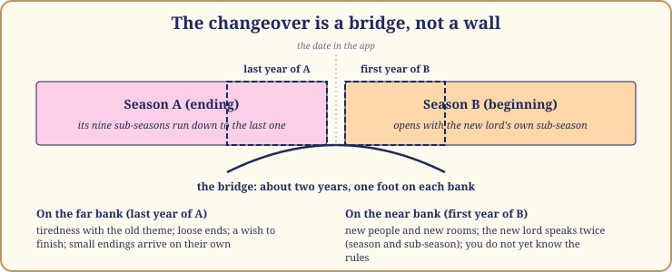
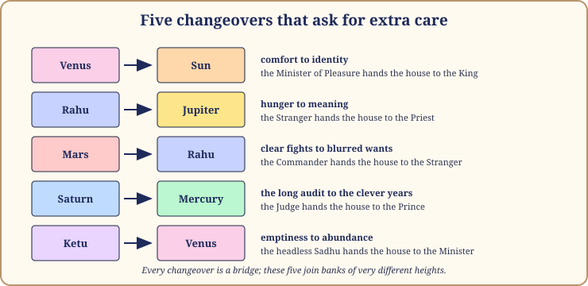
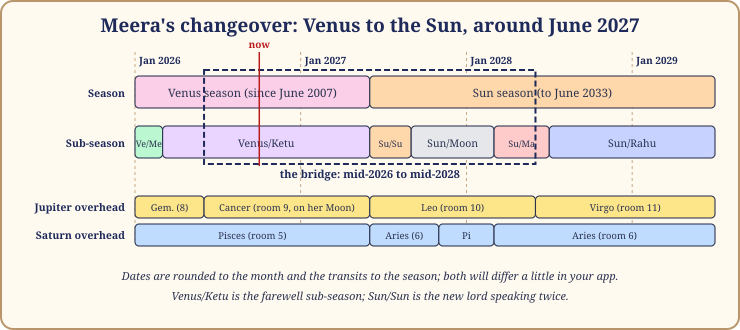

# Chapter 15: The Changeover

Your app will give you a date. Venus ends on the ninth of June; the Sun begins on the tenth. It looks like a border post: one country on each side and a line painted on the road.

Life does not work on painted lines, and neither, in my experience, does the dasha system. The turning point between seasons (dasha sandhi, the junction of the seasons) is not a line but a bridge. You step onto it about a year before the date and step off about a year after. For those two years you have one foot on each bank, which is why the changeover is both the most confusing stretch of a life and the one most worth preparing for. All dates in this chapter are approximate, and the ones in the future are hedged twice.

## The bridge: the last year and the first year

*Figure 15.1: The changeover as a bridge. The date in the app is the middle of it, not the start.*

A season ends with its last sub-season, which always belongs to the planet just before the season's own lord in the fixed order. A Venus season ends with Venus/Ketu. A Rahu season ends with Rahu/Mars. A Saturn season ends with Saturn/Jupiter. That last sub-lord is, by construction, the one furthest in the order from the planet about to take over: the household is being run by the outgoing lord's most distant colleague.

A season begins with its own lord speaking twice: Sun/Sun, Jupiter/Jupiter, Mercury/Mercury. For those first months the new planet's nature is undiluted. You get the pure form before you have learned the rules.

> **🔍 Why?** The system's own logic, plus tradition. The logic is the order of sub-seasons, which starts with the season's own lord and so must end with the planet just before it; check it in the sub-season table in Chapter 3. The tradition is that the classical authors and every working astrologer I know treat the junction as sensitive: results mixed, promises half-kept, care advised. Parashara gives no mechanism for the feeling; experience does. Everyday parallel: the last week of one job and the first week of the next. You are employed throughout, but nobody would call those two weeks ordinary.

> **📖 Story: The year of two keys.** By palace custom, a courtier leaving the running of the household did not simply hand over the keys on the appointed day. For a year before, the incoming courtier walked beside him through the kitchens and the treasury, learning which doors stuck and which servants could be trusted. For a year after, the outgoing one stayed in a room near the gate, answering questions. So for two years the palace had two sets of keys, and the servants never quite knew whose orders to follow. Things were lost in that time, and things were found, because new eyes saw what the old ones had stopped seeing. **Rule:** the changeover runs from the last year of the old season to the first year of the new; expect two years with two sets of keys.

## What people typically feel

On the far bank, in the last year of the old season: a tiredness with the season's theme, as if you have had enough of the thing you spent years wanting. Loose ends closing on their own: a lease ends, a friend moves, a project finishes without you pushing. Nostalgia, sometimes before the thing is over. A wish to finish properly. People in a last year often say "I don't know what I want any more," which is accurate: the old wanting is done and the new has not arrived.

On the near bank, in the first year of the new season, the feelings flip. New people appear, often in a rush. New rooms of life open that had been quiet for years. Excitement or disorientation or both, and a sense that you do not know the rules yet, because you do not: the person you were in the old season is standing in a house she has never managed. Decisions made in these months are made by someone who does not yet know who she is becoming.

Two honest notes. Some people feel nothing at the date and see the change only in hindsight, when their friends, work and worries have all quietly been replaced. And the strength of the feeling depends on how different the two lords are: Moon to Mars is a change of mood, Venus to Sun a change of person.

## Preparing: four closing rituals in plain terms

Nothing here needs a priest, a stone or a fee: these are the things a sensible person does when a chapter closes, done on purpose instead of by accident.

**1. Review.** Write the story of the ending season on one page. What did it give? What did it take? What did it teach you that you could not have learned any other way? Be fair to it. Even a season that tested you kept some promise, and naming it is the beginning of being able to leave.

**2. Gratitude.** List the people the season brought you, and thank at least three of them in words. A season is partly its people, and the ones leaving with it deserve to know they mattered. This is also how you find out which of them are coming with you.

**3. Clearing.** Physical first: the clothes, papers and photographs of the season, kept or let go deliberately. Then the undone: debts settled, apologies made, postponed conversations finished. Loose ends do not disappear at the changeover; they become the new season's baggage, and the last year is the cheapest time to carry them to the door.

**4. A letter to the next season.** Address it by name: "Dear Sun season." Say what you know about what it asks (Part II told you), what you want from it, and what you promise it. Seal it. Open it at the first sub-season change, about a year in, and see how much of it you still mean.

> **🧭 Anushka's rule of thumb:** Finish things in the last year; start nothing irreversible in the first six months. The bridge is for walking across, not for building on.

> **🔍 Why?** Tradition and plain experience, not astronomy. The tradition's advice to take care at a junction becomes, in practice, a timing rule: an ending season still has the authority to close its own business, and a beginning season has not yet shown you what it is. Everyday parallel: in a new job, the wise person spends the first months watching how things are done before changing anything, and uses the last months of the old job to leave the files in order.

## Five changeovers that ask for extra care

*Figure 15.2: Every changeover is a bridge; these five join banks of very different heights.*

**Venus to the Sun: comfort to identity.** Twenty years of the Minister of Pleasure, then six of the King. The person arriving has spent two decades learning to accommodate, to please, to be part of a pair; the Sun season asks who she is on her own. The first Sun year often brings a sharp interest in the father, or in authority at work, or in being seen, and a prickliness that surprises everyone, including her. It is also a period to take the health of the heart and the spine seriously, in the ordinary way: walk, check, rest. The gift on the far side is a spine, in both senses.

**Rahu to Jupiter: hunger to meaning.** Eighteen years of the Stranger's wanting, then sixteen of the Priest's teaching. The first Jupiter year can feel like the morning after a long festival: the pace drops, the appetite drops, and the person wonders what was wrong with her that she wanted all that. The mistake is to keep running at Rahu's speed in Jupiter's house. The right move is to let a teacher appear, and to notice that meaning arrives slowly and does not announce itself.

**Mars to Rahu: clear fights to blurred wants.** Seven hot, direct years, then eighteen in the smoke. In the Mars season you knew what you were fighting and whom: property, siblings, courage, the body. In Rahu's first year the opponents become unclear and the wants become large and foreign: a city abroad, a technology, an ambition with no shape yet. Devika walked this bridge from around mid-2020 to mid-2022, with a property dispute, a Mars matter, straddling the date in July 2021: exactly the kind of loose end the Commander leaves on the Stranger's desk. The task is to finish the clear fights before the smoke comes in.

**Saturn to Mercury: the long audit to the clever years.** Nineteen years of the Judge, then seventeen of the Prince. The person stepping off this bridge is usually older and has carried weight so long that lightness feels like a trick. Mercury scatters attention where Saturn fixed it, brings talk, trade, travel and young people where Saturn brought silence and duty. The first Mercury year asks her to trust that the audit is over and she is allowed to be curious again. Many spend it still filing reports nobody has asked for.

**Ketu to Venus: emptiness to abundance.** Seven years of the headless Sadhu, then twenty of the Minister of Pleasure. The person has learned not to want, and now the season of wanting begins. Meera walked this bridge at eighteen and a half, from around mid-2006 to mid-2008: a withdrawn, inward schoolgirl just out of Saturn's seven and a half years, arriving in college and in the long bloom. People on this bridge have to relearn appetite, and often feel guilty about it. They should not. The Sadhu's lesson was not that wanting is wrong, but that one can survive without; having learned that, one is finally safe to enjoy things.

> **📖 Story: The Minister leaves and the King arrives.** For twenty years the Minister of Pleasure had run the household, and the palace had grown soft and warm: music in the evenings, guests in every room, the accounts a little loose. On the day the King took over, he walked through the halls in silence, and the first thing he did was open the shutters. The light showed dust on everything. The servants, used to being asked how they felt, were now asked what they had done. Some left. The ones who stayed found that they stood straighter. He simply needed to know who was who, starting with himself. **Rule:** the Venus-to-Sun changeover trades comfort for clarity; expect light on things that were pleasantly dim.

## Meera's changeover, live: Venus to the Sun around June 2027

Here is the bridge as it stands under someone's feet right now. I write in late 2026, so everything past that date is a forward look, hedged as I would hedge it to Meera's face: I do not know what will happen. I know what is being asked.

*Figure 15.3: Meera's bridge, mid-2026 to mid-2028. Venus/Ketu is the farewell sub-season; Sun/Sun is the new lord speaking twice. Dates rounded to the month; transits to the season.*

**The far bank.** Her Venus season, begun in June 2007, closes around June 2027. Its last sub-season is Venus/Ketu, from around March 2026 until the season ends. Ketu sits in her room 10, the career room, in Leo, the Sun's own sign. So the farewell year of her Venus season is a letting-go in the room of work, in the sign of the planet about to take over: a rehearsal. I would expect her to lose interest in some part of her working life that she had held onto out of comfort rather than conviction, and to feel oddly unbothered by the loss. Overhead, Jupiter in Cancer from about mid-2026 to mid-2027 sits on her Moon in room 9: a year when faith, a teacher or a long journey comes to the mind during the farewell.

**The near bank.** Sun/Sun runs from around June to September 2027, then Sun/Moon to around March 2028, then Sun/Mars to around July 2028. Her Sun sits at 28° Scorpio in room 1 with Mercury; it owns room 10 and is on her side. A Sun that owns the career room and sits in the room of the self: the Sun season's question, who am I when nobody is watching, will be asked through work and answered in her own person. The hidden agenda from Chapter 13: the Sun sits in Jyeshtha, Mercury's star, and Mercury owns her rooms 8 and 11 and tests her. The second voice: an identity involving other people's resources and a network of friends, and argued over.

**The weather on the near bank.** Jupiter moves into Leo, her room 10, around the month the Sun season begins, and stays about a year: the Priest standing in the career room in the sign of the new King. Saturn enters Aries, her room 6, at about the same time, with a brief step back into Pisces late in 2027. As Chapter 14 showed, both slow planets touch room 6 in that first year, the room of daily work, routines and health. So my honest forward look: the first year of her Sun season will be about discipline rather than glory, about the shape of a working day and the care of the body, with recognition held back until the discipline is real. Sun/Moon from around September 2027 may bring the mother and the home forward, since the Moon sits in and owns her room 9, a fortunate pairing for a Scorpio rising.

**What I would tell her to do on the bridge.** Review: write the Venus season's one page now, in Venus/Ketu, while it is still hers to write. Gratitude: three letters, at least one to someone from the Venus/Rahu years around her marriage. Clearing: the comfort she keeps out of habit in the career room, let go of deliberately rather than waiting for Ketu to do it. The letter: "Dear Sun season," written before June 2027 and opened at Sun/Moon. And the rule of thumb: finish in the Venus year; watch in the first Sun months; build from about the start of 2028.

> **📖 Story: The Stranger meets the Priest at the gate.** When the smoke-headed Stranger's eighteen years were done, he met the Royal Priest at the gate and tried to hand over a list: all the things the household still wanted. The Priest read it, folded it, and put it in his sleeve. "We will see which of these were hungers and which were needs," he said. For the first year the list sat unread and the household felt strangely empty, and then one morning a teacher arrived who had been invited by nobody, and the Priest's years began in earnest. **Rule:** at the Rahu-to-Jupiter changeover, let the list sit; the first Jupiter year sorts hunger from need before it gives anything.

> **🪔 If you read for others:** The most useful thing you can give a person at a changeover is permission: to be tired of the old theme, not to know the new rules yet, to wait six months before deciding. Say the next season's task plainly and kindly, and do not predict its events. The task is yours to name; the events are theirs to live.

## In one breath

- The changeover is a bridge, not a line: the last year of the old season and the first year of the new, about two years with one foot on each bank.
- The old season ends with its most distant colleague's sub-season; the new one begins with its lord speaking twice, which is why the junction feels mixed.
- Last year: tiredness with the theme, loose ends closing, not knowing what you want. First year: new people, new rooms, not knowing the rules.
- Prepare with four plain rituals: review on one page, gratitude to three people, clearing of things and loose ends, and a letter to the next season.
- Finish in the last year; start nothing irreversible in the first six months.
- Five steep bridges: Venus to Sun, Rahu to Jupiter, Mars to Rahu, Saturn to Mercury, Ketu to Venus.
- Meera's Venus-to-Sun bridge runs from about mid-2026 to mid-2028; its task is a working identity built through discipline, and nobody, including me, knows its events.

## Try this

1. Find your current season's end date in your app. Mark one year before it and one year after it on your season map. Are you on the bridge now?
2. Meera's Venus season ends around June 2027. Using the sub-season lengths from Chapter 3, which sub-season does her Sun season open with, how long does it last, and which follows it?
3. Write the one-page review of your most recently finished season, even if it ended years ago: what it gave, what it took, what it taught.
4. Write the first paragraph of a letter to your next season, addressed by its lord's name. Keep it in this book.
5. Think of someone you know who is clearly on a bridge. Without naming any planets, write the three sentences of permission you would offer them.

Answers

2. It opens with Sun/Sun, which lasts 3 months and 18 days (6 × 6 ÷ 120 of a year): around June to September 2027. Sun/Moon follows, lasting 6 months, to around March 2028.

