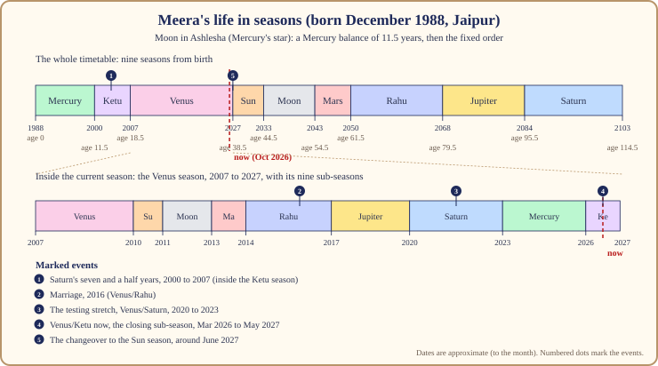
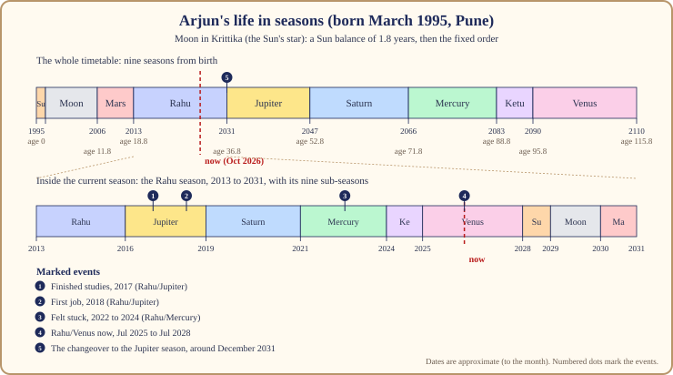
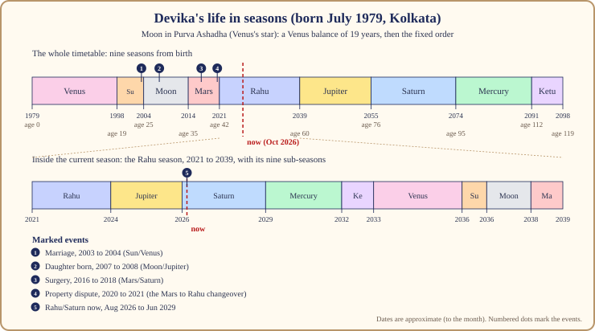

# Chapter 16: Three Lives in Seasons

We have walked the nine seasons one at a time. Now let us do what an astrologer does when a person sits down across the table: read a whole life, from the first season to the one running today, as one story.

I will do it three times, for Meera, Arjun and Devika, the constructed charts that have travelled with us since Chapter 2, using only the events we already know about them. Each story ends with the two questions that matter most in a reading: what does the current season ask of this person now, and what will the next one ask?

One note for the whole chapter: every date here is approximate. Your app may say June 2027 where your cousin's says May 2027, and both are right to the precision this method has. Read "around", not "on".

## Meera: the long bloom, and a door opening

Meera was born in Jaipur on a December morning in 1988, Scorpio rising, the Moon at 21° Cancer in Ashlesha, Mercury's star. The Moon had walked 4°20′ of the star's 13°20′, so two-thirds of the Mercury season was left to her: 11.475 years, to around June 2000.

**Mercury, birth to June 2000 (age 0 to 11.5).** A childhood under the clever young Prince: quick, talkative, bookish. Mercury sits in her first room with the Sun, so the season showed in her face: the child who asked "why" and could not be fobbed off. Mercury tests her, owning her eighth and eleventh rooms, which in a child means little more than restlessness and a nervous stomach before exams.

**Ketu, June 2000 to June 2007 (age 11.5 to 18.5).** The headless Sadhu ran her teenage years, and Saturn's seven and a half years lay over the same stretch. That is a heavy pairing between twelve and eighteen: a season of letting go while the old Judge presses on the Moon. Ketu sits in her tenth room, so the letting go touched what she thought she would become. The nine sub-seasons ran from Ketu/Ketu to Ketu/Mercury, which closed the season as she finished school. This is the season that made her inward.

**Venus, June 2007 to June 2027 (age 18.5 to 38.5).** Then the Minister of Pleasure took the household for twenty years. Venus is at home in Libra in her twelfth room, strong but placed in the room of far places, expenses and retreat, and for Scorpio rising Venus tests her. A long, real bloom with a bill attached. The sub-seasons:

- **Venus/Venus, June 2007 to October 2010.** College and the first taste of adult freedom.
- **Venus/Sun, Venus/Moon and Venus/Mars, October 2010 to August 2014.** Three planets on her side: the years one grows into one's own face.
- **Venus/Rahu, August 2014 to July 2017.** Her marriage, in 2016, at twenty-seven and a half. Rahu sits in her fourth room, the room of home, five rooms on from Venus and not in any of the three wrong rooms (6, 8, 12) from the season lord. The planet that stands for marriage ran the season; a friend from the room of home ran the sub-season.
- **Venus/Jupiter, July 2017 to March 2020.** The Royal Priest, her best planet, in her seventh room of partnership: the settling years after a wedding.
- **Venus/Saturn, March 2020 to May 2023.** The testing stretch. Saturn mildly tests her and sits outshone by the Sun in her second room (family, money, speech). Slowness, duty, bills, the adult discovery that comfort is work. The method does not call this a disaster; it calls it an audit.
- **Venus/Mercury, May 2023 to March 2026.** The Prince again, testing her from the first room: busy, scattered, full of plans.
- **Venus/Ketu, March 2026 to May 2027.** Now. The last sub-season of a twenty-year season is always the Sadhu's, and he is loosening her grip on the things of the season.

*Figure 16.1: Meera's season map. The top bar is the whole timetable; the lower bar opens the Venus season (June 2007 to June 2027). The dashed red line is October 2026.*

> **🔍 Why?** Why did the marriage fall in Venus/Rahu and not Venus/Jupiter, when Jupiter sits in her marriage room? The system's own logic, with its limits. The season lord opens the subject: Venus stands for marriage, so all twenty years were marriage-coloured. The sub-lord picks the moment: Rahu sits in her room of home, is well placed from Venus, and is the courtier who makes things happen suddenly and in public. The method gave two or three good windows; life chose one. Everyday parallel: the monsoon is the season for rain; which Tuesday the roof leaks is another matter.

> **📖 Story: The Minister hands over the keys.** For twenty years the Minister of Pleasure (Venus) has run Meera's household: music in the evenings, a wedding in the courtyard, a bill for all of it in a drawer in the twelfth room. In the final year the headless Sadhu (Ketu) walks the corridors behind him, quietly closing doors. Then the King (Sun) arrives from the first room, where he has always lived, and asks a question nobody has asked her in twenty years: "Who are you, apart from what you love and who loves you?" **Rule:** the last sub-season of any season belongs to the planet before the season lord in the fixed order, so Venus always ends in Ketu, and the Sun always begins from Ketu's loosened grip.

**What this season asks of her now.** A gentle inventory. What in these twenty years was hers, and what was borrowed comfort? Which relationships nourish and which are habit? The Sadhu in the tenth room asks her to let the old picture of her work go without panic. This is not the time to start the next big thing. It is the time to finish, to thank, to clear a cupboard.

**What the next one will ask.** The Sun season, around June 2027 to June 2033, opens with Sun/Sun for three and a half months and then Sun/Moon to around March 2028. Her Sun is on her side, in her first room. The King will ask her to stand in her own name: to be visible, to lead something, to take her health (heart, spine, eyes) seriously, and to make peace with her father or with authority itself. After twenty years of Venus it will feel bright and a little exposed. It is a short season, so the asking will be clear and quick.

## Arjun: the great churning at thirty-one

Arjun was born in Pune on a March evening in 1995, Cancer rising, the Moon at 6° Taurus, at its strongest place, in Krittika, the Sun's star. The Moon had 4° of the star left, so he received only 1.8 years of the Sun season, to around December 1996.

**Moon, December 1996 to December 2006 (age 1.8 to 11.8).** His childhood belonged to the Queen Mother, and his Moon is his strongest planet, in his eleventh room of friends and gains. For a Cancer-rising child this is as kind a season as the method gives: mother, home, food, a crowd of friends.

**Mars, December 2006 to December 2013 (age 11.8 to 18.8).** The Commander ran his school years, and Mars is his best planet, owning his fifth and tenth rooms. Sport, competition, the boy who could not sit still in class but could lead a team. Mars walks backwards in his second room, so the energy turned inward as often as out: a quick temper at the dinner table, a fierce privacy about his ambitions.

**Rahu, December 2013 to December 2031 (age 18.8 to 36.8).** Then the smoke-headed Stranger, for eighteen years. Rahu sits in his fourth room in Libra, Venus's sign, so Rahu borrows the Minister's nature: a hunger for beauty, comfort, a fine home, approval. In the room of home and formal education, the hunger first turned to study.

- **Rahu/Rahu, December 2013 to August 2016.** The college years: restless, foreign-facing, full of appetite.
- **Rahu/Jupiter, August 2016 to January 2019.** The Royal Priest, on his side, in his fifth room of learning, two rooms on from Rahu. He finished his studies in 2017, at twenty-two, and took his first job in 2018. A good planet in a good room from the season lord, and the two events a young man most wants landed in it.
- **Rahu/Saturn, January 2019 to November 2021.** The Judge, neutral for Cancer rising, outshone in his eighth room. Early career, long hours, the first taste of how slowly a workplace moves.
- **Rahu/Mercury, November 2021 to June 2024.** The stuck years, 2022 to 2024. Mercury tests him, owning his third and twelfth rooms, and sits in the eighth room with the Sun and Saturn. The Stranger's hunger met the Prince's scattering: too many plans, too many tabs open, running hard and staying in place. Nothing broke. A stuck sub-season is a sub-season, not a verdict, and it had a date on it.
- **Rahu/Ketu, June 2024 to July 2025.** The Sadhu's thirteen months: a clearing, the two shadow planets facing each other, home against work.
- **Rahu/Venus, July 2025 to July 2028.** Now. Venus owns his fourth and eleventh rooms and tests him, but she sits in his seventh room of partnership and is Rahu's natural friend.

*Figure 16.2: Arjun's season map. The lower bar opens the Rahu season (December 2013 to December 2031). He stands a little past the first third of Rahu/Venus.*

> **📖 Story: The Stranger invites the Minister to dinner.** The smoke-headed Stranger (Rahu) has been master of Arjun's house for twelve years and has filled it with books (the Priest's years), ledgers (the Judge's) and half-finished letters (the Prince's). Now the Minister of Pleasure (Venus) comes to stay for three years. She hangs curtains in the seventh room, the room of partners, and the Stranger, who already wears her sign like a borrowed coat, is enchanted. Everything becomes about the one person across the table and the house they might share. The old Judge, watching from the eighth room, mutters that the Minister owns two rooms that cost this household dearly. **Rule:** when a sub-lord is the season lord's natural friend but tests you by what it owns, the sub-season feels pleasant and spends more than it earns; enjoy it with a budget.

> **🔍 Why?** Why does Rahu borrow Venus's nature here? Tradition and the system's own logic together. Rahu and Ketu own no signs (Parashara gives them none), so the tradition says they speak with the voice of the planet whose sign they sit in: Rahu in Libra speaks like Venus; in Capricorn he would speak like Saturn. Everyday parallel: a new tenant takes on the habits of the building. In a building full of musicians, he starts humming.

**What this season asks of him now.** To want well. The Stranger wants everything; the Minister wants beauty and company. Together, in the room of partnership, they ask: can you let someone in without losing yourself to their approval? Can you make a home (the fourth room, where Rahu sits) without buying one you cannot afford (the eleventh, Venus's other charge)? It is a sociable, spending, falling-in-love sub-season, and the task is to keep one foot on the ground while enjoying it. Rahu/Sun follows, July 2028 to May 2029, and will ask him to be clear about who he is inside whatever he has made.

**What the next one will ask.** The Jupiter season, around December 2031 to December 2047, begins when he is nearly thirty-seven. Jupiter is on his side in his fifth room of children, learning and the things one creates. After eighteen years of hunger the Priest will ask him to find meaning in what the hunger gathered: to teach, to raise, to believe in something. The Rahu-to-Jupiter changeover is one of the special bridges of Chapter 15, and the last Rahu sub-season, Rahu/Mars (November 2030 to December 2031), will feel like a sprint before a long walk.

## Devika: four seasons in one adult life

Devika was born in Kolkata at five minutes to midnight in July 1979, Aries rising, the Moon at 14° Sagittarius in Purva Ashadha, Venus's star. The Moon had only just entered the star, so she received almost all of it: a Venus balance of nineteen years, to around July 1998.

> **🔍 Why?** Why nineteen years and not twenty? The system's own logic, and you can check it on your fingers. Purva Ashadha runs from 13°20′ to 26°40′ Sagittarius. Her Moon at 14° had 12°40′ of the 13°20′ still to walk: 95 per cent, and 95 per cent of twenty years is nineteen. Everyday parallel: board a train that has already covered a tiny part of its route and you get nearly the whole journey.

**Venus, birth to July 1998 (age 0 to 19).** Her whole childhood and youth under the Minister of Pleasure. Venus sits in her third room in Gemini with Mars, her rising-sign lord, and for Aries rising Venus tests her. Nineteen years is long enough for a season to become a personality: the adults who know Devika as graceful, hospitable and a little indulgent are describing her first season.

**Sun, July 1998 to July 2004 (age 19 to 25).** The King, on her side, in her fourth room with Jupiter at its strongest place. Six years of finding her own authority. The last sub-season, **Sun/Venus, July 2003 to July 2004,** brought her marriage at twenty-four: the season lord stood for identity, the sub-lord for marriage, and the planet of her nineteen-year childhood came back for one year to hand her into a new house.

**Moon, July 2004 to July 2014 (age 25 to 35).** Her Moon sits in the ninth room in Jupiter's sign while Jupiter sits in the Moon's: the two have swapped homes and carry each other's business. In **Moon/Jupiter, June 2007 to October 2008,** her daughter was born. The Moon stands for mother, Jupiter for children, and the two planets that had exchanged houses ran the season and the sub-season together. If I could teach only one example of the timetable touching a life, it would be this one. Moon/Saturn and Moon/Mercury (October 2008 to October 2011) were the tired years of a small child's mother.

**Mars, July 2014 to July 2021 (age 35 to 42).** The Commander, her rising-sign lord, on her side but outshone by the Sun. **Mars/Saturn, December 2016 to January 2018,** was her surgery, 2016 to 2018. Mars stands for the surgeon's knife; Saturn tests her and sits in her fifth room with Rahu and Mercury. I will say what the method says and no more: it was a stretch to take the body seriously, and she did, and it passed.

**The changeover, 2020 to 2021.** Her property dispute fell exactly across the bridge from Mars to Rahu. Mars stands for land; Rahu for the stranger at the gate, the outsider's claim. A property quarrel at that handover is almost a textbook illustration of why Chapter 15 asked you to watch the changeovers.

**Rahu, July 2021 to July 2039 (age 42 to 60).** Rahu sits in her fifth room in Leo, the Sun's sign, with Saturn and Mercury, and borrows the King's voice: a hunger for recognition, for the stage, for her children's success. Rahu/Rahu (to March 2024) set the themes. **Rahu/Jupiter, March 2024 to August 2026,** brought her best planet, but from the twelfth room counted from Rahu, one of the wrong rooms: help came sideways and quietly, I suspect, rather than in the open. And now **Rahu/Saturn, August 2026 to June 2029.** The Judge and the Stranger sit in the same room of her chart, and Saturn tests her. This is the sub-season I would have circled in advance.

*Figure 16.3: Devika's season map. Four seasons have passed in her adult life; the lower bar opens the Rahu season (July 2021 to July 2039), which she entered at forty-two.*

> **📖 Story: The Judge moves into the Stranger's room.** In Devika's palace the fifth room, the room of children and of the heart's creations, is crowded. The smoke-headed Stranger (Rahu) has lived there since 2021, hungry to be seen. The clever young Prince (Mercury) keeps his papers there. And the old Judge of Labour (Saturn) has his desk in the corner, where he has always been, except that now, for two years and ten months, he is on duty. He asks the Stranger for receipts. He asks the Prince to finish one letter before starting the next. He asks the mistress of the house to slow down, attend to her elders, and accept that recognition arrives by the servants' staircase, late and on foot. **Rule:** a sub-lord sitting in the same room as the season lord does not soften the season; it concentrates it in that room's affairs.

**What this season asks of her now.** Patience in the very place she is hungriest: children, creativity, the wish to be recognised. Saturn's tasks are always the same. Keep the routine. Do the unglamorous work. Attend to the old people in the family. Treat the body as a tenant who deserves repairs. Do not borrow against the future for appearances; the Stranger will suggest it and the Judge will present the bill. Her Jupiter, at its strongest place in her room of home, is the floor under her feet, and its practices from Chapter 17 are the ones I would lean on. The stretch has an end date, and it is on the map.

**What the next one will ask.** The remaining Rahu sub-seasons carry her to sixty. Then the Jupiter season, around July 2039 to July 2055, sixteen years with her best planet, strong, in the room of home. The Priest will ask her to become what the Stranger only wanted to be seen as: a source of wisdom in her family, a teacher of something, a woman whose home others come to for counsel. She crosses the Rahu-to-Jupiter bridge in 2039, eight years after Arjun crosses his.

## What the three maps have in common

The same nine courtiers run every household in the same order, but no two lives hear them at the same age: Meera's youth was Ketu's, Arjun's was Mars's, Devika's was Venus's. The events we know fell where the method says they tend to fall: marriage under Venus or in a Venus sub-season, a child under the Moon and Jupiter, a surgery under Mars with Saturn, a property quarrel at a Mars-to-Rahu bridge, a career start under Jupiter, a stuck patch under a testing Mercury. I chose clean examples to teach with, and real lives are messier, but the direction is real. And all three are in a sub-season right now that asks them to slow down, close, or steady. From their ages alone, 37, 31 and 47, you would not have guessed it. The season map tells you what the calendar cannot.

## In one breath

- A whole life reads as one story when you walk its seasons in order and pause where the timetable and the life touched.
- Meera: a Mercury childhood, a Ketu adolescence under Saturn's seven and a half years, twenty years of Venus (marriage in Venus/Rahu, 2016; the testing Venus/Saturn, 2020 to 2023), now Venus/Ketu, with the Sun season from around June 2027.
- Arjun: a Moon childhood, a Mars adolescence, a Rahu season from late 2013 (degree and first job in Rahu/Jupiter; stuck in Rahu/Mercury), now Rahu/Venus to July 2028, with Jupiter from late 2031.
- Devika: nineteen years of Venus, marriage in Sun/Venus, a daughter in Moon/Jupiter, a surgery in Mars/Saturn, a property dispute at the Mars-to-Rahu changeover, now Rahu/Saturn to June 2029.
- The season lord opens the subject, the sub-lord picks the moment, and the rooms they sit in say where in life it lands.
- Every date is approximate; you are reading the shape, not the day.

## Try this

> **✍️ Try this:**
>
> 1. Cover the event lists in the three figures. From the bars and what you know of the courtiers, write one line about each person's current sub-season. Then uncover the lists and compare.
> 2. Pick the life whose shape is most like yours (a long first season, a short one, a testing stretch in your thirties) and write down why.
> 3. Choose one past sub-season of Meera, Arjun or Devika that I did not comment on and write, in two sentences, what the court was doing in that household.
> 4. Which "what the next season will ask" paragraph moved you most? That is probably the season you are closest to. Write its question in your own words.
