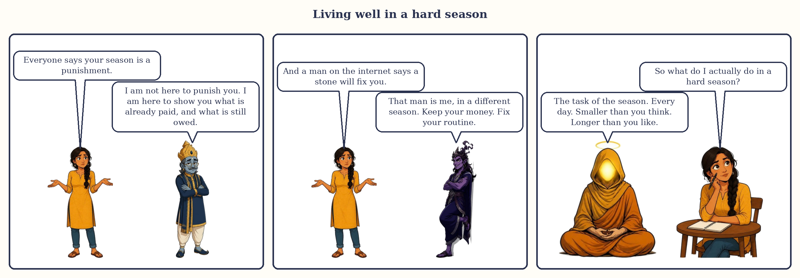

# Chapter 17: Living Well in a Hard Season

Somebody in your family has said one of these sentences. "His Saturn has started." "She is in Rahu, poor thing." "It is Ketu, nothing will move for seven years." They are said in the tone people use for a diagnosis, and they take a stretch of time that has a task in it and turn it into a sentence to be served.

This chapter is the antidote: the three seasons people fear, the sub-seasons inside them that genuinely bite, and how to live through them well. By well I do not mean comfortably. I mean awake, useful and unafraid. Every date here, as always, is approximate.

*Living well in a hard season.*

## The three feared seasons

Three courtiers frighten people: the old Judge of Labour (Saturn, nineteen years), the smoke-headed Stranger (Rahu, eighteen) and the headless Sadhu (Ketu, seven). Between them they hold forty-four of the hundred and twenty years, so more than a third of any long life is spent in one of them. If they were curses, the human race would have given up long ago. They are teachers, and each teaches what the others cannot.

**Saturn tests by weight.** Work, limits, the slow discovery of what you can and cannot carry, and lessons about time: that it passes, that it must be respected, that effort put in now pays out later and not before. Parashara's results for a badly placed Saturn are not pleasant reading, but the same tradition calls Saturn the planet that stands for longevity and for the servant who stays. The people I know who came out of a Saturn season well came out steadier, with fewer friends and better ones.

**Rahu tests by hunger.** Ambition, obsession, foreign places and new technologies, sudden rises, and the confusion of wanting too many things at once. His season is not grey like Saturn's; it is loud and exciting, and the damage is done at the top of the ride, not the bottom. The task is to want well: to pick the hungers worth feeding and stay honest while you feed them.

**Ketu tests by subtraction.** Endings, detachment, a pull towards solitude or the inner life, and a sense that nothing is happening while, under the surface, everything is being rearranged. People misread it as stagnation. It is pruning.

> **🔍 Why?** Why do these three frighten, when Mars and the Sun are also hard by nature? The system's own logic. Mars and the Sun are hard the way fire is hard: fast, visible, over quickly, with short seasons. Saturn, Rahu and Ketu are hard the way weather is hard: slow, invisible and long. The fear is really a fear of duration. Everyday parallel: a slap stings and is forgotten; a damp wall worries you for years, not because it hurts but because it does not stop.

## The sub-seasons that bite

A nineteen-year season is not nineteen years of one weather. The rule from Chapter 3 holds: is the sub-lord a friend of the season lord, and does it sit in a wrong room (6, 8 or 12) counted from the season lord in your chart? The first question I can answer for everyone, using the working friendships from Book 1; the second only your chart can. So this table is the general picture, to be corrected by your map.

| Season | Usually bite | Usually ease | The one to circle |
|---|---|---|---|
| **Saturn** (19 y) | 🔴 Saturn/Saturn (the first 3 years) · 🔴 Saturn/Mars · 🔴 Saturn/Sun · 🔴 Saturn/Moon | 🟢 Saturn/Venus · 🟢 Saturn/Mercury · 🟡 Saturn/Jupiter · 🟡 Saturn/Rahu · 🟡 Saturn/Ketu | Saturn/Saturn, especially if Saturn's seven and a half years are also running |
| **Rahu** (18 y) | 🔴 Rahu/Rahu (the first 2 years 8 months) · 🔴 Rahu/Sun · 🔴 Rahu/Moon · 🔴 Rahu/Mars · 🟡 Rahu/Ketu | 🟢 Rahu/Venus · 🟢 Rahu/Mercury · 🟡 Rahu/Saturn (friends, but two slow planets) · 🟡 Rahu/Jupiter (depends on your Jupiter) | Rahu/Saturn: nearly three years of hunger under audit |
| **Ketu** (7 y) | 🔴 Ketu/Moon · 🔴 Ketu/Sun · 🟡 Ketu/Ketu (the first 5 months) · 🟡 Ketu/Rahu | 🟢 Ketu/Mars · 🟢 Ketu/Venus · 🟢 Ketu/Saturn · 🟡 Ketu/Jupiter · 🟡 Ketu/Mercury | Ketu/Moon: seven months in which the mind feels unmoored |

Your chart overrides the dots. Devika's Rahu/Jupiter was a friendly sub-lord in a wrong room; Meera's Venus/Saturn a sub-lord in a fine room who tests her by what he owns. The dots say where to look; the chart says what you will find.

> **⚠️ Common mistake:** Reading the first sub-season as the whole season. Saturn/Saturn is three years; Rahu/Rahu under three; Ketu/Ketu five months. Many people decide in the first year that "this is what the next nineteen years will be like" and arrange their lives around that fear. The first sub-season is the loudest, not the truest.

## The mindset: a season has a task

My whole philosophy of hard seasons in one sentence: a season is not a verdict on you; it is a task set for you.

This is not my softening of the tradition. The classical theory of karma, given in plain words in Chapter 1, says the chart shows the portion of the past that has ripened for this life, and that what you do now is yours. The season tells you what kind of work has come due. It does not say how you will do it, and it never says you will fail.

> **🔍 Why?** Why "task" and not "fate"? The tradition's own reasoning. Parashara describes each season's results as tendencies conditioned by the planet's strength and placement, and the same tradition prescribes a practice (upaya) for every planet, which would make no sense if the results were fixed. A system that hands you a practice does not believe in a sentence. Everyday parallel: a school sets an exam, not a grade.

So in a hard season I ask three questions, in this order. What is the task? (Saturn: work, endure, simplify, honour time and elders. Rahu: want well and stay honest. Ketu: let go and look inward.) What is the task doing to my body and my mind? Write it down; this is what you take to a doctor if you need one. And what would a person who had understood the task do this week? Not this year. This week.

> **📖 Story: The Judge's long table.** A young merchant was told the old Judge of Labour (Saturn) would run his household for nineteen years, and he went home and wept. On the first morning the Judge laid a long table and set on it everything the merchant owned: the ledgers, the debts, the promises made and forgotten. "I am not here to ruin you," the Judge said. "I am here to go through all of it with you, one page a day, until it is in order. The Minister of Pleasure (Venus) will visit in a few years and the Prince (Mercury) after her, and you will be glad of them. But the table is mine, and we start today." The merchant found that a page a day was not unbearable. It was only steady. **Rule:** Saturn's season asks for a daily portion of honest work, never a heroic burst; the length of the season is the length of the table, not the depth of the punishment.

## Daily practices matched to each planet

The tradition gives each planet a weekday, a conduct, a service and a routine. I give all nine, because the sub-lord changes every year or three and you will want the matching row. These are things to do, not things to buy; nothing here costs more than a packet of sesame. The dots mark how safe each row is for anyone, in any season, without a reading.

| Planet (its day) | Conduct | Service | Routine | Safe for all? |
|---|---|---|---|---|
| **Saturn** (Saturday) | Keep your word, especially to those who cannot make you. Be punctual. | The old, the disabled, the labourer, the watchman. Sesame, mustard oil, iron, a blanket. | One fixed duty at the same hour daily. Walk. Early to bed. | 🟢 |
| **Rahu** (Saturday; some say Wednesday) | Tell the truth when a shortcut is available. Finish one thing before starting the next. | The outsider: a migrant worker, a stranger in town. A coconut, a blanket, dark blue cloth. | No screen late at night. Write what you want; cross out all but three. | 🟢 |
| **Ketu** (Tuesday or Thursday) | Let a grievance go on purpose. Be alone without filling the time. | Stray dogs. A blanket or sesame. Give away what you have not used in a year. | Ten quiet minutes a day with no phone. | 🟢 |
| **Sun** (Sunday) | Stand up straight, in body and opinion. Respect your father, or his memory. | Wheat, jaggery, copper; a government school. | Up at sunrise on Sundays. Morning sunlight. Check heart and eyes. | 🟢 |
| **Moon** (Monday) | Be kind to your mother, and to your own moods. | Rice, milk, white cloth, to a woman in need. | Water first thing. Regular meals and sleep. A clean house. | 🟢 |
| **Mars** (Tuesday) | Courage without cruelty: say the hard thing without raising your voice. | Red lentils, red cloth; a brother or a soldier's family. | Daily exercise to a sweat. Mind the knife, the stove, the road. | 🟡 (easily becomes a fight) |
| **Mercury** (Wednesday) | Speak accurately. Do not exaggerate, even in jokes. | Green moong; books or stationery to a student. | Read ten pages. Write a page. Keep accounts. | 🟢 |
| **Jupiter** (Thursday) | Teach what you know. Respect teachers. | Chana dal, turmeric, yellow cloth, books; a child's school fee. | Study something hard a few minutes a day. A simple meal on Thursdays if health allows. | 🟢 |
| **Venus** (Friday) | Be gracious. Make something beautiful: a meal, a room, a song. | Curd, ghee, rice, white cloth; a young woman in need. | Clean clothes, a clean bed, music in the evening. Spend within a limit set on Friday. | 🟡 (easily becomes shopping) |

In a Saturn season the Saturn row is your base for nineteen years and you add the row of whichever sub-lord is running; in a Rahu season the Rahu row is the base, and so on. When two rows disagree (Rahu says "no screen late", Mercury says "read ten pages"), do both: read ten pages of paper.

> **🔍 Why?** Why is Saturday Saturn's day, and why do practices sit on weekdays at all? Astronomy and tradition together. The seven weekdays are named for the seven visible planets in an order that comes from the ancient planetary hours: each hour was given to a planet in order of apparent speed, and the planet of the first hour named the day. Saturday is literally Saturn's day in English, as in Sanskrit (Shanivar). That a planet is most reachable on its own day is tradition. Everyday parallel: you can post a letter any day, but you go to the office on the day the clerk you need is at the counter.

## When to seek medical or psychological help

A season describes weather; it is not a diagnosis. If you are in a Saturn season and your knees hurt, see a doctor about your knees. If you are in a Ketu season and have lost interest in everything you used to love, talk to a counsellor; do not wait seven years. If you are in a Rahu season and have not slept properly for weeks, that is a sleep problem, and sleep problems are treatable. The season may explain why this is happening now. It never replaces the treatment.

These signs mean "book the appointment this week", whatever the sky is doing:

- Sleep broken, or appetite gone, for more than two weeks.
- Weight dropping or rising without your trying.
- A low mood or dread there every morning for more than two weeks, or that stops you working, washing or eating.
- Panic out of nowhere, more than once.
- Drinking or smoking more to get through the day.
- Any thought of harming yourself or of not wanting to be here. This is an emergency, not a season. In India the government's Tele-MANAS line is 14416, free, at any hour. Wherever you live, there is a number. Call it, or ask someone to sit with you while you do.
- Chest pain, breathlessness, a sudden severe headache, a fall, bleeding that does not stop: the hospital, today.

I have sent people in a Saturn season for vitamin D and thyroid tests, people in Ketu to a counsellor, people in Rahu to a doctor about sleep, and in each case the astrology was useful precisely because it pushed them towards a professional. Any astrologer who tells you to postpone a doctor because "it is the dasha" has misunderstood both.

> **🪔 If you read for others:** Never diagnose, and never let a planet become a reason to delay care. My sentence is: "This is a stretch to take the body seriously, so let us make sure the doctor has had a look." If someone tells you something that frightens you, give them a number to call before you give them a date.

## What not to buy

Hard seasons are when people are sold things, because fear opens the purse. The thing most often sold is a stone: a blue sapphire "for Saturn", a hessonite "for Rahu", a cat's eye "for Ketu", priced by the buyer's fear rather than the stone's weight, and sold with the sentence "this will pacify the planet".

Here is the classical rule, labelled as such because it is what the tradition itself says: a stone strengthens the planet it belongs to. It does not pacify, soften or calm it; it gives it more voice. You wear a stone for a planet that is on your side and needs strength. You do not wear one for a planet that is testing you, because you would be handing a louder microphone to the one courtier already asking the hardest questions. When a Saturn season is hard because Saturn tests you by what he owns, a blue sapphire is exactly the wrong purchase; when it is hard even though Saturn is on your side, you might consider one, but only after a reading of the whole chart, never from a stall that has looked at your date of birth and nothing else.

| What is offered | Dot | Why |
|---|---|---|
| A stone for the season lord, when that planet tests you | 🔴 | The classical rule: a stone strengthens; you do not strengthen the planet testing you. |
| A stone for the season lord when it is on your side, sold without reading the whole chart | 🟡 | Possibly right, but only a full reading can say; the stall cannot. |
| An expensive ritual "to remove" the season | 🔴 | A season cannot be removed, only lived. The price is the tell. |
| The practices in the table above | 🟢 | Free, safe, the tradition's first prescription for every planet. |
| A doctor, a counsellor, a lawyer, an accountant, as the season requires | 🟢 | Saturn's season asks for exactly these people. |

> **📖 Story: The Stranger's bazaar.** When the smoke-headed Stranger (Rahu) runs a household, a bazaar springs up outside its gate: blue stones and orange stones, threads, amulets, a seven-day ritual and a seven-year one. A frightened woman walks the stalls with her purse open. The old Judge (Saturn), passing on his Saturday rounds, stops her. "What are you buying?" "Something to make it stop." "Nothing here makes anything stop," he says. "That orange stone is the Stranger's own. Wear it and he will shout louder. Go home. Feed the watchman. Sleep before midnight. Come to me on Saturdays and I will show you the accounts." She goes home with a full purse and a short list. **Rule:** a stone belongs to one planet and strengthens that planet; in a testing season the planet's own stone is the one thing never to buy.

## How to talk to family about their seasons

The hardest reading you will ever give is to your own mother across the kitchen table, because she hears everything twice as loudly. My rules: lead with the task, not the planet. Give the end date as a horizon ("by the middle of 2029 this stretch is done"), never as a threat ("three more years of this"). Ask permission before you say anything. Say nothing about death, divorce, bankruptcy or illness, ever; you do not know, and the sentence cannot be unsaid. Keep the planet's name for later, or for never. And say what you yourself will do, because a season shared is a season halved.

- Instead of "Papa, your Saturn has started": "Papa, this is the kind of stretch where the body wants slow repairs and the days want a routine. Shall we book the check-up we keep postponing, and walk together on Saturdays?"
- Instead of "Didi, you are in Rahu, be careful": "Didi, the next few years will put a lot of shiny things in front of you. When something feels urgent, call me before you sign. I will do the same for you."
- Instead of "Ma, it is Ketu, nothing will move": "Ma, this is a quiet stretch, the kind where things get sorted out underneath. It is a good time for the things you always said you would do if you had time. What were they?"
- When a relative is frightened by what someone else said: "Whoever said that was describing weather, not pronouncing a sentence. Tell me exactly what they said and we will take it apart together."
- When asked "how long?": "The heaviest stretch ends around the middle of next year. The larger season runs several more, but it changes character every year or two, and I will tell you when the next change is coming."

> **📖 Story: The Queen Mother's kitchen.** The Queen Mother (Moon) sat at the kitchen table and her daughter, who had learnt the timetable, came in with a printout. The daughter began, "Your Saturn...", and the Queen Mother's face closed like a door. The daughter stopped, put the printout away, and started again. "Ma, the next few years want you to slow down and look after your knees, and I want to do it with you. Let us walk on Saturday mornings." The door opened. Later, when the Queen Mother asked, "Is it a bad time?", the daughter said, "It is a working time, and it has an end, and I am here for all of it." **Rule:** when you speak of a season to someone you love, say the task, say the horizon, say what you will do beside them, and leave the planet's name in your pocket.

> **🧭 Anushka's rule of thumb:** In a hard season, change nothing big in the first sub-season, buy nothing out of fear, see the doctor before the astrologer, and do the planet's practice on its day for one month before deciding whether it helps.

## In one breath

- Saturn, Rahu and Ketu hold forty-four of the hundred and twenty years; they are teachers, not curses, and the fear of them is mostly a fear of duration.
- Saturn tests by weight, Rahu by hunger, Ketu by subtraction; the first sub-season is the loudest, and the season lord's enemies bite hardest.
- A season is a task, not a verdict: ask what the task is, what it is doing to body and mind, and what a person who understood it would do this week.
- Each planet has a day, a conduct, a service and a routine; these cost nothing and are the tradition's first prescription.
- Sleep, appetite, mood, panic, drinking, any thought of self-harm: the doctor and the counsellor, this week, whatever the sky is doing.
- A stone strengthens the planet it belongs to (the classical rule), so the season lord's own stone, in a testing season, is the one thing never to buy.
- With family, lead with the task, give the end as a horizon, and keep the planet's name in your pocket.

## Try this

> **✍️ Try this:**
>
> 1. Find your current season and sub-season. Write each lord's task in one line, then what a person who understood both would do this week.
> 2. Do the practice row for your season lord, weekday included, for one month, with a two-line diary each night. Then decide honestly whether anything shifted.
> 3. Recall a sentence about your seasons that once frightened you. Rewrite it by this chapter's rules: task first, horizon not threat, no planet's name.
> 4. Write the names of two people you would call if a hard season became more than weather: one medical, one you simply trust. Put the numbers in your phone tonight.
