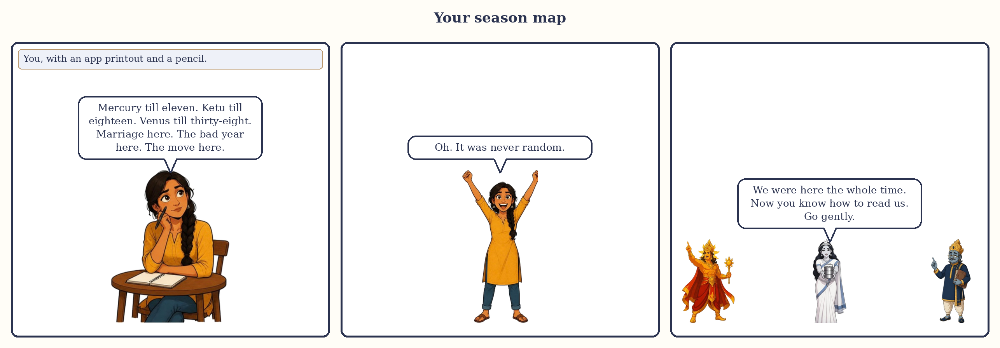

# Chapter 18: Your Season Map

Everything so far has been reading. This chapter is writing. You will need a free app or program (Appendix C shows how to get the table out of it), a sheet of paper turned sideways, a pencil, a few coloured pencils, and an hour on a quiet afternoon. By the end you will have something I wish someone had handed me at twenty-five: your own life drawn as seasons, with the one you are standing in marked, and a letter to it in your own hand.

I will use Meera, Arjun and Devika where an example helps, but this chapter is about you. Dates here, as everywhere in this book, are approximate; your app will give days, and you should read them as months.

*Your season map: it was never random.*

## Ten steps from a printout to a season map

**Step 1. Get the printout.** Enter your birth date, time and place and find the dasha table. You want the list of your nine seasons with dates, and the sub-season tables for every season you have lived through plus the current one. Screenshot or print them. Check the settings once: sidereal zodiac, the standard Indian setting (Lahiri), the 120-year timetable (Vimshottari). Write down the Moon's star.

**Step 2. Draw the bar.** Turn the sheet sideways. Draw a line from your birth year to your birth year plus a hundred. Above it draw the seasons as boxes in the fixed order from your first season, each as long as its years, the first one shortened by the balance at birth. Colour them if you like. Nothing on this map is black.

**Step 3. Write the ages.** At every boundary write the year and your age. Meera's read 2000 (11.5), 2007 (18.5), 2027 (38.5), 2033 (44.5). This step sounds trivial and is the one that makes people go quiet, because a life divided into four or five blocks is a life you can suddenly see.

**Step 4. Open the lived seasons.** Below the bar, for each season lived and the current one, list its nine sub-seasons with dates and your age at each. If the app gives only the current season's, Table A.2 gives the lengths and order.

**Step 5. Mark your events.** The part only you can do. Write every event you can date to within a year: moves, schools, exams, each job, relationships begun and ended, marriage, children, deaths in the family, surgeries and long illnesses (yours and those you nursed), money gained and lost, houses, journeys, the year you took something up or gave it up. Use documents, photographs, old phones, the family WhatsApp group, your mother. Put each as a dot on the bar with a word. Do not interpret yet. Just mark.

> **🔍 Why?** Why mark the events before reading the seasons? The method's own logic, and it protects you from yourself. Read the seasons first and you will remember the events that fit and forget the ones that do not; every student does it, and so did I. Mark the events first, blind, and the map has to earn its keep against your real life. Everyday parallel: you set a new watch by the station clock, not the other way round.

**Step 6. Name the courtiers.** For each season lived, write its planet's role in the court, the rooms that planet owns and sits in (Chapter 13), and whether it is on your side or tests you for your rising sign. Three lines per season.

**Step 7. Read the past honestly.** Fill in the worksheet in the next section for every past season, in pencil. The point is not to prove the method right; it is to see where it was right, where it was wrong, and what the shape of your life has been.

**Step 8. Find yourself.** Draw a vertical line at today's date. Read off the season, the sub-season and both end dates, and write them large. Meera writes: Venus to around June 2027; Venus/Ketu to around May 2027. Devika writes: Rahu to around July 2039; Rahu/Saturn to around June 2029.

**Step 9. Look at the next bridge.** Write the next sub-season and the next season, with their lords and start dates, and answer in a sentence each: what will each ask? Chapter 15 guides the big bridge, Chapter 3 the small ones.

**Step 10. Write the letter and date the map.** Write the one-page letter described below. Then date the map, pin it somewhere, and come back to it once a year, on your birthday, with a pencil.

> **📖 Story: The Prince's notebook.** The clever young Prince (Mercury), secretary to the court, was asked by the King (Sun) why the household's accounts never taught anybody anything. "Because, Majesty, nobody writes anything down until after it has happened, and then they write only what makes them look wise." So the Prince began a notebook. On the first page of each year he wrote which courtier ran the household and which ran the month. Below, as the year passed, he wrote what actually happened, in pencil, without comment. At year's end he read the page and, in a different colour, wrote one line of what it had taught. After twelve years the notebook was the most valuable book in the palace, because it was about this house. **Rule:** a season map is only as good as the honest dates written on it; mark first, read second, and keep the two in different colours.

## Reading past seasons honestly: the worksheet

One row per past season. Copy it into a notebook with wide pages.

| Season, dates, ages | Courtier; rooms owned and sat in; on my side or testing me | Three events I remember | What I would have predicted, knowing only the courtier | What actually happened | One lesson, one line |
|---|---|---|---|---|---|
| *Example: Devika's Moon season, Jul 2004 to Jul 2014, age 25 to 35* | *Queen Mother; owns room 4, sits in room 9 (the Moon and Jupiter have swapped homes); neutral for Aries rising* | *Marriage settling in; daughter born 2007 to 2008 in Moon/Jupiter; tired years in Moon/Saturn and Moon/Mercury* | *A decade of home, mother, feeling, probably a child* | *Exactly that, plus a fatigue I should have predicted, because Saturn tests her* | *The season lord names the subject; the testing sub-lords name the cost* |
| Your first season | | | | | |
| Your second season | | | | | |
| (and so on) | | | | | |

Three rules for filling it honestly. Write the fourth column before the fifth, so you cannot quietly adjust the prediction. Count the misses: if the method fits every row perfectly you are not being honest, and the rows where it missed usually point to something you have not weighed (a planet in a wrong room from the season lord, a planet outshone by the Sun, weather overhead pulling against the season). And mark the testing sub-seasons with a dot of their own; after three or four seasons you will notice the same planet's sub-season was hard every time. That planet's practices from Chapter 17 should become a lifelong habit, because it will be back.

> **🔍 Why?** Why does the tradition weigh the past so heavily before speaking of the future? The tradition's own method. Parashara, and every teacher after him that I have read, tests a reading against known events before saying anything about events to come, and fitting an uncertain birth time to a known life (Appendix C) is the same habit formalised. Everyday parallel: a good doctor takes your history before she takes your pulse.

## The current sub-season and its task

With the map drawn and the past read, your task is three sentences long.

**Sentence one: the season lord's task.** Saturn: work, limits, time. Rahu: want well. Ketu: let go. Venus: love and enjoy without going soft. The Sun: stand in your own name. The Moon: tend the household of the mind. Mars: act with courage, mind the body. Jupiter: grow and give. Mercury: learn, speak, trade, and do not scatter.

**Sentence two: the sub-lord's task, and how the two sit together.** Write the sub-lord's task, then ask Chapter 3's two questions: is it a friend of the season lord, and does it sit in a wrong room (6, 8 or 12) from the season lord in your chart? If both answers are kind, the sub-season is the season's task made easier. If either is unkind, this is where the season's bill is presented, and both planets' practices go on your weekly list.

**Sentence three: the task in my life this year.** The rooms the two planets sit in say where it lands: room 4, at home or with your mother; room 7, in marriage or partnership; room 10, at work; room 2, in money and family. Write it in plain words about your actual life, with no planet's name in it.

Arjun writes: "Want well. Enjoy a sociable, loving stretch (Venus is Rahu's friend, in my room of partnership, not in a wrong room) while watching what it spends, because Venus owns rooms that cost me. This year that means: let someone in, and do not buy a flat to impress them." That is a reading. It took him ten minutes.

> **📖 Story: The Judge reads the ledger backwards.** A nervous householder asked the old Judge of Labour (Saturn) what the coming year would bring. The Judge did not answer. He opened the household ledger at the first page and read it forward, year by year, aloud, until he reached today. "There," he said, closing it. "You have now heard what every courtier does in this house when it is his turn. The Stranger (Rahu) spends. The Minister (Venus) decorates and then presents a bill. The Priest (Jupiter) blesses, quietly, from a back room. The Sadhu (Ketu) empties a cupboard. You did not need me to tell you the coming year. You needed to hear your own ledger read without flinching." **Rule:** the best prediction of how a planet will behave in your next sub-season is how it behaved in its last one.

## A letter to this season

This is the one practice in this book that is mine and not the tradition's, so I will not pretend otherwise. It came from a hard year in which I could not make the season stop and discovered that I could at least address it.

The letter is one page, by hand, in five paragraphs: who you are addressing (the season and sub-season, by courtier, with dates); what you understand its task to be; what you are afraid of, said plainly and once; what you intend to do each week while it runs; and what you will thank it for when it ends. Date it, fold it, put it inside the map. When the sub-season ends, read it and write the reply on the back. Here is a model, Meera's, to the sub-season she stands in.

> *To my closing season: Venus, running since June 2007, and the Sadhu's last stretch inside it, March 2026 to May 2027.*
>
> *You have run my house for almost twenty years. You gave me college, my own face, a wedding, a home, and a long audit in the middle when I learned that comfort is work. I understand what you ask of me in your last year: to look at everything I gathered and decide what is mine. To close the drawers I left open. To stop starting things.*
>
> *I am afraid that when you leave I will not know who I am without the things you gave me. I am saying that once, here, and not again.*
>
> *Each week while you run I will do three things. I will clear one shelf, one folder or one obligation, on purpose. I will spend Fridays well: a clean house, music, a meal cooked for someone, no shopping. I will sit ten quiet minutes a day with the phone in another room, because the Sadhu is running your last stretch and that is his hour.*
>
> *When you end, around June 2027, I will thank you for the twenty years, for the person across my table, and for teaching me the difference between what I love and what I was merely used to. Then I will open the door to the King, and stand up straight.*
>
> *Meera, October 2026.*

Write yours. It will be shorter or longer than this and it will be better, because it will be true.

> **🧭 Anushka's rule of thumb:** One page, by hand, five paragraphs, one fear said once. Two pages means you are bargaining with the season; no fear means you are not being honest with it. Read it only at the changeover.

## A twenty-question self-reading

Sit with the map and write the answers; do not just think them. Questions 1 to 7 are about the facts of your map, 8 to 14 about the past, 15 to 20 about now and next.

1. What is the Moon's star at my birth, and which planet's season did I begin life in?
2. How many years of that first season did I receive, and at what age did my second season begin?
3. Which seasons have I completed, with their ages?
4. Which season am I in now, from when to when, and how far through it am I?
5. Which sub-season am I in now, from when to when?
6. Which season comes next, at what age, and for how many years?
7. Which of the three long seasons (Venus, Rahu, Saturn) falls in the middle of my working life: behind me, around me, or ahead?
8. Which completed season does my family call "my good years", and does the courtier agree?
9. Which do I privately think of as my hardest stretch, and what was its courtier doing in my chart?
10. Which sub-lord's sub-seasons have been hard for me more than once?
11. Which have been kind more than once?
12. Where did the map miss, and what in the chart might explain the miss?
13. Did any big event fall within a year of a changeover between seasons?
14. Did Saturn's seven and a half years overlap any season of mine, and what do I remember of that stretch?
15. What is the one-line task of my current season lord?
16. What is the one-line task of my current sub-lord, and is it a friend of the season lord in a good room from it?
17. In which room of my life does this sub-season land, and what is it asking there this year?
18. Which planet's practices from Chapter 17 should be my weekly habit now, and on which day?
19. What will the next sub-season ask of me, and when does it begin?
20. What will the next season ask, how do I want to arrive at its door, and what must I finish before then?

If you can answer all twenty from your own map, in your own words, with no Sanskrit in them, you can do what this book promised in its first chapter. You can also do it for your mother, your brother and your friend, gently, in the sentences of Chapter 17.

> **📖 Story: The Sadhu's letter.** A woman in the last year of a long season went to the headless Sadhu (Ketu), who was sweeping the courtyard, and asked what she should do. He did not stop sweeping. "Write to the season," he said. "Not to me. To the one who has been running your house. Tell it what it gave you and what it is asking. Tell it the one thing you fear. Tell it what you will do on Fridays. Then fold the letter and sweep." She did, and found that a season thanked in writing is a season you can leave without looking back. The King (Sun) arrived the next June and found the courtyard clean. **Rule:** the changeover is easier for the person who has written down what the ending season gave, what it asked, and what they will do while it closes.

## A closing letter

Dear reader,

We began with a woman at 24, 31 and 40 who seemed to be three people, and the promise that there was a timetable behind that which you could learn to read with a free app and a pencil. If you have drawn your map, you have kept my side of the promise for me.

Let me say honestly what I think you now have, and what you do not.

You do not have a script. Nothing on your map says what will happen, and I would be ashamed if anything in this book made you feel it did. The timetable's own tradition says the chart shows what has ripened and leaves what you do now to you, and I believe that more firmly after writing this book than before.

What you have is a sense of the weather. You know which courtier is running your house and roughly how long the arrangement lasts. You know the hard stretch has a date on it, and that the date is a horizon, not a threat. You know a season has a task, and you can say it in one plain sentence without a word of Sanskrit. You know the stone at the stall is not for you, that the doctor comes before the astrologer, and that your mother will hear you better if you lead with the walk on Saturday rather than the planet's name.

I taught myself this because the books I was given failed me, and I have tried to write the one I needed. I am not standing on a hill. I am a few steps ahead on the same road, turning round to point at the signposts. Where I was uncertain I said so, and where the tradition gives a rule without a reason I told you that too, because I would rather you trusted the ground under you than trusted me.

Keep the map. Add to it on your birthday. Read your letter at the changeover and write the reply on the back. And when someone you love says, in that frightened voice, "my Saturn has started", you will know what to say: that it is a working time, that it has an end, and that you are there for all of it.

With love, and a pencil,

Anushka

## In one breath

- A season map is built in ten steps: printout, bar, ages, sub-seasons, events, courtiers, honest reading of the past, the present line, the next bridge, and a letter.
- Mark events before you read the seasons, so the map has to earn its keep against your real life.
- Read each past season with the worksheet, prediction before outcome, counting misses as well as hits; the sub-lord that was hard more than once will be back.
- Your current task is three sentences: the season lord's task, the sub-lord's task and how the two sit together, and where it lands in your life this year.
- Write a one-page letter to this season, by hand, with one fear said once; read it at the changeover and reply on the back.
- Twenty questions answered from your own map, in your own words, are the whole skill this book promised.

## Try this

> **✍️ Try this:**
>
> 1. Do the ten steps. Give it an afternoon. Date the map.
> 2. Fill the worksheet for your hardest past season first, prediction column before outcome column. Then for your kindest.
> 3. Write the three sentences of your current task, with no planet's name in the third. Read the third aloud to someone who knows you and ask whether it sounds like your year.
> 4. Write the letter. Fold it into the map.
> 5. Answer the twenty questions in a notebook, with a date beside them. Answer them again in a year, on the same pages, in a different colour.
